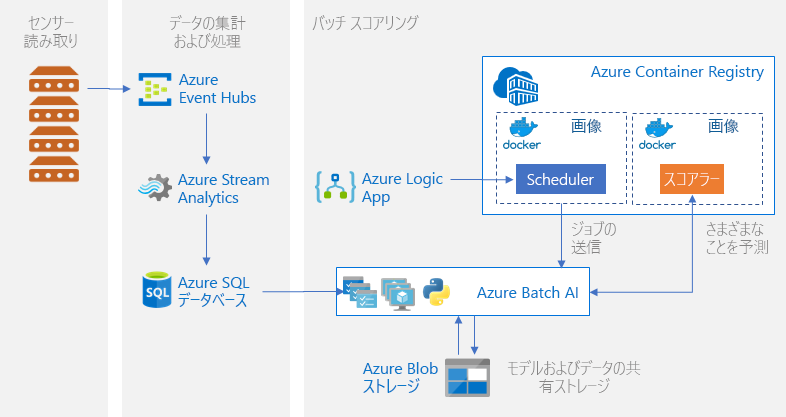

# Azure での Python モデルのバッチ スコアリング

この参照アーキテクチャでは、Azure Machine Learning service を使用して、スケジュールに従って多数のモデルのバッチ スコアリングを並列で実行するスケーラブルなソリューションをビルドする方法を示します。 このソリューションはテンプレートとして使用でき、さまざまな問題に対応するように汎用化できます。

このアーキテクチャのリファレンス実装は、[GitHub][github] で入手できます。

**シナリオ**: このソリューションでは、各デバイスがセンサーの測定値を継続的に送信する IoT 設定内の多数のデバイスの運用を監視します。 各デバイスには、定義済みの期間にわたって集計される一連の測定値が異常に該当するか否かを予測するために使用する必要がある、トレーニング済みの異常検出モデルが関連付けられていることを前提としています。 現実のシナリオでは、これは、トレーニングやリアルタイム スコアリングで使用する前に、フィルター処理や集計を行う必要があるセンサーの測定値のストリームが考えられます。 単純化するために、このソリューションでは、スコアリング ジョブを実行するときに同じデータ ファイルを使用します。

この参照アーキテクチャは、スケジュールに従ってトリガーされるワークロード用に設計されています。 処理には次の手順が含まれます。
1.  インジェストのセンサー読み取り値を、Azure Event Hubs に送信します。
2.  ストリーム処理を実行し、生データを保存します。
3.  処理を開始する準備ができている Machine Learning クラスターにデータを送信します。 クラスター内の各ノードで、特定のセンサーに対するスコアリング ジョブを実行します。 
4.  Machine Learning Python スクリプトを使用して並列でスコアリング ジョブを実行するスコアリング パイプラインを実行します。 パイプラインが作成および公開され、事前定義された間隔で実行されるようにスケジュールされます。
5.  予測を生成し、後で使用できるように Blob Storage に保存します。

## アーキテクチャ

このアーキテクチャは、次のコンポーネントで構成されます。

[Azure Event Hubs][event-hubs]。 このメッセージ インジェスト サービスでは、1 秒あたり数百万件のイベント メッセージを取り込むことができます。 このアーキテクチャでは、センサーがこのイベント ハブにデータ ストリームを送信します。

[Azure Stream Analytics][stream-analytics]。 イベント処理エンジンです。 Stream Analytics ジョブがイベント ハブからデータ ストリームを読み取り、ストリーム処理を実行します。

[Azure SQL Database][sql-database]。 センサー読み取り値のデータは、SQL Database に読み込まれます。 SQL は、処理済みのストリーミング データ (表形式および構造化) を格納するための一般的な方法ですが、他のデータ ストアを使用することもできます。

[Azure Machine Learning service][amls]。 Machine Learning は、大規模な機械学習モデルをトレーニング、スコアリング、デプロイ、および管理するためのクラウド サービスです。 バッチ スコアリングのコンテキストでは、Machine Learning は自動スケーリング オプションを使用してオンデマンドで仮想マシンのクラスターを作成し、クラスター内の各ノードで特定のセンサーに対するスコアリング ジョブを実行します。 スコアリング ジョブは、Machine Learning によってキューに登録されて管理される、Python スクリプトのステップとして、並列で実行されます。 これらのステップは、作成および公開され、事前定義された間隔で実行されるようにスケジュールされた Machine Learning パイプラインの一部です。

[Azure Blob Storage][storage]。 BLOB コンテナーを使用して、事前トレーニング済みモデル、データ、および出力予測が格納されます。 モデルは、Blob Storage の [01_create_resources.ipynb][create-resources] ノートブックにアップロードされます。 これらの [1 クラス SVM][one-class-svm] モデルが、異なるデバイスの異なるセンサーの値を表すデータでトレーニングされます。 このソリューションでは、固定された期間にわたってデータ値が集計されることを前提としています。

[Azure Container Registry][acr]。 スコアリング Python [スクリプト][pyscript]は、クラスターの各ノードに作成される Docker コンテナーで実行され、関連するセンサーのデータを読み取り、予測を生成して Blob Storage に格納します。

## パフォーマンスに関する考慮事項

標準的な Python モデルでは、CPU で十分にワークロードを処理できることが一般に認められています。 このアーキテクチャでは、CPU を使用します。 ただし、[ディープ ラーニング ワークロード][deep]では、通常は、CPU より GPU の方が優れています。多くの場合、同等のパフォーマンスを得るためには巨大な CPU クラスターが必要です。

### VM とコアの間の並列化

多数のモデルのスコアリング プロセスをバッチ モードで実行する場合は、VM 間でジョブを並列処理する必要があります。 2 つの方法が可能であり、

* 低コストの VM を使用して大規模なクラスターを作成する。

* 高パフォーマンスの VM を使用する小規模なクラスターを作成し、それぞれで複数のコアを使用できるようにする。

一般に、標準的な Python モデルのスコアリングはディープ ラーニング モデルのスコアリングほど負荷が高くないため、小規模のクラスターでキューに置かれた多数のモデルを効率的に処理できます。 データセットのサイズが大きくなったときに、クラスター ノードの数を増やすことができます。

このシナリオでは便宜上、単一の Machine Learning パイプライン ステップ内で 1 つのスコアリング タスクを送信します。 ただし、同じパイプライン ステップ内で複数のデータ チャンクをスコアリングすることで、効率を上げることができます。 この場合は、単一ステップの実行中に、複数のデータセットを読み取り、それらに対してスコアリング スクリプトを実行するカスタム コードを記述します。

## 管理の考慮事項

- **ジョブの監視**。 実行中のジョブの進行状況を監視することは重要ですが、アクティブ ノードのクラスターを監視することは困難である可能性があります。 クラスター内のノードの状態を調べるには、[Azure portal][portal] を使用して、[機械学習ワークスペース][ml-workspace]を管理します。 ノードが非アクティブになった場合、またはジョブが失敗した場合は、エラー ログが Blob Storage に保存され、[パイプライン] セクションからアクセスすることもできます。 監視を強化するには、ログを [Application Insights][app-insights] に接続するか、クラスターとそのジョブの状態をポーリングする別のプロセスを実行します。
-   **ログの記録**。 Machine Learning service では、関連付けられている Azure ストレージ アカウントにすべての stdout/stderr が記録されます。 ログ ファイルを簡単に表示するには、[Azure Storage Explorer][explorer] などのストレージ ナビゲーション ツールを使用します。

## コストに関する考慮事項

この参照アーキテクチャで使用される最も高価なコンポーネントは、コンピューティング リソースです。 コンピューティング クラスターのサイズは、キュー内のジョブに応じて、スケールアップおよびスケールダウンされます。 自動スケーリングは、Python SDK を介してコンピューティングのプロビジョニング構成を変更することで、プログラムから有効にします。 または、[Azure CLI][cli] を使用して、クラスターの自動スケーリング パラメーターを設定します。

即時処理を必要としない作業の場合は、既定の状態 (最小) が 0 個のノードのクラスターになるように、自動スケーリング式を構成します。 この構成では、クラスターは 0 個のノードで開始し、キュー内でジョブが検出されたときのみスケールアップします。 バッチ スコアリング プロセスが 1 日に数回以下しか発生しない場合は、この設定により大幅なコスト削減を実現できます。

非常に短い間隔で発生するバッチ ジョブでは、自動スケーリングは適切ではない場合があります。 クラスターの起動と停止に要する時間にもコストがかかるので、前のジョブの終了後ほんの数分でバッチ ワークロードが開始する場合は、ジョブ間もクラスターを実行したままにする方がコスト効率がよくなる可能性があります。 これは、スコアリング プロセスが高い頻度で (たとえば 1 時間ごとに) 実行されるようにスケジュールされるか、低い頻度で (たとえば 1 か月に 1 回) 実行されるようにスケジュールされるかによって決まります。

## Deployment

この参照アーキテクチャを展開するには、[GitHub リポジトリ][github]で説明されている手順に従ってください。

[acr]: /azure/container-registry/container-registry-intro
[ai]: /azure/application-insights/app-insights-overview
[aml-compute]: /azure/machine-learning/service/how-to-set-up-training-targets#amlcompute
[amls]: /azure/machine-learning/service/overview-what-is-azure-ml
[automatic-scaling]: /azure/batch/batch-automatic-scaling
[azure-files]: /azure/storage/files/storage-files-introduction
[cli]: https://docs.microsoft.com/en-us/cli/azure
[create-resources]: https://github.com/Microsoft/AMLBatchScoringPipeline/blob/master/01_create_resources.ipynb
[deep]: /azure/architecture/reference-architectures/ai/batch-scoring-deep-learning
[event-hubs]: /azure/event-hubs/event-hubs-geo-dr
[explorer]: https://azure.microsoft.com/en-us/features/storage-explorer/
[github]: https://github.com/Microsoft/AMLBatchScoringPipeline
[one-class-svm]: http://scikit-learn.org/stable/modules/generated/sklearn.svm.OneClassSVM.html
[portal]: https://portal.azure.com
[ml-workspace]: https://docs.microsoft.com/en-us/azure/machine-learning/studio/create-workspace
[python-script]: https://github.com/Azure/BatchAIAnomalyDetection/blob/master/batchai/predict.py
[pyscript]: https://github.com/Microsoft/AMLBatchScoringPipeline/blob/master/scripts/predict.py
[storage]: /azure/storage/blobs/storage-blobs-overview
[stream-analytics]: /azure/stream-analytics/
[sql-database]: https://docs.microsoft.com/en-us/azure/sql-database/
[app-insights]: https://docs.microsoft.com/en-us/azure/application-insights/app-insights-overview
