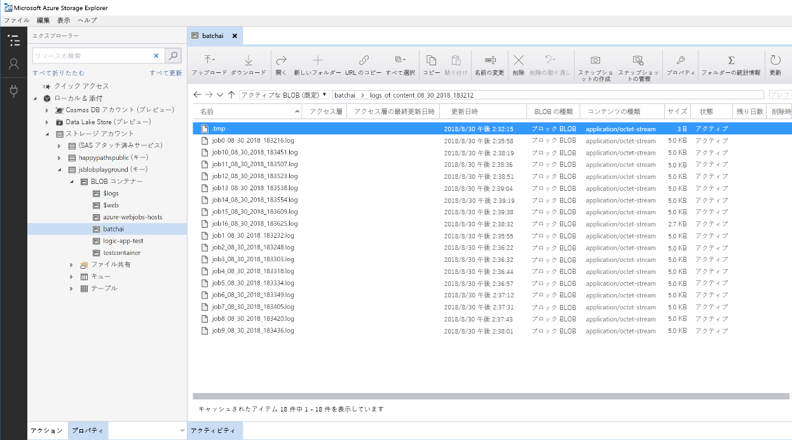

# Azure での Python モデルのバッチ スコアリング

この参照アーキテクチャでは、Azure Batch AI を使用して、スケジュールに従って複数のモデルのバッチ スコアリングを並列で実行するスケーラブルなソリューションをビルドする方法を示します。 このソリューションはテンプレートとして使用でき、さまざまな問題に対応するように汎用化できます。

このアーキテクチャのリファレンス実装は、 [GitHub][github] で入手できます。

**シナリオ**:このソリューションでは、各デバイスがセンサーの測定値を継続的に送信する IoT 設定内の多数のデバイスの運用を監視します。 各デバイスには、定義済みの期間にわたって集計される一連の測定値が異常に該当するか否かを予測するために使用する必要がある、トレーニング済みの異常検出モデルが存在することを前提としています。 現実のシナリオでは、これは、トレーニングやリアルタイム スコアリングで使用する前に、フィルター処理や集計を行う必要があるセンサーの測定値のストリームが考えられます。 単純化するために、このソリューションでは、スコアリング ジョブを実行するときに同じデータ ファイルを使用します。

## アーキテクチャ

このアーキテクチャは、次のコンポーネントで構成されます。

[Azure Event Hubs][event-hubs]。 このメッセージ インジェスト サービスでは、1 秒あたり数百万件のイベント メッセージを取り込むことができます。 このアーキテクチャでは、センサーがこのイベント ハブにデータ ストリームを送信します。

[Azure Stream Analytics][stream-analytics]。 イベント処理エンジンです。 Stream Analytics ジョブがイベント ハブからデータ ストリームを読み取り、ストリーム処理を実行します。

[Azure Batch AI][batch-ai]。 この分散コンピューティング エンジンを使用して、Azure 上で機械学習モデルと AI モデルの大規模なトレーニングとテストを行います。 Batch AI は自動スケーリング オプションを使用してオンデマンドで仮想マシンを作成し、Batch AI クラスター内の各ノードで、特定のセンサーに対するスコアリング ジョブが実行されます。 スコアリング Python [スクリプト][python-script]は、クラスターの各ノードに作成される Docker コンテナーで実行され、関連するセンサーのデータを読み取り、予測を生成して Blob Storage に格納します。

[Azure Blob Storage][storage]。 BLOB コンテナーを使用して、事前トレーニング済みモデル、データ、および出力予測が格納されます。 モデルは、Blob Storage の [create\_resources.ipynb][create-resources] ノートブックにアップロードされます。 これらの [1 クラス SVM][one-class-svm] モデルが、異なるデバイスの異なるセンサーの値を表すデータでトレーニングされます。 このソリューションでは、固定された期間にわたってデータ値が集計されることを前提としています。

[Azure Logic Apps][logic-apps]。 このソリューションでは、1 時間ごとに Batch AI ジョブを実行するロジック アプリを作成します。 Logic Apps には、ソリューションのランタイム ワークフローとスケジュールを簡単に作成する方法が用意されています。 同じように Docker コンテナーで実行される Python [スクリプト][script]を使用して、Batch AI ジョブが送信されます。

[Azure Container Registry][acr]。 Docker イメージは Batch AI と Logic Apps の両方で使用され、[create\_resources.ipynb][create-resources] ノートブック内に作成された後、Container Registry にプッシュされます。 これにより、他の Azure サービス (このソリューションでは Logic Apps と Batch AI) を使用してイメージのホストとコンテナーのインスタンス化を行う便利な方法が提供されます。

## パフォーマンスに関する考慮事項

標準的な Python モデルでは、CPU で十分にワークロードを処理できることが一般に認められています。 このアーキテクチャでは、CPU を使用します。 ただし、[ディープ ラーニング ワークロード][deep]では、通常は、CPU より GPU の方が優れています。多くの場合、同等のパフォーマンスを得るためには巨大な CPU クラスターが必要です。

### VM とコアの間の並列化

多数のモデルのスコアリング プロセスをバッチ モードで実行する場合は、VM 間でジョブを並列処理する必要があります。 2 つの方法が可能です。 

* 低コストの VM を使用して大規模なクラスターを作成する。

* 高パフォーマンスの VM を使用する小規模なクラスターを作成し、それぞれで複数のコアを使用できるようにする。

一般に、標準的な Python モデルのスコアリングはディープ ラーニング モデルのスコアリングほど負荷が高くないため、小規模のクラスターでキューに置かれた多数のモデルを効率的に処理できます。 データセットのサイズが大きくなったときに、クラスター ノードの数を増やすことができます。

このシナリオでは、便宜上、単一の Batch AI ジョブ内で 1 つのスコアリング タスクを送信します。 ただし、同じ Batch AI ジョブ内で複数のデータ チャンクをスコアリングすることで、効率を上げることができます。 この場合は、単一の Batch AI ジョブの実行中に、複数のデータセットを読み取り、それらに対してスコアリング スクリプトを実行するカスタム コードを記述します。

### ファイル サーバー

Batch AI を使用する場合は、シナリオに必要なスループットに応じて、複数のストレージ オプションを選択できます。 スループットの要件が低いワークロードでは、Blob ストレージを使用すれば十分です。 また、Batch AI では、管理された単一ノード NFS である [Batch AI ファイル サーバー][bai-file-server]もサポートされています。これをクラスター ノードに自動的にマウントして、ジョブに対して一元的にアクセス可能な保存場所を提供できます。 ほとんどの場合、ワークスペースで必要なファイル サーバーは 1 つだけであり、トレーニング ジョブのデータを異なるディレクトリに分離することができます。

単一ノード NFS がワークロードに適していない場合、Batch AI では、[Azure Files][azure-files] やカスタム ソリューション (Gluster や Lustre ファイル システムなど) を含む他のストレージ オプションもサポートしています。

## 管理の考慮事項

### Batch AI ジョブの監視

実行中のジョブの進行状況を監視することは重要ですが、アクティブ ノードのクラスターを監視することは困難である可能性があります。 クラスターの全体的な状態を把握するには、[Azure Portal][portal] の **[Batch AI]** ブレードに移動して、クラスター内のノードの状態を調べます。 ノードが非アクティブになった場合、またはジョブが失敗した場合は、エラー ログが Blob ストレージに保存され、ポータルの **[ジョブ]** ブレードでもアクセスできます。

監視を強化するには、ログを [Application Insights][ai] に接続するか、Batch AI クラスターとそのジョブの状態をポーリングする別のプロセスを実行します。

### Batch AI でのログ

Batch AI では、関連する Azure ストレージ アカウントにすべての stdout/stderr が記録されます。 ログ ファイルを簡単にナビゲートするには、[Azure Storage Explorer][explorer] などのストレージ ナビゲーション ツールを使用します。

この参照アーキテクチャをデプロイするときに、シンプルなログ記録システムを設定するというオプションがあります。 このオプションを使用すると、次に示すように、異なるジョブのすべてのログが BLOB コンテナー内の同じディレクトリに保存されます。 これらのログを使用して、各ジョブと各イメージを処理するのにかかる時間を監視することで、プロセスを最適化する方法を理解できます。

## コストに関する考慮事項

この参照アーキテクチャで使用される最も高価なコンポーネントは、コンピューティング リソースです。

Batch AI クラスターのサイズは、キュー内のジョブに応じて、スケールアップおよびスケールダウンされます。 2 つの方法のいずれかで、Batch AI を使用した[自動スケーリング][automatic-scaling]を有効にできます。 プログラムで行う場合は、[デプロイ手順][github]の一部である .env ファイル内に構成できます。クラスターの作成後に、スケーリング式をポータルで直接変更することもできます。

即時処理を必要としない作業の場合は、既定の状態 (最小) が 0 個のノードのクラスターになるように、自動スケーリング式を構成します。 この構成では、クラスターは 0 個のノードで開始し、キュー内でジョブが検出されたときのみスケールアップします。 バッチ スコアリング プロセスが 1 日に数回以下しか発生しない場合は、この設定により大幅なコスト削減を実現できます。

非常に短い間隔で発生するバッチ ジョブでは、自動スケーリングは適切ではない場合があります。 クラスターの起動と停止に要する時間にもコストがかかるので、前のジョブの終了後ほんの数分でバッチ ワークロードが開始する場合は、ジョブ間もクラスターを実行したままにする方がコスト効率がよくなる可能性があります。 これは、スコアリング プロセスが高い頻度で (たとえば 1 時間ごとに) 実行されるようにスケジュールされるか、低い頻度で (たとえば 1 か月に 1 回) 実行されるようにスケジュールされるかによって決まります。

## ソリューションのデプロイ方法

このアーキテクチャのリファレンス実装は、[GitHub][github] で入手できます。 記載されているセットアップ手順に従って、Batch AI を使用して多数のモデルを並列でスコアリングするスケーラブルなソリューションをビルドします。

[acr]: /azure/container-registry/container-registry-intro
[ai]: /azure/application-insights/app-insights-overview
[automatic-scaling]: /azure/batch/batch-automatic-scaling
[azure-files]: /azure/storage/files/storage-files-introduction
[batch-ai]: /azure/batch-ai/
[bai-file-server]: /azure/batch-ai/resource-concepts#file-server
[create-resources]: https://github.com/Azure/BatchAIAnomalyDetection/blob/master/create_resources.ipynb
[deep]: /azure/architecture/reference-architectures/ai/batch-scoring-deep-learning
[event-hubs]: /azure/event-hubs/event-hubs-geo-dr
[explorer]: https://azure.microsoft.com/en-us/features/storage-explorer/
[github]: https://github.com/Azure/BatchAIAnomalyDetection
[logic-apps]: /azure/logic-apps/logic-apps-overview
[one-class-svm]: http://scikit-learn.org/stable/modules/generated/sklearn.svm.OneClassSVM.html
[portal]: https://portal.azure.com
[python-script]: https://github.com/Azure/BatchAIAnomalyDetection/blob/master/batchai/predict.py
[script]: https://github.com/Azure/BatchAIAnomalyDetection/blob/master/sched/submit_jobs.py
[storage]: /azure/storage/blobs/storage-blobs-overview
[stream-analytics]: /azure/stream-analytics/
