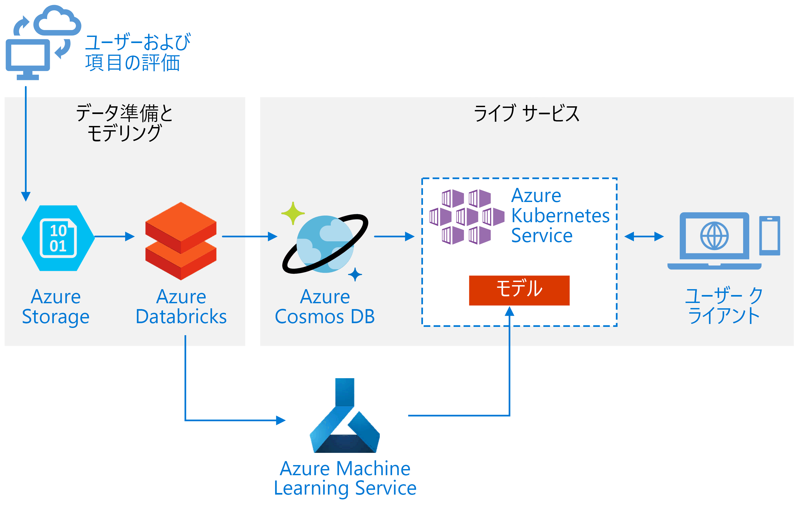
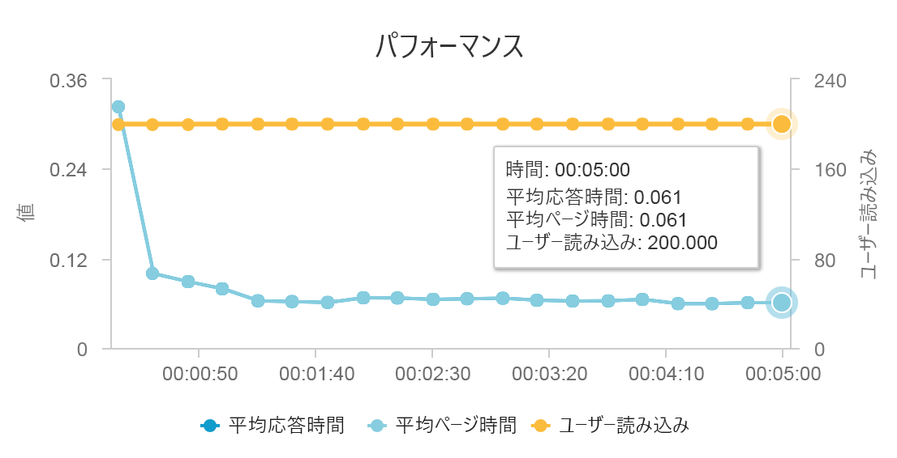
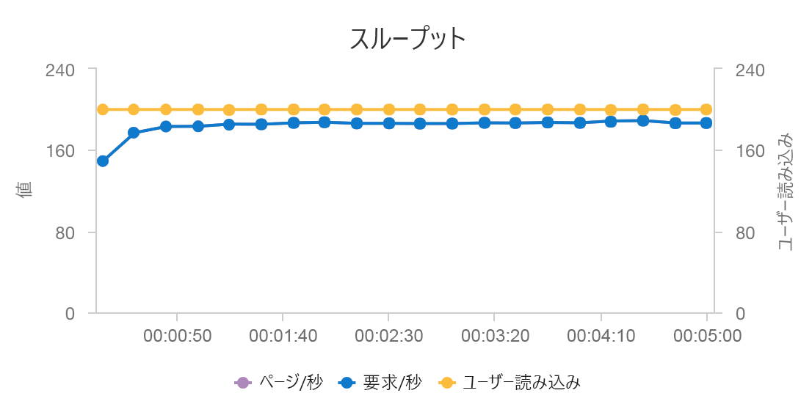

# <a name="build-a-real-time-recommendation-api-on-azure"></a>Azure 上でリアルタイム レコメンデーション API を構築する

この参照アーキテクチャは、Azure Databricks を使用してレコメンデーション モデルをトレーニングし、Azure Cosmos DB、Azure Machine Learning、および Azure Kubernetes Service (AKS) を使用して API としてデプロイする方法を示します。 このアーキテクチャは、製品、映画、およびニュースに関するレコメンデーションを含め、ほとんどのレコメンデーション エンジンのシナリオに一般化することができます。

このアーキテクチャの参照実装は、[GitHub](https://github.com/Microsoft/Recommenders/blob/master/notebooks/05_operationalize/als_movie_o16n.ipynb) で入手できます



**シナリオ**: あるメディア組織は、ユーザーに映画またはビデオのレコメンデーションを提供したいと考えています。 組織は、パーソナライズされたレコメンデーションを提供することで、クリックスルー率の向上、サイトのエンゲージメントの向上、ユーザー満足度の向上など、いくつかのビジネス目標を達成します。

この参照アーキテクチャは、特定のユーザーに上位 10 個の映画のレコメンデーションを提供できるリアルタイム レコメンダー サービス API をトレーニングおよびデプロイするためのものです。

このレコメンデーション モデルのデータ フローは次のとおりです。

1. ユーザーの動作を追跡します。 たとえば、ユーザーが映画を評価したときや製品やニュースの記事をクリックしたときに、バックエンド サービスでログを記録することができます。

2. このデータを、使用できる[データ ソース][data-source]から Azure Databricks に読み込みます。

3. データを準備し、それをトレーニング セットとテスト セットに分割してモデルをトレーニングします ([このガイド][guide]では、データを分割するための選択肢が説明されています)。

4. データに合わせて [Spark の Collaborative Filtering][als] モデルを調整します。

5. 評価とランク付けのメトリックを使用してモデルの品質を評価します ([このガイド][eval-guide]では、レコメンダーを評価できるメトリックについて詳しく説明されています)。

6. ユーザーごとに上位 10 個のレコメンデーションを事前に計算し、Azure Cosmos DB にキャッシュとして保存します。

7. Azure Machine Learning API を使用して API サービスを AKS にデプロイし、API をコンテナー化してデプロイします。

8. バックエンド サービスによってユーザーから要求が取得されたら、AKS 内でホストされているレコメンデーション API を呼び出して上位 10 個のレコメンデーションを取得し、それらをユーザーに表示します。

## <a name="architecture"></a>アーキテクチャ

このアーキテクチャは、次のコンポーネントで構成されます。

[Azure Databricks][databricks]。 Databricks は、入力データを準備し、Spark クラスター上でレコメンダー モデルをトレーニングするために使用される開発環境です。 また、Azure Databricks には、データ処理タスクや機械学習タスクのためにノートブック上で実行して共同作業することができる対話型ワークスペースも用意されています。

[Azure Kubernetes Service][aks] (AKS)。 AKS は、Kubernetes クラスターに機械学習モデル サービス API をデプロイして運用化するために使用されます。 AKS はコンテナー化されたモデルをホストし、スループット要件、ID とアクセス管理、ログ記録と正常性の監視を満たすスケーラビリティを実現しています。

[Azure Cosmos DB][cosmosdb]。 Cosmos DB は、各ユーザーのおすすめ映画上位 10 個を保存するために使用されるグローバルに分散されたデータベース サービスです。 特定のユーザーの上位のおすすめ項目を読み取るためにかかる待機時間が短い (99 パーセンタイルで 10 ミリ秒) ので、Azure Cosmos DB はこのシナリオに適しています。

[Azure Machine Learning service][mls]。 このサービスは、機械学習モデルを追跡および管理し、そのモデルをパッケージ化してスケーラブルな AKS 環境にデプロイするために使用されます。

[Microsoft Recommenders][github]。 このオープンソース リポジトリには、レコメンダー システムの構築、評価、および運用化を始める際に役立つユーティリティ コードとサンプルが含まれています。

## <a name="performance-considerations"></a>パフォーマンスに関する考慮事項

通常、レコメンデーションは、ユーザーがサイトに対して行う要求のクリティカル パスに含まれるため、パフォーマンスはリアルタイム レコメンデーションの主な考慮事項です。

AKS と Azure Cosmos DB の組み合わせることで、このアーキテクチャは、最小限のオーバーヘッドで中規模のワークロード向けにレコメンデーションを提供するために適した出発点となります。 200 人の同時ユーザーによる負荷テストでは、このアーキテクチャは約 60 ミリ秒の中央値の待機時間でレコメンデーションを提供し、1 秒あたり 180 要求のスループットで実行されます。 この負荷テストは、既定のデプロイ構成 (Azure Cosmos DB 用にプロビジョニングされた 12 vCPU、42 GB のメモリ、および 11,000 [要求ユニット (RU)/秒][ru]の 3x D3 v2 AKS クラスター) に対して実行されました。





Azure Cosmos DB は、ターンキーのグローバル配布と、アプリが持っているデータベース要件を満たす上での有用性により推奨されています。 [待機時間がやや短い][latency]ため、参照の処理には Azure Cosmos DB ではなく [Azure Redis Cache][redis] を使用することを検討してください。 Redis Cache で、バックエンド ストア内のデータへの依存度が高いシステムのパフォーマンスを向上することができます。

## <a name="scalability-considerations"></a>スケーラビリティに関する考慮事項

Spark を使用する予定がない場合、またはワークロードが小規模で分散が不要な場合は、Azure Databricks ではなく [Data Science Virtual Machine][dsvm] (DSVM) を使用することを検討してください。 DSVM は、機械学習とデータ サイエンス向けのディープ ラーニング フレームワークとツールを備えた Azure 仮想マシンです。 Azure Databricks と同様に、DSVM で作成したモデルは、Azure Machine Learning を介して AKS 上のサービスとして運用化することができます。

トレーニング時は、より大きい固定サイズの Spark クラスターを Azure Databricks にプロビジョニングするか、[自動スケーリング][autoscaling]を構成します。 自動スケーリングが有効な場合、Databricks ではクラスターの負荷が監視され、必要に応じてスケールアップまたはスケールダウンされます。 大規模なデータ サイズで、データの準備またはモデリング タスクにかかる時間を短縮したい場合は、より大きなクラスターをプロビジョニングまたはスケールアウトします。

パフォーマンスとスループットの要件を満たすように AKS クラスターをスケールします。 クラスターを十分に活用するために[ポッド][scale]の数をスケールアップし、サービスの要件を満たすようにクラスターの[ノード][nodes]をスケールすることに留意します。 レコメンデーション サービスのパフォーマンスとスループットの要件を満たすようにクラスターをスケールする方法の詳細については、「[Scaling Azure Container Service Clusters (Azure Container Service クラスターのスケール)][blog]」を参照してください。

Azure Cosmos DB のパフォーマンスを管理するには、1 秒間に必要な読み取り数を見積もり、必要な[秒あたりの RU][ru] (スループット) の数をプロビジョニングします。 [パーティション分割と水平スケーリング][partition-data]のベスト プラクティスを使用してください。

## <a name="cost-considerations"></a>コストに関する考慮事項

このシナリオにおけるコストの主な要因は次のとおりです。

- トレーニングに必要な Azure Databricks クラスターのサイズ。
- パフォーマンス要件を満たすために必要な AKS クラスターのサイズ。
- パフォーマンス要件を満たすためにプロビジョニングされる Azure Cosmos DB RU。

頻度が低い場合は再トレーニングを少なくし、使用していない場合は Spark クラスターをオフにすることで、Azure Databricks のコストを管理します。 AKS と Azure Cosmos DB のコストはサイトに必要なスループットとパフォーマンスに左右され、サイトへのトラフィック量に応じてスケールアップまたはスケールダウンします。

## <a name="deploy-the-solution"></a>ソリューションのデプロイ方法

このアーキテクチャをデプロイするには、まず Azure Databricks 環境を作成してデータを準備し、レコメンデーション モデルをトレーニングします。

1. [Azure Databricks ワークスペース][workspace]を作成します。

2. Azure Databricks で新しいクラスターを作成します。 次の構成が必要です。

    - クラスター モード:Standard
    - Databricks Runtime のバージョン:4.1 (Apache Spark 2.3.0、Scala 2.11 など)
    - Python のバージョン:3
    - ドライバーの種類:Standard\_DS3\_v2
    - worker の種類:Standard\_DS3\_v2 (必要に応じて最小および最大)
    - 自動終了: (必要に応じて)
    - Spark の構成: (必要に応じて)
    - 環境変数: (必要に応じて)

3. ローカル コンピューターに [Microsoft Recommenders][github] リポジトリを複製します。

4. Recommenders フォルダー内の内容を zip 形式で圧縮します。

    ```console
    cd Recommenders
    zip -r Recommenders.zip
    ```

5. Recommenders ライブラリを次のようにクラスターにアタッチします。

    1. 次のメニューで、ライブラリをインポートするオプション (["To import a library, such as a jar or egg, click here]\(jar や egg などのライブラリをインポートするにはここをクリックしてください\)) を使用し、**[click here]\(ここをクリック\)** を押します。

    2. 最初のドロップダウン メニューで、**[Upload Python egg or PyPI]\(Python egg または PyPI のアップロード\)** オプションを選択します。

    3. **[Drop library egg here to upload]\(ここにライブラリ egg をドロップしてアップロード\)** を選択し、先ほど作成した Recommenders.zip ファイルを選択します。

    4. **[Create library]\(ライブラリの作成\)** を選択して .zip ファイルをアップロードし、ワークスペースで使用できるようにします。

    5. 次のメニューで、ライブラリをクラスターにアタッチします。

6. ワークスペースに [ALS Movie Operationalization の例][als-example]をインポートします。

7. ALS Movie Operationalization ノートブックを実行して、特定のユーザーに上位 10 個のおすすめ映画を提供するレコメンデーション API を作成するために必要なリソースを作成します。

## <a name="related-architectures"></a>関連するアーキテクチャ

Spark と Azure Databricks を使用して、スケジュールされた[バッチスコアリング プロセス][batch-scoring]を実行する参照アーキテクチャも構築しました。 新しい推奨事項を日常的に作成するために推奨されるアプローチを理解するには、その参照アーキテクチャを参照してください。

<!-- links -->
[aci]: /azure/container-instances/container-instances-overview
[aad]: /azure/active-directory-b2c/active-directory-b2c-overview
[aks]: /azure/aks/intro-kubernetes
[als]: https://spark.apache.org/docs/latest/ml-collaborative-filtering.html
[als-example]: https://github.com/Microsoft/Recommenders/blob/master/notebooks/04_operationalize/als_movie_o16n.ipynb
[autoscaling]: https://docs.azuredatabricks.net/user-guide/clusters/sizing.html
[autoscale]: https://docs.azuredatabricks.net/user-guide/clusters/sizing.html#autoscaling
[availability]: /azure/architecture/checklist/availability
[batch-scoring]: /azure/architecture/reference-architectures/ai/batch-scoring-databricks
[blob]: /azure/storage/blobs/storage-blobs-introduction
[blog]: https://blogs.technet.microsoft.com/machinelearning/2018/03/20/scaling-azure-container-service-cluster/
[clusters]: https://docs.azuredatabricks.net/user-guide/clusters/configure.html
[cosmosdb]: /azure/cosmos-db/introduction
[data-source]: https://docs.azuredatabricks.net/spark/latest/data-sources/index.html
[databricks]: /azure/azure-databricks/what-is-azure-databricks
[dsvm]: /azure/machine-learning/data-science-virtual-machine/overview
[dsvm-ubuntu]: /azure/machine-learning/data-science-virtual-machine/dsvm-ubuntu-intro
[eval-guide]: https://github.com/Microsoft/Recommenders/blob/master/notebooks/03_evaluate/evaluation.ipynb
[free]: https://azure.microsoft.com/free/?WT.mc_id=A261C142F
[github]: https://github.com/Microsoft/Recommenders
[guide]: https://github.com/Microsoft/Recommenders/blob/master/notebooks/01_prepare_data/data_split.ipynb
[latency]: https://github.com/jessebenson/azure-performance
[mls]: /azure/machine-learning/service/
[n-tier]: /azure/architecture/reference-architectures/n-tier/n-tier-cassandra
[ndcg]: https://en.wikipedia.org/wiki/Discounted_cumulative_gain
[nodes]: /azure/aks/scale-cluster
[notebook]: https://github.com/Microsoft/Recommenders/notebooks/00_quick_start/als_pyspark_movielens.ipynb
[partition-data]: /azure/cosmos-db/partition-data
[redis]: /azure/redis-cache/cache-overview
[regions]: https://azure.microsoft.com/global-infrastructure/services/?products=virtual-machines&regions=all
[resiliency]: /azure/architecture/resiliency/
[ru]: /azure/cosmos-db/request-units
[sec-docs]: /azure/security/
[setup]: https://github.com/Microsoft/Recommenders/blob/master/SETUP.md%60
[scale]: /azure/aks/tutorial-kubernetes-scale
[sla]: https://azure.microsoft.com/support/legal/sla/virtual-machines/v1_8/
[vm-size]: /azure/virtual-machines/virtual-machines-linux-change-vm-size
[workspace]: https://docs.azuredatabricks.net/getting-started/index.html
