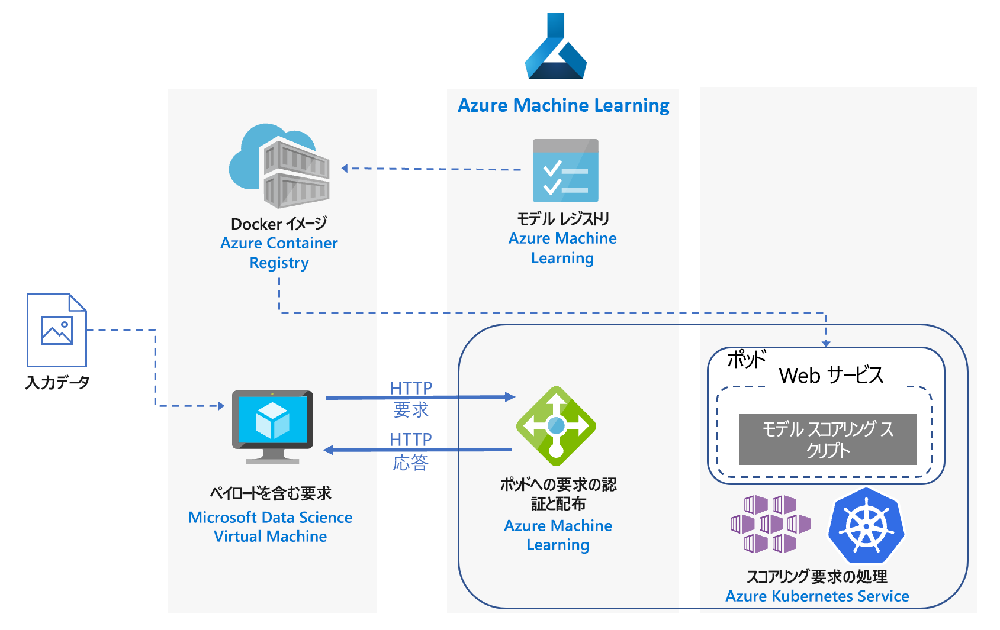
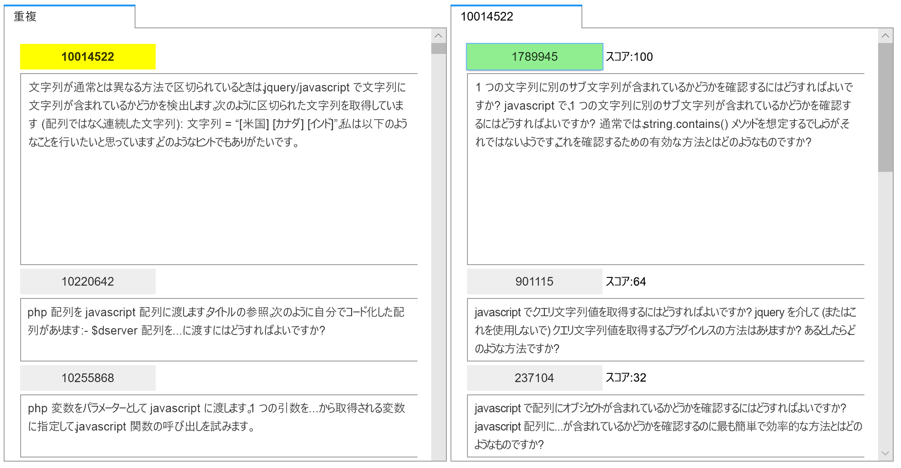
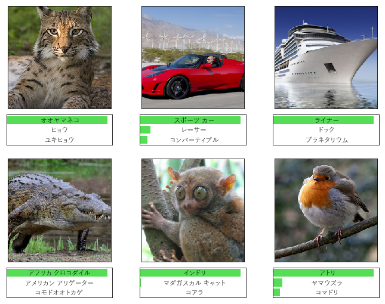

# Azure での Python scikit-learn モデルおよびディープ ラーニング モデルのリアルタイム スコアリング

この参照アーキテクチャでは、Python モデルを Web サービスとしてデプロイして、リアルタイムの予測を行う方法を示します。 ここでは 2 つのシナリオについて説明します。1 つは通常の Python モデルのデプロイで、もう 1 つはディープ ラーニング モデルのデプロイという特定の要件です。 ここで示すアーキテクチャは、両方のシナリオで使用されています。

このアーキテクチャの 2 つの参照実装は GitHub から入手でき、1 つは[通常の Python モデル][github-python]、もう 1 つ[はディープ ラーニング モデル][github-dl]を対象としています。

## シナリオ

参照実装では、このアーキテクチャを使用して 2 つのシナリオを示します。

**シナリオ 1:FAQ 照合**。 このシナリオは、よく寄せられる質問 (FAQ) 照合モデルを Web サービスとしてデプロイし、ユーザーの質問を予測する方法を示しています。 このシナリオでは、アーキテクチャ ダイアグラムの "Input Data" によって、ユーザーの質問を含むテキスト文字列が参照され、FAQ の一覧と照合されます。 このシナリオは、Python 用の [scikit-learn][scikit] 機械学習ライブラリを対象にしていますが、Python モデルを使用してリアルタイムの予測を行う任意のシナリオ向けに汎用化できます。

このシナリオでは、JavaScript としてタグ付けされた元の質問、重複する質問、およびその回答を含む Stack Overflow 質問データのサブセットが使用されます。 元の質問それぞれについて、重複する質問と一致する可能性を予測するように scikit-learn パイプラインがトレーニングされます。 これらの予測は、REST API エンドポイントを使用してリアルタイムで行われます。

このアーキテクチャのアプリケーション フローは次のとおりです。

1. クライアントは、HTTP POST 要求を、エンコード済み質問データと一緒に送信します。

2. Flask アプリは、その要求から質問を抽出します。

3. 質問は scikit-learn パイプライン モデルに送信され、特徴付けとスコアリングが行われます。

4. 一致する FAQ の質問とそのスコアは JSON オブジェクトにパイプされ、クライアントに返されます。

結果を使用するサンプル アプリのスクリーンショットを次に示します。

**シナリオ 2:画像の分類**。 このシナリオは、畳み込みニューラル ネットワーク (CNN) モデルを Web サービスとしてデプロイし、画像に関する予測を提供する方法を示しています。 このシナリオでは、アーキテクチャ ダイアグラムの "Input Data" によって、画像ファイルが参照されます。 画像の分類やオブジェクト検出などのタスク向けのコンピューター ビジョンでは、CNN がきわめて効果的です。 このシナリオは、TensorFlow、Keras (TensorFlow バックエンドを含む)、および PyTorch フレームワークを対象にしています。 ただし、ディープ ラーニング モデルを使用してリアルタイムの予測を行う任意のシナリオ向けに汎用化できます。

このシナリオでは、ImageNet-1K (1,000 クラス) データセットで事前にトレーニングされた ResNet-152 モデルを使用して、画像がどのカテゴリに属すかを予測します (以下の図参照)。 これらの予測は、REST API エンドポイントを使用してリアルタイムで行われます。

ディープ ラーニング モデルのアプリケーション フローは次のとおりです。

1. クライアントは、HTTP POST 要求を、エンコード済み画像データと一緒に送信します。

2. Flask アプリは、その要求から画像を抽出します。

3. 画像は前処理されてモデルに送信され、スコアリングが行われます。

4. スコアリングの結果は JSON オブジェクトにパイプされ、クライアントに返されます。

## アーキテクチャ

このアーキテクチャは、次のコンポーネントで構成されます。

**[仮想マシン][vm]** (VM)。 VM は、HTTP 要求を送信できる &mdash;ローカルまたはクラウドの&mdash;デバイスの例として示されています。

**[Azure Kubernetes Service][aks]** (AKS) は、アプリケーションを Kubernetes クラスターにデプロイするときに使用されます。 AKS により、Kubernetes のデプロイと操作が簡略化されます。 クラスターを構成する場合、通常の Python モデルについては CPU のみの VM を使用し、ディープ ラーニング モデルについては GPU 対応 VM を使用します。

**[ロード バランサー][lb]**。 サービスを外部に公開するときに、AKS によってプロビジョニングされたロード バランサーが使用されます。 ロード バランサーからのトラフィックは、バックエンド ポッドに送信されます。

**[Docker Hub][docker]** は、Kubernetes クラスターにデプロイされている Docker イメージを格納するときに使用されます。 Docker Hub は、使いやすく、Docker ユーザーに対する既定のイメージ リポジトリであるため、このアーキテクチャに選択されました。 [Azure Container Registry][acr] を、このアーキテクチャに使用することもできます。

## パフォーマンスに関する考慮事項

リアルタイム スコアリング アーキテクチャでは、スループット パフォーマンスが主な考慮事項になります。 通常の Python モデルの場合は、CPU で十分にワークロードを処理できると一般に考えられています。

しかし、ディープ ラーニングのワークロードで速度がボトルネックになっているときは、一般的に CPU よりも GPU の方が優れた[パフォーマンス][gpus-vs-cpus]を発揮します。 CPU を使用して GPU に相当するパフォーマンスを実現するには、通常、多数の CPU を備えたクラスターが必要です。

どちらのシナリオでもこのアーキテクチャには CPU を使用できますが、ディープ ラーニング モデルの場合、GPU が提供するスループット値は、同じコストの CPU クラスターに比べてかなり高くなります。 AKS では GPU の使用がサポートされています。これは、このアーキテクチャに AKS を使用するメリットの 1 つです。 また、ディープ ラーニング デプロイで使用されるモデルには、通常、多数のパラメーターが含まれます。 GPU を使用することで、CPU のみのデプロイで問題になる、モデルと Web サービスの間のリソース競合を防ぐことができます。

## スケーラビリティに関する考慮事項

CPU のみの VM で AKS クラスターがプロビジョニングされている通常の Python モデルの場合、[ポッドの数をスケールアウト][manually-scale-pods]するときに注意が必要です。 目標は、クラスターを完全に利用することです。 スケーリングは、CPU 要求と、ポッドに対して定義されている制限によって左右されます。 また、Kubernetes ではポッドの[自動スケーリング][autoscale-pods]もサポートされ、CPU 使用率などの選ばれたメトリックに応じて、デプロイのポッド数が調整されます。 [クラスター オートスケーラー][autoscaler] (プレビュー) は、保留中のポッドに基づいてエージェント ノードをスケーリングできます。

GPU 対応 VM を使用しているディープ ラーニング シナリオでは、ポッドのリソース制限は、1 つのポッドに 1 つの GPU を割り当てる、といったものです。 使用する VM の種類に応じて[クラスターのノードをスケーリング][scale-cluster]して、サービスの需要に対応する必要があります。 これを簡単に行うには、Azure CLI と kubectl を使用します。

## 監視とログ記録に関する考慮事項

### AKS の監視

AKS のパフォーマンスを可視化するには、[コンテナーに対する Azure Monitor][monitor-containers] 機能を使用します。 この機能により、Kubernetes で使用可能なコントローラー、ノード、およびコンテナーから、メモリやプロセッサのメトリックが Metrics API 経由で収集されます。

アプリケーションのデプロイ中、AKS クラスターを監視して、想定どおりに動作していること、すべてのノードが運用可能で、すべてのポッドが実行中であることを確認します。 [kubectl][kubectl] コマンドライン ツールを使用してポッドの状態を取得できますが、Kubernetes にも、クラスターの状態の基本的な監視と管理のための Web ダッシュボードがあります。

クラスターとノードの全体的な状態を確認するには、Kubernetes ダッシュボードの **[ノード]** セクションに移動します。 ノードが非アクティブか失敗した場合は、そのページからエラー ログを表示できます。 同様に、ポッドの数やデプロイの状態に関する情報を確認するには、**[ポッド]** セクションおよび **[デプロイ]** セクションに移動します。

### AKS のログ

AKS では、すべての stdout と stderr が、クラスター内のポッドのログに自動的に記録されます。 kubectl を使用すると、これらのログのほか、ノード レベルのイベントおよびログも確認できます。 詳細については、デプロイの手順を確認してください。

[コンテナー用の Azure Monitor][monitor-containers] を使用して、コンテナー化されたバージョンの Linux 用 Log Analytics エージェントを介してメトリックとログを収集します。こうしたメトリックやログは、Log Analytics ワークスペースに保存されます。

## セキュリティに関する考慮事項

[Azure Security Center][security-center] を使用すると、Azure リソースのセキュリティの状態を一元的に表示して把握できます。 Security Center は、潜在的なセキュリティ上の問題を監視し、デプロイのセキュリティの正常性を包括的に示します。ただし、AKS エージェント ノードは監視されません。 セキュリティ センターは、Azure サブスクリプションごとに構成されます。 [Azure サブスクリプションでの Security Center Standard の利用開始][get-started]に関するページの説明に従って、セキュリティ データの収集を有効にします。 データ収集を有効にすると、セキュリティ センターは、そのサブスクリプションに作成されているすべての VM を自動的にスキャンします。

**操作**。 Azure Active Directory (Azure AD) 認証トークンを使用して AKS クラスターにサインインするには、[ユーザー認証][aad-auth]に Azure AD を使用するように AKS を構成します。 また、クラスター管理者が、ユーザーの ID またはディレクトリ グループ メンバーシップに基づいて、Kubernetes のロールベースのアクセス制御 (RBAC) を構成することもできます。

[RBAC][rbac] を使用して、デプロイする Azure リソースへのアクセスを制御してください。 RBAC を使用すると、DevOps チームのメンバーに承認の役割を割り当てることができます。 ユーザーを複数の役割に割り当てることができ、よりきめ細かい[アクセス許可]のカスタム ロールを作成することができます。

**HTTPS**。 セキュリティのベスト プラクティスとして、アプリケーションでは HTTPS を強制して、HTTP 要求をリダイレクトします。 SSL を終了して HTTP 要求をリダイレクトするリバース プロキシをデプロイするには、[イングレス コントローラー][ingress-controller]を使用します。 詳細については、「[Azure Kubernetes Service (AKS) で HTTPS イングレス コントローラーを作成する][https-ingress]」を参照してください。

**[認証]**:  このソリューションでは、エンドポイントへのアクセスは制限されません。 エンタープライズ設定でアーキテクチャをデプロイするには、API キーによってエンドポイントをセキュリティで保護し、何らかの形式のユーザー認証をクライアント アプリケーションに追加します。

**コンテナー レジストリ**。 このソリューションでは、Docker イメージの格納にパブリック レジストリが使用されます。 アプリケーションが依存するコード、およびモデルは、このイメージ内に含まれています。 エンタープライズ アプリケーションでは、悪意のあるコードが実行されるのを防ぎ、コンテナー内の情報が侵害されないようにするために、プライベート レジストリを使用する必要があります。

**DDoS 保護**。 [DDoS Protection Standard][ddos] を有効にすることを検討します。 Azure プラットフォームの一部として基本な DDoS 保護が有効になりますが、DDoS Protection Standard により、特に Azure 仮想ネットワークのリソース向けにチューニングされた軽減機能が提供されます。

**ログの記録**。 ログ データを格納する前にベスト プラクティスを使用します。たとえば、セキュリティ不正アクセスに使用できるユーザー パスワードなどの情報を除去します。

## Deployment

この参照アーキテクチャを展開するには、GitHub リポジトリで説明されている手順に従ってください。

- [通常の Python のモデル][github-python]
- [ディープ ラーニング モデル][github-dl]

<!-- links -->

[aad-auth]: /azure/aks/aad-integration
[acr]: /azure/container-registry/
[something]: https://kubernetes.io/docs/reference/access-authn-authz/authentication/
[aks]: /azure/aks/intro-kubernetes
[autoscaler]: /azure/aks/autoscaler
[autoscale-pods]: /azure/aks/tutorial-kubernetes-scale#autoscale-pods
[azcopy]: /azure/storage/common/storage-use-azcopy-linux
[ddos]: /azure/virtual-network/ddos-protection-overview
[docker]: https://hub.docker.com/
[get-started]: /azure/security-center/security-center-get-started
[github-python]: https://github.com/Azure/MLAKSDeployment
[github-dl]: https://github.com/Microsoft/AKSDeploymentTutorial
[gpus-vs-cpus]: https://azure.microsoft.com/en-us/blog/gpus-vs-cpus-for-deployment-of-deep-learning-models/
[https-ingress]: /azure/aks/ingress-tls
[ingress-controller]: https://kubernetes.io/docs/concepts/services-networking/ingress/
[kubectl]: https://kubernetes.io/docs/tasks/tools/install-kubectl/
[lb]: /azure/load-balancer/load-balancer-overview
[manually-scale-pods]: /azure/aks/tutorial-kubernetes-scale#manually-scale-pods
[monitor-containers]: /azure/monitoring/monitoring-container-insights-overview
[アクセス許可]: /azure/aks/concepts-identity
[rbac]: /azure/active-directory/role-based-access-control-what-is
[scale-cluster]: /azure/aks/scale-cluster
[scikit]: https://pypi.org/project/scikit-learn/
[security-center]: /azure/security-center/security-center-intro
[vm]: /azure/virtual-machines/
