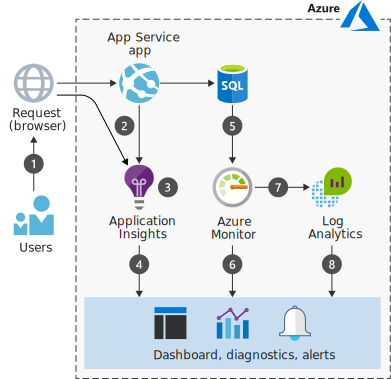

# Azure での Web アプリケーションの監視

Azure のサービスとしてのプラットフォーム (PaaS) オファリングによって、コンピューティング リソースが自動的に管理されます。また、これによりデプロイの監視方法が変わります。 Azure には、それぞれが特定の役割を果たす複数の監視サービスが含まれています。 また、これらのサービスが組み合わされた包括的なソリューションを使用すれば、お使いのアプリケーションやそれらを使用する Azure リソースからテレメトリを収集、分析し、それに基づいて対処できます。

このシナリオでは、使用できる監視サービスを扱い、複数のデータ ソースに使用できるデータフロー モデルについて説明します。 監視に関しては、多くのツールとサービスが Azure のデプロイメントで動作します。 このシナリオでは、使いやすいという理由のみで、そのまま利用できるサービスを選択します。 他の監視オプションについては、この記事で後述します。

## 関連するユース ケース

その他の関連するユース ケース:

- テレメトリを監視するための Web アプリケーションのインストルメント化。
- Azure 上にデプロイされているアプリケーションのフロントエンドおよびバックエンド テレメトリの収集。
- Azure 上のサービスに関連するメトリックとクォータの監視。

## アーキテクチャ

このシナリオでは、マネージド Azure 環境を使用してアプリケーション層とデータ層をホストします。 このシナリオのデータ フローは次のとおりです。

1. ユーザーはアプリケーションと対話します。
2. ブラウザーとアプリ サービスはテレメトリを出力します。
3. Application Insights は、正常性、パフォーマンス、使用状況のデータを収集して分析します。
4. 開発者と管理者は、正常性、パフォーマンス、および使用状況の情報を確認できます。
5. Azure SQL Database はテレメトリを出力します。
6. Azure Monitor は、インフラストラクチャのメトリックとクォータを収集して分析します。
7. Log Analytics は、ログとメトリックを収集して分析します。
8. 開発者と管理者は、正常性、パフォーマンス、および使用状況の情報を確認できます。

### コンポーネント

- [Azure App Service](/azure/app-service/) は、マネージド仮想マシンにアプリケーションを構築し、ホストするための PaaS サービスです。 アプリケーションが実行される基礎となるコンピューティング インフラストラクチャは、自動的に管理されます。 App Service には、リソース使用量のクォータとアプリのメトリック、診断情報のログ、メトリックに基づくアラートの監視機能があります。 さらに、Application Insights を使用して、異なるリージョンのアプリケーションをテストするための[可用性テスト][availability-tests]を作成することができます。
- [Application Insights][application-insights] は、開発者向けの拡張可能なアプリケーション パフォーマンス管理 (APM) サービスであり、複数のプラットフォームをサポートしています。 アプリケーションを監視し、パフォーマンスの低下や障害などのアプリケーションの異常を検出し、テレメトリを Azure portal に送信します。 Application Insights は、ログ、分散トレース、カスタム アプリケーションのメトリックにも使用できます。
- [Azure Monitor][azure-monitor] では、Azure のほとんどのサービスに対して、基礎レベルのインフラストラクチャの[メトリックとログ][metrics]を提供します。 複数の方法でメトリックを操作できます。たとえば、Azure portal でメトリックをグラフ化したり、REST API でアクセスしたり、PowerShell や CLI を使ってクエリを実行したりできます。 また、Azure Monitor は、[Log Analytics やその他のサービス]にデータを直接提供します。そのサービスでは、そのデータのクエリを実行して、オンプレミス上やクラウド内の他のソースのデータと組み合わせることができます。
- [Log Analytics][log-analytics] を使用すると、Application Insights で収集された使用状況およびパフォーマンスに関するデータと、アプリをサポートしている Azure Portal リソースの構成およびパフォーマンスに関するデータを関連付ける際に役立ちます。 このシナリオでは、[Azure Log Analytics エージェント][Azure Log Analytics agent] を使用して SQL Server 監査ログを Log Analytics にプッシュします。 Azure portal の Log Analytics ブレードでクエリを作成し、データを表示することができます。

## 考慮事項

推奨プラクティスは、開発中に [Application Insights SDK][Application Insights SDKs] を使用して Application Insights をご自身のコードに追加し、アプリケーションごとにカスタマイズすることです。 これらのオープンソースの SDK は、ほとんどのアプリケーション フレームワークで使用できます。 収集するデータを充実させて制御するには、テスト環境用と運用環境用の SDK の使用を開発プロセスに組み込む必要があります。 主な要件は、インターネットに面したアドレスでホストされている Applications Insights のインジェスト エンドポイントへの直接的または間接的な視線をアプリが持つことです。 これで、テレメトリを追加したり、既存のテレメトリ コレクションを充実させたりすることができるようになります。

ランタイムの監視も簡単に始めることができます。 収集されるテレメトリは、構成ファイルで制御する必要があります。 たとえば、[Application Insights Status Monitor][Application Insights Status Monitor] などのツールを使用して SDK を正しいフォルダーに配置し、適切な構成を追加して監視を開始するランタイム メソッドを含めることができます。

Application Insights と同様に、Log Analytics には、[複数のソースのデータを分析する][analyzing data across sources]ツール、複雑なクエリを作成するツール、特定条件下で[事前のアラートを送信する][sending proactive alerts]ツールが用意されています。 [Azure portal][the Azure portal] でテレメトリを確認することもできます。 Log Analytics では、[Azure Monitor][azure-monitor] などの既存の監視サービスに価値を追加し、オンプレミス環境を監視することもできます。

Application Insights と Log Analytics はどちらも [Azure Log Analytics クエリ言語][Azure Log Analytics Query Language]を使用しています。 また、[クロスリソース クエリ](https://azure.microsoft.com/blog/query-across-resources)を使用して、Application Insights と Log Analytics によって収集されたテレメトリを単一のクエリで分析することもできます。

Azure Monitor、Application Insights、Log Analytics のすべてから[アラート](/azure/monitoring-and-diagnostics/monitoring-overview-alerts)が送信されます。 たとえば、Azure Monitor は、CPU 使用率などのプラットフォーム レベルのメトリックについて通知します。一方、Application Insights は、サーバーの応答時間などのアプリケーションレベルのメトリックについて通知します。 Azure Monitor は、Azure アクティビティ ログの新しいイベントについて通知します。一方、Log Analytics は、使用するように構成されているサービスのメトリックまたはイベント データに関するアラートを発行できます。 [Azure Monitor の統合アラート](/azure/monitoring-and-diagnostics/monitoring-overview-unified-alerts)は、別の分類法を使用する、新しい Azure の統合アラート エクスペリエンスです。

### 代替手段

この記事では、一般的な機能に便利に使用できる監視オプションについて説明しますが、独自のログ メカニズムを作成するオプションなど、多くの選択肢があります。 推奨プラクティスは、ソリューションに階層を構築するときに監視サービスを追加することです。 ここでは、いくつかの拡張と代替案を紹介します。

- [Grafana 用 Azure Monitor データ ソース][Azure Monitor Data Source For Grafana]を使用して、Grafana で Azure Monitor と Application Insights のメトリックを統合します。
- [Data Dog][data-dog] は、Azure Monitor 用のコネクタを備えています
- [Azure Automation][Azure Automation] を使用して、監視機能を自動化します。
- [ITSM ソリューション][ITSM solutions]との通信を追加します。
- [管理ソリューション][management solution]を使用して Log Analytics を拡張します。

### スケーラビリティと可用性

このシナリオでは、監視のための PaaS ソリューションに焦点を当てています。これは、主に可用性とスケーラビリティが適切に処理され、サービス レベル アグリーメント (SLA) に基づいているからです。 たとえば、App Services には、その可用性を保証する [SLA][SLA] があります。

Application Insights は、1 秒あたりに処理できる要求の数について[制限][app-insights-limits]があります。 要求の制限を超えると、メッセージの調整が発生することがあります。 調整を回避するには、[フィルター処理][message-filtering]または[サンプリング][message-sampling]を実装してデータ レートを減らします

ただし、実行しているアプリの高可用性については、開発者が考慮する必要があります。 たとえば、スケールの詳細については、基本的な Web アプリケーションの参照アーキテクチャの[スケーラビリティに関する考慮事項](#scalability-considerations)のセクションを参照してください。 アプリをデプロイしたら、Application Insights を使用して[可用性を監視する][monitor its availability]テストを設定できます。

### セキュリティ

機密情報とコンプライアンスの要件は、データの収集、保持、および保存に影響します。 詳細については、[Application Insights][application-insights] と [Log Analytics][log-analytics] のテレメトリの処理方法を参照してください。

セキュリティに関する次の考慮事項も適用されることがあります。

- 開発者が独自のデータを収集したり、既存のテレメトリを充実させることができる場合は、個人情報の処理計画を立てます。
- データのリテンション期間を考慮します。 たとえば、Application Insights はテレメトリ データを 90 日間保持します。 Microsoft Power BI、Continuous Export、または REST API を使用して、長期間アクセスするデータをアーカイブします。 ストレージ料金が適用されます。
- Azure リソースへのアクセスを制限して、データへのアクセスと、特定のアプリケーションからテレメトリを表示できるユーザーを制御できます。 テレメトリの監視へのアクセスをロックする方法については、[Application Insights のリソース、ロール、およびアクセス制御][Resources, roles, and access control in Application Insights]に関するページを参照してください。
- アプリケーション コードの読み取り/書き込みアクセスを制御して、アプリケーションからのデータ インジェストを制限するバージョンまたはタグ マーカーをユーザーが追加しないようにするかどうかを検討します。 Application Insights では、個々のデータ項目がリソースに送信された後に制御できないため、ユーザーが任意のデータに対してアクセス権を持っている場合、個々のリソース内のすべてのデータにアクセスできます。
- 必要に応じて、Azure リソースに対してポリシーまたはコスト管理を適用するための[ガバナンス](/azure/security/governance-in-azure) メカニズムを追加します。 たとえば、ポリシーやロールベースのアクセス制御などのセキュリティ関連の監視に Log Analytics を使用することや、ポリシー定義の作成、割り当て、管理に [Azure Policy](/azure/azure-policy/azure-policy-introduction) を使用することができます。
- 潜在的なセキュリティの問題を監視し、Azure リソースのセキュリティ状態を一元的に確認するには、[Azure Security Center](/azure/security-center/security-center-intro) の使用を検討してください。

## 価格

監視料金は即時に追加される可能性があるため、事前に価格設定を検討し、監視対象を把握し、各サービスに関連する料金を確認してください。 Azure Monitor には無料の[基本的なメトリック][basic metrics]が用意されていますが、[Application Insights][application-insights-pricing] と [Log Analytics][log-analytics] の監視コストは、インジェストされるデータのサイズと実行するテストの数に基づいて変わります。

まず、[料金計算ツール][pricing]を使用してコストを見積もります。 特定のユース ケースについて料金の変化を確認するには、予想されるデプロイに合わせてさまざまなオプションを変更します。

Application Insights のテレメトリは、デバッグ中やアプリの公開後に Azure portal に送信されます。 テスト目的であり、料金の請求を避けるため、限られた量のテレメトリが装備されています。 さらにインジケーターを追加するには、テレメトリの上限を上げることができます。 詳細については、「[Application Insights におけるサンプリング][Sampling in Application Insights]」を参照してください。

デプロイ後に、パフォーマンス インジケーターの [Live Metrics Stream][Live Metrics Stream] を確認することができます。 このデータは保存されません (リアルタイムのメトリックは表示されます) が、テレメトリを収集して後で分析することができます。 Live Stream データの料金は発生しません。

Log Analytics では、サービスに取り込まれたデータがギガバイト (GB) 単位で課金されます。 毎月、Azure Log Analytics サービスにインジェストされる最初の 5 GB のデータは無料で提供されます。また、Log Analytics ワークスペース内のデータは、最初の 31 日間無料で保持されます。

## 次の手順

独自の監視ソリューションを初めて構築する場合に役立つリソースを次に示します。

[基本的な Web アプリケーションの参照アーキテクチャ][Basic web application reference architecture]

[ASP.NET Web アプリケーションの監視を開始する][Start monitoring your ASP.NET Web Application]

[Azure Virtual Machines に関するデータの収集][Collect data about Azure Virtual Machines]

## 関連リソース

[Azure のアプリケーションおよびリソースの監視][Monitoring Azure applications and resources]

[Azure Application Insights でランタイムの例外を見つけて診断する][Find and diagnose run-time exceptions with Azure Application Insights]

<!-- links -->
[architecture]: ./images/architecture-diagram-app-monitoring.svg
[availability-tests]: /azure/application-insights/app-insights-monitor-web-app-availability
[application-insights]: /azure/application-insights/app-insights-overview
[azure-monitor]: /azure/monitoring-and-diagnostics/monitoring-overview-azure-monitor
[metrics]: /azure/monitoring-and-diagnostics/monitoring-supported-metrics
[Log Analytics やその他のサービス]: /azure/log-analytics/log-analytics-azure-storage
[log-analytics]: /azure/log-analytics/log-analytics-overview
[Azure Log Analytics agent]: https://blogs.msdn.microsoft.com/sqlsecurity/2017/12/28/azure-log-analytics-oms-agent-now-collects-sql-server-audit-logs/
[application-insights-pricing]: https://azure.microsoft.com/pricing/details/application-insights/
[Application Insights SDKs]: /azure/application-insights/app-insights-asp-net
[Application Insights Status Monitor]: https://azure.microsoft.com/updates/application-insights-status-monitor-and-sdk-updated/
[analyzing data across sources]: /azure/log-analytics/log-analytics-dashboards
[sending proactive alerts]: /azure/log-analytics/log-analytics-alerts
[the Azure portal]: /azure/log-analytics/log-analytics-tutorial-dashboards
[Azure Log Analytics Query Language]: https://docs.loganalytics.io/docs/Learn
[cross-resource queries]: https://azure.microsoft.com/blog/query-across-resources/
[alerts]: /azure/monitoring-and-diagnostics/monitoring-overview-alerts
[Alerts (Preview)]: /azure/monitoring-and-diagnostics/monitoring-overview-unified-alerts
[Azure Monitor Data Source For Grafana]: https://grafana.com/plugins/grafana-azure-monitor-datasource
[Azure Automation]: /azure/automation/automation-intro
[ITSM solutions]: https://azure.microsoft.com/blog/itsm-connector-for-azure-is-now-generally-available/
[management solution]: /azure/monitoring/monitoring-solutions
[SLA]: https://azure.microsoft.com/support/legal/sla/app-service/v1_4/
[monitor its availability]: /azure/application-insights/app-insights-monitor-web-app-availability
[Resources, roles, and access control in Application Insights]: /azure/application-insights/app-insights-resources-roles-access-control
[basic metrics]: /azure/monitoring-and-diagnostics/monitoring-supported-metrics
[pricing]: https://azure.microsoft.com/pricing/calculator/#log-analyticsc126d8c1-ec9c-4e5b-9b51-4db95d06a9b1
[Sampling in Application Insights]: /azure/application-insights/app-insights-sampling
[Live Metrics Stream]: /azure/application-insights/app-insights-live-stream
[Basic web application reference architecture]: /azure/architecture/reference-architectures/app-service-web-app/basic-web-app#scalability-considerations
[Start monitoring your ASP.NET Web Application]: /azure/application-insights/quick-monitor-portal
[Collect data about Azure Virtual Machines]: /azure/log-analytics/log-analytics-quick-collect-azurevm
[Monitoring Azure applications and resources]: /azure/monitoring-and-diagnostics/monitoring-overview
[Find and diagnose run-time exceptions with Azure Application Insights]: /azure/application-insights/app-insights-tutorial-runtime-exceptions
[data-dog]: https://www.datadoghq.com/blog/azure-monitoring-enhancements/
[app-insights-limits]: /azure/azure-subscription-service-limits#application-insights-limits
[message-filtering]: /azure/application-insights/app-insights-api-filtering-sampling
[message-sampling]: /azure/application-insights/app-insights-sampling
