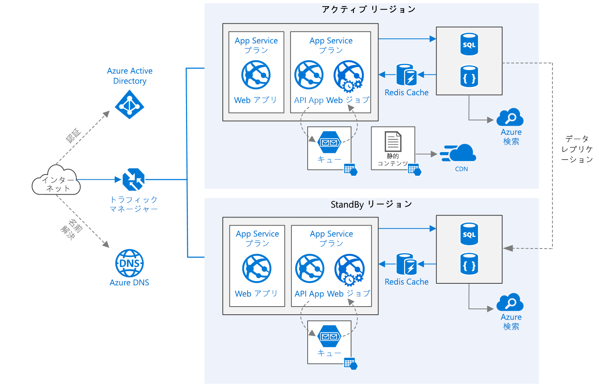

# <a name="run-a-web-application-in-multiple-regions"></a>Web アプリケーションを複数のリージョンで実行する
[!INCLUDE [header](../../_includes/header.md)]

このリファレンス アーキテクチャは、Azure App Service アプリケーションを複数のリージョンで実行して高可用性を実現する方法を示しています。 

 

"*このアーキテクチャの [Visio ファイル][visio-download]をダウンロードします。*"

## <a name="architecture"></a>アーキテクチャ 

このアーキテクチャは、「[Web アプリケーションのスケーラビリティの向上][guidance-web-apps-scalability]」で説明されているアーキテクチャの上に構築されています。 主な違いは次のとおりです。

* **プライマリ リージョンとセカンダリ リージョン**。 このアーキテクチャでは、2 つのリージョンを使用して、高可用性を実現します。 アプリケーションは、各リージョンにデプロイされます。 通常の運用中は、ネットワーク トラフィックはプライマリ リージョンにルーティングされます。 プライマリ リージョンが使用できなくなった場合、トラフィックはセカンダリ リージョンにルーティングされます。 
* **Azure DNS**。 [Azure DNS][azure-dns] は、DNS ドメインのホスティング サービスであり、Microsoft Azure インフラストラクチャを使用した名前解決を提供します。 Azure でドメインをホストすることで、その他の Azure サービスと同じ資格情報、API、ツール、課金情報を使用して DNS レコードを管理できます。
* **Azure Traffic Manager**。 [Traffic Manager][traffic-manager] は、着信要求をプライマリ リージョンにルーティングします。 そのリージョンで実行されているアプリケーションが使用できなくなった場合、Traffic Manager はセカンダリ リージョンへのフェールオーバーを実行します。
* SQL Database と Cosmos DB の **Geo レプリケーション**。 

マルチリージョン アーキテクチャは、単一のリージョンにデプロイするよりも高い可用性を提供できます。 地域的な停止がプライマリ リージョンに影響する場合は、[Traffic Manager][traffic-manager] を使用して、セカンダリ リージョンにフェールオーバーできます。 このアーキテクチャは、アプリケーションの個々のサブシステムが失敗した場合にも役立ちます。

リージョン間で高可用性を実現する一般的な方法はいくつかあります。 

* アクティブ/パッシブ (ホット スタンバイ)。 トラフィックが片方のリージョンにルーティングされている間、他方のリージョンは、ホット スタンバイ状態で待機します。 ホット スタンバイとは、セカンダリ リージョン内の VM が割り当て済みであり、常に実行されていることを意味します。
* アクティブ/パッシブ (コールド スタンバイ)。 トラフィックが片方のリージョンにルーティングされている間、他方のリージョンは、コールド スタンバイ状態で待機します。 コールド スタンバイとは、セカンダリ リージョン内の VM がフェールオーバーが必要になるまで割り当てられないことを意味します。 この方法のほうが実行コストは低くなりますが、ほとんどの場合、障害発生時にオンラインになるまでの時間が長くなります。
* アクティブ/アクティブ。 両方のリージョンがアクティブであり、要求はそれらの間で負荷分散されます。 片方のリージョンが使用できなくなった場合は、ローテーションから外されます。 

この参照アーキテクチャでは、Traffic Manager を使用してフェールオーバーを行うアクティブ/パッシブ (ホット スタンバイ) に焦点を当てています。 


## <a name="recommendations"></a>Recommendations

実際の要件は、ここで説明するアーキテクチャとは異なる場合があります。 このセクションに記載されている推奨事項は原案として使用してください。

### <a name="regional-pairing"></a>リージョンのペアリング
各 Azure リージョンは、同じ地区内の別のリージョンとペアリングされます。 通常は、同じリージョン ペアからリージョンを選択します (たとえば、米国東部 2 と米国中部)。 これには、次のような利点があります。

* 広範囲にわたる停止が発生した場合は、すべてのペアで、少なくとも 1 つのリージョンの復旧が優先的に実行されます。
* Azure システムの計画的更新は、起こり得るダウンタイムを最小限に抑えるために、ペアになっているリージョンに対して順にロールアウトされます。
* ほとんどの場合、リージョン ペアは、データの所在地要件を満たすために同じ地区内に所在します。

ただし、両方のリージョンでアプリケーションに必要なすべての Azure サービスがサポートされていることを確認してください。 [リージョン別サービス][services-by-region]に関する記事を参照してください。 リージョン ペアの詳細については、「[ビジネス継続性とディザスター リカバリー (BCDR): Azure のペアになっているリージョン][regional-pairs]」を参照してください。

### <a name="resource-groups"></a>リソース グループ
プライマリ リージョン、セカンダリ リージョン、および Traffic Manager を別の[リソース グループ][resource groups]にデプロイすることを検討します。 これにより、各リージョンにデプロイされているリソースを単一のコレクションとして管理できます。

### <a name="traffic-manager-configuration"></a>Traffic Manager の構成 

**ルーティング**。 Traffic Manager は、さまざまな[ルーティング アルゴリズム][tm-routing]をサポートしています。 この記事で説明するシナリオでは、"*優先度による*" ルーティング (旧称 "*フェールオーバー*" ルーティング) を使用します。 この設定では、プライマリ リージョンのエンドポイントが到達不能にならない限り、Traffic Manager はプライマリ リージョンにすべての要求を送信します。 到達不能になった時点で、セカンダリ リージョンに自動的にフェールオーバーします。 [フェールオーバーのルーティング方法の構成][tm-configure-failover]に関する記事を参照してください。

**正常性プローブ**。 Traffic Manager は、HTTP (または HTTPS) プローブを使用して、各エンドポイントの可用性を監視します。 プローブは、セカンダリ リージョンにフェールオーバーするための成功/失敗テストを Traffic Manager に渡します。 それは、特定の URL パスに要求を送信することによって機能します。 タイムアウト期間内に 200 以外の応答を取得した場合、プローブは失敗します。 4 つの要求が失敗すると、Traffic Manager はエンドポイントを機能低下とマークし、他のエンドポイントへのフェールオーバーを実行します。 詳しくは、[Traffic Manager エンドポイントの監視とフェールオーバー][tm-monitoring]に関するページを参照してください。

ベスト プラクティスとして、アプリケーションの全体的な正常性を報告する正常性プローブ エンドポイントを作成し、そのエンドポイントを正常性プローブ用に使用します。 エンドポイントでは、App Service アプリ、ストレージ キュー、SQL Database などの重要な依存関係をチェックする必要があります。 これを行わなかった場合、プローブは、アプリケーションの重要な部分で実際には障害が発生しているにもかかわらず、エンドポイントが正常であると報告する可能性があります。

その一方で、優先度の低いサービスをチェックするために正常性プローブを使用しないでください。 たとえば電子メール サービスがダウンした場合、アプリケーションは、2 つ目のプロバイダーに切り替えるか、後でメールを送信できます。 これは、アプリケーションのフェールオーバーを発生させるほど優先度の高いものではありません。 詳細については、[正常性エンドポイント監視パターン][health-endpoint-monitoring-pattern]に関するページを参照してください。
 
### <a name="sql-database"></a>SQL Database
[アクティブ geo レプリケーション][sql-replication]を使用して、異なるリージョンに読み取り可能なセカンダリ レプリカを作成します。 最大 4 つの読み取り可能なセカンダリ レプリカを作成できます。 プライマリ データベースで障害が発生するか、プライマリ データベースをオフラインにする必要がある場合は、セカンダリ データベースにフェールオーバーします。 任意のエラスティック データベース プールの任意のデータベースに対して、アクティブ geo レプリケーションを構成できます。

### <a name="cosmos-db"></a>Cosmos DB
Cosmos DB は、リージョン間の geo レプリケーションをサポートします。 あるリージョンが書き込み可能として指定され、その他のリージョンが読み取り専用レプリカとして指定されます。

地域的な停止が発生した場合は、書き込みリージョンにする別のリージョンを選択することで、フェールオーバーできます。 クライアント SDK が書き込み要求を現在の書き込みリージョンに自動的に送信するため、フェールオーバー後にクライアントの構成を更新する必要はありません。 詳細については、「[Azure Cosmos DB を使用してデータをグローバルに分散させる方法][cosmosdb-geo]」をご覧ください。

> [!NOTE]
> すべてのレプリカは、同じリソース グループに属します。
>
>

### <a name="storage"></a>Storage
Azure Storage では、[読み取りアクセス geo 冗長ストレージ][ra-grs] (RA-GRS) を使用します。 データは、RA-GRS を使用して、セカンダリ リージョンにレプリケートされます。 セカンダリ リージョンのデータには、別のエンドポイントを介して読み取り専用でアクセスできます。 地域的な停止や災害が発生した場合、Azure Storage チームがセカンダリ リージョンに geo フェールオーバーを実行することを決定する可能性があります。 このフェールオーバーでは、ユーザーのアクションは必要ありません。

Queue Storage では、セカンダリ リージョンにバックアップ キューを作成します。 フェールオーバー中、アプリは、プライマリ リージョンが再び使用可能になるまで、バックアップ キューを使用できます。 したがって、アプリケーションは、引き続き新しい要求を処理できます。

## <a name="availability-considerations"></a>可用性に関する考慮事項


### <a name="traffic-manager"></a>Traffic Manager

Traffic Manager は、プライマリ リージョンが使用不能になると、自動的にフェールオーバーを実行します。 Traffic Manager がフェールオーバーを実行すると、クライアントがアプリケーションに到達できない時間が発生します。 この持続時間は、次の要因に影響されます。

* 正常性プローブが、プライマリ データ センターが到達不能になっていることを検出する必要があります。
* ドメイン ネーム サービス (DNS) サーバーが、IP アドレスのキャッシュされた DNS レコードを更新する必要があります。これは DNS 有効期限 (TTL) に依存します。 TTL の既定値は 300 秒 (5 分) ですが、この値は、Traffic Manager プロファイルを作成するときに構成できます。

詳細については、「[Traffic Manager の監視について][tm-monitoring]」を参照してください。

Traffic Manager は、システムの障害ポイントになる可能性があります。 このサービスが失敗すると、クライアントは、ダウンタイム中はアプリケーションにアクセスできなくなります。 「[Traffic Manager の SLA][tm-sla]」を確認して、Traffic Manager の使用だけで高可用性のビジネス要件が満たされるかどうかを確かめてください。 満たされない場合は、フェールバックとして別のトラフィック管理ソリューションを追加することを検討してください。 Azure Traffic Manager サービスで障害が発生した場合は、他のトラフィック管理サービスを参照するように、DNS の正規名 (CNAME) レコードを変更します。 この手順は手動で実行する必要があり、DNS の変更が反映されるまでアプリケーションを使用することはできません。

### <a name="sql-database"></a>SQL Database
「[Azure SQL データベースによるビジネス継続性の概要][sql-rpo]」に、SQL Database の目標復旧時点 (RPO) と推定復旧時間 (ERT) の説明があります。 

### <a name="storage"></a>Storage
RA-GRS ストレージは永続的なストレージを提供しますが、停止中に何が起こるかを理解しておくことが重要です。

* ストレージが停止した場合、一定時間データに書き込みアクセスできない時間が発生します。 停止中も、セカンダリ エンドポイントから読み取ることができます。
* 地域的な停止や災害がプライマリ リージョンに影響を及ぼし、そのリージョンのデータを回復できない場合、Azure Storage チームがセカンダリ リージョンに geo フェールオーバーを実行することを決定する可能性があります。
* セカンダリ リージョンへのデータのレプリケーションは非同期で実行されます。 そのため、geo フェールオーバーが実行されるときに、プライマリ リージョンからデータを回復できない場合は、データ損失が発生する可能性があります。
* ネットワークの停止などの一時的なエラーでは、ストレージのフェールオーバーはトリガーされません。 一時的な障害に対する回復力を持つようにアプリケーションを設計してください。 可能な緩和策:
  
  * セカンダリ リージョンから読み取ります。
  * 新しい書き込み操作のために別のストレージ アカウントに一時的に切り替えます (たとえばキュー メッセージに)。
  * データをセカンダリ リージョンから別のストレージ アカウントにコピーします。
  * システムが元の状態に戻るまで、機能を制限します。

詳細については、「[Azure Storage の停止が発生した場合の対処方法][storage-outage]」をご覧ください。

## <a name="manageability-considerations"></a>管理容易性に関する考慮事項

### <a name="traffic-manager"></a>Traffic Manager

Traffic Manager でフェールオーバーを実行する場合は、自動フェールバックを実装するのではなく、手動でフェールバックを実行することをお勧めします。 これを行わなかった場合、リージョン間でアプリケーションが切り替わる状況が発生する可能性があります。 フェールバックする前に、すべてのアプリケーション サブシステムが正常であることを確認します。

Traffic Manager は、既定では自動的にフェールバックすることに注意してください。 これが起こらないようにするには、フェールオーバー イベントの後、手動でプライマリ リージョンの優先度を下げます。 たとえば、プライマリ リージョンの優先度は 1、セカンダリ リージョンの優先度は 2 であるとします。 フェールオーバーした後、プライマリ リージョンの優先度を 3 に設定して、自動フェールバックが起こらないにします。 元に戻す準備ができたら、優先度を 1 に更新します。

次のコマンドは、優先度を更新します。

**PowerShell**

```bat
$endpoint = Get-AzureRmTrafficManagerEndpoint -Name <endpoint> -ProfileName <profile> -ResourceGroupName <resource-group> -Type AzureEndpoints
$endpoint.Priority = 3
Set-AzureRmTrafficManagerEndpoint -TrafficManagerEndpoint $endpoint
```

詳細については、[Azure Traffic Manager のコマンドレット][tm-ps]に関する記事を参照してください。

**Azure コマンド ライン インターフェイス (CLI)**

```bat
azure network traffic-manager endpoint set --name <endpoint> --profile-name <profile> --resource-group <resource-group> --type AzureEndpoints --priority 3
```    

### <a name="sql-database"></a>SQL Database
プライマリ データベースが失敗した場合は、セカンダリ データベースへの手動フェールオーバーを実行します。 「[Azure SQL Database を復元する、またはセカンダリにフェールオーバーする][sql-failover]」を参照してください。 セカンダリ データベースは、フェールオーバーするまでは読み取り専用のままです。


<!-- links -->

[azure-sql-db]: https://azure.microsoft.com/documentation/services/sql-database/
[azure-dns]: /azure/dns/dns-overview
[cosmosdb-geo]: /azure/cosmos-db/distribute-data-globally
[guidance-web-apps-scalability]: ./scalable-web-app.md
[health-endpoint-monitoring-pattern]: https://msdn.microsoft.com/library/dn589789.aspx
[ra-grs]: /azure/storage/storage-redundancy#read-access-geo-redundant-storage
[regional-pairs]: /azure/best-practices-availability-paired-regions
[resource groups]: /azure/azure-resource-manager/resource-group-overview#resource-groups
[services-by-region]: https://azure.microsoft.com/regions/#services
[sql-failover]: /azure/sql-database/sql-database-disaster-recovery
[sql-replication]: /azure/sql-database/sql-database-geo-replication-overview
[sql-rpo]: /azure/sql-database/sql-database-business-continuity#sql-database-features-that-you-can-use-to-provide-business-continuity
[storage-outage]: /azure/storage/storage-disaster-recovery-guidance
[tm-configure-failover]: /azure/traffic-manager/traffic-manager-configure-failover-routing-method
[tm-monitoring]: /azure/traffic-manager/traffic-manager-monitoring
[tm-ps]: /powershell/module/azurerm.trafficmanager
[tm-routing]: /azure/traffic-manager/traffic-manager-routing-methods
[tm-sla]: https://azure.microsoft.com/support/legal/sla/traffic-manager/v1_0/
[traffic-manager]: https://azure.microsoft.com/services/traffic-manager/
[visio-download]: https://archcenter.blob.core.windows.net/cdn/app-service-reference-architectures.vsdx
