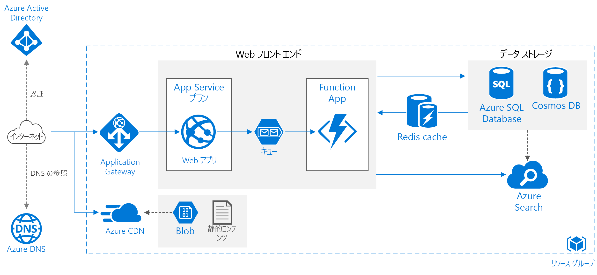

# Azure Web アプリケーションのスケーラビリティの向上

この参照アーキテクチャは、Azure App Service Web アプリケーションでスケーラビリティとパフォーマンスを改善するための実証済みの方法を示しています。

"*このアーキテクチャの [Visio ファイル][visio-download]をダウンロードします。*"

## アーキテクチャ

このアーキテクチャは、「[Basic web application][basic-web-app]」(基本的な Web アプリケーション) で説明されているアーキテクチャに基づいて構築されています。 アーキテクチャに含まれるコンポーネントを次に示します。

- **リソース グループ**。 [リソース グループ][resource-group]は、Azure リソースの論理コンテナーです。
- **[Web アプリ][app-service-web-app]**。 最新の一般的なアプリケーションには、Web サイトと、1 つ以上の RESTful Web API の両方が含まれていることがあります。 Web API は、ブラウザー クライアント (AJAX 経由)、ネイティブ クライアント アプリケーション、およびサーバー側アプリケーションから使用できます。 Web API の考慮事項については、[API 設計のガイダンス][api-guidance]を参照してください。
- **Function App**。 [Function App][functions] を使用してバックグラウンド タスクを実行します。 関数は、タイマー イベントや、キューに配置されているメッセージなどのトリガーによって呼び出されます。 実行時間の長いステートフル タスクについては、[Durable Functions][durable-functions] を使用します。
- **キュー**。 ここで示すアーキテクチャの場合、アプリケーションはメッセージを [Azure Queue Storage][queue-storage] キューに格納することで、バックグラウンド タスクをキューに格納します。 このメッセージによって、関数アプリがトリガーされます。 または、Service Bus キューを使用できます。 比較については、[Storage キューと Service Bus キューの比較][queues-compared]に関するページを参照してください。
- **キャッシュ**。 [Azure Redis Cache][azure-redis] に半静的データを格納します。
- **CDN**。 [Azure Content Delivery Network][azure-cdn] (CDN) を使用して、コンテンツの待機時間を短縮して高速に配信できるように、パブリックに使用できるコンテンツをキャッシュします。
- **データ ストレージ**。 リレーショナル データには [Azure SQL Database][sql-db] を使用します。 リレーショナル データ以外については、[Cosmos DB][cosmosdb] を検討してください。
- **Azure Search**。 [Azure Search][azure-search] を使用して、検索候補、あいまい検索、言語固有の検索などの検索機能を追加します。 通常、Azure Search は別のデータ ストアと組み合わせて使用されます。プライマリ データ ストアに厳密な一貫性が必要な場合は特にそうです。 この方法では、信頼できるデータを他のデータ ストアに格納し、検索インデックスは Azure Search に格納します。 また、Azure Search は、複数のデータ ストアから単一の検索インデックスに統合する場合にも使用できます。
- **Azure DNS**。 [Azure DNS][azure-dns] は、DNS ドメインのホスティング サービスであり、Microsoft Azure インフラストラクチャを使用した名前解決を提供します。 Azure でドメインをホストすることで、その他の Azure サービスと同じ資格情報、API、ツール、課金情報を使用して DNS レコードを管理できます。
- **Application Gateway**。 [Application Gateway](/azure/application-gateway/) はレイヤー 7 のロード バランサーです。 このアーキテクチャでは、これによって HTTP 要求が Web フロント エンドにルーティングされます。 Application Gateway には、一般的な脆弱性やその悪用からアプリケーションを保護する [Web アプリケーション ファイアウォール](/azure/application-gateway/waf-overview) (WAF) も用意されています。

## Recommendations

実際の要件は、ここで説明するアーキテクチャとは異なる場合があります。 このセクションに記載されている推奨事項は出発点として利用してください。

### App Service アプリ

Web アプリケーションと Web API は、別の App Service アプリとして作成することをお勧めします。 この設計にすると、別の App Service プランで実行して個別にスケーリングできるようになります。 初期段階でこのレベルのスケーラビリティが不要な場合は、アプリを同じプランにデプロイし、後で必要に応じて別のプランに移行することができます。

> [!NOTE]
> Basic、Standard、および Premium プランの場合、アプリごとではなく、そのプランの VM インスタンスに対して課金されます。 「[App Service の価格][app-service-pricing]」を参照してください。
>

### キャッシュ

パフォーマンスとスケーラビリティを改善するには、[Azure Redis Cache][azure-redis] を使用して一部のデータをキャッシュします。 以下の場合に Redis Cache の使用を検討してください。

- 半静的なトランザクション データ。
- セッションの状態。
- HTML 出力。 複雑な HTML 出力を表示するアプリケーションの場合に役立ちます。

キャッシュ戦略の設計の詳細については、[キャッシュのガイダンス][caching-guidance]を参照してください。

### CDN

静的コンテンツのキャッシュには、[Azure CDN][azure-cdn] を使用します。 CDN の主な利点は、ユーザーに地理的に近いエッジ サーバーにコンテンツがキャッシュされるため、ユーザーの待機時間が短くなることです。 また、トラフィックがアプリケーションで処理されないため、CDN でアプリケーションの負荷を減らすこともできます。

ほぼ静的なページで構成されるアプリの場合は、[CDN を使用してアプリ全体をキャッシュする][cdn-app-service]ことを検討してください。 それ以外の場合は、画像、CSS、HTML ファイルなどの静的コンテンツを [Azure Storage に格納し、CDN を使用してそれらのファイルをキャッシュ][cdn-storage-account]します。

> [!NOTE]
> Azure CDN では、認証が必要なコンテンツを提供できません。
>

詳細については、[Content Delivery Network (CDN) のガイダンス][cdn-guidance]を参照してください。

### Storage

多くの場合、最新のアプリケーションは大量のデータを処理しています。 クラウドに合わせてスケーリングするには、適切なストレージの種類を選択することが重要です。 以下に、基本的な推奨事項をいくつか示します。

| 格納するもの | 例 | 推奨されるストレージ |
| --- | --- | --- |
| ファイル |画像、ドキュメント、PDF |Azure Blob Storage |
| キー/値のペア |ユーザー ID で検索されるユーザー プロファイル データ |Azure Table Storage |
| 以降の処理をトリガーするための短いメッセージ |注文要求 |Azure Queue Storage、Service Bus キュー、または Service Bus トピック |
| 基本的なクエリ実行を必要とする柔軟なスキーマの非リレーショナル データ |製品カタログ |Azure Cosmos DB、MongoDB、Apache CouchDB などのドキュメント データベース |
| より高度なクエリのサポート、厳格なスキーマ、強力な一貫性を必要とするリレーショナル データ |製品のインベントリ |Azure SQL Database |

「[Choose the right data store (適切なデータ ストアの選択)][datastore]」をご覧ください。

## スケーラビリティに関する考慮事項

Azure App Service の主な利点は、負荷に応じてアプリケーションをスケーリングできることです。 アプリケーションのスケーリングを計画する場合の考慮事項を次に示します。

### App Service アプリ

ソリューションに複数の App Service アプリが含まれる場合は、別の App Service プランにデプロイすることを検討してください。 この方法にすると、別インスタンス上で実行されるので、個別にスケーリングすることができます。

同様に、HTTP 要求を処理するのと同じインスタンス上でバックグラウンド タスクが実行されないように、関数アプリを専用のプランに配置することを検討します。 バックグラウンド タスクが断続的に実行される場合は、[従量課金プラン][functions-consumption-plan]の使用を検討します。このプランでは、時間単位ではなく、実行数に基づいて課金されます。

### SQL Database

データベースを*シャード化*することで、SQL Database のスケーラビリティを向上します。 シャード化とは、データベースを水平方向にパーティション分割することを指します。 シャード化すると、[Elastic Database ツール][sql-elastic]を使用してデータベースを水平方向にスケール アウトできます。 シャード化には、次のような利点があります。

- トランザクション スループットの改善。
- データのサブセットに対するクエリの実行が高速になります。

### Azure Search

Azure Search は、プライマリ データ ストアから複雑なデータ検索を実行するオーバーヘッドを取り除き、負荷を処理できるようにスケーリングできます。 「[Azure Search でクエリとインデックス作成のワークロードに応じてリソース レベルをスケールする][azure-search-scaling]」を参照してください。

## セキュリティに関する考慮事項

このセクションでは、この記事で説明している Azure サービスに固有のセキュリティの考慮事項について説明します。 これはセキュリティ上のベスト プラクティスを網羅した一覧ではありません。 その他のセキュリティの考慮事項については、[Azure App Service でのアプリのセキュリティ保護][app-service-security]に関するページをご覧ください。

### クロスオリジン リソース共有 (CORS)

Web サイトと Web API を別のアプリとして作成する場合、CORS を有効にしない限り、Web サイトで API に対するクライアント側 AJAX の呼び出しを行うことはできません。

> [!NOTE]
> ブラウザーのセキュリティ機能により、Web ページでは AJAX 要求を別のドメインに送信することはできません。 この制限は、同一オリジン ポリシーと呼ばれ、悪意のあるサイトが、別のサイトから機密データを読み取れないようにします。 CORS は W3C 標準であり、サーバーによる同一オリジン ポリシーの緩和を許可し、一部のクロスオリジン要求を許可して他の要求を拒否することができます。
>

App Services は CORS のサポートが組み込まれているため、アプリケーション コードを作成する必要はありません。 [CORS を使用して JavaScript から API アプリを使用する][cors]方法に関するページを参照してください。 API の許可されているオリジンの一覧に Web サイトを追加します。

### SQL Database の暗号化

データベースに保存されているデータを暗号化する必要がある場合は、[Transparent Data Encryption][sql-encryption] を使用します。 この機能で、(バックアップとトランザクション ログ ファイルを含む) データベース全体のリアルタイムの暗号化と復号が実行されるので、アプリケーションを変更する必要はありません。 暗号化で、ある程度の待機時間が増えるので、セキュリティで保護する必要があるデータを独自のデータベースに分離し、そのデータベースについてのみ暗号化を有効にすることをお勧めします。

<!-- links -->

[api-guidance]: ../../best-practices/api-design.md
[app-service-security]: /azure/app-service-web/web-sites-security
[app-service-web-app]: /azure/app-service-web/app-service-web-overview
[app-service-api-app]: /azure/app-service-api/app-service-api-apps-why-best-platform
[app-service-pricing]: https://azure.microsoft.com/pricing/details/app-service/
[azure-cdn]: https://azure.microsoft.com/services/cdn/
[azure-dns]: /azure/dns/dns-overview
[azure-redis]: https://azure.microsoft.com/services/cache/
[azure-search]: /azure/search
[azure-search-scaling]: /azure/search/search-capacity-planning
[basic-web-app]: basic-web-app.md
[basic-web-app-scalability]: basic-web-app.md#scalability-considerations
[caching-guidance]: ../../best-practices/caching.md
[cdn-app-service]: /azure/app-service-web/cdn-websites-with-cdn
[cdn-storage-account]: /azure/cdn/cdn-create-a-storage-account-with-cdn
[cdn-guidance]: ../../best-practices/cdn.md
[cors]: /azure/app-service-api/app-service-api-cors-consume-javascript
[cosmosdb]: /azure/cosmos-db/
[datastore]: ../..//guide/technology-choices/data-store-overview.md
[durable-functions]: /azure/azure-functions/durable-functions-overview
[functions]: /azure/azure-functions/functions-overview
[functions-consumption-plan]: /azure/azure-functions/functions-scale#consumption-plan
[queue-storage]: /azure/storage/storage-dotnet-how-to-use-queues
[queues-compared]: /azure/service-bus-messaging/service-bus-azure-and-service-bus-queues-compared-contrasted
[resource-group]: /azure/azure-resource-manager/resource-group-overview#resource-groups
[sql-db]: /azure/sql-database/
[sql-elastic]: /azure/sql-database/sql-database-elastic-scale-introduction
[sql-encryption]: https://msdn.microsoft.com/library/dn948096.aspx
[tm]: https://azure.microsoft.com/services/traffic-manager/
[visio-download]: https://archcenter.blob.core.windows.net/cdn/app-service-reference-architectures.vsdx
[web-app-multi-region]: ./multi-region.md
