# <a name="automated-enterprise-bi-with-sql-data-warehouse-and-azure-data-factory"></a>SQL Data Warehouse と Azure Data Factory を使用したエンタープライズ BI の自動化

この参照アーキテクチャは、[ELT](../../data-guide/relational-data/etl.md#extract-load-and-transform-elt) (抽出 - 読み込み - 変換) パイプラインで段階的に読み込む方法を示しています。 Azure Data Factory を使用して ELT パイプラインを自動化します。 パイプラインは、オンプレミスの SQL Server データベースから SQL Data Warehouse に最新の OLTP データを段階的に移動します。 トランザクション データは、分析のために表形式モデルに変換されます。 [**こちらのソリューションをデプロイしてください**。](#deploy-the-solution)

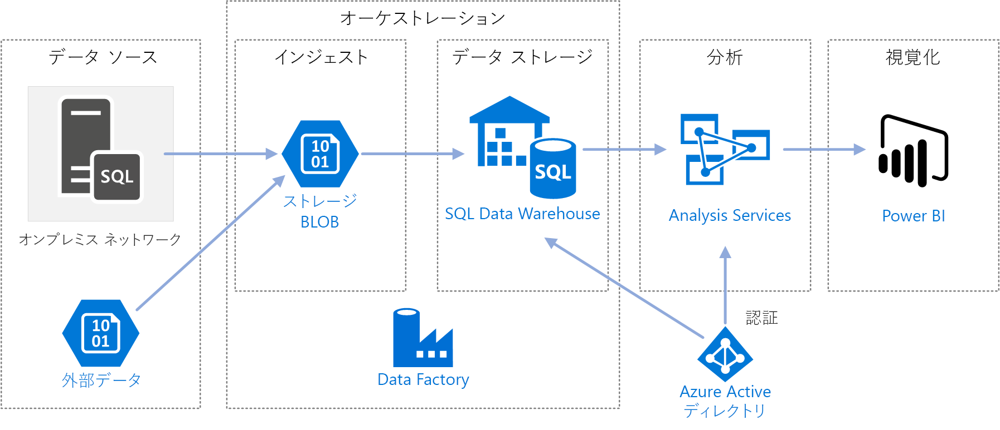

このアーキテクチャは、[SQL Data Warehouse を使用したエンタープライズ向け BI](./enterprise-bi-sqldw.md) に示されているアーキテクチャに基づいて構築されていますが、エンタープライズ データ ウェアハウス シナリオに重要な機能がいくつか追加されています。

-   Data Factory を使用したパイプラインの自動化
-   段階的な読み込み。
-   複数のデータ ソースの統合。
-   地理空間データや画像などのバイナリ データの読み込み。

## <a name="architecture"></a>アーキテクチャ

アーキテクチャは、次のコンポーネントで構成されます。

### <a name="data-sources"></a>データ ソース

**オンプレミスの SQL Server**。 ソース データは、オンプレミスの SQL Server データベースにあります。 オンプレミス環境をシミュレートするために、このアーキテクチャのデプロイ スクリプトでは、SQL Server がインストールされた Azure の仮想マシンがプロビジョニングされます。 [Wide World Importers OLTP サンプル データベース][wwi]は、ソース データベースとして使用されます。

**外部データ**。 データ ウェアハウスの一般的なシナリオとして、複数のデータ ソースの統合があります。 この参照アーキテクチャは、年別の市区町村の人口を含む外部データ セットを読み込み、それを OLTP データベースのデータと統合します。 このデータは、"各地域の売上高の増加率は人口の増加率と一致するか、上回っているか" のような分析に使用できます。

### <a name="ingestion-and-data-storage"></a>インジェストとデータ ストレージ

**Blob Storage**。 Blob Storage は、SQL Data Warehouse に読み込む前のソース データのステージング領域として使用されます。

**Azure SQL Data Warehouse**。 [SQL Data Warehouse](/azure/sql-data-warehouse/) は、大規模なデータの分析を目的として設計された分散システムです。 超並列処理 (MPP) がサポートされているので、ハイパフォーマンス分析の実行に適しています。 

**Azure Data Factory**。 [Data Factory][adf] は、データ移動とデータ変換を調整し、自動化するマネージド サービスです。 このアーキテクチャでは、ELT プロセスのさまざまな段階が調整されます。

### <a name="analysis-and-reporting"></a>分析とレポート

**Azure Analysis Services**。 [Analysis Services](/azure/analysis-services/) は、データ モデリング機能を提供する完全なマネージド サービスです。 セマンティック モデルは Analysis Services に読み込まれます。

**Power BI**。 Power BI は、データを分析してビジネスの洞察を得る一連のビジネス分析ツールです。 このアーキテクチャでは、Analysis Services に格納されたセマンティック モデルに対してクエリが実行されます。

### <a name="authentication"></a>認証

**Azure Active Directory** (Azure AD)。Power BI から Analysis Services サーバーに接続するユーザーを認証します。

Data Factory では、Azure AD を使用し、サービス プリンシパルまたはマネージド サービス ID (MSI) を使用して SQL Data Warehouse を認証することもできます。 わかりやすくするために、この展開例では SQL Server 認証を使用しています。

## <a name="data-pipeline"></a>データ パイプライン

[Azure Data Factory][adf] では、パイプラインはタスク (この例では、データを SQL Data Warehouse に読み込んで変換するタスク) の調整に使用されるアクティビティの論理グループです。 

この参照アーキテクチャは、一連の子パイプラインを実行するマスター パイプラインを定義します。 各子パイプラインは、1 つまたは複数のデータ ウェアハウス テーブルにデータを読み込みます。

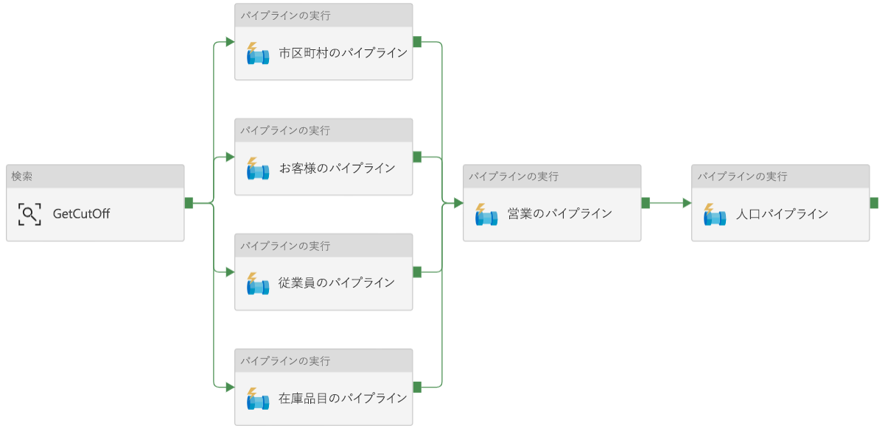

## <a name="incremental-loading"></a>段階的な読み込み

自動化された ETL または ELT プロセスを実行する場合、以前の実行以降に変更されたデータのみを読み込むのが最も効率的です。 すべてのデータを読み込む完全読み込みとは対照的に、これは*段階的な読み込み*と呼ばれます。 段階的な読み込みを実行するには、変更されたデータを特定する方法が必要です。 最も一般的な方法は、*高基準値*を使用することです。つまり、ソース テーブルの特定の列の最新の値 (日時列または一意の整数列) を追跡することです。 

SQL Server 2016 以降は[テンポラル テーブル](/sql/relational-databases/tables/temporal-tables)を使用できます。 テンポラル テーブルは、データの完全な変更履歴が保持されている、システムでバージョン管理されたテーブルです。 データベース エンジンは、各変更履歴を別々の履歴テーブルに自動的に記録します。 クエリに FOR SYSTEM_TIME 句を追加することで、履歴データのクエリを実行することができます。 内部的には、データベース エンジンは履歴テーブルのクエリを実行しますが、この処理はアプリケーションにとって透過的です。 

> [!NOTE]
> 以前のバージョンの SQL Server では、[変更データ キャプチャ](/sql/relational-databases/track-changes/about-change-data-capture-sql-server) (CDC) を使用できます。 このアプローチでは、別の変更テーブルのクエリを実行する必要があり、変更がタイムスタンプではなくログ シーケンス番号で追跡されるため、テンポラル テーブルよりも不便です。 

テンポラル テーブルは、時間と共に変化する可能性のあるディメンション データの場合に便利です。 通常、ファクト テーブルは、販売などの不変トランザクションを表します。この場合、システムのバージョン履歴を保持することは意味がありません。 その代わり、通常、トランザクションにはトランザクション日付を表す列があります。これをウォーターマーク値として使用できます。 たとえば、Wide World Importers OLTP データベースでは、Sales.Invoices テーブルと Sales.InvoiceLines テーブルに既定が `sysdatetime()` の `LastEditedWhen` フィールドがあります。 

ELT パイプラインの一般的なフローは次のとおりです。

1. ソース データベースの各テーブルについて、最後の ELT ジョブが実行されたときのカットオフ時間を追跡します。 この情報をデータ ウェアハウスに格納します (初期設定では、すべての時間が '1-1-1900'に設定されます)。

2. データのエクスポート手順では、カットオフ時間がパラメーターとしてソース データベース内のストアド プロシージャのセットに渡されます。 これらのストアド プロシージャは、カットオフ時間後に変更または作成されたレコードのクエリを実行します。 Sales ファクト テーブルの場合は、`LastEditedWhen` 列が使用されます。 ディメンション データの場合は、システムでバージョン管理されたテンポラル テーブルが使用されます。

3. データの移行が完了したら、カットオフ時間を格納するテーブルを更新します。

ELT の実行ごとに*系列*を記録することも便利です。 特定のレコードについて、系列はそのレコードをそのデータを生成した ELT 実行と関連付けます。 ETL 実行ごとに、読み込みの開始時刻と終了時刻が表示された新しい系列レコードがテーブルごとに作成されます。 各レコードの系列キーは、ディメンション テーブルとファクト テーブルに格納されます。

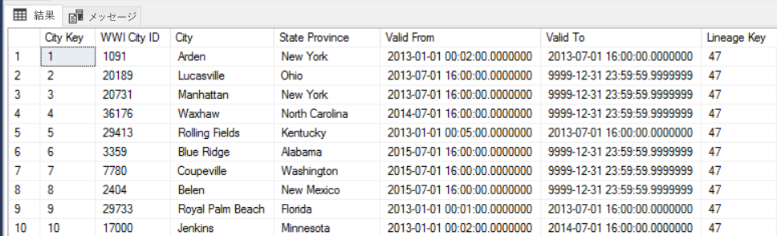

新しいデータのバッチがウェアハウスに読み込まれたら、Analysis Services 表形式モデルを更新します。 「[REST API を使用した非同期更新](/azure/analysis-services/analysis-services-async-refresh)」を参照してください。

## <a name="data-cleansing"></a>データ クレンジング

データ クレンジングは、ELT プロセスに含めるようにします。 この参照アーキテクチャでは、不適切なデータ ソースの 1 つが市区町村の人口テーブルです。このテーブルには、データを入手できなかったなどの理由で、人口が 0 の市区町村がいくつかあります。 処理中、ELT パイプラインは、市区町村の人口テーブルからそれらの市区町村を削除します。 外部テーブルではなくステージング テーブルにタイしてデータ クレンジングを実行します。

市区町村の人口テーブルから人口が 0 の市区町村を削除するストアド プロシージャを次に示します (ソース ファイルについては[こちら](https://github.com/mspnp/reference-architectures/blob/master/data/enterprise_bi_sqldw_advanced/azure/sqldw_scripts/citypopulation/%5BIntegration%5D.%5BMigrateExternalCityPopulationData%5D.sql)を参照してください)。 

```sql
DELETE FROM [Integration].[CityPopulation_Staging]
WHERE RowNumber in (SELECT DISTINCT RowNumber
FROM [Integration].[CityPopulation_Staging]
WHERE POPULATION = 0
GROUP BY RowNumber
HAVING COUNT(RowNumber) = 4)
```

## <a name="external-data-sources"></a>外部データ ソース

データ ウェアハウスは、多くの場合、複数のソースのデータを統合します。 この参照アーキテクチャは、人口統計データを含む外部データ ソースを読み込みます。 このデータセットは、[WorldWideImportersDW](https://github.com/Microsoft/sql-server-samples/tree/master/samples/databases/wide-world-importers/sample-scripts/polybase) サンプルの一部として AzureBlob Storage で利用できます。

Azure Data Factory は、[BLOB ストレージ コネクタ](/azure/data-factory/connector-azure-blob-storage)を使用して、BLOB ストレージから直接コピーできます。 ただし、コネクタには接続文字列または共有アクセス署名が必要なため、パブリック読み取りアクセス権がある BLOB のコピーに使用することはできません。 回避策として、PolyBase を使用して BLOB ストレージ上に外部テーブルを作成し、外部テーブルを SQL Data Warehouse にコピーすることができます。 

## <a name="handling-large-binary-data"></a>大きなバイナリ データの処理 

ソース データベースでは、Cities テーブルに [geography](/sql/t-sql/spatial-geography/spatial-types-geography) 空間データ型を保持する Location 列があります。 SQL Data Warehouse は **geography** 型をネイティブでサポートしていないので、このフィールドは読み込み中に **varbinary** 型に変換されます (「[サポートされていないデータ型の対処法](/azure/sql-data-warehouse/sql-data-warehouse-tables-data-types#unsupported-data-types)」を参照してください)。

ただし、PolyBase でサポートされる最大列サイズは `varbinary(8000)` です。そのため、一部のデータが切り捨てられる可能性があります。 この問題の回避策は、次のようにエクスポート時にデータをチャンクに分割し、チャンクを再構成することです。

1. Location 列の一時ステージング テーブルを作成します。

2. 市区町村ごとに場所データを 8,000 バイトのチャンクに分割します。その結果、市区町村ごとに 1 &ndash; N 行になります。

3. チャンクを再構成するには、T-SQL [PIVOT](/sql/t-sql/queries/from-using-pivot-and-unpivot) 演算子を使用して行を列に変換し、各市区町村の列の値を連結します。

課題は、地理データのサイズに応じて、各市区町村を異なる数の行に分割することです。 PIVOT 演算子が機能するには、各市区町村を同じ行数にする必要があります。 この作業を行うために、T-SQL クエリ ([こちら][MergeLocation]を参照してください) で、ピボットの後にすべての市区町村が同じ列数になるように、空白値で行を埋める処理を実行します。 結果のクエリは、一度に 1 行ずつループするよりもはるかに高速になっていることがわかります。

同じアプローチが画像データに使用されます。

## <a name="slowly-changing-dimensions"></a>緩やかに変化するディメンション

ディメンション データは比較的静的ですが、変化する可能性があります。 たとえば、製品が別の製品カテゴリに再割り当てされることがあります。 緩やかに変化するディメンションを処理するにはいくつかのアプローチがあります。 [タイプ 2](https://wikipedia.org/wiki/Slowly_changing_dimension#Type_2:_add_new_row) と呼ばれる一般的な手法では、ディメンションが変化するたびに新しいレコードを追加します。 

タイプ 2 アプローチを実装するには、特定のレコードの有効な日付範囲を指定する列をディメンション テーブルに追加する必要があります。 また、ソース データベースの主キーが複製されるので、ディメンション テーブルには人工主キーが必要です。

次の図は、Dimension.City テーブルを示しています。 `WWI City ID` 列は、ソース データベースの主キーです。 `City Key` 列は、ETL パイプラインで生成された人工キーです。 また、テーブルには `Valid From` 列と `Valid To` 列があり、各行が有効なときの範囲が定義されています。 現在の値には `Valid To` = '9999-12-31' があります。


このアプローチの利点は、過去のデータが保存されることです。このデータは分析に役立つ可能性があります。 ただし、これは同じエンティティに対して複数の行が存在することも意味します。 たとえば、`WWI City ID` = 28561 に一致するレコードを次に示します。

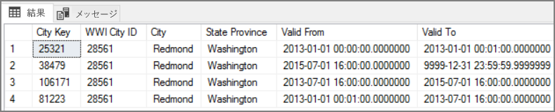

各 Sales ファクトについて、そのファクトを請求書の日付に対応する City ディメンション テーブルの単一の行に関連付ける必要があります。 ETL プロセスの一環として、追加の列を作成します。 

次の T-SQL クエリは、各請求書を City ディメンション テーブルの正しい City Key に関連付けるテンポラル テーブルを作成します。

```sql
CREATE TABLE CityHolder
WITH (HEAP , DISTRIBUTION = HASH([WWI Invoice ID]))
AS
SELECT DISTINCT s1.[WWI Invoice ID] AS [WWI Invoice ID],
                c.[City Key] AS [City Key]
    FROM [Integration].[Sale_Staging] s1
    CROSS APPLY (
                SELECT TOP 1 [City Key]
                    FROM [Dimension].[City]
                WHERE [WWI City ID] = s1.[WWI City ID]
                    AND s1.[Last Modified When] > [Valid From]
                    AND s1.[Last Modified When] <= [Valid To]
                ORDER BY [Valid From], [City Key] DESC
                ) c

```

このテーブルは、Sales ファクト テーブルの列を設定するために使用されます。

```sql
UPDATE [Integration].[Sale_Staging]
SET [Integration].[Sale_Staging].[WWI Customer ID] =  CustomerHolder.[WWI Customer ID]
```

この列では、Power BI クエリを使用して、特定の売上請求書に対して正しい City レコードを検索できます。

## <a name="security-considerations"></a>セキュリティに関する考慮事項

さらにセキュリティを強化するには、[仮想ネットワーク サービス エンドポイント](/azure/virtual-network/virtual-network-service-endpoints-overview)を使用して、仮想ネットワークに対してのみ Azure サービス リソースをセキュリティで保護することができます。 これにより、これらのリソースに対するパブリック インターネット アクセスが完全に削除され、自分の仮想ネットワークからのトラフィックのみが許可されます。

このアプローチでは、Azure 内に VNet を作成し、Azure サービス用のプライベート サービス エンドポイントを作成します。 これらのサービスは、その仮想ネットワークからのトラフィックに制限されるようになります。 オンプレミス ネットワークからゲートウェイ経由でアクセスすることもできます。

次の制限事項に注意してください。

- この参照アーキテクチャが作成された時点で、Azure Storage と Azure SQL Data Warehouse では VNet サービス エンドポイントがサポートされていますが、Azure Analysis Service ではサポートされていません。 最新の状態については、[こちら](https://azure.microsoft.com/updates/?product=virtual-network)を参照してください。 

- Azure Storage でサービス エンドポイントが有効な場合、PolyBase は Storage から SQL Data Warehouse にデータをコピーできません。 この問題には軽減策があります。 詳細については、「[Azure Storage で VNet サービス エンドポイントを使用した場合の影響](/azure/sql-database/sql-database-vnet-service-endpoint-rule-overview?toc=%2fazure%2fvirtual-network%2ftoc.json#impact-of-using-vnet-service-endpoints-with-azure-storage)」を参照してください。 

- オンプレミスから Azure Storage にデータを移動するには、オンプレミスまたは ExpressRoute からのパブリック IP アドレスをホワイトリストに登録する必要があります。 詳細については、「[Azure サービスへのアクセスを仮想ネットワークに限定する](/azure/virtual-network/virtual-network-service-endpoints-overview#securing-azure-services-to-virtual-networks)」を参照してください。

- Analysis Services が SQL Data Warehouse からデータを読み取ることができるようにするには、SQL Data Warehouse サービス エンドポイントを含む仮想ネットワークに Windows VM を展開します。 この VM に [Azure オンプレミス データゲートウェイ](/azure/analysis-services/analysis-services-gateway)をインストールします。 次に Azure Analysis サービスをデータ ゲートウェイに接続します。

## <a name="deploy-the-solution"></a>ソリューションのデプロイ方法

この参照アーキテクチャの展開については、[GitHub][ref-arch-repo-folder] を参照してください。 以下がデプロイされます。

  * オンプレミスのデータベース サーバーをシミュレートする Windows VM。 これには、SQL Server 2017 と関連ツール、および Power BI Desktop が含まれています。
  * SQL Server データベースからエクスポートされたデータを保持する Blob Storage を提供する Azure ストレージ アカウント。
  * Azure SQL Data Warehouse インスタンス。
  * Azure Analysis Services インスタンス。
  * ELT ジョブ用の Azure Data Factory と Data Factory パイプライン。

### <a name="prerequisites"></a>前提条件

[!INCLUDE [ref-arch-prerequisites.md](../../../includes/ref-arch-prerequisites.md)]

### <a name="variables"></a>variables

以下の手順には、ユーザー定義変数が含まれています。 これらは定義した値に置き換える必要があります。

- `<data_factory_name>` データ ファクトリ名。
- `<analysis_server_name>` Analysis Services サーバー名。
- `<active_directory_upn>` Azure Active Directory ユーザー プリンシパル名 (UPN)。 たとえば、「`user@contoso.com`」のように入力します。
- `<data_warehouse_server_name>` SQL Data Warehouse サーバー名。
- `<data_warehouse_password>` SQL Data Warehouse 管理者パスワード。
- `<resource_group_name>` リソース グループの名前。
- `<region>` リソースが配置される Azure リージョン。
- `<storage_account_name>` ストレージ アカウント名。 ストレージ アカウントの[名前付け規則](../../best-practices/naming-conventions.md#naming-rules-and-restrictions)に従う必要があります。
- `<sql-db-password>` SQL Server ログイン パスワード。

### <a name="deploy-azure-data-factory"></a>Azure Data Factory をデプロイする

1. [GitHub リポジトリ][ref-arch-repo]の `data\enterprise_bi_sqldw_advanced\azure\templates` フォルダーに移動します。

2. 次の Azure CLI コマンドを実行して、リソース グループを作成します。  

    ```bash
    az group create --name <resource_group_name> --location <region>  
    ```

    SQL Data Warehouse、Azure Analysis Services、および Data Factory v2 をサポートするリージョンを指定します。 「[リージョン別の Azure 製品](https://azure.microsoft.com/global-infrastructure/services/)」を参照してください。

3. 次のコマンドを実行します。

    ```
    az group deployment create --resource-group <resource_group_name> \
        --template-file adf-create-deploy.json \
        --parameters factoryName=<data_factory_name> location=<location>
    ```

次に、Azure portal を使用して、次のように Azure Data Factory [統合ランタイム](/azure/data-factory/concepts-integration-runtime)の認証キーを取得します。

1. [Azure portal](https://portal.azure.com/) で Data Factory インスタンスに移動します。

2. Data Factory ブレードで **[Author & Monitor]\(作成と監視\)** をクリックします。 Azure Data Factory ポータルが別のブラウザー ウィンドウに開きます。

    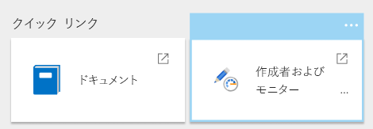

3. Azure Data Factory ポータルで鉛筆アイコン ([作成]) を選択します。 

4. **[接続]** をクリックし、**[統合ランタイム]** を選択します。

5. **sourceIntegrationRuntime** の下にある鉛筆アイコン ([編集]) をクリックします。

    > [!NOTE]
    > ポータルには状態が "使用不可" と表示されます。 この状態は、オンプレミス サーバーを展開するまで続くと想定されます。

6. **Key1** を見つけて、認証キーの値をコピーします。

この認証キーは、次の手順で必要になります。

### <a name="deploy-the-simulated-on-premises-server"></a>シミュレートされたオンプレミスのサーバーをデプロイする

この手順では、SQL Server 2017 と関連ツールを含む、シミュレートされたオンプレミスのサーバーとして VM を展開します。 また、[Wide World Importers OLTP データベース][wwi] を SQL Server に読み込みます。

1. リポジトリの `data\enterprise_bi_sqldw_advanced\onprem\templates` フォルダーに移動します。

2. `onprem.parameters.json` ファイルで `adminPassword` を検索します。 これは、SQL Server VM にログインするためのパスワードです。 この値を別のパスワードに置き換えます。

3. 同じファイルで、`SqlUserCredentials` を検索します。 このプロパティには、SQL Server アカウントの資格情報が指定されています。 このパスワードを別の値に置き換えます。

4. 同じファイルで、以下のように Integration Runtime 認証キーを `IntegrationRuntimeGatewayKey` パラメーターに貼り付けます。

    ```json
    "protectedSettings": {
        "configurationArguments": {
            "SqlUserCredentials": {
                "userName": ".\\adminUser",
                "password": "<sql-db-password>"
            },
            "IntegrationRuntimeGatewayKey": "<authentication key>"
        }
    ```

5. 次のコマンドを実行します。

    ```bash
    azbb -s <subscription_id> -g <resource_group_name> -l <region> -p onprem.parameters.json --deploy
    ```

この手順は完了するまでに 20 から 30 分かかります。 これには、ツールをインストールしてデータベースを復元するための [DSC](/powershell/dsc/overview) スクリプトの実行が含まれます。 

### <a name="deploy-azure-resources"></a>Azure リソースを展開する

この手順では、SQL Data Warehouse、Azure Analysis Services、および Data Factory をプロビジョニングします。

1. [GitHub リポジトリ][ref-arch-repo]の `data\enterprise_bi_sqldw_advanced\azure\templates` フォルダーに移動します。

2. 次の Azure CLI コマンドを実行します。 山かっこ内に示されるパラメーター値を置き換えます。

    ```bash
    az group deployment create --resource-group <resource_group_name> \
     --template-file azure-resources-deploy.json \
     --parameters "dwServerName"="<data_warehouse_server_name>" \
     "dwAdminLogin"="adminuser" "dwAdminPassword"="<data_warehouse_password>" \ 
     "storageAccountName"="<storage_account_name>" \
     "analysisServerName"="<analysis_server_name>" \
     "analysisServerAdmin"="<user@contoso.com>"
    ```

    - `storageAccountName` パラメーターは、ストレージ アカウントの[名前付け規則](../../best-practices/naming-conventions.md#naming-rules-and-restrictions)に従う必要があります。 
    - `analysisServerAdmin` パラメーターには、Azure Active Directory ユーザー プリンシパル名 (UPN) を使用します。

3. 次の Azure CLI コマンドを実行してストレージ アカウントのアクセス キーを取得します。 このキーは、次の手順で使用します。

    ```bash
    az storage account keys list -n <storage_account_name> -g <resource_group_name> --query [0].value
    ```

4. 次の Azure CLI コマンドを実行します。 山かっこ内に示されるパラメーター値を置き換えます。 

    ```bash
    az group deployment create --resource-group <resource_group_name> \
    --template-file adf-pipeline-deploy.json \
    --parameters "factoryName"="<data_factory_name>" \
    "sinkDWConnectionString"="Server=tcp:<data_warehouse_server_name>.database.windows.net,1433;Initial Catalog=wwi;Persist Security Info=False;User ID=adminuser;Password=<data_warehouse_password>;MultipleActiveResultSets=False;Encrypt=True;TrustServerCertificate=False;Connection Timeout=30;" \
    "blobConnectionString"="DefaultEndpointsProtocol=https;AccountName=<storage_account_name>;AccountKey=<storage_account_key>;EndpointSuffix=core.windows.net" \
    "sourceDBConnectionString"="Server=sql1;Database=WideWorldImporters;User Id=adminuser;Password=<sql-db-password>;Trusted_Connection=True;"
    ```

    接続文字列には、置換する必要がある山かっこ内の部分文字列があります。 `<storage_account_key>` の場合、前の手順で取得したキーを使用します。 `<sql-db-password>` の場合、以前に `onprem.parameters.json` ファイルで指定した SQL Server アカウントのパスワードを使用します。

### <a name="run-the-data-warehouse-scripts"></a>データ ウェアハウスのスクリプトを実行する

1. [Azure portal](https://portal.azure.com/) で、`sql-vm1` という名前のオンプレミス VM を探します。 VM のユーザー名とパスワードは、`onprem.parameters.json` ファイルに指定されています。

2. **[接続]** をクリックし、リモート デスクトップを使用して VM に接続します。

3. リモート デスクトップ セッションからコマンド プロンプトを開き、VM 上の次のフォルダーに移動します。

    ```
    cd C:\SampleDataFiles\reference-architectures\data\enterprise_bi_sqldw_advanced\azure\sqldw_scripts
    ```

4. 次のコマンドを実行します。

    ```
    deploy_database.cmd -S <data_warehouse_server_name>.database.windows.net -d wwi -U adminuser -P <data_warehouse_password> -N -I
    ```

    `<data_warehouse_server_name>` および `<data_warehouse_password>` の場合、前述のデータ ウェアハウス サーバーの名前とパスワードを使用します。

この手順を確認するには、SQL Server Management Studio (SSMS) を使用して SQL Data Warehouse データベースに接続します。 データベース テーブル スキーマが表示されます。

### <a name="run-the-data-factory-pipeline"></a>Data Factory パイプラインを実行します。

1. 同じリモート デスクトップ セッションから PowerShell ウィンドウを開きます。

2. 次の PowerShell コマンドを実行します。 確認を求めるメッセージが表示されたら、 **[はい]** を選択します。

    ```powershell
    Install-Module -Name AzureRM -AllowClobber
    ```

3. 次の PowerShell コマンドを実行します。 メッセージが表示されたら、Azure の資格情報を入力します。

    ```powershell
    Connect-AzureRmAccount 
    ```

4. 次の PowerShell コマンドを実行します。 山かっこ内の値を置き換えます。

    ```powershell
    Set-AzureRmContext -SubscriptionId <subscription id>

    Invoke-AzureRmDataFactoryV2Pipeline -DataFactory <data-factory-name> -PipelineName "MasterPipeline" -ResourceGroupName <resource_group_name>

5. In the Azure Portal, navigate to the Data Factory instance that was created earlier.

6. In the Data Factory blade, click **Author & Monitor**. This opens the Azure Data Factory portal in another browser window.

    

7. In the Azure Data Factory portal, click the **Monitor** icon. 

8. Verify that the pipeline completes successfully. It can take a few minutes.

    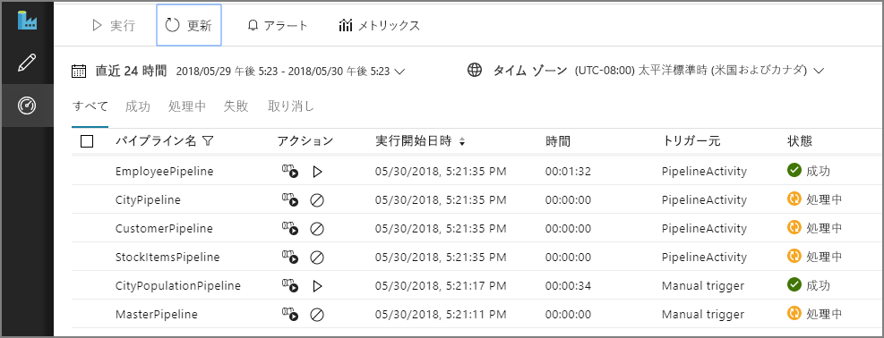


## Build the Analysis Services model

In this step, you will create a tabular model that imports data from the data warehouse. Then you will deploy the model to Azure Analysis Services.

**Create a new tabular project**

1. From your Remote Desktop session, launch SQL Server Data Tools 2015.

2. Select **File** > **New** > **Project**.

3. In the **New Project** dialog, under **Templates**, select  **Business Intelligence** > **Analysis Services** > **Analysis Services Tabular Project**. 

4. Name the project and click **OK**.

5. In the **Tabular model designer** dialog, select **Integrated workspace**  and set **Compatibility level** to `SQL Server 2017 / Azure Analysis Services (1400)`. 

6. Click **OK**.


**Import data**

1. In the **Tabular Model Explorer** window, right-click the project and select **Import from Data Source**.

2. Select **Azure SQL Data Warehouse** and click **Connect**.

3. For **Server**, enter the fully qualified name of your Azure SQL Data Warehouse server. You can get this value from the Azure Portal. For **Database**, enter `wwi`. Click **OK**.

4. In the next dialog, choose **Database** authentication and enter your Azure SQL Data Warehouse user name and password, and click **OK**.

5. In the **Navigator** dialog, select the checkboxes for the **Fact.\*** and **Dimension.\*** tables.

    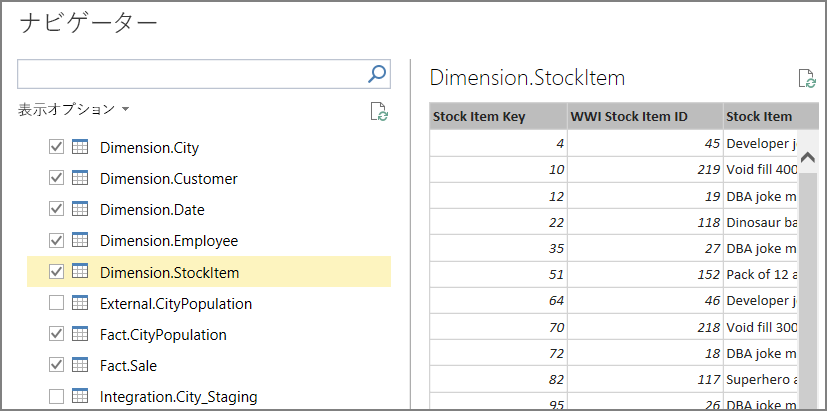

6. Click **Load**. When processing is complete, click **Close**. You should now see a tabular view of the data.

**Create measures**

1. In the model designer, select the **Fact Sale** table.

2. Click a cell in the the measure grid. By default, the measure grid is displayed below the table. 

    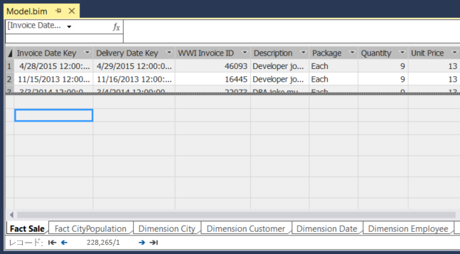

3. In the formula bar, enter the following and press ENTER:

    ```
    Total Sales:=SUM('Fact Sale'[Total Including Tax])
    ```

4. Repeat these steps to create the following measures:

    ```
    Number of Years:=(MAX('Fact CityPopulation'[YearNumber])-MIN('Fact CityPopulation'[YearNumber]))+1
    
    Beginning Population:=CALCULATE(SUM('Fact CityPopulation'[Population]),FILTER('Fact CityPopulation','Fact CityPopulation'[YearNumber]=MIN('Fact CityPopulation'[YearNumber])))
    
    Ending Population:=CALCULATE(SUM('Fact CityPopulation'[Population]),FILTER('Fact CityPopulation','Fact CityPopulation'[YearNumber]=MAX('Fact CityPopulation'[YearNumber])))
    
    CAGR:=IFERROR((([Ending Population]/[Beginning Population])^(1/[Number of Years]))-1,0)
    ```

    

For more information about creating measures in SQL Server Data Tools, see [Measures](/sql/analysis-services/tabular-models/measures-ssas-tabular).

**Create relationships**

1. In the **Tabular Model Explorer** window, right-click the project and select **Model View** > **Diagram View**.

2. Drag the **[Fact Sale].[City Key]** field to the **[Dimension City].[City Key]** field to create a relationship.  

3. Drag the **[Face CityPopulation].[City Key]** field to the **[Dimension City].[City Key]** field.  

    

**Deploy the model**

1. From the **File** menu, choose **Save All**.

2. In **Solution Explorer**, right-click the project and select **Properties**. 

3. Under **Server**, enter the URL of your Azure Analysis Services instance. You can get this value from the Azure Portal. In the portal, select the Analysis Services resource, click the Overview pane, and look for the **Server Name** property. It will be similar to `asazure://westus.asazure.windows.net/contoso`. Click **OK**.

    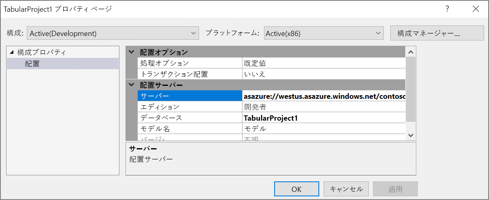

4. In **Solution Explorer**, right-click the project and select **Deploy**. Sign into Azure if prompted. When processing is complete, click **Close**.

5. In the Azure portal, view the details for your Azure Analysis Services instance. Verify that your model appears in the list of models.

    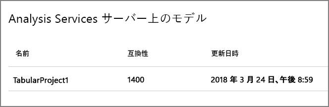

## Analyze the data in Power BI Desktop

In this step, you will use Power BI to create a report from the data in Analysis Services.

1. From your Remote Desktop session, launch Power BI Desktop.

2. In the Welcome Scren, click **Get Data**.

3. Select **Azure** > **Azure Analysis Services database**. Click **Connect**

    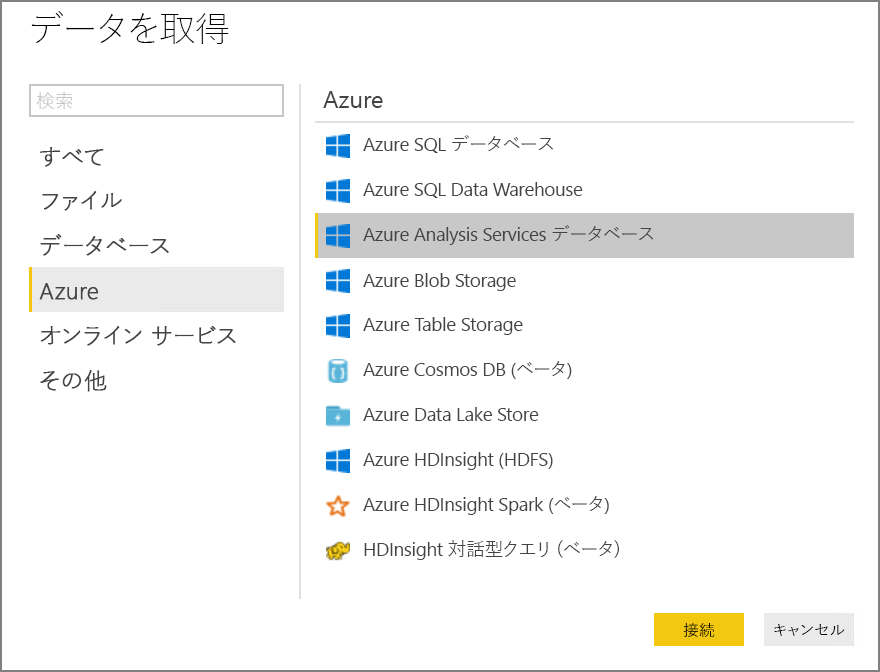

4. Enter the URL of your Analysis Services instance, then click **OK**. Sign into Azure if prompted.

5. In the **Navigator** dialog, expand the tabular project, select the model, and click **OK**.

2. In the **Visualizations** pane, select the **Table** icon. In the Report view, resize the visualization to make it larger.

6. In the **Fields** pane, expand **Dimension City**.

7. From **Dimension City**, drag **City** and **State Province** to the **Values** well.

9. In the **Fields** pane, expand **Fact Sale**.

10. From **Fact Sale**, drag **CAGR**, **Ending Population**,  and **Total Sales** to the **Value** well.

11. Under **Visual Level Filters**, select **Ending Population**. Set the filter to "is greater than 100000" and click **Apply filter**.

12. Under **Visual Level Filters**, select **Total Sales**. Set the filter to "is 0" and click **Apply filter**.

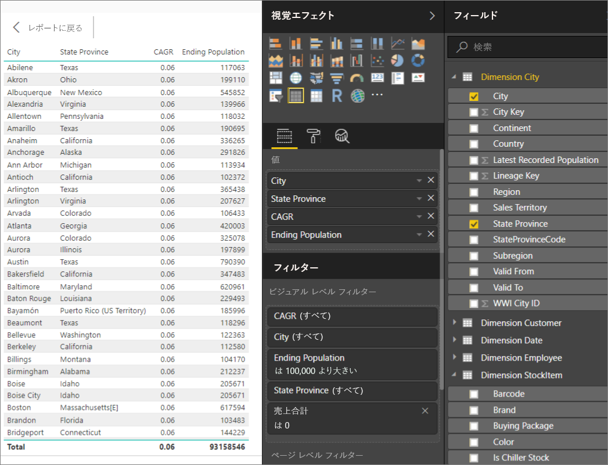

The table now shows cities with population greater than 100,000 and zero sales. CAGR  stands for Compounded Annual Growth Rate and measures the rate of population growth per city. You could use this value to find cities with high growth rates, for example. However, note that the values for CAGR in the model aren't accurate, because they are derived from sample data.

To learn more about Power BI Desktop, see [Getting started with Power BI Desktop](/power-bi/desktop-getting-started).


[adf]: //azure/data-factory
[azure-cli-2]: //azure/install-azure-cli
[azbb-repo]: https://github.com/mspnp/template-building-blocks
[azbb-wiki]: https://github.com/mspnp/template-building-blocks/wiki/Install-Azure-Building-Blocks
[MergeLocation]: https://github.com/mspnp/reference-architectures/blob/master/data/enterprise_bi_sqldw_advanced/azure/sqldw_scripts/city/%5BIntegration%5D.%5BMergeLocation%5D.sql
[ref-arch-repo]: https://github.com/mspnp/reference-architectures
[ref-arch-repo-folder]: https://github.com/mspnp/reference-architectures/tree/master/data/enterprise_bi_sqldw_advanced
[wwi]: //sql/sample/world-wide-importers/wide-world-importers-oltp-database
