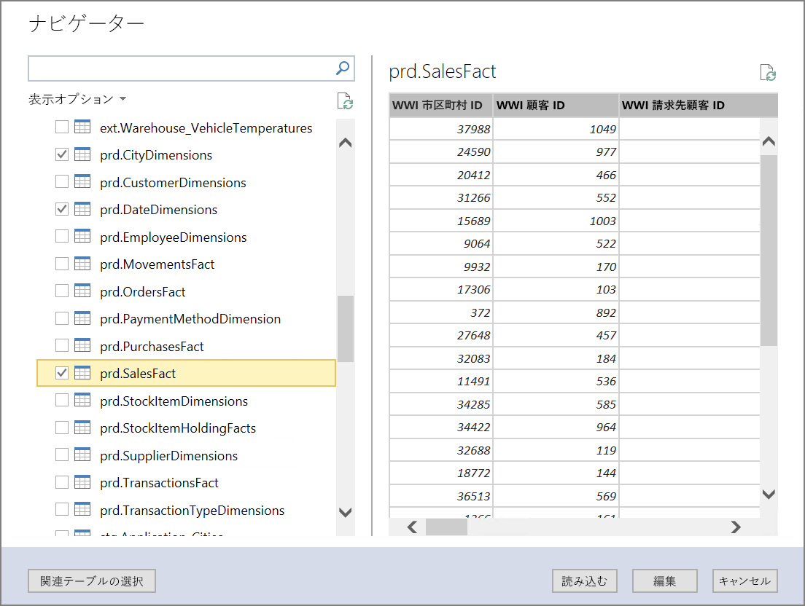
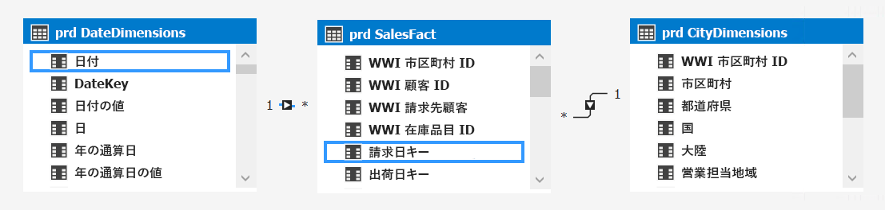
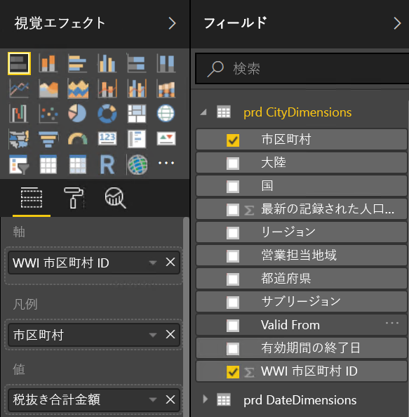
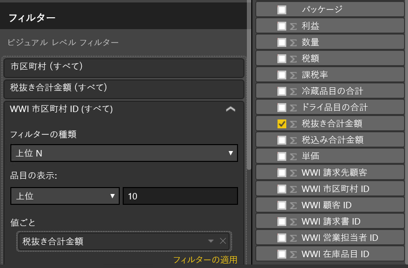
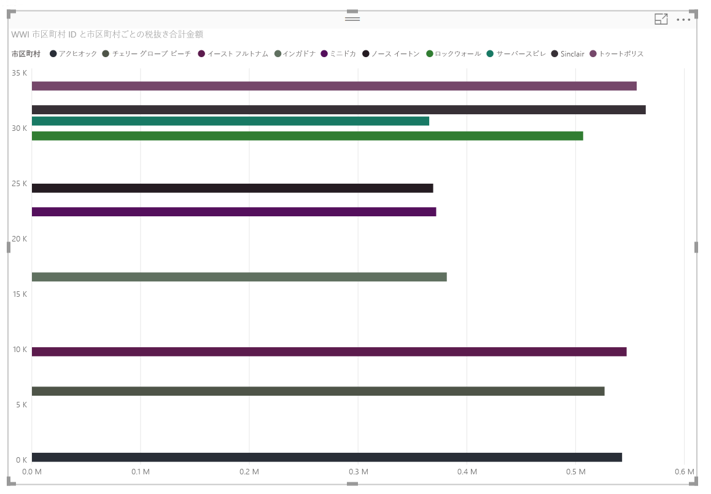

# <a name="enterprise-bi-with-sql-data-warehouse"></a><span data-ttu-id="d867d-103">SQL Data Warehouse を使用したエンタープライズ向け BI</span><span class="sxs-lookup"><span data-stu-id="d867d-103">Enterprise BI with SQL Data Warehouse</span></span>

<span data-ttu-id="d867d-104">この参照アーキテクチャでは、オンプレミスの SQL Server データベースから SQL Data Warehouse にデータを移動し、そのデータを分析用に変換する [ELT](../../data-guide/relational-data/etl.md#extract-load-and-transform-elt) (抽出-読み込み-変換) パイプラインを実装します。</span><span class="sxs-lookup"><span data-stu-id="d867d-104">This reference architecture implements an [ELT](../../data-guide/relational-data/etl.md#extract-load-and-transform-elt) (extract-load-transform) pipeline that moves data from an on-premises SQL Server database into SQL Data Warehouse and transforms the data for analysis.</span></span> [<span data-ttu-id="d867d-105">**こちらのソリューションをデプロイしてください**。</span><span class="sxs-lookup"><span data-stu-id="d867d-105">**Deploy this solution**.</span></span>](#deploy-the-solution)


<span data-ttu-id="d867d-106">**シナリオ**: ある組織に、オンプレミスの SQL Server データベースに格納された大規模な OLTP データ セットがあります。</span><span class="sxs-lookup"><span data-stu-id="d867d-106">**Scenario**: An organization has a large OLTP data set stored in a SQL Server database on premises.</span></span> <span data-ttu-id="d867d-107">この組織では、SQL Data Warehouse を使用して Power BI で分析を実行したいと考えています。</span><span class="sxs-lookup"><span data-stu-id="d867d-107">The organization wants to use SQL Data Warehouse to perform analysis using Power BI.</span></span> 

<span data-ttu-id="d867d-108">この参照アーキテクチャは、一度だけのジョブまたはオンデマンドのジョブ用に設計されています。</span><span class="sxs-lookup"><span data-stu-id="d867d-108">This reference architecture is designed for one-time or on-demand jobs.</span></span> <span data-ttu-id="d867d-109">継続的に (毎時または毎日) データを移動する必要がある場合は、Azure Data Factory を使用して自動化されたワークフローを定義することをお勧めします。</span><span class="sxs-lookup"><span data-stu-id="d867d-109">If you need to move data on a continuing basis (hourly or daily), we recommend using Azure Data Factory to define an automated workflow.</span></span> <span data-ttu-id="d867d-110">Data Factory を使用する参照アーキテクチャについては、「[Automated enterprise BI with SQL Data Warehouse and Azure Data Factory](./enterprise-bi-adf.md)」(SQL Data Warehouse と Azure Data Factory を使用したエンタープライズ BI の自動化) を参照してください。</span><span class="sxs-lookup"><span data-stu-id="d867d-110">For a reference architecture that uses Data Factory, see [Automated enterprise BI with SQL Data Warehouse and Azure Data Factory](./enterprise-bi-adf.md).</span></span>

## <a name="architecture"></a><span data-ttu-id="d867d-111">アーキテクチャ</span><span class="sxs-lookup"><span data-stu-id="d867d-111">Architecture</span></span>

<span data-ttu-id="d867d-112">アーキテクチャは、次のコンポーネントで構成されます。</span><span class="sxs-lookup"><span data-stu-id="d867d-112">The architecture consists of the following components.</span></span>

### <a name="data-source"></a><span data-ttu-id="d867d-113">データ ソース</span><span class="sxs-lookup"><span data-stu-id="d867d-113">Data source</span></span>

<span data-ttu-id="d867d-114">**SQL Server**。</span><span class="sxs-lookup"><span data-stu-id="d867d-114">**SQL Server**.</span></span> <span data-ttu-id="d867d-115">ソース データは、オンプレミスの SQL Server データベースにあります。</span><span class="sxs-lookup"><span data-stu-id="d867d-115">The source data is located in a SQL Server database on premises.</span></span> <span data-ttu-id="d867d-116">オンプレミス環境をシミュレートするために、このアーキテクチャのデプロイ スクリプトでは、SQL Server がインストールされた Azure の VM がプロビジョニングされます。</span><span class="sxs-lookup"><span data-stu-id="d867d-116">To simulate the on-premises environment, the deployment scripts for this architecture provision a VM in Azure with SQL Server installed.</span></span> <span data-ttu-id="d867d-117">[Wide World Importers OLTP サンプル データベース][wwi]は、ソース データベースとして使用されます。</span><span class="sxs-lookup"><span data-stu-id="d867d-117">The [Wide World Importers OLTP sample database][wwi] is used as the source data.</span></span>

### <a name="ingestion-and-data-storage"></a><span data-ttu-id="d867d-118">インジェストとデータ ストレージ</span><span class="sxs-lookup"><span data-stu-id="d867d-118">Ingestion and data storage</span></span>

<span data-ttu-id="d867d-119">**Blob Storage**。</span><span class="sxs-lookup"><span data-stu-id="d867d-119">**Blob Storage**.</span></span> <span data-ttu-id="d867d-120">Blob Storage は、データを SQL Data Warehouse に読み込む前にコピーするためのステージング領域として使用されます。</span><span class="sxs-lookup"><span data-stu-id="d867d-120">Blob storage is used as a staging area to copy the data before loading it into SQL Data Warehouse.</span></span>

<span data-ttu-id="d867d-121">**Azure SQL Data Warehouse**。</span><span class="sxs-lookup"><span data-stu-id="d867d-121">**Azure SQL Data Warehouse**.</span></span> <span data-ttu-id="d867d-122">[SQL Data Warehouse](/azure/sql-data-warehouse/) は、大規模なデータの分析を目的として設計された分散システムです。</span><span class="sxs-lookup"><span data-stu-id="d867d-122">[SQL Data Warehouse](/azure/sql-data-warehouse/) is a distributed system designed to perform analytics on large data.</span></span> <span data-ttu-id="d867d-123">超並列処理 (MPP) がサポートされているので、ハイパフォーマンス分析の実行に適しています。</span><span class="sxs-lookup"><span data-stu-id="d867d-123">It supports massive parallel processing (MPP), which makes it suitable for running high-performance analytics.</span></span> 

### <a name="analysis-and-reporting"></a><span data-ttu-id="d867d-124">分析とレポート</span><span class="sxs-lookup"><span data-stu-id="d867d-124">Analysis and reporting</span></span>

<span data-ttu-id="d867d-125">**Azure Analysis Services**。</span><span class="sxs-lookup"><span data-stu-id="d867d-125">**Azure Analysis Services**.</span></span> <span data-ttu-id="d867d-126">[Analysis Services](/azure/analysis-services/) は、データ モデリング機能を提供する完全なマネージド サービスです。</span><span class="sxs-lookup"><span data-stu-id="d867d-126">[Analysis Services](/azure/analysis-services/) is a fully managed service that provides data modeling capabilities.</span></span> <span data-ttu-id="d867d-127">Analysis Services を使用して、ユーザーがクエリを実行できるセマンティック モデルを作成します。</span><span class="sxs-lookup"><span data-stu-id="d867d-127">Use Analysis Services to create a semantic model that users can query.</span></span> <span data-ttu-id="d867d-128">Analysis Services は、BI ダッシュボード シナリオで特に役立ちます。</span><span class="sxs-lookup"><span data-stu-id="d867d-128">Analysis Services is especially useful in a BI dashboard scenario.</span></span> <span data-ttu-id="d867d-129">このアーキテクチャでは、Analysis Services がデータ ウェアハウスからデータを読み取ってセマンティック モデルを処理し、ダッシュボードのクエリを効率的に処理します。</span><span class="sxs-lookup"><span data-stu-id="d867d-129">In this architecture, Analysis Services reads data from the data warehouse to process the semantic model, and efficiently serves dashboard queries.</span></span> <span data-ttu-id="d867d-130">また、レプリカをスケールアウトしてクエリ処理を高速化することで、エラスティック同時実行もサポートします。</span><span class="sxs-lookup"><span data-stu-id="d867d-130">It also supports elastic concurrency, by scaling out replicas for faster query processing.</span></span>

<span data-ttu-id="d867d-131">現在、Azure Analysis Services では表形式モデルをサポートしていますが、多次元モデルはサポートしていません。</span><span class="sxs-lookup"><span data-stu-id="d867d-131">Currently, Azure Analysis Services supports tabular models but not multidimensional models.</span></span> <span data-ttu-id="d867d-132">表形式モデルではリレーショナル モデリング構造 (テーブル、列) を使用し、多次元モデルでは OLAP モデリング構造 (キューブ、ディメンション、メジャー) を使用します。</span><span class="sxs-lookup"><span data-stu-id="d867d-132">Tabular models use relational modeling constructs (tables and columns), whereas multidimensional models use OLAP modeling constructs (cubes, dimensions, and measures).</span></span> <span data-ttu-id="d867d-133">多次元モデルが必要な場合は、SQL Server Analysis Services (SSAS) を使用します。</span><span class="sxs-lookup"><span data-stu-id="d867d-133">If you require multidimensional models, use SQL Server Analysis Services (SSAS).</span></span> <span data-ttu-id="d867d-134">詳細については、「[テーブル ソリューションと多次元ソリューションの比較](/sql/analysis-services/comparing-tabular-and-multidimensional-solutions-ssas)」をご覧ください。</span><span class="sxs-lookup"><span data-stu-id="d867d-134">For more information, see [Comparing tabular and multidimensional solutions](/sql/analysis-services/comparing-tabular-and-multidimensional-solutions-ssas).</span></span>

<span data-ttu-id="d867d-135">**Power BI**。</span><span class="sxs-lookup"><span data-stu-id="d867d-135">**Power BI**.</span></span> <span data-ttu-id="d867d-136">Power BI は、データを分析してビジネスの洞察を得る一連のビジネス分析ツールです。</span><span class="sxs-lookup"><span data-stu-id="d867d-136">Power BI is a suite of business analytics tools to analyze data for business insights.</span></span> <span data-ttu-id="d867d-137">このアーキテクチャでは、Analysis Services に格納されたセマンティック モデルに対してクエリが実行されます。</span><span class="sxs-lookup"><span data-stu-id="d867d-137">In this architecture, it queries the semantic model stored in Analysis Services.</span></span>

### <a name="authentication"></a><span data-ttu-id="d867d-138">認証</span><span class="sxs-lookup"><span data-stu-id="d867d-138">Authentication</span></span>

<span data-ttu-id="d867d-139">**Azure Active Directory** (Azure AD)。Power BI から Analysis Services サーバーに接続するユーザーを認証します。</span><span class="sxs-lookup"><span data-stu-id="d867d-139">**Azure Active Directory** (Azure AD) authenticates users who connect to the Analysis Services server through Power BI.</span></span>

## <a name="data-pipeline"></a><span data-ttu-id="d867d-140">データ パイプライン</span><span class="sxs-lookup"><span data-stu-id="d867d-140">Data pipeline</span></span>
 
<span data-ttu-id="d867d-141">この参照アーキテクチャでは、[WorldWideImporters](/sql/sample/world-wide-importers/wide-world-importers-oltp-database) サンプル データベースをデータ ソースとして使用します。</span><span class="sxs-lookup"><span data-stu-id="d867d-141">This reference architecture uses the [WorldWideImporters](/sql/sample/world-wide-importers/wide-world-importers-oltp-database) sample database as a data source.</span></span> <span data-ttu-id="d867d-142">データ パイプラインには次のステージがあります。</span><span class="sxs-lookup"><span data-stu-id="d867d-142">The data pipeline has the following stages:</span></span>

1. <span data-ttu-id="d867d-143">SQL Server からフラット ファイルにデータをエクスポートします (bcp ユーティリティ)。</span><span class="sxs-lookup"><span data-stu-id="d867d-143">Export the data from SQL Server to flat files (bcp utility).</span></span>
2. <span data-ttu-id="d867d-144">フラット ファイルを Azure Blob Storage にコピーします (AzCopy)。</span><span class="sxs-lookup"><span data-stu-id="d867d-144">Copy the flat files to Azure Blob Storage (AzCopy).</span></span>
3. <span data-ttu-id="d867d-145">SQL Data Warehouse にデータを読み込みます (PolyBase)。</span><span class="sxs-lookup"><span data-stu-id="d867d-145">Load the data into SQL Data Warehouse (PolyBase).</span></span>
4. <span data-ttu-id="d867d-146">データをスター スキーマに変換します (T-SQL)。</span><span class="sxs-lookup"><span data-stu-id="d867d-146">Transform the data into a star schema (T-SQL).</span></span>
5. <span data-ttu-id="d867d-147">Analysis Services にセマンティック モデルを読み込みます (SQL Server Data Tools)。</span><span class="sxs-lookup"><span data-stu-id="d867d-147">Load a semantic model into Analysis Services (SQL Server Data Tools).</span></span>


 
> [!NOTE]
> <span data-ttu-id="d867d-148">手順 1 から 3 については、Redgate Data Platform Studio を使用することを検討してください。</span><span class="sxs-lookup"><span data-stu-id="d867d-148">For steps 1 &ndash; 3, consider using Redgate Data Platform Studio.</span></span> <span data-ttu-id="d867d-149">Data Platform Studio では、最も適切な互換性修正プログラムと最適化が適用されるため、SQL Data Warehouse をごく手軽に使い始めることができます。</span><span class="sxs-lookup"><span data-stu-id="d867d-149">Data Platform Studio applies the most appropriate compatibility fixes and optimizations, so it's the quickest way to get started with SQL Data Warehouse.</span></span> <span data-ttu-id="d867d-150">詳細については、[Redgate Data Platform Studio を使用したデータの読み込み](/azure/sql-data-warehouse/sql-data-warehouse-load-with-redgate)に関する記事をご覧ください。</span><span class="sxs-lookup"><span data-stu-id="d867d-150">For more information, see [Load data with Redgate Data Platform Studio](/azure/sql-data-warehouse/sql-data-warehouse-load-with-redgate).</span></span> 

<span data-ttu-id="d867d-151">以下のセクションでは、これらのステージについて詳しく説明します。</span><span class="sxs-lookup"><span data-stu-id="d867d-151">The next sections describe these stages in more detail.</span></span>

### <a name="export-data-from-sql-server"></a><span data-ttu-id="d867d-152">SQL Server からデータをエクスポートする</span><span class="sxs-lookup"><span data-stu-id="d867d-152">Export data from SQL Server</span></span>

<span data-ttu-id="d867d-153">[bcp](/sql/tools/bcp-utility) (一括コピー プログラム) ユーティリティを使用すると、SQL テーブルからフラット テキスト ファイルを迅速に作成できます。</span><span class="sxs-lookup"><span data-stu-id="d867d-153">The [bcp](/sql/tools/bcp-utility) (bulk copy program) utility is a fast way to create flat text files from SQL tables.</span></span> <span data-ttu-id="d867d-154">この手順では、エクスポートする列を選択しますが、データは変換しません。</span><span class="sxs-lookup"><span data-stu-id="d867d-154">In this step, you select the columns that you want to export, but don't transform the data.</span></span> <span data-ttu-id="d867d-155">データ変換は、SQL Data Warehouse で実行する必要があります。</span><span class="sxs-lookup"><span data-stu-id="d867d-155">Any data transformations should happen in SQL Data Warehouse.</span></span>

<span data-ttu-id="d867d-156">**Recommendations (推奨事項)**</span><span class="sxs-lookup"><span data-stu-id="d867d-156">**Recommendations**</span></span>

<span data-ttu-id="d867d-157">運用環境でのリソースの競合を最小限に抑えるために、可能であれば、データ抽出をピーク外の時間帯にスケジュールします。</span><span class="sxs-lookup"><span data-stu-id="d867d-157">If possible, schedule data extraction during off-peak hours, to minimize resource contention in the production environment.</span></span> 

<span data-ttu-id="d867d-158">データベース サーバーで bcp を実行しないようにしてください。</span><span class="sxs-lookup"><span data-stu-id="d867d-158">Avoid running bcp on the database server.</span></span> <span data-ttu-id="d867d-159">代わりに、別のコンピューターから実行します。</span><span class="sxs-lookup"><span data-stu-id="d867d-159">Instead, run it from another machine.</span></span> <span data-ttu-id="d867d-160">ファイルをローカル ドライブに書き込みます。</span><span class="sxs-lookup"><span data-stu-id="d867d-160">Write the files to a local drive.</span></span> <span data-ttu-id="d867d-161">同時書き込みを処理できるだけの十分な I/O リソースがあることを確認してください。</span><span class="sxs-lookup"><span data-stu-id="d867d-161">Ensure that you have sufficient I/O resources to handle the concurrent writes.</span></span> <span data-ttu-id="d867d-162">最適なパフォーマンスを得るために、専用の高速ストレージ ドライブにファイルをエクスポートします。</span><span class="sxs-lookup"><span data-stu-id="d867d-162">For best performance, export the files to dedicated fast storage drives.</span></span>

<span data-ttu-id="d867d-163">エクスポートされたデータを Gzip 圧縮形式で保存することで、ネットワーク転送を高速化できます。</span><span class="sxs-lookup"><span data-stu-id="d867d-163">You can speed up the network transfer by saving the exported data in Gzip compressed format.</span></span> <span data-ttu-id="d867d-164">ただし、ウェアハウスへの圧縮ファイルの読み込みは圧縮されていないファイルの読み込みよりも時間がかかるため、高速ネットワーク転送と高速読み込みの間にはトレードオフがあります。</span><span class="sxs-lookup"><span data-stu-id="d867d-164">However, loading compressed files into the warehouse is slower than loading uncompressed files, so there is a tradeoff between faster network transfer versus faster loading.</span></span> <span data-ttu-id="d867d-165">Gzip 圧縮を使用する場合は、単一の Gzip ファイルを作成しないでください。</span><span class="sxs-lookup"><span data-stu-id="d867d-165">If you decide to use Gzip compression, don't create a single Gzip file.</span></span> <span data-ttu-id="d867d-166">代わりに、データを複数の圧縮ファイルに分割します。</span><span class="sxs-lookup"><span data-stu-id="d867d-166">Instead, split the data into multiple compressed files.</span></span>

### <a name="copy-flat-files-into-blob-storage"></a><span data-ttu-id="d867d-167">フラット ファイルを Blob Storage にコピーする</span><span class="sxs-lookup"><span data-stu-id="d867d-167">Copy flat files into blob storage</span></span>

<span data-ttu-id="d867d-168">[AzCopy](/azure/storage/common/storage-use-azcopy) ユーティリティは、Azure Blob Storage への高パフォーマンスのデータ コピーを実行するように設計されています。</span><span class="sxs-lookup"><span data-stu-id="d867d-168">The [AzCopy](/azure/storage/common/storage-use-azcopy) utility is designed for high-performance copying of data into Azure blob storage.</span></span>

<span data-ttu-id="d867d-169">**Recommendations (推奨事項)**</span><span class="sxs-lookup"><span data-stu-id="d867d-169">**Recommendations**</span></span>

<span data-ttu-id="d867d-170">ソース データの場所に近いリージョンにストレージ アカウントを作成します。</span><span class="sxs-lookup"><span data-stu-id="d867d-170">Create the storage account in a region near the location of the source data.</span></span> <span data-ttu-id="d867d-171">ストレージ アカウントと SQL Data Warehouse インスタンスを同じリージョンにデプロイします。</span><span class="sxs-lookup"><span data-stu-id="d867d-171">Deploy the storage account and the SQL Data Warehouse instance in the same region.</span></span> 

<span data-ttu-id="d867d-172">CPU と I/O の消費が運用ワークロードを妨げる可能性があるため、運用ワークロードを実行するマシンで AzCopy を実行しないでください。</span><span class="sxs-lookup"><span data-stu-id="d867d-172">Don't run AzCopy on the same machine that runs your production workloads, because the CPU and I/O consumption can interfere with the production workload.</span></span> 

<span data-ttu-id="d867d-173">まず、アップロードをテストして、アップロード速度を確認します。</span><span class="sxs-lookup"><span data-stu-id="d867d-173">Test the upload first to see what the upload speed is like.</span></span> <span data-ttu-id="d867d-174">AzCopy で /NC オプションを使用して、同時コピー操作の数を指定できます。</span><span class="sxs-lookup"><span data-stu-id="d867d-174">You can use the /NC option in AzCopy to specify the number of concurrent copy operations.</span></span> <span data-ttu-id="d867d-175">既定値から始め、この設定を試してパフォーマンスを調整します。</span><span class="sxs-lookup"><span data-stu-id="d867d-175">Start with the default value, then experiment with this setting to tune the performance.</span></span> <span data-ttu-id="d867d-176">低帯域幅の環境では、同時実行操作数が多すぎると、ネットワーク接続に過剰な負荷がかかり、操作を正常に完了できなくなる可能性があります。</span><span class="sxs-lookup"><span data-stu-id="d867d-176">In a low-bandwidth environment, too many concurrent operations can overwhelm the network connection and prevent the operations from completing successfully.</span></span>  

<span data-ttu-id="d867d-177">AzCopy では、パブリック インターネット経由でデータをストレージに移動します。</span><span class="sxs-lookup"><span data-stu-id="d867d-177">AzCopy moves data to storage over the public internet.</span></span> <span data-ttu-id="d867d-178">速度が不十分な場合は、[ExpressRoute](/azure/expressroute/) 回線を設定することを検討してください。</span><span class="sxs-lookup"><span data-stu-id="d867d-178">If this isn't fast enough, consider setting up an [ExpressRoute](/azure/expressroute/) circuit.</span></span> <span data-ttu-id="d867d-179">ExpressRoute は、専用プライベート接続を通してデータを Azure にルーティングするサービスです。</span><span class="sxs-lookup"><span data-stu-id="d867d-179">ExpressRoute is a service that routes your data through a dedicated private connection to Azure.</span></span> <span data-ttu-id="d867d-180">ネットワーク接続が遅すぎる場合は、別の方法として、ディスク上のデータを Azure データセンターに物理的に送付します。</span><span class="sxs-lookup"><span data-stu-id="d867d-180">Another option, if your network connection is too slow, is to physically ship the data on disk to an Azure datacenter.</span></span> <span data-ttu-id="d867d-181">詳細については、「[Azure との間のデータ転送](/azure/architecture/data-guide/scenarios/data-transfer)」をご覧ください。</span><span class="sxs-lookup"><span data-stu-id="d867d-181">For more information, see [Transferring data to and from Azure](/azure/architecture/data-guide/scenarios/data-transfer).</span></span>

<span data-ttu-id="d867d-182">コピー操作中に、AzCopy によって一時ジャーナル ファイルが作成されます。これにより、(ネットワーク エラーなどが原因で) 操作が中断された場合に、AzCopy で操作を再開できます。</span><span class="sxs-lookup"><span data-stu-id="d867d-182">During a copy operation, AzCopy creates a temporary journal file, which enables AzCopy to restart the operation if it gets interrupted (for example, due to a network error).</span></span> <span data-ttu-id="d867d-183">ジャーナル ファイルを格納できる十分なディスク領域があることを確認してください。</span><span class="sxs-lookup"><span data-stu-id="d867d-183">Make sure there is enough disk space to store the journal files.</span></span> <span data-ttu-id="d867d-184">/Z オプションを使用して、ジャーナル ファイルの書き込み先を指定できます。</span><span class="sxs-lookup"><span data-stu-id="d867d-184">You can use the /Z option to specify where the journal files are written.</span></span>

### <a name="load-data-into-sql-data-warehouse"></a><span data-ttu-id="d867d-185">SQL Data Warehouse にデータを読み込む</span><span class="sxs-lookup"><span data-stu-id="d867d-185">Load data into SQL Data Warehouse</span></span>

<span data-ttu-id="d867d-186">[PolyBase](/sql/relational-databases/polybase/polybase-guide) を使用して、Blob Storage からデータ ウェアハウスにファイルを読み込みます。</span><span class="sxs-lookup"><span data-stu-id="d867d-186">Use [PolyBase](/sql/relational-databases/polybase/polybase-guide) to load the files from blob storage into the data warehouse.</span></span> <span data-ttu-id="d867d-187">PolyBase は、SQL Data Warehouse の MPP (超並列処理) アーキテクチャを活用するように設計されているので、SQL Data Warehouse にデータを読み込む最も速い方法です。</span><span class="sxs-lookup"><span data-stu-id="d867d-187">PolyBase is designed to leverage the MPP (Massively Parallel Processing) architecture of SQL Data Warehouse, which makes it the fastest way to load data into SQL Data Warehouse.</span></span> 

<span data-ttu-id="d867d-188">データの読み込みは次の 2 段階のプロセスです。</span><span class="sxs-lookup"><span data-stu-id="d867d-188">Loading the data is a two-step process:</span></span>

1. <span data-ttu-id="d867d-189">データの一連の外部テーブルを作成します。</span><span class="sxs-lookup"><span data-stu-id="d867d-189">Create a set of external tables for the data.</span></span> <span data-ttu-id="d867d-190">外部テーブルとは、ウェアハウスの外部に保存されたデータ (ここでは、Blob Storage 内のフラット ファイル) を参照するテーブル定義です。</span><span class="sxs-lookup"><span data-stu-id="d867d-190">An external table is a table definition that points to data stored outside of the warehouse &mdash; in this case, the flat files in blob storage.</span></span> <span data-ttu-id="d867d-191">この手順では、データをウェアハウスに移動しません。</span><span class="sxs-lookup"><span data-stu-id="d867d-191">This step does not move any data into the warehouse.</span></span>
2. <span data-ttu-id="d867d-192">ステージング テーブルを作成し、データをステージング テーブルに読み込みます。</span><span class="sxs-lookup"><span data-stu-id="d867d-192">Create staging tables, and load the data into the staging tables.</span></span> <span data-ttu-id="d867d-193">この手順でデータをウェアハウスにコピーします。</span><span class="sxs-lookup"><span data-stu-id="d867d-193">This step copies the data into the warehouse.</span></span>

<span data-ttu-id="d867d-194">**Recommendations (推奨事項)**</span><span class="sxs-lookup"><span data-stu-id="d867d-194">**Recommendations**</span></span>

<span data-ttu-id="d867d-195">大量のデータ (1 TB 超) があり、並列処理のメリットが得られる分析ワークロードを実行する場合に、SQL Data Warehouse を検討します。</span><span class="sxs-lookup"><span data-stu-id="d867d-195">Consider SQL Data Warehouse when you have large amounts of data (more than 1 TB) and are running an analytics workload that will benefit from parallelism.</span></span> <span data-ttu-id="d867d-196">SQL Data Warehouse は、OLTP ワークロードや小規模のデータ セット (250 GB 未満) には適していません。</span><span class="sxs-lookup"><span data-stu-id="d867d-196">SQL Data Warehouse is not a good fit for OLTP workloads or smaller data sets (< 250GB).</span></span> <span data-ttu-id="d867d-197">250 GB 未満のデータ セットについては、Azure SQL Database または SQL Server を検討します。</span><span class="sxs-lookup"><span data-stu-id="d867d-197">For data sets less than 250GB, consider Azure SQL Database or SQL Server.</span></span> <span data-ttu-id="d867d-198">詳細については、[データ ウェアハウス](../../data-guide/relational-data/data-warehousing.md)に関する記事をご覧ください。</span><span class="sxs-lookup"><span data-stu-id="d867d-198">For more information, see [Data warehousing](../../data-guide/relational-data/data-warehousing.md).</span></span>

<span data-ttu-id="d867d-199">インデックスのないヒープ テーブルとしてステージング テーブルを作成します。</span><span class="sxs-lookup"><span data-stu-id="d867d-199">Create the staging tables as heap tables, which are not indexed.</span></span> <span data-ttu-id="d867d-200">運用テーブルを作成するクエリにより、フル テーブル スキャンが実行されることになるため、ステージング テーブルのインデックスを作成する理由はありません。</span><span class="sxs-lookup"><span data-stu-id="d867d-200">The queries that create the production tables will result in a full table scan, so there is no reason to index the staging tables.</span></span>

<span data-ttu-id="d867d-201">PolyBase では、ウェアハウスで並列処理を自動的に利用します。</span><span class="sxs-lookup"><span data-stu-id="d867d-201">PolyBase automatically takes advantage of parallelism in the warehouse.</span></span> <span data-ttu-id="d867d-202">DWU を増やすと、読み込みパフォーマンスが向上します。</span><span class="sxs-lookup"><span data-stu-id="d867d-202">The load performance scales as you increase DWUs.</span></span> <span data-ttu-id="d867d-203">最適なパフォーマンスを得るために、単一の読み込み操作を使用します。</span><span class="sxs-lookup"><span data-stu-id="d867d-203">For best performance, use a single load operation.</span></span> <span data-ttu-id="d867d-204">入力データをチャンクに分割し、複数の同時読み込みを実行すると、パフォーマンス上のメリットは得られません。</span><span class="sxs-lookup"><span data-stu-id="d867d-204">There is no performance benefit to breaking the input data into chunks and running multiple concurrent loads.</span></span>

<span data-ttu-id="d867d-205">PolyBase では Gzip 圧縮ファイルを読み取ることができます。</span><span class="sxs-lookup"><span data-stu-id="d867d-205">PolyBase can read Gzip compressed files.</span></span> <span data-ttu-id="d867d-206">ただし、ファイルの圧縮解除はシングル スレッド操作であるため、リーダーは圧縮ファイルごとに 1 つしか使用されません。</span><span class="sxs-lookup"><span data-stu-id="d867d-206">However, only a single reader is used per compressed file, because uncompressing the file is a single-threaded operation.</span></span> <span data-ttu-id="d867d-207">そのため、単一の大きな圧縮ファイルの読み込みは避けてください。</span><span class="sxs-lookup"><span data-stu-id="d867d-207">Therefore, avoid loading a single large compressed file.</span></span> <span data-ttu-id="d867d-208">代わりに、並列処理を活用するために、データを複数の圧縮ファイルに分割します。</span><span class="sxs-lookup"><span data-stu-id="d867d-208">Instead, split the data into multiple compressed files, in order to take advantage of parallelism.</span></span> 

<span data-ttu-id="d867d-209">次の制限事項に注意してください。</span><span class="sxs-lookup"><span data-stu-id="d867d-209">Be aware of the following limitations:</span></span>

- <span data-ttu-id="d867d-210">PolyBase でサポートされる最大列サイズは、`varchar(8000)`、`nvarchar(4000)`、または `varbinary(8000)` です。</span><span class="sxs-lookup"><span data-stu-id="d867d-210">PolyBase supports a maximum column size of `varchar(8000)`, `nvarchar(4000)`, or `varbinary(8000)`.</span></span> <span data-ttu-id="d867d-211">これらの制限を超えるデータがある場合、1 つの方法として、エクスポート時にデータをチャンクに分割し、インポート後にチャンクを再構築します。</span><span class="sxs-lookup"><span data-stu-id="d867d-211">If you have data that exceeds these limits, one option is to break the data up into chunks when you export it, and then reassemble the chunks after import.</span></span> 

- <span data-ttu-id="d867d-212">PolyBase では、固定行ターミネータとして \n または改行を使用します。</span><span class="sxs-lookup"><span data-stu-id="d867d-212">PolyBase uses a fixed row terminator of \n or newline.</span></span> <span data-ttu-id="d867d-213">ソース データに改行文字が出現すると、問題が発生する可能性があります。</span><span class="sxs-lookup"><span data-stu-id="d867d-213">This can cause problems if newline characters appear in the source data.</span></span>

- <span data-ttu-id="d867d-214">ソース データ スキーマに、SQL Data Warehouse でサポートされていないデータ型が含まれている場合があります。</span><span class="sxs-lookup"><span data-stu-id="d867d-214">Your source data schema might contain data types that are not supported in SQL Data Warehouse.</span></span>

<span data-ttu-id="d867d-215">これらの制限を回避するには、必要な変換を実行するストアド プロシージャを作成します。</span><span class="sxs-lookup"><span data-stu-id="d867d-215">To work around these limitations, you can create a stored procedure that performs the necessary conversions.</span></span> <span data-ttu-id="d867d-216">bcp の実行時に、このストアド プロシージャを参照します。</span><span class="sxs-lookup"><span data-stu-id="d867d-216">Reference this stored procedure when you run bcp.</span></span> <span data-ttu-id="d867d-217">また、[Redgate Data Platform Studio](/azure/sql-data-warehouse/sql-data-warehouse-load-with-redgate) を使用して、SQL Data Warehouse でサポートされていないデータ型を自動的に変換することもできます。</span><span class="sxs-lookup"><span data-stu-id="d867d-217">Alternatively, [Redgate Data Platform Studio](/azure/sql-data-warehouse/sql-data-warehouse-load-with-redgate) automatically converts data types that aren’t supported in SQL Data Warehouse.</span></span>

<span data-ttu-id="d867d-218">詳細については、次の記事を参照してください。</span><span class="sxs-lookup"><span data-stu-id="d867d-218">For more information, see the following articles:</span></span>

- <span data-ttu-id="d867d-219">[Azure SQL Data Warehouse へのデータ読み込みのベスト プラクティス](/azure/sql-data-warehouse/guidance-for-loading-data)</span><span class="sxs-lookup"><span data-stu-id="d867d-219">[Best practices for loading data into Azure SQL Data Warehouse](/azure/sql-data-warehouse/guidance-for-loading-data).</span></span>
- [<span data-ttu-id="d867d-220">SQL Data Warehouse にスキーマを移行する</span><span class="sxs-lookup"><span data-stu-id="d867d-220">Migrate your schemas to SQL Data Warehouse</span></span>](/azure/sql-data-warehouse/sql-data-warehouse-migrate-schema)
- [<span data-ttu-id="d867d-221">SQL Data Warehouse でのテーブルのデータ型の定義に関するガイダンス</span><span class="sxs-lookup"><span data-stu-id="d867d-221">Guidance for defining data types for tables in SQL Data Warehouse</span></span>](/azure/sql-data-warehouse/sql-data-warehouse-tables-data-types)

### <a name="transform-the-data"></a><span data-ttu-id="d867d-222">データの変換</span><span class="sxs-lookup"><span data-stu-id="d867d-222">Transform the data</span></span>

<span data-ttu-id="d867d-223">データを変換し、運用テーブルに移動します。</span><span class="sxs-lookup"><span data-stu-id="d867d-223">Transform the data and move it into production tables.</span></span> <span data-ttu-id="d867d-224">この手順では、ディメンション テーブルとファクト テーブルで構成され、セマンティック モデリングに適したスター スキーマにデータが変換されます。</span><span class="sxs-lookup"><span data-stu-id="d867d-224">In this step, the data is transformed into a star schema with dimension tables and fact tables, suitable for semantic modeling.</span></span>

<span data-ttu-id="d867d-225">クラスター化列ストア インデックスを設定して運用テーブルを作成します。これにより、全体として最適なクエリ パフォーマンスが実現されます。</span><span class="sxs-lookup"><span data-stu-id="d867d-225">Create the production tables with clustered columnstore indexes, which offer the best overall query performance.</span></span> <span data-ttu-id="d867d-226">列ストア インデックスは、多数のレコードをスキャンするクエリに最適化されています。</span><span class="sxs-lookup"><span data-stu-id="d867d-226">Columnstore indexes are optimized for queries that scan many records.</span></span> <span data-ttu-id="d867d-227">列ストア インデックスは、単一ルックアップ (つまり、単一行の検索) には適していません。</span><span class="sxs-lookup"><span data-stu-id="d867d-227">Columnstore indexes don't perform as well for singleton lookups (that is, looking up a single row).</span></span> <span data-ttu-id="d867d-228">単一ルックアップを頻繁に実行する必要がある場合は、テーブルに非クラスター化インデックスを追加できます。</span><span class="sxs-lookup"><span data-stu-id="d867d-228">If you need to perform frequent singleton lookups, you can add a non-clustered index to a table.</span></span> <span data-ttu-id="d867d-229">非クラスター化インデックスを使用すると、単一ルックアップの実行を大幅に高速化できます。</span><span class="sxs-lookup"><span data-stu-id="d867d-229">Singleton lookups can run significantly faster using a non-clustered index.</span></span> <span data-ttu-id="d867d-230">ただし、データ ウェアハウス シナリオでは、通常、単一ルックアップは OLTP ワークロードほど一般的ではありません。</span><span class="sxs-lookup"><span data-stu-id="d867d-230">However, singleton lookups are typically less common in data warehouse scenarios than OLTP workloads.</span></span> <span data-ttu-id="d867d-231">詳細については、「[SQL Data Warehouse でのテーブルのインデックス作成](/azure/sql-data-warehouse/sql-data-warehouse-tables-index)」をご覧ください。</span><span class="sxs-lookup"><span data-stu-id="d867d-231">For more information, see [Indexing tables in SQL Data Warehouse](/azure/sql-data-warehouse/sql-data-warehouse-tables-index).</span></span>

> [!NOTE]
> <span data-ttu-id="d867d-232">クラスター化列ストア テーブルでは、`varchar(max)`、`nvarchar(max)`、`varbinary(max)` の各データ型はサポートしていません。</span><span class="sxs-lookup"><span data-stu-id="d867d-232">Clustered columnstore tables do not support `varchar(max)`, `nvarchar(max)`, or `varbinary(max)` data types.</span></span> <span data-ttu-id="d867d-233">その場合、ヒープ インデックスまたはクラスター化インデックスを検討してください。</span><span class="sxs-lookup"><span data-stu-id="d867d-233">In that case, consider a heap or clustered index.</span></span> <span data-ttu-id="d867d-234">それらの列を別のテーブルに配置できます。</span><span class="sxs-lookup"><span data-stu-id="d867d-234">You might put those columns into a separate table.</span></span>

<span data-ttu-id="d867d-235">サンプル データベースはそれほど大きくないので、パーティションなしでレプリケート テーブルが作成されました。</span><span class="sxs-lookup"><span data-stu-id="d867d-235">Because the sample database is not very large, we created replicated tables with no partitions.</span></span> <span data-ttu-id="d867d-236">運用ワークロードでは、分散テーブルを使用すると、クエリ パフォーマンスが向上する可能性があります。</span><span class="sxs-lookup"><span data-stu-id="d867d-236">For production workloads, using distributed tables is likely to improve query performance.</span></span> <span data-ttu-id="d867d-237">「[Azure SQL Data Warehouse での分散テーブルの設計に関するガイダンス](/azure/sql-data-warehouse/sql-data-warehouse-tables-distribute)」をご覧ください。</span><span class="sxs-lookup"><span data-stu-id="d867d-237">See [Guidance for designing distributed tables in Azure SQL Data Warehouse](/azure/sql-data-warehouse/sql-data-warehouse-tables-distribute).</span></span> <span data-ttu-id="d867d-238">サンプル スクリプトでは、静的[リソース クラス](/azure/sql-data-warehouse/resource-classes-for-workload-management)を使用してクエリが実行されます。</span><span class="sxs-lookup"><span data-stu-id="d867d-238">Our example scripts run the queries using a static [resource class](/azure/sql-data-warehouse/resource-classes-for-workload-management).</span></span>

### <a name="load-the-semantic-model"></a><span data-ttu-id="d867d-239">セマンティック モデルを読み込む</span><span class="sxs-lookup"><span data-stu-id="d867d-239">Load the semantic model</span></span>

<span data-ttu-id="d867d-240">Azure Analysis Services で表形式モデルにデータを読み込みます。</span><span class="sxs-lookup"><span data-stu-id="d867d-240">Load the data into a tabular model in Azure Analysis Services.</span></span> <span data-ttu-id="d867d-241">この手順では、SQL Server Data Tools (SSDT) を使用してセマンティック データ モデルを作成します。</span><span class="sxs-lookup"><span data-stu-id="d867d-241">In this step, you create a semantic data model by using SQL Server Data Tools (SSDT).</span></span> <span data-ttu-id="d867d-242">モデルは、Power BI Desktop ファイルからインポートして作成することもできます。</span><span class="sxs-lookup"><span data-stu-id="d867d-242">You can also create a model by importing it from a Power BI Desktop file.</span></span> <span data-ttu-id="d867d-243">SQL Data Warehouse では外部キーをサポートしていないため、テーブル間の結合を可能にするために、セマンティック モデルにリレーションシップを追加する必要があります。</span><span class="sxs-lookup"><span data-stu-id="d867d-243">Because SQL Data Warehouse does not support foreign keys, you must add the relationships to the semantic model, so that you can join across tables.</span></span>

### <a name="use-power-bi-to-visualize-the-data"></a><span data-ttu-id="d867d-244">Power BI を使用してデータを視覚化する</span><span class="sxs-lookup"><span data-stu-id="d867d-244">Use Power BI to visualize the data</span></span>

<span data-ttu-id="d867d-245">Power BI では、Azure Analysis Services に接続するための 2 つのオプションをサポートしています。</span><span class="sxs-lookup"><span data-stu-id="d867d-245">Power BI supports two options for connecting to Azure Analysis Services:</span></span>

- <span data-ttu-id="d867d-246">インポート。</span><span class="sxs-lookup"><span data-stu-id="d867d-246">Import.</span></span> <span data-ttu-id="d867d-247">データは Power BI モデルにインポートされます。</span><span class="sxs-lookup"><span data-stu-id="d867d-247">The data is imported into the Power BI model.</span></span>
- <span data-ttu-id="d867d-248">ライブ接続。</span><span class="sxs-lookup"><span data-stu-id="d867d-248">Live Connection.</span></span> <span data-ttu-id="d867d-249">データは Analysis Services から直接取得されます。</span><span class="sxs-lookup"><span data-stu-id="d867d-249">Data is pulled directly from Analysis Services.</span></span>

<span data-ttu-id="d867d-250">Power BI モデルにデータをコピーする必要がないため、ライブ接続をお勧めします。</span><span class="sxs-lookup"><span data-stu-id="d867d-250">We recommend Live Connection because it doesn't require copying data into the Power BI model.</span></span> <span data-ttu-id="d867d-251">また、DirectQuery を使用すると、結果を最新のソース データと常に一致させることができます。</span><span class="sxs-lookup"><span data-stu-id="d867d-251">Also, using DirectQuery ensures that results are always consistent with the latest source data.</span></span> <span data-ttu-id="d867d-252">詳細については、「[Power BI を使用した接続](/azure/analysis-services/analysis-services-connect-pbi)」をご覧ください。</span><span class="sxs-lookup"><span data-stu-id="d867d-252">For more information, see [Connect with Power BI](/azure/analysis-services/analysis-services-connect-pbi).</span></span>

<span data-ttu-id="d867d-253">**Recommendations (推奨事項)**</span><span class="sxs-lookup"><span data-stu-id="d867d-253">**Recommendations**</span></span>

<span data-ttu-id="d867d-254">BI ダッシュボードのクエリをデータ ウェアハウスに対して直接実行しないようにしてください。</span><span class="sxs-lookup"><span data-stu-id="d867d-254">Avoid running BI dashboard queries directly against the data warehouse.</span></span> <span data-ttu-id="d867d-255">BI ダッシュボードでは、応答時間が非常に短いことが求められます。ウェアハウスに対してクエリを直接実行すると、この要件を満たすことができない可能性があります。</span><span class="sxs-lookup"><span data-stu-id="d867d-255">BI dashboards require very low response times, which direct queries against the warehouse may be unable to satisfy.</span></span> <span data-ttu-id="d867d-256">また、ダッシュボードの更新は同時クエリの数にカウントされるので、パフォーマンスに影響を及ぼす可能性があります。</span><span class="sxs-lookup"><span data-stu-id="d867d-256">Also, refreshing the dashboard will count against the number of concurrent queries, which could impact performance.</span></span> 

<span data-ttu-id="d867d-257">Azure Analysis Services は、BI ダッシュボードのクエリ要件に対応するように設計されているため、Power BI から Analysis Services に対するクエリを実行することをお勧めします。</span><span class="sxs-lookup"><span data-stu-id="d867d-257">Azure Analysis Services is designed to handle the query requirements of a BI dashboard, so the recommended practice is to query Analysis Services from Power BI.</span></span>

## <a name="scalability-considerations"></a><span data-ttu-id="d867d-258">スケーラビリティに関する考慮事項</span><span class="sxs-lookup"><span data-stu-id="d867d-258">Scalability considerations</span></span>

### <a name="sql-data-warehouse"></a><span data-ttu-id="d867d-259">SQL Data Warehouse</span><span class="sxs-lookup"><span data-stu-id="d867d-259">SQL Data Warehouse</span></span>

<span data-ttu-id="d867d-260">SQL Data Warehouse では、コンピューティング リソースをオンデマンドでスケールアウトできます。</span><span class="sxs-lookup"><span data-stu-id="d867d-260">With SQL Data Warehouse, you can scale out your compute resources on demand.</span></span> <span data-ttu-id="d867d-261">クエリ エンジンは、コンピューティング ノードの数に基づいてクエリを並列処理に最適化し、必要に応じてノード間でデータを移動します。</span><span class="sxs-lookup"><span data-stu-id="d867d-261">The query engine optimizes queries for parallel processing based on the number of compute nodes, and moves data between nodes as necessary.</span></span> <span data-ttu-id="d867d-262">詳細については、「[Azure SQL Data Warehouse でのコンピューティングの管理](/azure/sql-data-warehouse/sql-data-warehouse-manage-compute-overview)」をご覧ください。</span><span class="sxs-lookup"><span data-stu-id="d867d-262">For more information, see [Manage compute in Azure SQL Data Warehouse](/azure/sql-data-warehouse/sql-data-warehouse-manage-compute-overview).</span></span>

### <a name="analysis-services"></a><span data-ttu-id="d867d-263">Analysis Services</span><span class="sxs-lookup"><span data-stu-id="d867d-263">Analysis Services</span></span>

<span data-ttu-id="d867d-264">Azure Analysis Services の Standard レベルでは、パーティション分割と DirectQuery をサポートしているため、運用ワークロードには Standard レベルをお勧めします。</span><span class="sxs-lookup"><span data-stu-id="d867d-264">For production workloads, we recommend the Standard Tier for Azure Analysis Services, because it supports partitioning and DirectQuery.</span></span> <span data-ttu-id="d867d-265">レベル内では、インスタンスのサイズによってメモリと処理能力が決まります。</span><span class="sxs-lookup"><span data-stu-id="d867d-265">Within a tier, the instance size determines the memory and processing power.</span></span> <span data-ttu-id="d867d-266">処理能力は、クエリ処理ユニット (QPU) で測定されます。</span><span class="sxs-lookup"><span data-stu-id="d867d-266">Processing power is measured in Query Processing Units (QPUs).</span></span> <span data-ttu-id="d867d-267">QPU 使用量を監視して適切なサイズを選択します。</span><span class="sxs-lookup"><span data-stu-id="d867d-267">Monitor your QPU usage to select the appropriate size.</span></span> <span data-ttu-id="d867d-268">詳細については、「[サーバー メトリックの監視](/azure/analysis-services/analysis-services-monitor)」をご覧ください。</span><span class="sxs-lookup"><span data-stu-id="d867d-268">For more information, see [Monitor server metrics](/azure/analysis-services/analysis-services-monitor).</span></span>

<span data-ttu-id="d867d-269">高負荷時には、クエリの同時実行によってクエリ パフォーマンスが低下する可能性があります。</span><span class="sxs-lookup"><span data-stu-id="d867d-269">Under high load, query performance can become degraded due to query concurrency.</span></span> <span data-ttu-id="d867d-270">より多くのクエリを同時に実行できるように、クエリを処理するレプリカのプールを作成して Analysis Services をスケールアウトできます。</span><span class="sxs-lookup"><span data-stu-id="d867d-270">You can scale out Analysis Services by creating a pool of replicas to process queries, so that more queries can be performed concurrently.</span></span> <span data-ttu-id="d867d-271">データ モデルの処理は、常にプライマリ サーバーで行われます。</span><span class="sxs-lookup"><span data-stu-id="d867d-271">The work of processing the data model always happens on the primary server.</span></span> <span data-ttu-id="d867d-272">既定では、クエリもプライマリ サーバーで処理されます。</span><span class="sxs-lookup"><span data-stu-id="d867d-272">By default, the primary server also handles queries.</span></span> <span data-ttu-id="d867d-273">必要に応じて、クエリ プールですべてのクエリが処理されるように、処理を排他的に実行するプライマリ サーバーを指定することもできます。</span><span class="sxs-lookup"><span data-stu-id="d867d-273">Optionally, you can designate the primary server to run processing exclusively, so that the query pool handles all queries.</span></span> <span data-ttu-id="d867d-274">高い処理要件がある場合は、クエリ プールから処理を切り離す必要があります。</span><span class="sxs-lookup"><span data-stu-id="d867d-274">If you have high processing requirements, you should separate the processing from the query pool.</span></span> <span data-ttu-id="d867d-275">クエリ負荷が高く、処理が比較的軽い場合は、プライマリ サーバーをクエリ プールに含めることができます。</span><span class="sxs-lookup"><span data-stu-id="d867d-275">If you have high query loads, and relatively light processing, you can include the primary server in the query pool.</span></span> <span data-ttu-id="d867d-276">詳細については、「[Azure Analysis Services のスケールアウト](/azure/analysis-services/analysis-services-scale-out)」をご覧ください。</span><span class="sxs-lookup"><span data-stu-id="d867d-276">For more information, see [Azure Analysis Services scale-out](/azure/analysis-services/analysis-services-scale-out).</span></span> 

<span data-ttu-id="d867d-277">不要な処理の量を減らすために、パーティションを使用して表形式モデルを論理部分に分割することを検討してください。</span><span class="sxs-lookup"><span data-stu-id="d867d-277">To reduce the amount of unnecessary processing, consider using partitions to divide the tabular model into logical parts.</span></span> <span data-ttu-id="d867d-278">各パーティションは個別に処理できます。</span><span class="sxs-lookup"><span data-stu-id="d867d-278">Each partition can be processed separately.</span></span> <span data-ttu-id="d867d-279">詳細については、「[パーティション](/sql/analysis-services/tabular-models/partitions-ssas-tabular)」をご覧ください。</span><span class="sxs-lookup"><span data-stu-id="d867d-279">For more information, see [Partitions](/sql/analysis-services/tabular-models/partitions-ssas-tabular).</span></span>

## <a name="security-considerations"></a><span data-ttu-id="d867d-280">セキュリティに関する考慮事項</span><span class="sxs-lookup"><span data-stu-id="d867d-280">Security considerations</span></span>

### <a name="ip-whitelisting-of-analysis-services-clients"></a><span data-ttu-id="d867d-281">Analysis Services クライアントの IP ホワイトリスト登録</span><span class="sxs-lookup"><span data-stu-id="d867d-281">IP whitelisting of Analysis Services clients</span></span>

<span data-ttu-id="d867d-282">Analysis Services のファイアウォール機能を使用して、クライアントの IP アドレスをホワイトリストに登録することを検討します。</span><span class="sxs-lookup"><span data-stu-id="d867d-282">Consider using the Analysis Services firewall feature to whitelist client IP addresses.</span></span> <span data-ttu-id="d867d-283">ファイアウォールを有効にすると、ファイアウォール規則で指定された接続以外のすべてのクライアント接続がブロックされます。</span><span class="sxs-lookup"><span data-stu-id="d867d-283">If enabled, the firewall blocks all client connections other than those specified in the firewall rules.</span></span> <span data-ttu-id="d867d-284">既定の規則では Power BI サービスがホワイトリストに登録されますが、必要に応じてこの規則を無効にすることができます。</span><span class="sxs-lookup"><span data-stu-id="d867d-284">The default rules whitelist the Power BI service, but you can disable this rule if desired.</span></span> <span data-ttu-id="d867d-285">詳細については、「[Hardening Azure Analysis Services with the new firewall capability (新しいファイアウォール機能による Azure Analysis Services の強化)](https://azure.microsoft.com/blog/hardening-azure-analysis-services-with-the-new-firewall-capability/)」をご覧ください。</span><span class="sxs-lookup"><span data-stu-id="d867d-285">For more information, see [Hardening Azure Analysis Services with the new firewall capability](https://azure.microsoft.com/blog/hardening-azure-analysis-services-with-the-new-firewall-capability/).</span></span>

### <a name="authorization"></a><span data-ttu-id="d867d-286">承認</span><span class="sxs-lookup"><span data-stu-id="d867d-286">Authorization</span></span>

<span data-ttu-id="d867d-287">Azure Analysis Services では、Azure Active Directory (Azure AD) を使用して Analysis Services サーバーに接続するユーザーを認証します。</span><span class="sxs-lookup"><span data-stu-id="d867d-287">Azure Analysis Services uses Azure Active Directory (Azure AD) to authenticate users who connect to an Analysis Services server.</span></span> <span data-ttu-id="d867d-288">ロールを作成し、Azure AD ユーザーまたはグループをそれらのロールに割り当てることで、特定のユーザーが表示できるデータを制限できます。</span><span class="sxs-lookup"><span data-stu-id="d867d-288">You can restrict what data a particular user is able to view, by creating roles and then assigning Azure AD users or groups to those roles.</span></span> <span data-ttu-id="d867d-289">各ロールでは次のことが可能です。</span><span class="sxs-lookup"><span data-stu-id="d867d-289">For each role, you can:</span></span> 

- <span data-ttu-id="d867d-290">テーブルまたは個々の列を保護する。</span><span class="sxs-lookup"><span data-stu-id="d867d-290">Protect tables or individual columns.</span></span> 
- <span data-ttu-id="d867d-291">フィルター式に基づいて個々の行を保護する。</span><span class="sxs-lookup"><span data-stu-id="d867d-291">Protect individual rows based on filter expressions.</span></span> 

<span data-ttu-id="d867d-292">詳細については、「[データベース ロールとユーザーの管理](/azure/analysis-services/analysis-services-database-users)」をご覧ください。</span><span class="sxs-lookup"><span data-stu-id="d867d-292">For more information, see [Manage database roles and users](/azure/analysis-services/analysis-services-database-users).</span></span>

## <a name="deploy-the-solution"></a><span data-ttu-id="d867d-293">ソリューションのデプロイ方法</span><span class="sxs-lookup"><span data-stu-id="d867d-293">Deploy the solution</span></span>

<span data-ttu-id="d867d-294">このリファレンス アーキテクチャのデプロイについては、[GitHub][ref-arch-repo-folder] を参照してください。</span><span class="sxs-lookup"><span data-stu-id="d867d-294">A deployment for this reference architecture is available on [GitHub][ref-arch-repo-folder].</span></span> <span data-ttu-id="d867d-295">以下がデプロイされます。</span><span class="sxs-lookup"><span data-stu-id="d867d-295">It deploys the following:</span></span>

  * <span data-ttu-id="d867d-296">オンプレミスのデータベース サーバーをシミュレートする Windows VM。</span><span class="sxs-lookup"><span data-stu-id="d867d-296">A Windows VM to simulate an on-premises database server.</span></span> <span data-ttu-id="d867d-297">これには、SQL Server 2017 と関連ツール、および Power BI Desktop が含まれています。</span><span class="sxs-lookup"><span data-stu-id="d867d-297">It includes SQL Server 2017 and related tools, along with Power BI Desktop.</span></span>
  * <span data-ttu-id="d867d-298">SQL Server データベースからエクスポートされたデータを保持する Blob Storage を提供する Azure ストレージ アカウント。</span><span class="sxs-lookup"><span data-stu-id="d867d-298">An Azure storage account that provides Blob storage to hold data exported from the SQL Server database.</span></span>
  * <span data-ttu-id="d867d-299">Azure SQL Data Warehouse インスタンス。</span><span class="sxs-lookup"><span data-stu-id="d867d-299">An Azure SQL Data Warehouse instance.</span></span>
  * <span data-ttu-id="d867d-300">Azure Analysis Services インスタンス。</span><span class="sxs-lookup"><span data-stu-id="d867d-300">An Azure Analysis Services instance.</span></span>

### <a name="prerequisites"></a><span data-ttu-id="d867d-301">前提条件</span><span class="sxs-lookup"><span data-stu-id="d867d-301">Prerequisites</span></span>

[!INCLUDE [ref-arch-prerequisites.md](../../../includes/ref-arch-prerequisites.md)]

### <a name="deploy-the-simulated-on-premises-server"></a><span data-ttu-id="d867d-302">シミュレートされたオンプレミスのサーバーをデプロイする</span><span class="sxs-lookup"><span data-stu-id="d867d-302">Deploy the simulated on-premises server</span></span>

<span data-ttu-id="d867d-303">まず、SQL Server 2017 と関連ツールを含む、シミュレートされたオンプレミスのサーバーとして VM をデプロイします。</span><span class="sxs-lookup"><span data-stu-id="d867d-303">First you'll deploy a VM as a simulated on-premises server, which includes SQL Server 2017 and related tools.</span></span> <span data-ttu-id="d867d-304">また、この手順では、[Wide World Importers OLTP データベース][wwi]を SQL Server に読み込みます。</span><span class="sxs-lookup"><span data-stu-id="d867d-304">This step also loads the [Wide World Importers OLTP database][wwi] into SQL Server.</span></span>

1. <span data-ttu-id="d867d-305">リポジトリの `data\enterprise_bi_sqldw\onprem\templates` フォルダーに移動します。</span><span class="sxs-lookup"><span data-stu-id="d867d-305">Navigate to the `data\enterprise_bi_sqldw\onprem\templates` folder of the repository.</span></span>

2. <span data-ttu-id="d867d-306">`onprem.parameters.json` ファイルで、`adminUsername` と `adminPassword` の値を置き換えます。</span><span class="sxs-lookup"><span data-stu-id="d867d-306">In the `onprem.parameters.json` file, replace the values for `adminUsername` and `adminPassword`.</span></span> <span data-ttu-id="d867d-307">また、`SqlUserCredentials` セクションの値を、ユーザー名およびパスワードと一致するように変更します。</span><span class="sxs-lookup"><span data-stu-id="d867d-307">Also change the values in the `SqlUserCredentials` section to match the user name and password.</span></span> <span data-ttu-id="d867d-308">userName プロパティの `.\\` プレフィックスに注意してください。</span><span class="sxs-lookup"><span data-stu-id="d867d-308">Note the `.\\` prefix in the userName property.</span></span>
    
    ```bash
    "SqlUserCredentials": {
      "userName": ".\\username",
      "password": "password"
    }
    ```

3. <span data-ttu-id="d867d-309">次のように `azbb` を実行して、オンプレミスのサーバーをデプロイします。</span><span class="sxs-lookup"><span data-stu-id="d867d-309">Run `azbb` as shown below to deploy the on-premises server.</span></span>

    ```bash
    azbb -s <subscription_id> -g <resource_group_name> -l <region> -p onprem.parameters.json --deploy
    ```

    <span data-ttu-id="d867d-310">SQL Data Warehouse と Azure Analysis Services をサポートするリージョンを指定します。</span><span class="sxs-lookup"><span data-stu-id="d867d-310">Specify a region that supports SQL Data Warehouse and Azure Analysis Services.</span></span> <span data-ttu-id="d867d-311">「[リージョン別の Azure 製品](https://azure.microsoft.com/global-infrastructure/services/)」を参照してください。</span><span class="sxs-lookup"><span data-stu-id="d867d-311">See [Azure Products by Region](https://azure.microsoft.com/global-infrastructure/services/)</span></span>

4. <span data-ttu-id="d867d-312">デプロイが完了するまで 20 ～ 30 分かかることがあります。これには、ツールをインストールし、データベースを復元する [DSC](/powershell/dsc/overview) スクリプトの実行が含まれます。</span><span class="sxs-lookup"><span data-stu-id="d867d-312">The deployment may take 20 to 30 minutes to complete, which includes running the [DSC](/powershell/dsc/overview) script to install the tools and restore the database.</span></span> <span data-ttu-id="d867d-313">リソース グループ内のリソースを確認して、Azure Portal 上でデプロイを確認します。</span><span class="sxs-lookup"><span data-stu-id="d867d-313">Verify the deployment in the Azure portal by reviewing the resources in the resource group.</span></span> <span data-ttu-id="d867d-314">`sql-vm1` 仮想マシンとその関連するリソースが表示されます。</span><span class="sxs-lookup"><span data-stu-id="d867d-314">You should see the `sql-vm1` virtual machine and its associated resources.</span></span>

### <a name="deploy-the-azure-resources"></a><span data-ttu-id="d867d-315">Azure リソースをデプロイする</span><span class="sxs-lookup"><span data-stu-id="d867d-315">Deploy the Azure resources</span></span>

<span data-ttu-id="d867d-316">この手順では、ストレージ アカウントと共に、SQL Data Warehouse と Azure Analysis Services をプロビジョニングします。</span><span class="sxs-lookup"><span data-stu-id="d867d-316">This step provisions SQL Data Warehouse and Azure Analysis Services, along with a Storage account.</span></span> <span data-ttu-id="d867d-317">必要であれば、前の手順と並行してこの手順を実行できます。</span><span class="sxs-lookup"><span data-stu-id="d867d-317">If you want, you can run this step in parallel with the previous step.</span></span>

1. <span data-ttu-id="d867d-318">リポジトリの `data\enterprise_bi_sqldw\azure\templates` フォルダーに移動します。</span><span class="sxs-lookup"><span data-stu-id="d867d-318">Navigate to the `data\enterprise_bi_sqldw\azure\templates` folder of the repository.</span></span>

2. <span data-ttu-id="d867d-319">次の Azure CLI コマンドを実行して、リソース グループを作成します。</span><span class="sxs-lookup"><span data-stu-id="d867d-319">Run the following Azure CLI command to create a resource group.</span></span> <span data-ttu-id="d867d-320">前の手順とは異なるリソース グループにデプロイできますが、同じリージョンを選択してください。</span><span class="sxs-lookup"><span data-stu-id="d867d-320">You can deploy to a different resource group than the previous step, but choose the same region.</span></span> 

    ```bash
    az group create --name <resource_group_name> --location <region>  
    ```

3. <span data-ttu-id="d867d-321">次の Azure CLI コマンドを実行して、Azure リソースをデプロイします。</span><span class="sxs-lookup"><span data-stu-id="d867d-321">Run the following Azure CLI command to deploy the Azure resources.</span></span> <span data-ttu-id="d867d-322">山かっこ内に示されるパラメーター値を置き換えます。</span><span class="sxs-lookup"><span data-stu-id="d867d-322">Replace the parameter values shown in angle brackets.</span></span> 

    ```bash
    az group deployment create --resource-group <resource_group_name> \
     --template-file azure-resources-deploy.json \
     --parameters "dwServerName"="<server_name>" \
     "dwAdminLogin"="<admin_username>" "dwAdminPassword"="<password>" \ 
     "storageAccountName"="<storage_account_name>" \
     "analysisServerName"="<analysis_server_name>" \
     "analysisServerAdmin"="user@contoso.com"
    ```

    - <span data-ttu-id="d867d-323">`storageAccountName` パラメーターは、ストレージ アカウントの[名前付け規則](../../best-practices/naming-conventions.md#naming-rules-and-restrictions)に従う必要があります。</span><span class="sxs-lookup"><span data-stu-id="d867d-323">The `storageAccountName` parameter must follow the [naming rules](../../best-practices/naming-conventions.md#naming-rules-and-restrictions) for Storage accounts.</span></span>
    - <span data-ttu-id="d867d-324">`analysisServerAdmin` パラメーターには、Azure Active Directory ユーザー プリンシパル名 (UPN) を使用します。</span><span class="sxs-lookup"><span data-stu-id="d867d-324">For the `analysisServerAdmin` parameter, use your Azure Active Directory user principal name (UPN).</span></span>

4. <span data-ttu-id="d867d-325">リソース グループ内のリソースを確認して、Azure Portal 上でデプロイを確認します。</span><span class="sxs-lookup"><span data-stu-id="d867d-325">Verify the deployment in the Azure portal by reviewing the resources in the resource group.</span></span> <span data-ttu-id="d867d-326">ストレージ アカウント、Azure SQL Data Warehouse インスタンス、Analysis Services インスタンスが表示されます。</span><span class="sxs-lookup"><span data-stu-id="d867d-326">You should see a storage account, Azure SQL Data Warehouse instance, and Analysis Services instance.</span></span>

5. <span data-ttu-id="d867d-327">Azure Portal を使用して、ストレージ アカウントのアクセス キーを取得します。</span><span class="sxs-lookup"><span data-stu-id="d867d-327">Use the Azure portal to get the access key for the storage account.</span></span> <span data-ttu-id="d867d-328">ストレージ アカウントを選択して開きます。</span><span class="sxs-lookup"><span data-stu-id="d867d-328">Select the storage account to open it.</span></span> <span data-ttu-id="d867d-329">**[設定]** で **[アクセス キー]** を選択します。</span><span class="sxs-lookup"><span data-stu-id="d867d-329">Under **Settings**, select **Access keys**.</span></span> <span data-ttu-id="d867d-330">主キーの値をコピーします。</span><span class="sxs-lookup"><span data-stu-id="d867d-330">Copy the primary key value.</span></span> <span data-ttu-id="d867d-331">この値は次の手順で使用します。</span><span class="sxs-lookup"><span data-stu-id="d867d-331">You will use it in the next step.</span></span>

### <a name="export-the-source-data-to-azure-blob-storage"></a><span data-ttu-id="d867d-332">ソース データを Azure Blob Storage にエクスポートする</span><span class="sxs-lookup"><span data-stu-id="d867d-332">Export the source data to Azure Blob storage</span></span> 

<span data-ttu-id="d867d-333">この手順では、bcp を使用して SQL データベースを VM 上のフラット ファイルにエクスポートし、AzCopy を使用してそれらのファイルを Azure Blob Storage にコピーする PowerShell スクリプトを実行します。</span><span class="sxs-lookup"><span data-stu-id="d867d-333">In this step, you will run a PowerShell script that uses bcp to export the SQL database to flat files on the VM, and then uses AzCopy to copy those files into Azure Blob Storage.</span></span>

1. <span data-ttu-id="d867d-334">リモート デスクトップを使用して、シミュレートされたオンプレミスの VM に接続します。</span><span class="sxs-lookup"><span data-stu-id="d867d-334">Use Remote Desktop to connect to the simulated on-premises VM.</span></span>

2. <span data-ttu-id="d867d-335">VM にログインしている間に、PowerShell ウィンドウから次のコマンドを実行します。</span><span class="sxs-lookup"><span data-stu-id="d867d-335">While logged into the VM, run the following commands from a PowerShell window.</span></span>  

    ```powershell
    cd 'C:\SampleDataFiles\reference-architectures\data\enterprise_bi_sqldw\onprem'

    .\Load_SourceData_To_Blob.ps1 -File .\sql_scripts\db_objects.txt -Destination 'https://<storage_account_name>.blob.core.windows.net/wwi' -StorageAccountKey '<storage_account_key>'
    ```

    <span data-ttu-id="d867d-336">`Destination` パラメーターでは、`<storage_account_name>` を前に作成したストレージ アカウントの名前に置き換えます。</span><span class="sxs-lookup"><span data-stu-id="d867d-336">For the `Destination` parameter, replace `<storage_account_name>` with the name the Storage account that you created previously.</span></span> <span data-ttu-id="d867d-337">`StorageAccountKey` パラメーターには、そのストレージ アカウントのアクセス キーを使用します。</span><span class="sxs-lookup"><span data-stu-id="d867d-337">For the `StorageAccountKey` parameter, use the access key for that Storage account.</span></span>

3. <span data-ttu-id="d867d-338">Azure Portal 上でストレージ アカウントに移動し、Blob service を選択して、`wwi` コンテナーを開き、ソース データが Blob Storage にコピーされていることを確認します。</span><span class="sxs-lookup"><span data-stu-id="d867d-338">In the Azure portal, verify that the source data was copied to Blob storage by navigating to the storage account, selecting the Blob service, and opening the `wwi` container.</span></span> <span data-ttu-id="d867d-339">`WorldWideImporters_Application_*` で始まるテーブルの一覧が表示されます。</span><span class="sxs-lookup"><span data-stu-id="d867d-339">You should see a list of tables prefaced with `WorldWideImporters_Application_*`.</span></span>

### <a name="run-the-data-warehouse-scripts"></a><span data-ttu-id="d867d-340">データ ウェアハウスのスクリプトを実行する</span><span class="sxs-lookup"><span data-stu-id="d867d-340">Run the data warehouse scripts</span></span>

1. <span data-ttu-id="d867d-341">リモート デスクトップ セッションから、SQL Server Management Studio (SSMS) を起動します。</span><span class="sxs-lookup"><span data-stu-id="d867d-341">From your Remote Desktop session, launch SQL Server Management Studio (SSMS).</span></span> 

2. <span data-ttu-id="d867d-342">SQL Data Warehouse への接続</span><span class="sxs-lookup"><span data-stu-id="d867d-342">Connect to SQL Data Warehouse</span></span>

    - <span data-ttu-id="d867d-343">サーバーの種類: データベース エンジン</span><span class="sxs-lookup"><span data-stu-id="d867d-343">Server type: Database Engine</span></span>
    
    - <span data-ttu-id="d867d-344">サーバー名: `<dwServerName>.database.windows.net`。`<dwServerName>` は、Azure リソースをデプロイしたときに指定した名前です。</span><span class="sxs-lookup"><span data-stu-id="d867d-344">Server name: `<dwServerName>.database.windows.net`, where `<dwServerName>` is the name that you specified when you deployed the Azure resources.</span></span> <span data-ttu-id="d867d-345">この名前は Azure Portal から取得できます。</span><span class="sxs-lookup"><span data-stu-id="d867d-345">You can get this name from the Azure portal.</span></span>
    
    - <span data-ttu-id="d867d-346">認証: SQL Server 認証。</span><span class="sxs-lookup"><span data-stu-id="d867d-346">Authentication: SQL Server Authentication.</span></span> <span data-ttu-id="d867d-347">`dwAdminLogin` パラメーターと `dwAdminPassword` パラメーターには、Azure リソースをデプロイしたときに指定した資格情報を使用します。</span><span class="sxs-lookup"><span data-stu-id="d867d-347">Use the credentials that you specified when you deployed the Azure resources, in the `dwAdminLogin` and `dwAdminPassword` parameters.</span></span>

2. <span data-ttu-id="d867d-348">VM 上の `C:\SampleDataFiles\reference-architectures\data\enterprise_bi_sqldw\azure\sqldw_scripts` フォルダーに移動します。</span><span class="sxs-lookup"><span data-stu-id="d867d-348">Navigate to the `C:\SampleDataFiles\reference-architectures\data\enterprise_bi_sqldw\azure\sqldw_scripts` folder on the VM.</span></span> <span data-ttu-id="d867d-349">このフォルダー内のスクリプトを番号順 (`STEP_1` ～ `STEP_7`) に実行します。</span><span class="sxs-lookup"><span data-stu-id="d867d-349">You will execute the scripts in this folder in numerical order, `STEP_1` through `STEP_7`.</span></span>

3. <span data-ttu-id="d867d-350">SSMS で `master` データベースを選択し、`STEP_1` スクリプトを開きます。</span><span class="sxs-lookup"><span data-stu-id="d867d-350">Select the `master` database in SSMS and open the `STEP_1` script.</span></span> <span data-ttu-id="d867d-351">次の行のパスワードの値を変更してから、スクリプトを実行します。</span><span class="sxs-lookup"><span data-stu-id="d867d-351">Change the value of the password in the following line, then execute the script.</span></span>

    ```sql
    CREATE LOGIN LoaderRC20 WITH PASSWORD = '<change this value>';
    ```

4. <span data-ttu-id="d867d-352">SSMS で `wwi` データベースを選択します。</span><span class="sxs-lookup"><span data-stu-id="d867d-352">Select the `wwi` database in SSMS.</span></span> <span data-ttu-id="d867d-353">`STEP_2` スクリプトを開き、スクリプトを実行します。</span><span class="sxs-lookup"><span data-stu-id="d867d-353">Open the `STEP_2` script and execute the script.</span></span> <span data-ttu-id="d867d-354">エラーが発生した場合は、`master` ではなく、`wwi` データベースに対してスクリプトを実行していることを確認してください。</span><span class="sxs-lookup"><span data-stu-id="d867d-354">If you get an error, make sure you are running the script against the `wwi` database and not `master`.</span></span>

5. <span data-ttu-id="d867d-355">`STEP_1` スクリプトに示された `LoaderRC20` ユーザーとパスワードを使用して、SQL Data Warehouse への新しい接続を開きます。</span><span class="sxs-lookup"><span data-stu-id="d867d-355">Open a new connection to SQL Data Warehouse, using the `LoaderRC20` user and the password indicated in the `STEP_1` script.</span></span>

6. <span data-ttu-id="d867d-356">この接続を使用して、`STEP_3` スクリプトを開きます。</span><span class="sxs-lookup"><span data-stu-id="d867d-356">Using this connection, open the `STEP_3` script.</span></span> <span data-ttu-id="d867d-357">スクリプトに次の値を設定します。</span><span class="sxs-lookup"><span data-stu-id="d867d-357">Set the following values in the script:</span></span>

    - <span data-ttu-id="d867d-358">SECRET: ストレージ アカウントのアクセス キーを使用します。</span><span class="sxs-lookup"><span data-stu-id="d867d-358">SECRET: Use the access key for your storage account.</span></span>
    - <span data-ttu-id="d867d-359">LOCATION: `wasbs://wwi@<storage_account_name>.blob.core.windows.net` のように、ストレージ アカウントの名前を使用します。</span><span class="sxs-lookup"><span data-stu-id="d867d-359">LOCATION: Use the name of the storage account as follows: `wasbs://wwi@<storage_account_name>.blob.core.windows.net`.</span></span>

7. <span data-ttu-id="d867d-360">同じ接続を使用して、`STEP_4` から `STEP_7` までスクリプトを順次実行します。</span><span class="sxs-lookup"><span data-stu-id="d867d-360">Using the same connection, execute scripts `STEP_4` through `STEP_7` sequentially.</span></span> <span data-ttu-id="d867d-361">各スクリプトが正常に完了したことを確認してから、次のスクリプトを実行してください。</span><span class="sxs-lookup"><span data-stu-id="d867d-361">Verify that each script completes successfully before running the next.</span></span>

<span data-ttu-id="d867d-362">SMSS に、`wwi` データベースの一連の `prd.*` テーブルが表示されます。</span><span class="sxs-lookup"><span data-stu-id="d867d-362">In SMSS, you should see a set of `prd.*` tables in the `wwi` database.</span></span> <span data-ttu-id="d867d-363">データが生成されたことを確認するには、次のクエリを実行します。</span><span class="sxs-lookup"><span data-stu-id="d867d-363">To verify that the data was generated, run the following query:</span></span> 

```sql
SELECT TOP 10 * FROM prd.CityDimensions
```

## <a name="build-the-analysis-services-model"></a><span data-ttu-id="d867d-364">Analysis Services モデルを作成する</span><span class="sxs-lookup"><span data-stu-id="d867d-364">Build the Analysis Services model</span></span>

<span data-ttu-id="d867d-365">この手順では、データ ウェアハウスからデータをインポートする表形式モデルを作成します。</span><span class="sxs-lookup"><span data-stu-id="d867d-365">In this step, you will create a tabular model that imports data from the data warehouse.</span></span> <span data-ttu-id="d867d-366">次に、そのモデルを Azure Analysis Services にデプロイします。</span><span class="sxs-lookup"><span data-stu-id="d867d-366">Then you will deploy the model to Azure Analysis Services.</span></span>

1. <span data-ttu-id="d867d-367">リモート デスクトップ セッションから、SQL Server Data Tools 2015 を起動します。</span><span class="sxs-lookup"><span data-stu-id="d867d-367">From your Remote Desktop session, launch SQL Server Data Tools 2015.</span></span>

2. <span data-ttu-id="d867d-368">**[ファイル]** > **[新規作成]** > **[プロジェクト]** の順に選択します。</span><span class="sxs-lookup"><span data-stu-id="d867d-368">Select **File** > **New** > **Project**.</span></span>

3. <span data-ttu-id="d867d-369">**[新しいプロジェクト]** ダイアログの **[テンプレート]** で、**[ビジネス インテリジェンス]** > **[Analysis Services]** > **[Analysis Services 表形式プロジェクト]** を選択します。</span><span class="sxs-lookup"><span data-stu-id="d867d-369">In the **New Project** dialog, under **Templates**, select  **Business Intelligence** > **Analysis Services** > **Analysis Services Tabular Project**.</span></span> 

4. <span data-ttu-id="d867d-370">プロジェクトに名前を付け、**[OK]** をクリックします。</span><span class="sxs-lookup"><span data-stu-id="d867d-370">Name the project and click **OK**.</span></span>

5. <span data-ttu-id="d867d-371">**[テーブル モデル デザイナー]** ダイアログで **[統合ワークスペース]** を選択し、**[互換性レベル]** を `SQL Server 2017 / Azure Analysis Services (1400)` に設定します。</span><span class="sxs-lookup"><span data-stu-id="d867d-371">In the **Tabular model designer** dialog, select **Integrated workspace**  and set **Compatibility level** to `SQL Server 2017 / Azure Analysis Services (1400)`.</span></span> <span data-ttu-id="d867d-372">Click **OK**.</span><span class="sxs-lookup"><span data-stu-id="d867d-372">Click **OK**.</span></span>

6. <span data-ttu-id="d867d-373">**[表形式モデル エクスプローラー]** ウィンドウで、プロジェクトを右クリックし、**[Import from Data Source]\(データ ソースからインポート\)** を選択します。</span><span class="sxs-lookup"><span data-stu-id="d867d-373">In the **Tabular Model Explorer** window, right-click the project and select **Import from Data Source**.</span></span>

7. <span data-ttu-id="d867d-374">**[Azure SQL Data Warehouse]** を選択し、**[接続]** をクリックします。</span><span class="sxs-lookup"><span data-stu-id="d867d-374">Select **Azure SQL Data Warehouse** and click **Connect**.</span></span>

8. <span data-ttu-id="d867d-375">**[サーバー]** に、Azure SQL Data Warehouse サーバーの完全修飾名を入力します。</span><span class="sxs-lookup"><span data-stu-id="d867d-375">For **Server**, enter the fully qualified name of your Azure SQL Data Warehouse server.</span></span> <span data-ttu-id="d867d-376">**[データベース]** に「`wwi`」と入力します。</span><span class="sxs-lookup"><span data-stu-id="d867d-376">For **Database**, enter `wwi`.</span></span> <span data-ttu-id="d867d-377">Click **OK**.</span><span class="sxs-lookup"><span data-stu-id="d867d-377">Click **OK**.</span></span>

9. <span data-ttu-id="d867d-378">次のダイアログで**データベース**認証を選択し、Azure SQL Data Warehouse のユーザー名とパスワードを入力して、**[OK]** をクリックします。</span><span class="sxs-lookup"><span data-stu-id="d867d-378">In the next dialog, choose **Database** authentication and enter your Azure SQL Data Warehouse user name and password, and click **OK**.</span></span>

10. <span data-ttu-id="d867d-379">**[ナビゲーター]** ダイアログで、**[prd.CityDimensions]**、**[prd.DateDimensions]**、**[prd.SalesFact]** の各チェック ボックスをオンにします。</span><span class="sxs-lookup"><span data-stu-id="d867d-379">In the **Navigator** dialog, select the checkboxes for **prd.CityDimensions**, **prd.DateDimensions**, and **prd.SalesFact**.</span></span> 

    

11. <span data-ttu-id="d867d-380">**[読み込み]** をクリックします。</span><span class="sxs-lookup"><span data-stu-id="d867d-380">Click **Load**.</span></span> <span data-ttu-id="d867d-381">処理が完了したら、**[閉じる]** をクリックします。</span><span class="sxs-lookup"><span data-stu-id="d867d-381">When processing is complete, click **Close**.</span></span> <span data-ttu-id="d867d-382">データの表形式ビューが表示されます。</span><span class="sxs-lookup"><span data-stu-id="d867d-382">You should now see a tabular view of the data.</span></span>

12. <span data-ttu-id="d867d-383">**[表形式モデル エクスプローラー]** ウィンドウで、プロジェクトを右クリックし、**[モデル ビュー]** > **[ダイアグラム ビュー]** を選択します。</span><span class="sxs-lookup"><span data-stu-id="d867d-383">In the **Tabular Model Explorer** window, right-click the project and select **Model View** > **Diagram View**.</span></span>

13. <span data-ttu-id="d867d-384">**[prd.SalesFact].[WWI City ID]** フィールドを **[prd.CityDimensions].[WWI City ID]** フィールドにドラッグして、リレーションシップを作成します。</span><span class="sxs-lookup"><span data-stu-id="d867d-384">Drag the **[prd.SalesFact].[WWI City ID]** field to the **[prd.CityDimensions].[WWI City ID]** field to create a relationship.</span></span>  

14. <span data-ttu-id="d867d-385">**[prd.SalesFact].[Invoice Date Key]** フィールドを **[prd.DateDimensions].[Date]** フィールドにドラッグします。</span><span class="sxs-lookup"><span data-stu-id="d867d-385">Drag the **[prd.SalesFact].[Invoice Date Key]** field to the **[prd.DateDimensions].[Date]** field.</span></span>  
    

15. <span data-ttu-id="d867d-386">**[ファイル]** メニューの **[すべて保存]** を選択します。</span><span class="sxs-lookup"><span data-stu-id="d867d-386">From the **File** menu, choose **Save All**.</span></span>  

16. <span data-ttu-id="d867d-387">**ソリューション エクスプローラー**で、プロジェクトを右クリックし、**[プロパティ]** を選択します。</span><span class="sxs-lookup"><span data-stu-id="d867d-387">In **Solution Explorer**, right-click the project and select **Properties**.</span></span> 

17. <span data-ttu-id="d867d-388">**[サーバー]** で、Azure Analysis Services インスタンスの URL を入力します。</span><span class="sxs-lookup"><span data-stu-id="d867d-388">Under **Server**, enter the URL of your Azure Analysis Services instance.</span></span> <span data-ttu-id="d867d-389">この値は Azure Portal から取得できます。</span><span class="sxs-lookup"><span data-stu-id="d867d-389">You can get this value from the Azure Portal.</span></span> <span data-ttu-id="d867d-390">ポータルで Analysis Services リソースを選択し、[概要] ウィンドウをクリックして、**[サーバー名]** プロパティを探します。</span><span class="sxs-lookup"><span data-stu-id="d867d-390">In the portal, select the Analysis Services resource, click the Overview pane, and look for the **Server Name** property.</span></span> <span data-ttu-id="d867d-391">これは、`asazure://westus.asazure.windows.net/contoso` のようになります。</span><span class="sxs-lookup"><span data-stu-id="d867d-391">It will be similar to `asazure://westus.asazure.windows.net/contoso`.</span></span> <span data-ttu-id="d867d-392">Click **OK**.</span><span class="sxs-lookup"><span data-stu-id="d867d-392">Click **OK**.</span></span>

    

18. <span data-ttu-id="d867d-393">**ソリューション エクスプローラー**で、プロジェクトを右クリックし、**[配置]** を選択します。</span><span class="sxs-lookup"><span data-stu-id="d867d-393">In **Solution Explorer**, right-click the project and select **Deploy**.</span></span> <span data-ttu-id="d867d-394">メッセージが表示されたら、Azure にサインインします。</span><span class="sxs-lookup"><span data-stu-id="d867d-394">Sign into Azure if prompted.</span></span> <span data-ttu-id="d867d-395">処理が完了したら、**[閉じる]** をクリックします。</span><span class="sxs-lookup"><span data-stu-id="d867d-395">When processing is complete, click **Close**.</span></span>

19. <span data-ttu-id="d867d-396">Azure Portal 上で、Azure Analysis Services インスタンスの詳細を表示します。</span><span class="sxs-lookup"><span data-stu-id="d867d-396">In the Azure portal, view the details for your Azure Analysis Services instance.</span></span> <span data-ttu-id="d867d-397">モデルの一覧に、作成したモデルが表示されていることを確認します。</span><span class="sxs-lookup"><span data-stu-id="d867d-397">Verify that your model appears in the list of models.</span></span>

    

## <a name="analyze-the-data-in-power-bi-desktop"></a><span data-ttu-id="d867d-398">Power BI Desktop でデータを分析する</span><span class="sxs-lookup"><span data-stu-id="d867d-398">Analyze the data in Power BI Desktop</span></span>

<span data-ttu-id="d867d-399">この手順では、Power BI を使用して Analysis Services のデータからレポートを作成します。</span><span class="sxs-lookup"><span data-stu-id="d867d-399">In this step, you will use Power BI to create a report from the data in Analysis Services.</span></span>

1. <span data-ttu-id="d867d-400">リモート デスクトップ セッションから、Power BI Desktop を起動します。</span><span class="sxs-lookup"><span data-stu-id="d867d-400">From your Remote Desktop session, launch Power BI Desktop.</span></span>

2. <span data-ttu-id="d867d-401">ようこそ画面で、**[データを取得]** をクリックします。</span><span class="sxs-lookup"><span data-stu-id="d867d-401">In the Welcome Scren, click **Get Data**.</span></span>

3. <span data-ttu-id="d867d-402">**[Azure]** > **[Azure Analysis Services データベース]** を選択します。</span><span class="sxs-lookup"><span data-stu-id="d867d-402">Select **Azure** > **Azure Analysis Services database**.</span></span> <span data-ttu-id="d867d-403">**[接続]**</span><span class="sxs-lookup"><span data-stu-id="d867d-403">Click **Connect**</span></span>

    

4. <span data-ttu-id="d867d-404">Analysis Services インスタンスの URL を入力し、**[OK]** をクリックします。</span><span class="sxs-lookup"><span data-stu-id="d867d-404">Enter the URL of your Analysis Services instance, then click **OK**.</span></span> <span data-ttu-id="d867d-405">メッセージが表示されたら、Azure にサインインします。</span><span class="sxs-lookup"><span data-stu-id="d867d-405">Sign into Azure if prompted.</span></span>

5. <span data-ttu-id="d867d-406">**[ナビゲーター]** ダイアログで、配置済みの表形式プロジェクトを展開し、作成したモデルを選択して、**[OK]** をクリックします。</span><span class="sxs-lookup"><span data-stu-id="d867d-406">In the **Navigator** dialog, expand the tabular project that you deployed, select the model that you created, and click **OK**.</span></span>

2. <span data-ttu-id="d867d-407">**[視覚化]** ウィンドウで、**[積み上げ横棒グラフ]** アイコンをクリックします。</span><span class="sxs-lookup"><span data-stu-id="d867d-407">In the **Visualizations** pane, select the **Stacked Bar Chart** icon.</span></span> <span data-ttu-id="d867d-408">レポート ビューで、グラフのサイズを変更して拡大します。</span><span class="sxs-lookup"><span data-stu-id="d867d-408">In the Report view, resize the visualization to make it larger.</span></span>

6. <span data-ttu-id="d867d-409">**[フィールド]** ウィンドウで **[prd.CityDimensions]** を展開します。</span><span class="sxs-lookup"><span data-stu-id="d867d-409">In the **Fields** pane, expand **prd.CityDimensions**.</span></span>

7. <span data-ttu-id="d867d-410">**[prd.CityDimensions]** > **[WWI City ID]** を **[軸]** ウェルにドラッグします。</span><span class="sxs-lookup"><span data-stu-id="d867d-410">Drag **prd.CityDimensions** > **WWI City ID** to the **Axis** well.</span></span>

8. <span data-ttu-id="d867d-411">**[prd.CityDimensions]** > **[City]** を **[凡例]** ウェルにドラッグします。</span><span class="sxs-lookup"><span data-stu-id="d867d-411">Drag **prd.CityDimensions** > **City** to the **Legend** well.</span></span>

9. <span data-ttu-id="d867d-412">**[フィールド]** ウィンドウで **[prd.SalesFact]** を展開します。</span><span class="sxs-lookup"><span data-stu-id="d867d-412">In the **Fields** pane, expand **prd.SalesFact**.</span></span>

10. <span data-ttu-id="d867d-413">**[prd.SalesFact]** > **[Total Excluding Tax]** を **[値]** ウェルにドラッグします。</span><span class="sxs-lookup"><span data-stu-id="d867d-413">Drag **prd.SalesFact** > **Total Excluding Tax** to the **Value** well.</span></span>

    

11. <span data-ttu-id="d867d-414">**[ビジュアル レベル フィルター]** で **[WWI City ID]** を選択します。</span><span class="sxs-lookup"><span data-stu-id="d867d-414">Under **Visual Level Filters**, select **WWI City ID**.</span></span>

12. <span data-ttu-id="d867d-415">**[フィルターの種類]** を `Top N` に設定し、**[アイテムの表示]** を `Top 10` に設定します。</span><span class="sxs-lookup"><span data-stu-id="d867d-415">Set the **Filter Type** to `Top N`, and set **Show Items** to `Top 10`.</span></span>

13. <span data-ttu-id="d867d-416">**[prd.SalesFact]** > **[Total Excluding Tax]** を **[By Value]\(値でフィルター\)** ウェルにドラッグします。</span><span class="sxs-lookup"><span data-stu-id="d867d-416">Drag **prd.SalesFact** > **Total Excluding Tax** to the **By Value** well</span></span>

    

14. <span data-ttu-id="d867d-417">**[フィルターの適用]** をクリックします。</span><span class="sxs-lookup"><span data-stu-id="d867d-417">Click **Apply Filter**.</span></span> <span data-ttu-id="d867d-418">グラフに都市別の上位 10 位までの総売上高が表示されます。</span><span class="sxs-lookup"><span data-stu-id="d867d-418">The visualization shows the top 10 total sales by city.</span></span>

    

<span data-ttu-id="d867d-419">Power BI Desktop の詳細については、「[Power BI Desktop の概要](/power-bi/desktop-getting-started)」をご覧ください。</span><span class="sxs-lookup"><span data-stu-id="d867d-419">To learn more about Power BI Desktop, see [Getting started with Power BI Desktop](/power-bi/desktop-getting-started).</span></span>

## <a name="next-steps"></a><span data-ttu-id="d867d-420">次の手順</span><span class="sxs-lookup"><span data-stu-id="d867d-420">Next steps</span></span>

- <span data-ttu-id="d867d-421">この参照アーキテクチャの詳細については、[GitHub リポジトリ][ref-arch-repo-folder]を参照してください。</span><span class="sxs-lookup"><span data-stu-id="d867d-421">For more information about this reference architecture, visit our [GitHub repository][ref-arch-repo-folder].</span></span>
- <span data-ttu-id="d867d-422">[Azure の構成要素][azbb-repo]について確認します。</span><span class="sxs-lookup"><span data-stu-id="d867d-422">Learn about the [Azure Building Blocks][azbb-repo].</span></span>

<!-- links -->

[azure-cli-2]: /azure/install-azure-cli
[azbb-repo]: https://github.com/mspnp/template-building-blocks
[azbb-wiki]: https://github.com/mspnp/template-building-blocks/wiki/Install-Azure-Building-Blocks
[github-folder]: https://github.com/mspnp/reference-architectures/tree/master/data/enterprise_bi_sqldw
[ref-arch-repo]: https://github.com/mspnp/reference-architectures
[ref-arch-repo-folder]: https://github.com/mspnp/reference-architectures/tree/master/data/enterprise_bi_sqldw
[wwi]: /sql/sample/world-wide-importers/wide-world-importers-oltp-database
