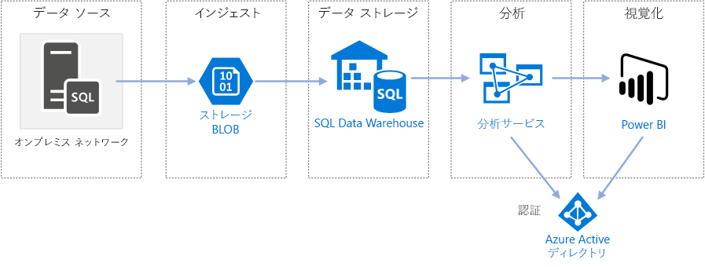
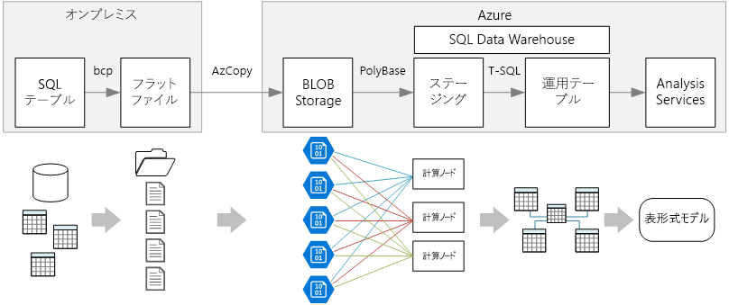

# SQL Data Warehouse を使用した Azure のエンタープライズ向け BIEnterprise BI in Azure with SQL Data Warehouse

この参照アーキテクチャでは、オンプレミスの SQL Server データベースから SQL Data Warehouse にデータを移動し、そのデータを分析用に変換する[抽出、読み込み、変換 (ELT)](../../data-guide/relational-data/etl.md#extract-load-and-transform-elt) パイプラインを実装します。This reference architecture implements an [extract, load, and transform (ELT)](../../data-guide/relational-data/etl.md#extract-load-and-transform-elt) pipeline that moves data from an on-premises SQL Server database into SQL Data Warehouse and transforms the data for analysis.

このアーキテクチャのリファレンス実装は、[GitHub][github-folder] で入手できます。A reference implementation for this architecture is available on [GitHub][github-folder].

**シナリオ**:ある組織に、オンプレミスの SQL Server データベースに格納された大規模な OLTP データ セットがあります。**Scenario**: An organization has a large OLTP data set stored in a SQL Server database on premises. この組織では、SQL Data Warehouse を利用して Power BI を使った分析を行いたいと考えています。The organization wants to use SQL Data Warehouse to perform analysis using Power BI.

この参照アーキテクチャは、1 回限りのジョブまたはオンデマンドのジョブ用に設計されています。This reference architecture is designed for one-time or on-demand jobs. 継続的に (毎時または毎日) データを移動する必要がある場合は、Azure Data Factory を使用して自動化されたワークフローを定義することをお勧めします。If you need to move data on a continuing basis (hourly or daily), we recommend using Azure Data Factory to define an automated workflow. Data Factory を使用する参照アーキテクチャについては、「[SQL Data Warehouse と Azure Data Factory を使用したエンタープライズ BI の自動化][adf-ra]」を参照してください。For a reference architecture that uses Data Factory, see [Automated enterprise BI with SQL Data Warehouse and Azure Data Factory][adf-ra].

## アーキテクチャArchitecture

アーキテクチャは、次のコンポーネントで構成されます。The architecture consists of the following components.

### データ ソースData source

**SQL Server**。**SQL Server**. ソース データは、オンプレミスの SQL Server データベースにあります。The source data is located in a SQL Server database on premises. オンプレミス環境をシミュレートするために、このアーキテクチャのデプロイ スクリプトでは、SQL Server がインストールされた Azure の VM がプロビジョニングされます。To simulate the on-premises environment, the deployment scripts for this architecture provision a VM in Azure with SQL Server installed. [Wide World Importers OLTP サンプル データベース][wwi]は、ソース データベースとして使用されます。The [Wide World Importers OLTP sample database][wwi] is used as the source data.

### インジェストとデータ ストレージIngestion and data storage

**Blob Storage**。**Blob Storage**. Blob Storage は、データを SQL Data Warehouse に読み込む前にコピーするためのステージング領域として使用されます。Blob storage is used as a staging area to copy the data before loading it into SQL Data Warehouse.

**Azure SQL Data Warehouse**。**Azure SQL Data Warehouse**. [SQL Data Warehouse](/azure/sql-data-warehouse/) は、大規模なデータの分析を目的として設計された分散システムです。[SQL Data Warehouse](/azure/sql-data-warehouse/) is a distributed system designed to perform analytics on large data. 超並列処理 (MPP) がサポートされているので、ハイパフォーマンス分析の実行に適しています。It supports massive parallel processing (MPP), which makes it suitable for running high-performance analytics.

### 分析とレポートAnalysis and reporting

**Azure Analysis Services**。**Azure Analysis Services**. [Analysis Services](/azure/analysis-services/) は、データ モデリング機能を提供するフル マネージド サービスです。[Analysis Services](/azure/analysis-services/) is a fully managed service that provides data modeling capabilities. Analysis Services を使用して、ユーザーがクエリを実行できるセマンティック モデルを作成します。Use Analysis Services to create a semantic model that users can query. Analysis Services は、BI ダッシュボードのシナリオで特に役立ちます。Analysis Services is especially useful in a BI dashboard scenario. このアーキテクチャでは、セマンティック モデルを処理するために Analysis Services によってデータ ウェアハウスからデータが読み取られ、ダッシュボードのクエリが効率的に処理されます。In this architecture, Analysis Services reads data from the data warehouse to process the semantic model, and efficiently serves dashboard queries. また、レプリカをスケールアウトしてクエリ処理を高速化することで、エラスティックなコンカレンシーもサポートします。It also supports elastic concurrency, by scaling out replicas for faster query processing.

現在、Azure Analysis Services では表形式モデルをサポートしていますが、多次元モデルはサポートしていません。Currently, Azure Analysis Services supports tabular models but not multidimensional models. 表形式モデルではリレーショナル モデリング構造 (テーブル、列) を使用し、多次元モデルでは OLAP モデリング構造 (キューブ、ディメンション、メジャー) を使用します。Tabular models use relational modeling constructs (tables and columns), whereas multidimensional models use OLAP modeling constructs (cubes, dimensions, and measures). 多次元モデルが必要な場合は、SQL Server Analysis Services (SSAS) を使用します。If you require multidimensional models, use SQL Server Analysis Services (SSAS). 詳細については、「[テーブル ソリューションと多次元ソリューションの比較](/sql/analysis-services/comparing-tabular-and-multidimensional-solutions-ssas)」をご覧ください。For more information, see [Comparing tabular and multidimensional solutions](/sql/analysis-services/comparing-tabular-and-multidimensional-solutions-ssas).

**Power BI**。**Power BI**. Power BI は、データを分析してビジネスの分析情報を得る一連のビジネス分析ツールです。Power BI is a suite of business analytics tools to analyze data for business insights. このアーキテクチャでは、Analysis Services に格納されたセマンティック モデルに対してクエリが実行されます。In this architecture, it queries the semantic model stored in Analysis Services.

### AuthenticationAuthentication

**Azure Active Directory (Azure AD)** では、Power BI から Analysis Services サーバーに接続するユーザーの認証が行われます。**Azure Active Directory (Azure AD)** authenticates users who connect to the Analysis Services server through Power BI.

## データ パイプラインData pipeline

この参照アーキテクチャでは、[WorldWideImporters](/sql/sample/world-wide-importers/wide-world-importers-oltp-database) サンプル データベースをデータ ソースとして使用します。This reference architecture uses the [WorldWideImporters](/sql/sample/world-wide-importers/wide-world-importers-oltp-database) sample database as a data source. データ パイプラインには次のステージがあります。The data pipeline has the following stages:

1. SQL Server からフラット ファイルにデータをエクスポートする (bcp ユーティリティ)。Export the data from SQL Server to flat files (bcp utility).
2. フラット ファイルを Azure Blob Storage にコピーする (AzCopy)。Copy the flat files to Azure Blob Storage (AzCopy).
3. SSQL Data Warehouse にデータを読み込む (PolyBase)。Load the data into SQL Data Warehouse (PolyBase).
4. データをスター スキーマに変換する (T-SQL)。Transform the data into a star schema (T-SQL).
5. Analysis Services にセマンティック モデルを読み込みます (SQL Server Data Tools)。Load a semantic model into Analysis Services (SQL Server Data Tools).

> [!NOTE]
> 手順 1 から 3 については、Redgate の Data Platform Studio を使用することを検討してください。For steps 1 &ndash; 3, consider using Redgate Data Platform Studio. Data Platform Studio では、最も適切な互換性修正プログラムと最適化が適用されるため、SQL Data Warehouse をごく手軽に使い始めることができます。Data Platform Studio applies the most appropriate compatibility fixes and optimizations, so it's the quickest way to get started with SQL Data Warehouse. 詳細については、[Redgate Data Platform Studio を使用したデータの読み込み](/azure/sql-data-warehouse/sql-data-warehouse-load-with-redgate)に関する記事をご覧ください。For more information, see [Load data with Redgate Data Platform Studio](/azure/sql-data-warehouse/sql-data-warehouse-load-with-redgate).
>

以下のセクションでは、これらのステージについて詳しく説明します。The next sections describe these stages in more detail.

### SQL Server からデータをエクスポートするExport data from SQL Server

[bcp](/sql/tools/bcp-utility) (一括コピー プログラム) ユーティリティを使用すると、SQL テーブルからフラット テキスト ファイルを迅速に作成できます。The [bcp](/sql/tools/bcp-utility) (bulk copy program) utility is a fast way to create flat text files from SQL tables. この手順では、エクスポートする列を選択しますが、データは変換しません。In this step, you select the columns that you want to export, but don't transform the data. データ変換は、SQL Data Warehouse で実行する必要があります。Any data transformations should happen in SQL Data Warehouse.

**推奨事項:****Recommendations:**

運用環境でのリソースの競合を最小限に抑えるために、可能であれば、データ抽出をピーク外の時間帯にスケジュールします。If possible, schedule data extraction during off-peak hours, to minimize resource contention in the production environment.

データベース サーバーで bcp を実行しないようにしてください。Avoid running bcp on the database server. 代わりに、別のコンピューターから実行します。Instead, run it from another machine. ファイルをローカル ドライブに書き込みます。Write the files to a local drive. 同時書き込みを処理できるだけの十分な I/O リソースがあることを確認してください。Ensure that you have sufficient I/O resources to handle the concurrent writes. 最適なパフォーマンスを得るために、専用の高速ストレージ ドライブにファイルをエクスポートします。For best performance, export the files to dedicated fast storage drives.

エクスポートされたデータを Gzip 圧縮形式で保存することで、ネットワーク転送を高速化できます。You can speed up the network transfer by saving the exported data in Gzip compressed format. ただし、ウェアハウスへの圧縮ファイルの読み込みは圧縮されていないファイルの読み込みよりも時間がかかるため、高速ネットワーク転送と高速読み込みの間にはトレードオフがあります。However, loading compressed files into the warehouse is slower than loading uncompressed files, so there is a tradeoff between faster network transfer versus faster loading. Gzip 圧縮を使用する場合は、単一の Gzip ファイルを作成しないでください。If you decide to use Gzip compression, don't create a single Gzip file. 代わりに、データを複数の圧縮ファイルに分割します。Instead, split the data into multiple compressed files.

### フラット ファイルを Blob Storage にコピーするCopy flat files into blob storage

[AzCopy](/azure/storage/common/storage-use-azcopy) ユーティリティは、Azure Blob Storage への高パフォーマンスのデータ コピーを実行するように設計されています。The [AzCopy](/azure/storage/common/storage-use-azcopy) utility is designed for high-performance copying of data into Azure blob storage.

**推奨事項:****Recommendations:**

ソース データの場所に近いリージョンにストレージ アカウントを作成します。Create the storage account in a region near the location of the source data. ストレージ アカウントと SQL Data Warehouse インスタンスを同じリージョンにデプロイします。Deploy the storage account and the SQL Data Warehouse instance in the same region.

CPU と I/O の消費が運用ワークロードを妨げる可能性があるため、運用ワークロードを実行するマシンで AzCopy を実行しないでください。Don't run AzCopy on the same machine that runs your production workloads, because the CPU and I/O consumption can interfere with the production workload.

まず、アップロードをテストして、アップロード速度を確認します。Test the upload first to see what the upload speed is like. AzCopy で /NC オプションを使用して、コンカレントなコピー操作数を指定できます。You can use the /NC option in AzCopy to specify the number of concurrent copy operations. 既定値から始め、この設定を試してパフォーマンスを調整します。Start with the default value, then experiment with this setting to tune the performance. 低帯域幅の環境では、同時実行操作数が多すぎると、ネットワーク接続に過剰な負荷がかかり、操作を正常に完了できなくなる可能性があります。In a low-bandwidth environment, too many concurrent operations can overwhelm the network connection and prevent the operations from completing successfully.

AzCopy では、パブリック インターネット経由でデータをストレージに移動します。AzCopy moves data to storage over the public internet. 速度が不十分な場合は、[ExpressRoute](/azure/expressroute/) 回線を設定することを検討してください。If this isn't fast enough, consider setting up an [ExpressRoute](/azure/expressroute/) circuit. ExpressRoute は、専用プライベート接続を通してデータを Azure にルーティングするサービスです。ExpressRoute is a service that routes your data through a dedicated private connection to Azure. ネットワーク接続が遅すぎる場合は、別の方法として、ディスク上のデータを Azure データセンターに物理的に送付します。Another option, if your network connection is too slow, is to physically ship the data on disk to an Azure datacenter. 詳細については、「[Azure との間のデータ転送](/azure/architecture/data-guide/scenarios/data-transfer)」をご覧ください。For more information, see [Transferring data to and from Azure](/azure/architecture/data-guide/scenarios/data-transfer).

コピー操作中に、AzCopy によって一時ジャーナル ファイルが作成されます。これにより、(ネットワーク エラーなどが原因で) 操作が中断された場合に、AzCopy で操作を再開できます。During a copy operation, AzCopy creates a temporary journal file, which enables AzCopy to restart the operation if it gets interrupted (for example, due to a network error). ジャーナル ファイルを格納できる十分なディスク領域があることを確認してください。Make sure there is enough disk space to store the journal files. /Z オプションを使用して、ジャーナル ファイルの書き込み先を指定できます。You can use the /Z option to specify where the journal files are written.

### SQL Data Warehouse にデータを読み込むLoad data into SQL Data Warehouse

[PolyBase](/sql/relational-databases/polybase/polybase-guide) を使用して、Blob Storage からデータ ウェアハウスにファイルを読み込みます。Use [PolyBase](/sql/relational-databases/polybase/polybase-guide) to load the files from blob storage into the data warehouse. PolyBase は、SQL Data Warehouse の MPP (超並列処理) アーキテクチャを活用するように設計されているので、SQL Data Warehouse にデータを読み込む最も速い方法です。PolyBase is designed to leverage the MPP (Massively Parallel Processing) architecture of SQL Data Warehouse, which makes it the fastest way to load data into SQL Data Warehouse.

データの読み込みは次の 2 段階のプロセスです。Loading the data is a two-step process:

1. データの一連の外部テーブルを作成します。Create a set of external tables for the data. 外部テーブルとは、ウェアハウスの外部に格納されたデータを参照するテーブル定義です。この場合は、Blob Storage 内のフラット ファイルです。An external table is a table definition that points to data stored outside of the warehouse &mdash; in this case, the flat files in blob storage. この手順では、データをウェアハウスに移動しません。This step does not move any data into the warehouse.
2. ステージング テーブルを作成し、データをステージング テーブルに読み込みます。Create staging tables, and load the data into the staging tables. この手順でデータをウェアハウスにコピーします。This step copies the data into the warehouse.

**推奨事項:****Recommendations:**

大量のデータ (1 TB 超) があり、並列処理のメリットが得られる分析ワークロードを実行する場合に、SQL Data Warehouse を検討します。Consider SQL Data Warehouse when you have large amounts of data (more than 1 TB) and are running an analytics workload that will benefit from parallelism. SQL Data Warehouse は、OLTP ワークロードや小規模のデータ セット (250 GB 未満) には適していません。SQL Data Warehouse is not a good fit for OLTP workloads or smaller data sets (< 250GB). 250 GB 未満のデータ セットについては、Azure SQL Database または SQL Server を検討します。For data sets less than 250GB, consider Azure SQL Database or SQL Server. 詳細については、[データ ウェアハウス](../../data-guide/relational-data/data-warehousing.md)に関する記事をご覧ください。For more information, see [Data warehousing](../../data-guide/relational-data/data-warehousing.md).

インデックスのないヒープ テーブルとしてステージング テーブルを作成します。Create the staging tables as heap tables, which are not indexed. 運用テーブルを作成するクエリにより、フル テーブル スキャンが実行されることになるため、ステージング テーブルのインデックスを作成する理由はありません。The queries that create the production tables will result in a full table scan, so there is no reason to index the staging tables.

PolyBase では、ウェアハウスで並列処理を自動的に利用します。PolyBase automatically takes advantage of parallelism in the warehouse. DWU を増やすと、読み込みパフォーマンスがスケーリングされます。The load performance scales as you increase DWUs. 最適なパフォーマンスを得るために、単一の読み込み操作を使用します。For best performance, use a single load operation. 入力データをチャンクに分割し、複数の同時読み込みを実行すると、パフォーマンス上のメリットは得られません。There is no performance benefit to breaking the input data into chunks and running multiple concurrent loads.

PolyBase では Gzip 圧縮ファイルを読み取ることができます。PolyBase can read Gzip compressed files. ただし、ファイルの圧縮解除はシングル スレッド操作であるため、リーダーは圧縮ファイルごとに 1 つしか使用されません。However, only a single reader is used per compressed file, because uncompressing the file is a single-threaded operation. そのため、単一の大きな圧縮ファイルの読み込みは避けてください。Therefore, avoid loading a single large compressed file. 代わりに、並列処理を活用するために、データを複数の圧縮ファイルに分割します。Instead, split the data into multiple compressed files, in order to take advantage of parallelism.

次の制限事項に注意してください。Be aware of the following limitations:

- PolyBase でサポートされる最大列サイズは、`varchar(8000)`、`nvarchar(4000)`、または `varbinary(8000)` です。PolyBase supports a maximum column size of `varchar(8000)`, `nvarchar(4000)`, or `varbinary(8000)`. これらの制限を超えるデータがある場合、1 つの方法として、エクスポート時にデータをチャンクに分割し、インポート後にチャンクを再構築します。If you have data that exceeds these limits, one option is to break the data up into chunks when you export it, and then reassemble the chunks after import.

- PolyBase では、固定行ターミネータとして \n または改行を使用します。PolyBase uses a fixed row terminator of \n or newline. ソース データに改行文字が出現すると、問題が発生する可能性があります。This can cause problems if newline characters appear in the source data.

- ソース データ スキーマに、SQL Data Warehouse でサポートされていないデータ型が含まれている場合があります。Your source data schema might contain data types that are not supported in SQL Data Warehouse.

これらの制限を回避するには、必要な変換を実行するストアド プロシージャを作成します。To work around these limitations, you can create a stored procedure that performs the necessary conversions. bcp の実行時に、このストアド プロシージャを参照します。Reference this stored procedure when you run bcp. また、[Redgate Data Platform Studio](/azure/sql-data-warehouse/sql-data-warehouse-load-with-redgate) を使用して、SQL Data Warehouse でサポートされていないデータ型を自動的に変換することもできます。Alternatively, [Redgate Data Platform Studio](/azure/sql-data-warehouse/sql-data-warehouse-load-with-redgate) automatically converts data types that aren’t supported in SQL Data Warehouse.

詳細については、次の記事を参照してください。For more information, see the following articles:

- [Azure SQL Data Warehouse へのデータ読み込みのベスト プラクティス](/azure/sql-data-warehouse/guidance-for-loading-data)[Best practices for loading data into Azure SQL Data Warehouse](/azure/sql-data-warehouse/guidance-for-loading-data).
- [SQL Data Warehouse にスキーマを移行するMigrate your schemas to SQL Data Warehouse](/azure/sql-data-warehouse/sql-data-warehouse-migrate-schema)
- [SQL Data Warehouse でのテーブルのデータ型の定義に関するガイダンスGuidance for defining data types for tables in SQL Data Warehouse](/azure/sql-data-warehouse/sql-data-warehouse-tables-data-types)

### データの変換Transform the data

データを変換し、運用テーブルに移動します。Transform the data and move it into production tables. この手順では、ディメンション テーブルとファクト テーブルで構成され、セマンティック モデリングに適したスター スキーマにデータが変換されます。In this step, the data is transformed into a star schema with dimension tables and fact tables, suitable for semantic modeling.

クラスター化列ストア インデックスを設定して運用テーブルを作成します。これにより、全体として最適なクエリ パフォーマンスが実現されます。Create the production tables with clustered columnstore indexes, which offer the best overall query performance. 列ストア インデックスは、多数のレコードをスキャンするクエリに最適化されています。Columnstore indexes are optimized for queries that scan many records. 列ストア インデックスは、シングルトンのルックアップ (つまり、単一行の検索) には適していません。Columnstore indexes don't perform as well for singleton lookups (that is, looking up a single row). 単一ルックアップを頻繁に実行する必要がある場合は、テーブルに非クラスター化インデックスを追加できます。If you need to perform frequent singleton lookups, you can add a non-clustered index to a table. 非クラスター化インデックスを使用すると、単一ルックアップの実行を大幅に高速化できます。Singleton lookups can run significantly faster using a non-clustered index. ただし、データ ウェアハウス シナリオでは、通常、単一ルックアップは OLTP ワークロードほど一般的ではありません。However, singleton lookups are typically less common in data warehouse scenarios than OLTP workloads. 詳細については、「[SQL Data Warehouse でのテーブルのインデックス作成](/azure/sql-data-warehouse/sql-data-warehouse-tables-index)」をご覧ください。For more information, see [Indexing tables in SQL Data Warehouse](/azure/sql-data-warehouse/sql-data-warehouse-tables-index).

> [!NOTE]
> クラスター化列ストア テーブルでは、`varchar(max)`、`nvarchar(max)`、`varbinary(max)` の各データ型はサポートしていません。Clustered columnstore tables do not support `varchar(max)`, `nvarchar(max)`, or `varbinary(max)` data types. その場合、ヒープ インデックスまたはクラスター化インデックスを検討してください。In that case, consider a heap or clustered index. それらの列を別のテーブルに配置できます。You might put those columns into a separate table.

サンプル データベースはそれほど大きくないので、パーティションなしでレプリケート テーブルが作成されました。Because the sample database is not very large, we created replicated tables with no partitions. 運用ワークロードでは、分散テーブルを使用すると、クエリ パフォーマンスが向上する可能性があります。For production workloads, using distributed tables is likely to improve query performance. 「[Azure SQL Data Warehouse での分散テーブルの設計に関するガイダンス](/azure/sql-data-warehouse/sql-data-warehouse-tables-distribute)」をご覧ください。See [Guidance for designing distributed tables in Azure SQL Data Warehouse](/azure/sql-data-warehouse/sql-data-warehouse-tables-distribute). サンプル スクリプトでは、静的[リソース クラス](/azure/sql-data-warehouse/resource-classes-for-workload-management)を使用してクエリが実行されます。Our example scripts run the queries using a static [resource class](/azure/sql-data-warehouse/resource-classes-for-workload-management).

### セマンティック モデルを読み込むLoad the semantic model

Azure Analysis Services で表形式モデルにデータを読み込みます。Load the data into a tabular model in Azure Analysis Services. この手順では、SQL Server Data Tools (SSDT) を使用してセマンティック データ モデルを作成します。In this step, you create a semantic data model by using SQL Server Data Tools (SSDT). モデルは、Power BI Desktop ファイルからインポートして作成することもできます。You can also create a model by importing it from a Power BI Desktop file. SQL Data Warehouse では外部キーをサポートしていないため、テーブル間の結合を可能にするために、セマンティック モデルにリレーションシップを追加する必要があります。Because SQL Data Warehouse does not support foreign keys, you must add the relationships to the semantic model, so that you can join across tables.

### Power BI を使用してデータを視覚化するUse Power BI to visualize the data

Power BI では、Azure Analysis Services に接続するための 2 つのオプションをサポートしています。Power BI supports two options for connecting to Azure Analysis Services:

- インポート。Import. データは Power BI モデルにインポートされます。The data is imported into the Power BI model.
- ライブ接続。Live Connection. データは Analysis Services から直接取得されます。Data is pulled directly from Analysis Services.

Power BI モデルにデータをコピーする必要がないため、ライブ接続をお勧めします。We recommend Live Connection because it doesn't require copying data into the Power BI model. また、DirectQuery を使用すると、結果を最新のソース データと常に一致させることができます。Also, using DirectQuery ensures that results are always consistent with the latest source data. 詳細については、「[Power BI を使用した接続](/azure/analysis-services/analysis-services-connect-pbi)」をご覧ください。For more information, see [Connect with Power BI](/azure/analysis-services/analysis-services-connect-pbi).

**推奨事項:****Recommendations:**

BI ダッシュボードのクエリをデータ ウェアハウスに対して直接実行しないようにしてください。Avoid running BI dashboard queries directly against the data warehouse. BI ダッシュボードでは、応答時間が非常に短いことが求められます。ウェアハウスに対してクエリを直接実行すると、この要件を満たすことができない可能性があります。BI dashboards require very low response times, which direct queries against the warehouse may be unable to satisfy. また、ダッシュボードの更新は同時クエリの数にカウントされるので、パフォーマンスに影響を及ぼす可能性があります。Also, refreshing the dashboard will count against the number of concurrent queries, which could impact performance.

Azure Analysis Services は、BI ダッシュボードのクエリ要件に対応するように設計されているため、Power BI から Analysis Services に対するクエリを実行することをお勧めします。Azure Analysis Services is designed to handle the query requirements of a BI dashboard, so the recommended practice is to query Analysis Services from Power BI.

## スケーラビリティに関する考慮事項Scalability considerations

### SQL Data WarehouseSQL Data Warehouse

SQL Data Warehouse では、コンピューティング リソースをオンデマンドでスケールアウトできます。With SQL Data Warehouse, you can scale out your compute resources on demand. クエリ エンジンは、コンピューティング ノードの数に基づいてクエリを並列処理に最適化し、必要に応じてノード間でデータを移動します。The query engine optimizes queries for parallel processing based on the number of compute nodes, and moves data between nodes as necessary. 詳細については、「[Azure SQL Data Warehouse でのコンピューティングの管理](/azure/sql-data-warehouse/sql-data-warehouse-manage-compute-overview)」をご覧ください。For more information, see [Manage compute in Azure SQL Data Warehouse](/azure/sql-data-warehouse/sql-data-warehouse-manage-compute-overview).

### Analysis ServicesAnalysis Services

Azure Analysis Services の Standard レベルでは、パーティション分割と DirectQuery をサポートしているため、運用ワークロードには Standard レベルをお勧めします。For production workloads, we recommend the Standard Tier for Azure Analysis Services, because it supports partitioning and DirectQuery. レベル内では、インスタンスのサイズによってメモリと処理能力が決まります。Within a tier, the instance size determines the memory and processing power. 処理能力は、クエリ処理ユニット (QPU) で測定されます。Processing power is measured in Query Processing Units (QPUs). QPU 使用量を監視して適切なサイズを選択します。Monitor your QPU usage to select the appropriate size. 詳細については、「[サーバー メトリックの監視](/azure/analysis-services/analysis-services-monitor)」をご覧ください。For more information, see [Monitor server metrics](/azure/analysis-services/analysis-services-monitor).

高負荷時には、クエリのコンカレンシーによってクエリ パフォーマンスが低下する可能性があります。Under high load, query performance can become degraded due to query concurrency. より多くのクエリを同時に実行できるように、クエリを処理するレプリカのプールを作成して Analysis Services をスケールアウトできます。You can scale out Analysis Services by creating a pool of replicas to process queries, so that more queries can be performed concurrently. データ モデルの処理は、常にプライマリ サーバーで行われます。The work of processing the data model always happens on the primary server. 既定では、クエリもプライマリ サーバーで処理されます。By default, the primary server also handles queries. 必要に応じて、クエリ プールですべてのクエリが処理されるように、処理を排他的に実行するプライマリ サーバーを指定することもできます。Optionally, you can designate the primary server to run processing exclusively, so that the query pool handles all queries. 高い処理要件がある場合は、クエリ プールから処理を切り離す必要があります。If you have high processing requirements, you should separate the processing from the query pool. クエリ負荷が高く、処理が比較的軽い場合は、プライマリ サーバーをクエリ プールに含めることができます。If you have high query loads, and relatively light processing, you can include the primary server in the query pool. 詳細については、「[Azure Analysis Services のスケールアウト](/azure/analysis-services/analysis-services-scale-out)」をご覧ください。For more information, see [Azure Analysis Services scale-out](/azure/analysis-services/analysis-services-scale-out).

不要な処理の量を減らすために、パーティションを使用して表形式モデルを論理部分に分割することを検討してください。To reduce the amount of unnecessary processing, consider using partitions to divide the tabular model into logical parts. 各パーティションは個別に処理できます。Each partition can be processed separately. 詳細については、「[パーティション](/sql/analysis-services/tabular-models/partitions-ssas-tabular)」をご覧ください。For more information, see [Partitions](/sql/analysis-services/tabular-models/partitions-ssas-tabular).

## セキュリティに関する考慮事項Security considerations

### Analysis Services クライアントの IP ホワイトリスト登録IP whitelisting of Analysis Services clients

Analysis Services のファイアウォール機能を使用して、クライアントの IP アドレスをホワイトリストに登録することを検討します。Consider using the Analysis Services firewall feature to whitelist client IP addresses. ファイアウォールを有効にすると、ファイアウォール規則で指定された接続以外のすべてのクライアント接続がブロックされます。If enabled, the firewall blocks all client connections other than those specified in the firewall rules. 既定の規則では Power BI サービスがホワイトリストに登録されますが、必要に応じてこの規則を無効にすることができます。The default rules whitelist the Power BI service, but you can disable this rule if desired. 詳細については、「[Hardening Azure Analysis Services with the new firewall capability (新しいファイアウォール機能による Azure Analysis Services の強化)](https://azure.microsoft.com/blog/hardening-azure-analysis-services-with-the-new-firewall-capability/)」をご覧ください。For more information, see [Hardening Azure Analysis Services with the new firewall capability](https://azure.microsoft.com/blog/hardening-azure-analysis-services-with-the-new-firewall-capability/).

### 承認Authorization

Azure Analysis Services では、Azure Active Directory (Azure AD) を使用して Analysis Services サーバーに接続するユーザーを認証します。Azure Analysis Services uses Azure Active Directory (Azure AD) to authenticate users who connect to an Analysis Services server. ロールを作成し、Azure AD ユーザーまたはグループをそれらのロールに割り当てることで、特定のユーザーが表示できるデータを制限できます。You can restrict what data a particular user is able to view, by creating roles and then assigning Azure AD users or groups to those roles. 各ロールでは次のことが可能です。For each role, you can:

- テーブルまたは個々の列を保護する。Protect tables or individual columns.
- フィルター式に基づいて個々の行を保護する。Protect individual rows based on filter expressions.

詳細については、「[データベース ロールとユーザーの管理](/azure/analysis-services/analysis-services-database-users)」をご覧ください。For more information, see [Manage database roles and users](/azure/analysis-services/analysis-services-database-users).

## ソリューションのデプロイ方法Deploy the solution

リファレンス実装をデプロイおよび実行するには、[GitHub readme][github-folder] の手順に従ってください。To the deploy and run the reference implementation, follow the steps in the [GitHub readme][github-folder]. 以下がデプロイされます。It deploys the following:

- オンプレミスのデータベース サーバーをシミュレートする Windows VM。A Windows VM to simulate an on-premises database server. これには、SQL Server 2017 と関連ツール、および Power BI Desktop が含まれています。It includes SQL Server 2017 and related tools, along with Power BI Desktop.
- SQL Server データベースからエクスポートされたデータを保持する Blob Storage を提供する Azure ストレージ アカウント。An Azure storage account that provides Blob storage to hold data exported from the SQL Server database.
- Azure SQL Data Warehouse インスタンス。An Azure SQL Data Warehouse instance.
- Azure Analysis Services インスタンス。An Azure Analysis Services instance.

## 次の手順Next steps

- Azure Data Factory を使用して ELT パイプラインを自動化します。Use Azure Data Factory to automate the ELT pipeline. 「[SQL Data Warehouse と Azure Data Factory を使用したエンタープライズ BI の自動化][adf-ra]」を参照してください。See [Automated enterprise BI with SQL Data Warehouse and Azure Data Factory][adf-ra].

## 関連リソースRelated resources

同じテクノロジの一部を使用する具体的なソリューションを示す次の [Azure のサンプル シナリオ](/azure/architecture/example-scenario)をレビューできます。You may want to review the following [Azure example scenarios](/azure/architecture/example-scenario) that demonstrate specific solutions using some of the same technologies:

- [販売およびマーケティング向けのデータ ウェアハウスと分析Data warehousing and analytics for sales and marketing](/azure/architecture/example-scenario/data/data-warehouse)
- [既存のオンプレミス SSIS と Azure Data Factory を使用したハイブリッド ETLHybrid ETL with existing on-premises SSIS and Azure Data Factory](/azure/architecture/example-scenario/data/hybrid-etl-with-adf)

<!-- links -->

[adf-ra]: ./enterprise-bi-adf.md
[github-folder]: https://github.com/mspnp/reference-architectures/tree/master/data/enterprise_bi_sqldw
[wwi]: /sql/sample/world-wide-importers/wide-world-importers-oltp-database
