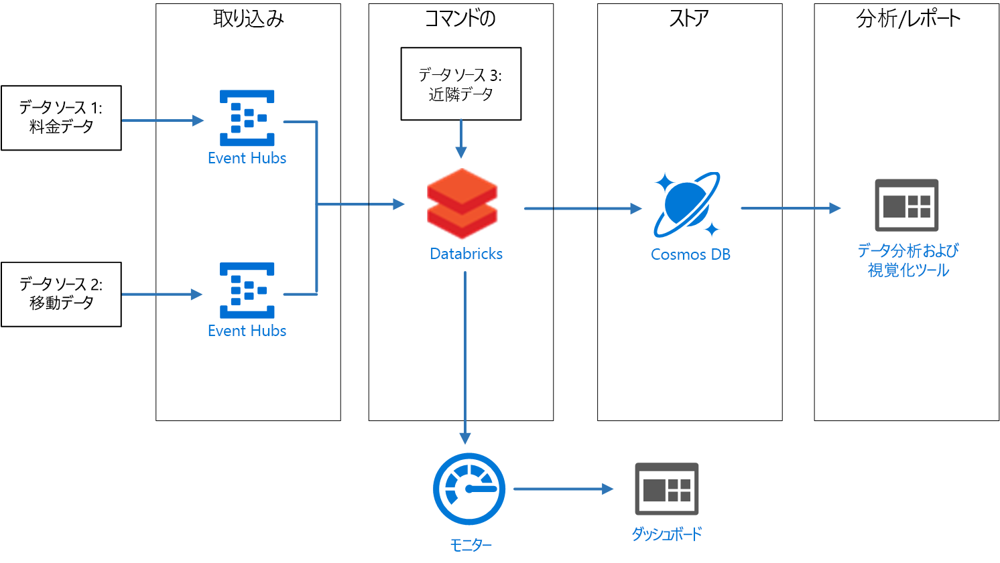
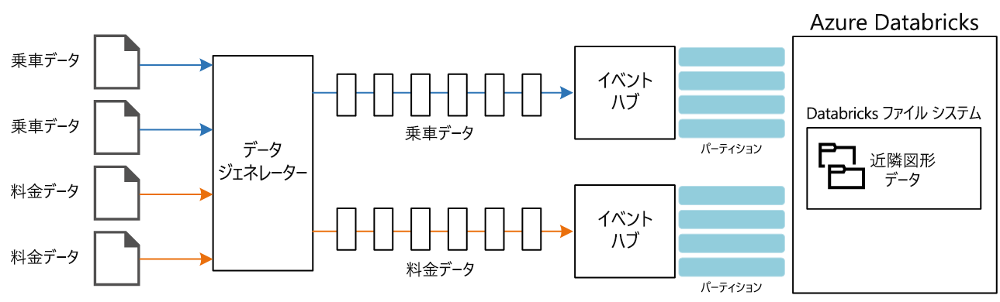

# <a name="create-a-stream-processing-pipeline-with-azure-databricks"></a>Azure Databricks を使用してストリーム処理パイプラインを作成します

この参照アーキテクチャでは、エンド ツー エンドの[ストリーム処理](/azure/architecture/data-guide/big-data/real-time-processing)パイプラインを示します。 この種類のパイプラインには、取り込み、処理、格納、および分析とレポート作成の 4 つの段階があります。 この参照アーキテクチャでは、パイプラインは、2 つのソースからデータを取り込み、各ストリームの関連するレコードに対して結合を実行し、結果を強化させ、リアルタイムで平均を計算します。 結果が保存され、さらに詳しい分析が行われます。 [**このソリューションをデプロイします**](#deploy-the-solution)。



**シナリオ**:タクシー会社が各乗車に関するデータを収集しています。 このシナリオでは、データを送信する 2 つのデバイスがあることを想定しています。 タクシーには、各乗車の情報 (走行時間、距離、乗車場所と降車場所) を送信するメーターがあります。 別のデバイスでは、乗客からの支払いを受け付け、料金に関するデータを送信します。 利用者数の傾向をつかむために、このタクシー会社では、各地で走行 1 マイルあたりの平均チップをリアルタイムで計算したいと考えています。

## <a name="architecture"></a>アーキテクチャ

アーキテクチャは、次のコンポーネントで構成されます。

**データ ソース**。 このアーキテクチャには、リアルタイムでデータ ストリームを生成する 2 つのデータ ソースがあります。 1 つ目のストリームには乗車情報が含まれ、2 つ目のストリームには料金情報が含まれます。 参照アーキテクチャには、一連の静的ファイルから読み取り、データを Event Hubs にプッシュするシミュレートされたデータ ジェネレーターが含まれています。 実際のアプリケーションのデータ ソースは、タクシーに設置されたデバイスになります。

**Azure Event Hubs**。 [Event Hubs](/azure/event-hubs/) はイベント取り込みサービスです。 このアーキテクチャでは、2 つのイベント ハブ インスタンス (データ ソースごとに 1 つ) を使用します。 各データ ソースは、関連付けられたイベント ハブにデータ ストリームを送信します。

**Azure Databricks**。 [Databricks](/azure/azure-databricks/) は、Microsoft Azure クラウド サービス プラットフォーム用に最適化された Apache Spark ベースの分析プラットフォームです。 Databricks を使用して、タクシーの乗車データと料金データを関連付け、さらに、その関連付けられたデータを、Databricks ファイル システムに格納されている地域データで強化します。

**Cosmos DB**。 Azure Databricks ジョブの出力は一連のレコードであり、Cassandra API を使用して [Cosmos DB](/azure/cosmos-db/) に書き込まれます。 Cassandra API が使用されるのは、時系列データ モデリングをサポートしているためです。

**Azure Log Analytics**。 [Azure Monitor](/azure/monitoring-and-diagnostics/) で収集されたアプリケーション ログ データは、[Log Analytics ワークスペース](/azure/log-analytics)に保存されます。 Log Analytics クエリを使用してメトリックを分析および視覚化し、ログ メッセージを検査してアプリケーション内の問題を特定できます。

## <a name="data-ingestion"></a>データの取り込み

<!-- markdownlint-disable MD033 -->

データ ソースをシミュレートするために、この参照アーキテクチャでは [New York City Taxi Data](https://uofi.app.box.com/v/NYCtaxidata/folder/2332218797) データセット<sup>[[1]](#note1)</sup> を使用します。 このデータセットには、ニューヨーク市の 4 年間 (2010 年から 2013 年) のタクシー乗車に関するデータが含まれています。 乗車データと料金データの 2 種類のレコードがあります。 乗車データには、走行時間、乗車距離、乗車場所と降車場所が含まれます。 料金データには、料金、税、チップの金額が含まれます。 この 2 種類のレコードの共通フィールドには、営業許可番号、タクシー免許、ベンダー ID があります。 この 3 つのフィールドを組み合わせて、タクシーと運転手が一意に識別されます。 データは CSV 形式で保存されます。

> [1] <span id="note1">Donovan, Brian; Work, Dan (2016):New York City Taxi Trip Data (2010-2013). イリノイ大学アーバナシャンペーン校。 <https://doi.org/10.13012/J8PN93H8>

<!-- markdownlint-enable MD033 -->

データ ジェネレーターは、レコードを読み取り、Azure Event Hubs に送信する .NET Core アプリケーションです。 ジェネレーターは、JSON 形式の乗車データと CSV 形式の料金データを送信します。

Event Hubs では、[パーティション](/azure/event-hubs/event-hubs-features#partitions)を使用してデータをセグメント化します。 複数のパーティションでは、コンシューマーは各パーティションを並列で読み取ることができます。 Event Hubs にデータを送信するときに、パーティション キーを明示的に指定できます。 それ以外の場合は、ラウンド ロビン方式でパーティションにレコードが割り当てられます。

このシナリオでは、特定のタクシーの乗車データと料金データは、最終的に同じパーティション ID を共有します。 これにより、Databricks は 2 つのストリームを関連付けるときに、ある程度の並列処理を適用できます。 乗車データのパーティション *n* 内のレコードは、料金データのパーティション *n* 内のレコードに対応します。



データ ジェネレーターでは、両方のレコードの種類に対応した共通データ モデルに、`Medallion`、`HackLicense`、`VendorId` を連結した `PartitionKey` プロパティがあります。

```csharp
public abstract class TaxiData
{
    public TaxiData()
    {
    }

    [JsonProperty]
    public long Medallion { get; set; }

    [JsonProperty]
    public long HackLicense { get; set; }

    [JsonProperty]
    public string VendorId { get; set; }

    [JsonProperty]
    public DateTimeOffset PickupTime { get; set; }

    [JsonIgnore]
    public string PartitionKey
    {
        get => $"{Medallion}_{HackLicense}_{VendorId}";
    }
```

このプロパティを使用して、Event Hubs への送信時に明示的なパーティション キーが提供されます。

```csharp
using (var client = pool.GetObject())
{
    return client.Value.SendAsync(new EventData(Encoding.UTF8.GetBytes(
        t.GetData(dataFormat))), t.PartitionKey);
}
```

### <a name="event-hubs"></a>Event Hubs

Event Hubs のスループット容量は、[スループット ユニット](/azure/event-hubs/event-hubs-features#throughput-units)で測定されます。 [自動インフレ](/azure/event-hubs/event-hubs-auto-inflate)を有効にすると、イベント ハブを自動スケーリングできます。自動インフレでは、トラフィックに基づいて、スループット ユニットが構成済みの最大値まで自動的にスケーリングされます。

## <a name="stream-processing"></a>ストリーム処理

Azure Databricks では、ジョブによってデータ処理が実行されます。 ジョブはクラスターに割り当てられ、そこで実行されます。 ジョブは、Java で記述されたカスタム コードか、Spark [Notebook](https://docs.databricks.com/user-guide/notebooks/index.html) です。

この参照アーキテクチャでは、ジョブは、Java と Scala の両方で記述されたクラスを含む Java アーカイブです。 Databricks ジョブの Java アーカイブを指定する場合、実行対象のクラスは Databricks クラスターによって指定されます。 ここでは、**com.microsoft.pnp.TaxiCabReader** クラスの **main** メソッドに、データ処理ロジックが含まれています。

### <a name="reading-the-stream-from-the-two-event-hub-instances"></a>2 つのイベント ハブ インスタンスからのストリームの読み取り

データ処理ロジックでは、2 つの Azure イベント ハブ インスタンスからの読み取りに、[Spark 構造化ストリーミング](https://spark.apache.org/docs/2.1.2/structured-streaming-programming-guide.html)が使用されます。

```scala
val rideEventHubOptions = EventHubsConf(rideEventHubConnectionString)
      .setConsumerGroup(conf.taxiRideConsumerGroup())
      .setStartingPosition(EventPosition.fromStartOfStream)
    val rideEvents = spark.readStream
      .format("eventhubs")
      .options(rideEventHubOptions.toMap)
      .load

    val fareEventHubOptions = EventHubsConf(fareEventHubConnectionString)
      .setConsumerGroup(conf.taxiFareConsumerGroup())
      .setStartingPosition(EventPosition.fromStartOfStream)
    val fareEvents = spark.readStream
      .format("eventhubs")
      .options(fareEventHubOptions.toMap)
      .load
```

### <a name="enriching-the-data-with-the-neighborhood-information"></a>地域情報によるデータの強化

乗車データには、乗車場所と降車場所の緯度と経度の座標が含まれています。 これらの座標は便利ですが、分析で使用するのは簡単ではありません。 したがって、このデータは、[シェープファイル](https://en.wikipedia.org/wiki/Shapefile)から読み取られる地域データで強化されます。

シェープファイルはバイナリ形式で、簡単には解析されませんが、[GeoTools](http://geotools.org/) ライブラリには、シェープファイル形式を使用する地理空間データを対象としたツールが用意されています。 このライブラリは、乗車場所と降車場所の座標に基づいて地域名を判断するために、**com.microsoft.pnp.GeoFinder** クラスで使用されます。

```scala
val neighborhoodFinder = (lon: Double, lat: Double) => {
      NeighborhoodFinder.getNeighborhood(lon, lat).get()
    }
```

### <a name="joining-the-ride-and-fare-data"></a>乗車データと料金データの結合

最初に、乗車データと料金データが変換されます。

```scala
    val rides = transformedRides
      .filter(r => {
        if (r.isNullAt(r.fieldIndex("errorMessage"))) {
          true
        }
        else {
          malformedRides.add(1)
          false
        }
      })
      .select(
        $"ride.*",
        to_neighborhood($"ride.pickupLon", $"ride.pickupLat")
          .as("pickupNeighborhood"),
        to_neighborhood($"ride.dropoffLon", $"ride.dropoffLat")
          .as("dropoffNeighborhood")
      )
      .withWatermark("pickupTime", conf.taxiRideWatermarkInterval())

    val fares = transformedFares
      .filter(r => {
        if (r.isNullAt(r.fieldIndex("errorMessage"))) {
          true
        }
        else {
          malformedFares.add(1)
          false
        }
      })
      .select(
        $"fare.*",
        $"pickupTime"
      )
      .withWatermark("pickupTime", conf.taxiFareWatermarkInterval())
```

次に、乗車データが、料金データと結合されます。

```scala
val mergedTaxiTrip = rides.join(fares, Seq("medallion", "hackLicense", "vendorId", "pickupTime"))
```

### <a name="processing-the-data-and-inserting-into-cosmos-db"></a>データの処理と Cosmos DB への挿入

指定された期間について、平均料金が地域ごとに計算されます。

```scala
val maxAvgFarePerNeighborhood = mergedTaxiTrip.selectExpr("medallion", "hackLicense", "vendorId", "pickupTime", "rateCode", "storeAndForwardFlag", "dropoffTime", "passengerCount", "tripTimeInSeconds", "tripDistanceInMiles", "pickupLon", "pickupLat", "dropoffLon", "dropoffLat", "paymentType", "fareAmount", "surcharge", "mtaTax", "tipAmount", "tollsAmount", "totalAmount", "pickupNeighborhood", "dropoffNeighborhood")
      .groupBy(window($"pickupTime", conf.windowInterval()), $"pickupNeighborhood")
      .agg(
        count("*").as("rideCount"),
        sum($"fareAmount").as("totalFareAmount"),
        sum($"tipAmount").as("totalTipAmount")
      )
      .select($"window.start", $"window.end", $"pickupNeighborhood", $"rideCount", $"totalFareAmount", $"totalTipAmount")
```

次に、これが Cosmos DB に挿入されます。

```scala
maxAvgFarePerNeighborhood
      .writeStream
      .queryName("maxAvgFarePerNeighborhood_cassandra_insert")
      .outputMode(OutputMode.Append())
      .foreach(new CassandraSinkForeach(connector))
      .start()
      .awaitTermination()
```

## <a name="security-considerations"></a>セキュリティに関する考慮事項

Azure Database ワークスペースへのアクセスは、[管理者コンソール](https://docs.databricks.com/administration-guide/admin-settings/index.html)を使用して制御されます。 管理者コンソールには、ユーザーを追加する、ユーザーのアクセス許可を管理する、シングル サインオンを設定する、といった機能が含まれています。 ワークスペース、クラスター、ジョブ、およびテーブルのアクセス制御も、管理者コンソールで設定できます。

### <a name="managing-secrets"></a>シークレットを管理する

Azure Databricks には[シークレット ストア](https://docs.azuredatabricks.net/user-guide/secrets/index.html)があり、これを使用して接続文字列、アクセス キー、ユーザー名、パスワードなどのシークレットを格納します。 Azure Databricks シークレット ストア内のシークレットは、**スコープ**ごとにパーティション分割されています。

```bash
databricks secrets create-scope --scope "azure-databricks-job"
```

シークレットは、スコープ レベルで追加されます。

```bash
databricks secrets put --scope "azure-databricks-job" --key "taxi-ride"
```

> [!NOTE]
> ネイティブの Azure Databricks スコープではなく、Azure Key Vault を実体とするスコープを使用できます。 詳細については、「[Azure Key Vault-backed scopes (Azure Key Vault を実体とするスコープ)](https://docs.azuredatabricks.net/user-guide/secrets/secret-scopes.html#azure-key-vault-backed-scopes)」を参照してください。

コードでは、Azure Databricks [シークレット ユーティリティ](https://docs.databricks.com/user-guide/dev-tools/dbutils.html#secrets-utilities)を介してシークレットにアクセスします。

## <a name="monitoring-considerations"></a>監視に関する考慮事項

Azure Databricks は Apache Spark に基づいており、どちらも、ログ記録用の標準ライブラリとして [log4j](https://logging.apache.org/log4j/2.x/) を使用しています。 Apache Spark によって提供される既定のログ記録に加え、この参照アーキテクチャでは、ログとメトリックを [Azure Log Analytics](/azure/log-analytics/) に送信します。

**com.microsoft.pnp.TaxiCabReader** クラスでは、**log4j.properties** ファイルの値を使用して、Apache Spark のログを Azure Log Analytics に送信するように、Apache Spark ログ記録システムを構成します。 Apache Spark のロガー メッセージは文字列ですが、Azure Log Analytics では、ログ メッセージが JSON として書式設定されていなければなりません。 **com.microsoft.pnp.log4j.LogAnalyticsAppender** クラスは、これらのメッセージを JSON に変換します。

```scala

    @Override
    protected void append(LoggingEvent loggingEvent) {
        if (this.layout == null) {
            this.setLayout(new JSONLayout());
        }

        String json = this.getLayout().format(loggingEvent);
        try {
            this.client.send(json, this.logType);
        } catch(IOException ioe) {
            LogLog.warn("Error sending LoggingEvent to Log Analytics", ioe);
        }
    }

```

**com.microsoft.pnp.TaxiCabReader** クラスでは、乗車メッセージと料金メッセージが処理されるため、いずれかの形式が正しくない可能性があり、これが原因で無効になることがあります。 運用環境では、形式に誤りがあるこれらのメッセージを分析して、データ ソースの問題を特定することが重要です。これにより、その問題を迅速に修正して、データ損失を防ぐことができます。 **com.microsoft.pnp.TaxiCabReader** クラスにより、形式に誤りがある料金レコードと乗車レコードの数を追跡する Apache Spark アキュムレータが登録されます。

```scala
    @transient val appMetrics = new AppMetrics(spark.sparkContext)
    appMetrics.registerGauge("metrics.malformedrides", AppAccumulators.getRideInstance(spark.sparkContext))
    appMetrics.registerGauge("metrics.malformedfares", AppAccumulators.getFareInstance(spark.sparkContext))
    SparkEnv.get.metricsSystem.registerSource(appMetrics)
```

Apache Spark は Dropwizard ライブラリを使用してメトリックを送信しますが、ネイティブ Dropwizard メトリック フィールドの中には、Azure Log Analytics と互換性がないものがあります。 このため、この参照アーキテクチャには、カスタム Dropwizard シンクおよびレポーターが含まれています。 これにより、メトリックは、Azure Log Analytics で予期される形式に書式設定されます。 Apache Spark によってメトリックがレポートされると、形式に誤りがある乗車データと料金データに対するカスタム メトリックも送信されます。

Azure Log Analytics ワークスペースに記録される最後のメトリックは、Spark Structured Streaming ジョブの累積的な進行状況です。 これは、**com.microsoft.pnp.StreamingMetricsListener** クラスで実装されるカスタム StreamingQuery リスナーを使用して、実行されます。 このクラスは、ジョブの実行時に、Apache Spark セッションに登録されます。

```scala
spark.streams.addListener(new StreamingMetricsListener())
```

StreamingMetricsListener 内のメソッドは、構造化ストリーミング イベントが発生すると必ず、Apache Spark ランタイムによって呼び出され、ログ メッセージとメトリックを Azure Log Analytics ワークスペースに送信します。 アプリケーションを監視するには、ワークスペースで次のクエリを使用とできます。

### <a name="latency-and-throughput-for-streaming-queries"></a>ストリーミング クエリの待機時間とスループット

```shell
taxijob_CL
| where TimeGenerated > startofday(datetime(<date>)) and TimeGenerated < endofday(datetime(<date>))
| project  mdc_inputRowsPerSecond_d, mdc_durationms_triggerExecution_d
| render timechart
```

### <a name="exceptions-logged-during-stream-query-execution"></a>ストリーム クエリの実行中に記録された例外

```shell
taxijob_CL
| where TimeGenerated > startofday(datetime(<date>)) and TimeGenerated < endofday(datetime(<date>))
| where Level contains "Error"
```

### <a name="accumulation-of-malformed-fare-and-ride-data"></a>形式に誤りがある料金データと乗車データの蓄積

```shell
SparkMetric_CL
| where TimeGenerated > startofday(datetime(<date>)) and TimeGenerated < endofday(datetime(<date>))
| render timechart
| where name_s contains "metrics.malformedrides"

SparkMetric_CL
| where TimeGenerated > startofday(datetime(<date>)) and TimeGenerated < endofday(datetime(<date>))
| render timechart
| where name_s contains "metrics.malformedfares"
```

### <a name="job-execution-to-trace-resiliency"></a>回復性をトレースするジョブ実行

```shell
SparkMetric_CL
| where TimeGenerated > startofday(datetime(<date>)) and TimeGenerated < endofday(datetime(<date>))
| render timechart
| where name_s contains "driver.DAGScheduler.job.allJobs"
```

詳細については、「[Azure Databricks の監視](../../databricks-monitoring/index.md)」を参照してください。

## <a name="deploy-the-solution"></a>ソリューションのデプロイ方法

リファレンス実装をデプロイおよび実行するには、[GitHub readme](https://github.com/mspnp/azure-databricks-streaming-analytics) の手順に従ってください。
