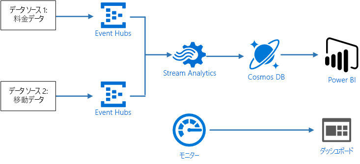
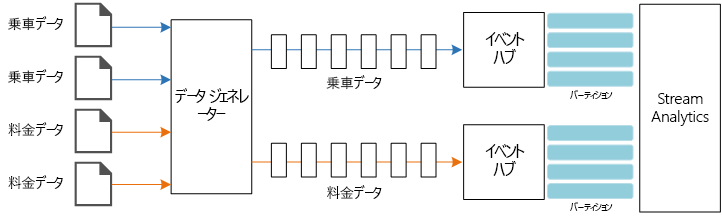
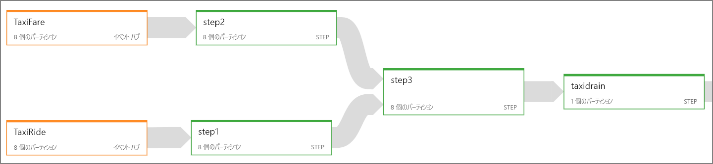
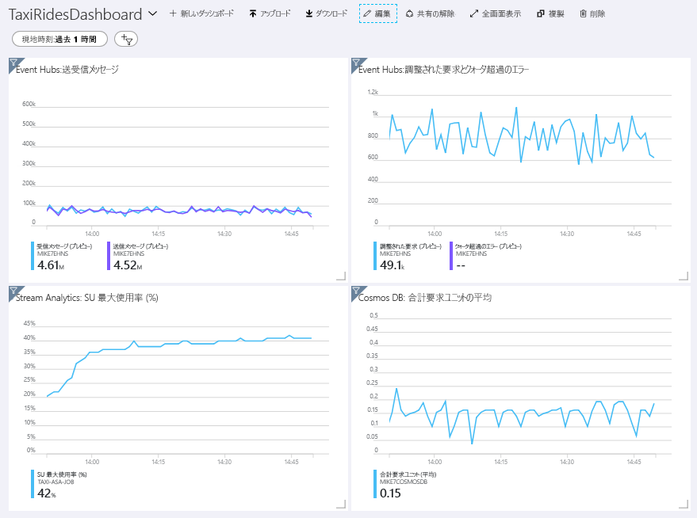

# <a name="stream-processing-with-azure-stream-analytics"></a><span data-ttu-id="8f382-103">Azure Stream Analytics によるストリーム処理</span><span class="sxs-lookup"><span data-stu-id="8f382-103">Stream processing with Azure Stream Analytics</span></span>

<span data-ttu-id="8f382-104">この参照アーキテクチャでは、エンド ツー エンドのストリーム処理パイプラインを示します。</span><span class="sxs-lookup"><span data-stu-id="8f382-104">This reference architecture shows an end-to-end stream processing pipeline.</span></span> <span data-ttu-id="8f382-105">このパイプラインでは、2 つのソースからデータを取り込み、2 つのストリームのレコードを関連付けて、時間枠全体の移動平均を計算します。</span><span class="sxs-lookup"><span data-stu-id="8f382-105">The pipeline ingests data from two sources, correlates records in the two streams, and calculates a rolling average across a time window.</span></span> <span data-ttu-id="8f382-106">結果が保存され、さらに詳しい分析が行われます。</span><span class="sxs-lookup"><span data-stu-id="8f382-106">The results are stored for further analysis.</span></span> 

<span data-ttu-id="8f382-107">このアーキテクチャのリファレンス実装は、[GitHub][github] で入手できます。</span><span class="sxs-lookup"><span data-stu-id="8f382-107">A reference implementation for this architecture is available on [GitHub][github].</span></span> 



<span data-ttu-id="8f382-108">**シナリオ**: タクシー会社が各乗車に関するデータを収集しています。</span><span class="sxs-lookup"><span data-stu-id="8f382-108">**Scenario**: A taxi company collects data about each taxi trip.</span></span> <span data-ttu-id="8f382-109">このシナリオでは、データを送信する 2 つのデバイスがあることを想定しています。</span><span class="sxs-lookup"><span data-stu-id="8f382-109">For this scenario, we assume there are two separate devices sending data.</span></span> <span data-ttu-id="8f382-110">タクシーには、各乗車の情報 (走行時間、距離、乗車場所と降車場所) を送信するメーターがあります。</span><span class="sxs-lookup"><span data-stu-id="8f382-110">The taxi has a meter that sends information about each ride &mdash; the duration, distance, and pickup and dropoff locations.</span></span> <span data-ttu-id="8f382-111">別のデバイスでは、乗客からの支払いを受け付け、料金に関するデータを送信します。</span><span class="sxs-lookup"><span data-stu-id="8f382-111">A separate device accepts payments from customers and sends data about fares.</span></span> <span data-ttu-id="8f382-112">タクシー会社では、傾向をつかむために、走行 1 マイルあたりの平均チップをリアルタイムで計算したいと考えています。</span><span class="sxs-lookup"><span data-stu-id="8f382-112">The taxi company wants to calculate the average tip per mile driven, in real time, in order to spot trends.</span></span>

## <a name="architecture"></a><span data-ttu-id="8f382-113">アーキテクチャ</span><span class="sxs-lookup"><span data-stu-id="8f382-113">Architecture</span></span>

<span data-ttu-id="8f382-114">アーキテクチャは、次のコンポーネントで構成されます。</span><span class="sxs-lookup"><span data-stu-id="8f382-114">The architecture consists of the following components.</span></span>

<span data-ttu-id="8f382-115">**データ ソース**。</span><span class="sxs-lookup"><span data-stu-id="8f382-115">**Data sources**.</span></span> <span data-ttu-id="8f382-116">このアーキテクチャには、リアルタイムでデータ ストリームを生成する 2 つのデータ ソースがあります。</span><span class="sxs-lookup"><span data-stu-id="8f382-116">In this architecture, there are two data sources that generate data streams in real time.</span></span> <span data-ttu-id="8f382-117">1 つ目のストリームには乗車情報が含まれ、2 つ目のストリームには料金情報が含まれます。</span><span class="sxs-lookup"><span data-stu-id="8f382-117">The first stream contains ride information, and the second contains fare information.</span></span> <span data-ttu-id="8f382-118">参照アーキテクチャには、一連の静的ファイルから読み取り、データを Event Hubs にプッシュするシミュレートされたデータ ジェネレーターが含まれています。</span><span class="sxs-lookup"><span data-stu-id="8f382-118">The reference architecture includes a simulated data generator that reads from a set of static files and pushes the data to Event Hubs.</span></span> <span data-ttu-id="8f382-119">実際のアプリケーションでは、データ ソースはタクシーに設置されたデバイスになります。</span><span class="sxs-lookup"><span data-stu-id="8f382-119">In a real application, the data sources would be devices installed in the taxi cabs.</span></span>

<span data-ttu-id="8f382-120">**Azure Event Hubs**。</span><span class="sxs-lookup"><span data-stu-id="8f382-120">**Azure Event Hubs**.</span></span> <span data-ttu-id="8f382-121">[Event Hubs](/azure/event-hubs/) はイベント取り込みサービスです。</span><span class="sxs-lookup"><span data-stu-id="8f382-121">[Event Hubs](/azure/event-hubs/) is an event ingestion service.</span></span> <span data-ttu-id="8f382-122">このアーキテクチャでは、2 つのイベント ハブ インスタンス (データ ソースごとに 1 つ) を使用します。</span><span class="sxs-lookup"><span data-stu-id="8f382-122">This architecture uses two event hub instances, one for each data source.</span></span> <span data-ttu-id="8f382-123">各データ ソースは、関連付けられたイベント ハブにデータ ストリームを送信します。</span><span class="sxs-lookup"><span data-stu-id="8f382-123">Each data source sends a stream of data to the associated event hub.</span></span>

<span data-ttu-id="8f382-124">**Azure Stream Analytics**。</span><span class="sxs-lookup"><span data-stu-id="8f382-124">**Azure Stream Analytics**.</span></span> <span data-ttu-id="8f382-125">[Stream Analytics](/azure/stream-analytics/) はイベント処理エンジンです。</span><span class="sxs-lookup"><span data-stu-id="8f382-125">[Stream Analytics](/azure/stream-analytics/) is an event-processing engine.</span></span> <span data-ttu-id="8f382-126">Stream Analytics ジョブでは、2 つのイベント ハブからデータ ストリームを読み取り、ストリーム処理を実行します。</span><span class="sxs-lookup"><span data-stu-id="8f382-126">A Stream Analytics job reads the data streams from the two event hubs and performs stream processing.</span></span>

<span data-ttu-id="8f382-127">**Cosmos DB**。</span><span class="sxs-lookup"><span data-stu-id="8f382-127">**Cosmos DB**.</span></span> <span data-ttu-id="8f382-128">Stream Analytics ジョブの出力は一連のレコードであり、JSON ドキュメントとして Cosmos DB ドキュメント データベースに書き込まれます。</span><span class="sxs-lookup"><span data-stu-id="8f382-128">The output from the Stream Analytics job is a series of records, which are written as JSON documents to a Cosmos DB document database.</span></span>

<span data-ttu-id="8f382-129">**Microsoft Power BI**。</span><span class="sxs-lookup"><span data-stu-id="8f382-129">**Microsoft Power BI**.</span></span> <span data-ttu-id="8f382-130">Power BI は、データを分析してビジネスの分析情報を得る一連のビジネス分析ツールです。</span><span class="sxs-lookup"><span data-stu-id="8f382-130">Power BI is a suite of business analytics tools to analyze data for business insights.</span></span> <span data-ttu-id="8f382-131">このアーキテクチャでは、Cosmos DB からデータを読み込みます。</span><span class="sxs-lookup"><span data-stu-id="8f382-131">In this architecture, it loads the data from Cosmos DB.</span></span> <span data-ttu-id="8f382-132">これにより、ユーザーは収集された過去のデータの完全なセットを分析できます。</span><span class="sxs-lookup"><span data-stu-id="8f382-132">This allows users to analyze the complete set of historical data that's been collected.</span></span> <span data-ttu-id="8f382-133">また、Stream Analytics から Power BI に結果を直接ストリーミングして、データのリアルタイム ビューを表示することもできます。</span><span class="sxs-lookup"><span data-stu-id="8f382-133">You could also stream the results directly from Stream Analytics to Power BI for a real-time view of the data.</span></span> <span data-ttu-id="8f382-134">詳細については、「[Power BI のリアルタイム ストリーミング](/power-bi/service-real-time-streaming)」をご覧ください。</span><span class="sxs-lookup"><span data-stu-id="8f382-134">For more information, see [Real-time streaming in Power BI](/power-bi/service-real-time-streaming).</span></span>

<span data-ttu-id="8f382-135">**Azure Monitor**。</span><span class="sxs-lookup"><span data-stu-id="8f382-135">**Azure Monitor**.</span></span> <span data-ttu-id="8f382-136">[Azure Monitor](/azure/monitoring-and-diagnostics/) は、ソリューションにデプロイされた Azure サービスに関するパフォーマンス メトリックを収集します。</span><span class="sxs-lookup"><span data-stu-id="8f382-136">[Azure Monitor](/azure/monitoring-and-diagnostics/) collects performance metrics about the Azure services deployed in the solution.</span></span> <span data-ttu-id="8f382-137">ダッシュボードでこれらを視覚化することで、ソリューションの正常性を把握できます。</span><span class="sxs-lookup"><span data-stu-id="8f382-137">By visualizing these in a dashboard, you can get insights into the health of the solution.</span></span> 

## <a name="data-ingestion"></a><span data-ttu-id="8f382-138">データの取り込み</span><span class="sxs-lookup"><span data-stu-id="8f382-138">Data ingestion</span></span>

<span data-ttu-id="8f382-139">データ ソースをシミュレートするために、この参照アーキテクチャでは [New York City Taxi Data](https://uofi.app.box.com/v/NYCtaxidata/folder/2332218797) データセット<sup>[[1]](#note1)</sup> を使用します。</span><span class="sxs-lookup"><span data-stu-id="8f382-139">To simulate a data source, this reference architecture uses the [New York City Taxi Data](https://uofi.app.box.com/v/NYCtaxidata/folder/2332218797) dataset<sup>[[1]](#note1)</sup>.</span></span> <span data-ttu-id="8f382-140">このデータセットには、ニューヨーク市の 4 年間 (2010 から 2013 年) のタクシー乗車に関するデータが含まれています。</span><span class="sxs-lookup"><span data-stu-id="8f382-140">This dataset contains data about taxi trips in New York City over a 4-year period (2010 &ndash; 2013).</span></span> <span data-ttu-id="8f382-141">乗車データと料金データの 2 種類のレコードがあります。</span><span class="sxs-lookup"><span data-stu-id="8f382-141">It contains two types of record: Ride data and fare data.</span></span> <span data-ttu-id="8f382-142">乗車データには、走行時間、乗車距離、乗車場所と降車場所が含まれます。</span><span class="sxs-lookup"><span data-stu-id="8f382-142">Ride data includes trip duration, trip distance, and pickup and dropoff location.</span></span> <span data-ttu-id="8f382-143">料金データには、料金、税、チップの金額が含まれます。</span><span class="sxs-lookup"><span data-stu-id="8f382-143">Fare data includes fare, tax, and tip amounts.</span></span> <span data-ttu-id="8f382-144">この 2 種類のレコードの共通フィールドには、営業許可番号、タクシー免許、ベンダー ID があります。</span><span class="sxs-lookup"><span data-stu-id="8f382-144">Common fields in both record types include medallion number, hack license, and vendor ID.</span></span> <span data-ttu-id="8f382-145">この 3 つのフィールドを組み合わせて、タクシーと運転手が一意に識別されます。</span><span class="sxs-lookup"><span data-stu-id="8f382-145">Together these three fields uniquely identify a taxi plus a driver.</span></span> <span data-ttu-id="8f382-146">データは CSV 形式で保存されます。</span><span class="sxs-lookup"><span data-stu-id="8f382-146">The data is stored in CSV format.</span></span> 

<span data-ttu-id="8f382-147">[1] <span id="note1">Brian Donovan、Dan Work (2016 年): New York City Taxi Trip Data (2010-2013)。</span><span class="sxs-lookup"><span data-stu-id="8f382-147">[1] <span id="note1">Donovan, Brian; Work, Dan (2016): New York City Taxi Trip Data (2010-2013).</span></span> <span data-ttu-id="8f382-148">イリノイ大学アーバナシャンペーン校。</span><span class="sxs-lookup"><span data-stu-id="8f382-148">University of Illinois at Urbana-Champaign.</span></span> <span data-ttu-id="8f382-149">https://doi.org/10.13012/J8PN93H8</span><span class="sxs-lookup"><span data-stu-id="8f382-149">https://doi.org/10.13012/J8PN93H8</span></span>

<span data-ttu-id="8f382-150">データ ジェネレーターは、レコードを読み取り、Azure Event Hubs に送信する .NET Core アプリケーションです。</span><span class="sxs-lookup"><span data-stu-id="8f382-150">The data generator is a .NET Core application that reads the records and sends them to Azure Event Hubs.</span></span> <span data-ttu-id="8f382-151">ジェネレーターは、JSON 形式の乗車データと CSV 形式の料金データを送信します。</span><span class="sxs-lookup"><span data-stu-id="8f382-151">The generator sends ride data in JSON format and fare data in CSV format.</span></span> 

<span data-ttu-id="8f382-152">Event Hubs では、[パーティション](/azure/event-hubs/event-hubs-features#partitions)を使用してデータをセグメント化します。</span><span class="sxs-lookup"><span data-stu-id="8f382-152">Event Hubs uses [partitions](/azure/event-hubs/event-hubs-features#partitions) to segment the data.</span></span> <span data-ttu-id="8f382-153">複数のパーティションでは、コンシューマーは各パーティションを並列で読み取ることができます。</span><span class="sxs-lookup"><span data-stu-id="8f382-153">Partitions allow a consumer to read each partition in parallel.</span></span> <span data-ttu-id="8f382-154">Event Hubs にデータを送信するときに、パーティション キーを明示的に指定できます。</span><span class="sxs-lookup"><span data-stu-id="8f382-154">When you send data to Event Hubs, you can specify the partition key explicitly.</span></span> <span data-ttu-id="8f382-155">それ以外の場合は、ラウンド ロビン方式でパーティションにレコードが割り当てられます。</span><span class="sxs-lookup"><span data-stu-id="8f382-155">Otherwise, records are assigned to partitions in round-robin fashion.</span></span> 

<span data-ttu-id="8f382-156">このシナリオでは、特定のタクシーの乗車データと料金データは、最終的に同じパーティション ID を共有します。</span><span class="sxs-lookup"><span data-stu-id="8f382-156">In this particular scenario, ride data and fare data should end up with the same partition ID for a given taxi cab.</span></span> <span data-ttu-id="8f382-157">これにより、Stream Analytics は 2 つのストリームを関連付けるときに、ある程度の並列処理を適用できます。</span><span class="sxs-lookup"><span data-stu-id="8f382-157">This enables Stream Analytics to apply a degree of parallelism when it correlates the two streams.</span></span> <span data-ttu-id="8f382-158">乗車データのパーティション *n* 内のレコードは、料金データのパーティション *n* 内のレコードに対応します。</span><span class="sxs-lookup"><span data-stu-id="8f382-158">A record in partition *n* of the ride data will match a record in partition *n* of the fare data.</span></span>



<span data-ttu-id="8f382-159">データ ジェネレーターでは、両方のレコードの種類の共通データ モデルに、`Medallion`、`HackLicense`、`VendorId` を連結した `PartitionKey` プロパティがあります。</span><span class="sxs-lookup"><span data-stu-id="8f382-159">In the data generator, the common data model for both record types has a `PartitionKey` property which is the concatenation of `Medallion`, `HackLicense`, and `VendorId`.</span></span>

```csharp
public abstract class TaxiData
{
    public TaxiData()
    {
    }

    [JsonProperty]
    public long Medallion { get; set; }

    [JsonProperty]
    public long HackLicense { get; set; }

    [JsonProperty]
    public string VendorId { get; set; }

    [JsonProperty]
    public DateTimeOffset PickupTime { get; set; }

    [JsonIgnore]
    public string PartitionKey
    {
        get => $"{Medallion}_{HackLicense}_{VendorId}";
    }
```

<span data-ttu-id="8f382-160">このプロパティを使用して、Event Hubs への送信時に明示的なパーティション キーが提供されます。</span><span class="sxs-lookup"><span data-stu-id="8f382-160">This property is used to provide an explicit partition key when sending to Event Hubs:</span></span>

```csharp
using (var client = pool.GetObject())
{
    return client.Value.SendAsync(new EventData(Encoding.UTF8.GetBytes(
        t.GetData(dataFormat))), t.PartitionKey);
}
```

## <a name="stream-processing"></a><span data-ttu-id="8f382-161">ストリーム処理</span><span class="sxs-lookup"><span data-stu-id="8f382-161">Stream processing</span></span>

<span data-ttu-id="8f382-162">ストリーム処理ジョブは、複数の異なるステップで SQL クエリを使用して定義されます。</span><span class="sxs-lookup"><span data-stu-id="8f382-162">The stream processing job is defined using a SQL query with several distinct steps.</span></span> <span data-ttu-id="8f382-163">最初の 2 つのステップでは、2 つの入力ストリームからレコードを選択するだけです。</span><span class="sxs-lookup"><span data-stu-id="8f382-163">The first two steps simply select records from the two input streams.</span></span>

```sql
WITH
Step1 AS (
    SELECT PartitionId,
           TRY_CAST(Medallion AS nvarchar(max)) AS Medallion,
           TRY_CAST(HackLicense AS nvarchar(max)) AS HackLicense,
           VendorId,
           TRY_CAST(PickupTime AS datetime) AS PickupTime,
           TripDistanceInMiles
    FROM [TaxiRide] PARTITION BY PartitionId
),
Step2 AS (
    SELECT PartitionId,
           medallion AS Medallion,
           hack_license AS HackLicense,
           vendor_id AS VendorId,
           TRY_CAST(pickup_datetime AS datetime) AS PickupTime,
           tip_amount AS TipAmount
    FROM [TaxiFare] PARTITION BY PartitionId
),
```

<span data-ttu-id="8f382-164">次のステップでは、2 つの入力ストリームを結合して、各ストリームから一致するレコードを選択します。</span><span class="sxs-lookup"><span data-stu-id="8f382-164">The next step joins the two input streams to select matching records from each stream.</span></span>

```sql
Step3 AS (
  SELECT
         tr.Medallion,
         tr.HackLicense,
         tr.VendorId,
         tr.PickupTime,
         tr.TripDistanceInMiles,
         tf.TipAmount
    FROM [Step1] tr
    PARTITION BY PartitionId
    JOIN [Step2] tf PARTITION BY PartitionId
      ON tr.Medallion = tf.Medallion
     AND tr.HackLicense = tf.HackLicense
     AND tr.VendorId = tf.VendorId
     AND tr.PickupTime = tf.PickupTime
     AND tr.PartitionId = tf.PartitionId
     AND DATEDIFF(minute, tr, tf) BETWEEN 0 AND 15
)
```

<span data-ttu-id="8f382-165">このクエリでは、一致するレコードを一意に識別する一連のフィールド (Medallion、HackLicense、VendorId、PickupTime) でレコードを結合します。</span><span class="sxs-lookup"><span data-stu-id="8f382-165">This query joins records on a set of fields that uniquely identify matching records (Medallion, HackLicense, VendorId, and PickupTime).</span></span> <span data-ttu-id="8f382-166">`JOIN` ステートメントには、パーティション ID も含まれています。</span><span class="sxs-lookup"><span data-stu-id="8f382-166">The `JOIN` statement also includes the partition ID.</span></span> <span data-ttu-id="8f382-167">前述のように、これは、このシナリオでは一致するレコードは常に同じパーティション ID を持つという事実を利用しています。</span><span class="sxs-lookup"><span data-stu-id="8f382-167">As mentioned, this takes advantage of the fact that matching records always have the same partition ID in this scenario.</span></span>

<span data-ttu-id="8f382-168">Stream Analytics では、結合は "*一時的*" なものであり、特定の期間内だけレコードが結合されます。</span><span class="sxs-lookup"><span data-stu-id="8f382-168">In Stream Analytics, joins are *temporal*, meaning records are joined within a particular window of time.</span></span> <span data-ttu-id="8f382-169">それ以外は、ジョブでは一致を無期限に待つ必要があります。</span><span class="sxs-lookup"><span data-stu-id="8f382-169">Otherwise, the job might need to wait indefinitely for a match.</span></span> <span data-ttu-id="8f382-170">[DATEDIFF](https://msdn.microsoft.com/azure/stream-analytics/reference/join-azure-stream-analytics) 関数は、一致と見なされるために、一致する 2 つのレコードの許容される時間の間隔を指定します。</span><span class="sxs-lookup"><span data-stu-id="8f382-170">The [DATEDIFF](https://msdn.microsoft.com/azure/stream-analytics/reference/join-azure-stream-analytics) function specifies how far two matching records can be separated in time for a match.</span></span> 

<span data-ttu-id="8f382-171">ジョブの最後のステップでは、5 分のホッピング ウィンドウでグループ化された、1 マイルあたりの平均チップを計算します。</span><span class="sxs-lookup"><span data-stu-id="8f382-171">The last step in the job computes the average tip per mile, grouped by a hopping window of 5 minutes.</span></span>

```sql
SELECT System.Timestamp AS WindowTime,
       SUM(tr.TipAmount) / SUM(tr.TripDistanceInMiles) AS AverageTipPerMile
  INTO [TaxiDrain]
  FROM [Step3] tr
  GROUP BY HoppingWindow(Duration(minute, 5), Hop(minute, 1))
```

<span data-ttu-id="8f382-172">Stream Analytics には、[ウィンドウ関数](/azure/stream-analytics/stream-analytics-window-functions)がいくつか用意されています。</span><span class="sxs-lookup"><span data-stu-id="8f382-172">Stream Analytics provides several [windowing functions](/azure/stream-analytics/stream-analytics-window-functions).</span></span> <span data-ttu-id="8f382-173">ホッピング ウィンドウは、一定期間単位で時間が進みます (この例では、1 ホップあたり 1 分)。</span><span class="sxs-lookup"><span data-stu-id="8f382-173">A hopping window moves forward in time by a fixed period, in this case 1 minute per hop.</span></span> <span data-ttu-id="8f382-174">結果は、過去 5 分間の移動平均を計算したものです。</span><span class="sxs-lookup"><span data-stu-id="8f382-174">The result is to calculate a moving average over the past 5 minutes.</span></span>

<span data-ttu-id="8f382-175">ここで示すアーキテクチャでは、Stream Analytics ジョブの結果だけが Cosmos DB に保存されます。</span><span class="sxs-lookup"><span data-stu-id="8f382-175">In the architecture shown here, only the results of the Stream Analytics job are saved to Cosmos DB.</span></span> <span data-ttu-id="8f382-176">ビッグ データ シナリオでは、[Event Hubs Capture](/azure/event-hubs/event-hubs-capture-overview) を使用して、生イベント データを Azure Blob Storage に保存することも検討してください。</span><span class="sxs-lookup"><span data-stu-id="8f382-176">For a big data scenario, consider also using [Event Hubs Capture](/azure/event-hubs/event-hubs-capture-overview) to save the raw event data into Azure Blob storage.</span></span> <span data-ttu-id="8f382-177">生データを保持すると、データから新しい分析情報を引き出すために、後で過去のデータに対してバッチ クエリを実行できます。</span><span class="sxs-lookup"><span data-stu-id="8f382-177">Keeping the raw data will allow you to run batch queries over your historical data at later time, in order to derive new insights from the data.</span></span>

## <a name="scalability-considerations"></a><span data-ttu-id="8f382-178">スケーラビリティに関する考慮事項</span><span class="sxs-lookup"><span data-stu-id="8f382-178">Scalability considerations</span></span>

### <a name="event-hubs"></a><span data-ttu-id="8f382-179">Event Hubs</span><span class="sxs-lookup"><span data-stu-id="8f382-179">Event Hubs</span></span>

<span data-ttu-id="8f382-180">Event Hubs のスループット容量は、[スループット ユニット](/azure/event-hubs/event-hubs-features#throughput-units)で測定されます。</span><span class="sxs-lookup"><span data-stu-id="8f382-180">The throughput capacity of Event Hubs is measured in [throughput units](/azure/event-hubs/event-hubs-features#throughput-units).</span></span> <span data-ttu-id="8f382-181">[自動インフレ](/azure/event-hubs/event-hubs-auto-inflate)を有効にすると、イベント ハブを自動スケーリングできます。自動インフレでは、トラフィックに基づいて、スループット ユニットが構成済みの最大値まで自動的にスケーリングされます。</span><span class="sxs-lookup"><span data-stu-id="8f382-181">You can autoscale an event hub by enabling [auto-inflate](/azure/event-hubs/event-hubs-auto-inflate), which automatically scales the throughput units based on traffic, up to a configured maximum.</span></span> 

### <a name="stream-analytics"></a><span data-ttu-id="8f382-182">Stream Analytics</span><span class="sxs-lookup"><span data-stu-id="8f382-182">Stream Analytics</span></span>

<span data-ttu-id="8f382-183">Stream Analytics の場合、ジョブに割り当てられたコンピューティング リソースがストリーミング ユニットで測定されます。</span><span class="sxs-lookup"><span data-stu-id="8f382-183">For Stream Analytics, the computing resources allocated to a job are measured in Streaming Units.</span></span> <span data-ttu-id="8f382-184">ジョブを並列化できる場合は、Stream Analytics ジョブが最も効果的にスケーリングされます。</span><span class="sxs-lookup"><span data-stu-id="8f382-184">Stream Analytics jobs scale best if the job can be parallelized.</span></span> <span data-ttu-id="8f382-185">この場合、Stream Analytics は複数のコンピューティング ノードにジョブを分散できます。</span><span class="sxs-lookup"><span data-stu-id="8f382-185">That way, Stream Analytics can distribute the job across multiple compute nodes.</span></span>

<span data-ttu-id="8f382-186">Event Hubs の入力では、`PARTITION BY` キーワードを使用して Stream Analytics ジョブをパーティション分割します。</span><span class="sxs-lookup"><span data-stu-id="8f382-186">For Event Hubs input, use the `PARTITION BY` keyword to partition the Stream Analytics job.</span></span> <span data-ttu-id="8f382-187">データは、Event Hubs のパーティションに基づいてサブセットに分割されます。</span><span class="sxs-lookup"><span data-stu-id="8f382-187">The data will be divided into subsets based on the Event Hubs partitions.</span></span> 

<span data-ttu-id="8f382-188">ウィンドウ関数と一時的な結合には追加の SU が必要です。</span><span class="sxs-lookup"><span data-stu-id="8f382-188">Windowing functions and temporal joins require additional SU.</span></span> <span data-ttu-id="8f382-189">可能であれば、各パーティションが個別に処理されるように、`PARTITION BY` を使用します。</span><span class="sxs-lookup"><span data-stu-id="8f382-189">When possible, use `PARTITION BY` so that each partition is processed separately.</span></span> <span data-ttu-id="8f382-190">詳細については、「[ストリーミング ユニットの理解と調整](/azure/stream-analytics/stream-analytics-streaming-unit-consumption#windowed-aggregates)」をご覧ください。</span><span class="sxs-lookup"><span data-stu-id="8f382-190">For more information, see [Understand and adjust Streaming Units](/azure/stream-analytics/stream-analytics-streaming-unit-consumption#windowed-aggregates).</span></span>

<span data-ttu-id="8f382-191">Stream Analytics ジョブ全体を並列化できない場合は、ジョブを複数のステップに分割し、1 つ以上の並列ステップから開始することを試みます。</span><span class="sxs-lookup"><span data-stu-id="8f382-191">If it's not possible to parallelize the entire Stream Analytics job, try to break the job into multiple steps, starting with one or more parallel steps.</span></span> <span data-ttu-id="8f382-192">これにより、最初のステップを並列実行できます。</span><span class="sxs-lookup"><span data-stu-id="8f382-192">That way, the first steps can run in parallel.</span></span> <span data-ttu-id="8f382-193">たとえば、この参照アーキテクチャでは、ステップは次のようになります。</span><span class="sxs-lookup"><span data-stu-id="8f382-193">For example, in this reference architecture:</span></span>

- <span data-ttu-id="8f382-194">ステップ 1 と 2 は、1 つのパーティション内のレコードを選択する単純な `SELECT` ステートメントです。</span><span class="sxs-lookup"><span data-stu-id="8f382-194">Steps 1 and 2 are simple `SELECT` statements that select records within a single partition.</span></span> 
- <span data-ttu-id="8f382-195">ステップ 3 では、2 つの入力ストリーム間でパーティション結合を実行します。</span><span class="sxs-lookup"><span data-stu-id="8f382-195">Step 3 performs a partitioned join across two input streams.</span></span> <span data-ttu-id="8f382-196">このステップでは、一致するレコードは同じパーティション キーを共有するので、各入力ストリームに同じパーティション ID が含まれていることが保証されるという事実を利用しています。</span><span class="sxs-lookup"><span data-stu-id="8f382-196">This step takes advantage of the fact that matching records share the same partition key, and so are guaranteed to have the same partition ID in each input stream.</span></span>
- <span data-ttu-id="8f382-197">ステップ 4 では、すべてのパーティションにわたる集計を実行します。</span><span class="sxs-lookup"><span data-stu-id="8f382-197">Step 4 aggregates across all of the partitions.</span></span> <span data-ttu-id="8f382-198">このステップは並列化できません。</span><span class="sxs-lookup"><span data-stu-id="8f382-198">This step cannot be parallelized.</span></span>

<span data-ttu-id="8f382-199">ジョブの各ステップに割り当てられているパーティションの数を確認するには、Stream Analytics の[ジョブ ダイアグラム](/azure/stream-analytics/stream-analytics-job-diagram-with-metrics)を使用します。</span><span class="sxs-lookup"><span data-stu-id="8f382-199">Use the Stream Analytics [job diagram](/azure/stream-analytics/stream-analytics-job-diagram-with-metrics) to see how many partitions are assigned to each step in the job.</span></span> <span data-ttu-id="8f382-200">次の図は、この参照アーキテクチャのジョブ ダイアグラムを示しています。</span><span class="sxs-lookup"><span data-stu-id="8f382-200">The following diagram shows the job diagram for this reference architecture:</span></span>



### <a name="cosmos-db"></a><span data-ttu-id="8f382-201">Cosmos DB</span><span class="sxs-lookup"><span data-stu-id="8f382-201">Cosmos DB</span></span>

<span data-ttu-id="8f382-202">Cosmos DB のスループット容量は、[要求ユニット](/azure/cosmos-db/request-units) (RU) で測定されます。</span><span class="sxs-lookup"><span data-stu-id="8f382-202">Throughput capacity for Cosmos DB is measured in [Request Units](/azure/cosmos-db/request-units) (RU).</span></span> <span data-ttu-id="8f382-203">Cosmos DB コンテナーを 10,000 RU を超えてスケーリングするには、コンテナーの作成時に[パーティション キー](/azure/cosmos-db/partition-data)を指定し、すべてのドキュメントにパーティション キーを含める必要があります。</span><span class="sxs-lookup"><span data-stu-id="8f382-203">In order to scale a Cosmos DB container past 10,000 RU, you must specify a [partition key](/azure/cosmos-db/partition-data) when you create the container, and include the partition key in every document.</span></span> 

<span data-ttu-id="8f382-204">この参照アーキテクチャでは、新しいドキュメントは 1 分に 1 回だけ (ホッピング ウィンドウ間隔) 作成されるので、スループット要件は非常に低くなっています。</span><span class="sxs-lookup"><span data-stu-id="8f382-204">In this reference architecture, new documents are created only once per minute (the hopping window interval), so the throughput requirements are quite low.</span></span> <span data-ttu-id="8f382-205">そのため、このシナリオではパーティション キーを割り当てる必要はありません。</span><span class="sxs-lookup"><span data-stu-id="8f382-205">For that reason, there's no need to assign a partition key in this scenario.</span></span>

## <a name="monitoring-considerations"></a><span data-ttu-id="8f382-206">監視に関する考慮事項</span><span class="sxs-lookup"><span data-stu-id="8f382-206">Monitoring considerations</span></span>

<span data-ttu-id="8f382-207">ストリーム処理ソリューションでは、システムのパフォーマンスと正常性を監視することが重要です。</span><span class="sxs-lookup"><span data-stu-id="8f382-207">With any stream processing solution, it's important to monitor the performance and health of the system.</span></span> <span data-ttu-id="8f382-208">[Azure Monitor](/azure/monitoring-and-diagnostics/) は、アーキテクチャで使用されている Azure サービスのメトリックと診断ログを収集します。</span><span class="sxs-lookup"><span data-stu-id="8f382-208">[Azure Monitor](/azure/monitoring-and-diagnostics/) collects metrics and diagnostics logs for the Azure services used in the architecture.</span></span> <span data-ttu-id="8f382-209">Azure Monitor は Azure プラットフォームに組み込まれており、アプリケーションにコードを追加する必要はありません。</span><span class="sxs-lookup"><span data-stu-id="8f382-209">Azure Monitor is built into the Azure platform and does not require any additional code in your application.</span></span>

<span data-ttu-id="8f382-210">次の警告シグナルは、該当する Azure リソースをスケールアウトする必要があることを示しています。</span><span class="sxs-lookup"><span data-stu-id="8f382-210">Any of the following warning signals indicate that you should scale out the relevant Azure resource:</span></span>

- <span data-ttu-id="8f382-211">Event Hubs が要求を調整しているか、1 日のメッセージ クォータに近づいている。</span><span class="sxs-lookup"><span data-stu-id="8f382-211">Event Hubs throttles requests or is close to the daily message quota.</span></span>
- <span data-ttu-id="8f382-212">Stream Analytics ジョブが、割り当てられたストリーミング ユニット (SU) の 80% 以上を常に使用している。</span><span class="sxs-lookup"><span data-stu-id="8f382-212">The Stream Analytics job consistently uses more than 80% of allocated Streaming Units (SU).</span></span>
- <span data-ttu-id="8f382-213">Cosmos DB が要求を調整し始めている。</span><span class="sxs-lookup"><span data-stu-id="8f382-213">Cosmos DB begins to throttle requests.</span></span>

<span data-ttu-id="8f382-214">参照アーキテクチャには、Azure portal にデプロイされるカスタム ダッシュボードが含まれています。</span><span class="sxs-lookup"><span data-stu-id="8f382-214">The reference architecture includes a custom dashboard, which is deployed to the Azure portal.</span></span> <span data-ttu-id="8f382-215">アーキテクチャをデプロイしたら、[Azure portal](https://portal.azure.com) を開き、ダッシュボードの一覧から `TaxiRidesDashboard` を選択することでダッシュボードを表示できます。</span><span class="sxs-lookup"><span data-stu-id="8f382-215">After you deploy the architecture, you can view the dashboard by opening the [Azure Portal](https://portal.azure.com) and selecting `TaxiRidesDashboard` from list of dashboards.</span></span> <span data-ttu-id="8f382-216">Azure portal でのカスタム ダッシュボードの作成とデプロイの詳細については、「[プログラムによる Azure ダッシュボードの作成](/azure/azure-portal/azure-portal-dashboards-create-programmatically)」をご覧ください。</span><span class="sxs-lookup"><span data-stu-id="8f382-216">For more information about creating and deploying custom dashboards in the Azure portal, see [Programmatically create Azure Dashboards](/azure/azure-portal/azure-portal-dashboards-create-programmatically).</span></span>

<span data-ttu-id="8f382-217">次の画像は、Stream Analytics ジョブが約 1 時間実行された後のダッシュボードを示しています。</span><span class="sxs-lookup"><span data-stu-id="8f382-217">The following image shows the dashboard after the Stream Analytics job ran for about an hour.</span></span>



<span data-ttu-id="8f382-218">左下のパネルは、Stream Analytics ジョブの SU 消費量が最初の 15 分間に上昇した後、横ばい状態になっていることを示しています。</span><span class="sxs-lookup"><span data-stu-id="8f382-218">The panel on the lower left shows that the SU consumption for the Stream Analytics job climbs during the first 15 minutes and then levels off.</span></span> <span data-ttu-id="8f382-219">これは、ジョブが定常状態に達するときの一般的なパターンです。</span><span class="sxs-lookup"><span data-stu-id="8f382-219">This is a typical pattern as the job reaches a steady state.</span></span> 

<span data-ttu-id="8f382-220">右上のパネルに示すように、Event Hubs が要求を調整していることに注意してください。</span><span class="sxs-lookup"><span data-stu-id="8f382-220">Notice that Event Hubs is throttling requests, shown in the upper right panel.</span></span> <span data-ttu-id="8f382-221">Event Hubs クライアント SDK は、調整エラーが発生すると自動的に再試行するため、不定期に調整される要求は問題ありません。</span><span class="sxs-lookup"><span data-stu-id="8f382-221">An occasional throttled request is not a problem, because the Event Hubs client SDK automatically retries when it receives a throttling error.</span></span> <span data-ttu-id="8f382-222">ただし、調整エラーが常に発生する場合は、イベント ハブにより多くのスループット ユニットが必要であることを意味しています。</span><span class="sxs-lookup"><span data-stu-id="8f382-222">However, if you see consistent throttling errors, it means the event hub needs more throughput units.</span></span> <span data-ttu-id="8f382-223">次のグラフは、必要に応じてスループット ユニットを自動的にスケールアウトする、Event Hubs の自動インフレ機能を使用したテストの実行を示しています。</span><span class="sxs-lookup"><span data-stu-id="8f382-223">The following graph shows a test run using the Event Hubs auto-inflate feature, which automatically scales out the throughput units as needed.</span></span> 


<span data-ttu-id="8f382-224">自動インフレは、06:35 マークあたりで有効化されました。</span><span class="sxs-lookup"><span data-stu-id="8f382-224">Auto-inflate was enabled at about the 06:35 mark.</span></span> <span data-ttu-id="8f382-225">Event Hubs が 3 スループット ユニットに自動的にスケールアップされたため、調整された要求数が激減していることがわかります。</span><span class="sxs-lookup"><span data-stu-id="8f382-225">You can see the p drop in throttled requests, as Event Hubs automatically scaled up to 3 throughput units.</span></span>

<span data-ttu-id="8f382-226">興味深いのは、これには、Stream Analytics ジョブの SU 使用率が増加するという副作用があったことです。</span><span class="sxs-lookup"><span data-stu-id="8f382-226">Interestingly, this had the side effect of increasing the SU utilization in the Stream Analytics job.</span></span> <span data-ttu-id="8f382-227">調整によって、Event Hubs は Stream Analytics ジョブの取り込み率を故意に下げていました。</span><span class="sxs-lookup"><span data-stu-id="8f382-227">By throttling, Event Hubs was artificially reducing the ingestion rate for the Stream Analytics job.</span></span> <span data-ttu-id="8f382-228">パフォーマンスの 1 つのボトルネックの解消によって、別のボトルネックが明らかになることは実際によくあります。</span><span class="sxs-lookup"><span data-stu-id="8f382-228">It's actually common that resolving one performance bottleneck reveals another.</span></span> <span data-ttu-id="8f382-229">この例では、Stream Analytics ジョブに追加の SU を割り当てることで問題が解決されました。</span><span class="sxs-lookup"><span data-stu-id="8f382-229">In this case, allocating additional SU for the Stream Analytics job resolved the issue.</span></span>

## <a name="deploy-the-solution"></a><span data-ttu-id="8f382-230">ソリューションのデプロイ方法</span><span class="sxs-lookup"><span data-stu-id="8f382-230">Deploy the solution</span></span>

<span data-ttu-id="8f382-231">リファレンス実装をデプロイおよび実行するには、[GitHub readme][github] の手順に従ってください。</span><span class="sxs-lookup"><span data-stu-id="8f382-231">To the deploy and run the reference implementation, follow the steps in the [GitHub readme][github].</span></span> 


[github]: https://github.com/mspnp/reference-architectures/tree/master/data/streaming_asa