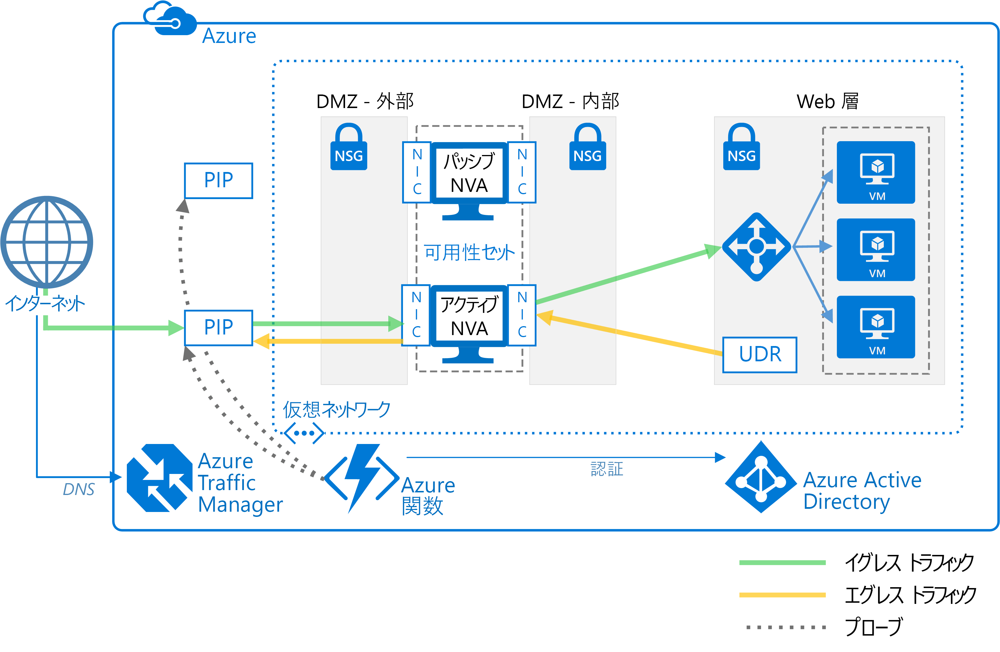

# 高可用性のネットワーク仮想アプライアンスをデプロイする

この記事では、高可用性のネットワーク仮想アプライアンス (NVA) セットを Azure にデプロイする方法を示します。 NVA は、通常は、境界ネットワーク (DMZ とも呼ばれます) から他のネットワークまたはサブネットへのネットワーク トラフィックのフローを制御するために使用されます。 Azure での DMZ の実装については、「[Microsoft クラウド サービスとネットワーク セキュリティ][cloud-security]」を参照してください。 この記事には、イングレスのみ、エグレスのみ、イングレスとエグレスの両方を行うアーキテクチャの例が含まれています。

**前提条件:** この記事は、Azure のネットワーク、[Azure ロード バランサー][lb-overview]、および[ユーザー定義ルート][udr-overview] (UDR) の基本的な知識があることを前提としています。

## アーキテクチャの図

NVA は、さまざまなアーキテクチャの DMZ に配置できます。 たとえば、次の図は、イングレス用の[単一の NVA][nva-scenario] の使用を示しています。

![[0]][0]

このアーキテクチャでは、NVA は、すべての着信ネットワーク トラフィックと発信ネットワーク トラフィックをチェックし、ネットワーク セキュリティ ルールを満たしているトラフィックのみを渡すことによって、セキュリティで保護されたネットワーク境界を提供します。 ただし、すべてのネットワーク トラフィックが NVA を通過する必要があるという事実は、NVA がネットワークの単一障害点であることを意味します。 この NVA で障害が発生した場合、ネットワーク トラフィック用の他のパスが存在しないため、すべてのバックエンド サブネットが使用不能になります。

NVA に高可用性を持たせるには、複数の NVA を可用性セットにデプロイします。

以下のアーキテクチャは、高可用性の NVA で必要なリソースと構成について説明しています。

<!-- markdownlint-disable MD033 -->

| 解決策 | メリット | 考慮事項 |
| --- | --- | --- |
| [第 7 層で NVA を使用するイングレス][ingress-with-layer-7] |すべての NVA ノードがアクティブ |接続を終了し SNAT を使用できる NVA が必要  インターネットからのトラフィックと Azure からのトラフィック用に別個の NVA セットが必要   Azure の外部から発信されるトラフィックでのみ使用可能 |
| [第 7 層で NVA を使用するエグレス][egress-with-layer-7] |すべての NVA ノードがアクティブ | 接続を終了し、ソース ネットワーク アドレス変換 (SNAT) を実装できる NVA が必要
| [第 7 層で NVA を使用するイングレスとエグレス][ingress-egress-with-layer-7] |すべてのノードがアクティブ Azure で発信されたトラフィックを処理可能 |接続を終了し SNAT を使用できる NVA が必要 インターネットからのトラフィックと Azure からのトラフィック用に別個の NVA セットが必要 |
| [PIP-UDR スイッチ][pip-udr-switch] |すべてのトラフィック用の単一の NVA セット すべてのトラフィックを処理可能 (ポート規則に制限なし) |アクティブ/パッシブ フェールオーバー プロセスが必要 |
| [SNAT なしのPIP-UDR](#pip-udr-nvas-without-snat) | すべてのトラフィック用の単一の NVA セット すべてのトラフィックを処理可能 (ポート規則に制限なし) 着信要求に対して SNAT を構成する必要なし |アクティブ/パッシブ フェールオーバー プロセスが必要 調査とフェールオーバーのロジックを仮想ネットワークの外部で実行 |

<!-- markdown-enable MD033 -->

## 第 7 層で NVA を使用するイングレス

次の図は、インターネットに接続するロード バランサーの背後にイングレス DMZ を実装する高可用性アーキテクチャを示しています。 このアーキテクチャは、第 7 層のトラフィックで Azure ワークロードへの HTTP や HTTPS などの接続を提供するように設計されています。

![[1]][1]

このアーキテクチャの利点は、すべての NVA がアクティブであることであり、片方の NVA で障害が発生すると、ロード バランサーが他方の NVA にネットワーク トラフィックを送信します。 両方の NVA がトラフィックを内部ロード バランサーにルーティングするため、1 つの NVA がアクティブである限り、トラフィックが停止することはありません。 Web 層の VM を対象とする SSL トラフィックを終了するには、NVA が必要です。 オンプレミスのトラフィックには独自のネットワーク ルートを持つ NVA の別の専用セットが必要であるため、これらの NVA をオンプレミスのトラフィックを処理するように拡張することはできません。

> [!NOTE]
> このアーキテクチャは、[Azure とオンプレミスのデータセンターの間の DMZ][dmz-on-prem] リファレンス アーキテクチャと [ Azure とインターネットの間の DMZ][dmz-internet] リファレンス アーキテクチャで使用されています。 これらのリファレンス アーキテクチャのそれぞれに、使用できるデプロイ ソリューションが含まれています。 詳細については、リンクを参照してください。

## 第 7 層で NVA を使用するエグレス

前述のアーキテクチャを拡張して、Azure ワークロードから発信される要求を処理するエグレス DMZ を提供できます。 次のアーキテクチャは、DMZ 内の NVA に、HTTP や HTTPS などの第 7 層のトラフィックで高可用性を提供するように設計されています。

![[2]][2]

このアーキテクチャでは、Azure から発信されるすべてのトラフィックが内部ロード バランサーにルーティングされます。 ロード バランサーは、発信要求を NVA セットに分散します。 これらの NVA は、それぞれのパブリック IP アドレスを使用して、インターネットにトラフィックを送信します。

> [!NOTE]
> このアーキテクチャは、[Azure とオンプレミスのデータセンターの間の DMZ][dmz-on-prem] リファレンス アーキテクチャと [ Azure とインターネットの間の DMZ][dmz-internet] リファレンス アーキテクチャで使用されています。 これらのリファレンス アーキテクチャのそれぞれに、使用できるデプロイ ソリューションが含まれています。 詳細については、リンクを参照してください。

## 第 7 層で NVA を使用する イングレスとエグレス

前述の 2 つのアーキテクチャでは、イングレス用とエグレス用に別個の DMZ がありました。 次のアーキテクチャは、第 7 層のトラフィックで、HTTP や HTTPS などのイングレスとエグレスの両方で使用できる DMZ の作成方法を示しています。

![[4]][4]

このアーキテクチャでは、NVA は、アプリケーション ゲートウェイから着信する要求を処理します。 NVA は、ロード バランサーのバックエンド プール内のワークロード VM から発信された要求も処理します。 着信トラフィックはアプリケーション ゲートウェイによってルーティングされ、発信トラフィックはロード バランサーによってルーティングされるため、NVA は、セッション アフィニティも担当します。 つまり、着信要求と発信要求のマッピングはアプリケーション ゲートウェイが管理するため、最初の要求元に適切な応答を転送できます。 ただし、内部ロード バランサーはアプリケーション ゲートウェイのマッピングにアクセスできないため、独自のロジックを使用して NVA への応答を送信します。 ロード バランサーは、アプリケーション ゲートウェイから要求を受信していない NVA に応答を送信する場合があります。 この場合、適切な NVA がアプリケーション ゲートウェイに応答を転送できるように、NVA 間で通信を行って応答を転送する必要があります。

> [!NOTE]
> NVA がインバウンドのソース ネットワーク アドレス変換 (SNAT) を確実に実行することで、非対称ルーティングの問題を解決することもできます。 これにより、要求元のソース IP が、インバウンド フローで使用される NVA のいずれかの IP アドレスに置き換えられます。 これで、ルートの対称性を維持しながら、一度に複数の NVA を使用できます。

## 第 4 層で NVA を使用する PIP-UDR の切り替え

次のアーキテクチャは、1 つのアクティブ NVA と 1 つのパッシブ NVA があるアーキテクチャを示しています。 このアーキテクチャでは、第 4 層のトラフィックでのイングレスとエグレスの両方を処理します。

![[3]][3]

> [!TIP]
> このアーキテクチャの完全なソリューションについては、[GitHub][pnp-ha-nva] を参照してください。

このアーキテクチャは、この記事で説明した最初のアーキテクチャに似ています。 そのアーキテクチャには、第 4 層の着信要求を受け取ってフィルター処理する単一の NVA が含まれていました。 このアーキテクチャでは、2 つ目のパッシブ NVA を追加して、高可用性を実現します。 アクティブ NVA で障害が発生した場合は、パッシブ NVA がアクティブになり、その時点でアクティブな NVA の NIC をポイントするように UDR と PIP が変更されます。 UDR と PIP に対するこれらの変更は、手動で実行するか、自動化されたプロセスを使用して実行できます。 自動化されたプロセスは、通常はデーモンまたは Azure で実行されている他の監視サービスです。 プロセスは、アクティブ NVA の正常性プローブをクエリし、NVA の障害を検出したときに、UDR と PIP の切り替えを実行します。

上記の図は、高可用性デーモンがある [ZooKeeper][zookeeper] クラスターの例を示しています。 ZooKeeper クラスター内では、ノードのクォーラムがリーダーを選出します。 リーダーで障害が発生した場合は、残りのノードによって新しいリーダーが選出されます。 このアーキテクチャでは、リーダー ノードが、NVA の正常性エンドポイントをクエリするデーモンを実行します。 NVA が正常性プローブに応答できなければ、デーモンがパッシブ NVA をアクティブにします。 その後、デーモンは、Azure REST API を呼び出して、障害が発生した NVA から PIP を削除して新しくアクティブになった NVA にアタッチします。 次に、デーモンは、新しくアクティブになった NVA の内部 IP アドレスをポイントするように UDR を変更します。

NVA を含むルートを使用してのみアクセスできるサブネットに ZooKeeper ノードを配置しないでください。 配置すると、NVA で障害が発生した場合に ZooKeeper ノードにアクセスできなくなります。 デーモンが何らかの理由で失敗した場合に、ZooKeeper ノードにアクセスして問題を診断することができなくなります。

サンプル コードを含む完全なソリューションを確認するには、[GitHub リポジトリ][pnp-ha-nva]内のファイルを参照してください。

## SNAT なしのPIP-UDR NVA

このアーキテクチャでは、2 つの Azure 仮想マシンを使用して、自動化されたフェールオーバーをサポートしても送信元ネットワーク アドレス変換 (SNAT) を必要としないアクティブ/パッシブ構成で NVA ファイアウォールをホストします。

> [!TIP]
> このアーキテクチャの完全なソリューションについては、[GitHub][ha-nva-fo] を参照してください。

このソリューションは、NVA ファイアウォールで着信要求に SNAT を構成できない Azure のお客様向けに設計されています。 SNAT は、元のソース クライアントの IP アドレスを隠します。 元の IP を記録する必要があるか、それを NVA の背後にある他の複数層セキュリティ コンポーネント内で使用した場合は、このソリューションに基本的なアプローチが用意されています。

UDR テーブル エントリのフェールオーバーは、アクティブな NVA ファイアウォールの仮想マシン上のインターフェイスの IP アドレスに設定された次ホップ アドレスによって自動化されます。 自動化されたフェールオーバーのロジックは、[Azure Functions](/azure/azure-functions/) を使用して作成する関数アプリでホストされます。 フェールオーバーのコードは、Azure Functions 内でサーバーレス関数として実行されます。 デプロイは、便利でコスト効率に優れ、管理とカスタマイズが簡単です。 さらに、関数アプリは Azure Functions 内でホストされるため、仮想ネットワークでの依存関係がありません。 仮想ネットワークに対する変更が NVA ファイアウォールに影響する場合、関数アプリは独立して実行を続けます。 また、テストもより正確です。着信クライアント要求と同じルートを使用して、仮想ネットワークの外部で実行されるためです。

NVA ファイアウォールの可用性を確認するため、関数アプリ コードは、次の 2 つの方法のいずれかでそれをプローブします。

- NVA ファイアウォールをホストする Azure 仮想マシンの状態を監視する。

- バックエンド Web サーバーに対してファイアウォール経由で開かれたポートがあるかどうかをテストする。 このオプションは、NVA がテストする関数アプリ コードの PIP を使用してソケットを公開する必要があります。

関数アプリを構成するときに使用するプローブの種類を選択します。 サンプル コードを含む完全なソリューションを確認するには、[GitHub リポジトリ][ha-nva-fo]内のファイルを参照してください。

## 次の手順

- 第 7 層の NVA を使用して [Azure とオンプレミスのデータセンターの間に DMZ を実装する][dmz-on-prem]方法を確認します。
- 第 7 層の NVA を使用して [Azure とインターネットの間に DMZ を実装する][dmz-internet]方法を確認します。
- [Azure でのネットワーク仮想アプライアンスに関する問題のトラブルシューティング](/azure/virtual-network/virtual-network-troubleshoot-nva)

<!-- links -->

[cloud-security]: /azure/best-practices-network-security
[dmz-on-prem]: ./secure-vnet-hybrid.md
[dmz-internet]: ./secure-vnet-dmz.md
[egress-with-layer-7]: #egress-with-layer-7-nvas
[ingress-with-layer-7]: #ingress-with-layer-7-nvas
[ingress-egress-with-layer-7]: #ingress-egress-with-layer-7-nvas
[lb-overview]: /azure/load-balancer/load-balancer-overview/
[nva-scenario]: /azure/virtual-network/virtual-network-scenario-udr-gw-nva/
[pip-udr-switch]: #pip-udr-switch-with-layer-4-nvas
[udr-overview]: /azure/virtual-network/virtual-networks-udr-overview/
[zookeeper]: https://zookeeper.apache.org/
[pnp-ha-nva]: https://github.com/mspnp/ha-nva
[ha-nva-fo]: https://aka.ms/ha-nva-fo

<!-- images -->

[0]: ./images/nva-ha/single-nva.png "単一 NVA アーキテクチャ"
[1]: ./images/nva-ha/l7-ingress.png "第 7 層のイングレス"
[2]: ./images/nva-ha/l7-ingress-egress.png "第 7 層のエグレス"
[3]: ./images/nva-ha/active-passive.png "アクティブ/パッシブ クラスター"
[4]: ./images/nva-ha/l7-ingress-egress-ag.png
