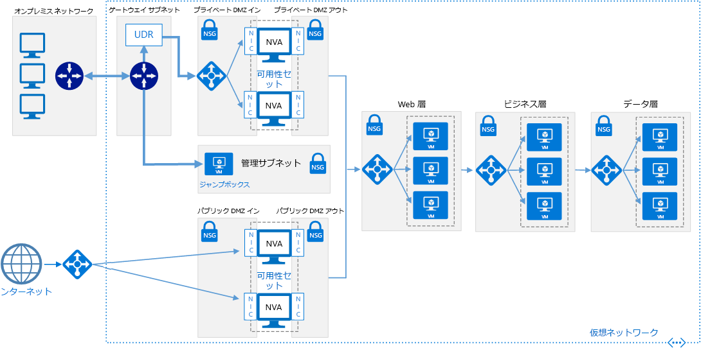

# <a name="implement-a-dmz-between-azure-and-the-internet"></a>Azure とインターネットの間の DMZ の実装

次のリファレンス アーキテクチャは、オンプレミスのネットワークを Azure に拡張してインターネット トラフィックも受け入れる、セキュリティ保護されたハイブリッド ネットワークを示しています。 [**このソリューションをデプロイします**](#deploy-the-solution)。

> [!NOTE]
> このシナリオは、クラウドベースのネットワーク セキュリティ サービスである [Azure Firewall](/azure/firewall/) を使用して実行することもできます。



"*このアーキテクチャの [Visio ファイル][visio-download]をダウンロードします。*"

このリファレンス アーキテクチャは、「[Azure とオンプレミスのデータセンターの間の DMZ の実装][implementing-a-secure-hybrid-network-architecture]」に記載されているアーキテクチャを拡張したものです。 オンプレミスのネットワークからのトラフィックを処理するプライベート DMZ に加え、インターネット トラフィックを処理するパブリック DMZ が追加されています。

このアーキテクチャの一般的な用途は次のとおりです。

- ワークロードの一部がオンプレミスで、一部が Azure で実行されるハイブリッド アプリケーション。
- オンプレミスとインターネットからの着信トラフィックをルーティングする Azure インフラストラクチャ。

## <a name="architecture"></a>アーキテクチャ

アーキテクチャは、次のコンポーネントで構成されます。

- **パブリック IP アドレス (PIP)**。 パブリック エンドポイントの IP アドレス。 インターネットに接続されている外部ユーザーは、このアドレスを介してシステムにアクセスできます。
- **ネットワーク仮想アプライアンス (NVA)** このアーキテクチャには、インターネットから発信されるトラフィック用の独立した NVA プールが含まれています。
- **Azure ロード バランサー**。 インターネットから着信するすべての要求は、ロード バランサーを通過してパブリック DMZ 内の NVA に分散されます。
- **パブリック DMZ のインバウンド サブネット**。 このサブネットは、Azure ロード バランサーからの要求を受け入れます。 着信要求は、パブリック DMZ 内のいずれかの NVA に渡されます。
- **パブリック DMZ のアウトバウンド サブネット**。 NVA によって承認された要求は、このサブネットを通過して、Web 層の内部ロード バランサーに送られます。

## <a name="recommendations"></a>Recommendations

ほとんどのシナリオには、次の推奨事項が適用されます。 これらの推奨事項には、オーバーライドする特定の要件がない限り、従ってください。

### <a name="nva-recommendations"></a>NVA の推奨事項

インターネットから発信されるトラフィックとオンプレミスから発信されるトラフィックには異なる NVA セットを使用します。 両方にただ 1 つの NVA セットを使用すると、2 つのネットワーク トラフィック セットの間にセキュリティ境界が提供されないため、セキュリティ リスクが発生します。 異なる NVA を使用すると、セキュリティ規則のチェックの複雑さが軽減され、規則と着信ネットワーク要求の対応が明確になります。 片方の NVA セットはインターネット トラフィックのみの規則を実装し、他方の NVA セットはオンプレミスのトラフィックのみの規則を実装します。

第 7 層の NVA を含めて、アプリケーションの接続を NVA レベルで終了し、バックエンド層との互換性を維持します。 これにより、バックエンド層からの応答トラフィックが NVA を介して返される対称接続性が保証されます。

### <a name="public-load-balancer-recommendations"></a>パブリック ロード バランサーの推奨事項

スケーラビリティと可用性のために、パブリック DMZ の NVA を[可用性セット][availability-set]にデプロイし、[インターネットに接続するロード バランサー][load-balancer]を使用して、インターネットからの要求を可用性セット内の NVA に分散します。

インターネット トラフィックに必要なポートのみで要求を受け入れるようにロード バランサーを構成します。 たとえば、インバウンドの HTTP 要求をポート 80 に制限し、インバウンドの HTTPS 要求をポート 443 に制限します。

## <a name="scalability-considerations"></a>スケーラビリティに関する考慮事項

初期のアーキテクチャでは、パブリック DMZ 内に単一の NVA が必要である場合でも、最初からパブリック DMZ の前にロード バランサーを配置しておくことをお勧めします。 これにより、将来必要になった場合に、複数の NVA を簡単にスケーリングできます。

## <a name="availability-considerations"></a>可用性に関する考慮事項

インターネットに接続するロード バランサーは、パブリック DMZ の インバウンド サブネット内の各 NVA が[正常性プローブ][lb-probe]を実装することを要求します。 エンドポイントで応答しない正常性プローブは使用不可であるとみなされ、ロード バランサーは、同じ可用性セット内の他の NVA に要求を送信します。 すべての NVA が 応答しない場合、アプリケーションは失敗するため、正常な NVA インスタンスの数が定義されたしきい値を下回った場合に DevOps アラートを生成するように構成された監視機能を用意することが重要であることに注意してください。

## <a name="manageability-considerations"></a>管理容易性に関する考慮事項

パブリック DMZ 内の NVA に対するすべての監視と管理は、管理サブネット内のジャンプボックスによって実行する必要があります。 「[Azure とオンプレミスのデータセンターの間の DMZ の実装][implementing-a-secure-hybrid-network-architecture]」に記載されているように、アクセスを制限するために、オンプレミスのネットワークからゲートウェイ経由でジャンプボックスに至る単一のネットワーク ルートを定義します。

オンプレミスのネットワークから Azure へのゲートウェイ接続がダウンした場合でも、パブリック IP アドレスをデプロイしてジャンプボックスに追加し、インターネットからログインすることで、ジャンプボックスにアクセスできます。

## <a name="security-considerations"></a>セキュリティに関する考慮事項

このリファレンス アーキテクチャは、複数のレベルのセキュリティを実装します。

- インターネットに接続するロード バランサーは、アプリケーションで必要なポートでのみ、パブリック DMZ のインバウンド サブネット内の NVA に要求を送信します。
- パブリック DMZ のインバウンド サブネットとアウトバウンド サブネットの NSG 規則は、NSG 規則に適合しない要求をブロックすることで、NVA への侵入を防ぎます。
- NVA の NAT ルーティング構成は、ポート 80 とポート 443 で着信した要求を Web 層のロード バランサーに送信しますが、それ以外のすべてのポートの要求を無視します。

すべてのポートに着信したすべての要求をログに記録する必要があります。 このログを定期的に監査して、特に予期されたパラメーターの範囲外にある要求の有無を調べます。そのような要求は、侵入の試みを示唆している可能性があります。

## <a name="deploy-the-solution"></a>ソリューションのデプロイ方法

これらの推奨事項を実装する参照アーキテクチャのデプロイは、[GitHub][github-folder] で入手できます。

### <a name="prerequisites"></a>前提条件

[!INCLUDE [ref-arch-prerequisites.md](../../../includes/ref-arch-prerequisites.md)]

### <a name="deploy-resources"></a>リソースのデプロイ

1. 参照アーキテクチャ GitHub リポジトリの `/dmz/secure-vnet-dmz` フォルダーに移動します。

2. 次のコマンドを実行します。

    ```bash
    azbb -s <subscription_id> -g <resource_group_name> -l <region> -p onprem.json --deploy
    ```

3. 次のコマンドを実行します。

    ```bash
    azbb -s <subscription_id> -g <resource_group_name> -l <region> -p secure-vnet-hybrid.json --deploy
    ```

### <a name="connect-the-on-premises-and-azure-gateways"></a>オンプレミスと Azure ゲートウェイに接続する

この手順では、2 つのローカル ネットワーク ゲートウェイを接続します。

1. Azure portal で、作成したリソース グループに移動します。

2. `ra-vpn-vgw-pip` という名前のリソースを探し、**[概要]** ブレードに表示されている IP アドレスをコピーします。

3. `onprem-vpn-lgw` という名前のリソースを探します。

4. **[構成]** ブレードをクリックします。 **[IP アドレス]** に手順 2 の IP アドレスを貼り付けます。

    ![[IP アドレス] フィールドのスクリーンショット](./images/local-net-gw.png)

5. **[保存]** をクリックし、処理が完了するまで待ちます。 完了までに約 5 分かかります。

6. `onprem-vpn-gateway1-pip` という名前のリソースを探します。 **[概要]** ブレードに表示されている IP アドレスをコピーします。

7. `ra-vpn-lgw` という名前のリソースを探します。

8. **[構成]** ブレードをクリックします。 **[IP アドレス]** に手順 6 の IP アドレスを貼り付けます。

9. **[保存]** をクリックし、処理が完了するまで待ちます。

10. 接続を確認するには、各ゲートウェイの **[接続]** ブレードに移動します。 状態が **[接続済み]** であることを確認します。

### <a name="verify-that-network-traffic-reaches-the-web-tier"></a>ネットワーク トラフィックが Web 階層に到達していることを確認する

1. Azure portal で、作成したリソース グループに移動します。

2. パブリック DMZ の前面にあるロード バランサーである `pub-dmz-lb` という名前のリソースを探します。

3. **[概要]** ブレードからパブリック IP アドレスをコピーし、このアドレスを Web ブラウザーで開きます。 既定の Apache2 サーバーのホーム ページが表示されます。

4. プライベート DMZ の前面にあるロード バランサーである `int-dmz-lb` という名前のリソースを探します。 **[概要]** ブレードからプライベート IP アドレスをコピーします。

5. `jb-vm1` という名前の VM を見つけます。 **[接続]** をクリックし、リモート デスクトップを使用して VM に接続します。 ユーザー名とパスワードは、onprem.json ファイルに指定されています。

6. リモート デスクトップ セッションから Web ブラウザーを開き、手順 4 の IP アドレスに移動します。 既定の Apache2 サーバーのホーム ページが表示されます。

[availability-set]: /azure/virtual-machines/virtual-machines-windows-manage-availability
[github-folder]: https://github.com/mspnp/reference-architectures/tree/master/dmz/secure-vnet-dmz

[implementing-a-secure-hybrid-network-architecture]: ./secure-vnet-hybrid.md
[iptables]: https://help.ubuntu.com/community/IptablesHowTo
[lb-probe]: /azure/load-balancer/load-balancer-custom-probe-overview
[load-balancer]: /azure/load-balancer/load-balancer-Internet-overview
[network-security-group]: /azure/virtual-network/virtual-networks-nsg

[visio-download]: https://archcenter.blob.core.windows.net/cdn/dmz-reference-architectures.vsdx
