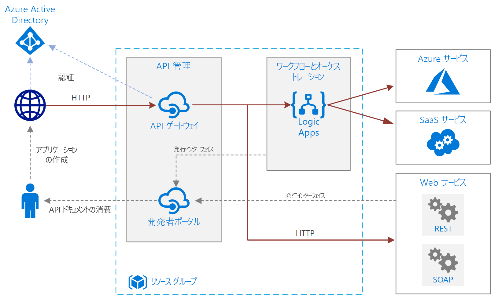

# Azure での基本的なエンタープライズ統合

この参照アーキテクチャでは、[Azure Integration Services][integration-services] を使用して、エンタープライズ バックエンド システムへの呼び出しを調整します。 バックエンド システムには、サービスとしてのソフトウェア (SaaS) システム、Azure サービス、およびご自身の企業内の既存の Web サービスが含まれる場合があります。

Azure Integration Services は、アプリケーションとデータを統合するサービスのコレクションです。 このアーキテクチャでは、そのうち、ワークフローを調整する [Logic Apps][logic-apps] と、API のカタログを作成する [API Management][apim] という 2 つのサービスを使用します。 バックエンド サービスへの同期呼び出しによってワークフローがトリガーされる基本的な統合シナリオの場合は、このアーキテクチャで十分です。 この基本的なアーキテクチャを基にして、[キューとイベント](./queues-events.md)を使用した、より高度なアーキテクチャを構築できます。

## アーキテクチャ

アーキテクチャには次のコンポーネントがあります。

- **バックエンド システム**。 図の右側には、企業がデプロイまたは使用するさまざまなバックエンド システムが示されています。 これらには、SaaS システム、その他の Azure サービス、あるいは REST または SOAP エンドポイントを公開する Web サービスが含まれる場合があります。

- **Azure Logic Apps**。 [Logic Apps][logic-apps] は、アプリケーション、データ、およびサービスを統合するエンタープライズ ワークフローを構築するためのサーバーレス プラットフォームです。 このアーキテクチャでは、HTTP 要求によってロジック アプリがトリガーされます。 ワークフローを入れ子にすることで、より複雑なオーケストレーションを実現することもできます。 Logic Apps では[コネクタ][logic-apps-connectors]を使用して、よく利用するサービスを統合します。 Logic Apps には何百ものコネクタが用意されていますが、カスタム コネクタを作成することもできます。

- **Azure API Management**。 [API Management][apim] は、HTTP API のカタログを発行するためのマネージド サービスで、このサービスを使うと再利用や検出可能性が高まります。 API Management は、次の 2 つの関連するコンポーネントで構成されます。

  - **API ゲートウェイ**。 API ゲートウェイは、HTTP 呼び出しを受け入れ、バックエンドにルーティングします。

  - **開発者ポータル**。 Azure API Management の各インスタンスによって、[開発者ポータル][apim-dev-portal]へのアクセスが提供されます。 開発者は、このポータルから、ドキュメントとAPI を呼び出すためのコード サンプルにアクセスできます。 開発者ポータル内で API をテストすることもできます。

  このアーキテクチャでは、API として[ロジック アプリをインポートする][apim-logic-app]ことによって、複合 API が構築されます。 [OpenAPI (Swagger) 仕様をインポートする][apim-openapi]か、または WSDL 仕様から [SOAP API をインポートする][apim-soap]ことによって、既存の Web サービスをインポートすることもできます。

  API ゲートウェイは、バックエンドからフロントエンド クライアントを分離するのに役立ちます。 たとえば、URL を再書き込みしたり、バックエンドに到達する前に要求を変換したりできます。 また、認証、クロス オリジン リソース共有 (CORS) のサポート、応答のキャッシュなど、多くのサービスにまたがる機能を処理することもできます。

- **Azure DNS**。 [Azure DNS][dns] は DNS ドメインのホスティング サービスです。 Azure DNS は、Microsoft Azure インフラストラクチャを使用した名前解決を提供します。 Azure でドメインをホストすることで、その他の Azure サービスに使用しているのと同じ資格情報、API、ツール、課金情報を使用して DNS レコードを管理できます。 カスタム ドメイン名 (contoso.com など) を使用するには、カスタム ドメイン名を IP アドレスにマップする DNS レコードを作成します。 詳細については、[API Management でのカスタム ドメイン名の構成][apim-domain]に関するページを参照してください。

- **Azure Active Directory (Azure AD)**。 API ゲートウェイを呼び出すクライアントを認証するには、[Azure AD][aad] を使用します。 Azure AD では、OpenID Connect (OIDC) プロトコルがサポートされています。 クライアントは Azure AD からアクセス トークンを取得し、API ゲートウェイが[トークンを検証する][apim-jwt]ことで要求が承認されます。 API Management の Standard および Premium レベルを使用している場合、Azure AD によって開発者ポータルへのアクセスをセキュリティで保護することもできます。

## Recommendations

ここに示す一般的なアーキテクチャとは異なる、固有の要件がある場合があります。 このセクションに記載されている推奨事項は原案として使用してください。

### API Management

API Management の Basic、Standard、または Premium レベルを使用します。 これらのレベルでは、運用のサービス レベル アグリーメント (SLA) が提供され、Azure リージョン内でのスケールアウトがサポートされています。 API Management のスループット容量は、"*ユニット*" で測定されます。 価格レベルごとに、スケールアウトの最大数が設定されています。また、Premium レベルでは、複数の Azure リージョンにまたがるスケールアウトもサポートされています。 お使いの機能セットと必要なスループットのレベルに基づいて、使用するレベルを選択します。 詳細については、「[Azure API Management の価格][apim-pricing]」および「[Azure API Management インスタンスの容量][apim-capacity]」を参照してください。

各 Azure API Management インスタンスには既定のドメイン名が付いています。これは `azure-api.net` のサブドメイン (例: `contoso.azure-api.net`) です。 ご自身の組織用に[カスタム ドメイン][apim-domain]を構成することを検討してください。

### Logic Apps

Logic Apps は、非同期や準長期実行の API 呼び出しなど、応答が低遅延でなくてもよいシナリオで最適に動作します。 低遅延が必要な場合、たとえば、ユーザー インターフェイスをブロックする呼び出しでは、別のテクノロジを使用します。 たとえば、Azure App Service にデプロイされた Azure Functions または Web API を使用します。 API Management を使用して、API コンシューマーに向けて API を配置します。

### リージョン

ネットワーク待機時間を最小限に抑えるには、API Management および Logic Apps を同じリージョンに配置します。 通常は、ユーザーに最も近い (またはバックエンド サービスに最も近い) リージョンを選択します。

リソース グループにもリージョンがあります。 このリージョンによって、デプロイ メタデータを格納する場所と、デプロイ テンプレートを実行する場所が指定されます。 デプロイ時の可用性を向上させるには、リソース グループとそのリソースを同じリージョンに配置します。

## スケーラビリティに関する考慮事項

API Management のスケーラビリティを向上させるには、必要に応じて[キャッシュ ポリシー][apim-caching]を追加します。 また、キャッシュはバックエンド サービスに対する負荷を軽減するのに役立ちます。

提供する容量をより大きくするために、Azure リージョン内で Azure API Management をBasic、Standard、および Premium レベルにスケールアウトできます。 サービスの使用状況を分析するには、**[メトリック]** メニューで、**[容量メトリック]** オプションを選択して、適切にスケールアップまたはスケールダウンします。 アップグレードまたはスケーリング プロセスは、適用されるまでに 15 ～ 45 分かかる場合があります。

API Management サービスのスケーリングに関する推奨事項を次に示します。

- スケーリングする際はトラフィック パターンを検討します。 トラフィック パターンが変動しやすい顧客は、より大きな容量を必要とします。

- 容量が一貫して 66% を上回る場合は、スケールアップの必要があることを示している可能性があります。

- 容量が一貫して 20% を下回る場合は、スケールダウンの機会であることを示している可能性があります。

- 運用環境で読み込みを有効にする前に、想定される負荷で API Management サービスのロードテストを必ず行います。

Premium レベルでは、複数の Azure リージョンにまたがって API Management インスタンスをスケーリングできます。 これにより、API Management は、より高度な SLA に対応できるようになり、複数のリージョンに位置するユーザーの近くでサービスをプロビジョニングできます。

Logic Apps サーバーレス モデルによって、管理者はサービスのスケーラビリティについて計画を立てる必要がなくなります。 サービスは、需要に合わせて自動的にスケーリングされます。

## 可用性に関する考慮事項

各サービスの SLA を確認してください。

- [API Management の SLA][apim-sla]
- [Logic Apps の SLA][logic-apps-sla]

Premium レベルで 2 つ以上のリージョンにまたがって API Management をデプロイすると、より高度な SLA に対応できます。 「[API Management の価格][apim-pricing]」を参照してください。

### バックアップ

お使いの API Management の構成は、定期的に[バックアップ][apim-backup]してください。 バックアップ ファイルは、サービスがデプロイされているのとは別の場所または Azure リージョンに保管します。 [RTO][rto] に基づいて、ディザスター リカバリー戦略を選択してください。

- ディザスター リカバリー イベントで、新しい API Management インスタンスをプロビジョニングして、バックアップを新しいインスタンスに復元し、DNS レコードを補完します。

- API Management サービスのパッシブ インスタンスは、別の Azure リージョンに保持します。 アクティブ サービスとの同期を保つには、定期的にそのインスタンスにバックアップを復元してください。 ディザスター リカバリー イベントの中でサービスを復元するには、DNS レコードのみを補完する必要があります。 このアプローチではパッシブ インスタンスの支払いが生じるため追加コストが発生しますが、回復にかかる時間は短縮されます。

ロジック アプリについては、コードとしての構成アプローチで、バックアップと復元を行うことをお勧めします。 ロジック アプリはサーバーレスなので、Azure Resource Manager テンプレートから迅速に再作成できます。 テンプレートはソース コントロールに保存し、お使いの継続的インテグレーション/継続的配置 (CI/CD) プロセスにテンプレートを統合します。 ディザスター リカバリー イベントの際は、新しいリージョンにテンプレートをデプロイしてください。

ロジック アプリを別のリージョンにデプロイした場合は、API Management の構成を更新します。 基本的な PowerShell スクリプトを使用して、API の **Backend** プロパティを更新できます。

## 管理容易性に関する考慮事項

運用、開発、およびテスト環境それぞれに対して個別のリソース グループを作成してください。 個別のリソース グループにより、デプロイの管理、テスト デプロイの削除、およびアクセス権の割り当てが行いやすくなります。

リソースをリソース グループに割り当てるときは、次の要素を検討してください。

- **ライフサイクル**。 一般的に、同じライフサイクルのリソースは、同じリソース グループに配置します。

- **アクセス**。 アクセス ポリシーをグループ内のリソースに適用するには、[ロールベースのアクセス制御][rbac] (RBAC) を使用できます。

- **課金**。 リソース グループのロールアップ コストを表示できます。

- **API Management の価格レベル**。 開発環境およびテスト環境には、Developer レベルを使用してください。 運用前環境のコストを最小限に抑えるには、運用環境のレプリカをデプロイしてテストを実行し、シャットダウンします。

### Deployment

Azure リソースをデプロイするには、[Azure Resource Manager テンプレート][arm]を使用します。 テンプレートを使用すると、PowerShell または Azure CLI を使用したデプロイの自動化が容易になります。

API Management と個々の任意のロジック アプリを別々の独自の Resource Manager テンプレートに配置します。 別々のテンプレートを使用することで、ソース管理システムにリソースを格納できます。 テンプレートは一緒にデプロイすることも、CI/CD プロセスの一環として個別にデプロイすることもできます。

### バージョン

ロジック アプリの構成に変更を加えるか、または Resource Manager テンプレートを使って更新プログラムをデプロイするたびに、Azure では、該当のバージョンのコピーを保管して、実行履歴のあるすべてのバージョンを保管します。 これらのバージョンを使用して、履歴変更を追跡したり、特定のバージョンをロジック アプリの現在の構成として昇格させたりできます。 たとえば、ロジック アプリを以前のバージョンにロールバックすることができます。

API Management では、次に示すように、バージョンに関して 2 つの異なる補完的概念がサポートされています。

- "*バージョン*" により、API のコンシューマーはニーズに基づいて API のバージョン (v1、v2、ベータ、または運用など) を選択できます。

- "*リビジョン*" により、API 管理者が API の非破壊的変更を行い、これらの変更をデプロイできるようになります。その際、API コンシューマーにこれらの変更を通知する変更ログもデプロイされます。

開発環境でリビジョンを作成して、Resource Manager テンプレートを使って他の環境にその変更をデプロイできます。 詳細については、[複数のバージョンの API の発行][apim-versions]に関する記事をご覧ください。

変更を適用してユーザーがアクセスできるようにする前に、リビジョンを使用して API をテストすることもできます。 ただし、この方法は、ロード テストや統合テストにはお勧めしません。 代わりに、別のテスト環境または運用前環境を使用してください。

## 診断および監視

操作の監視には、API Management および Logic Apps の両方で、[Azure Monitor][monitor] を使用します。 Azure Monitor は、各サービスに構成されているメトリックに基づいて情報を提供し、既定で有効になります。 詳細については、次を参照してください。

- [発行された API の監視][apim-monitor]
- [Azure Logic Apps の状態の監視、診断ログの設定、アラートの有効化][logic-apps-monitor]

また、各サービスには、次のオプションがあります。

- より詳細な分析およびダッシュボード化のために、[Azure Log Analytics][logic-apps-log-analytics] に Logic Apps ログを送信します。

- DevOps 監視には、API Management 用に Azure Application Insights を構成します。

- API Management では、[カスタム API 分析のための Power BI ソリューション テンプレート][apim-pbi]をサポートしています。 独自の分析ソリューションを作成して、このソリューション テンプレートを使用できます。 Power BI ではビジネス ユーザー向けに、レポートを利用可能にします。

## セキュリティに関する考慮事項

次の一覧は、セキュリティ上のベスト プラクティスをすべて網羅しているわけではありませんが、このアーキテクチャに特に該当するセキュリティ上のいくつかの考慮事項を示しています。

- Azure API Management サービスには、固定のパブリック IP アドレスがあります。 Logic Apps エンドポイントを呼び出すためのアクセスを、API Management の IP アドレスのみに制限します。 詳細については、[受信 IP アドレスの制限][logic-apps-restrict-ip]に関するページを参照してください。

- ユーザーが適切なアクセス レベルを保持していることを確認するには、ロールベースのアクセス制御 (RBAC) を使用します。

- OAuth/OpenID Connect を使用して、API Management にあるパブリック API エンドポイントをセキュリティで保護する。 パブリック API エンドポイントをセキュリティで保護するには、ID プロバイダーを構成し、JSON Web トークン (JWT) 検証ポリシーを追加します。 詳細については、「[Azure Active Directory と API Management で OAuth 2.0 を使用して API を保護する][apim-oauth]」を参照してください。

- 相互証明書を使用して、API Management からバックエンド サービスに接続する。

- API Management API に HTTPS を強制します。

### シークレットの保存

パスワード、アクセス キー、または接続文字列を、ソース管理にチェックインしないでください。 これらの値が必要な場合は、適切な手段を使用して、値をセキュリティで保護してデプロイします。

1 つのロジック アプリがコネクタ内に作成できない何らかの機密値を必要としている場合、それらの値を Azure Key Vault に保存して、Resource Manager テンプレートから参照します。 デプロイ テンプレートのパラメーターと、各環境のパラメーター ファイルを使用します。 詳細については、「[ワークフロー内のパラメーターと入力のセキュリティ保護][logic-apps-secure]」を参照してください。

API Management は、"*名前付きの値*" または "*プロパティ*" というオブジェクトを使用して、シークレットを管理します。 これらのオブジェクトでは、API Management ポリシー経由でアクセスできる値を安全に格納します。 詳細については、「[Azure API Management ポリシーでの名前付きの値の使用方法][apim-properties]」を参照してください。

## コストに関する考慮事項

すべての API Management インスタンスは、実行された場合に課金されます。 スケールアップしても、常にそのパフォーマンス レベルを必要としない場合は、手動でスケールダウンするか、[自動スケーリング][apim-autoscale]を構成してください。

Logic Apps では、[サーバーレス](/azure/logic-apps/logic-apps-serverless-overview) モデルを使用します。 課金はアクションとコネクタの実行に基づいて計算されます。 詳細については、「[Logic Apps の価格](https://azure.microsoft.com/pricing/details/logic-apps/)」をご覧ください。 現在、Logic Apps には、レベルに関する考慮事項はありません。

## 次の手順

信頼性とスケーラビリティを高めるには、メッセージ キューとイベントを使用して、バックエンド システムを切り離します。 このパターンは、このシリーズの次の参照アーキテクチャに示されています。[メッセージ キューとイベントを使用したエンタープライズ統合](./queues-events.md)に関するページをご確認ください。

<!-- links -->

[aad]: /azure/active-directory
[apim]: /azure/api-management
[apim-autoscale]: /azure/api-management/api-management-howto-autoscale
[apim-backup]: /azure/api-management/api-management-howto-disaster-recovery-backup-restore
[apim-caching]: /azure/api-management/api-management-howto-cache
[apim-capacity]: /azure/api-management/api-management-capacity
[apim-dev-portal]: /azure/api-management/api-management-key-concepts#a-namedeveloper-portal-a-developer-portal
[apim-domain]: /azure/api-management/configure-custom-domain
[apim-jwt]: /azure/api-management/policies/authorize-request-based-on-jwt-claims
[apim-logic-app]: /azure/api-management/import-logic-app-as-api
[apim-monitor]: /azure/api-management/api-management-howto-use-azure-monitor
[apim-oauth]: /azure/api-management/api-management-howto-protect-backend-with-aad
[apim-openapi]: /azure/api-management/import-api-from-oas
[apim-pbi]: https://aka.ms/apimpbi
[apim-pricing]: https://azure.microsoft.com/pricing/details/api-management/
[apim-properties]: /azure/api-management/api-management-howto-properties
[apim-sla]: https://azure.microsoft.com/support/legal/sla/api-management/
[apim-soap]: /azure/api-management/import-soap-api
[apim-versions]: /azure/api-management/api-management-get-started-publish-versions
[arm]: /azure/azure-resource-manager/resource-group-authoring-templates
[dns]: /azure/dns/
[integration-services]: https://azure.microsoft.com/product-categories/integration/
[logic-apps]: /azure/logic-apps/logic-apps-overview
[logic-apps-connectors]: /azure/connectors/apis-list
[logic-apps-log-analytics]: /azure/logic-apps/logic-apps-monitor-your-logic-apps-oms
[logic-apps-monitor]: /azure/logic-apps/logic-apps-monitor-your-logic-apps
[logic-apps-restrict-ip]: /azure/logic-apps/logic-apps-securing-a-logic-app#restrict-incoming-ip-addresses
[logic-apps-secure]: /azure/logic-apps/logic-apps-securing-a-logic-app#secure-parameters-and-inputs-within-a-workflow
[logic-apps-sla]: https://azure.microsoft.com/support/legal/sla/logic-apps
[monitor]: /azure/azure-monitor/overview
[rbac]: /azure/role-based-access-control/overview
[rto]: ../../reliability/requirements.md#recovery-metrics