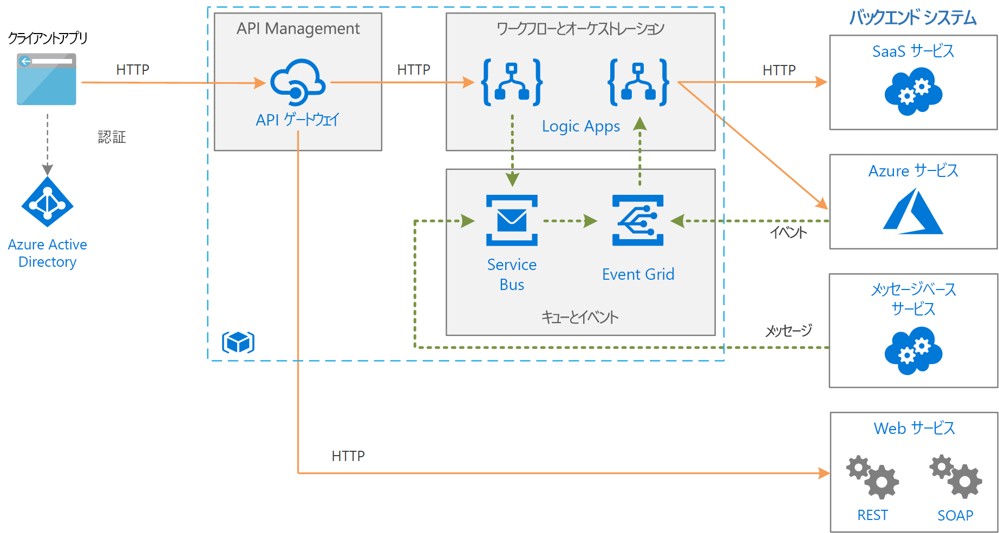

# メッセージ キューとイベントを使用した Azure でのエンタープライズ統合Enterprise integration on Azure using message queues and events

この参照アーキテクチャでは、スケーラビリティと信頼性を高めるためにメッセージ キューとイベントを使用してサービスを切り離し、エンタープライズ バックエンド システムを統合します。This reference architecture integrates enterprise backend systems, using message queues and events to decouple services for greater scalability and reliability. バックエンド システムには、サービスとしてのソフトウェア (SaaS) システム、Azure サービス、およびご自身の企業内の既存の Web サービスが含まれる場合があります。The backend systems may include software as a service (SaaS) systems, Azure services, and existing web services in your enterprise.

## アーキテクチャArchitecture

ここで示すアーキテクチャは、[基本的なエンタープライズ統合][basic-enterprise-integration]に示されている、よりシンプルなアーキテクチャに基づいています。The architecture shown here builds on a simpler architecture that is shown in [Basic enterprise integration][basic-enterprise-integration]. そのアーキテクチャで使用されるのは、ワークフローを調整する [Logic Apps][logic-apps] と、API のカタログを作成する [API Management][apim] です。That architecture uses [Logic Apps][logic-apps] to orchestrate workflows and [API Management][apim] to create catalogs of APIs.

このバージョンのアーキテクチャでは、システムの信頼性とスケーラビリティを高めるうえで役立つコンポーネントが 2 つ追加されています。This version of the architecture adds two components that help make the system more reliable and scalable:

- **[Azure Service Bus][service-bus]**。**[Azure Service Bus][service-bus]**. Service Bus は、セキュリティで保護された信頼できるメッセージ ブローカーです。Service Bus is a secure, reliable message broker.

- **[Azure Event Grid][event-grid]**。**[Azure Event Grid][event-grid]**. Event Grid は、イベント ルーティング サービスです。Event Grid is an event routing service. このサービスでは、[発行/サブスクライブ](../../patterns/publisher-subscriber.md) (pub/sub) イベント モデルが使用されます。It uses a [publish/subscribe](../../patterns/publisher-subscriber.md) (pub/sub) eventing model.

メッセージ ブローカーを使用した非同期通信は、バックエンド サービスへの直接的な同期呼び出しに比べ、多くの利点があります。Asynchronous communication using a message broker provides a number of advantages over making direct, synchronous calls to backend services:

- [キューベースの負荷平準化パターン](../../patterns/queue-based-load-leveling.md)を使用して、負荷平準化を実現し、ワークロードのバーストを処理します。Provides load-leveling to handle bursts in workloads, using the [Queue-Based Load Leveling pattern](../../patterns/queue-based-load-leveling.md).
- 複数のステップまたは複数のアプリケーションを含む、実行時間の長いワークフローの進行状況を確実に追跡します。Reliably tracks the progress of long-running workflows that involve multiple steps or multiple applications.
- アプリケーションを切り離すうえで役立ちます。Helps to decouple applications.
- 既存のメッセージ ベースのシステムと統合します。Integrates with existing message-based systems.
- バックエンド システムが利用できない場合に作業をキューに挿入できます。Allows work to be queued when a backend system is not available.

Event Grid を使うと、システム内のさまざまなコンポーネントが、発生したイベントにすぐに対処できます。ポーリングやスケジュールされたタスクには依存しません。Event Grid enables the various components in the system to react to events as they happen, rather than relying on polling or scheduled tasks. メッセージ キューと同様、アプリケーションとサービスを切り離すうえでも役立ちます。As with a message queue, it helps decouple applications and services. アプリケーションまたはサービスがイベントを発行でき、関与しているすべてのサブスクライバーに通知されます。An application or service can publish events, and any interested subscribers will be notified. 新しいサブスクライバーを追加するために、送信者を更新する必要はありません。New subscribers can be added without updating the sender.

Event Grid へのイベント送信をサポートする Azure サービスは多数あります。Many Azure services support sending events to Event Grid. たとえば、新しいファイルが BLOB ストアに追加された場合に、ロジック アプリはイベントをリッスンできます。For example, a logic app can listen for an event when new files are added to a blob store. このパターンにより、リアクティブ ワークフローが有効になり、ファイルのアップロードやキューでのメッセージ追加によって一連のプロセスが開始されます。This pattern enables reactive workflows, where uploading a file or putting a message on a queue kicks off a series of processes. プロセスは並行して、または特定の順序で実行できます。The processes might be executed in parallel or in a specific sequence.

## RecommendationsRecommendations

このアーキテクチャには、[基本的なエンタープライズ統合][basic-enterprise-integration]に関するページに記載されている推奨事項が適用されます。The recommendations described in [Basic enterprise integration][basic-enterprise-integration] apply to this architecture. また、次の推奨事項も適用されます。The following recommendations also apply:

### Service BusService Bus

Service Bus には、"*プル*" と "*プッシュ*" の 2 つの配信モードがあります。Service Bus has two delivery modes, *pull* or *push*. プル モードでは、受信側は継続的に新しいメッセージをポーリングします。In the pull model, the receiver continuously polls for new messages. ポーリングは、特に、それぞれ複数のメッセージを受信するキューが多数ある場合や、メッセージとメッセージの間にかなりの時間がある場合には、非効率になることがあります。Polling can be inefficient, especially if you have many queues that each receive a few messages, or if there a lot of time between messages. プッシュ モデルでは、新しいメッセージがあるとき、Service Bus が Event Grid を介してイベントを送信します。In the push model, Service Bus sends an event through Event Grid when there are new messages. 受信側は、そのイベントをサブスクライブします。The receiver subscribes to the event. イベントがトリガーされると、受信側は Service Bus から次のメッセージ バッチをプルします。When the event is triggered, the receiver pulls the next batch of messages from Service Bus.

Service Bus メッセージを使用するためにロジック アプリを作成する場合は、Event Grid 統合でプッシュ モデルを使用することをお勧めします。When you create a logic app to consume Service Bus messages, we recommend using the push model with Event Grid integration. ロジック アプリで Service Bus をポーリングする必要がないため、ほとんどの場合、こちらの方がコスト効率に優れています。It's often more cost efficient, because the logic app doesn't need to poll Service Bus. 詳細については、「[Azure Service Bus と Event Grid の統合の概要](/azure/service-bus-messaging/service-bus-to-event-grid-integration-concept)」を参照してください。For more information, see [Azure Service Bus to Event Grid integration overview](/azure/service-bus-messaging/service-bus-to-event-grid-integration-concept). 現在、Event Grid の通知には Service Bus の [Premium レベル](https://azure.microsoft.com/pricing/details/service-bus/)が必要です。Currently, Service Bus [Premium tier](https://azure.microsoft.com/pricing/details/service-bus/) is required for Event Grid notifications.

メッセージのグループへのアクセスには、[PeekLock](/azure/service-bus-messaging/service-bus-messaging-overview#queues) を使用してください。Use [PeekLock](/azure/service-bus-messaging/service-bus-messaging-overview#queues) for accessing a group of messages. PeekLock を使用すると、ロジック アプリは、メッセージを完了または中止する前に、各メッセージを検証する手順を実行できます。When you use PeekLock, the logic app can perform steps to validate each message before completing or abandoning the message. この方法によって、メッセージの誤損失から保護します。This approach protects against accidental message loss.

### Event GridEvent Grid

Event Grid トリガーが発生した場合、これは、"*少なくとも 1 つ*" のイベントが発生したことを意味します。When an Event Grid trigger fires, it means *at least one* event happened. たとえば、ロジック アプリが Service Bus メッセージに対する Event Grid トリガーを取得した場合、そのロジック アプリは、処理対象のメッセージを複数取得する可能性があると想定します。For example, when a logic app gets an Event Grid triggers for a Service Bus message, it should assume that several messages might be available to process.

Event Grid では、サーバーレス モデルを使用します。Event Grid uses a serverless model. 課金は、操作 (イベントの実行) の回数に基づいて計算されます。Billing is calculated based on the number of operations (event executions). 詳細については、「[Event Grid の価格](https://azure.microsoft.com/pricing/details/event-grid/)」を参照してください。For more information, see [Event Grid pricing](https://azure.microsoft.com/pricing/details/event-grid/). 現在、Event Grid には、レベルに関する考慮事項はありません。Currently, there are no tier considerations for Event Grid.

## スケーラビリティに関する考慮事項Scalability considerations

Service Bus Premium レベルは、より高いスケーラビリティを実現するためにメッセージング ユニットの数をスケールアウトできます。To achieve higher scalability, the Service Bus Premium tier can scale out the number of messaging units. Premium レベルの構成では、1 つ、2 つ、または 4 つのメッセージング ユニットを持つことができます。Premium tier configurations can have one, two, or four messaging units. Service Bus のスケーリングの詳細については、「[Service Bus メッセージングを使用したパフォーマンス向上のためのベスト プラクティス](/azure/service-bus-messaging/service-bus-performance-improvements)」を参照してください。For more information about scaling Service Bus, see [Best practices for performance improvements by using Service Bus Messaging](/azure/service-bus-messaging/service-bus-performance-improvements).

## 可用性に関する考慮事項Availability considerations

各サービスの SLA を確認してください。Review the SLA for each service:

- [API Management の SLA][apim-sla][API Management SLA][apim-sla]
- [Event Grid の SLA][event-grid-sla][Event Grid SLA][event-grid-sla]
- [Logic Apps の SLA][logic-apps-sla][Logic Apps SLA][logic-apps-sla]
- [Service Bus の SLA][sb-sla][Service Bus SLA][sb-sla]

重大な障害が発生した場合にフェールオーバーを有効にするために、Service Bus Premium で geo ディザスター リカバリーを実装することを検討します。To enable failover if a serious outage occurs, consider implementing geo-disaster recovery in Service Bus Premium. 詳細については、「[Azure Service Bus の geo ディザスター リカバリー](/azure/service-bus-messaging/service-bus-geo-dr)」を参照してください。For more information, see [Azure Service Bus geo-disaster recovery](/azure/service-bus-messaging/service-bus-geo-dr).

## セキュリティに関する考慮事項Security considerations

Service Bus をセキュリティで保護するには、Shared Access Signature (SAS) を使用します。To secure Service Bus, use shared access signature (SAS). [SAS 認証](/azure/service-bus-messaging/service-bus-sas)を使用して、特定の権限で、Service Bus リソースへのアクセス権をユーザーに付与できます。You can grant a user access to Service Bus resources with specific rights by using [SAS authentication](/azure/service-bus-messaging/service-bus-sas). 詳細については、「[Service Bus の認証と承認](/azure/service-bus-messaging/service-bus-authentication-and-authorization)」を参照してください。For more information, see [Service Bus authentication and authorization](/azure/service-bus-messaging/service-bus-authentication-and-authorization).

Service Bus キューを HTTP エンドポイントとして公開する必要がある場合は (たとえば、新しいメッセージを投稿する場合)、API Management を使用して、エンドポイントをフロントに配置してキューをセキュリティで保護します。If you need to expose a Service Bus queue as an HTTP endpoint, for example, to post new messages, use API Management to secure the queue by fronting the endpoint. 次に、必要に応じて、証明書または OAuth 認証を使用してこのエンドポイントをセキュリティ保護できます。You can then secure the endpoint with certificates or OAuth authentication as appropriate. エンドポイントをセキュリティで保護する最も簡単な方法は、HTTP 要求/応答トリガーを仲介としてロジック アプリを使用することです。The easiest way to secure an endpoint is using a logic app with an HTTP request/response trigger as an intermediary.

Event Grid サービスは、検証コードを使ってイベント配信をセキュリティで保護します。The Event Grid service secures event delivery through a validation code. Logic Apps を利用してイベントを使用する場合、検証は自動的に行われます。If you use Logic Apps to consume the event, validation is automatically performed. 詳細については、「[Event Grid security and authentication](/azure/event-grid/security-authentication)」(Event Grid のセキュリティと認証) を参照してください。For more information, see [Event Grid security and authentication](/azure/event-grid/security-authentication).

[apim]: /azure/api-management
[apim-sla]: https://azure.microsoft.com/support/legal/sla/api-management/
[event-grid]: /azure/event-grid/
[event-grid-sla]: https://azure.microsoft.com/support/legal/sla/event-grid
[logic-apps]: /azure/logic-apps/logic-apps-overview
[logic-apps-sla]: https://azure.microsoft.com/support/legal/sla/logic-apps
[sb-sla]: https://azure.microsoft.com/support/legal/sla/service-bus/
[service-bus]: /azure/service-bus-messaging/
[basic-enterprise-integration]: ./basic-enterprise-integration.md
