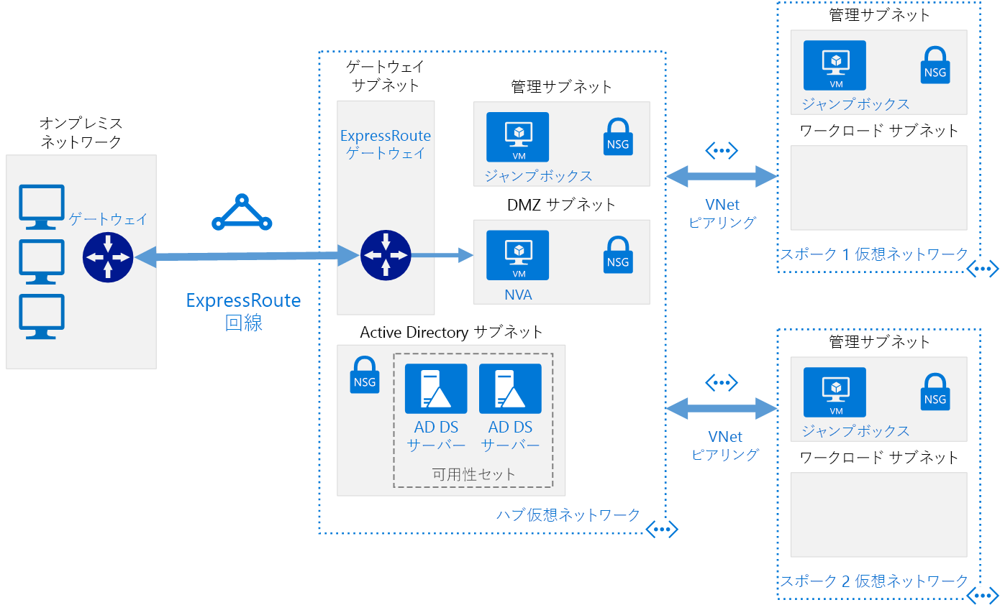

# <a name="implement-a-hub-spoke-network-topology-with-shared-services-in-azure"></a>Azure に共有サービスを含むハブスポーク ネットワーク トポロジを実装する

この参照アーキテクチャは、[ハブスポーク][guidance-hub-spoke]参照アーキテクチャに基づいて作成されており、すべてのスポークで利用できる共有サービスがハブに含まれます。 クラウドへのデータセンターの移行と[仮想データセンター]の構築に向けた最初の手順として、共有する必要がある最初のサービスが ID とセキュリティです。 この参照アーキテクチャは、Active Directory サービスをオンプレミスのデータセンターから Azure に拡張する方法と、ハブスポーク トポロジに、ファイアウォールとして動作可能なネットワーク仮想アプライアンス (NVA) を追加する方法を示しています。  [**このソリューションをデプロイします**](#deploy-the-solution)。



*このアーキテクチャの [Visio ファイル][visio-download]をダウンロードします。*

このトポロジの利点は次のとおりです。

- **コストの削減**: 複数のワークロードを共有するサービス (ネットワーク仮想アプライアンス (NVA) や DNS サーバーなど) を 1 か所に集めます。
- **サブスクリプション数の上限の解消**: 中央のハブに別のサブスクリプションから VNet をピアリングします。
- **問題の分離**: 中央の IT (SecOps、InfraOps) とワークロード (DevOps) の間で実施します。

このアーキテクチャの一般的な用途は次のとおりです。

- DNS、IDS、NTP、AD DS などの共有サービスを必要とするさまざまな環境 (開発、テスト、運用など) でデプロイされるワークロード。 共有サービスはハブ VNet に配置され、分離性を維持するために各環境はスポークにデプロイされます。
- 相互接続が不要であり、共有サービスへのアクセスは必要なワークロード。
- セキュリティ要素 (DMZ としてのハブのファイアウォールなど) の一元管理、および各スポークにおけるワークロードの分別管理が必要なエンタープライズ。

## <a name="architecture"></a>アーキテクチャ

アーキテクチャは、次のコンポーネントで構成されます。

- **オンプレミス ネットワーク**。 組織内で実行されているプライベートなローカル エリア ネットワークです。

- **VPN デバイス**。 オンプレミス ネットワークへの外部接続を提供するデバイスまたはサービスです。 VPN デバイスには、ハードウェア デバイス、または Windows Server 2012 のルーティングとリモート アクセス サービス (RRAS) などのソフトウェア ソリューションがあります。 サポート対象の VPN アプライアンスの一覧と選択した VPN アプライアンスを Azure に接続するための構成については、「[サイト間 VPN ゲートウェイ接続用の VPN デバイスと IPsec/IKE パラメーターについて][vpn-appliance]」をご覧ください。

- **VPN 仮想ネットワーク ゲートウェイまたは ExpressRoute ゲートウェイ**。 仮想ネットワーク ゲートウェイでは、オンプレミス ネットワークとの接続に使用する VPN デバイス (ExpressRoute 回線) に VNet を接続できます。 詳しくは、「[Connect an on-premises network to a Microsoft Azure virtual network][connect-to-an-Azure-vnet]」(Microsoft Azure 仮想ネットワークにオンプレミス ネットワークを接続する) をご覧ください。

> [!NOTE]
> この参照アーキテクチャのデプロイ スクリプトでは、VPN ゲートウェイを使用して接続し、Azure の VNet を使用してオンプレミス ネットワークをシミュレートします。

- **ハブ VNet**。 ハブスポーク トポロジのハブとして使用する Azure VNet。 ハブは、オンプレミス ネットワークへの主要な接続ポイントであり、スポーク VNet でホストされるさまざまなワークロードによって消費できるサービスをホストする場所です。

- **ゲートウェイ サブネット**。 複数の仮想ネットワーク ゲートウェイが同じサブネットに保持されます。

- **共有サービス サブネット**。 DNS や AD DS など、すべてのスポーク間で共有できるサービスをホストするために使用されるハブ VNet 内のサブネットです。

- **DMZ サブネット**。 ファイアウォールなどの、セキュリティ アプライアンスとして動作できる NVA をホストするために使用されるハブ VNet のサブネットです。

- **スポーク VNet**。 ハブスポーク トポロジでスポークとして使用される 1 つ以上の Azure VNet です。 スポークを使用すると、独自の VNet にワークロードを分離して、その他のスポークから個別に管理できます。 各ワークロードには複数の階層が含まれる場合があります。これらの階層には、Azure ロード バランサーを使用して接続されている複数のサブネットがあります。 アプリケーション インフラストラクチャについて詳しくは、「[Running Windows VM workloads][windows-vm-ra]」(Windows VM ワークロードを実行する) および「[Running Linux VM workloads][linux-vm-ra]」(Linux VM ワークロードを実行する) をご覧ください。

- **VNet ピアリング**。 [ピアリング接続][vnet-peering]を使用して、同じ Azure リージョン内の 2 つの VNet を接続できます。 ピアリング接続は、VNet 間の待機時間の短い非推移的な接続です。 ピアリングが完了すると、VNet は、ルーターがなくても Azure のバックボーンを使用してトラフィックを交換します。 ハブスポーク ネットワーク トポロジでは、VNet ピアリングを使用して、ハブを各スポークに接続します。

> [!NOTE]
> この記事で説明するのは [Resource Manager](/azure/azure-resource-manager/resource-group-overview) のデプロイのみですが、クラシック VNet を同じサブスクリプションの Resource Manager VNet に接続することもできます。 これにより、クラシック デプロイ をスポークでホストして、ハブで共有するサービスのメリットを引き続き得ることができます。

## <a name="recommendations"></a>Recommendations

[ハブスポーク][guidance-hub-spoke]参照アーキテクチャのすべての推奨事項が、共有サービスの参照アーキテクチャにも適用されます。

また、共有サービスのほとんどのシナリオには、次の推奨事項が適用されます。 これらの推奨事項には、オーバーライドする特定の要件がない限り、従ってください。

### <a name="identity"></a>ID

ほとんどの企業組織のオンプレミス データセンターには Active Directory ディレクトリ サービス (ADDS) 環境があります。 ADDS に依存しているオンプレミスのネットワークから Azure に移動される資産の管理を容易にするには、Azure で ADDS ドメイン コントローラーをホストすることをお勧めします。

Azure とオンプレミスの環境を別々に管理するグループ ポリシー オブジェクトを使用する場合は、Azure リージョンごとに別の AD サイトを使用します。 依存するワークロードがアクセスできる中心の VNet (ハブ) に、ドメイン コントローラーを配置します。

### <a name="security"></a>セキュリティ

オンプレミスの環境から Azure にワークロードを移動すると、これらのワークロードの一部を VM でホストする必要があります。 コンプライアンス上の理由から、これらのワークロードを通過するトラフィックを制限することが必要になる場合があります。

Azure では、ネットワーク仮想アプライアンス (NVA) を使用して、さまざまな種類のセキュリティおよびパフォーマンス サービスをホストできます。 現在、オンプレミスで特定のアプライアンスのセットを使い慣れている場合は、可能であれば、Azure で同じ仮想アプライアンスを使用することをお勧めします。

> [!NOTE]
> この参照アーキテクチャのデプロイ スクリプトでは、IP 転送が有効な Ubuntu VM を使用してネットワーク仮想アプライアンスを模倣します。

## <a name="considerations"></a>考慮事項

### <a name="overcoming-vnet-peering-limits"></a>VNet ピアリングの制限の解消

Azure の [VNet ごとの VNet ピアリング数の制限][vnet-peering-limit]を考慮してください。 制限を超える数のスポークを許可する場合は、ハブスポークハブスポーク トポロジの作成を検討してください。このトポロジでは、第 1 レベルのスポークもハブとして機能します。 この手法を次の図に示します。


また、多数のスポークに合わせてハブを拡張するために、ハブで共有するサービスも検討してください。 たとえば、ハブがファイアウォール サービスを提供する場合は、複数のスポークを追加するときにファイアウォール ソリューションの帯域幅の制限を検討します。 このような一部の共有サービスを第 2 レベルのハブに移動することをお勧めします。

## <a name="deploy-the-solution"></a>ソリューションのデプロイ方法

このアーキテクチャのデプロイについては、[GitHub][ref-arch-repo] を参照してください。 デプロイによってサブスクリプション内に作成されるリソース グループは、次のとおりです。

- hub-adds-rg
- hub-nva-rg
- hub-vnet-rg
- onprem-vnet-rg
- spoke1-vnet-rg
- spoke2-vent-rg

テンプレート パラメーター ファイルは、これらの名前を参照します。したがって、名前を変更する場合は、それに合わせてパラメーター ファイルも更新します。

### <a name="prerequisites"></a>前提条件

[!INCLUDE [ref-arch-prerequisites.md](../../../includes/ref-arch-prerequisites.md)]

### <a name="deploy-the-simulated-on-premises-datacenter-using-azbb"></a>シミュレートされたオンプレミスのデータセンターを azbb を使用してデプロイする

この手順では、シミュレートされたオンプレミスのデータセンターを Azure VNet としてデプロイします。

1. GitHub リポジトリの `hybrid-networking\shared-services-stack\` フォルダーに移動します。

2. `onprem.json` ファイルを開きます。

3. `UserName`、`adminUserName`、`Password`、および `adminPassword` のすべてのインスタンスを検索します。 パラメーターにユーザー名とパスワードの値を入力し、ファイルを保存します。

4. 次のコマンドを実行します。

   ```bash
   azbb -s <subscription_id> -g onprem-vnet-rg -l <location> -p onprem.json --deploy
   ```

5. デプロイが完了するのを待機します。 このデプロイでは、仮想ネットワーク、Windows を実行する仮想マシン、および VPN ゲートウェイを作成します。 VPN ゲートウェイの作成の完了には 40 分以上かかる場合があります。

### <a name="deploy-the-hub-vnet"></a>ハブ VNet をデプロイする

この手順では、ハブ VNet をデプロイして、シミュレートされたオンプレミス VNet に接続します。

1. `hub-vnet.json` ファイルを開きます。

2. `adminPassword` を検索し、パラメーターにユーザー名とパスワードを入力します。

3. `sharedKey` のすべてのインスタンスを検索し、共有キーの値を入力します。 ファイルを保存します。

   ```json
   "sharedKey": "abc123",
   ```

4. 次のコマンドを実行します。

   ```bash
   azbb -s <subscription_id> -g hub-vnet-rg -l <location> -p hub-vnet.json --deploy
   ```

5. デプロイが完了するのを待機します。 このデプロイでは、仮想ネットワーク、仮想マシン、VPN ゲートウェイ、および前のセクションで作成したゲートウェイへの接続を作成します。 VPN ゲートウェイの完了には 40 分以上かかる場合があります。

### <a name="deploy-ad-ds-in-azure"></a>Azure に AD DS をデプロイする

この手順では、Azure に AD DS ドメイン コントローラーをデプロイします。

1. `hub-adds.json` ファイルを開きます。

2. `Password` および `adminPassword` のすべてのインスタンスを検索します。 パラメーターにユーザー名とパスワードの値を入力し、ファイルを保存します。

3. 次のコマンドを実行します。

   ```bash
   azbb -s <subscription_id> -g hub-adds-rg -l <location> -p hub-adds.json --deploy
   ```

シミュレートされたオンプレミスのデータセンターでホストされているドメインに 2 つの VM を参加させて、その VM に AD DS をインストールするため、このデプロイ手順は数分かかる可能性があります。

### <a name="deploy-the-spoke-vnets"></a>スポーク VNet をデプロイする

この手順では、スポーク VNet をデプロイします。

1. `spoke1.json` ファイルを開きます。

2. `adminPassword` を検索し、パラメーターにユーザー名とパスワードを入力します。

3. 次のコマンドを実行します。

   ```bash
   azbb -s <subscription_id> -g spoke1-vnet-rg -l <location> -p spoke1.json --deploy
   ```

4. `spoke2.json` ファイルに対して手順 1. から 2. を繰り返します。

5. 次のコマンドを実行します。

   ```bash
   azbb -s <subscription_id> -g spoke2-vnet-rg -l <location> -p spoke2.json --deploy
   ```

### <a name="peer-the-hub-vnet-to-the-spoke-vnets"></a>ハブ VNet をスポーク VNet にピアリングする

ハブ VNet からスポーク VNet へのピアリング接続を作成するには、次のコマンドを実行します。

```bash
azbb -s <subscription_id> -g hub-vnet-rg -l <location> -p hub-vnet-peering.json --deploy
```

### <a name="deploy-the-nva"></a>NVA をデプロイする

この手順では、NVA を `dmz` サブネットにデプロイします。

1. `hub-nva.json` ファイルを開きます。

2. `adminPassword` を検索し、パラメーターにユーザー名とパスワードを入力します。

3. 次のコマンドを実行します。

   ```bash
   azbb -s <subscription_id> -g hub-nva-rg -l <location> -p hub-nva.json --deploy
   ```

### <a name="test-connectivity"></a>接続をテストする

シミュレートされたオンプレミスの環境からハブ VNet への接続をテストします。

1. Azure Portal を使用して、`onprem-jb-rg` リソース グループで `jb-vm1` という名前の VM を見つけます。

2. `Connect` をクリックして、VM に対するリモート デスクトップ セッションを開きます。 `onprem.json` パラメーター ファイルで指定したパスワードを使用します。

3. VM で PowerShell コンソールを開き、`Test-NetConnection` コマンドレットを使用して、ハブ VNet の ジャンプボックス VM に接続できることを確認します。

   ```powershell
   Test-NetConnection 10.0.0.68 -CommonTCPPort RDP
   ```

出力は次のようになります。

```powershell
ComputerName     : 10.0.0.68
RemoteAddress    : 10.0.0.68
RemotePort       : 3389
InterfaceAlias   : Ethernet 2
SourceAddress    : 192.168.1.000
TcpTestSucceeded : True
```

> [!NOTE]
> 既定で、Windows Server VM では Azure の ICMP 応答が許可されていません。 接続のテストに `ping` を使用する場合は、VM ごとに Windows の高度なファイアウォールで ICMP トラフィックを有効にする必要があります。

スポーク VNet への接続をテストするには、同じ手順を繰り返します。

```powershell
Test-NetConnection 10.1.0.68 -CommonTCPPort RDP
Test-NetConnection 10.2.0.68 -CommonTCPPort RDP
```

<!-- links -->

[azure-cli-2]: /azure/install-azure-cli
[azbb]: https://github.com/mspnp/template-building-blocks/wiki/Install-Azure-Building-Blocks
[guidance-hub-spoke]: ./hub-spoke.md
[azure-vpn-gateway]: /azure/vpn-gateway/vpn-gateway-about-vpngateways
[best-practices-security]: /azure/best-practices-network-securit
[connect-to-an-Azure-vnet]: https://technet.microsoft.com/library/dn786406.aspx
[guidance-expressroute]: ./expressroute.md
[guidance-vpn]: ./vpn.md
[linux-vm-ra]: ../virtual-machines-linux/index.md
[hybrid-ha]: ./expressroute-vpn-failover.md
[naming conventions]: /azure/guidance/guidance-naming-conventions
[resource-manager-overview]: /azure/azure-resource-manager/resource-group-overview
[仮想データセンター]: https://aka.ms/vdc
[vnet-peering]: /azure/virtual-network/virtual-network-peering-overview
[vnet-peering-limit]: /azure/azure-subscription-service-limits#networking-limits
[vpn-appliance]: /azure/vpn-gateway/vpn-gateway-about-vpn-devices
[windows-vm-ra]: ../virtual-machines-windows/index.md

[visio-download]: https://archcenter.blob.core.windows.net/cdn/hybrid-network-hub-spoke.vsdx
[ref-arch-repo]: https://github.com/mspnp/reference-architectures
[ARM-Templates]: https://azure.microsoft.com/documentation/articles/resource-group-authoring-templates/
