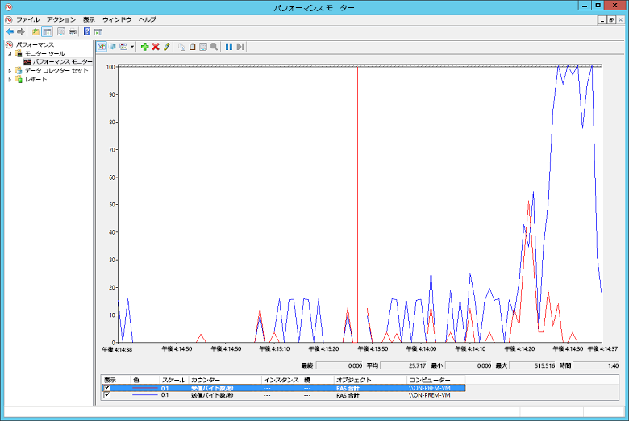

# <a name="troubleshoot-a-hybrid-vpn-connection"></a><span data-ttu-id="78df0-103">ハイブリッド VPN 接続のトラブルシューティング</span><span class="sxs-lookup"><span data-stu-id="78df0-103">Troubleshoot a hybrid VPN connection</span></span>

<span data-ttu-id="78df0-104">この記事では、オンプレミス ネットワークと Azure 間の VPN ゲートウェイ接続をトラブルシューティングする際のヒントをいくつか示します。</span><span class="sxs-lookup"><span data-stu-id="78df0-104">This article gives some tips for troubleshooting a VPN gateway connection between an on-premises network and Azure.</span></span> <span data-ttu-id="78df0-105">一般的な VPN 関連エラーのトラブルシューティングに関する全般的な情報については、「[Troubleshooting common VPN related errors (一般的な VPN 関連エラーのトラブルシューティング)][troubleshooting-vpn-errors]」を参照してください。</span><span class="sxs-lookup"><span data-stu-id="78df0-105">For general information on troubleshooting common VPN-related errors, see [Troubleshooting common VPN related errors][troubleshooting-vpn-errors].</span></span>

## <a name="verify-the-vpn-appliance-is-functioning-correctly"></a><span data-ttu-id="78df0-106">VPN アプライアンスが正常に機能していることを確認する</span><span class="sxs-lookup"><span data-stu-id="78df0-106">Verify the VPN appliance is functioning correctly</span></span>

<span data-ttu-id="78df0-107">次の推奨事項は、オンプレミス VPN アプライアンスが正しく機能しているかどうかを判断するうえで役立ちます。</span><span class="sxs-lookup"><span data-stu-id="78df0-107">The following recommendations are useful for determining if your on-premises VPN appliance is functioning correctly.</span></span>

<span data-ttu-id="78df0-108">**VPN アプライアンスによって生成されたログ ファイルで、エラーや障害がないかどうかを確認する。**</span><span class="sxs-lookup"><span data-stu-id="78df0-108">**Check any log files generated by the VPN appliance for errors or failures.**</span></span> <span data-ttu-id="78df0-109">これは、VPN アプライアンスが正しく機能しているかどうかを判断するうえで役立ちます。</span><span class="sxs-lookup"><span data-stu-id="78df0-109">This will help you determine if the VPN appliance is functioning correctly.</span></span> <span data-ttu-id="78df0-110">この情報の場所は、アプライアンスによって異なります。</span><span class="sxs-lookup"><span data-stu-id="78df0-110">The location of this information will vary according to your appliance.</span></span> <span data-ttu-id="78df0-111">たとえば、Windows Server 2012 で RRAS を使用している場合は、次の PowerShell コマンドを使用して、RRAS サービスのエラー イベント情報を表示できます。</span><span class="sxs-lookup"><span data-stu-id="78df0-111">For example, if you are using RRAS on Windows Server 2012, you can use the following PowerShell command to display error event information for the RRAS service:</span></span>

```PowerShell
Get-EventLog -LogName System -EntryType Error -Source RemoteAccess | Format-List -Property *
```

<span data-ttu-id="78df0-112">各エントリの *Message* プロパティにエラーの説明が示されます。</span><span class="sxs-lookup"><span data-stu-id="78df0-112">The *Message* property of each entry provides a description of the error.</span></span> <span data-ttu-id="78df0-113">一般的な例を次に示します。</span><span class="sxs-lookup"><span data-stu-id="78df0-113">Some common examples are:</span></span>

- <span data-ttu-id="78df0-114">おそらく、RRAS VPN のネットワーク インターフェイス構成内の Azure VPN ゲートウェイに対して指定された IP アドレスが正しくないため、接続できない。</span><span class="sxs-lookup"><span data-stu-id="78df0-114">Inability to connect, possibly due to an incorrect IP address specified for the Azure VPN gateway in the RRAS VPN network interface configuration.</span></span>

  ```console
  EventID            : 20111
  MachineName        : on-prem-vm
  Data               : {41, 3, 0, 0}
  Index              : 14231
  Category           : (0)
  CategoryNumber     : 0
  EntryType          : Error
  Message            : RoutingDomainID- {00000000-0000-0000-0000-000000000000}: A demand dial connection to the remote
                          interface AzureGateway on port VPN2-4 was successfully initiated but failed to complete
                          successfully because of the  following error: The network connection between your computer and
                          the VPN server could not be established because the remote server is not responding. This could
                          be because one of the network devices (for example, firewalls, NAT, routers, and so on) between your computer
                          and the remote server is not configured to allow VPN connections. Please contact your
                          Administrator or your service provider to determine which device may be causing the problem.
  Source             : RemoteAccess
  ReplacementStrings : {{00000000-0000-0000-0000-000000000000}, AzureGateway, VPN2-4, The network connection between
                          your computer and the VPN server could not be established because the remote server is not
                          responding. This could be because one of the network devices (for example, firewalls, NAT, routers, and so on)
                          between your computer and the remote server is not configured to allow VPN connections. Please
                          contact your Administrator or your service provider to determine which device may be causing the
                          problem.}
  InstanceId         : 20111
  TimeGenerated      : 3/18/2016 1:26:02 PM
  TimeWritten        : 3/18/2016 1:26:02 PM
  UserName           :
  Site               :
  Container          :
  ```

- <span data-ttu-id="78df0-115">RRAS VPN ネットワーク インターフェイスの構成で、誤った共有キーが指定されている。</span><span class="sxs-lookup"><span data-stu-id="78df0-115">The wrong shared key being specified in the RRAS VPN network interface configuration.</span></span>

  ```console
  EventID            : 20111
  MachineName        : on-prem-vm
  Data               : {233, 53, 0, 0}
  Index              : 14245
  Category           : (0)
  CategoryNumber     : 0
  EntryType          : Error
  Message            : RoutingDomainID- {00000000-0000-0000-0000-000000000000}: A demand dial connection to the remote
                          interface AzureGateway on port VPN2-4 was successfully initiated but failed to complete
                          successfully because of the  following error: Internet key exchange (IKE) authentication credentials are unacceptable.

  Source             : RemoteAccess
  ReplacementStrings : {{00000000-0000-0000-0000-000000000000}, AzureGateway, VPN2-4, IKE authentication credentials are
                          unacceptable.
                          }
  InstanceId         : 20111
  TimeGenerated      : 3/18/2016 1:34:22 PM
  TimeWritten        : 3/18/2016 1:34:22 PM
  UserName           :
  Site               :
  Container          :
  ```

<span data-ttu-id="78df0-116">次の PowerShell コマンドを使用して、RRAS サービスを介した接続試行に関するイベント ログ情報を入手することもできます。</span><span class="sxs-lookup"><span data-stu-id="78df0-116">You can also obtain event log information about attempts to connect through the RRAS service using the following PowerShell command:</span></span>

```powershell
Get-EventLog -LogName Application -Source RasClient | Format-List -Property *
```

<span data-ttu-id="78df0-117">接続で障害が発生した場合、このログには、次のようなエラーが含まれます。</span><span class="sxs-lookup"><span data-stu-id="78df0-117">In the event of a failure to connect, this log will contain errors that look similar to the following:</span></span>

```console
EventID            : 20227
MachineName        : on-prem-vm
Data               : {}
Index              : 4203
Category           : (0)
CategoryNumber     : 0
EntryType          : Error
Message            : CoId={B4000371-A67F-452F-AA4C-3125AA9CFC78}: The user SYSTEM dialed a connection named
                        AzureGateway that has failed. The error code returned on failure is 809.
Source             : RasClient
ReplacementStrings : {{B4000371-A67F-452F-AA4C-3125AA9CFC78}, SYSTEM, AzureGateway, 809}
InstanceId         : 20227
TimeGenerated      : 3/18/2016 1:29:21 PM
TimeWritten        : 3/18/2016 1:29:21 PM
UserName           :
Site               :
Container          :
```

## <a name="verify-connectivity"></a><span data-ttu-id="78df0-118">接続を検証する</span><span class="sxs-lookup"><span data-stu-id="78df0-118">Verify connectivity</span></span>

<span data-ttu-id="78df0-119">**VPN ゲートウェイを介した接続とルーティングを確認する。**</span><span class="sxs-lookup"><span data-stu-id="78df0-119">**Verify connectivity and routing across the VPN gateway.**</span></span> <span data-ttu-id="78df0-120">VPN アプライアンスによって、Azure VPN Gateway を介したトラフィックが正しくルーティングされていない可能性があります。</span><span class="sxs-lookup"><span data-stu-id="78df0-120">The VPN appliance may not be correctly routing traffic through the Azure VPN Gateway.</span></span> <span data-ttu-id="78df0-121">[PsPing][psping] などのツールを使用して、VPN ゲートウェイを介した接続とルーティングを確認してください。</span><span class="sxs-lookup"><span data-stu-id="78df0-121">Use a tool such as [PsPing][psping] to verify connectivity and routing across the VPN gateway.</span></span> <span data-ttu-id="78df0-122">たとえば、オンプレミスのマシンから VNet にある Web サーバーへの接続をテストするには、次のコマンドを実行します (`<<web-server-address>>` を Web サーバーのアドレスで置き換えてください)。</span><span class="sxs-lookup"><span data-stu-id="78df0-122">For example, to test connectivity from an on-premises machine to a web server located on the VNet, run the following command (replacing `<<web-server-address>>` with the address of the web server):</span></span>

```console
PsPing -t <<web-server-address>>:80
```

<span data-ttu-id="78df0-123">オンプレミスのマシンがトラフィックを Web サーバーにルーティングできる場合は、次のような出力が表示されます。</span><span class="sxs-lookup"><span data-stu-id="78df0-123">If the on-premises machine can route traffic to the web server, you should see output similar to the following:</span></span>

```console
D:\PSTools>psping -t 10.20.0.5:80

PsPing v2.01 - PsPing - ping, latency, bandwidth measurement utility
Copyright (C) 2012-2014 Mark Russinovich
Sysinternals - www.sysinternals.com

TCP connect to 10.20.0.5:80:
Infinite iterations (warmup 1) connecting test:
Connecting to 10.20.0.5:80 (warmup): 6.21ms
Connecting to 10.20.0.5:80: 3.79ms
Connecting to 10.20.0.5:80: 3.44ms
Connecting to 10.20.0.5:80: 4.81ms

    Sent = 3, Received = 3, Lost = 0 (0% loss),
    Minimum = 3.44ms, Maximum = 4.81ms, Average = 4.01ms
```

<span data-ttu-id="78df0-124">オンプレミスのマシンが指定した接続先と通信できない場合は、次のようなメッセージが表示されます。</span><span class="sxs-lookup"><span data-stu-id="78df0-124">If the on-premises machine cannot communicate with the specified destination, you will see messages like this:</span></span>

```console
D:\PSTools>psping -t 10.20.1.6:80

PsPing v2.01 - PsPing - ping, latency, bandwidth measurement utility
Copyright (C) 2012-2014 Mark Russinovich
Sysinternals - www.sysinternals.com

TCP connect to 10.20.1.6:80:
Infinite iterations (warmup 1) connecting test:
Connecting to 10.20.1.6:80 (warmup): This operation returned because the timeout period expired.
Connecting to 10.20.1.6:80: This operation returned because the timeout period expired.
Connecting to 10.20.1.6:80: This operation returned because the timeout period expired.
Connecting to 10.20.1.6:80: This operation returned because the timeout period expired.
Connecting to 10.20.1.6:80:
    Sent = 3, Received = 0, Lost = 3 (100% loss),
    Minimum = 0.00ms, Maximum = 0.00ms, Average = 0.00ms
```

<span data-ttu-id="78df0-125">**オンプレミスのファイアウォールで VPN トラフィックの通過が許可されていること、また正しいポートが開いていることを確認する。**</span><span class="sxs-lookup"><span data-stu-id="78df0-125">**Verify that the on-premises firewall allows VPN traffic to pass and that the correct ports are opened.**</span></span>

<span data-ttu-id="78df0-126">**オンプレミスの VPN アプライアンスによって、Azure VPN ゲートウェイと互換性のある暗号化方式が使用されていることを確認する。**</span><span class="sxs-lookup"><span data-stu-id="78df0-126">**Verify that the on-premises VPN appliance uses an encryption method that is compatible with the Azure VPN gateway.**</span></span> <span data-ttu-id="78df0-127">ポリシー ベースのルーティングでは、Azure VPN ゲートウェイは、AES256、AES128、および 3DES 暗号化アルゴリズムをサポートしています。</span><span class="sxs-lookup"><span data-stu-id="78df0-127">For policy-based routing, the Azure VPN gateway supports the AES256, AES128, and 3DES encryption algorithms.</span></span> <span data-ttu-id="78df0-128">ルート ベースのゲートウェイは、AES256 および 3DES をサポートしています。</span><span class="sxs-lookup"><span data-stu-id="78df0-128">Route-based gateways support AES256 and 3DES.</span></span> <span data-ttu-id="78df0-129">詳細については、「[サイト間 VPN Gateway 接続用の VPN デバイスと IPsec/IKE パラメーターについて][vpn-appliance]」を参照してください。</span><span class="sxs-lookup"><span data-stu-id="78df0-129">For more information, see [About VPN devices and IPsec/IKE parameters for Site-to-Site VPN Gateway connections][vpn-appliance].</span></span>

## <a name="check-for-problems-with-the-azure-vpn-gateway"></a><span data-ttu-id="78df0-130">Azure VPN ゲートウェイの問題を確認する</span><span class="sxs-lookup"><span data-stu-id="78df0-130">Check for problems with the Azure VPN gateway</span></span>

<span data-ttu-id="78df0-131">次の推奨事項は、Azure VPN ゲートウェイに問題があるかどうかを判断するのに役立ちます。</span><span class="sxs-lookup"><span data-stu-id="78df0-131">The following recommendations are useful for determining if there is a problem with the Azure VPN gateway:</span></span>

<span data-ttu-id="78df0-132">**Azure VPN ゲートウェイの診断ログで潜在的な問題がないか調査する。**</span><span class="sxs-lookup"><span data-stu-id="78df0-132">**Examine Azure VPN gateway diagnostic logs for potential issues.**</span></span> <span data-ttu-id="78df0-133">[ステップ バイ ステップのAzure Resource Manager VNET ゲートウェイの診断ログのキャプチャ][gateway-diagnostic-logs]に関するページを参照してください。</span><span class="sxs-lookup"><span data-stu-id="78df0-133">See [Step-by-Step: Capturing Azure Resource Manager VNET Gateway Diagnostic Logs][gateway-diagnostic-logs].</span></span>

<span data-ttu-id="78df0-134">**Azure VPN ゲートウェイとオンプレミス VPN アプライアンスが同じ共有認証キーで構成されていることを確認する。**</span><span class="sxs-lookup"><span data-stu-id="78df0-134">**Verify that the Azure VPN gateway and on-premises VPN appliance are configured with the same shared authentication key.**</span></span> <span data-ttu-id="78df0-135">Azure VPN ゲートウェイによって保存されている共有キーを表示するには、次の Azure CLI コマンドを使用します。</span><span class="sxs-lookup"><span data-stu-id="78df0-135">You can view the shared key stored by the Azure VPN gateway using the following Azure CLI command:</span></span>

```azurecli
azure network vpn-connection shared-key show <<resource-group>> <<vpn-connection-name>>
```

<span data-ttu-id="78df0-136">ご使用のオンプレミス VPN アプライアンスに適したコマンドを使用して、そのアプライアンス用に構成された共有キーを表示します。</span><span class="sxs-lookup"><span data-stu-id="78df0-136">Use the command appropriate for your on-premises VPN appliance to show the shared key configured for that appliance.</span></span>

<span data-ttu-id="78df0-137">Azure VPN ゲートウェイを保持している *GatewaySubnet* サブネットが NSG に関連付けられていないことを確認します。</span><span class="sxs-lookup"><span data-stu-id="78df0-137">Verify that the *GatewaySubnet* subnet holding the Azure VPN gateway is not associated with an NSG.</span></span>

<span data-ttu-id="78df0-138">サブネットを詳細を表示するには、次の Azure CLI コマンドを使用します。</span><span class="sxs-lookup"><span data-stu-id="78df0-138">You can view the subnet details using the following Azure CLI command:</span></span>

```azurecli
azure network vnet subnet show -g <<resource-group>> -e <<vnet-name>> -n GatewaySubnet
```

<span data-ttu-id="78df0-139">*Network Security Group ID* という名前のデータ フィールドがないことを確認します。</span><span class="sxs-lookup"><span data-stu-id="78df0-139">Ensure there is no data field named *Network Security Group ID*.</span></span> <span data-ttu-id="78df0-140">次の例は、割り当られた NSG (*VPN-Gateway-Group*) を持つ *GatewaySubnet* のインスタンスの結果を示しています。</span><span class="sxs-lookup"><span data-stu-id="78df0-140">The following example shows the results for an instance of the *GatewaySubnet* that has an assigned NSG (*VPN-Gateway-Group*).</span></span> <span data-ttu-id="78df0-141">この場合、この NSG に対してルールが定義されていると、ゲートウェイは正しく動作できなくなる可能性があります。</span><span class="sxs-lookup"><span data-stu-id="78df0-141">This can prevent the gateway from working correctly if there are any rules defined for this NSG.</span></span>

```console
C:\>azure network vnet subnet show -g profx-prod-rg -e profx-vnet -n GatewaySubnet
    info:    Executing command network vnet subnet show
    + Looking up virtual network "profx-vnet"
    + Looking up the subnet "GatewaySubnet"
    data:    Id                              : /subscriptions/########-####-####-####-############/resourceGroups/profx-prod-rg/providers/Microsoft.Network/virtualNetworks/profx-vnet/subnets/GatewaySubnet
    data:    Name                            : GatewaySubnet
    data:    Provisioning state              : Succeeded
    data:    Address prefix                  : 10.20.3.0/27
    data:    Network Security Group id       : /subscriptions/########-####-####-####-############/resourceGroups/profx-prod-rg/providers/Microsoft.Network/networkSecurityGroups/VPN-Gateway-Group
    info:    network vnet subnet show command OK
```

<span data-ttu-id="78df0-142">**Azure VNet の仮想マシンが VNet 外からの受信トラフィックを許可するように構成されていることを確認する。**</span><span class="sxs-lookup"><span data-stu-id="78df0-142">**Verify that the virtual machines in the Azure VNet are configured to permit traffic coming in from outside the VNet.**</span></span> <span data-ttu-id="78df0-143">こうした仮想マシンを含むサブネットに関連付けられているすべての NSG ルールを確認します。</span><span class="sxs-lookup"><span data-stu-id="78df0-143">Check any NSG rules associated with subnets containing these virtual machines.</span></span> <span data-ttu-id="78df0-144">すべての NSG ルールを表示するには、次の Azure CLI コマンドを使用します。</span><span class="sxs-lookup"><span data-stu-id="78df0-144">You can view all NSG rules using the following Azure CLI command:</span></span>

```azurecli
azure network nsg show -g <<resource-group>> -n <<nsg-name>>
```

<span data-ttu-id="78df0-145">**Azure VPN ゲートウェイが接続されていることを確認する。**</span><span class="sxs-lookup"><span data-stu-id="78df0-145">**Verify that the Azure VPN gateway is connected.**</span></span> <span data-ttu-id="78df0-146">次の Azure PowerShell コマンドを使用すると、Azure VPN 接続の現在の状態を確認できます。</span><span class="sxs-lookup"><span data-stu-id="78df0-146">You can use the following Azure PowerShell command to check the current status of the Azure VPN connection.</span></span> <span data-ttu-id="78df0-147">`<<connection-name>>` パラメーターは、仮想ネットワーク ゲートウェイとローカル ゲートウェイをリンクする Azure VPN 接続の名前です。</span><span class="sxs-lookup"><span data-stu-id="78df0-147">The `<<connection-name>>` parameter is the name of the Azure VPN connection that links the virtual network gateway and the local gateway.</span></span>

```powershell
Get-AzureRmVirtualNetworkGatewayConnection -Name <<connection-name>> - ResourceGroupName <<resource-group>>
```

<span data-ttu-id="78df0-148">次のスニペットは、ゲートウェイが接続されている場合 (最初の例)、および切断されている場合 (2 番目の例) に生成される出力を示しています。</span><span class="sxs-lookup"><span data-stu-id="78df0-148">The following snippets highlight the output generated if the gateway is connected (the first example), and disconnected (the second example):</span></span>

```powershell
PS C:\> Get-AzureRmVirtualNetworkGatewayConnection -Name profx-gateway-connection -ResourceGroupName profx-prod-rg

AuthorizationKey           :
VirtualNetworkGateway1     : Microsoft.Azure.Commands.Network.Models.PSVirtualNetworkGateway
VirtualNetworkGateway2     :
LocalNetworkGateway2       : Microsoft.Azure.Commands.Network.Models.PSLocalNetworkGateway
Peer                       :
ConnectionType             : IPsec
RoutingWeight              : 0
SharedKey                  : ####################################
ConnectionStatus           : Connected
EgressBytesTransferred     : 55254803
IngressBytesTransferred    : 32227221
ProvisioningState          : Succeeded
...
```

```powershell
PS C:\> Get-AzureRmVirtualNetworkGatewayConnection -Name profx-gateway-connection2 -ResourceGroupName profx-prod-rg

AuthorizationKey           :
VirtualNetworkGateway1     : Microsoft.Azure.Commands.Network.Models.PSVirtualNetworkGateway
VirtualNetworkGateway2     :
LocalNetworkGateway2       : Microsoft.Azure.Commands.Network.Models.PSLocalNetworkGateway
Peer                       :
ConnectionType             : IPsec
RoutingWeight              : 0
SharedKey                  : ####################################
ConnectionStatus           : NotConnected
EgressBytesTransferred     : 0
IngressBytesTransferred    : 0
ProvisioningState          : Succeeded
...
```

## <a name="miscellaneous-issues"></a><span data-ttu-id="78df0-149">その他の問題</span><span class="sxs-lookup"><span data-stu-id="78df0-149">Miscellaneous issues</span></span>

<span data-ttu-id="78df0-150">次の推奨事項は、ホスト VM 構成、ネットワーク帯域幅の使用率、またはアプリケーションのパフォーマンスに問題があるかどうかを判断するのに役立ちます。</span><span class="sxs-lookup"><span data-stu-id="78df0-150">The following recommendations are useful for determining if there is an issue with Host VM configuration, network bandwidth utilization, or application performance:</span></span>

<span data-ttu-id="78df0-151">**ファイアウォールの構成を検証します**。</span><span class="sxs-lookup"><span data-stu-id="78df0-151">**Verify firewall configuration.**</span></span> <span data-ttu-id="78df0-152">サブネットの Azure VM で実行されているゲスト オペレーティング システムのファイアウォールが、オンプレミスの IP 範囲からの許可されたトラフィックを許可するように正しく構成されていることを確認する。</span><span class="sxs-lookup"><span data-stu-id="78df0-152">Verify that the firewall in the guest operating system running on the Azure VMs in the subnet is configured correctly to allow permitted traffic from the on-premises IP ranges.</span></span>

<span data-ttu-id="78df0-153">**トラフィックの量が、Azure VPN ゲートウェイで使用できる帯域幅の上限に近付いていないことを確認する。**</span><span class="sxs-lookup"><span data-stu-id="78df0-153">**Verify that the volume of traffic is not close to the limit of the bandwidth available to the Azure VPN gateway.**</span></span> <span data-ttu-id="78df0-154">これを確認する方法は、オンプレミスで実行されている VPN アプライアンスによって異なります。</span><span class="sxs-lookup"><span data-stu-id="78df0-154">How to verify this depends on the VPN appliance running on-premises.</span></span> <span data-ttu-id="78df0-155">たとえば、Windows Server 2012 で RRAS を使用している場合は、パフォーマンス モニターを使用して、VPN 接続経由で送受信されているデータ量を追跡できます。</span><span class="sxs-lookup"><span data-stu-id="78df0-155">For example, if you are using RRAS on Windows Server 2012, you can use Performance Monitor to track the volume of data being received and transmitted over the VPN connection.</span></span> <span data-ttu-id="78df0-156">*RAS Total* オブジェクトを使用して、*Bytes Received/Sec* と *Bytes Transmitted/Sec* のカウンターを選択します。</span><span class="sxs-lookup"><span data-stu-id="78df0-156">Using the *RAS Total* object, select the *Bytes Received/Sec* and *Bytes Transmitted/Sec* counters:</span></span>


<span data-ttu-id="78df0-158">結果を、VPN ゲートウェイで使用できる帯域幅 (100 Mbps (Basic SKU の場合) から 1.25 Gbps (VpnGw3 SKU の場合)) と比較します。</span><span class="sxs-lookup"><span data-stu-id="78df0-158">You should compare the results with the bandwidth available to the VPN gateway (from 100 Mbps for the Basic SKU to 1.25 Gbps for VpnGw3 SKU):</span></span>



<span data-ttu-id="78df0-160">**アプリケーションの負荷に対して適切な数およびサイズの VM がデプロイされていることを確認する。**</span><span class="sxs-lookup"><span data-stu-id="78df0-160">**Verify that you have deployed the right number and size of VMs for your application load.**</span></span> <span data-ttu-id="78df0-161">Azure VNet の仮想マシンで、実行速度が遅くなっているものがあるかどうかを確認します。</span><span class="sxs-lookup"><span data-stu-id="78df0-161">Determine if any of the virtual machines in the Azure VNet are running slowly.</span></span> <span data-ttu-id="78df0-162">ある場合は、それがオーバーロードになっている可能性があり、VM が少なすぎて負荷を処理できないか、ロード バランサーが正しく構成されていないことがあります。</span><span class="sxs-lookup"><span data-stu-id="78df0-162">If so, they may be overloaded, there may be too few to handle the load, or the load-balancers may not be configured correctly.</span></span> <span data-ttu-id="78df0-163">これを確認するには、[診断情報を取得して、分析します][azure-vm-diagnostics]。</span><span class="sxs-lookup"><span data-stu-id="78df0-163">To determine this, [capture and analyze diagnostic information][azure-vm-diagnostics].</span></span> <span data-ttu-id="78df0-164">Azure Portal を使用して結果を調べることもできますが、パフォーマンス データについて詳細な情報を提供できるサード パーティ製ツールも多数あります。</span><span class="sxs-lookup"><span data-stu-id="78df0-164">You can examine the results using the Azure portal, but many third-party tools are also available that can provide detailed insights into the performance data.</span></span>

<span data-ttu-id="78df0-165">**アプリケーションがクラウド リソースを効率的に使用していることを確認する。**</span><span class="sxs-lookup"><span data-stu-id="78df0-165">**Verify that the application is making efficient use of cloud resources.**</span></span> <span data-ttu-id="78df0-166">各 VM で実行されているアプリケーション コードをインストルメント化し、アプリケーションがリソースを最大限に利用しているかどうかを確認します。</span><span class="sxs-lookup"><span data-stu-id="78df0-166">Instrument application code running on each VM to determine whether applications are making the best use of resources.</span></span> <span data-ttu-id="78df0-167">[Application Insights][application-insights] などのツールを使用できます。</span><span class="sxs-lookup"><span data-stu-id="78df0-167">You can use tools such as [Application Insights][application-insights].</span></span>

<!-- links -->

[application-insights]: /azure/application-insights/app-insights-overview-usage
[azure-vm-diagnostics]: https://azure.microsoft.com/blog/windows-azure-virtual-machine-monitoring-with-wad-extension/
[gateway-diagnostic-logs]: https://blogs.technet.microsoft.com/keithmayer/2016/10/12/step-by-step-capturing-azure-resource-manager-arm-vnet-gateway-diagnostic-logs/
[psping]: https://technet.microsoft.com/sysinternals/jj729731.aspx
[troubleshooting-vpn-errors]: https://blogs.technet.microsoft.com/rrasblog/2009/08/12/troubleshooting-common-vpn-related-errors/
[vpn-appliance]: /azure/vpn-gateway/vpn-gateway-about-vpn-devices
