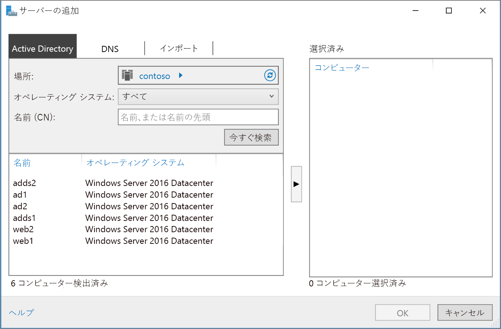

# <a name="extend-active-directory-domain-services-ad-ds-to-azure"></a>Active Directory Domain Services (AD DS) を Azure に拡張する

この参照アーキテクチャでは、Active Directory 環境を Azure に拡張し、Active Directory Domain Services (AD DS) を使用して分散認証サービスを提供する方法を示します。 [**こちらのソリューションをデプロイしてください**。](#deploy-the-solution)

[![0]][0] 

"*このアーキテクチャの [Visio ファイル][visio-download]をダウンロードします。*"

AD DS は、ユーザー、コンピューター、アプリケーション、またはセキュリティ ドメインに含まれるその他の ID の認証に使用します。 オンプレミスでホストできますが、アプリケーションがオンプレミスと Azure で部分的にホストされる場合は、Azure でこの機能をレプリケートする方が効率的です。 これにより、クラウドからオンプレミスで実行されている AD DS に返される認証要求とローカルの承認要求の送信が原因の待機時間を削減できます。 

このアーキテクチャは、オンプレミス ネットワークと Azure 仮想ネットワークが VPN または ExpressRoute によって接続されている場合によく使用されます。 また、このアーキテクチャは、双方向レプリケーションをサポートします。つまり、オンプレミスまたはクラウドで変更を行うことができ、両方のソースの一貫性が確保されます。 このアーキテクチャの一般的な用途には、オンプレミスと Azure 間で機能が配布されるハイブリッド アプリケーション、および Active Directory を使用して認証を実行するアプリケーションとサービスがあります。

その他の考慮事項については、「[オンプレミスの Active Directory を Azure と統合するためのソリューションの選択][considerations]」をご覧ください。 

## <a name="architecture"></a>アーキテクチャ 

このアーキテクチャは、「[DMZ between Azure and the Internet][implementing-a-secure-hybrid-network-architecture-with-internet-access]」(Azure とインターネット間の DMZ) に示すアーキテクチャを拡張します。 アーキテクチャに含まれるコンポーネントを次に示します。

* **オンプレミス ネットワーク**。 オンプレミス ネットワークには、オンプレミスにあるコンポーネントの認証と承認を実行できるローカルの Active Directory サーバーが含まれています。
* **Active Directory サーバー**。 クラウドで VM として実行されているディレクトリ サービス (AD DS) を実装するドメイン コントローラーです。 このようなサーバーは、Azure 仮想ネットワークで実行されるコンポーネントの認証を提供できます。
* **Active Directory サブネット**。 AD DS サーバーは、個別のサブネットでホストされます。 ネットワーク セキュリティ グループ (NSG) ルールによって AD DS サーバーが保護され、予期しないソースからのトラフィックに対するファイアウォールが提供されます。
* **Azure ゲートウェイと Active Directory 同期**。 Azure ゲートウェイによって、オンプレミス ネットワークと Azure VNet の間に接続が提供されます。 [VPN 接続][azure-vpn-gateway]または [Azure ExpressRoute][azure-expressroute] を使用できます。 クラウドおよびオンプレミスの Active Directory サーバー間のすべての同期要求はゲートウェイを経由します。 Azure に渡すオンプレミスのトラフィックのルーティングは、ユーザー定義ルート (UDR) によって処理されます。 Active Directory サーバーとの間のトラフィックは、このシナリオで使用するネットワーク仮想アプライアンス (NVA) を経由しません。

UDR と NVA の設定について詳しくは、「[Implementing a secure hybrid network architecture in Azure][implementing-a-secure-hybrid-network-architecture]」(セキュリティ保護されたハイブリッド ネットワーク アーキテクチャを Azure に実装する) をご覧ください。 

## <a name="recommendations"></a>Recommendations

ほとんどのシナリオには、次の推奨事項が適用されます。 これらの推奨事項には、優先される特定の要件がない限り、従ってください。 

### <a name="vm-recommendations"></a>VM の推奨事項

認証要求に必要なボリュームに基づいて、[VM サイズ][vm-windows-sizes]の要件を決定します。 AD DS をオンプレミスでホストしているコンピューターの仕様を始点として使用し、それに合わせて Azure VM サイズを指定します。 デプロイ後は、使用率を監視し、VM における実際の負荷に基づいてスケールアップまたはスケールダウンします。 AD DS ドメイン コントローラーのサイジングついて詳しくは、「[Capacity Planning for Active Directory Domain Services][capacity-planning-for-adds]」(Active Directory Domain Services のキャパシティ プランニング) をご覧ください。

Active Directory 用の データベース、ログ、および SYSVOL を格納するための個別の仮想データ ディスクを作成します。 オペレーティング システムと同じディスクにこれらの項目を格納しないでください。 既定では、VM に接続されたデータ ディスクにはライト スルー キャッシュが使用されています。 ただし、このキャッシュ形式は AD DS の要件と矛盾する可能性があります。 そのため、データ ディスクの *[ホスト キャッシュ設定]* を *[なし]* に設定します。 詳しくは、「[Windows Server AD DS データベースと SYSVOL の配置][adds-data-disks]」をご覧ください。

ドメイン コントローラーとして、AD DS を実行する VM を少なくとも 2 つデプロイし、[可用性セット][availability-set]に追加します。

### <a name="networking-recommendations"></a>ネットワークの推奨事項

ドメイン ネーム サービス (DNS) の完全なサポートを実現するには、静的なプライベート IP アドレスを使用して各 AD DS サーバの VM ネットワーク インターフェイス (NIC) を構成します。 詳しくは、「[Azure Portal を使用して仮想マシンのプライベート IP アドレスを構成する][set-a-static-ip-address]」をご覧ください。

> [!NOTE]
> パブリック IP アドレスを使用して AD DS の VM NIC を構成しないでください。 詳しくは、「[セキュリティに関する考慮事項][security-considerations]」をご覧ください。
> 
> 

Active Directory サブネット NSG には、オンプレミスからの受信トラフィックを許可するルールが必要です。 AD DS で使用されるポートについて詳しくは、「[Active Directory and Active Directory Domain Services Port Requirements][ad-ds-ports]」(Active Directory と Active Directory Domain Services のポート要件) をご覧ください。 また、UDR テーブルは、このアーキテクチャで使用される NVA を使用して AD DS トラフィックをルーティングしません。 

### <a name="active-directory-site"></a>Active Directory サイト

AD DS では、サイトは物理的な場所、ネットワーク、またはデバイスの集合を表します。 AD DS サイトは、互いに近くにあり、高速ネットワークによって接続される AD DS オブジェクトをグループ化することによって AD DS データベース レプリケーションを管理するために使用します。 AD DS には、サイト間で AD DS データベースをレプリケートするための最適な戦略を選択するロジックが含まれます。

アプリケーション用に定義されたサブネットを含む AD DS サイトを Azure で作成することをお勧めします。 続いて、オンプレミスの AD DS サイト間のサイト リンクを構成します。AD DS は最も効率的なデータベース レプリケーションを自動的に実行します。 このデータベース レプリケーションには、初期構成以外の構成が多少必要です。

### <a name="active-directory-operations-masters"></a>Active Directory 操作マスター

操作マスターの役割は、レプリケートされた AD DS データベースのインスタンス間の整合性チェックをサポートする AD DS ドメイン コントローラーに割り当てることができます。 操作マスターの役割は 5 つあります。スキーマ マスター、ドメイン名前付けマスター、相対識別子マスター、プライマリ ドメイン コントローラー マスター エミュレーター、インフラストラクチャ マスターです。 これらの役割について詳しくは、「[What are Operations Masters?][ad-ds-operations-masters]」(操作マスターとは) をご覧ください。

Azure にデプロイされたドメイン コントローラーには操作マスターの役割を割り当てないことを推奨します。

### <a name="monitoring"></a>監視

ドメイン コントローラー VM のリソースおよび AD DS を監視し、問題を迅速に修正するためのプランを作成します。 詳しくは、「[Monitoring Active Directory][monitoring_ad]」(Active Directory の監視) をご覧ください。 [Microsoft Systems Center][microsoft_systems_center] などのツールを監視サーバーにインストールして (アーキテクチャの図を参照)、これらのタスクを実行することもできます。  

## <a name="scalability-considerations"></a>スケーラビリティに関する考慮事項

AD DS は、拡張性を確保するために設計されています。 要求を AD DS ドメイン コントローラーに送信するようにロード バランサーやトラフィック コントローラーを構成する必要はありません。 拡張性に関する唯一の考慮事項は、AD DS を実行する、ネットワーク負荷の要件に対応したサイズの VM を構成し、VM 上の負荷を監視し、必要に応じてスケールアップまたはスケールダウンすることです。

## <a name="availability-considerations"></a>可用性に関する考慮事項

AD DS を実行する VM をデプロイして[可用性セット][availability-set]を作成します。 また、少なくとも 1 つのサーバー (要件に応じて、可能であればそれ以上の数のサーバー) に[スタンバイ操作マスター][standby-operations-masters]の役割を割り当てることを検討します。 スタンバイ操作マスターは、フェールオーバー時にプライマリ操作マスター サーバーの代わりに使用可能な操作マスターのアクティブ コピーです。

## <a name="manageability-considerations"></a>管理容易性に関する考慮事項

AD DS の定期的なバックアップを実行します。 定期的なバックアップの代わりに、ドメイン コントローラーの VHD ファイルを単にコピーしないでください。これは、VHD 上の AD DS データベース ファイルをコピーすると、ファイルの状態に不整合が生じる可能性があり、データベースを再起動できなくなるためです。

Azure Portal を使用してドメイン コントローラー VM をシャットダウンしないでください。 代わりに、ゲスト オペレーティング システムをシャットダウンして再起動します。 Portal を使用してシャットダウンすると、VM の割り当てが解除され、Active Directory リポジトリの `VM-GenerationID` と `invocationID` の両方がリセットされます。 これにより、AD DS 相対識別子 (RID) プールが破棄され、SYSVOL が権限なしとしてマークされます。また、ドメイン コントローラーの再構成が必要になる場合があります。

## <a name="security-considerations"></a>セキュリティに関する考慮事項

AD DS サーバーは認証サービスを提供するため、攻撃の最適なターゲットとなります。 サーバーを保護するには、ファイアウォールとして機能する NSG を使用する個別のサブネットに AD DS サーバーを配置して、直接インターネットに接続しないようにします。 認証、承認、サーバーの同期に必要なポートを除く、AD DS サーバー上のポートをすべて閉じてください。 詳しくは、「[Active Directory and Active Directory Domain Services Port Requirements][ad-ds-ports]」(Active Directory と Active Directory Domain Services のポート要件) をご覧ください。

「[Implementing a secure hybrid network architecture with Internet access in Azure][implementing-a-secure-hybrid-network-architecture-with-internet-access]」(インターネットへのアクセスが可能なセキュリティ保護されたハイブリッド ネットワーク アーキテクチャを Azure に実装する) に示すように、サブネットと NVA のペアを使用して、サーバーの周囲に追加のセキュリティ境界を実装することを検討してください。

BitLocker または Azure Disk Encryption を使用して、AD DS データベースをホストするディスクを暗号化します。

## <a name="deploy-the-solution"></a>ソリューションのデプロイ方法

このアーキテクチャのデプロイについては、[GitHub][github] を参照してください。 デプロイ全体を完了するには最大 2 時間かかる場合があることに注意してください。これには、VPN ゲートウェイの作成、AD DS を構成するスクリプトの実行などの処理が含まれます。

### <a name="prerequisites"></a>前提条件

1. [参照アーキテクチャ][github] GitHub リポジトリに ZIP ファイルを複製、フォーク、またはダウンロードします。

2. [Azure CLI 2.0][azure-cli-2] をインストールします。

3. [Azure の構成要素][azbb] npm パッケージをインストールします。

4. コマンド プロンプト、bash プロンプト、または PowerShell プロンプトから、以下のコマンドを使用して Azure アカウントにログインします。

   ```bash
   az login
   ```

### <a name="deploy-the-simulated-on-premises-datacenter"></a>シミュレートされたオンプレミスのデータセンターをデプロイする

1. GitHub リポジトリの `identity/adds-extend-domain` フォルダーに移動します。

2. `onprem.json` ファイルを開きます。 `adminPassword` と `Password` のインスタンスを検索し、パスワードの値を追加します。

3. 次のコマンドを実行し、デプロイが完了するまで待ちます。

    ```bash
    azbb -s <subscription_id> -g <resource group> -l <location> -p onprem.json --deploy
    ```

### <a name="deploy-the-azure-vnet"></a>Azure VNet をデプロイする

1. `azure.json` ファイルを開きます。  `adminPassword` と `Password` のインスタンスを検索し、パスワードの値を追加します。 

2. 同じファイルで `sharedKey` のインスタンスを検索し、VPN 接続の共有キーを入力します。 

    ```bash
    "sharedKey": "",
    ```

3. 次のコマンドを実行し、デプロイが完了するまで待ちます。

    ```bash
    azbb -s <subscription_id> -g <resource group> -l <location> -p onoprem.json --deploy
    ```

   オンプレミスの VNet と同じリソース グループにデプロイします。

### <a name="test-connectivity-with-the-azure-vnet"></a>Azure VNet との接続をテストする

デプロイが完了したら、シミュレートされたオンプレミスの環境から Azure VNet への接続をテストできます。

1. Azure Portal を使用して、作成したリソース グループに移動します。

2. `ra-onpremise-mgmt-vm1` という名前の VM を見つけます。

3. `Connect` をクリックして、VM に対するリモート デスクトップ セッションを開きます。 ユーザー名は `contoso\testuser` で、パスワードは、`onprem.json` パラメーター ファイルで指定したものを使用します。

4. リモート デスクトップ セッション内から、10.0.4.4 への別のリモート デスクトップ セッションを開きます。これは、`adds-vm1` という名前の VM の IP アドレスです。 ユーザー名は `contoso\testuser` で、パスワードは、`azure.json` パラメーター ファイルで指定したものを使用します。

5. `adds-vm1` のリモート デスクトップ セッション内から、**サーバー マネージャー**に移動し、**[Add other servers to manage]\(管理する他のサーバーを追加する\)** に移動します。 

6. **[Active Directory]** タブで、**[今すぐ検索]** をクリックします。 AD、AD DS、および Web VM の一覧が表示されます。

   

## <a name="next-steps"></a>次の手順

* Azure で [AD DS リソース フォレストを作成する][adds-resource-forest]ためのベスト プラクティスを学習します。
* Azure で [Active Directory フェデレーション サービス (AD FS) インフラストラクチャを作成する][adfs]ためのベスト プラクティスを学習します。

<!-- links -->

[adds-resource-forest]: adds-forest.md
[adfs]: adfs.md
[azure-cli-2]: /azure/install-azure-cli
[azbb]: https://github.com/mspnp/template-building-blocks/wiki/Install-Azure-Building-Blocks
[implementing-a-secure-hybrid-network-architecture]: ../dmz/secure-vnet-hybrid.md
[implementing-a-secure-hybrid-network-architecture-with-internet-access]: ../dmz/secure-vnet-dmz.md

[adds-data-disks]: https://msdn.microsoft.com/library/azure/jj156090.aspx#BKMK_PlaceDB
[ad-ds-operations-masters]: https://technet.microsoft.com/library/cc779716(v=ws.10).aspx
[ad-ds-ports]: https://technet.microsoft.com/library/dd772723(v=ws.11).aspx
[availability-set]: /azure/virtual-machines/virtual-machines-windows-create-availability-set
[azure-expressroute]: /azure/expressroute/expressroute-introduction
[azure-vpn-gateway]: /azure/vpn-gateway/vpn-gateway-about-vpngateways
[capacity-planning-for-adds]: http://social.technet.microsoft.com/wiki/contents/articles/14355.capacity-planning-for-active-directory-domain-services.aspx
[considerations]: ./considerations.md
[GitHub]: https://github.com/mspnp/reference-architectures/tree/master/identity/adds-extend-domain
[microsoft_systems_center]: https://www.microsoft.com/server-cloud/products/system-center-2016/
[monitoring_ad]: https://msdn.microsoft.com/library/bb727046.aspx
[security-considerations]: #security-considerations
[set-a-static-ip-address]: /azure/virtual-network/virtual-networks-static-private-ip-arm-pportal
[standby-operations-masters]: https://technet.microsoft.com/library/cc794737(v=ws.10).aspx
[visio-download]: https://archcenter.blob.core.windows.net/cdn/identity-architectures.vsdx
[vm-windows-sizes]: /azure/virtual-machines/virtual-machines-windows-sizes

[0]: ./images/adds-extend-domain.png "Active Directory を使用するセキュリティ保護されたハイブリッド ネットワーク アーキテクチャ"
