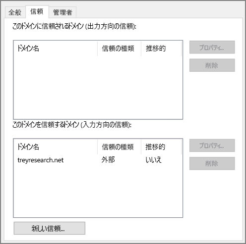

# <a name="create-an-active-directory-domain-services-ad-ds-resource-forest-in-azure"></a>Azure での Active Directory Domain Services (AD DS) リソース フォレストの作成

この参照アーキテクチャは、オンプレミスの AD フォレストでドメインから信頼される別の Active Directory ドメインを Azure に作成する方法を示しています。 [**こちらのソリューションをデプロイしてください**。](#deploy-the-solution)

[![0]][0] 

"*このアーキテクチャの [Visio ファイル][visio-download]をダウンロードします。*"

Active Directory Domain Services (AD DS) は、階層構造に ID 情報を格納します。 階層構造の最上位ノードはフォレストと呼ばれます。 1 つのフォレストには複数のドメインが含まれ、ドメインには他の種類のオブジェクトが含まれています。 この参照アーキテクチャは、オンプレミス ドメインとの間に一方向の送信の信頼関係がある AD DS を Azure に作成します。 Azure のフォレストには、オンプレミスに存在しないドメインが含まれています。 信頼関係があるため、オンプレミス ドメインに対して行われたログオンは、別の Azure ドメイン内のリソースにアクセスする場合にも信頼できます。 

このアーキテクチャの一般的な使用例として、クラウドに保持するオブジェクトと ID のセキュリティの分離を維持する場合や、個々のドメインをオンプレミスからクラウドに移行する場合があります。 

その他の考慮事項については、「[オンプレミスの Active Directory を Azure と統合するためのソリューションの選択][considerations]」をご覧ください。 

## <a name="architecture"></a>アーキテクチャ

このアーキテクチャには次のコンポーネントがあります。

* **オンプレミス ネットワーク**。 オンプレミス ネットワークには、独自の Active Directory フォレストとドメインが含まれています。
* **Active Directory サーバー**。 クラウドで VM として実行されているドメイン サービスを実装するドメイン コントローラーです。 これらのサーバーは、1 つ以上のドメインを含むフォレストをオンプレミスとは別にホストします。
* **一方向の信頼**。 次の図は、Azure のドメインからオンプレミス ドメインへの一方向の信頼の例を示します。 この関係があると、オンプレミス ユーザーは Azure のドメイン内のリソースにアクセスできますが、逆方向にはアクセスできません。 クラウド ユーザーがオンプレミス リソースへのアクセスも必要な場合は、両方向の信頼を作成することができます。
* **Active Directory サブネット**。 AD DS サーバーは、個別のサブネットでホストされます。 ネットワーク セキュリティ グループ (NSG) ルールによって AD DS サーバーが保護され、予期しないソースからのトラフィックに対するファイアウォールが提供されます。
* **Azure ゲートウェイ**。 Azure ゲートウェイによって、オンプレミス ネットワークと Azure VNet の間に接続が提供されます。 [VPN 接続][azure-vpn-gateway]または [Azure ExpressRoute][azure-expressroute] を使用できます。 詳細については、「[Implementing a secure hybrid network architecture in Azure][implementing-a-secure-hybrid-network-architecture]」(Azure における安全なハイブリッド ネットワーク アーキテクチャの実装) を参照してください。

## <a name="recommendations"></a>Recommendations

Azure に Active Directory を実装する場合の具体的な推奨事項については、以下の記事をご覧ください。

- [Active Directory Domain Services (AD DS) を Azure に拡張する][adds-extend-domain]。 
- [Azure Virtual Machines での Windows Server Active Directory の展開ガイドライン][ad-azure-guidelines]

### <a name="trust"></a>[Trust (信頼)]

オンプレミス ドメインは、クラウドのドメインとは別のフォレストに含まれています。 クラウドでオンプレミス ユーザーの認証を有効にするには、Azure のドメインがオンプレミス フォレストのログオン ドメインを信頼する必要があります。 同様に、クラウドが外部ユーザーに対してログオン ドメインを提供している場合は、必要に応じてオンプレミス フォレストがクラウド ドメインを信頼します。

フォレスト レベルで信頼を確立するには、[フォレストの信頼を作成][creating-forest-trusts]するか、[外部信頼を作成][creating-external-trusts]してドメイン レベルで信頼を確立します。 フォレスト レベルの信頼で、2 つのフォレスト内のすべてのドメイン間にリレーションシップが作成されます。 外部ドメイン レベルの信頼では、2 つの指定したドメイン間にのみリレーションシップが作成されます。 外部ドメイン レベルの信頼は、異なるフォレストにあるドメイン間にのみ作成することをお勧めします。

一方向または双方向の信頼を作成することができます。

* 一方向の信頼では、一方のドメインまたはフォレスト (*着信*ドメインまたはフォレストと呼ばれます) のユーザーが、もう一方 (*送信*ドメインまたはフォレスト) に保持されているリソースにアクセスできます。
* 双方向の信頼では、いずれのドメインまたはフォレストのユーザーも、もう一方に保持されているリソースにアクセスできます。

次の表は、いくつの単純なシナリオについて信頼の構成をまとめた一覧です。

| シナリオ | オンプレミスの信頼 | クラウドの信頼 |
| --- | --- | --- |
| オンプレミス ユーザーは、クラウド内のリソースにアクセスする必要がありますが、反対方向のアクセスは不要です。 |一方向、着信 |一方向、送信 |
| クラウドのユーザーは、オンプレミスにあるリソースにアクセスする必要がありますが、反対方向のアクセスは不要です。 |一方向、送信 |一方向、着信 |
| クラウドとオンプレミスの両方のユーザーが、クラウドとオンプレミスに保持されているリソースにアクセスする必要があります。 |双方向、着信と送信 |双方向、着信と送信 |

## <a name="scalability-considerations"></a>スケーラビリティに関する考慮事項

同じドメインに属するドメイン コントローラーの場合、Active Directory は自動的にスケーリングします。 要求は、ドメイン内のすべてのコントローラーに分散されます。 別のドメイン コントローラーを追加することもできます。追加したドメイン コントローラーはドメインと自動的に同期されます。 トラフィックをドメイン内のコントローラーに送信するために別のロード バランサーは構成しないでください。 すべてのドメイン コントローラーに、ドメイン データベースを処理できる十分なメモリとストレージ リソースを確保します。 すべてのドメイン コントローラーの VM を同じサイズにします。

## <a name="availability-considerations"></a>可用性に関する考慮事項

各ドメインに少なくとも 2 つのドメイン コントローラーをプロビジョニングします。 こうすることで、サーバー間の自動レプリケーションが可能になります。 各ドメインを処理する Active Directory サーバーとして動作する VM に可用性セットを作成します。 この可用性セットに少なくとも 2 つのサーバーを配置します。

また、Flexible Single Master Operations (FSMO) ロールとして動作するサーバーへの接続が失敗した場合に備えて、各ドメインの 1 つ以上のサーバーを[スタンバイ操作マスター][standby-operations-masters]に指定することを検討します。

## <a name="manageability-considerations"></a>管理容易性に関する考慮事項

管理と監視の考慮事項については、[Active Directory の Azure への拡張][adds-extend-domain]に関するページを参照してください。 
 
その他の情報については、「[Monitoring Active Directory][monitoring_ad]」(Active Directory の監視) を参照してください。 [Microsoft Systems Center][microsoft_systems_center] などのツールを監視サーバーにインストールして、これらのタスクを実行することもできます。

## <a name="security-considerations"></a>セキュリティに関する考慮事項

フォレスト レベルの信頼は推移的です。 オンプレミスのフォレストとクラウドのフォレスト間にフォレスト レベルの信頼を確立する場合、この信頼は、いずれかのフォレストで作成された他の新しいドメインにも拡張されます。 セキュリティ上の目的で分離のために複数のドメインを使用する場合は、ドメイン レベルでのみ信頼を作成することを検討してください。 ドメイン レベルの信頼は非推移的です。

Active Directory 固有のセキュリティの考慮事項については、[Active Directory の Azure への拡張][adds-extend-domain]に関するページのセキュリティに関する考慮事項を参照してください。

## <a name="deploy-the-solution"></a>ソリューションのデプロイ方法

このアーキテクチャのデプロイについては、[GitHub][github] を参照してください。 デプロイ全体を完了するには最大 2 時間かかる場合があることに注意してください。これには、VPN ゲートウェイの作成、AD DS を構成するスクリプトの実行などの処理が含まれます。

### <a name="prerequisites"></a>前提条件

[!INCLUDE [ref-arch-prerequisites.md](../../../includes/ref-arch-prerequisites.md)]

### <a name="deploy-the-simulated-on-premises-datacenter"></a>シミュレートされたオンプレミスのデータセンターをデプロイする

1. GitHub リポジトリの `identity/adds-forest` フォルダーに移動します。

2. `onprem.json` ファイルを開きます。 `adminPassword` と `Password` のインスタンスを検索し、パスワードの値を追加します。

3. 次のコマンドを実行し、デプロイが完了するまで待ちます。

    ```bash
    azbb -s <subscription_id> -g <resource group> -l <location> -p onprem.json --deploy
    ```

### <a name="deploy-the-azure-vnet"></a>Azure VNet をデプロイする

1. `azure.json` ファイルを開きます。 `adminPassword` と `Password` のインスタンスを検索し、パスワードの値を追加します。

2. 同じファイルで `sharedKey` のインスタンスを検索し、VPN 接続の共有キーを入力します。 

    ```bash
    "sharedKey": "",
    ```

3. 次のコマンドを実行し、デプロイが完了するまで待ちます。

    ```bash
    azbb -s <subscription_id> -g <resource group> -l <location> -p onoprem.json --deploy
    ```

   オンプレミスの VNet と同じリソース グループにデプロイします。


### <a name="test-the-ad-trust-relation"></a>AD の信頼関係をテストする

1. Azure Portal を使用して、作成したリソース グループに移動します。

2. Azure Portal を使用して、`ra-adt-mgmt-vm1` という名前の VM を見つけます。

2. `Connect` をクリックして、VM に対するリモート デスクトップ セッションを開きます。 ユーザー名は `contoso\testuser` で、パスワードは、`onprem.json` パラメーター ファイルで指定したものを使用します。

3. リモート デスクトップ セッション内から、192.168.0.4 への別のリモート デスクトップ セッションを開きます。これは、`ra-adtrust-onpremise-ad-vm1` という名前の VM の IP アドレスです。 ユーザー名は `contoso\testuser` で、パスワードは、`azure.json` パラメーター ファイルで指定したものを使用します。

4. `ra-adtrust-onpremise-ad-vm1` のリモート デスクトップ セッション内から、**サーバー マネージャー**に移動し、**[ツール]** > **[Active Directory ドメインと信頼関係]** をクリックします。 

5. 左側のウィンドウで contoso.com を右クリックし、**[プロパティ]** を選択します。

6. **[信頼]** タブをクリックします。入力方向の信頼として treyresearch.net が表示されます。




## <a name="next-steps"></a>次の手順

* [オンプレミスの AD DS ドメインを Azure に拡張する][adds-extend-domain]場合のベスト プラクティスを学習します。
* Azure で [AD DS インフラストラクチャを作成する][adfs]場合のベスト プラクティスを学習します。

<!-- links -->
[adds-extend-domain]: adds-extend-domain.md
[adfs]: adfs.md
[azure-cli-2]: /azure/install-azure-cli
[azbb]: https://github.com/mspnp/template-building-blocks/wiki/Install-Azure-Building-Blocks

[implementing-a-secure-hybrid-network-architecture]: ../dmz/secure-vnet-hybrid.md
[implementing-a-secure-hybrid-network-architecture-with-internet-access]: ../dmz/secure-vnet-dmz.md

[running-VMs-for-an-N-tier-architecture-on-Azure]: ../virtual-machines-windows/n-tier.md

[ad-azure-guidelines]: https://msdn.microsoft.com/library/azure/jj156090.aspx
[azure-expressroute]: https://azure.microsoft.com/documentation/articles/expressroute-introduction/
[azure-vpn-gateway]: https://azure.microsoft.com/documentation/articles/vpn-gateway-about-vpngateways/
[considerations]: ./considerations.md
[creating-external-trusts]: https://technet.microsoft.com/library/cc816837(v=ws.10).aspx
[creating-forest-trusts]: https://technet.microsoft.com/library/cc816810(v=ws.10).aspx
[github]: https://github.com/mspnp/reference-architectures/tree/master/identity/adds-forest
[incoming-trust]: https://raw.githubusercontent.com/mspnp/reference-architectures/master/identity/adds-forest/extensions/incoming-trust.ps1
[microsoft_systems_center]: https://www.microsoft.com/server-cloud/products/system-center-2016/
[monitoring_ad]: https://msdn.microsoft.com/library/bb727046.aspx
[resource-manager-overview]: /azure/azure-resource-manager/resource-group-overview
[solution-script]: https://raw.githubusercontent.com/mspnp/reference-architectures/master/identity/adds-forest/Deploy-ReferenceArchitecture.ps1
[standby-operations-masters]: https://technet.microsoft.com/library/cc794737(v=ws.10).aspx
[outgoing-trust]: https://raw.githubusercontent.com/mspnp/reference-architectures/master/identity/adds-forest/extensions/outgoing-trust.ps1
[verify-a-trust]: https://technet.microsoft.com/library/cc753821.aspx
[visio-download]: https://archcenter.blob.core.windows.net/cdn/identity-architectures.vsdx
[0]: ./images/adds-forest.png "別の Active Directory ドメインを使用するセキュリティ保護されたハイブリッド ネットワーク アーキテクチャ"