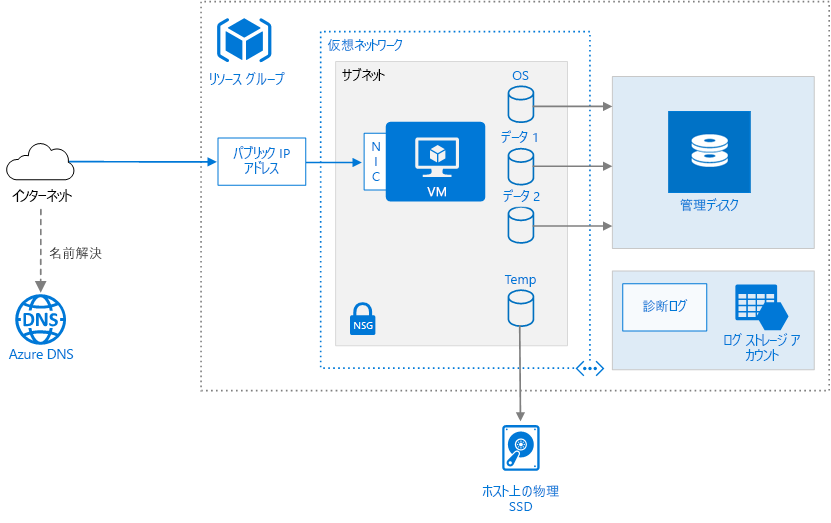

# <a name="run-a-linux-virtual-machine-on-azure"></a>Azure で Linux 仮想マシンを実行する

Azure での仮想マシン (VM) のプロビジョニングには、VM 自体の他に、ネットワーク リソースやストレージ リソースなどの追加コンポーネントがいくつか必要です。 この記事では、Azure 上で Linux VM を実行するためのベスト プラクティスを示します。



## <a name="resource-group"></a>リソース グループ

[リソース グループ][resource-manager-overview]は、関連する Azure リソースを保持する論理コンテナーです。 一般には、リソースの有効期間や管理者に基づいて、リソースをグループ化します。

同じライフサイクルを共有する密接に関連付けられたリソースを同じ[リソース グループ][resource-manager-overview]に配置します。 リソース グループを使用すると、リソースをグループとしてデプロイおよび監視したり、リソース グループ別に課金コストを追跡したりできます。 セットとしてリソースを削除することもできます。これはテスト デプロイの場合に便利です。 特定のリソースの検索やその役割の理解を簡略化するために、意味のあるリソース名を割り当ててください。 詳細については、「[Azure リソースの推奨される名前付け規則][naming-conventions]」をご覧ください。

## <a name="virtual-machine"></a>仮想マシン

VM は、発行されたイメージの一覧や、Azure BLOB ストレージにアップロードされたカスタム管理されたイメージまたは仮想ハード ディスク (VHD) ファイルからプロビジョニングできます。  Azure は、CentOS、Debian、Red Hat Enterprise、Ubuntu、FreeBSD など、現在普及しているさまざまな Linux ディストリビューションに対応します。 詳細については、「[Azure と Linux][azure-linux]」を参照してください。

Azure は、さまざまな仮想マシン サイズを提供します。 詳細については、[Azure の仮想マシンのサイズ][virtual-machine-sizes]に関するページをご覧ください。 既存のワークロードを Azure に移動する場合は、オンプレミスのサーバーに最も適合性が高い VM サイズから開始します。 次に、CPU、メモリ、およびディスクの 1 秒あたりの入出力操作 (IOPS) について、実際のワークロードのパフォーマンスを測定し、必要に応じてサイズを調整します。 

一般的に、内部ユーザーや顧客に最も近い Azure リージョンを選択します。 すべてのリージョンですべての VM サイズを使用できるわけではありません。 詳細については、「[リージョン別のサービス][services-by-region]」をご覧ください。 特定のリージョンで使用できる VM サイズの一覧を表示するには、Azure コマンド ライン インターフェイス (CLI) から次のコマンドを実行します。

```azurecli
az vm list-sizes --location <location>
```

発行された VM イメージの選択については、[Linux VM イメージの検索][select-vm-image]に関するページを参照してください。

## <a name="disks"></a>ディスク

最適なディスク I/O パフォーマンスを得るには、データがソリッド ステート ドライブ (SSD) に格納される [Premium Storage][premium-storage] をお勧めします。 コストは、プロビジョニングされたディスクの容量に基づきます。 また、IOPS とスループット (つまり、データ転送速度) もディスク サイズによって異なるため、ディスクをプロビジョニングする場合は、3 つの要素 (容量、IOPS、スループット) すべてを考慮してください。

[Managed Disks][managed-disks] を使用することもお勧めします。 マネージド ディスクでは、ストレージが自動的に処理されることでディスク管理が簡素化されます。 マネージド ディスクでは、ストレージ アカウントは必要ありません。 ディスクのサイズと種類を指定するだけで、可用性の高いリソースとしてデプロイされます

OS ディスクは [Azure Storage][azure-storage] に格納された VHD であるため、ホスト マシンが停止している場合でも維持されます。  Linux VM の場合、OS ディスクは `/dev/sda1` です。 また、[データ ディスク][data-disk]を 1 つ以上作成することもお勧めします。データ ディスクは、アプリケーション データ用に使用される永続的な VHD です。

作成した VHD は、フォーマットされていません。 その VM にログインしてディスクをフォーマットしてください。 Linux のシェルでは、データ ディスクは `/dev/sdc`、`/dev/sdd` などのように表示されます。 `lsblk` を実行すると、ディスクなどのブロック デバイスの一覧を表示できます。 データ ディスクを使用するには、パーティションとファイル システムを作成し、ディスクをマウントします。 例: 

```bash
# Create a partition.
sudo fdisk /dev/sdc     # Enter 'n' to partition, 'w' to write the change.

# Create a file system.
sudo mkfs -t ext3 /dev/sdc1

# Mount the drive.
sudo mkdir /data1
sudo mount /dev/sdc1 /data1
```

データ ディスクを追加すると、ディスクに論理ユニット番号 (LUN) の ID が割り当てられます。 LUN ID は必要に応じて指定できます。たとえば、ディスクを交換する際に同じ LUN ID を保持したい場合や、特定の LUN ID を検索するアプリケーションがある場合などに指定します。 ただし、ディスクごとに一意な LUN ID である必要があります。

Premium Storage アカウントで使用する VM のディスクは SSD なので、I/O スケジューラを変更して、SSD のパフォーマンスを最適化することができます。 一般的な推奨事項は、SSD に対して NOOP スケジューラを使用することですが、[iostat] などのツールを使用してワークロードのディスク I/O パフォーマンスを監視する必要があります。

VM は一時ディスクを使用して作成されます。 このディスクは、ホスト コンピューターの物理ドライブ上に格納されます。 Azure Storage には保存され*ない*ため、再起動やその他の VM ライフサイクル イベント中に削除される可能性があります。 ページ ファイルやスワップ ファイルなどの一時的なデータにのみ、このディスクを使用してください。 Linux VM の場合、一時ディスクは `/dev/sdb1` であり、`/mnt/resource` または `/mnt` でマウントされます。

## <a name="network"></a>ネットワーク

ネットワーク コンポーネントには、次のリソースが含まれます。

- **Virtual network**。 すべての VM が、複数のサブネットにセグメント化できる仮想ネットワーク内にデプロイされます。

- **ネットワーク インターフェイス (NIC)**。 NIC を使用すると、VM は仮想ネットワークと通信できます。 VM 用に複数の NIC が必要な場合は、[VM サイズ][vm-size-tables]ごとに NIC の最大数が定義されることに注意してください。

- **パブリック IP アドレス**。 パブリック IP アドレスは、リモート デスクトップ (RDP) 経由などで VM &mdash; と通信するために必要です。 パブリック IP アドレスは、動的でも静的でもかまいません。 既定では、動的アドレスになっています。

- 変化しない固定 IP アドレスが必要な場合 &mdash; (たとえば、DNS 'A' レコードを作成するか、またはセーフ リストに IP アドレスを追加する必要がある場合) は、[静的 IP アドレス][static-ip]を予約します。
- IP アドレスの完全修飾ドメイン名 (FQDN) を作成することもできます。 これにより、その FQDN を参照する DNS で [CNAME レコード][cname-record]を登録できます。 詳細については、「[Azure Portal での完全修飾ドメイン名の作成][fqdn]」をご覧ください。

- **ネットワーク セキュリティ グループ (NSG)**。 [ネットワーク セキュリティ グループ][nsg]は、VM へのネットワーク トラフィックを許可または拒否するために使用されます。 NSG は、サブネットまたは個々の VM インスタンスと関連付けることができます。

すべての NSG に[既定の規則][nsg-default-rules] (すべての受信インターネット トラフィックをブロックする規則など) のセットが含まれています。 既定のルールを削除することはできませんが、他の規則でオーバーライドすることはできます。 インターネット トラフィックを有効にするには、特定のポート (HTTP のポート 80 など) への着信トラフィックを許可するルールを作成します。 SSH を有効にするには、TCP ポート 22 への受信トラフィックを許可する NSG 規則を追加します。

## <a name="operations"></a>操作

**SSH**。 Linux VM を作成する前に、2048 ビット RSA 公開/秘密キー ペアを生成します。 VM を作成する場合は、公開キー ファイルを使用します。 詳細については、[Azure 上の Linux または Mac における SSH の使用方法][ssh-linux]に関する記事を参照してください。

**診断** 基本的な正常性メトリック、診断インフラストラクチャ ログ、[ブート診断][boot-diagnostics]などの監視と診断を有効にします。 VM が起動不可能な状態になった場合は、起動エラーを診断するのにブート診断が役立ちます。 ログを格納するための Azure Storage アカウントを作成します。 診断ログには、標準的なローカル冗長ストレージ (LRS) アカウントがあれば十分です。 詳細については、「[監視と診断の有効化][enable-monitoring]」を参照してください。

**可用性**。 VM が[計画メンテナンス][planned-maintenance]または[計画外のダウンタイム][manage-vm-availability]の影響を受ける可能性があります。 [VM の再起動ログ][reboot-logs]を参照すると、VM の再起動が計画的なメンテナンスによるものかどうかを確認できます。 可用性を高めるには、複数の VM を[可用性セット](/azure/virtual-machines/linux/manage-availability#configure-multiple-virtual-machines-in-an-availability-set-for-redundancy)内にデプロイします。 この構成により、より高度な[サービス レベル アグリーメント (SLA)][vm-sla] が提供されます。

**バックアップ**。偶発的なデータ損失を防ぐには、geo 冗長ストレージに VM をバックアップする [Azure Backup](/azure/backup/) サービスを使用します。 Azure Backup では、アプリケーション整合性バックアップが提供されます。

**VM の停止**。 Azure では、"停止" 状態と "割り当て解除済み" 状態が区別されます。 VM が割り当て解除されたときではなく、VM が停止状態のときに課金されます。 Azure Portal の **[停止]** ボタンを使用すると、VM の割り当てが解除されます。 ログイン中に OS からシャットダウンした場合、VM は停止しますが割り当ては "**解除されない**" ため、引き続き課金されます。

**VM の削除**。 VM を削除しても VHD は削除されません。 つまり、データを失うことなく安全に VM を削除できます。 ただし、Storage に対して引き続き課金されます。 VHD を削除するには、[Blob Storage][blob-storage] からファイルを削除します。 誤って削除されないようにするために、[リソース ロック][resource-lock]を使用してリソース グループ全体をロックするか、または個別のリソース (VM など) をロックします。

## <a name="security-considerations"></a>セキュリティに関する考慮事項

[Azure Security Center][security-center] を使用すると、Azure リソースのセキュリティの状態を一元的に表示して把握できます。 Security Center は、潜在的なセキュリティ上の問題を監視し、デプロイのセキュリティの正常性を包括的に示します。 セキュリティ センターは、Azure サブスクリプションごとに構成されます。 [Azure サブスクリプションでの Security Center Standard の利用開始][security-center-get-started]に関するページの説明に従って、セキュリティ データの収集を有効にします。 データ収集を有効にすると、セキュリティ センターは、そのサブスクリプションに作成されているすべての VM を自動的にスキャンします。

**更新プログラムの管理**。 有効になっている場合、Security Center はセキュリティ更新プログラムや緊急更新プログラムが不足しているかどうかをチェックします。 VM で[グループ ポリシー設定][group-policy]を使用して、システムの自動更新を有効にします。

**マルウェア対策**。 有効な場合、セキュリティ センターは、マルウェア対策ソフトウェアがインストールされているかどうかを確認します。 セキュリティ センターを使用して、Azure Portal 内からマルウェア対策ソフトウェアをインストールすることもできます。

**アクセスの制御**。 [ロールベースのアクセス制御 (RBAC)][rbac] を使用して、Azure リソースへのアクセスを制御します。 RBAC を使用すると、DevOps チームのメンバーに承認の役割を割り当てることができます。 たとえば、閲覧者の役割では、Azure リソースを表示することはできますが、作成、削除、または管理することはできません。 一部のアクセス許可は、Azure リソースの種類に固有です。 たとえば、仮想マシンの共同作業者ロールは VM を再起動または割り当て解除したり、管理者パスワードをリセットしたり、新しい VM を作成したりできます。 このアーキテクチャで役立つ可能性のあるその他の[組み込みの RBAC ロール][rbac-roles]には、[DevTest Labs ユーザー][rbac-devtest]や[ネットワークの共同作業者][rbac-network]が含まれます。

> [!NOTE]
> RBAC では、VM にログインしているユーザーが実行できる操作は制限されません。 これらのアクセス許可は、ゲスト OS のアカウントの種類によって決まります。

**監査ログ**。 プロビジョニング操作や他の VM イベントを確認するには、[監査ログ][audit-logs]を使用します。

**データの暗号化**。 OS ディスクとデータ ディスクを暗号化する必要がある場合は、[Azure Disk Encryption][disk-encryption] を使用します。

## <a name="next-steps"></a>次の手順

- Linux VM をプロビジョニングするには、「[Azure CLI を使用した Linux VM の作成と管理](/azure/virtual-machines/linux/tutorial-manage-vm)」をご覧ください。
- Linux VM の完全な N 層アーキテクチャについては、「[Apache Cassandra を使用する Azure の Linux N 層アプリケーション](./n-tier-cassandra.md)」をご覧ください。

<!-- links -->
[audit-logs]: https://azure.microsoft.com/blog/analyze-azure-audit-logs-in-powerbi-more/
[azure-linux]: /azure/virtual-machines/virtual-machines-linux-azure-overview
[azure-storage]: /azure/storage/storage-introduction
[blob-storage]: /azure/storage/storage-introduction
[boot-diagnostics]: https://azure.microsoft.com/blog/boot-diagnostics-for-virtual-machines-v2/
[cname-record]: https://en.wikipedia.org/wiki/CNAME_record
[data-disk]: /azure/virtual-machines/virtual-machines-linux-about-disks-vhds
[disk-encryption]: /azure/security/azure-security-disk-encryption
[enable-monitoring]: /azure/monitoring-and-diagnostics/insights-how-to-use-diagnostics
[fqdn]: /azure/virtual-machines/virtual-machines-linux-portal-create-fqdn
[group-policy]: /windows-server/administration/windows-server-update-services/deploy/4-configure-group-policy-settings-for-automatic-updates
[iostat]: https://en.wikipedia.org/wiki/Iostat
[manage-vm-availability]: /azure/virtual-machines/virtual-machines-linux-manage-availability
[managed-disks]: /azure/storage/storage-managed-disks-overview
[naming-conventions]: ../../best-practices/naming-conventions.md
[nsg]: /azure/virtual-network/virtual-networks-nsg
[nsg-default-rules]: /azure/virtual-network/virtual-networks-nsg#default-rules
[planned-maintenance]: /azure/virtual-machines/virtual-machines-linux-planned-maintenance
[premium-storage]: /azure/virtual-machines/linux/premium-storage
[rbac]: /azure/active-directory/role-based-access-control-what-is
[rbac-roles]: /azure/active-directory/role-based-access-built-in-roles
[rbac-devtest]: /azure/active-directory/role-based-access-built-in-roles#devtest-labs-user
[rbac-network]: /azure/active-directory/role-based-access-built-in-roles#network-contributor
[reboot-logs]: https://azure.microsoft.com/blog/viewing-vm-reboot-logs/
[resource-lock]: /azure/resource-group-lock-resources
[resource-manager-overview]: /azure/azure-resource-manager/resource-group-overview
[security-center]: /azure/security-center/security-center-intro
[security-center-get-started]: /azure/security-center/security-center-get-started
[select-vm-image]: /azure/virtual-machines/virtual-machines-linux-cli-ps-findimage
[services-by-region]: https://azure.microsoft.com/regions/#services
[ssh-linux]: /azure/virtual-machines/virtual-machines-linux-mac-create-ssh-keys
[static-ip]: /azure/virtual-network/virtual-networks-reserved-public-ip
[virtual-machine-sizes]: /azure/virtual-machines/virtual-machines-linux-sizes
[visio-download]: https://archcenter.blob.core.windows.net/cdn/vm-reference-architectures.vsdx
[vm-size-tables]: /azure/virtual-machines/virtual-machines-linux-sizes
[vm-sla]: https://azure.microsoft.com/support/legal/sla/virtual-machines
