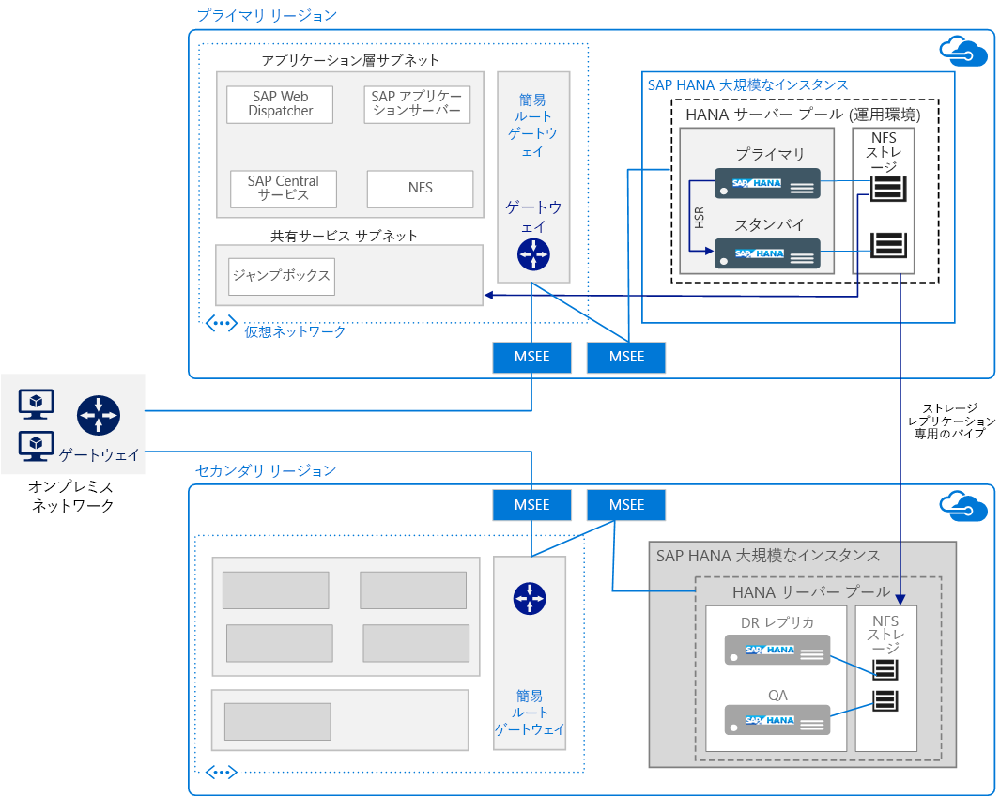

# SAP HANA on Azure Large Instances を実行する

この参照用アーキテクチャは、高可用性とディザスター リカバリー (DR) を備えた SAP HANA on Azure (Large Instances) を実行するための一連の実証済みプラクティスを示しています。 この機能は HANA Large Instances と呼ばれ、Azure リージョン内の物理サーバーに配置されます。

"*このアーキテクチャの [Visio ファイル][visio-download]をダウンロードします。*"

> [!NOTE]
> この参照用アーキテクチャをデプロイするには、SAP 製品と他の Microsoft 以外のテクノロジの適切なライセンスが必要です。

## アーキテクチャ

このアーキテクチャは、次のインフラストラクチャ コンポーネントで構成されます。

- **Virtual network**。 [Azure Virtual Network][vnet] サービスによって、Azure リソースが安全に相互接続されます。また、このサービスは、レイヤーごとに個別の[サブネット][subnet]に分割されます。 SAP アプリケーション レイヤーは Azure 仮想マシン (VM) にデプロイされ、L インスタンス上の HANA データベース レイヤーに接続されます。

- **仮想マシン**。 仮想マシンは、SAP アプリケーション レイヤーと共有サービス レイヤーで使用されます。 後者には、管理者が HANA Large Instances を設定し、他の仮想マシンへのアクセスを提供するときに使用する Jumpbox が含まれています。

- **HANA L インスタンス**。 SAP HANA Tailored Datacenter Integration (TDI) 標準を満たしていることが認定された[物理サーバー][physical]によって SAP HANA が実行されます。 このアーキテクチャでは、プライマリ コンピューティング ユニットとセカンダリ コンピューティング ユニットの 2 つの HANA Large Instances が使用されています。 データ レイヤーの高可用性は、HANA システム レプリケーション (HSR) によって確保されます。

- **高可用性ペア**。 HANA Large Instances ブレードのグループがひとまとまりで管理され、アプリケーションの冗長性と信頼性が実現します。

- **MSEE (Microsoft Enterprise Edge)**。 MSEE は、接続プロバイダーまたはネットワークのエッジからの ExpressRoute 回線経由の接続ポイントです。

- **ネットワーク インターフェイス カード (NIC)**。 通信を有効にするために、HANA L インスタンス サーバーには 4 つの仮想 NIC が既定で用意されています。 このアーキテクチャでは、最初の NIC はクライアント通信、2 つ目の NIC は HSR に必要なノード間接続、3 つ目の NIC は HANA L インスタンス ストレージ、4 つ目の NIC は高可用性クラスタリングで使用される iSCSI にそれぞれ必要です。

- **ネットワーク ファイル システム (NFS) ストレージ**。 [NFS][nfs] サーバーでは、セキュリティで保護されたデータ永続化を HANA L インスタンスに提供するネットワーク ファイル共有がサポートされます。

- **ExpressRoute**。 [ExpressRoute][expressroute] は、オンプレミス ネットワークと Azure 仮想ネットワークの間に、パブリック インターネットを経由しないプライベート接続を作成するための推奨 Azure ネットワーク サービスです。 Azure VM は、別の ExpressRoute 接続を使用して HANA Large Instances に接続されます。 Azure 仮想ネットワークと HANA Large Instances の間の ExpressRoute 接続は、Microsoft が提供する機能の一環として設定されます。

- **ゲートウェイ**。 ExpressRoute Gateway は、SAP アプリケーション レイヤーに使用される Azure 仮想ネットワークを、HANA L インスタンス ネットワークに接続するときに使用されます。 [High Performance または Ultra Performance][sku] SKU を使用してください。

- **ディザスター リカバリー (DR)**。 要求に応じて、ストレージ レプリケーションがサポートされ、プライマリから別のリージョンの [DR サイト][DR-site]にレプリケートされるように構成されます。

## Recommendations

要件は変わる場合があります。これらの推奨事項は原案として使用してください。

### HANA Large Instances のコンピューティング

[Large Instances][physical] は Intel EX E7 CPU アーキテクチャに基づいた物理サーバーで、L インスタンス スタンプ、つまり一連の特定のサーバーまたはブレードで構成されます。 1 つのコンピューティング ユニットが 1 つのサーバーまたはブレードに相当し、スタンプは、複数のサーバーまたはブレードで構成されます。 L インスタンス スタンプ内では、サーバーは共有されず、お客様 1 人の SAP HANA デプロイの実行専用になります。

さまざまな SKU を HANA Large Instances に使用でき、S/4HANA またはその他の SAP HANA ワークロードに対して、最大 20 TB の単一インスタンス (60 TB スケールアウト) のメモリがサポートされます。 [2 つのクラス][classes]のサーバーが提供されます。

- Type I クラス:S72、S72m、S144、S144m、S192、S192m

- Type II クラス:S384、S384m、S384xm、S576m、S768m、S960m

たとえば、S72 SKU は 768 GB の RAM、3 テラバイト (TB) のストレージ、2 つの Intel Xeon プロセッサ (E7-8890 v3) 36 コアを備えています。 アーキテクチャと設計のセッションで決めたサイズ要件を満たす SKU を選択してください。 サイズ設定が選んだ SKU に該当することを必ず確認してください。 機能とデプロイの要件は[種類によって異なります][type]。また、可用性は[リージョン][region]によって異なります。 ある SKU から、より大きな SKU にステップアップすることもできます。

Microsoft では L インスタンスのセットアップの確立をお手伝いしますが、オペレーティング システムの構成設定については、お客様の責任で検証する必要があります。 必ず最新の SAP Notes でご自身の Linux リリースを確認してください。

### Storage

ストレージ レイアウトは、SAP HANA 向け TDI の推奨事項に従って実装されます。 HANA Large Instances は、TDI 標準仕様に適合した固有のストレージ構成を備えています。 ただし、追加のストレージを 1 TB 単位で購入することができます。

高速復旧など、ミッション クリティカルな環境の要件に対応するために、直接接続ストレージではなく、NFS が使用されています。 HANA Large Instances 用の NFS ストレージ サーバーはマルチテナント環境でホストされます。この環境では、テナントが分離され、コンピューティング、ネットワーク、およびストレージ分離を使用してセキュリティで保護されています。

プライマリ サイトで高可用性をサポートするために、さまざまなストレージ レイアウトを使用します。 たとえば、複数ホストのスケールアウトでは、ストレージは共有されます。 HSR など、アプリケーション ベースのレプリケーションによって、高可用性を実現することもできます。 ただし、DR については、スナップショット ベースのストレージ レプリケーションが使用されます。

### ネットワーク

このアーキテクチャでは、仮想ネットワークと物理ネットワークの両方が使用されます。 仮想ネットワークは Azure IaaS に含まれており、[ExpressRoute][expressroute] 回線経由で個別の HANA Large Instances 物理ネットワークに接続されます。 Azure 仮想ネットワークのワークロードは、クロスプレミス  ゲートウェイによって、お客様のオンプレミス サイトに接続されます。

HANA Large Instances ネットワークは、セキュリティを確保するために相互に分離されています。 専用ストレージ レプリケーションを除いて、異なるリージョンにあるインスタンスが相互に通信することはできません。 ただし、HSR を使用するには、リージョン間の通信が必要です。 [IP ルーティング テーブル][ip]またはプロキシを使用すると、リージョン間 HSR が可能です。

あるリージョンの HANA Large Instances に接続されている Azure 仮想ネットワークすべてを、ExpressRoute 経由で、セカンダリ リージョンの HANA Large Instances に[クロス接続][cross-connected]できます。

プロビジョニング中、HANA Large Instances 用の ExpressRoute が既定で追加されます。 セットアップについては、必須の CIDR アドレス範囲およびドメイン ルーティングなど、特定のネットワーク レイアウトが必要です。 詳細については、「[Azure での SAP HANA on Azure (L インスタンス) のインフラストラクチャと接続][HLI-infrastructure]」を参照してください。

## スケーラビリティに関する考慮事項

スケールアップまたはスケールダウンするには、HANA Large Instances で使用できる多数のサーバー サイズから選択します。 サイズは[Type I と Type II][classes] に分類され、さまざまなワークロードに対応できます。 今後 3 年間のワークロードに合わせて拡張できるサイズを選択してください。 1 年のコミットメントを使用することもできます。

複数ホストのスケールアウト配置は、通常、データベース パーティション分割戦略の 1 つとして BW/4HANA デプロイに使用されます。 スケールアウトするには、インストール前に HANA テーブルの配置を計画します。 インフラストラクチャの観点から考えると、複数のホストを共有ストレージ ボリュームに接続することで、HANA システムのコンピューティング worker ノードのいずれかで障害が発生したときに、スタンバイ ホストによる引き継ぎが迅速に行われます。

1 つの HANA Large Instances インスタンスを使用して、1 つのブレード上の S/4HANA と SAP Business Suite on HANA を 20 TB までスケールアップできます。

開発段階のシナリオでは、[SAP Quick Sizer][quick-sizer] を使用して、HANA 上への SAP ソフトウェアの実装に必要なメモリを計算できます。 データ量の増加に伴って、HANA のメモリ要件が増加します。 システムの現在のメモリ消費量に基づいて将来の消費量を予測し、ご自身の需要を HANA Large Instances サイズのいずれかにマップします。

既に SAP デプロイがある場合は、SAP によって提供されるレポートを使用して、既存のシステムで使用されているデータを確認し、HANA インスタンスのメモリ要件の計算できます。 たとえば、次の SAP Note をご覧ください。

- SAP Note [1793345][sap-1793345] - SAP Suite on HANA のサイズ変更
- SAP Note [1872170][sap-1872170] - Suite on HANA および S/4 HANA のサイズ変更レポート
- SAP Note [2121330] [ sap-2121330] -FAQ:SAP BW on HANA のサイズ変更レポート
- SAP Note [1736976][sap-1736976] - BW on HANA のサイズ変更レポート
- SAP Note [2296290][sap-2296290] - BW on HANA の新しいサイズ変更レポート

## 可用性に関する考慮事項

リソースの冗長性は、高可用性インフラストラクチャ ソリューションの一般的なテーマです。 SLA がそれほど厳しくない企業については、単一インスタンスの Azure VM によってアップタイム SLA が提供されます。 詳細については、[Azure サービス レベル アグリーメント](https://azure.microsoft.com/support/legal/sla/)に関するページをご覧ください。

[高可用性とディザスター リカバリー][hli-hadr]戦略を適切に策定、実装するには、SAP、システム インテグレーター、Microsoft と協力します。 このアーキテクチャは、HANA on Azure (Large Instances) 用の Azure [サービス レベル アグリーメント][sla] (SLA) に従っています。 可用性の要件を評価するには、単一障害点、サービスに必要なアップタイム レベル、および次の一般的なメトリックを考慮してください。

- 目標復旧時間 (RTO) は、HANA Large Instances サーバーが使用できない時間です。

- 目標復旧時点 (RPO) は、障害による顧客データ損失が許容される最大期間です。

高可用性を確保するために、HA ペアに複数のインスタンスをデプロイし、同期モードで HSR を使用して、データ損失やダウンタイムを最小限に抑えます。 2 ノードのローカル高可用性セットアップのほかに、HSR では多層レプリケーションがサポートされます。このレプリケーションで、切り離された Azure リージョンの 3 つ目のノードは、そのレプリケーション ターゲットとして、クラスター化された HSR ペアのセカンダリ レプリカに登録します。 これにより、レプリケーション デイジー チェーンが形成されます。 DR ノードへのフェールオーバーは、手動プロセスです。

自動フェールオーバーを伴う HANA Large Instances HSR を設定する場合は、お使いの既存のサーバーに対して [STONITH デバイス][stonith]を設定するよう Microsoft のサービス管理チームに依頼できます。

## ディザスター リカバリーの考慮事項

このアーキテクチャでは、さまざまな Azure リージョンの HANA Large Instance 間の[ディザスター リカバリー][hli-dr]がサポートされます。 HANA Large Instances では 2 つの方法で DR がサポートされます。

- ストレージ レプリケーション。 プライマリ ストレージ コンテンツは、指定された DR HANA Large Instances サーバーで使用可能なリモート DR ストレージ システムに常にレプリケートされています。 ストレージ レプリケーションでは、HANA データベースはメモリに読み込まれません。 管理の観点から考えると、この DR はよりシンプルです。 これが適切な戦略かどうかを判断するには、可用性 SLA に照らしてデータベースの読み込み時間を考慮してください。 ストレージ レプリケーションでは、特定の時点に復旧することもできます。 多目的 (コスト最適化) DR が設定されている場合は、DR の場所で同じサイズの追加ストレージを購入する必要があります。 Microsoft では、セルフサービスの[ストレージ スナップショットとフェールオーバー スクリプト][scripts]を、HANA Large Instances サービスの一環として HANA フェールオーバーに提供しています。

- DR リージョンに 3 つ目のレプリカがある多層 HSR (HANA データベースはメモリに読み込まれます)。 このオプションでは復旧時間が短くなりますが、特定の時点への復旧がサポートされません。 HSR にはセカンダリ システムが必要です。 DR サイトの HANA システム レプリケーションは、nginx や IP テーブルなどのプロキシを介して処理されます。

> [!NOTE]
> この参照アーキテクチャをコストに基づいて最適化するには、単一インスタンス環境で実行します。 この[コスト最適化シナリオ](https://blogs.sap.com/2016/07/19/new-whitepaper-for-high-availability-for-sap-hana-cost-optimized-scenario/)は、非運用 HANA ワークロードに適しています。

## バックアップに関する考慮事項

ビジネス要件に基づいて、[バックアップと回復][hli-backup]に使用できる複数のオプションから選択します。

| バックアップ オプション                   | 長所                                                                                                   | 短所                                                       |
|---------------------------------|--------------------------------------------------------------------------------------------------------|------------------------------------------------------------|
| HANA バックアップ        | ネイティブから SAP。 組み込みの整合性チェック。                                                             | バックアップと回復に時間がかかる。 記憶域スペースの消費量。 |
| HANA スナップショット      | ネイティブから SAP。 バックアップおよび復元が高速。                                                               |                                       |
| ストレージ スナップショット   | HANA L Large Instances に含まれる。 HANA Large Instances 用に最適化された DR。 ブート ボリューム バックアップのサポート。 | ボリュームあたり最大 254 スナップショット。                          |
| ログ バックアップ         | 特定の時点への復旧に必要。                                                                   |                                                            |
| その他のバックアップ ツール | 冗長バックアップの場所。                                                                             | 追加のライセンス コスト。                                |

## 管理容易性に関する考慮事項

CPU、メモリ、ネットワーク帯域幅、記憶域スペースなどの HANA Large Instances リソースを、SAP HANA Studio、SAP HANA Cockpit、SAP Solution Manager、およびその他のネイティブの Linux ツールを使用して監視します。 HANA Large Instances には監視ツールは組み込まれていません。 Microsoft は、お客様の組織の要件に従って[トラブルシューティングおよび監視][hli-troubleshoot]を行うのに役立つリソースを提供しています。また、Microsoft サポート チームは、技術的な問題のトラブルシューティングをお手伝いいたします。

さらに高いコンピューティング能力を必要としている場合は、より大きな SKU を取得する必要があります。

## セキュリティに関する考慮事項

- 既定では、HANA Large Instances では、保存データに対して TDE (Transparent Data Encryption) に基づいたストレージ暗号化が使用されます。

- HANA L Large Instances と仮想マシンの間で転送されるデータは暗号化されません。 データ転送を暗号化するには、アプリケーション固有の暗号化を有効にします。 SAP Note [2159014][sap-2159014] の「FAQ:SAP HANA Security (FAQ: SAP HANA セキュリティ)」を参照してください。

- 分離により、HANA Large Instances のマルチテナント環境におけるテナント間のセキュリティが確保されます。 テナントは独自の VLAN を使用して分離されています。

- 「[Azure のネットワーク セキュリティに関するベスト プラクティス][network-best-practices]」は便利なガイダンスです。

- すべてのデプロイと同様、[オペレーティング システムを強化する][os-hardening]ことをお勧めします。

- 物理的なセキュリティを確保するために、Azure データセンターへのアクセスは、承認されているユーザーのみに制限します。 お客様が物理サーバーにアクセスすることはできません。

詳細については、「[SAP HANA Security - An Overview (SAP HANA のセキュリティ - 概要)][sap-security]」を参照してください (アクセスするには、SAP Service Marketplace アカウントが必要です)。

## コミュニティ

コミュニティは質問に答え、デプロイを正常に完了できるよう支援します。 以下、具体例に沿って説明します。

- [Microsoft プラットフォームでの SAP アプリケーションの実行 (ブログ)][running-sap-blog]
- [Azure コミュニティ サポート][azure-forum]
- [SAP Community][sap-community]
- [Stack Overflow SAP][stack-overflow]

[azure-forum]: https://azure.microsoft.com/support/forums/
[azure-large-instances]: /azure/virtual-machines/workloads/sap/hana-overview-architecture
[classes]: /azure/virtual-machines/workloads/sap/hana-overview-architecture
[cross-connected]: /azure/virtual-machines/workloads/sap/hana-overview-high-availability-disaster-recovery#network-considerations-for-disaster-recovery-with-hana-large-instances
[dr-site]: /azure/virtual-machines/workloads/sap/hana-overview-high-availability-disaster-recovery
[expressroute]: /azure/architecture/reference-architectures/hybrid-networking/expressroute
[filter-network]: https://azure.microsoft.com/blog/multiple-vm-nics-and-network-virtual-appliances-in-azure/
[hli-dr]: /azure/virtual-machines/workloads/sap/hana-overview-high-availability-disaster-recovery#network-considerations-for-disaster-recovery-with-hana-large-instances
[hli-backup]: /azure/virtual-machines/workloads/sap/hana-overview-high-availability-disaster-recovery#backup-and-restore
[hli-hadr]: /azure/virtual-machines/workloads/sap/hana-overview-high-availability-disaster-recovery?toc=%2fazure%2fvirtual-machines%2flinux%2ftoc.json
[hli-infrastructure]: /azure/virtual-machines/workloads/sap/hana-overview-infrastructure-connectivity
[hli-overview]: /azure/virtual-machines/workloads/sap/hana-overview-architecture
[hli-troubleshoot]: /azure/virtual-machines/workloads/sap/troubleshooting-monitoring
[ip]: https://blogs.msdn.microsoft.com/saponsqlserver/2018/02/10/setting-up-hana-system-replication-on-azure-hana-large-instances/
[network-best-practices]: /azure/security/azure-security-network-security-best-practices
[nfs]: /azure/virtual-machines/workloads/sap/high-availability-guide-suse-nfs
[os-hardening]: /azure/security/azure-security-iaas
[physical]: /azure/virtual-machines/workloads/sap/hana-overview-architecture
[planning]: /azure/vpn-gateway/vpn-gateway-plan-design
[protecting-sap]: https://blogs.msdn.microsoft.com/saponsqlserver/2016/05/06/protecting-sap-systems-running-on-vmware-with-azure-site-recovery/
[ref-arch]: /azure/architecture/reference-architectures/
[running-SAP]: https://blogs.msdn.microsoft.com/saponsqlserver/2016/06/07/sap-on-sql-general-update-for-customers-partners-june-2016/
[region]: https://azure.microsoft.com/global-infrastructure/services/
[running-sap-blog]: https://blogs.msdn.microsoft.com/saponsqlserver/2017/05/04/sap-on-azure-general-update-for-customers-partners-april-2017/
[quick-sizer]: https://service.sap.com/quicksizing
[sap-1793345]: https://launchpad.support.sap.com/#/notes/1793345
[sap-1872170]: https://launchpad.support.sap.com/#/notes/1872170
[sap-2121330]: https://launchpad.support.sap.com/#/notes/2121330
[sap-2159014]: https://launchpad.support.sap.com/#/notes/2159014
[sap-1736976]: https://launchpad.support.sap.com/#/notes/1736976
[sap-2296290]: https://launchpad.support.sap.com/#/notes/2296290
[sap-community]: https://www.sap.com/community.html
[sap-security]: https://archive.sap.com/documents/docs/DOC-62943
[scripts]: /azure/virtual-machines/workloads/sap/hana-overview-high-availability-disaster-recovery
[sku]: /azure/expressroute/expressroute-about-virtual-network-gateways
[sla]: https://azure.microsoft.com/support/legal/sla/virtual-machines
[stack-overflow]: https://stackoverflow.com/tags/sap/info
[stonith]: /azure/virtual-machines/workloads/sap/ha-setup-with-stonith
[subnet]: /azure/virtual-network/virtual-network-manage-subnet
[swd]: https://help.sap.com/doc/saphelp_nw70ehp2/7.02.16/en-us/48/8fe37933114e6fe10000000a421937/frameset.htm
[type]: /azure/virtual-machines/workloads/sap/hana-installation
[vnet]: /azure/virtual-network/virtual-networks-overview
[visio-download]: https://archcenter.blob.core.windows.net/cdn/sap-reference-architectures.vsdx