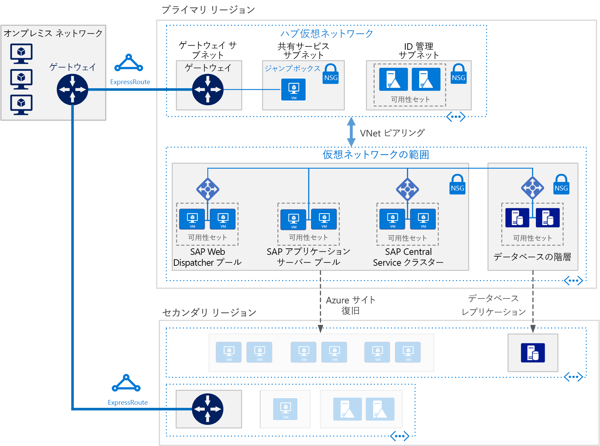

# AnyDB 向けの SAP NetWeaver (Windows) を Azure 仮想マシンにデプロイする

この参照用アーキテクチャは、高可用性を備えた Azure の Windows 環境で SAP NetWeaver を実行するための一連の実証済みプラクティスを示しています。 データベースは AnyDB (SAP HANA を除く、サポートされている任意の DBMS を表す SAP 用語) です。 このアーキテクチャは特定の仮想マシン (VM) サイズでデプロイされ、お客様の組織のニーズに合わせて変更できます。

"*このアーキテクチャの [Visio ファイル][visio-download]をダウンロードします。*"

> [!NOTE]
> この参照用アーキテクチャをデプロイするには、SAP 製品と他の Microsoft 以外のテクノロジの適切なライセンスが必要です。

## アーキテクチャ

このアーキテクチャは、次のインフラストラクチャ コンポーネントと主要ソフトウェア コンポーネントで構成されます。

**Virtual network**。 Azure Virtual Network サービスによって、Azure リソースが安全に相互接続されます。 このアーキテクチャでは、仮想ネットワークは、[ハブスポーク](../hybrid-networking/hub-spoke.md)のハブにデプロイされた VPN ゲートウェイ経由でオンプレミス環境に接続されます。 スポークは、SAP アプリケーションおよびデータベース層に使用される仮想ネットワークです。

**サブネット**。 仮想ネットワークは、階層 (アプリケーション (SAP NetWeaver) 層、データベース層、共有サービス (Jumpbox) 層、Active Directory 層) ごとに個別のサブネットに分割されます。

**仮想マシン**。 このアーキテクチャでは、アプリケーション層とデータベース層に仮想マシンが使用され、次のようにグループ化されます。

- **SAP NetWeaver**。 アプリケーション層では Windows 仮想マシンが使用され、SAP セントラル サービスと SAP アプリケーション サーバーが実行されます。 セントラル サービスを実行する VM は、高可用性のために Windows Server フェールオーバー クラスターとして構成され、SIOS DataKeeper Cluster Edition によってサポートされます。
- **AnyDB**。 データベース層では、AnyDB (Microsoft SQL Server、Oracle、IBM DB2 など) がソース データベースとして実行されます。
- **Jumpbox**。 要塞ホストとも呼ばれます。 これは、他の仮想マシンに接続するために管理者が使用するネットワークの安全な仮想マシンです。
- **Windows Server Active Directory ドメイン コントローラー**。 ドメイン コントローラーは、ドメイン内のすべての VM とユーザーで使用されます。

**ロード バランサー**。 [Azure Load Balancer](/azure/load-balancer/load-balancer-overview) インスタンスは、アプリケーション層サブネット内の仮想マシンにトラフィックを分散させるときに使用されます。 データ層では、DBMS に応じて、組み込みの SAP ロード バランサー、Azure Load Balancer、またはその他のメカニズムを使用して高可用性を実現できます。 詳細については、「[SAP NetWeaver のための Azure Virtual Machines DBMS のデプロイ](/azure/virtual-machines/workloads/sap/dbms-guide)」を参照してください。

**可用性セット**。 SAP Web Dispatcher、SAP アプリケーション サーバー、および (A) SCS ロールの仮想マシンが個別の[可用性セット](/azure/virtual-machines/windows/tutorial-availability-sets)にグループ化され、ロールごとに少なくとも 2 つの仮想マシンがプロビジョニングされます。 これにより、仮想マシンが、より高度な[サービス レベル アグリーメント](https://azure.microsoft.com/support/legal/sla/virtual-machines) (SLA) に対応できるようになります。

**NIC**。 [ネットワーク インターフェイス カード](/azure/virtual-network/virtual-network-network-interface) (NIC) により、仮想ネットワーク上の仮想マシンのすべての通信が有効になります。

**ネットワーク セキュリティ グループ**。 仮想ネットワークの受信トラフィック、送信トラフィック、およびサブネット間トラフィックを制限するために、[ネットワーク セキュリティ グループ](/azure/virtual-network/virtual-networks-nsg) (NSG) を作成できます。

**ゲートウェイ**。 ゲートウェイにより、オンプレミス ネットワークが Azure 仮想ネットワークに拡張されます。 [ExpressRoute](/azure/architecture/reference-architectures/hybrid-networking/expressroute) は、パブリック インターネットを経由しないプライベート接続を作成するための推奨 Azure サービスですが、[サイト間](/azure/vpn-gateway/vpn-gateway-howto-site-to-site-resource-manager-portal)接続を使用することもできます。

**Azure Storage**。 仮想マシンの仮想ハード ディスク (VHD) の永続的ストレージを提供するには、[Azure Storage](/azure/storage/storage-standard-storage) が必要です。 これは、フェールオーバー クラスター操作を実装するために、[クラウド監視](/windows-server/failover-clustering/deploy-cloud-witness)によっても使用されます。

## Recommendations

実際の要件は、ここで説明するアーキテクチャとは異なる場合があります。 これらの推奨事項を開始点として使用してください。

### SAP Web Dispatcher プール

Web Dispatcher コンポーネントは、SAP アプリケーション サーバー間の SAP トラフィックのロード バランサーとして使用されます。 Web Dispatcher コンポーネントの高可用性は、Azure Load Balancer を使って、並列 Web Dispatcher セットアップを実装することで実現します。 Web Dispatcher は、バランサー プール内で使用可能な Web Dispatcher での HTTP (S) トラフィック分散のために、ラウンドロビン構成で使用されます。

Azure VM での SAP NetWeaver の実行の詳細については、「[SAP NetWeaver のための Azure Virtual Machines の計画と実装](/azure/virtual-machines/workloads/sap/planning-guide)」を参照してください。

### アプリケーション サーバー プール

ABAP アプリケーション サーバーのログオン グループの管理には、SMLG トランザクションが使用されます。 この場合、セントラル サービスのメッセージ サーバー内の負荷分散機能を使って、SAPGUI および RFC トラフィックの SAP アプリケーション サーバーのプールにワークロードが分散されます。 アプリケーション サーバーは、クラスター仮想ネットワーク名を介して高可用性セントラル サービスに接続されます。

### SAP セントラル サービス クラスター

この参照アーキテクチャでは、アプリケーション層の VM でセントラル サービスが実行されます。 セントラル サービスは、1 つの VM にデプロイすると単一障害点 (SPOF) になる可能性があります (これは高可用性が不要な場合の一般的なデプロイです)。 高可用性ソリューションを実装するには、共有ディスク クラスターまたはファイル共有クラスターのいずれかを使用できます。

共有ディスク クラスター用に VM を構成するには、[Windows Server フェールオーバー クラスター](https://blogs.sap.com/2018/01/25/how-to-create-sap-resources-in-windows-failover-cluster/)を使用します。 クォーラム監視として[クラウド監視](/windows-server/failover-clustering/deploy-cloud-witness)をお勧めします。 フェールオーバー クラスター環境をサポートするために、[SIOS DataKeeper クラスター エディション](https://azuremarketplace.microsoft.com/marketplace/apps/sios_datakeeper.sios-datakeeper-8)では、クラスター ノードが所有する独立したディスクをレプリケートすることによって、クラスターの共有ボリューム機能が実行されます。 Azure では共有ディスクがネイティブでサポートされていないため、SIOS 提供のソリューションが必要です。

詳細については、 「[Running SAP applications on the Microsoft platform (Microsoft プラットフォーム上での SAP アプリケーションの実行)](https://blogs.msdn.microsoft.com/saponsqlserver/2017/05/04/sap-on-azure-general-update-for-customers-partners-april-2017/)」で、Azure の SIOS で ASCS を実行する SAP のお客様向けの重要な更新に関するトピックをご覧ください。

Windows Server フェールオーバー クラスターを使ってファイル共有クラスターを実装して、クラスタリングを処理することもできます。 [SAP](https://blogs.sap.com/2018/03/19/migration-from-a-shared-disk-cluster-to-a-file-share-cluster/) では、UNC パスを介して /sapmnt グローバル ディレクトリにアクセスするための、セントラル サービス デプロイ パターンを最近変更しました。 この変更により、セントラル サービス VM の SIOS または他の共有ディスク ソリューションに関する[要件がなくなりました](https://blogs.msdn.microsoft.com/saponsqlserver/2017/08/10/high-available-ascs-for-windows-on-file-share-shared-disk-no-longer-required/)。 ただし、/sapmnt UNC 共有の[高可用性](https://blogs.sap.com/2017/07/21/how-to-create-a-high-available-sapmnt-share/)は確保することをお勧めします。 セントラル サービス インスタンスでこれを実現するには、Windows Server フェールオーバー クラスターと、Windows Server 2016 で[スケールアウト ファイル サーバー](https://blogs.msdn.microsoft.com/saponsqlserver/2017/11/14/file-server-with-sofs-and-s2d-as-an-alternative-to-cluster-shared-disk-for-clustering-of-an-sap-ascs-instance-in-azure-is-generally-available/) (SOFS) および[記憶域スペース ダイレクト](https://blogs.sap.com/2018/03/07/your-sap-on-azure-part-5-ascs-high-availability-with-storage-spaces-direct/) (S2D) 機能を使用します。

### 可用性セット

可用性セットにより、サーバーがさまざまな物理インフラストラクチャおよび更新グループに分散され、サービスの可用性が向上します。 同じロールを実行する仮想マシンを可用性セットに配置すると、Azure インフラストラクチャのメンテナンスに伴うダウンタイムを防ぎ、[サービス レベル アグリーメント](https://azure.microsoft.com/support/legal/sla/virtual-machines) (SLA) に準拠するのに役立ちます。 可用性セットごとに複数の仮想マシンを配置することをお勧めします。

セット内の仮想マシンはすべて、同じロールを実行します。 同じ可用性セットに異なるロールのサーバーを混在させないでください。 たとえば、アプリケーション サーバーを含む可用性セットには、セントラル サービス ノードを配置しないでください。

### NIC

従来のオンプレミスの SAP デプロイでは、管理トラフィックとビジネス トラフィックを切り離すために、マシンごとに複数のネットワーク インターフェイス カード (NIC) が実装されます。 Azure では、仮想ネットワークは、すべてのトラフィックを同じネットワーク ファブリック経由で送信するソフトウェア定義ネットワークです。 したがって、複数の NIC を使用する必要はありません。 ただし、お客様の組織がトラフィックを分離する必要がある場合は、VM ごとに複数の NIC をデプロイし、各 NIC をそれぞれ異なるサブネットに接続することで、NSG を使ってさまざまなアクセス制御ポリシーを強制できます。

### サブネットと NSG

このアーキテクチャでは、仮想ネットワーク アドレス空間がサブネットに分割されます。 この参照アーキテクチャは、主に、主にアプリケーション層のサブネットに焦点を当てています。 各サブネットを、サブネットのアクセス ポリシーを定義する NSG に関連付けることができます。 アプリケーション サーバーは、切り離されたサブネットに配置してください。これにより管理対象が個別のサーバーではなく、サブネット セキュリティ ポリシーになるため、サーバーのセキュリティが確保しやすくなります。

NSG がサブネットに関連付けられている場合、その NSG はサブネット内のすべてのサーバーに適用されます。 NSG を使用してサブネット内のサーバーをきめ細かく制御する方法の詳細については、[ネットワーク セキュリティ グループによるネットワーク トラフィックのフィルター処理](https://azure.microsoft.com/en-us/blog/multiple-vm-nics-and-network-virtual-appliances-in-azure/)に関するページをご覧ください。

### ロード バランサー

[SAP Web Dispatcher](https://help.sap.com/doc/saphelp_nw73ehp1/7.31.19/en-US/48/8fe37933114e6fe10000000a421937/frameset.htm) では、SAP アプリケーション サーバー プールへの HTTP(S) トラフィックの負荷分散が処理されます。

DIAG プロトコルまたはリモート ファンクション コール (RFC) を使用して SAP サーバーに接続している SAP GUI クライアントからのトラフィックについては、セントラル サービスのメッセージ サーバーでは、SAP アプリケーション サーバーの[ログオン グループ](https://wiki.scn.sap.com/wiki/display/SI/ABAP+Logon+Group+based+Load+Balancing)を使用して負荷が分散されます。したがって、追加のロード バランサーは必要ありません。

### Azure Storage

すべてデータベース サーバーの仮想マシンで、Azure Premium Storage を使用して、読み取り/書き込みの待機時間に一貫性を確保することをお勧めします。 すべてのオペレーティング システム ディスクおよびデータ ディスクに対して Premium Storage を使用する単一インスタンス仮想マシンについては、「[Virtual Machines の SLA](https://azure.microsoft.com/support/legal/sla/virtual-machines)」を参照してください。 また、運用 SAP システムでは、どの場合も Premium [Azure Managed Disks](/azure/storage/storage-managed-disks-overview) を使用することをお勧めします。 信頼性を確保するために、ディスクの VHD ファイルの管理には Managed Disks が使用されます。 マネージド ディスクでは、可用性セット内の仮想マシンのディスクが必ず分離されるため、単一障害点を回避できます。

セントラル サービス仮想マシンなどの SAP アプリケーション サーバーでは、アプリケーション実行はメモリ内で行われ、ログ記録だけにディスクが使用されるため、Azure Standard Storage を使用してコストを削減できます。 ただし、現時点では、Standard Storage はアンマネージド ストレージに対してのみ認定されています。 アプリケーション サーバーではデータがホストされないため、小さいサイズの P4 および P6 Premium Storage ディスクが、コストを最小限に抑えるうえで役に立つこともあります。

Azure Storage は[クラウド監視](/windows-server/failover-clustering/deploy-cloud-witness)で も使用されます。これにより、クラスターが存在するプライマリ リージョンから離れた場所にあるリモート Azure リージョンのデバイスで、クォーラムが保持されます。

バックアップ データ ストアでは、Azure の[クール アクセス層](/azure/storage/storage-blob-storage-tiers)および[アーカイブ アクセス層ストレージ](/azure/storage/storage-blob-storage-tiers)を使用することをお勧めします。 これらのストレージ層により、コスト効果の高い方法で、有効期間が長くアクセスの少ないデータを格納できます。

## パフォーマンスに関する考慮事項

SAP アプリケーション サーバーは、データベース サーバーと常に通信しています。 SAP HANA など、任意のデータベース プラットフォームで実行されているパフォーマンス クリティカルなアプリケーションについては、[書き込みアクセラレータ](/azure/virtual-machines/linux/how-to-enable-write-accelerator)を有効にして、ログ書き込みの待機時間を短縮することを検討してください。 サーバー間の通信を最適化するには、[高速ネットワーク](https://azure.microsoft.com/blog/linux-and-windows-networking-performance-enhancements-accelerated-networking/)を使用します。 これらのアクセラレータは、特定の VM シリーズでしか使用できないことに注意してください。

高い IOPS とディスク帯域幅のスループットを達成するために、ストレージ ボリュームの[パフォーマンス最適化](/azure/virtual-machines/windows/premium-storage-performance)の共通プラクティスが、Azure Storage レイアウトに適用されます。 たとえば、ストライピングされたディスク ボリュームを作成するために複数のディスクを結合すると、IO パフォーマンスが向上します。 変更が頻繁に行われないストレージ コンテンツの読み取りキャッシュを有効にすると、データ取得の速度が向上します。

SQL 上の SAP については、「[Top 10 Key Considerations for Deploying SAP Applications on Azure (Azure に SAP アプリケーションをデプロイするための重要な考慮事項トップ 10)](https://blogs.msdn.microsoft.com/saponsqlserver/2015/05/25/top-10-key-considerations-for-deploying-sap-applications-on-azure/)」ブログに、SQL Server で Azure Storage を SAP ワークロード用に最適化するうえで役立つアドバイスが記載されています。

## スケーラビリティに関する考慮事項

SAP アプリケーション レイヤーでは、Azure は、スケールアップおよびスケールアウトのための幅広い仮想マシン サイズを提供しています。詳細な一覧については、[SAP Note 1928533](https://launchpad.support.sap.com/#/notes/1928533) の「SAP Applications on Azure: Supported Products and Azure VM Types (Azure 上の SAP アプリケーション:サポートされる製品と Azure VM の種類)」を参照してください。 (アクセスするには、SAP Service Marketplace アカウントが必要です)。 SAP アプリケーション サーバーとセントラル サービス クラスターは、インスタンスを追加することでスケールアップ/スケールダウンまたはスケールアウトできます。 AnyDB データベースの場合、スケールアップ/スケールダウンは可能ですが、スケールアウトできません。AnyDB の SAP データベース コンテナーでは、シャーディングがサポートされません。

## 可用性に関する考慮事項

リソースの冗長性は、高可用性インフラストラクチャ ソリューションの一般的なテーマです。 SLA がそれほど厳しくない企業については、単一インスタンスの Azure VM によってアップタイム SLA が提供されます。 詳細については、[Azure サービス レベル アグリーメント](https://azure.microsoft.com/support/legal/sla/)に関するページをご覧ください。

このように SAP アプリケーションを分散してインストールした場合、高可用性を実現するために基本のインストールがレプリケートされます。 高可用性の設計は、アーキテクチャのレイヤーごとに異なります。

### アプリケーション層

SAP Web Dispatcher の高可用性は冗長インスタンスによって実現します。 SAP ドキュメントの「[SAP Web Dispatcher](https://help.sap.com/doc/saphelp_nw70ehp2/7.02.16/en-us/48/8fe37933114e6fe10000000a421937/frameset.htm)」を参照してください。

セントラル サービスの高可用性は、Windows Server フェールオーバー クラスターで実装されます。 フェールオーバー クラスターのクラスター記憶域は、Azure にデプロイするときに、クラスター化共有ボリュームまたはファイル共有のいずれかを使用して構成できます。

Azure では共有ディスクを使用できないため、SIOS Datakeeper を使って、クラスター ノードに接続されている独立したディスクの内容がレプリケートされ、ドライブはクラスター マネージャーのクラスター共有ボリュームとして抽象化されます。 実装の詳細については、[Azure での SAP ASCS のクラスタリング](https://blogs.msdn.microsoft.com/saponsqlserver/2015/05/20/clustering-sap-ascs-instance-using-windows-server-failover-cluster-on-microsoft-azure-with-sios-datakeeper-and-azure-internal-load-balancer/)に関するページをご覧ください。

[スケールアウト ファイル サーバー](https://blogs.msdn.microsoft.com/saponsqlserver/2017/11/14/file-server-with-sofs-and-s2d-as-an-alternative-to-cluster-shared-disk-for-clustering-of-an-sap-ascs-instance-in-azure-is-generally-available/) (SOFS) によって提供されるファイル共有を使用することもできます。 SOFS によって提供されるのは回復力のあるファイル共有で、これは Windows クラスターのクラスター共有ボリュームとして使用できます。 1 つの SOFS クラスターを、複数のセントラル サービス ノードが共有できます。 このドキュメントの作成時点では、SOFS は高可用性の設計のみを目的として使用されます。SOFS クラスターはリージョンの枠を越えては拡張されず、ディザスター リカバリーがサポートされないためです。

SAP アプリケーション サーバーの高可用性は、アプリケーション サーバーのプール内のトラフィックを負荷分散することによって実現します。
「[Microsoft Azure で実行されている SAP の認定と構成](/azure/virtual-machines/workloads/sap/sap-certifications)」を参照してください。

### データベース層

この参照アーキテクチャでは、ソース データベースが AnyDB、つまり、SQL Server、SAP ASE、IBM DB2、Oracle などの DBMS で実行されていることを前提としています。 データベース層のネイティブのレプリケーション機能では、レプリケートされたノード間でのフェールオーバーを手動または自動で行うことができます。

特定のデータベース システムの実装の詳細については、「[SAP NetWeaver のための Azure Virtual Machines DBMS のデプロイ](/azure/virtual-machines/workloads/sap/dbms-guide)」を参照してください。

## ディザスター リカバリーの考慮事項

ディザスター リカバリー (DR) を確保するために、セカンダリ リージョンにフェールオーバーできる必要があります。 各層では、さまざまな戦略を利用して、ディザスター リカバリー (DR) の保護を提供しています。

- **アプリケーション サーバー層**。 SAP アプリケーション サーバーには、ビジネス データが含まれていません。 Azure での単純な DR 戦略は、セカンダリ リージョンで SAP アプリケーション サーバーを作成し、そのサーバーをシャットダウンすることです。 プライマリ アプリケーション サーバーで構成変更やカーネル更新を行った場合、同じ変更がセカンダリ リージョンの仮想マシンにコピーされなければなりません。 たとえば、カーネルの実行可能ファイルが DR 仮想マシンにコピーされます。 アプリケーション サーバーをセカンダリ リージョンに自動的にレプリケートするためのソリューションとしては、[Azure Site Recovery](/azure/site-recovery/site-recovery-overview) をお勧めします。

- **セントラル サービス**。 SAP アプリケーション スタックのこのコンポーネントにも、ビジネス データが保持されません。 ディザスター リカバリー リージョンで VM を作成すると、セントラル サービス ロールを実行できます。 プライマリ セントラル サービス ノードから同期されるコンテンツは、/sapmnt 共有コンテンツだけです。 また、構成の変更やカーネルの更新がプライマリ セントラル サービス サーバーで発生した場合、その変更や更新は、セントラル サービスが実行されているディザスター リカバリー リージョンの VM でもう一度行われなければなりません。 2 つのサーバーを同期するには、Azure Site Recovery を使用してクラスター ノードをレプリケートするか、単純に、定期的にコピーするようにスケジュール設定されたコピー ジョブを使用して、/sapmnt をディザスター リカバリー リージョンにコピーします。 このシンプルなレプリケーション方法の作成、コピー、およびテスト フェールオーバー プロセスの詳細については、「[SAP NetWeaver:Building a Hyper-V and Microsoft Azure–based Disaster Recovery Solution (SAP NetWeaver: Hyper-V および Microsoft Azure ベースのディザスター リカバリー ソリューション)](https://download.microsoft.com/download/9/5/6/956FEDC3-702D-4EFB-A7D3-2DB7505566B6/SAP%20NetWeaver%20-%20Building%20an%20Azure%20based%20Disaster%20Recovery%20Solution%20V1_5%20.docx)」をダウンロードして、「4.3. SAP SPOF layer (ASCS) (4.3 SAP SPOF レイヤー (ASCS))」を参照してください。

- **データベース層**。 DR の実装には、データベース独自の統合レプリケーション テクノロジを使用するのが最適です。 たとえば、SQL Server の場合は、AlwaysOn 可用性グループを使用して、リモート リージョンにレプリカを作成し、手動フェールオーバーで非同期的にトランザクションをレプリケートすることをお勧めします。 非同期レプリケーションにより、プライマリ サイトにおけるインタラクティブ ワークロードのパフォーマンスへの影響を回避できます。 手動フェールオーバーにより、ユーザーが、DR の影響を評価し、DR サイトからの操作が正当かどうかを判断できるようになります。

Azure Site Recovery を使用して、ご自身の元のサイトが完全にレプリケートされた運用サイトを自動的に構築するには、カスタマイズされた[デプロイ スクリプト](/azure/site-recovery/site-recovery-runbook-automation)を実行する必要があります。 Site Recovery によって、最初に VM が可用性セットにデプロイされ、その後、ロード バランサーなどのリソースを追加するスクリプトが実行されます。

## 管理容易性に関する考慮事項

Azure には、インフラストラクチャ全体の[監視と診断](/azure/architecture/best-practices/monitoring)を行うための機能が複数用意されています。 また、Azure 仮想マシンの高度な監視は、Azure Operations Management Suite (OMS) で処理されます。

SAP インフラストラクチャのリソースとサービス パフォーマンスの SAP ベースの監視には、[Azure SAP Enhanced Monitoring](/azure/virtual-machines/workloads/sap/deployment-guide#detailed-tasks-for-sap-software-deployment) 拡張機能が使用されます。 この拡張機能では、Azure 監視統計情報をオペレーティング システムの監視と DBA Cockpit 機能のための SAP アプリケーションにフィードします。

## セキュリティに関する考慮事項

SAP は、SAP アプリケーション内でのロールベース アクセスと承認を制御するために、独自のユーザー管理エンジン (UME) を備えています。 詳細については、「[SAP NetWeaver Application Server for ABAP Security Guide (SAP NetWeaver Application Server for ABAP セキュリティ ガイド)](https://help.sap.com/viewer/864321b9b3dd487d94c70f6a007b0397/7.4.19)」および「[SAP NetWeaver Application Server Java Security Guide (SAP NetWeaver Application Server Java セキュリティ ガイド)](https://help.sap.com/doc/saphelp_snc_uiaddon_10/1.0/en-US/57/d8bfcf38f66f48b95ce1f52b3f5184/frameset.htm)」を参照してください。

追加のネットワーク セキュリティについては、[ネットワーク DMZ](../dmz/secure-vnet-hybrid.md) を実装することを検討します。これにより、ネットワーク仮想アプライアンスを使用して、Web Dispatcher のサブネットの外側にファイアウォールが作成されます。

インフラストラクチャ セキュリティでは、データは転送時および保存時に暗号化されます。 [Azure Virtual Machines (VM) 上の SAP NetWeaver の計画と実装に関するガイド](/azure/virtual-machines/workloads/sap/planning-guide)の「セキュリティに関する考慮事項」セクションでは、冒頭にネットワーク セキュリティへの対応について記述されています。 また、このガイドでは、アプリケーション通信を許可するために、ファイアウォールで開く必要があるネットワーク ポートも指定しています。

Windows 仮想マシン ディスクを暗号化するには、[Azure Disk Encryption](/azure/security/azure-security-disk-encryption) を使用できます。 この場合、Windows の BitLocker 機能によって、オペレーティング システムおよびデータ ディスクのボリュームが暗号化されます。 また、このソリューションは Azure Key Vault と共に動作するため、お使いのキー コンテナー サブスクリプションのディスク暗号化キーとシークレットの制御および管理にも役立ちます。 仮想マシンのディスク上のデータは暗号化され、お使いの Azure ストレージに保存されます。

## コミュニティ

コミュニティは質問に答え、デプロイを正常に完了できるよう支援します。 以下、具体例に沿って説明します。

- [Microsoft プラットフォームでの SAP アプリケーションの実行 (ブログ)](https://blogs.msdn.microsoft.com/saponsqlserver/2017/05/04/sap-on-azure-general-update-for-customers-partners-april-2017/)
- [Azure コミュニティ サポート](https://azure.microsoft.com/support/community/)
- [SAP Community](https://www.sap.com/community.html)
- [Stack Overflow](https://stackoverflow.com/tags/sap/)

## 関連リソース

同じテクノロジの一部を使用する具体的なソリューションを示す次の [Azure のサンプル シナリオ](/azure/architecture/example-scenario)をレビューできます。

- [Azure での Oracle Database を使用した SAP 運用環境ワークロードの実行](/azure/architecture/example-scenario/apps/sap-production)
- [Azure での SAP ワークロード向けの開発/テスト環境](/azure/architecture/example-scenario/apps/sap-dev-test)

<!-- links -->

[visio-download]: https://archcenter.blob.core.windows.net/cdn/sap-reference-architectures.vsdx
