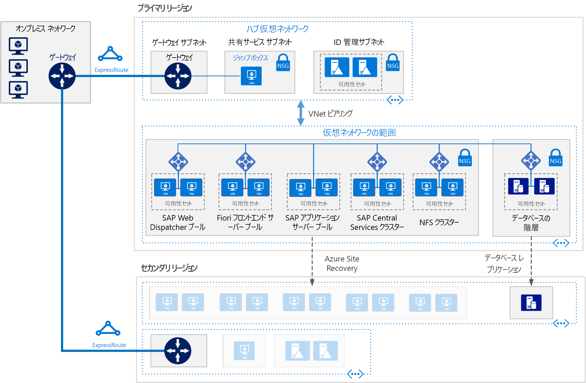

# Azure における Linux Virtual Machines の SAP S/4HANASAP S/4HANA for Linux virtual machines on Azure

この参照用アーキテクチャは、Azure でディザスター リカバリーをサポートする高可用性環境で S/4HANA を実行するための一連の実証済みプラクティスを示しています。This reference architecture shows a set of proven practices for running S/4HANA in a high availability environment that supports disaster recovery on Azure. このアーキテクチャは特定の仮想マシン (VM) サイズでデプロイされ、お客様の組織のニーズに合わせて変更できます。This architecture is deployed with specific virtual machine (VM) sizes that can be changed to accommodate your organization's needs.

"*このアーキテクチャの [Visio ファイル][visio-download]をダウンロードします。*"*Download a [Visio file][visio-download] of this architecture.*

> [!NOTE]
> この参照用アーキテクチャをデプロイするには、SAP 製品と他の Microsoft 以外のテクノロジの適切なライセンスが必要です。Deploying this reference architecture requires appropriate licensing of SAP products and other non-Microsoft technologies.

## アーキテクチャArchitecture

この参照アーキテクチャでは、エンタープライズ レベル、運用レベルのシステムについて説明します。This reference architecture describes a enterprise-grade, production-level system. この構成は、お客様のビジネス ニーズに合わせて単一の仮想マシンに縮小できます。To suit your business needs, this configuration can be reduced to a single virtual machine. ただし、以下のコンポーネントが必要です。However, the following components are required:

**Virtual network**。**Virtual network**. [Azure Virtual Network](/azure/virtual-network/virtual-networks-overview) サービスによって、Azure リソースが安全に相互接続されます。The [Azure Virtual Network](/azure/virtual-network/virtual-networks-overview) service securely connects Azure resources to each other. このアーキテクチャでは、仮想ネットワークは、[ハブスポーク トポロジ](../hybrid-networking/hub-spoke.md)のハブにデプロイされたゲートウェイ経由でオンプレミス環境に接続されます。In this architecture, the virtual network connects to an on-premises environment through a gateway deployed in the hub of a [hub-spoke topology](../hybrid-networking/hub-spoke.md). スポークは、SAP アプリケーションに使用される仮想ネットワークです。The spoke is the virtual network used for the SAP applications.

**サブネット**。**Subnets**. 仮想ネットワークは、階層 (ゲートウェイ層、アプリケーション層、データベース層、共有サービス層) ごとに個別の[サブネット](/azure/virtual-network/virtual-network-manage-subnet)に分割されます。The virtual network is subdivided into separate [subnets](/azure/virtual-network/virtual-network-manage-subnet) for each tier: gateway, application, database, and shared services.

**仮想マシン**。**Virtual machines**. このアーキテクチャでは、アプリケーション層とデータベース層に Linux が実行されている仮想マシンが使用され、次のようにグループ化されます。This architecture uses virtual machines running Linux for the application tier and database tier, grouped as follows:

- **アプリケーション層**。**Application tier**. Fiori Front-end Server プール、SAP Web Dispatcher プール、アプリケーション サーバー プール、および SAP セントラル サービス クラスターが含まれます。Includes the Fiori Front-end Server pool, SAP Web Dispatcher pool, application server pool, and SAP Central Services cluster. Azure Linux 仮想マシンでセントラル サービスの高可用性を実現するには、高可用性ネットワーク ファイル システム (NFS) サービスが必要です。For high availability of Central Services on Azure Linux virtual machines, a highly available Network File System (NFS) service is required.
- **NFS クラスター**。**NFS cluster**. このアーキテクチャでは、Linux クラスターで実行されている [NFS](/azure/virtual-machines/workloads/sap/high-availability-guide-suse-nfs) サーバーを使って、SAP システム間で共有されるデータが格納されます。This architecture uses an [NFS](/azure/virtual-machines/workloads/sap/high-availability-guide-suse-nfs) server running on a Linux cluster to store data shared between SAP systems. この一元化されたクラスターは、複数の SAP システムで共有できます。This centralized cluster can be shared across multiple SAP systems. NFS サービスの高可用性は、選択されている Linux ディストリビューションに適した High Availability Extension によって実現します。For high availability of the NFS service, the appropriate High Availability Extension for the selected Linux distribution is used.
- **SAP HANA**。**SAP HANA**. データベース層では、高可用性を実現するために、クラスターで複数の Linux 仮想マシンが使用されます。The database tier uses two or more Linux virtual machines in a cluster to achieve high availability. HANA システム レプリケーション (HSR) を使用して、プライマリ HANA システムとセカンダリHANA システムの間でコンテンツがレプリケートされます。HANA System Replication (HSR) is used to replicate contents between primary and secondary HANA systems. システム障害の検出と自動フェールオーバーの促進には Linux クラスタリングが使用されます。Linux clustering is used to detect system failures and facilitate automatic failover. また、ストレージ ベースまたはクラウド ベースのフェンス メカニズムが採用され、障害が発生したシステムを確実に分離またはシャットダウンし、クラスターのスプリット ブレイン状態を回避できます。A storage-based or cloud-based fencing mechanism can be used to ensure the failed system is isolated or shut down to avoid the cluster split-brain condition.
- **Jumpbox**。**Jumpbox**. 要塞ホストとも呼ばれます。Also called a bastion host. これは、他の仮想マシンに接続するために管理者が使用するネットワークの安全な仮想マシンです。This is a secure virtual machine on the network that administrators use to connect to the other virtual machines. Windows または Linux を実行できます。It can run Windows or Linux. HANA Cockpit または HANA Studio 管理ツールを使用するときは、Web を閲覧しやすいように Windows Jumpbox を使用します。Use a Windows jumpbox for web browsing convenience when using HANA Cockpit or HANA Studio management tools.

**ロード バランサー**。**Load balancers**. 組み込みの SAP ロード バランサーと [Azure Load Balancer](/azure/load-balancer/load-balancer-overview) の両方が、HA を実現するために使用されます。Both built-in SAP load balancers and [Azure Load Balancer](/azure/load-balancer/load-balancer-overview) are used to achieve HA. Azure Load Balancer インスタンスは、アプリケーション層サブネット内の仮想マシンにトラフィックを分散させるときに使用されます。Azure Load Balancer instances are used to distribute traffic to virtual machines in the application tier subnet.

**可用性セット**。**Availability sets**. すべてのプールおよびクラスター (Web Dispatcher、SAP アプリケーション サーバー、セントラル サービス、NFS、および HANA) の仮想マシンが個別の[可用性セット](/azure/virtual-machines/windows/tutorial-availability-sets)にグループ化され、ロールあたり少なくとも 2 つの仮想マシンがプロビジョニングされます。Virtual machines for all pools and clusters (Web Dispatcher, SAP application servers, Central Services, NFS, and HANA) are grouped into separate [availability sets](/azure/virtual-machines/windows/tutorial-availability-sets), and at least two virtual machines are provisioned per role. これにより、仮想マシンが、より高度な[サービス レベル アグリーメント](https://azure.microsoft.com/support/legal/sla/virtual-machines) (SLA) に対応できるようになります。This makes the virtual machines eligible for a higher [service level agreement](https://azure.microsoft.com/support/legal/sla/virtual-machines) (SLA).

**NIC**。**NICs**. [ネットワーク インターフェイス カード](/azure/virtual-network/virtual-network-network-interface) (NIC) により、仮想ネットワーク上の仮想マシンのすべての通信が有効になります。[Network interface cards](/azure/virtual-network/virtual-network-network-interface) (NICs) enable all communication of virtual machines on a virtual network.

**ネットワーク セキュリティ グループ**。**Network security groups**. 仮想ネットワークで受信トラフィック、送信トラフィック、およびサブネット間トラフィックを制限するために、[ネットワーク セキュリティ グループ](/azure/virtual-network/virtual-networks-nsg) (NSG) が使用されます。To restrict incoming, outgoing, and intra-subnet traffic in the virtual network, [network security groups](/azure/virtual-network/virtual-networks-nsg) (NSGs) are used.

**ゲートウェイ**。**Gateway**. ゲートウェイにより、オンプレミス ネットワークが Azure 仮想ネットワークに拡張されます。A gateway extends your on-premises network to the Azure virtual network. [ExpressRoute](/azure/architecture/reference-architectures/hybrid-networking/expressroute) は、パブリック インターネットを経由しないプライベート接続を作成するための推奨 Azure サービスですが、[サイト間](/azure/vpn-gateway/vpn-gateway-howto-site-to-site-resource-manager-portal)接続を使用することもできます。[ExpressRoute](/azure/architecture/reference-architectures/hybrid-networking/expressroute) is the recommended Azure service for creating private connections that do not go over the public Internet, but a [Site-to-Site](/azure/vpn-gateway/vpn-gateway-howto-site-to-site-resource-manager-portal) connection can also be used.

**Azure Storage**。**Azure Storage**. 仮想マシンの仮想ハード ディスク (VHD) の永続的ストレージを提供するには、[Azure Storage](/azure/storage/) が必要です。To provide persistent storage of a virtual machine's virtual hard disk (VHD), [Azure Storage](/azure/storage/) is required.

## RecommendationsRecommendations

このアーキテクチャでは、小規模な運用レベルのエンタープライズ デプロイについて説明します。This architecture describes a small production-level enterprise deployment. 対象となるデプロイは、ビジネス要件によって異なります。Your deployment will differ based on your business requirements. これらの推奨事項を開始点として使用してください。Use these recommendations as a starting point.

### 仮想マシンVirtual machines

アプリケーション サーバーのプールおよびクラスターで、それぞれの要件に基づいて仮想マシンの数を調整します。In application server pools and clusters, adjust the number of virtual machines based on your requirements. [Azure Virtual Machines の計画と実装ガイド](/azure/virtual-machines/workloads/sap/planning-guide)に関するページには、仮想マシンでの SAP NetWeaver の実行について詳しく説明されていますが、この説明は SAP S/4HANA にも適用されます。The [Azure Virtual Machines planning and implementation guide](/azure/virtual-machines/workloads/sap/planning-guide) includes details about running SAP NetWeaver on virtual machines, but the information applies to SAP S/4HANA as well.

Azure 仮想マシンの種類とスループットのメトリック (SAPS) の SAP サポートの詳細については、[SAP Note 1928533](https://launchpad.support.sap.com/#/notes/1928533) を参照してください。For details about SAP support for Azure virtual machine types and throughput metrics (SAPS), see [SAP Note 1928533](https://launchpad.support.sap.com/#/notes/1928533).

### SAP Web Dispatcher プールSAP Web Dispatcher pool

Web Dispatcher コンポーネントは、SAP アプリケーション サーバー間の SAP トラフィックのロード バランサーとして使用されます。The Web Dispatcher component is used as a load balancer for SAP traffic among the SAP application servers. Web Dispatcher コンポーネントの高可用性は、バランサーのバックエンド プールで使用可能な Web Dispatcher 間での HTTP (S) トラフィック分散のために、Azure Load Balancer を使って、ラウンドロビン構成で並列 Web Dispatcher セットアップを実装することで実現します。To achieve high availability for the Web Dispatcher component, Azure Load Balancer is used to implement the parallel Web Dispatcher setup in a round-robin configuration for HTTP(S) traffic distribution among the available Web Dispatchers in the balancers back-end pool.

### Fiori Front-end ServerFiori Front-end Server

Fiori Front-end Server では [NetWeaver Gateway](https://help.sap.com/doc/saphelp_gateway20sp12/2.0/en-US/76/08828d832e4aa78748e9f82204a864/content.htm?no_cache=true) が使用されます。The Fiori Front-end Server uses a [NetWeaver Gateway](https://help.sap.com/doc/saphelp_gateway20sp12/2.0/en-US/76/08828d832e4aa78748e9f82204a864/content.htm?no_cache=true). 小規模なデプロイについては、Fiori サーバーに読み込むことができます。For small deployments, it can be loaded on the Fiori server. 大規模なデプロイでは、NetWeaver Gateway 用の別個のサーバーを、Fiori Front-end Server プールの外側にデプロイできます。For large deployments, a separate server for the NetWeaver Gateway may be deployed in front of the Fiori Front-end Server pool.

### アプリケーション サーバー プールApplication servers pool

ABAP アプリケーション サーバーのログオン グループの管理には、SMLG トランザクションが使用されます。To manage logon groups for ABAP application servers, the SMLG transaction is used. この場合、セントラル サービスのメッセージ サーバー内の負荷分散機能を使って、SAPGUI および RFC トラフィックの SAP アプリケーション サーバーのプールにワークロードが分散されます。It uses the load balancing function within the message server of the Central Services to distribute workload among SAP application servers pool for SAPGUIs and RFC traffic. アプリケーション サーバーは、クラスター仮想ネットワーク名を介して高可用性セントラル サービスに接続されます。The application server connection to the highly available Central Services is through the cluster virtual network name. これにより、ローカル フェールオーバー後に、セントラル サービス接続用のアプリケーション サーバー プロファイルを変更する必要がなくなります。This avoids the need to change the application server profile for Central Services connectivity after a local failover.

### SAP セントラル サービス クラスターSAP Central Services cluster

高可用性が不要な場合は、セントラル サービスを単一の仮想マシンにデプロイできます。Central Services can be deployed to a single virtual machine when high availability is not a requirement. ただし、単一の仮想マシンは、SAP 環境の単一障害点 (SPOF) になる可能性があります。However, the single virtual machine becomes a potential single point of failure (SPOF) for the SAP environment. 高可用性セントラル サービス デプロイについては、高可用性 NFS クラスターと高可用性セントラル サービス クラスターが使用されます。For a highly available Central Services deployment, a highly available NFS cluster and a highly available Central Services cluster are used.

### NFS クラスターNFS cluster

NFS クラスターのノード間のレプリケーションには DRBD (Distributed Replicated Block Device) が使用されます。DRBD (Distributed Replicated Block Device) is used for replication between the nodes of the NFS cluster.

### 可用性セットAvailability sets

可用性セットにより、サーバーがさまざまな物理インフラストラクチャおよび更新グループに分散され、サービスの可用性が向上します。Availability sets distribute servers to different physical infrastructure and update groups to improve service availability. 同じロールを実行する仮想マシンを可用性セットに配置すると、Azure インフラストラクチャのメンテナンスに伴うダウンタイムを防ぎ、[サービス レベル アグリーメント](https://azure.microsoft.com/support/legal/sla/virtual-machines) に準拠するのに役立ちます。Put virtual machines that perform the same role into an availability sets to help guard against downtime caused by Azure infrastructure maintenance and to meet [SLAs](https://azure.microsoft.com/support/legal/sla/virtual-machines). 可用性セットごとに複数の仮想マシンを配置することをお勧めします。Two or more virtual machines per availability set is recommended.

セット内の仮想マシンはすべて、同じロールを実行します。All virtual machines in a set must perform the same role. 同じ可用性セットに異なるロールのサーバーを混在させないでください。Do not mix servers of different roles in the same availability set. たとえば、アプリケーション サーバーを含む可用性セットには、ASCS ノードを配置しないでください。For example, don't place a ASCS node in the same availability set with the application server.

### NICNICs

従来のオンプレミスの SAP 環境では、管理トラフィックとビジネス トラフィックを切り離すために、マシンごとに複数のネットワーク インターフェイス カード (NIC) が実装されます。Traditional on-premises SAP landscapes implement multiple network interface cards (NICs) per machine to segregate administrative traffic from business traffic. Azure では、仮想ネットワークは、すべてのトラフィックを同じネットワーク ファブリック経由で送信するソフトウェア定義ネットワークです。On Azure, the virtual network is a software-defined network that sends all traffic through the same network fabric. したがって、複数の NIC を使用する必要はありません。Therefore, the use of multiple NICs is unnecessary. ただし、お客様の組織がトラフィックを分離する必要がある場合は、VM ごとに複数の NIC をデプロイし、各 NIC をそれぞれ異なるサブネットに接続することで、NSG を使ってさまざまなアクセス制御ポリシーを強制できます。However, if your organization needs to segregate traffic, you can deploy multiple NICs per VM, connect each NIC to a different subnet, and then use NSGs to enforce different access control policies.

### サブネットと NSGSubnets and NSGs

このアーキテクチャでは、仮想ネットワーク アドレス空間がサブネットに分割されます。This architecture subdivides the virtual network address space into subnets. 各サブネットを、サブネットのアクセス ポリシーを定義する NSG に関連付けることができます。Each subnet can be associated with a NSG that defines the access policies for the subnet. アプリケーション サーバーは、切り離されたサブネットに配置してください。これにより管理対象が個別のサーバーではなく、サブネット セキュリティ ポリシーになるため、サーバーのセキュリティが確保しやすくなります。Place application servers on a separate subnet so you can secure them more easily by managing the subnet security policies, not the individual servers.

NSG がサブネットに関連付けられている場合、その NSG はサブネット内のすべてのサーバーに適用されます。When a NSG is associated with a subnet, it then applies to all the servers within the subnet. NSG を使用してサブネット内のサーバーをきめ細かく制御する方法の詳細については、[ネットワーク セキュリティ グループによるネットワーク トラフィックのフィルター処理](https://azure.microsoft.com/blog/multiple-vm-nics-and-network-virtual-appliances-in-azure/)に関するページをご覧ください。For more information about using NSGs for fine-grained control over the servers in a subnet, see [Filter network traffic with network security groups](https://azure.microsoft.com/blog/multiple-vm-nics-and-network-virtual-appliances-in-azure/).

また、「[VPN ゲートウェイの計画と設計](/azure/vpn-gateway/vpn-gateway-plan-design)」も参照してください。See also [Planning and design for VPN Gateway](/azure/vpn-gateway/vpn-gateway-plan-design).

### ロード バランサーLoad balancers

[SAP Web Dispatcher](https://help.sap.com/doc/saphelp_nw73ehp1/7.31.19/en-US/48/8fe37933114e6fe10000000a421937/frameset.htm) では、SAP アプリケーション サーバー プールへの HTTP(S) トラフィック (Fiori スタイルのアプリケーションを含む) の負荷分散が処理されます。[SAP Web Dispatcher](https://help.sap.com/doc/saphelp_nw73ehp1/7.31.19/en-US/48/8fe37933114e6fe10000000a421937/frameset.htm) handles load balancing of HTTP(S) traffic including Fiori style applications to a pool of SAP application servers.

DIAG またはリモート ファンクション コール (RFC) を使用して SAP サーバーに接続している SAP GUI クライアントからのトラフィックについては、セントラル サービスのメッセージ サーバーでは、SAP アプリケーション サーバーの[ログオン グループ](https://wiki.scn.sap.com/wiki/display/SI/ABAP+Logon+Group+based+Load+Balancing)を使用して負荷が分散されます。したがって、追加のロード バランサーは必要ありません。For traffic from SAP GUI clients connecting a SAP server via DIAG or Remote Function Calls (RFC), the Central Service message server balances the load through SAP application server [logon groups](https://wiki.scn.sap.com/wiki/display/SI/ABAP+Logon+Group+based+Load+Balancing), so no additional load balancer is needed.

### Azure StorageAzure Storage

データベース サーバーの仮想マシンに対して Azure Premium Storage を使用することをお勧めします。We recommend using Azure Premium Storage for the database server virtual machines. Premium Storage により、一貫した読み取り/書き込みの待機時間を実現できます。Premium storage provides consistent read/write latency. 単一インスタンス仮想マシンのオペレーティング システム ディスクおよびデータ ディスクに対する Premium Storage の使用に関する詳細については、「[Virtual Machines の SLA](https://azure.microsoft.com/support/legal/sla/virtual-machines/)」を参照してください。For details about using Premium Storage for the operating system disks and data disks of a single-instance virtual machine, see [SLA for Virtual Machines](https://azure.microsoft.com/support/legal/sla/virtual-machines/).

すべての運用 SAP システムで、Premium [Azure Managed Disks](/azure/storage/storage-managed-disks-overview) を使用することをお勧めします。For all production SAP systems, we recommend using Premium [Azure Managed Disks](/azure/storage/storage-managed-disks-overview). ディスクの VHD ファイルの管理には、信頼性を高めるために、Managed Disks が使用されます。Managed Disks are used to manage the VHD files for the disks, adding reliability. また、これにより可用性セット内の仮想マシンのディスクが必ず分離されるため、単一障害点を回避できます。They also ensure that the disks for virtual machines within an availability set are isolated to avoid single points of failure.

セントラル サービス仮想マシンなどの SAP アプリケーション サーバーでは、アプリケーション実行はメモリ内で行われ、ログ記録だけにディスクが使用されるため、Azure Standard Storage を使用してコストを削減できます。For SAP application servers, including the Central Services virtual machines, you can use Azure Standard Storage to reduce cost, because application execution takes place in memory and uses disks for logging only. ただし、現時点では、Standard Storage はアンマネージド ストレージに対してのみ認定されています。However, at this time, Standard Storage is only certified for unmanaged storage. アプリケーション サーバーではデータがホストされないため、小さいサイズの P4 および P6 Premium Storage ディスクが、コストを最小限に抑えるうえで役に立つこともあります。Since application servers do not host any data, you can also use the smaller P4 and P6 Premium Storage disks to help minimize cost.

バックアップ データ ストアでは、Azure の[クール アクセス層ストレージやアーカイブ アクセス層ストレージ](/azure/storage/storage-blob-storage-tiers)を使用することをお勧めします。For the backup data store, we recommend using Azure [cool access tier storage and/or archive access tier storage](/azure/storage/storage-blob-storage-tiers). これらのストレージ層により、コスト効果の高い方法で、有効期間が長くアクセスの少ないデータを格納できます。These storage tiers are cost-effective ways to store long-lived data that is less frequently accessed.

## パフォーマンスに関する考慮事項Performance considerations

SAP アプリケーション サーバーは、データベース サーバーと常に通信しています。SAP application servers carry on constant communications with the database servers. HANA データベースの仮想マシンについては、[書き込みアクセラレータ](/azure/virtual-machines/linux/how-to-enable-write-accelerator)を有効にして、ログ書き込みの待機時間を短縮することを検討してください。For the HANA database virtual machines, consider enabling [Write Accelerator](/azure/virtual-machines/linux/how-to-enable-write-accelerator) to improve log write latency. サーバー間の通信を最適化するには、[高速ネットワーク](https://azure.microsoft.com/blog/linux-and-windows-networking-performance-enhancements-accelerated-networking/)を使用します。To optimize inter-server communications, use the [Accelerated Network](https://azure.microsoft.com/blog/linux-and-windows-networking-performance-enhancements-accelerated-networking/). これらのアクセラレータは、特定の VM シリーズでしか使用できないことに注意してください。Note that these accelerators are available only for certain VM series.

高い IOPS とディスク帯域幅のスループットを達成するために、ストレージ ボリュームの[パフォーマンス最適化](/azure/virtual-machines/linux/premium-storage-performance)の共通プラクティスが、Azure Storage レイアウトに適用されます。To achieve high IOPS and disk bandwidth throughput, the common practices in storage volume [performance optimization](/azure/virtual-machines/linux/premium-storage-performance) apply to Azure storage layout. たとえば、ストライピングされたディスク ボリュームを作成するために複数のディスクを結合すると、IO パフォーマンスが向上します。For example, combining multiple disks together to create a striped disk volume improves IO performance. 変更が頻繁に行われないストレージ コンテンツの読み取りキャッシュを有効にすると、データ取得の速度が向上します。Enabling the read cache on storage content that changes infrequently enhances the speed of data retrieval. パフォーマンス要件の詳細については、「[SAP Note 1943937 - Hardware Configuration Check Tool (SAP Note 1943937 - ハードウェア構成チェックツール)](https://launchpad.support.sap.com/#/notes/1943937)」を参照してください (アクセスするには、SAP Service Marketplace アカウントが必要です)。For details about performance requirements, see [SAP note 1943937 - Hardware Configuration Check Tool](https://launchpad.support.sap.com/#/notes/1943937) (SAP Service Marketplace account required for access).

## スケーラビリティに関する考慮事項Scalability considerations

SAP アプリケーション レイヤーでは、Azure は、スケールアップおよびスケールアウトのための幅広い仮想マシン サイズを提供しています。詳細な一覧については、[SAP Note 1928533](https://launchpad.support.sap.com/#/notes/1928533) の「SAP Applications on Azure: Supported Products and Azure VM types (Azure 上の SAP アプリケーション:サポートされる製品と Azure VM の種類)」を参照してください (アクセスするには、SAP Service Marketplace アカウントが必要です)。At the SAP application layer, Azure offers a wide range of virtual machine sizes for scaling up and scaling out. For an inclusive list, see [SAP Note 1928533](https://launchpad.support.sap.com/#/notes/1928533) - SAP Applications on Azure: Supported Products and Azure VM types (SAP Service Marketplace account required for access). 認定済み仮想マシンの種類が引き続き増えていくことで、ユーザーは同じクラウド デプロイでスケールアップまたはスケールダウンできます。As we continue to certify more virtual machines types, you can scale up or down with the same cloud deployment.

データベース層では、このアーキテクチャによって VM で HANA が実行されます。At the database layer, this architecture runs HANA on VMs. ご自身のワークロードが最大 VM サイズを超えた場合は、Microsoft では、[Azure Large Instances](/azure/virtual-machines/workloads/sap/hana-overview-architecture) for SAP HANA も提供しています。If your workload exceeds the maximum VM size, Microsoft also offers [Azure Large Instances](/azure/virtual-machines/workloads/sap/hana-overview-architecture) for SAP HANA. これらの物理サーバーは Microsoft Azure 認定データセンターに併置され、このドキュメントの作成時点では、単一インスタンスに対して最大 20 TB のメモリ容量を提供します。These physical servers are co-located in a Microsoft Azure certified datacenter and as of this writing, provide up to 20 TB of memory capacity for a single instance. 複数ノードの構成では、最大 60 TB の合計メモリ容量を備えることも可能です。Multi-node configuration is also possible with a total memory capacity of up to 60 TB.

## 可用性に関する考慮事項Availability considerations

リソースの冗長性は、高可用性インフラストラクチャ ソリューションの一般的なテーマです。Resource redundancy is the general theme in highly available infrastructure solutions. SLA がそれほど厳しくない企業については、単一インスタンスの Azure VM によってアップタイム SLA が提供されます。For enterprises that have a less stringent SLA, single-instance Azure VMs offer an uptime SLA. 詳細については、[Azure サービス レベル アグリーメント](https://azure.microsoft.com/support/legal/sla/)に関するページをご覧ください。For more information, see [Azure Service Level Agreement](https://azure.microsoft.com/support/legal/sla/).

このように SAP アプリケーションを分散してインストールした場合、高可用性を実現するために基本のインストールがレプリケートされます。In this distributed installation of the SAP application, the base installation is replicated to achieve high availability. 高可用性の設計は、アーキテクチャのレイヤーごとに異なります。For each layer of the architecture, the high availability design varies.

### アプリケーション層Application tier

- Web Dispatcher。Web Dispatcher. 高可用性は冗長 Web Dispatcher インスタンスによって実現します。High availability is achieved with redundant Web Dispatcher instances. SAP ドキュメントの「[SAP Web Dispatcher](https://help.sap.com/doc/saphelp_nw70ehp2/7.02.16/en-us/48/8fe37933114e6fe10000000a421937/frameset.htm)」を参照してください。See [SAP Web Dispatcher](https://help.sap.com/doc/saphelp_nw70ehp2/7.02.16/en-us/48/8fe37933114e6fe10000000a421937/frameset.htm) in the SAP documentation.
- Fiori サーバー。Fiori servers. 高可用性は、サーバーのプール内の負荷分散トラフィックによって実現します。High availability is achieved by load balancing traffic within a pool of servers.
- セントラル サービス。Central Services. Azure Linux 仮想マシンのセントラル サービスの高可用性は、選択されている Linux ディストリビューションに適した High Availability Extension によって実現します。また、高可用性 NFS クラスターによって DRBD ストレージがホストされます。For high availability of Central Services on Azure Linux virtual machines, the appropriate High Availability Extension for the selected Linux distribution is used, and the highly available NFS cluster hosts DRBD storage.
- アプリケーション サーバー。Application servers. 高可用性は、アプリケーション サーバーのプール内の負荷分散トラフィックによって実現されます。High availability is achieved by load balancing traffic within a pool of application servers.

### データベース層Database tier

この参照アーキテクチャは、2 つの Azure 仮想マシンで構成される高可用性 SAP HANA データベース システムを示しています。This reference architecture depicts a highly available SAP HANA database system consisting of two Azure virtual machines. データベース層のネイティブのシステム レプリケーション機能では、レプリケートされたノード間でのフェールオーバーを手動または自動で行うことができます。The database tier's native system replication feature provides either manual or automatic failover between replicated nodes:

- 手動フェールオーバーを行うには、複数の HANA インスタンスをデプロイし、HANA システム レプリケーション (HSR) を使用します。For manual failover, deploy more than one HANA instance and use HANA System Replication (HSR).
- 自動フェールオーバーを行うには、お使いの Linux ディストリビューションに適した HSR と Linux High Availability Extension (HAE) の両方を使用します。For automatic failover, use both HSR and Linux High Availability Extension (HAE) for your Linux distribution. Linux HAE はクラスター サービスを HANA リソースに提供することで、障害イベントを検出し、正常なノードへの誤ったサービスのフェールオーバーを調整します。Linux HAE provides the cluster services to the HANA resources, detecting failure events and orchestrating the failover of errant services to the healthy node.

「[Microsoft Azure で実行されている SAP の認定と構成](/azure/virtual-machines/workloads/sap/sap-certifications)」を参照してください。See [SAP certifications and configurations running on Microsoft Azure](/azure/virtual-machines/workloads/sap/sap-certifications).

### ディザスター リカバリーの考慮事項Disaster recovery considerations

各層では、さまざまな戦略を利用して、ディザスター リカバリー (DR) の保護を提供しています。Each tier uses a different strategy to provide disaster recovery (DR) protection.

- **アプリケーション サーバー層**。**Application servers tier**. SAP アプリケーション サーバーには、ビジネス データが含まれていません。SAP application servers do not contain business data. Azure での単純な DR 戦略は、セカンダリ リージョンで SAP アプリケーション サーバーを作成し、そのサーバーをシャットダウンすることです。On Azure, a simple DR strategy is to create SAP application servers in the secondary region, then shut them down. プライマリ アプリケーション サーバーで任意の構成変更やカーネル更新を行った場合、同じ変更がセカンダリ リージョンの仮想マシンに適用されなければなりません。Upon any configuration changes or kernel updates on the primary application server, the same changes must be applied to the virtual machines in the secondary region. たとえば、SAP カーネルの実行可能ファイルを DR 仮想マシンにコピーします。For example, copy the SAP kernel executables to the DR virtual machines. アプリケーション サーバーをセカンダリ リージョンに自動的にレプリケートするためのソリューションとしては、[Azure Site Recovery](/azure/site-recovery/site-recovery-overview) をお勧めします。For automatic replication of application servers to a secondary region, [Azure Site Recovery](/azure/site-recovery/site-recovery-overview) is the recommended solution. このドキュメントの作成時点では、ASR では、Azure VM における高速ネットワーク構成設定のレプリケーションがまだサポートされていません。As of the writing of this paper, ASR doesn't yet support the replication of the Accelerated Network configuration setting in Azure VMs.

- **セントラル サービス**。**Central Services**. SAP アプリケーション スタックのこのコンポーネントにも、ビジネス データが保持されません。This component of the SAP application stack also does not persist business data. セカンダリ リージョンで VM を作成すると、セントラル サービス ロールを実行できます。You can build a VM in the secondary region to run the Central Services role. プライマリ セントラル サービス ノードから同期されるコンテンツは、/sapmnt 共有コンテンツだけです。The only content from the primary Central Services node to synchronize is the /sapmnt share content. また、構成の変更やカーネルの更新がプライマリ セントラル サービス サーバーで発生した場合、その変更や更新は、セントラル サービスが実行されているセカンダリ リージョンの VM でもう一度行われなければなりません。Also, if configuration changes or kernel updates take place on the primary Central Services servers, they must be repeated on the VM in the secondary region running Central Services. 2 つのサーバーを同期するには、Azure Site Recovery を使用してクラスター ノードをレプリケートするか、単純に、定期的にコピーするようにスケジュール設定されたコピー ジョブを使用して、/sapmnt を DR 側にコピーします。To synchronize the two servers, you can use either Azure Site Recovery, to replicate the cluster nodes, or simply use a regularly scheduled copy job to copy /sapmnt to the DR side. 作成、コピー、およびテスト フェールオーバー プロセスの詳細については、「[SAP NetWeaver:Building a Hyper-V and Microsoft Azure–based Disaster Recovery Solution (SAP NetWeaver: Hyper-V および Microsoft Azure ベースのディザスター リカバリー ソリューション)](https://download.microsoft.com/download/9/5/6/956FEDC3-702D-4EFB-A7D3-2DB7505566B6/SAP%20NetWeaver%20-%20Building%20an%20Azure%20based%20Disaster%20Recovery%20Solution%20V1_5%20.docx)」をダウンロードして、「4.3. SAP SPOF layer (ASCS) (4.3 SAP SPOF レイヤー (ASCS))」を参照してください。For details about the build, copy, and test failover process, download [SAP NetWeaver: Building a Hyper-V and Microsoft Azure–based Disaster Recovery Solution](https://download.microsoft.com/download/9/5/6/956FEDC3-702D-4EFB-A7D3-2DB7505566B6/SAP%20NetWeaver%20-%20Building%20an%20Azure%20based%20Disaster%20Recovery%20Solution%20V1_5%20.docx), and refer to section 4.3, "SAP SPOF layer (ASCS)." このドキュメントは、Windows で実行されている NetWeaver に適用されますが、Linux 用の同等の構成を作成することもできます。This paper applies to NetWeaver running on Windows, but you can create the equivalent configuration for Linux. セントラル サービスについては、[Azure Site Recovery](/en-us/azure/site-recovery/site-recovery-overview) を使用して、クラスター ノードとストレージをレプリケートします。For Central Services, use [Azure Site Recovery](/en-us/azure/site-recovery/site-recovery-overview) to replicate the cluster nodes and storage. Linux については、High Availability Extension を使用して、3 つのノード geo クラスターを作成します。For Linux, create a three node geo-cluster using a High Availability Extension.

- **SAP データベース層**。**SAP database tier**. HANA でサポートされているレプリケーションに対して HSR を使用します。Use HSR for HANA-supported replication. 2 ノードのローカル高可用性セットアップのほかに、HSR では多層レプリケーションがサポートされます。このレプリケーションで、切り離された Azure リージョンの 3 つ目のノードは、クラスターの一部としてではなく、外部エンティティとして動作し、そのレプリケーション ターゲットとして、クラスター化された HSR ペアのセカンダリ レプリカに登録します。In addition to a local, two-node high availability setup, HSR supports multi-tier replication where a third node in a separate Azure region acts as a foreign entity, not part of the cluster, and registers to the secondary replica of the clustered HSR pair as its replication target. これにより、レプリケーション デイジー チェーンが形成されます。This form a replication daisy chain. DR ノードへのフェールオーバーは、手動プロセスです。The failover to the DR node is a manual process.

Azure Site Recovery を使用して、ご自身の元のサイトが完全にレプリケートされた運用サイトを自動的に構築するには、カスタマイズされた[デプロイ スクリプト](/azure/site-recovery/site-recovery-runbook-automation)を実行する必要があります。To use Azure Site Recovery to automatically build a fully replicated production site of your original, you must run customized [deployment scripts](/azure/site-recovery/site-recovery-runbook-automation). Site Recovery によって、最初に仮想マシンが可用性セットにデプロイされ、その後、ロード バランサーなどのリソースを追加するスクリプトが実行されます。Site Recovery first deploys the virtual machines in availability sets, then runs scripts to add resources such as load balancers.

## 管理容易性に関する考慮事項Manageability considerations

SAP HANA は、基本となる Azure インフラストラクチャを使用したバックアップ機能を備えています。SAP HANA has a backup feature that makes use of the underlying Azure infrastructure. Azure 仮想マシンで実行されている SAP HANA データベースをバックアップするために、SAP HANA スナップショットと Azure ストレージ スナップショットの両方が、バックアップ ファイルの一貫性を確保するために使用されます。To back up the SAP HANA database running on Azure virtual machines, both the SAP HANA snapshot and Azure storage snapshot are used to ensure the backup files' consistency. 詳細については、「[Azure Virtual Machines 上の SAP HANA のバックアップ ガイド](/azure/virtual-machines/workloads/sap/sap-hana-backup-guide)」および「[Azure Backup サービスについての質問](/azure/backup/backup-azure-backup-faq)」を参照してください。For details, see [Backup guide for SAP HANA on Azure Virtual Machines](/azure/virtual-machines/workloads/sap/sap-hana-backup-guide) and the [Azure Backup service FAQ](/azure/backup/backup-azure-backup-faq). Azure ストレージ スナップショットをサポートするのは、HANA の単一コンテナー デプロイだけです。Only HANA single container deployments support Azure storage snapshot.

### ID 管理Identity management

すべてのレベルで一元化された ID 管理システムを使用して、リソースへのアクセスを制御します。Control access to resources by using a centralized identity management system at all levels:

- [ロールベースのアクセス制御](/azure/active-directory/role-based-access-control-what-is) (RBAC) を使用して、Azure リソースへのアクセスを提供します。Provide access to Azure resources through [role-based access control](/azure/active-directory/role-based-access-control-what-is) (RBAC).
- LDAP、Azure Active Directory、Kerberos、または他のシステム介して Azure VM へのアクセスを許可します。Grant access to Azure VMs through LDAP, Azure Active Directory, Kerberos, or another system.
- SAP が提供するサービスを介してアプリ自体でアクセスをサポートするか、[OAuth 2.0 と Azure Active Directory](/azure/active-directory/develop/active-directory-protocols-oauth-code) を使用します。Support access within the apps themselves through the services that SAP provides, or use [OAuth 2.0 and Azure Active Directory](/azure/active-directory/develop/active-directory-protocols-oauth-code).

### 監視Monitoring

Azure には、インフラストラクチャ全体の[監視と診断](/azure/architecture/best-practices/monitoring)を行うための機能が複数用意されています。Azure provides several functions for [monitoring and diagnostics](/azure/architecture/best-practices/monitoring) of the overall infrastructure. また、Azure 仮想マシン (Linux または Windows) の高度な監視は、Azure Operations Management Suite (OMS) で処理されます。Also, enhanced monitoring of Azure virtual machines (Linux or Windows) is handled by Azure Operations Management Suite (OMS).

SAP インフラストラクチャのリソースとサービス パフォーマンスの SAP ベースの監視には、[Azure SAP Enhanced Monitoring](/azure/virtual-machines/workloads/sap/deployment-guide#d98edcd3-f2a1-49f7-b26a-07448ceb60ca) 拡張機能が使用されます。To provide SAP-based monitoring of resources and service performance of the SAP infrastructure, the [Azure SAP Enhanced Monitoring](/azure/virtual-machines/workloads/sap/deployment-guide#d98edcd3-f2a1-49f7-b26a-07448ceb60ca) extension is used. この拡張機能では、Azure 監視統計情報をオペレーティング システムの監視と DBA Cockpit 機能のための SAP アプリケーションにフィードします。This extension feeds Azure monitoring statistics into the SAP application for operating system monitoring and DBA Cockpit functions. SAP の拡張された監視機能は、Azure で SAP を実行するうえで必須の前提条件です。SAP enhanced monitoring is a mandatory prerequisite to run SAP on Azure. 詳細については、[SAP Note 2191498](https://launchpad.support.sap.com/#/notes/2191498) の「SAP on Linux with Azure:Enhanced Monitoring (Azure を使用した Linux 上の SAP: 拡張された監視機能)」を参照してください。For details, see [SAP Note 2191498](https://launchpad.support.sap.com/#/notes/2191498) – "SAP on Linux with Azure: Enhanced Monitoring."

## セキュリティに関する考慮事項Security considerations

SAP は、SAP アプリケーション内でのロールベース アクセスと承認を制御するために、独自のユーザー管理エンジン (UME) を備えています。SAP has its own Users Management Engine (UME) to control role-based access and authorization within the SAP application. 詳細については、「[SAP HANA Security - An Overview (SAP HANA のセキュリティ - 概要)](https://archive.sap.com/documents/docs/DOC-62943)」を参照してください (アクセスするには、SAP Service Marketplace アカウントが必要です)。For details, see [SAP HANA Security—An Overview](https://archive.sap.com/documents/docs/DOC-62943) (SAP Service Marketplace account required for access.)

追加のネットワーク セキュリティについては、[ネットワーク DMZ](/azure/architecture/reference-architectures/dmz/secure-vnet-hybrid) を実装することを検討します。これにより、ネットワーク仮想アプライアンスを使用して、Web Dispatcher および Fiori Front-End Server プールのサブネットの外側にファイアウォールが作成されます。For additional network security, consider implementing a [Network DMZ](/azure/architecture/reference-architectures/dmz/secure-vnet-hybrid), which uses a network virtual appliance to create a firewall in front of the subnet for Web Dispatcher and Fiori Front-End Server pools.

インフラストラクチャ セキュリティでは、データは転送時および保存時に暗号化されます。For infrastructure security, data is encrypted in transit and at rest. [Azure Virtual Machines 上の SAP NetWeaver の計画と実装に関するガイド](/azure/virtual-machines/workloads/sap/planning-guide)の「セキュリティに関する考慮事項」セクションでは、冒頭にネットワーク セキュリティへの対応について記述されています。このセクションは S/4HANA に適用されます。The "Security considerations" section of the [SAP NetWeaver on Azure Virtual Machines–Planning and Implementation Guide](/azure/virtual-machines/workloads/sap/planning-guide) begins to address network security and applies to S/4HANA. また、このガイドでは、アプリケーション通信を許可するために、ファイアウォールで開く必要があるネットワーク ポートも指定しています。The guide also specifies the network ports you must open on the firewalls to allow application communication.

Linux IaaS 仮想マシン ディスクを暗号化するには、[Azure Disk Encryption](/azure/security/azure-security-disk-encryption) を使用できます。To encrypt Linux IaaS virtual machine disks, you can use [Azure Disk Encryption](/azure/security/azure-security-disk-encryption). この場合、Linux の DM-Crypt 機能によって、オペレーティング システムおよびデータ ディスクのボリュームが暗号化されます。It uses the DM-Crypt feature of Linux to provide volume encryption for the operating system and the data disks. また、このソリューションは Azure Key Vault と共に動作するため、お使いのキー コンテナー サブスクリプションのディスク暗号化キーとシークレットの制御および管理にも役立ちます。The solution also works with Azure Key Vault to help you control and manage the disk-encryption keys and secrets in your key vault subscription. 仮想マシンのディスク上のデータは暗号化され、お使いの Azure ストレージに保存されます。Data on the virtual machine disks are encrypted at rest in your Azure storage.

保存されている SAP HANA データの暗号化には、SAP HANA のネイティブ暗号化テクノロジを使用することをお勧めします。For SAP HANA data-at-rest encryption, we recommend using the SAP HANA native encryption technology.

> [!NOTE]
> 同じサーバー上の Azure Disk Encryption には、保存されている HANA データの暗号化を使用しないでください。Do not use the HANA data-at-rest encryption with Azure Disk Encryption on the same server. HANA については、HANA データの暗号化のみを使用します。For HANA, use only HANA data encryption.

## コミュニティCommunities

コミュニティは質問に答え、デプロイを正常に完了できるよう支援します。Communities can answer questions and help you set up a successful deployment. 以下、具体例に沿って説明します。Consider the following:

- [Microsoft プラットフォームでの SAP アプリケーションの実行 (ブログ)Running SAP Applications on the Microsoft Platform Blog](https://blogs.msdn.microsoft.com/saponsqlserver/2017/05/04/sap-on-azure-general-update-for-customers-partners-april-2017/)
- [Azure コミュニティ サポートAzure Community Support](https://azure.microsoft.com/support/community/)
- [SAP CommunitySAP Community](https://www.sap.com/community.html)
- [Stack OverflowStack Overflow](https://stackoverflow.com/tags/sap/)

## 関連リソースRelated resources

同じテクノロジの一部を使用する具体的なソリューションを示す次の [Azure のサンプル シナリオ](/azure/architecture/example-scenario)をレビューできます。You may wish to review the following [Azure example scenarios](/azure/architecture/example-scenario) that demonstrate specific solutions using some of the same technologies:

- [Azure での Oracle Database を使用した SAP 運用環境ワークロードの実行Running SAP production workloads using an Oracle Database on Azure](/azure/architecture/example-scenario/apps/sap-production)
- [Azure での SAP ワークロード向けの開発/テスト環境Dev/test environments for SAP workloads on Azure](/azure/architecture/example-scenario/apps/sap-dev-test)

<!-- links -->

[visio-download]: https://archcenter.blob.core.windows.net/cdn/sap-reference-architectures.vsdx
