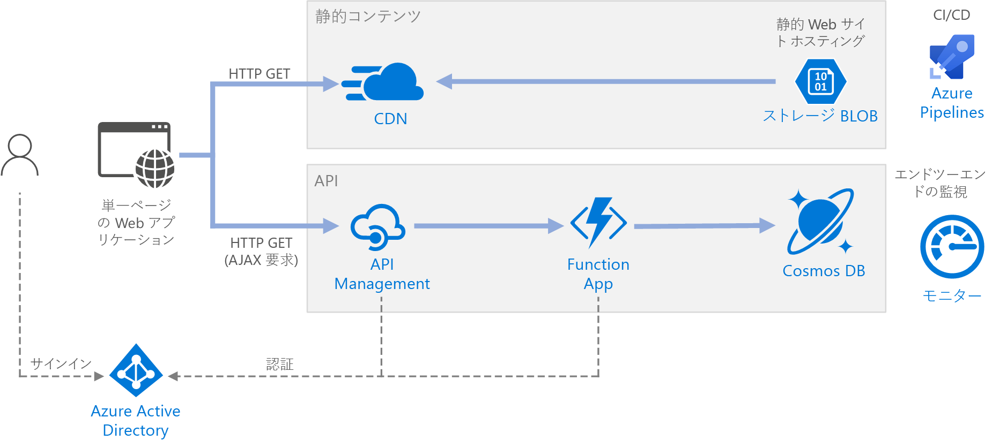

# <a name="serverless-web-application-on-azure"></a>Azure 上のサーバーレス Web アプリケーション

この参照アーキテクチャは、[サーバーレス](https://azure.microsoft.com/solutions/serverless/) Web アプリケーションを示しています。 このアプリケーションでは Azure Blob Storage から静的コンテンツを提供し、Azure Functions を使用して API が実装されます。 API は Cosmos DB からデータを読み取り、結果を Web アプリに返します。 このアーキテクチャのリファレンス実装は、[GitHub][github] で入手できます。



サーバーレスという言葉は 2 つの異なる意味を持ちますが、この 2 つの意味は関連しています。

- **サービスとしてのバックエンド** (BaaS)。 データベースやストレージなどのバックエンド クラウド サービスには、クライアント アプリケーションがこれらのサービスに直接接続できるようにする API が用意されています。
- **サービスとしての関数** (FaaS)。 このモデルでは、"関数" はクラウドにデプロイされるひとまとまりのコードで、コードを実行するサーバーが完全に抽象化されたホスティング環境内で実行されます。

両方の定義に共通しているのは、開発者と DevOps スタッフが、サーバーをデプロイ、構成、または管理する必要がないというアイデアです。 Azure Blob Storage からの Web コンテンツ提供は BaaS の一例ですが、この参照アーキテクチャでは、Azure Functions を使用した FaaS に重点を置いています。 FaaS の重要な特性をいくつか次に示します。

1. コンピューティング リソースが、プラットフォームによって必要に応じて動的に割り当てられます。
1. 使用量ベースの価格:ご自身のコードの実行に使用されたコンピューティング リソースに対してのみ課金されます。
1. コンピューティング リソースがトラフィックに基づいてオンデマンドでスケーリングされます。開発者が構成する必要はありません。

HTTP 要求やメッセージがキューに到着するなど、外部トリガーが発生すると、関数が実行されます。 このため、サーバーレス アーキテクチャにとって、[イベント ドリブン アーキテクチャのスタイル][event-driven]が自然になります。 アーキテクチャでのコンポーネント間の動作を調整するには、メッセージ ブローカーまたはパブリッシュ/サブスクライブ パターンの使用を検討してください。 Azure でのメッセージング テクノロジの選択に関するヘルプについては、「[メッセージを配信する Azure サービスの選択][azure-messaging]」を参照してください。

## <a name="architecture"></a>アーキテクチャ

アーキテクチャは、次のコンポーネントで構成されています。

**Blob Storage**。 HTML、CSS、JavaScript ファイルなどの静的 Web コンテンツは Azure Blob Storage に格納され、[静的 Web サイトのホスティング][static-hosting]を使用してクライアントに提供されます。 動的な対話はすべて、バックエンド API を呼び出す JavaScript コードを介して行われます。 Web ページをレンダリングするサーバー側のコードはありません。 静的な Web サイトのホスティングでは、インデックス ドキュメントとカスタム 404 エラー ページがサポートされます。

**CDN**。 [Azure Content Delivery Network][cdn] (CDN) を使用して、待機時間を短縮してコンテンツを高速に配信できるようにコンテンツをキャッシュし、HTTPS エンドポイントを提供します。

**Function App**。 [Azure Functions][functions] はサーバーレス コンピューティングの 1 つのオプションです。 ひとまとまりのコード ("関数") がトリガーによって呼び出されるイベント ドリブン モデルが使用されます。 このアーキテクチャでは、関数は、クライアントが HTTP 要求を行うと呼び出されます。 要求は、以下で説明するように、常に API ゲートウェイ経由でルーティングされます。

**API Management**。 [API Management][apim] は、HTTP 関数の前に配置される API ゲートウェイを提供します。 API Management を使用すると、クライアント アプリケーションで使用される API を発行および管理できます。 ゲートウェイは、バックエンド API からフロントエンド アプリケーションを分離するのに役立ちます。 たとえば、API Management では、URL の再書き込み、バックエンドに到達する前の要求の変換、要求または応答ヘッダーの設定などを行うことができます。

API Management を使って、複数のサービスにまたがる、次のような機能を実装することもできます。

- 使用量クォータとレート制限の強制
- 認証用の OAuth トークンの検証
- クロス オリジン要求 (CORS) の有効化
- 応答のキャッシュ
- 要求の監視とログ記録

API Management によって提供される一部の機能が不要の場合は、別の選択肢として[関数プロキシ][functions-proxy]を使用できます。 Azure Functions のこの機能を使用すると、バックエンド関数へのルートを作成することで、複数の関数アプリに対して 1 つの API サーフェスを定義できます。 関数プロキシによって、HTTP 要求および応答で制限付き変換を実行することもできます。 ただし、API Management ほど豊富なポリシー ベース機能は用意されていません。

**Cosmos DB**。 [Cosmos DB][cosmosdb] は、マルチモデル データベース サービスです。 このシナリオでは、関数アプリケーションは、クライアントからの HTTP GET 要求に応答して Cosmos DB からドキュメントをフェッチします。

**Azure Active Directory** (Azure AD)。 ユーザーは、自身の Azure AD 資格情報を使用して Web アプリケーションにサインインします。 Azure AD から API のアクセス トークンが返されます。Web アプリケーションはこれを使って API 要求を認証します (「[認証](#authentication)」を参照)。

**Azure Monitor**。 [Monitor][monitor] は、ソリューションにデプロイされた Azure サービスに関するパフォーマンス メトリックを収集します。 ダッシュボードでこれらを視覚化することで、ソリューションの正常性を把握できます。 アプリケーション ログも収集されます。

**Azure Pipelines**。 [Pipelines][pipelines] は、アプリケーションをビルド、テスト、デプロイする継続的インテグレーション (CI) および継続的デリバリー (CD) サービスです。

## <a name="recommendations"></a>Recommendations

### <a name="function-app-plans"></a>Function App プラン

Azure Functions では 2 つのホスティング モデルがサポートされています。 **従量課金プラン**では、コードの実行時にコンピューティング能力が自動的に割り当てられます。  **App Service** プランでは、一連の VM がお使いのコードに対して割り当てられます。 App Service プランで定義されるのは VM の数とサイズです。

上記の定義に従うと、App Service プランは厳密には "*サーバーレス*" ではありません。 プログラミング モデルは同じですが、従量課金プランと App Service プランの両方で、同じ関数コードを実行できます。

使用するプランの種類を選択するときに検討すべき要素を、次に示します。

- **コールド スタート**。 従量課金プランでは、最近呼び出されていない関数の場合、次回の実行時に待ち時間が少し長くなります。 この追加の待ち時間は、ランタイム環境の割り当てと準備が原因で発生します。 通常は数秒程度ですが、読み込む必要がある依存関係の数など、いくつかの要因によって異なってきます。 詳細については、「[Understanding Serverless Cold Start (サーバーレスのコールド スタートについて)][functions-cold-start]」を参照してください。 通常、コールド スタートが問題になるのは、非同期のメッセージ ドリブン ワークロード (キューまたはイベント ハブ トリガー) よりも対話型ワークロード (HTTP トリガー) です。対話型ワークロードでは、ユーザーが待ち時間が長くなったことに直接気付くためです。
- **タイムアウト時間**。  従量課金プランでは、[構成可能な][functions-timeout]期間 (最大 10 分) が経過すると関数の実行はタイムアウトします
- **仮想ネットワークの分離**。 App Service プランを使用すると、分離された専用ホスティング環境である [App Service 環境][ase]内で関数を実行できます。
- **価格モデル**。 従量課金プランでは、実行数とリソース消費量 (メモリ &times; 実行時間) によって課金されます。 App Service プランでは、VM インスタンス SKU に基づいて 1 時間ごとに課金されます。 従量課金プランは、使用したコンピューティング リソースにしか支払いが発生しないため、多くの場合 App Service プランよりもコストがかかりません。 これは、トラフィックに山と谷がある場合に特に当てはまります。 ただし、アプリケーションのスループットが一定して高い場合は、App Service プランの方が従量課金プランよりも低コストになる可能性があります。
- **スケーリング**。 従量課金モデルの大きな利点は、着信トラフィックに基づいて、必要に応じて動的にスケーリングされることです。 このスケーリングは迅速に行われますが、やはり準備期間はあります。 一部のワークロードでは、準備時間なしでトラフィックのバーストを処理できるように、VM の意図的オーバープロビジョニングが必要なことがあります。 その場合は、App Service プランを検討してください。

### <a name="function-app-boundaries"></a>Function App の境界

"*関数アプリ*" によって、1 つ以上の "*関数*" の実行がホストされます。 関数アプリを使用すると、複数の関数を 1 つの論理ユニットとしてまとめることができます。 関数アプリ内の関数は、同じアプリケーション設定、ホスティング プラン、およびデプロイ ライフサイクルを共有しています。 関数アプリはそれぞれ独自のホスト名を持ちます。

関数アプリを使用して、同じライフサイクルと設定を共有する関数をグループ化します。 同じライフサイクルを共有していない関数は、別の関数アプリでホストする必要があります。

マイクロサービス アプローチを使用することを検討します。このアプローチでは、各関数アプリが 1 つのマイクロサービスを表しており、関連する複数の関数で構成されている可能性があります。 マイクロサービス アーキテクチャのサービスには、疎結合と、機能の高い凝集度が必要です。 "*疎*" 結合とは、他のサービスを同時に更新しなくても、あるサービスを変更できることを意味します。 "*高凝集*" とは、明確に定義された 1 つの目的をサービスが持つことを意味します。 これらのアイデアの詳細については、「[マイクロサービスの設計:ドメイン分析][microservices-domain-analysis]」を参照してください。

### <a name="function-bindings"></a>関数のバインディング

可能な場合は、関数の[バインディング][functions-bindings]を使用します。 バインディングにより、お使いのコードをデータに接続し、他の Azure サービスと統合するために宣言型の方法が提供されます。 入力バインディングでは、入力パラメーターが外部データ ソースから設定されます。 出力バインディングでは、キューやデータベースなどのデータ シンクに関数の戻り値が送信されます。

たとえば、リファレンス実装の `GetStatus` 関数では、Cosmos DB の[入力バインディング][cosmosdb-input-binding]が使用されます。 このバインディングは、HTTP 要求のクエリ文字列から取得されるクエリ パラメーターを使用して、Cosmos DB のドキュメントを検索するように構成されています。 ドキュメントが見つかった場合、そのドキュメントは関数にパラメーターとして渡されます。

```csharp
[FunctionName("GetStatusFunction")]
public static Task<IActionResult> Run(
    [HttpTrigger(AuthorizationLevel.Function, "get", Route = null)] HttpRequest req,
    [CosmosDB(
        databaseName: "%COSMOSDB_DATABASE_NAME%",
        collectionName: "%COSMOSDB_DATABASE_COL%",
        ConnectionStringSetting = "COSMOSDB_CONNECTION_STRING",
        Id = "{Query.deviceId}",
        PartitionKey = "{Query.deviceId}")] dynamic deviceStatus,
    ILogger log)
{
    ...
}
```

バインディングを使用すると、サービスと直接通信するコードを記述する必要がありません。これにより関数コードが簡単になるだけでなく、データ ソースまたはシンクの詳細が抽象化されます。 ただし、場合によっては、バインディングが提供するよりも複雑なロジックが必要になる可能性があります。 その場合は、Azure のクライアント SDK を直接使用します。

## <a name="scalability-considerations"></a>スケーラビリティに関する考慮事項

**Functions**。 従量課金プランの場合、HTTP トリガーはトラフィックに基づいてスケーリングされます。 コンカレント関数インスタンスの数には制限がありますが、それぞれのインスタンスが一度に複数の要求を処理できます。 App Service プランでは、HTTP トリガーは VM インスタンスの数に応じてスケーリングされます。この数は固定値にすることも、一連の自動スケーリング ルールに基づいて自動スケーリングすることもできます。 詳細については、「[Azure Functions のスケールとホスティング][functions-scale]」を参照してください。

**Cosmos DB**。 Cosmos DB のスループット容量は、[要求ユニット][ru] (RU) で測定されます。 1 RU のスループットは、1 KB のドキュメントを取得するのに必要なスループットに対応します。 Cosmos DB コンテナーを 10,000 RU を超えてスケーリングするには、コンテナーの作成時に[パーティション キー][partition-key]を指定し、作成するすべてのドキュメントにパーティション キーを含める必要があります。 パーティション キーの詳細については、「[Azure Cosmos DB でのパーティション分割とスケーリング][cosmosdb-scale]」を参照してください。

**API Management**。 API Management はスケールアウトが可能で、ルールベースの自動スケーリングがサポートされます。 このスケーリング プロセスには、少なくとも 20 分かかることに注意してください。 トラフィックのバーストが発生する場合は、最大バースト トラフィックの予測に基づいてプロビジョニングする必要があります。 ただし、自動スケーリングを使えば、時間単位または日単位でトラフィックの変動が処理されるため便利です。 詳細については、「[Azure API Management インスタンスを自動的にスケーリングする][apim-scale]」を参照してください。

## <a name="disaster-recovery-considerations"></a>ディザスター リカバリーの考慮事項

ここに示したデプロイは単一の Azure リージョンに存在します。 ディザスター リカバリーでより回復性に優れたアプローチを実現するには、さまざまなサービスで地理的分散機能を利用します。

- API Management では複数リージョンのデプロイがサポートされており、API Management サービスの単一インスタンスを任意の数の Azure リージョンに分散できます。 詳細については、「[複数の Azure リージョンに Azure API Management サービス インスタンスをデプロイする方法][api-geo]」を参照してください。

- [Traffic Manager][tm] を使用して、HTTP 要求をプライマリ リージョンにルーティングします。 そのリージョンで実行されている Function App が使用できなくなった場合、Traffic Manager によってセカンダリ リージョンにフェールオーバーできます。

- Cosmos DB では[複数のマスター リージョン][cosmosdb-geo]がサポートされています。これにより、Cosmos DB アカウントに追加した任意のリージョンに書き込むことができます。 マルチマスターを有効にしなくても、プライマリ書き込みリージョンにはフェールオーバーできます。 フェールオーバーは、Cosmos DB クライアント SDK と Azure Functions のバインディングによって自動的に処理されるため、アプリケーション構成設定を更新する必要はありません。

## <a name="security-considerations"></a>セキュリティに関する考慮事項

### <a name="authentication"></a>Authentication

リファレンス実装の `GetStatus` API では、Azure AD を使用して要求が認証されます。 Azure AD がサポートするのは OpenID Connect プロトコルで、この認証プロトコルは、OAuth 2 プロトコルを基盤として構築されています。

このアーキテクチャでは、クライアント アプリケーションは、ブラウザーで実行されるシングル ページ アプリケーション (SPA) です。 この種類のクライアント アプリケーションでは、クライアントをシークレットにできません。また、認証コードも非表示になりません。このため暗黙的な許可フローが適しています  ([使用するべき OAuth 2.0 フロー][oauth-flow]に関するページをご覧ください)。 全体的なフローを次に示します。

1. ユーザーが Web アプリケーションで "サインイン" リンクをクリックします。
1. ブラウザーが Azure AD のサインイン ページにリダイレクトされます。
1. ユーザーがサインインします。
1. Azure AD がクライアント アプリケーションにもう一度リダイレクトされます。その URL フラグメントにはアクセス トークンが含まれています。
1. Web アプリケーションが API を呼び出すとき、認証ヘッダーにはアクセス トークンが含まれています。 アプリケーション ID は、アクセス トークンで audience ("aud") クレームとして送信されます。
1. バックエンド API によってアクセス トークンが検証されます。

認証を構成するには:

- アプリケーションをお使いの Azure AD テナントに登録します。 これによりアプリケーション ID が生成されます。クライアントはこれをログイン URL に含めます。

- Function App 内の Azure AD 認証を有効にします。 詳細については、「[Azure App Service での認証および承認][app-service-auth]」を参照してください。

- API Management に [validate-jwt ポリシー][apim-validate-jwt]を追加し、アクセス トークンを検証することで要求を事前承認できるようにします。

詳細については、[GitHub の Readme][readme] を参照してください。

クライアント アプリケーションとバックエンド API については、Azure AD で個別にアプリ登録を作成することをお勧めします。 API を呼び出すアクセス許可をクライアント アプリケーションに付与します。 このアプローチにより、複数の API とクライアントを定義して、それぞれのアクセス許可を柔軟に制御できるようになります。

API では、[スコープ][scopes]を使用して、アプリケーションがユーザーに要求するアクセス許可を細かく制御できるようにします。 たとえば、API に `Read` スコープと `Write` スコープを指定し、特定のクライアント アプリが、ユーザーに `Read` アクセス許可のみを承認するよう求めることができます。

### <a name="authorization"></a>Authorization

多くのアプリケーションでは、バックエンド API で、ユーザーが特定のアクションを実行するアクセス許可があるかどうかを確認する必要があります。 [クレームベースの承認][claims]を使用することをお勧めします。この方法では、ユーザーに関する情報は ID プロバイダー (この例では Azure AD) によって伝達され、承認の判断に使用されます。

Azure AD がクライアントに返す ID トークン内で提供されるクレームもあります。 これらのクレームを関数アプリ内から取得するには、要求の X-MS-CLIENT-PRINCIPAL ヘッダーを調べます。 他のクレームについては、[Microsoft Graph][graph] を使用して、Azure AD にクエリを実行します (サインイン時にユーザーの同意が必要です)。

たとえば、Azure AD でアプリケーションを登録するときに、アプリケーションの登録マニフェストで一連のアプリケーション ロールを定義できます。 ユーザーがアプリケーションにサインインするとき、Azure AD には、そのユーザーに付与されたロール (グループ メンバーシップを通じて付与されているロールを含む) ごとに "roles" クレームが含まれています。

リファレンス実装では、認証されたユーザーが `GetStatus` アプリケーション ロールのメンバーであるかどうかが関数によって確認されます。 メンバーでない場合、関数は HTTP 未承認 (401) 応答を返します。

```csharp
[FunctionName("GetStatusFunction")]
public static Task<IActionResult> Run(
    [HttpTrigger(AuthorizationLevel.Function, "get", "post", Route = null)] HttpRequest req,
    [CosmosDB(
        databaseName: "%COSMOSDB_DATABASE_NAME%",
        collectionName: "%COSMOSDB_DATABASE_COL%",
        ConnectionStringSetting = "COSMOSDB_CONNECTION_STRING",
        Id = "{Query.deviceId}",
        PartitionKey = "{Query.deviceId}")] dynamic deviceStatus,
    ILogger log)
{
    log.LogInformation("Processing GetStatus request.");

    return req.HandleIfAuthorizedForRoles(new[] { GetDeviceStatusRoleName },
        async () =>
        {
            string deviceId = req.Query["deviceId"];
            if (deviceId == null)
            {
                return new BadRequestObjectResult("Missing DeviceId");
            }

            return await Task.FromResult<IActionResult>(deviceStatus != null
                    ? (ActionResult)new OkObjectResult(deviceStatus)
                    : new NotFoundResult());
        },
        log);
}
```

このコード例では、`HandleIfAuthorizedForRoles` はロール クレームをチェックし、クレームが見つからない場合は HTTP 401 を返す拡張メソッドです。 ソース コードについては、[こちら][HttpRequestAuthorizationExtensions]を参照してください。 `HandleIfAuthorizedForRoles` で `ILogger` パラメーターが使用されていることに注意してください。 監査証跡を確保し、必要に応じて問題を診断できるように、未承認の要求をログに記録する必要があります。 同時に、HTTP 401 応答の詳細情報が漏えいしないようにします。

### <a name="cors"></a>CORS

この参照アーキテクチャでは、Web アプリケーションと API はオリジンを共有しません。 つまり、アプリケーションが API を呼び出す場合、それはクロス オリジン要求になります。 ブラウザーのセキュリティ機能により、Web ページでは AJAX 要求を別のドメインに送信することはできません。 この制限は、"*同一オリジン ポリシー*" と呼ばれ、悪意のあるサイトが、別のサイトから機密データを読み取れないようにします。 クロス オリジン要求を有効にするには、クロス オリジン リソース共有 (CORS) [ポリシー][cors-policy]を API Management ゲートウェイに追加します。

```xml
<cors allow-credentials="true">
    <allowed-origins>
        <origin>[Website URL]</origin>
    </allowed-origins>
    <allowed-methods>
        <method>GET</method>
    </allowed-methods>
    <allowed-headers>
        <header>*</header>
    </allowed-headers>
</cors>
```

この例では、**allow-credentials** 属性が **true** になっています。 これにより、ブラウザーが要求と共に資格情報 (Cookie など) を送信することが承認されます。 それ以外の場合、既定では、ブラウザーからクロス オリジン要求と共に資格情報が送信されません。

> [!NOTE]
> **allow-credentials** を **true** に設定すると、Web サイトが、ユーザーの資格情報を、そのユーザーが知らないところでユーザーの代わりに API に送信できるようになるため、注意が必要です。 許可されたオリジンを信頼する必要があります。

### <a name="enforce-https"></a>HTTPS の適用

セキュリティを最大限に高めるには、要求パイプライン全体で HTTPS を使用する必要があります。

- **CDN**。 既定では、Azure CDN は、`*.azureedge.net` サブドメインで HTTPS をサポートしています。 CDN でカスタム ドメイン名に対して HTTPS を有効にするには、「[チュートリアル:Azure CDN カスタム ドメインで HTTPS を構成する][cdn-https]」を参照してください。

- **静的 Web サイトのホスティング**。 ストレージ アカウントで [[安全な転送が必須]][storage-https] オプションを有効にします。 このオプションを有効にすると、ストレージ アカウントでは、セキュリティで保護された HTTPS 接続からの要求のみが許可されます。

- **API Management**。 HTTPS プロトコルのみを使用するように API を構成します。 これは、Azure portal または Resource Manager テンプレートを使用して構成できます。

    ```json
    {
        "apiVersion": "2018-01-01",
        "type": "apis",
        "name": "dronedeliveryapi",
        "dependsOn": [
            "[concat('Microsoft.ApiManagement/service/', variables('apiManagementServiceName'))]"
        ],
        "properties": {
            "displayName": "Drone Delivery API",
            "description": "Drone Delivery API",
            "path": "api",
            "protocols": [ "HTTPS" ]
        },
        ...
    }
    ```

- **Azure Functions**。 [[HTTPS のみ]][functions-https] の設定を有効にします。

### <a name="lock-down-the-function-app"></a>関数アプリのロックダウン

関数へのすべての呼び出しが、API ゲートウェイを経由する必要があります。 これは次のように実現できます。

- 関数キーを必要とするように関数アプリを構成します。 API Management ゲートウェイが関数アプリを呼び出すと、そのゲートウェイに関数キーが追加されます。 これにより、クライアントはゲートウェイをバイパスして直接関数を呼び出すことができなくなります。

- API Management ゲートウェイには[静的 IP アドレス][apim-ip]があります。 その静的 IP アドレスからの呼び出しのみを許可するように Azure 関数を制限します。 詳細については、「[Azure App Service 静的 IP 制限][app-service-ip-restrictions]」を参照してください  (この機能は、Standard レベルのサービスでのみ使用できます)。

### <a name="protect-application-secrets"></a>アプリケーション シークレットの保護

データベースの資格情報などのアプリケーション シークレット情報を、コードや構成ファイルに保存しないでください。 代わりに、暗号化された状態で Azure に保存されているアプリ設定を使用します。 詳細については、「[Azure App Service と Azure Functions のセキュリティ][app-service-security]」を参照してください。

また、アプリケーション シークレット情報を Key Vault に格納することもできます。 これにより、シークレットのストレージを一元化し、その配布を制御して、シークレットへのアクセス方法とそのタイミングを監視することができます。 詳細については、[キー コンテナーからシークレットを読み取るように Azure Web アプリケーションを構成する][key-vault-web-app]方法に関するチュートリアルをご覧ください。 ただし、その構成設定は、関数のトリガーとバインディングにより、アプリ設定から読み込まれることに注意してください。 Key Vault のシークレットを使用するようにトリガーとバインディングを構成する方法は、組み込まれていません。

## <a name="devops-considerations"></a>DevOps の考慮事項

### <a name="deployment"></a>Deployment

関数アプリをデプロイするには、[パッケージ ファイル][functions-run-from-package]を使用することをお勧めします ("パッケージから実行")。 このアプローチを使用して、ZIP ファイルを Blob Storage コンテナーにアップロードすると、ZIP ファイルは、Functions ランタイムによって読み取り専用ファイル システムとしてマウントされます。 これはアトミック操作で、デプロイの失敗によりアプリケーションが不整合な状態のままになる可能性が少なくなります。 また、すべてのファイルが一度にスワップされるため、特に Node.js アプリについては、コールド スタート時間を改善することができます。

### <a name="api-versioning"></a>API のバージョン管理

API は、サービスとクライアントの間のコントラクトです。 このアーキテクチャでは、API コントラクトは、API Management レイヤーで定義されます。 API Management では、次に示すように、2 つの異なる (ただし補完的な) [バージョン管理の概念][apim-versioning]がサポートされています。

- "*バージョン*" により、API のコンシューマーはニーズに基づいて API のバージョン (v1、v2 など) を選択できます。

- "*リビジョン*" により、API 管理者が API の非破壊的変更を行い、これらの変更をデプロイできるようになります。その際、API コンシューマーにこれらの変更を通知する変更ログもデプロイされます。

API で破壊的変更を行う場合は、API Management で新しいバージョンを発行します。 新しいバージョンは、別の関数アプリで、元のバージョンと共にデプロイしてください。 これにより、クライアント アプリケーションを中断することなく、既存のクライアントを新しい API に移行できます。 最終的には、以前のバージョンを廃止できます。 API Management では、URL のパス、HTTP ヘッダー、クエリ文字列など、複数の[バージョン管理スキーム][apim-versioning-schemes]がサポートされています。 一般的な API のバージョン管理の詳細については、「[RESTful Web API のバージョン管理][api-versioning]」を参照してください。

API の破壊的変更とはならない更新プログラムの場合、新しいバージョンは、同じ関数アプリのステージング スロットにデプロイします。 デプロイが成功したことを確認したら、ステージング バージョンを運用バージョンと入れ替えます。 API Management でリビジョンを発行します。

## <a name="deploy-the-solution"></a>ソリューションのデプロイ方法

この参照アーキテクチャをデプロイするには、[GitHub の Readme][readme] をご覧ください。

<!-- links -->

[api-versioning]: ../../best-practices/api-design.md#versioning-a-restful-web-api
[apim]: /azure/api-management/api-management-key-concepts
[apim-ip]: /azure/api-management/api-management-faq#is-the-api-management-gateway-ip-address-constant-can-i-use-it-in-firewall-rules
[api-geo]: /azure/api-management/api-management-howto-deploy-multi-region
[apim-scale]: /azure/api-management/api-management-howto-autoscale
[apim-validate-jwt]: /azure/api-management/api-management-access-restriction-policies#ValidateJWT
[apim-versioning]: /azure/api-management/api-management-get-started-publish-versions
[apim-versioning-schemes]: /azure/api-management/api-management-get-started-publish-versions#choose-a-versioning-scheme
[app-service-auth]: /azure/app-service/app-service-authentication-overview
[app-service-ip-restrictions]: /azure/app-service/app-service-ip-restrictions
[app-service-security]: /azure/app-service/app-service-security
[ase]: /azure/app-service/environment/intro
[azure-messaging]: /azure/event-grid/compare-messaging-services
[claims]: https://en.wikipedia.org/wiki/Claims-based_identity
[cdn]: https://azure.microsoft.com/services/cdn/
[cdn-https]: /azure/cdn/cdn-custom-ssl
[cors-policy]: /azure/api-management/api-management-cross-domain-policies
[cosmosdb]: /azure/cosmos-db/introduction
[cosmosdb-geo]: /azure/cosmos-db/distribute-data-globally
[cosmosdb-input-binding]: /azure/azure-functions/functions-bindings-cosmosdb-v2#input
[cosmosdb-scale]: /azure/cosmos-db/partition-data
[event-driven]: ../../guide/architecture-styles/event-driven.md
[functions]: /azure/azure-functions/functions-overview
[functions-bindings]: /azure/azure-functions/functions-triggers-bindings
[functions-cold-start]: https://blogs.msdn.microsoft.com/appserviceteam/2018/02/07/understanding-serverless-cold-start/
[functions-https]: /azure/app-service/app-service-web-tutorial-custom-ssl#enforce-https
[functions-proxy]: /azure/azure-functions/functions-proxies
[functions-run-from-package]: /azure/azure-functions/run-functions-from-deployment-package
[functions-scale]: /azure/azure-functions/functions-scale
[functions-timeout]: /azure/azure-functions/functions-scale#consumption-plan
[functions-zip-deploy]: /azure/azure-functions/deployment-zip-push
[graph]: https://developer.microsoft.com/graph/docs/concepts/overview
[key-vault-web-app]: /azure/key-vault/tutorial-web-application-keyvault
[microservices-domain-analysis]: ../../microservices/model/domain-analysis.md
[monitor]: /azure/azure-monitor/overview
[oauth-flow]: https://auth0.com/docs/api-auth/which-oauth-flow-to-use
[partition-key]: /azure/cosmos-db/partition-data
[pipelines]: /azure/devops/pipelines/index
[ru]: /azure/cosmos-db/request-units
[scopes]: /azure/active-directory/develop/v2-permissions-and-consent
[static-hosting]: /azure/storage/blobs/storage-blob-static-website
[static-hosting-preview]: https://azure.microsoft.com/blog/azure-storage-static-web-hosting-public-preview/
[storage-https]: /azure/storage/common/storage-require-secure-transfer
[tm]: /azure/traffic-manager/traffic-manager-overview

[github]: https://github.com/mspnp/serverless-reference-implementation
[HttpRequestAuthorizationExtensions]: https://github.com/mspnp/serverless-reference-implementation/blob/master/src/DroneStatus/dotnet/DroneStatusFunctionApp/HttpRequestAuthorizationExtensions.cs
[readme]: https://github.com/mspnp/serverless-reference-implementation/blob/master/README.md
