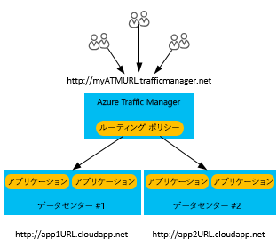
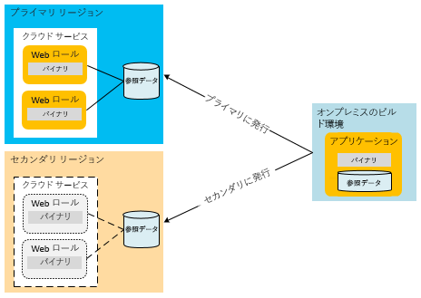
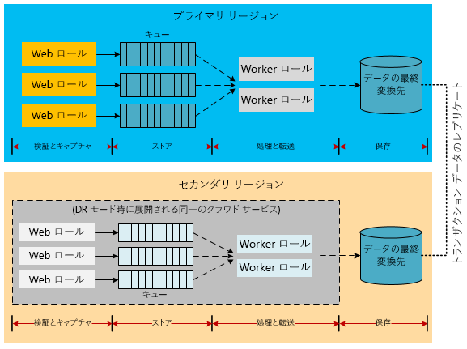
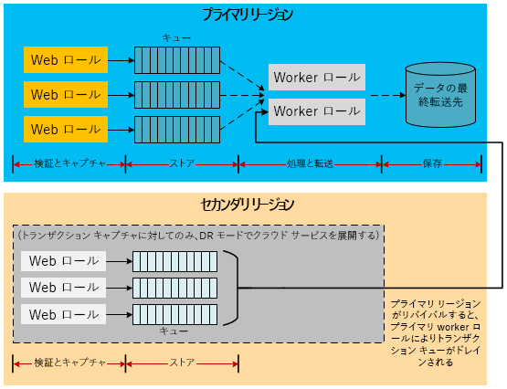
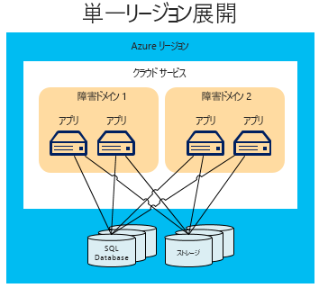
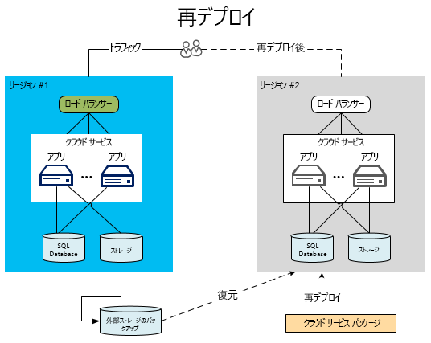
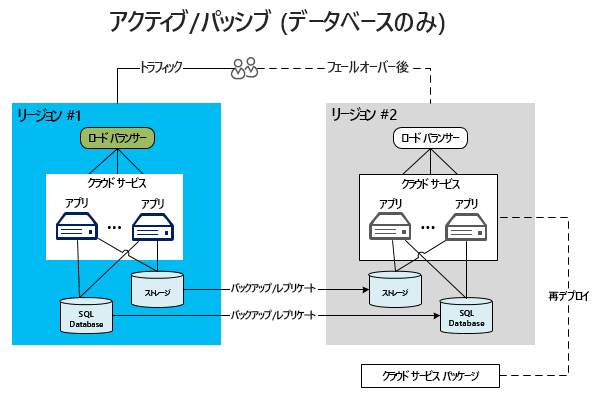
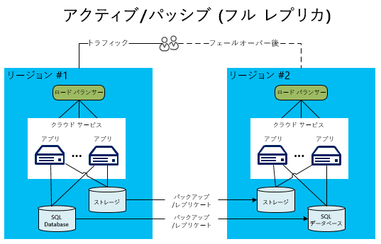
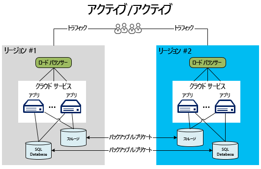

# Azure アプリケーションのディザスター リカバリーDisaster recovery for Azure applications

ディザスター リカバリー (DR) は、アプリケーションの機能の致命的な損失からの復旧に重点を置きます。Disaster recovery (DR) is focused on recovering from a catastrophic loss of application functionality. たとえば、アプリケーションをホストしている Azure リージョンが使用できなくなった場合は、アプリケーションの実行またはデータへのアクセスを別のリージョンで行うための計画が必要です。For example, if an Azure region hosting your application becomes unavailable, you need a plan for running your application or accessing your data in another region.

ビジネスおよびテクノロジ関連の所有者は、障害発生時にどのくらいの機能が必要かを決定する必要があります。Business and technology owners must determine how much functionality is required during a disaster. この機能レベルには、完全に使用不可能、機能制限または処理の遅延により部分的に使用可能、完全に使用可能など、いくつかの形態があります。This level of functionality can take a few forms: completely unavailable, partially available via reduced functionality or delayed processing, or fully available.

回復性戦略および高可用性戦略は、一時的な障害状態を処理することを目的とします。Resiliency and high availability strategies are intended for handling temporary failure conditions.  この計画の実行には、システムを継続的に機能させるユーザー、プロセス、およびサポート アプリケーションが必要です。Executing this plan involves people, processes, and supporting applications that allow the system to continue functioning. 計画が完全かどうかを確認するために、計画には、障害のリハーサルおよびデータベースの復旧テストを含める必要があります。Your plan should include rehearsing failures and testing the recovery of databases to ensure the plan is sound.

## Azure のディザスター リカバリー機能Azure disaster recovery features

可用性を考慮して、Azure にはディザスター リカバリーをサポートするために設計された[回復性技術ガイダンス](./index.md)が用意されています。As with availability considerations, Azure provides [resiliency technical guidance](./index.md) designed to support disaster recovery. また、Azure の可用性機能とディザスター リカバリーには関連性があります。There is also a relationship between availability features of Azure and disaster recovery. たとえば、複数の障害ドメインを対象にロールを管理すると、アプリケーションの可用性が向上します。For example, the management of roles across fault domains increases the availability of an application. そのような管理を行わないと、ハンドルされないハードウェア障害が "障害" シナリオになります。Without that management, an unhandled hardware failure would become a “disaster” scenario. 可用性についてこれらの機能と戦略を活用することは、ご利用のアプリケーションの防災面において重要です。Leveraging these availability features and strategies is an important part of disaster-proofing your application. ただし、この記事では、一般的な可用性の問題に留まらず、さらに重大な (かつまれな) 障害について考えます。However, this article goes beyond general availability issues to more serious (and rarer) disaster events.

## 複数のデータセンター リージョンMultiple datacenter regions

Azure のデータセンターは、世界中のさまざまなリージョンにあります。Azure maintains datacenters in many regions around the world. このインフラストラクチャにより、システムによって行われる Azure Storage のセカンダリ リージョンへの geo レプリケーションなど、複数のディザスター リカバリー シナリオがサポートされます。This infrastructure supports several disaster recovery scenarios, such as system-provided geo-replication of Azure Storage to secondary regions. また、世界中の複数の場所にクラウド サービスを簡単かつ安価にデプロイすることもできます。You can also easily and inexpensively deploy a cloud service to multiple locations around the world. 複数のリージョンで独自にデータセンターを構築し維持する場合のコストおよび難しさと比べてみてください。Compare this with the cost and difficulty of building and maintaining your own datacenters in multiple regions. 複数のリージョンにデータとサービスをデプロイすると、1 つのリージョンでの大規模な停止からアプリケーションを保護するのに役立ちます。Deploying data and services to multiple regions helps protect your application from a major outage in a single region. ディザスター リカバリー計画を策定するときには、ペアになっているリージョンの概念を理解することが重要です。As you design your disaster recovery plan, it’s important to understand the concept of paired regions. 詳しくは、「[ビジネス継続性とディザスター リカバリー (BCDR):Azure のペアになっているリージョン](/azure/best-practices-availability-paired-regions)」をご覧ください。For more information, see [Business continuity and disaster recovery (BCDR): Azure Paired Regions](/azure/best-practices-availability-paired-regions).

## Azure Site RecoveryAzure Site Recovery

[Azure Site Recovery](/azure/site-recovery/) により、リージョン間で Azure VM を簡単にレプリケートできます。[Azure Site Recovery](/azure/site-recovery/) provides a simple way to replicate Azure VMs between regions. セカンダリ リージョンで追加リソースをプロビジョニングする必要はないため、管理オーバーヘッドは最小限で済みます。It has minimal management overhead, because you don't need to provision any additional resources in the secondary region. レプリケーションを有効にすると、ソースの VM の設定に基づいて、ターゲット リージョンに必要なリソースが自動的に作成されます。When you enable replication, Site Recovery automatically creates the required resources in the target region, based on the source VM settings. 継続的なレプリケーションが自動的に行われ、1 回クリックするだけでアプリケーションのフェールオーバーを実行できます。It provides automated continuous replication, and enables you to perform application failover with a single click. また、テスト フェールオーバーにより、ディザスター リカバリーのテストを、実稼働ワークロードや進行中のレプリケーションに影響を与えずに実行できます。You can also run disaster recovery drills by testing failover, without affecting your production workloads or ongoing replication.

## Azure の Traffic ManagerAzure Traffic Manager

リージョンに固有の障害が発生した場合は、別のリージョンのサービスまたはデプロイにトラフィックをリダイレクトする必要があります。When a region-specific failure occurs, you must redirect traffic to services or deployments in another region. これについては、Azure の Traffic Manager (プライマリ リージョンで障害が発生した場合にユーザー トラフィックを別のリージョンに自動的にフェールオーバーする) などのサービスを介して処理するのが最も効果的です。It is most effective to handle this via services such as Azure Traffic Manager, which automates the failover of user traffic to another region if the primary region fails. 効果的な DR 戦略を設計する場合には、Traffic Manager の基本を理解することが重要です。Understanding the fundamentals of Traffic Manager is important when designing an effective DR strategy.

Traffic Manager では、ドメイン ネーム システム (DNS) を使用して、トラフィック ルーティング方法とエンドポイントの正常性に基づいて最適なエンドポイントにクライアント要求を送信します。Traffic Manager uses the Domain Name System (DNS) to direct client requests to the most appropriate endpoint based on a traffic-routing method and the health of the endpoints. 次の図で、ユーザーは、実際のサイト URL (`http://app1URL.cloudapp.net` と `http://app2URL.cloudapp.net`) を抽象化した Traffic Manager URL (`http://myATMURL.trafficmanager.net`) に接続しています。In the following diagram, users connect to a Traffic Manager URL (`http://myATMURL.trafficmanager.net`) which abstracts the actual site URLs (`http://app1URL.cloudapp.net` and `http://app2URL.cloudapp.net`). ユーザー要求は、構成した [Traffic Manager のルーティング方法](/azure/traffic-manager/traffic-manager-routing-methods)に基づいて、適切な基になる URL にルーティングされます。User requests are routed to the proper underlying URL based on your configured [Traffic Manager routing method](/azure/traffic-manager/traffic-manager-routing-methods). この記事では、フェールオーバー オプションのみを考慮します。For the sake of this article, we will be concerned with only the failover option.

Traffic Manager を構成する場合は、新しい Traffic Manager の DNS プレフィックスを指定します。ユーザーはこれを使用して所定のサービスにアクセスします。When configuring Traffic Manager, you provide a new Traffic Manager DNS prefix, which users will use to access your service. これにより、Traffic Manager はリージョン レベルより 1 レベル上で負荷分散を抽象化します。Traffic Manager now abstracts load balancing one level higher that the regional level. Traffic Manager の DNS は、管理するすべてのデプロイの CNAME レコードに対応します。The Traffic Manager DNS maps to a CNAME for all the deployments that it manages.

Traffic Manager 内では、障害発生時にユーザーがルーティングされるデプロイの優先度リストを指定します。Within Traffic Manager, you specify a prioritized list of deployments that users will be routed to when failure occurs. Traffic Manager はデプロイのエンドポイントを監視します。Traffic Manager monitors the deployment endpoints. プライマリ デプロイが利用不可になった場合、Traffic Manager は優先度リストに登録されている次のデプロイにユーザーをルーティングします。If the primary deployment becomes unavailable, Traffic Manager routes users to the next deployment on the priority list.

フェールオーバー先は Traffic Manager が決定しますが、ユーザーはフェールオーバー モードではないときにフェールオーバー ドメインを休止状態にするかアクティブにするかを決定できます (これは Traffic Manager には関係ありません)。Although Traffic Manager decides where to go during a failover, you can decide whether your failover domain is dormant or active while you're not in failover mode (which is unrelated to Traffic Manager). プライマリ サイトが現在、ユーザーにサービスを提供しているかどうかに関係なく、Traffic Manager はプライマリ サイトでの障害を検出し、フェールオーバー サイトへのロールオーバーを実行します。Traffic Manager detects a failure in the primary site and rolls over to the failover site, regardless of whether that site is currently serving users.

Azure Traffic Manager の機能の詳細については、次を参照してください。For more information on how Azure Traffic Manager works, refer to:

- [Traffic Manager の概要Traffic Manager overview](/azure/traffic-manager/traffic-manager-overview/)
- [Traffic Manager のルーティング方法Traffic Manager routing methods](/azure/traffic-manager/traffic-manager-routing-methods)
- [フェールオーバーのルーティング方法の構成Configure failover routing method](/azure/traffic-manager/traffic-manager-configure-failover-routing-method/)

## Azure の障害シナリオAzure disaster scenarios

以下のセクションでは、障害シナリオのさまざまな種類について説明します。The following sections cover several different types of disaster scenarios. リージョン全体にわたるサービスの中断が、アプリケーション全体の障害の唯一の原因ではありません。Region-wide service disruptions are not the only cause of application-wide failures. 不適切な設計および管理エラーも停止の原因になる可能性があります。Poor design and administrative errors can also lead to outages. 復旧計画の設計フェーズとテスト フェーズの両方で、障害が発生する可能性のある原因を検討することが重要です。It's important to consider the possible causes of a failure during both the design and testing phases of your recovery plan. 適切な計画を作成するには、Azure の機能を利用したうえで、アプリケーション固有の戦略に合わせて補強します。A good plan takes advantage of Azure features and augments them with application-specific strategies. どのような対応を選択するかは、アプリケーションの重要性、目標復旧時点 (RPO)、目標復旧時間 (RTO) によって決まります。The chosen response is determined by the importance of the application, the recovery point objective (RPO), and the recovery time objective (RTO).

### アプリケーションの障害Application failure

Azure Traffic Manager は、ホスト仮想マシンの基になるハードウェアまたはオペレーティング システム ソフトウェアに起因する障害を自動的に処理します。Azure Traffic Manager automatically handles failures that result from the underlying hardware or operating system software in the host virtual machine. Azure は新しいロール インスタンスを作成し、使用可能なプールに追加します。Azure creates a new role instance and adds it to the available pool. 複数のロール インスタンスが既に実行されている場合、Azure では、障害が発生したノードを交換している間、実行している他のロール インスタンスに処理を移動します。If more than one role instance was already running, Azure shifts processing to the other running role instances while replacing the failed node.

ハードウェアまたはオペレーティング システムに基になる障害がなくても、重大なアプリケーション エラーが発生する場合があります。Serious application errors can occur without any underlying failure of the hardware or operating system. 不適切なロジックやデータ整合性の問題が原因の致命的な例外により、アプリケーションで障害が発生する可能性があります。The application might fail due to catastrophic exceptions caused by bad logic or data integrity issues. 十分なテレメトリをアプリケーション コードに組み込み、監視システムが障害状態を検出して、アプリケーション管理者に通知できるようにする必要があります。You must include sufficient telemetry in the application code so that a monitoring system can detect failure conditions and notify an application administrator. ディザスター リカバリー プロセスに関して豊富な知識を持つ管理者は、重大なエラーの解決中に、フェールオーバー プロセスを呼び出すか、可用性の停止を受け入れるかを決定することができます。An administrator who has full knowledge of the disaster recovery processes can decide whether to trigger a failover process or accept an availability outage while resolving the critical errors.

### データの破損Data corruption

Azure は自動的に、Azure SQL Database と Azure Storage のデータを、同じリージョン内の異なる障害ドメインに 3 回冗長的に格納します。Azure automatically stores Azure SQL Database and Azure Storage data three times redundantly within different fault domains in the same region. geo レプリケーションを使用している場合は、さらに 3 回、異なるリージョンに格納します。If you use geo-replication, the data is stored three additional times in a different region. ただし、ユーザーまたはアプリケーションがプライマリ コピーでデータを破損した場合は、たちまち他のコピーにレプリケートされます。However, if your users or your application corrupts that data in the primary copy, the data quickly replicates to the other copies. 残念ながら、結果として破損したデータのコピーが複数作成されます。Unfortunately, this results in multiple copies of corrupt data.

データが破損する可能性を管理するには、2 つのオプションがあります。To manage potential corruption of your data, you have two options. 第 1 の方法は、カスタム バックアップの管理です。First, you can manage a custom backup strategy. ビジネス要件やガバナンス規定に応じて、Azure またはオンプレミスにバックアップを格納できます。You can store your backups in Azure or on-premises, depending on your business requirements or governance regulations. 第 2 の方法は、SQL Database を復旧するためのポイントインタイム リストア オプションの使用です。Another option is to use the point-in-time restore option to recover a SQL database. 詳細については、後述する[ディザスター リカバリーのためのデータ戦略](#data-strategies-for-disaster-recovery)に関するセクションをご覧ください。For more information, see the [data strategies for disaster recovery](#data-strategies-for-disaster-recovery) section below.

### ネットワークの停止Network outage

Azure ネットワークの一部にアクセスできないと、アプリケーションまたはデータを利用できなくなる可能性があります。When parts of the Azure network are inaccessible, you may be unable to access your application or data. ネットワークの問題のために利用できないロール インスタンスがある場合、Azure はアプリケーションの残りの使用可能なインスタンスを利用します。If one or more role instances are unavailable due to network issues, Azure uses the remaining available instances of your application. Azure ネットワークの停止のためにアプリケーションがデータにアクセスできない場合でも、キャッシュされているデータを使用すれば、アプリケーションの機能を制限した状態でローカルに実行できる可能性があります。If your application cannot access its data because of an Azure network outage, you can potentially run with reduced application functionality locally by using cached data. アプリケーションの機能を制限して実行するには、ディザスター リカバリー戦略を設計する必要があります。You need to design the disaster recovery strategy to run with reduced functionality in your application. ただし、アプリケーションによっては現実的ではないことがあります。For some applications, this might not be practical.

もう 1 つのオプションは、接続が回復するまで別の場所にデータを格納することです。Another option is to store data in an alternate location until connectivity is restored. 機能の制限を使用できない場合に残されているオプションは、アプリケーションのダウンタイムまたは代替リージョンへのフェールオーバーです。If reducing functionality is not an option, the remaining options are application downtime or failover to an alternate region. 機能を制限して実行するアプリケーションの設計は、技術的な決定であると同時にビジネス上の決定でもあります。The design of an application running with reduced functionality is as much a business decision as a technical one. この詳細については、「[アプリケーションの機能制限](#reduced-application-functionality)」を参照してください。This is discussed further in the section on [reduced application functionality](#reduced-application-functionality).

### 依存サービスの障害Failure of a dependent service

Azure では、定期的にダウンタイムが発生する可能性のある多くのサービスが提供されています。Azure provides many services that can experience periodic downtime. たとえば、[Azure Redis Cache](https://azure.microsoft.com/services/cache/) は、アプリケーションにキャッシュ機能を提供するマルチテナント サービスです。For example, [Azure Redis Cache](https://azure.microsoft.com/services/cache/) is a multi-tenant service which provides caching capabilities to your application. 依存サービスが利用できない場合にアプリケーションがどのようになるかを考慮することが重要です。It's important to consider what happens in your application if the dependent service is unavailable. 多くの点で、このシナリオはネットワーク停止シナリオに似ています。In many ways, this scenario is similar to the network outage scenario. ただし、各サービスを個別に考慮することで、計画全体が向上する可能性があります。However, considering each service independently results in potential improvements to your overall plan.

Azure Redis Cache は、クラウド サービスのデプロイ内からアプリケーションにキャッシュを提供し、ディザスター リカバリーのメリットがあります。Azure Redis Cache provides caching to your application from within your cloud service deployment, which provides disaster recovery benefits. 何よりもまず、サービスはデプロイにローカルなロールで実行しています。First, the service now runs on roles that are local to your deployment. そのため、クラウド サービスの全体的な管理プロセスの一部として、キャッシュの状態を監視および管理できるようになります。Therefore, you're better able to monitor and manage the status of the cache as part of your overall management processes for the cloud service. この種のキャッシュでは、キャッシュされたデータの高可用性などの新しい機能も利用できます。この機能では、重複したコピーを他のノードで維持することにより、単一のノードで障害が発生した場合に、キャッシュされたデータを保護します。This type of caching also exposes new features such as high availability for cached data, which preserves cached data if a single node fails by maintaining duplicate copies on other nodes.

高可用性を使用すると、書き込み操作でセカンダリ コピーを更新することも必要であるため、スループットが低下し、待機時間が長くなることに注意してください。Note that high availability decreases throughput and increases latency because write operations must also update any secondary copies. キャッシュされたデータを格納するために必要なメモリ量は事実上 2 倍になるので、容量計画の策定時には、このことを考慮する必要があります。The amount of memory required to store the cached data is effectively doubled, which must be taken into account during capacity planning.  この例では、各依存サービスが、全体的な可用性と致命的な障害に対する抵抗力を高める可能性があることを示します。This example demonstrates that each dependent service might have capabilities that improve your overall availability and resistance to catastrophic failures.

各依存サービスについて、サービス中断の影響を理解する必要があります。With each dependent service, you should understand the implications of a service disruption. キャッシュの例では、キャッシュが復元されるまで、データベースのデータに直接アクセスできる場合があります。In the caching example, it might be possible to access the data directly from a database until you restore your cache. その場合は、アプリケーション データへのフル アクセスを提供する間、パフォーマンスが低下することになります。This would result in reduced performance while providing full access to application data.

### リージョン全体にわたるサービスの停止Region-wide service disruption

これまでの障害は主として、同じ Azure リージョン内で管理できる障害でした。The previous failures have primarily been failures that can be managed within the same Azure region. ただし、リージョン全体のサービスが中断する可能性に対しても準備する必要があります。However, you must also prepare for the possibility that there is a service disruption of the entire region. リージョン全体のサービス中断が発生した場合、データのローカルな冗長コピーは使用できません。If a region-wide service disruption occurs, the locally redundant copies of your data are not available. geo レプリケーションを有効にしてある場合は、BLOB とテーブルのコピーがさらに 3 つ、別のリージョン内に存在します。If you have enabled geo-replication, there are three additional copies of your blobs and tables in a different region. Microsoft によってリージョンの喪失が宣言された場合、Azure は geo レプリケートされたリージョンにすべての DNS エントリを再マッピングします。If Microsoft declares the region lost, Azure remaps all of the DNS entries to the geo-replicated region.

> [!NOTE]
> ユーザーはこのプロセスを制御できないこと、およびリージョン全体のサービス中断の場合にのみ行われることに注意してください。Be aware that you don't have any control over this process, and it will occur only for region-wide service disruption. RPO や RTO を向上させるには、[Azure Site Recovery](/azure/site-recovery/) を使うことを検討してください。Consider using [Azure Site Recovery](/azure/site-recovery/) to achieve better RPO and RTO. Site Recovery を使うことにより、アプリケーションでは、許容できる障害と、レプリケートされた VM にフェールオーバーするタイミングを決定できます。Site Recovery allows application to decide what is an acceptable outage, and when to fail over to the replicated VMs.

### Azure 全体にわたるサービスの中断Azure-wide service disruption

障害計画では、可能性のある障害の全範囲を考慮する必要があります。In disaster planning, you must consider the entire range of possible disasters. 最も重大なサービス中断の 1 つは、すべての Azure リージョンに同時に関係するものです。One of the most severe service disruptions would involve all Azure regions simultaneously. 他のサービス中断と同様に、そのような場合は一時的なダウンタイムのリスクを受け入れる決断もあり得ます。As with other service disruptions, you might decide to accept the risk of temporary downtime in that event. 複数のリージョンにまたがる広範囲のサービス中断が発生する可能性は、依存サービスや単一のリージョンが関係する部分的なサービス中断よりはるかに低いものです。Widespread service disruptions that span regions are much rarer than isolated service disruptions involving dependent services or single regions.

ただし、一部のミッション クリティカルなアプリケーションには複数リージョンのサービス中断に対応するバックアップ計画が必要であると判断できます。However, you may decide that certain mission-critical applications require a backup plan for a multi-region service disruption. このような計画には、[代替クラウド](#alternative-cloud)または、[オンプレミスとクラウドのハイブリッド ソリューション](#hybrid-on-premises-and-cloud-solution)のサービスへのフェールオーバーが含まれます。This plan might include failing over to services in an [alternative cloud](#alternative-cloud) or a [hybrid on-premises and cloud solution](#hybrid-on-premises-and-cloud-solution).

### アプリケーションの機能制限Reduced application functionality

適切に設計されたアプリケーションは通常、疎結合された情報交換パターンの実装を介して相互に通信するサービスを使用します。A well-designed application typically uses services that communicate with each other though the implementation of loosely coupled information-interchange patterns. DR に適したアプリケーションには、サービス レベルでの役割の分離が必要です。A DR-friendly application requires separation of responsibilities at the service level. これにより、依存サービスの中断によってアプリケーション全体がダウンするのを防ぐことができます。This prevents the disruption of a dependent service from bringing down the entire application. たとえば、会社 Y の Web コマース アプリケーションについて考えます。たとえば次のようなモジュールがアプリケーションを構成します。For example, consider a web commerce application for Company Y. The following modules might constitute the application:

- **製品カタログ** : ユーザーが製品を参照できるようにします。**Product Catalog** allows users to browse products.
- **ショッピング カート** : ユーザーはショッピング カートの製品を追加/削除できます。**Shopping Cart** allows users to add/remove products in their shopping cart.
- **注文状態** : ユーザーの注文の出荷状態を示します。**Order Status** shows the shipping status of user orders.
- **注文送信** : 支払いを含む注文を送信して、ショッピング セッションを終了します。**Order Submission** finalizes the shopping session by submitting the order with payment.
- **注文処理** : 注文のデータ整合性を確認し、在庫チェックを実行します。**Order Processing** validates the order for data integrity and performs a quantity availability check.

このアプリケーションにおけるサービスの依存関係が利用不可になった場合、依存関係が回復するまで、サービスはどのように機能するのでしょうか? When a service dependency in this application becomes unavailable, how does the service function until the dependency recovers? 適切に設計されたシステムでは、設計時および実行時の両方で役割の分離によって分離境界が実装されます。A well-designed system implements isolation boundaries through separation of responsibilities, both at design time and at runtime. すべての障害は、回復可能または回復不可能として分類できます。You can categorize every failure as recoverable and non-recoverable. 回復不可能なエラーはサービスをダウンさせますが、回復可能なエラーは代替手段によって軽減できます。Non-recoverable errors will bring down the service, but you can mitigate a recoverable error through alternatives. 自動的なエラー処理と代替アクションによって対処される一部の問題は、ユーザーに対して透過的です。Certain problems addressed by automatically handling faults and taking alternate actions are transparent to the user. さらに重大なサービスの中断中は、アプリケーションが完全に利用できなくなることがあります。During a more serious service disruption, the application might be completely unavailable. 3 番目のオプションは、機能を制限してユーザー要求の処理を続行するというものです。A third option is to continue handling user requests with reduced functionality.

たとえば、注文をホストするためのデータベースで障害が発生した場合、注文処理サービスは販売トランザクションを処理できなくなります。For instance, if the database for hosting orders goes down, the Order Processing service loses its ability to process sales transactions. アーキテクチャによっては、アプリケーションの注文送信と注文処理サービスの続行が困難または不可能になることがあります。Depending on the architecture, it might be difficult or impossible for the Order Submission and Order Processing services of the application to continue. このようなシナリオに対応するようにアプリケーションが設計されていない場合、アプリケーション全体がオフラインになる可能性があります。If the application is not designed to handle this scenario, the entire application might go offline. ただし、製品のデータが別の場所に格納されている場合は、製品カタログ モジュールを使用して製品を表示できます。However, if the product data is stored in a different location, then the Product Catalog module can still be used for viewing products. ただし、注文や在庫照会などのアプリケーションの他の部分は利用できません。However, other parts of the application are unavailable, such as ordering or inventory queries.

適用するアプリケーションの機能制限の内容については、ビジネス面と技術面の両方を考慮して決定します。Deciding what reduced application functionality is available is both a business decision and a technical decision. アプリケーションが一時的な問題をユーザーに通知する方法も決定する必要があります。You must decide how the application will inform the users of any temporary problems. 上記の例では、製品を表示し、ショッピング カートに製品を追加することができます。In the example above, the application might allow viewing products and adding them to a shopping cart. ただし、ユーザーが購入しようとすると、アプリケーションはユーザーに注文機能が一時的に利用不可であることを通知します。However, when the user attempts to make a purchase, the application notifies the user that the ordering functionality is temporarily unavailable. 顧客にとって最善ではありませんが、アプリケーション全体のサービス中断は避けられます。This isn't ideal for the customer, but it does prevent an application-wide service disruption.

## 障害復旧のためのデータ戦略Data strategies for disaster recovery

適切なデータ処理は、ディザスター リカバリー計画における難しい課題です。Proper data handling is a challenging aspect of a disaster recovery plan. 通常、回復プロセス中はデータの復元に最も時間がかかります。During the recovery process, data restoration typically takes the most time. 機能を制限するうえでのさまざまな選択は、障害からのデータ復旧および障害後の整合性に対する困難な課題になります。Different choices for reducing functionality result in difficult challenges for data recovery from failure and consistency after failure.

考慮事項の 1 つは、アプリケーションのデータのコピーの復元または保持の必要性です。One consideration is the need to restore or maintain a copy of the application’s data. このデータは、セカンダリ サイトでの参照とトランザクションの目的に使用されます。You will use this data for reference and transactional purposes at a secondary site. オンプレミスのデプロイでは、複数リージョンのディザスター リカバリー戦略を実装するためにコストと時間のかかる計画プロセスが必要です。An on-premises deployment requires an expensive and lengthy planning process to implement a multiple-region disaster recovery strategy. さいわい、Azure を含むほとんどのクラウド プロバイダーでは、複数のリージョンにアプリケーションを簡単にデプロイできます。Conveniently, most cloud providers, including Azure, readily allow the deployment of applications to multiple regions. これらのリージョンは、複数リージョンのサービス中断が非常にまれになるように地理的に分散されています。These regions are geographically distributed in such a way that multiple-region service disruption should be extremely rare. 異なるリージョン間でデータを処理するための戦略は、ディザスター リカバリー計画を成功に導く要素の 1 つです。The strategy for handling data across regions is one of the contributing factors for the success of any disaster recovery plan.

以下のセクションでは、データのバックアップ、参照データ、およびトランザクション データに関連するディザスター リカバリー テクニックについて説明します。The following sections discuss disaster recovery techniques related to data backups, reference data, and transactional data.

### バックアップと復元Backup and restore

アプリケーション データの定期的なバックアップにより、一部のディザスター リカバリー シナリオに対応できます。Regular backups of application data can support some disaster recovery scenarios. ストレージ リソースが異なると、必要な手法も異なります。Different storage resources require different techniques.

#### SQL DatabaseSQL Database

Basic、Standard、および Premium の SQL Database 階層の場合、データベースの復旧にポイントインタイム リストアを利用できます。For the Basic, Standard, and Premium SQL Database tiers, you can take advantage of point-in-time restore to recover your database. 詳細については、[SQL Database を使用したクラウド ビジネス継続性とデータベース ディザスター リカバリーの概要](/azure/sql-database/sql-database-business-continuity/)に関するページを参照してください。For more information, see [Overview: Cloud business continuity and database disaster recovery with SQL Database](/azure/sql-database/sql-database-business-continuity/). もう 1 つのオプションは、SQL Database にアクティブ geo レプリケーションを使うことです。Another option is to use Active Geo-Replication for SQL Database. この機能は、データベースの変更を、同じ Azure リージョンまたは別の Azure リージョンのセカンダリ データベースに、自動的にレプリケートします。This automatically replicates database changes to secondary databases in the same Azure region or even in a different Azure region. これは、この記事で説明されている、より手動的なデータ同期技法の一部に対する代替手段になる可能性があります。This provides a potential alternative to some of the more manual data synchronization techniques presented in this article. 詳細については、「[SQL Database のアクティブ geo レプリケーション](/azure/sql-database/sql-database-geo-replication-overview/)」を参照してください。For more information, see [Overview: SQL Database Active Geo-Replication](/azure/sql-database/sql-database-geo-replication-overview/).

もっと手動的なバックアップおよび復元の方法を使用することもできます。You can also use a more manual approach for backup and restore. DATABASE COPY コマンドを使用して、トランザクションの一貫性を保つ、データベースのバックアップ コピーを作成できます。Use the DATABASE COPY command to create a backup copy of the database with transactional consistency. Azure SQL Database のインポート/エクスポート サービスを使用することもできます。このサービスでは、Azure Blob Storage に格納されている BACPAC ファイル (ご利用のデータベース スキーマおよび関連するデータを含む圧縮されたファイル) へのデータベースのエクスポートをサポートします。You can also use the import/export service of Azure SQL Database, which supports exporting databases to BACPAC files (compressed files containing your database schema and associated data) that are stored in Azure Blob storage.

Azure Storage に組み込まれている冗長性により、バックアップ ファイルの 2 個のレプリカが同じリージョンに作成されます。The built-in redundancy of Azure Storage creates two replicas of the backup file in the same region. ただし、バックアップ プロセスを実行する頻度により、障害シナリオで失われる可能性があるデータ量を表す RPO が決まります。However, the frequency of running the backup process determines your RPO, which is the amount of data you might lose in disaster scenarios. たとえば、毎正時にバックアップを実行していて、正時の 2 分前に障害が発生したとしましょう。For example, imagine that you perform a backup at the top of each hour, and a disaster occurs two minutes before the top of the hour. 最後のバックアップが実行されてからの 58 分間に記録されたデータは失われます。You lose 58 minutes of data recorded after the last backup was performed. また、リージョン全体のサービス中断を防ぐには、BACPAC ファイルを代替リージョンにコピーする必要があります。Also, to protect against a region-wide service disruption, you should copy the BACPAC files to an alternate region. その場合、代替リージョンのバックアップを復元することができます。You then have the option of restoring those backups in the alternate region. 詳細については、[SQL Database を使用したクラウド ビジネス継続性とデータベース ディザスター リカバリーの概要](/azure/sql-database/sql-database-business-continuity/)に関するページを参照してください。For more details, see [Overview: Cloud business continuity and database disaster recovery with SQL Database](/azure/sql-database/sql-database-business-continuity/).

#### SQL Data WarehouseSQL Data Warehouse

SQL Data Warehouse については、[geo バックアップ](/azure/sql-data-warehouse/backup-and-restore#geo-backups)を使用して、ディザスター リカバリー用のペア リージョンに復元します。For SQL Data Warehouse, use [geo-backups](/azure/sql-data-warehouse/backup-and-restore#geo-backups) to restore to a paired region for disaster recovery. これらのバックアップは、24 時間ごとに作成され、20 分以内にペア リージョンに復元できます。These backups are taken every 24 hours and can be restore within 20 minutes in the paired region. この機能は、既定ですべての SQL データ ウェアハウスで有効になっています。This feature is on by default for all SQL data warehouses. ご使用のデータ ウェアハウスを復元する方法の詳細については、「[PowerShell を使用して Azure 地理的リージョンから復元する](/azure/sql-data-warehouse/sql-data-warehouse-restore#restore-from-an-azure-geographical-region-using-powershell)」を参照してください。For more information on how to restore your data warehouse, see [Restore from an Azure geographical region using PowerShell](/azure/sql-data-warehouse/sql-data-warehouse-restore#restore-from-an-azure-geographical-region-using-powershell).

#### Azure StorageAzure Storage

Azure Storage の場合、カスタム バックアップ プロセスを開発したり、多くのサード パーティ製バックアップ ツールのいずれかを使用したりすることができます。For Azure Storage, you can develop a custom backup process or use one of many third-party backup tools. ストレージ リソース間に相互参照があるほとんどのアプリケーション設計では、複雑さが増すことに注意してください。Note that most application designs have additional complexities where storage resources reference each other. たとえば、Azure Storage の BLOB にリンクしている列を含む SQL データベースがあるものとします。For example, consider a SQL database that has a column that links to a blob in Azure Storage. バックアップが同時に実行されない場合、データベースには、障害発生前にバックアップされなかった BLOB へのポインターが含まれる可能性があります。If the backups do not happen simultaneously, the database might have a pointer to a blob that was not backed up before the failure. アプリケーションまたはディザスター リカバリー計画では、復旧後のこのような不整合を処理するプロセスを実装する必要があります。The application or disaster recovery plan must implement processes to handle this inconsistency after a recovery.

#### 他のデータ プラットフォームOther data platforms

Elasticsearch や MongoDB など、サービスとしてのインフラストラクチャ (IaaS) でホストされる他のプラットフォームでバックアップと復元の統合プロセスを作成する場合は、独自の機能および考慮事項が存在します。Other infrastructure-as-a-service (IaaS) hosted data platforms, such as Elasticsearch or MongoDB, have their own capabilities and considerations when creating an integrated backup and restore process. これらのデータ プラットフォームに対して、一般的には、ネイティブの、または利用可能な統合ベースのレプリケーションまたはスナップショット機能を使用することをお勧めします。For these data platforms, the general recommendation is to use any native or available integration-based replication or snapshotting capabilities. それらの機能が存在しないか、または適切でない場合は、Azure Backup サービスまたはマネージ/アンマネージ ディスク スナップショットを使用して、アプリケーション データの特定時点のコピーを作成することを検討してください。If those capabilities do not exist or are not suitable, then consider using Azure Backup Service or managed/unmanaged disk snapshots to create a point-in-time copy of application data. すべてのケースにおいて、一貫性のあるバックアップを実現する方法を決定することが重要です。特に、そのことは、アプリケーション データが複数のファイル システムにまたがる場合や、ボリューム マネージャーやソフトウェア ベースの RAID を使用して 1 つのファイル システムに複数のドライブを結合する場合に重要です。In all cases, it’s important to determine how to achieve consistent backups, especially when application data spans multiple files systems, or when multiple drives are combined into a single file system using volume managers or software-based RAID.

### 障害復旧のための参照データ パターンReference data pattern for disaster recovery

参照データはアプリケーションの機能をサポートする読み取り専用のデータです。Reference data is read-only data that supports application functionality. 通常、頻繁に変更されることはありません。It typically does not change frequently. バックアップと復元はリージョン全体にわたるサービス中断を処理する 1 つの方法ですが、RTO は比較的長くなります。Although backup and restore is one method to handle region-wide service disruptions, the RTO is relatively long. セカンダリ リージョンにアプリケーションをデプロイする場合、参照データの RTO を改善する方法がいくつかあります。When you deploy the application to a secondary region, some strategies can improve the RTO for reference data.

参照データは頻繁に変化しないので、参照データの永続的なコピーをセカンダリ リージョンに保持することで、RTO を改善できます。Because reference data changes infrequently, you can improve the RTO by maintaining a permanent copy of the reference data in the secondary region. これにより、障害発生時にバックアップを復元するために必要な時間がなくなります。This eliminates the time required to restore backups in the event of a disaster. 複数リージョンのディザスター リカバリーの要件を満たすには、アプリケーションと参照データを一緒に複数のリージョンにデプロイする必要があります。To meet the multiple-region disaster recovery requirements, you must deploy the application and the reference data together in multiple regions. 参照データは、ロール自体、外部ストレージ、またはその両方の組み合わせにデプロイできます。You can deploy reference data to the role itself, to external storage, or to a combination of both.

コンピューティング ノード内の参照データ デプロイ モデルは、ディザスター リカバリーの要件を暗黙的に満たします。The reference data deployment model within compute nodes implicitly satisfies the disaster recovery requirements. SQL Database への参照データのデプロイでは、各リージョンに参照データのコピーをデプロイする必要があります。Reference data deployment to SQL Database requires that you deploy a copy of the reference data to each region. Azure Storage にも同じ方法が当てはまります。The same strategy applies to Azure Storage. Azure Storage に格納されている参照データのコピーを、プライマリ リージョンとセカンダリ リージョンにデプロイする必要があります。You must deploy a copy of any reference data that's stored in Azure Storage to the primary and secondary regions.

参照データを含むすべてのデータに対して、アプリケーション固有のバックアップ ルーチンを独自に実装する必要があります。You must implement your own application-specific backup routines for all data, including reference data. リージョン間で geo レプリケートされたコピーは、リージョン全体のサービス中断においてのみ使用されます。Geo-replicated copies across regions are used only in a region-wide service disruption. 長時間のダウンタイムを回避するには、アプリケーションのデータのミッション クリティカルな部分をセカンダリ リージョンにデプロイします。To prevent extended downtime, deploy the mission-critical parts of the application’s data to the secondary region. このトポロジの例については、 [アクティブ/パッシブ モデル](#active-passive)に関するセクションを参照してください。For an example of this topology, see the [active-passive model](#active-passive).

### 障害復旧のためのトランザクション データ パターンTransactional data pattern for disaster recovery

完全に機能する障害モード戦略の実装では、セカンダリ リージョンにトランザクション データを非同期にレプリケートする必要があります。Implementation of a fully functional disaster mode strategy requires asynchronous replication of the transactional data to the secondary region. レプリケーションを実行できる実際の時間枠により、アプリケーションの RPO 特性が決まります。The practical time windows within which the replication can occur will determine the RPO characteristics of the application. それでも、レプリケーションの時間枠の間にプライマリ リージョンから失われたデータを回復する可能性があります。You might still recover the data that was lost from the primary region during the replication window. また、後でセカンダリ リージョンとマージできる場合があります。You might also be able to merge with the secondary region later.

次のアーキテクチャの例では、フェールオーバー シナリオでのトランザクション データのさまざまな処理方法についてのアイデアを示します。The following architecture examples provide some ideas on different ways of handling transactional data in a failover scenario. すべての例を網羅しているわけではないことに注意してください。It's important to note that these examples are not exhaustive. たとえば、キューなどの中間ストレージの場所は、Azure SQL Database に置き換えられます。For example, intermediate storage locations such as queues might be replaced with Azure SQL Database. キュー自体には、Azure Storage キューまたは Azure Service Bus キューを使用できます (「[Azure キューと Service Bus キューの比較](/azure/service-bus-messaging/service-bus-azure-and-service-bus-queues-compared-contrasted/)」をご覧ください)。The queues themselves might be either Azure Storage or Azure Service Bus queues (see [Azure queues and Service Bus queues - compared and contrasted](/azure/service-bus-messaging/service-bus-azure-and-service-bus-queues-compared-contrasted/)). サーバー ストレージ先も変更できます (SQL Database の代わりに Azure テーブルなど)。Server storage destinations might also vary, such as Azure tables instead of SQL Database. さらに、さまざまな手順の途中に worker ロールが挿入される場合があります。In addition, worker roles might be inserted as intermediaries in various steps. 目的とするのは、これらのアーキテクチャを正確に模倣することではなく、トランザクション データおよび関連モジュールの復旧でさまざまな代替方法を検討することです。The intent is not to emulate these architectures exactly, but to consider various alternatives in the recovery of transactional data and related modules.

#### 障害復旧の準備でのトランザクション データのレプリケーションReplication of transactional data in preparation for disaster recovery

Azure Storage キューを使用してトランザクション データを保持するアプリケーションを検討してください。Consider an application that uses Azure Storage queues to hold transactional data. これにより、worker ロールは別のアーキテクチャでサーバー データベースへのトランザクション データを処理できます。This allows worker roles to process the transactional data to the server database in a decoupled architecture. フロントエンド ロールでデータのクエリをすぐに実行する必要がある場合は、トランザクションで何らかの一時的キャッシュを使用する必要があります。This requires the transactions to use some form of temporary caching if the front-end roles require the immediate query of that data. データ損失の許容レベルに応じて、キュー、データベース、またはすべてのストレージ リソースをレプリケートできます。Depending on the level of data-loss tolerance, you might choose to replicate the queues, the database, or all of the storage resources. データベース レプリケーションのみでも、プライマリ リージョンがダウンした場合、プライマリ リージョンが復旧した後でキューのデータを回復できます。With only database replication, if the primary region goes down, you can still recover the data in the queues when the primary region comes back.

次の図では、リージョン間でサーバー データベースが同期されるアーキテクチャを示します。The following diagram shows an architecture where the server database is synchronized across regions.

このアーキテクチャを実装するときの最大の課題は、リージョン間のレプリケーション戦略です。The biggest challenge to implementing this architecture is the replication strategy between regions. [Azure SQL データ同期](/azure/sql-database/sql-database-get-started-sql-data-sync/)サービスを使用して、この種のレプリケーションを実行できます。The [Azure SQL Data Sync](/azure/sql-database/sql-database-get-started-sql-data-sync/) service enables this type of replication. このドキュメントの作成時点では、このサービスはまだプレビュー段階であり、運用環境には推奨されません。As of this writing, the service is in preview and is not yet recommended for production environments. 詳細については、[SQL Database を使用したクラウド ビジネス継続性とデータベース ディザスター リカバリーの概要](/azure/sql-database/sql-database-business-continuity/)に関するページを参照してください。For more information, see [Overview: Cloud business continuity and database disaster recovery with SQL Database](/azure/sql-database/sql-database-business-continuity/). 運用アプリケーションの場合は、サードパーティ製のソリューションを利用するか、独自のレプリケーション ロジックのコードを作成する必要があります。For production applications, you must invest in a third-party solution or create your own replication logic in code. アーキテクチャによっては、レプリケーションが双方向になる可能性があり、複雑さが増します。Depending on the architecture, the replication might be bidirectional, which is more complex.

可能性のある実装の 1 つは、前の例で中間キューを使用するものです。One potential implementation might use the intermediate queue in the previous example. 最終的なストレージ先へのデータを処理する worker ロールは、プライマリ リージョンとセカンダリ リージョンの両方で変更を行うことができます。The worker role that processes the data to the final storage destination might make the change in both the primary region and the secondary region. これらは簡単なタスクではなく、レプリケーション コードの詳細なガイダンスはこの記事の範囲を超えています。These are not trivial tasks, and complete guidance for replication code is beyond the scope of this article. セカンダリ リージョンにデータをレプリケートするためのアプローチには、十分な時間をかけて十分なテストを実施してください。Invest significant time and testing into the approach for replicating data to the secondary region. さらに、可能性のあるデータの不整合や重複トランザクションがフェールオーバーおよび回復のプロセスで正しく処理されることを確認するために、追加の作業とテストを実行することもできます。Additional processing and testing can help ensure that the failover and recovery processes correctly handle any possible data inconsistencies or duplicate transactions.

> [!NOTE]
> このドキュメントの大部分では、サービスとしてのプラットフォーム (PaaS) について説明します。Most of this paper focuses on platform as a service (PaaS). ただし、ハイブリッド アプリケーションのための追加のレプリケーション オプションおよび可用性オプションでは、Azure Virtual Machines を使用します。However, additional replication and availability options for hybrid applications use Azure Virtual Machines. これらのハイブリッド アプリケーションは、サービスとしてのインフラストラクチャ (IaaS) を使用して、Azure の仮想マシンで SQL Server をホストします。These hybrid applications use infrastructure as a service (IaaS) to host SQL Server on virtual machines in Azure. これにより、AlwaysOn 可用性グループやログ配布などの SQL Server の従来の可用性アプローチを使用できます。This allows traditional availability approaches in SQL Server, such as AlwaysOn Availability Groups or Log Shipping. AlwaysOn などの一部のテクニックは、オンプレミスの SQL Server インスタンスと Azure Virtual Machines の間でのみ機能します。Some techniques, such as AlwaysOn, work only between on-premises SQL Server instances and Azure virtual machines. 詳細については、「[Azure 仮想マシンにおける SQL Server の高可用性とディザスター リカバリー](/azure/virtual-machines/windows/sql/virtual-machines-windows-sql-high-availability-dr/)」を参照してください。For more information, see [High availability and disaster recovery for SQL Server in Azure Virtual Machines](/azure/virtual-machines/windows/sql/virtual-machines-windows-sql-high-availability-dr/).

#### トランザクション キャプチャに対するアプリケーション機能の制限Reduced application functionality for transaction capture

機能を制限して動作する第 2 のアーキテクチャを検討してください。Consider a second architecture that operates with reduced functionality. セカンダリ リージョンのアプリケーションは、レポート、ビジネス インテリジェンス (BI)、キューのドレインなどのすべての機能を無効にします。The application in the secondary region deactivates all the functionality, such as reporting, business intelligence (BI), or draining queues. ビジネス要件によって定義されている、最も重要な種類のトランザクション ワークフローのみを受け付けます。It accepts only the most important types of transactional workflows, as defined by business requirements. システムはトランザクションをキャプチャし、キューに書き込みます。The system captures the transactions and writes them to queues. システムは、サービス中断の初期段階でデータの処理を遅延できます。The system might postpone processing the data during the initial stage of the service disruption. プライマリ リージョンのシステムが予想される時間枠内に再アクティブ化した場合、プライマリ リージョンの worker ロールはキューをドレインできます。If the system on the primary region is reactivated within the expected time window, the worker roles in the primary region can drain the queues. このプロセスにより、データベースをマージする必要がなくなります。This process eliminates the need for database merging. プライマリ リージョンのサービス中断が許容時間枠を超えた場合、アプリケーションはキューの処理を開始できます。If the primary region service disruption goes beyond the tolerable window, the application can start processing the queues.

このシナリオでは、セカンダリ リージョンのデータベースには、プライマリが再アクティブ化したらマージする必要がある増分トランザクション データが含まれます。In this scenario, the database in the secondary region contains incremental transactional data that must be merged after the primary is reactivated. 次の図では、プライマリ リージョンが復元されるまで一時的にトランザクション データを格納するためのこの方法を示します。The following diagram shows this strategy for temporarily storing transactional data until the primary region is restored.

回復力のある Azure アプリケーションのデータ管理手法の詳細については、「[Failsafe: Guidance for Resilient Cloud Architectures ](https://channel9.msdn.com/Series/FailSafe)」 (フェールセーフ: 回復力のあるクラウド アーキテクチャに関するガイダンス) を参照してください。For more discussion of data management techniques for resilient Azure applications, see [Failsafe: Guidance for Resilient Cloud Architectures](https://channel9.msdn.com/Series/FailSafe).

## 障害復旧のデプロイ トポロジDeployment topologies for disaster recovery

リージョン全体のサービス中断に対処するにはミッション クリティカルなアプリケーションを準備する必要があります。You must prepare mission-critical applications to handle region-wide service disruptions. 複数リージョン デプロイ戦略を運用計画に組み込みます。Incorporate a multiple-region deployment strategy into the operational planning.

複数リージョン デプロイには、障害発生後にセカンダリ リージョンにアプリケーションと参照データを発行する IT プロセスが含まれる場合があります。Multiple-region deployments might involve IT processes to publish the application and reference data to the secondary region after a disaster. すばやいフェールオーバーを必要とするアプリケーションの場合、デプロイ プロセスにアクティブ/パッシブ セットアップまたはアクティブ/アクティブ セットアップを含めることができます。If the application requires instant failover, the deployment process might involve an active/passive setup or an active/active setup. この種のデプロイには、代替リージョンで実行しているアプリケーションの既存のインスタンスがあります。This type of deployment has existing instances of the application running in the alternate region. Azure Traffic Manager などのルーティング サービスは、DNS レベルで負荷分散サービスを提供します。A routing service such as Azure Traffic Manager provides load-balancing services at the DNS level. サービスの中断を検出し、必要に応じてユーザーを異なるリージョンにルーティングできます。It can detect service disruptions and route the users to different regions when needed.

Azure のディザスター リカバリーを成功させるためには、そのような復旧を最初からソリューションに組み込みます。A successful Azure disaster recovery includes building that recovery into the solution from the start. クラウドには、従来のホスティング プロバイダーでは使用できない、障害から復旧するための追加オプションがあります。The cloud provides additional options for recovering from failures during a disaster that are not available in a traditional hosting provider. 具体的には、異なるリージョンにリソースを動的かつ迅速に割り当てることができます。そのため、障害の発生前には、未使用のリソースに対するコストは発生しません。Specifically, you can dynamically and quickly allocate resources in a different region, avoiding the cost of idle resources prior to a failure.

以下のセクションでは、障害復旧のためのさまざまなデプロイ トポロジについて説明します。The following sections cover different deployment topologies for disaster recovery. 通常、可用性の向上には、コストや複雑さの増加というトレードオフがあります。Typically, there's a tradeoff in increased cost or complexity for additional availability.

### 単一リージョンのデプロイSingle-region deployment

単一リージョンのデプロイは、実際にはディザスター リカバリー トポロジではありませんが、他のアーキテクチャと比較するために示してあります。A single-region deployment is not really a disaster recovery topology, but is meant to contrast with the other architectures. 単一リージョンのデプロイは Azure のアプリケーションでは一般的です。ただし、このデプロイはディザスター リカバリー トポロジの要件を満たしていません。Single-region deployments are common for applications in Azure; however, they do not meet the requirements of a disaster recovery topology.

次の図は、単一の Azure リージョンで実行するアプリケーションを示しています。The following diagram depicts an application running in a single Azure region. Azure Traffic Manager と、障害ドメインおよびアップグレード ドメインの使用により、リージョン内のアプリケーションの可用性が向上します。Azure Traffic Manager and the use of fault and upgrade domains increase availability of the application within the region.

このシナリオでは、データベースは単一障害点となります。In this scenario, the database is a single point of failure. Azure は異なる障害ドメインのデータを内部レプリカにレプリケートしますが、このレプリケーションは同じリージョン内でのみ実行されます。Though Azure replicates the data across different fault domains to internal replicas, this replication occurs only within the same region. アプリケーションは壊滅的な障害に対処することはできません。The application cannot withstand a catastrophic failure. リージョンが利用不可になると、障害ドメインも利用できなくなります。これには、すべてのサービス インスタンスやストレージ リソースが含まれます。If the region becomes unavailable, then so do the fault domains, including all service instances and storage resources.

最も重要性の低いアプリケーションを除き、複数のリージョンにアプリケーションをデプロイする計画を検討する必要があります。For all but the least critical applications, you must devise a plan to deploy your applications across multiple regions. また、使用するデプロイ トポロジを検討するときは、RTO とコストの制約も考慮する必要があります。You should also consider RTO and cost constraints in considering which deployment topology to use.

それでは、異なるリージョン間のフェールオーバーをサポートする具体的なアプローチを見ていきましょう。Let's take a look now at specific approaches to supporting failover across different regions. 以下の例では、2 つのリージョンを使用してプロセスを説明します。These examples all use two regions to describe the process.

### Azure Site Recovery を使ってフェールオーバーするFailover using Azure Site Recovery

Azure Site Recovery を使う Azure VM のレプリケーションを有効にすると、セカンダリ リージョンにいくつかのリソースが作成されます。When you enable Azure VM replication using Azure Site Recovery, it creates several resources in the secondary region:

- リソース グループ。Resource group.
- 仮想ネットワーク (VNet)。Virtual network (VNet).
- ストレージ アカウント。Storage account.
- フェールオーバー後に VM を保持するための可用性セット。Availability sets to hold VMs after failover.

プライマリ リージョンの VM ディスクへのデータ書き込みは、セカンダリ リージョンのストレージ アカウントに継続的に転送されます。Data writes on the VM disks in the primary region are continuously transferred to the storage account in the secondary region. 復旧ポイントが数分ごとにターゲット ストレージ アカウントに生成されます。Recovery points are generated in the target storage account every few minutes. フェールオーバーを開始すると、復旧された VM が、ターゲットのリソース グループ、VNet、可用性セットに作成されます。When you initiate a failover, the recovered VMs are created in the target resource group, VNet, and availability set. フェールオーバーの間に、使用可能な任意の復旧ポイントを選ぶことができます。During a failover, you can choose any available recovery point.

### セカンダリ Azure リージョンへの再デプロイRedeployment to a secondary Azure region

セカンダリ リージョンへの再デプロイ アプローチの場合、プライマリ リージョンでのみアプリケーションとデータベースが実行されます。For the approach of redeployment to a secondary region, only the primary region has applications and databases running. セカンダリ リージョンは、自動フェールオーバー用に設定されていません。The secondary region is not set up for an automatic failover. したがって、障害が発生したときは、ユーザーが新しいリージョンでサービスのすべての部分を起動する必要があります。So when a disaster occurs, you must spin up all the parts of the service in the new region. これには、Azure へのクラウド サービスのアップロード、クラウド サービスのデプロイ、データの復元、およびトラフィックを再ルーティングするための DNS の変更が含まれます。This includes uploading a cloud service to Azure, deploying the cloud service, restoring the data, and changing DNS to reroute the traffic.

これは最もコストのかからない複数リージョン オプションですが、RTO 特性は最も劣ります。Although this is the most affordable of the multiple-region options, it has the worst RTO characteristics. このモデルでは、サービス パッケージとデータベース バックアップは、オンプレミスに、またはセカンダリ リージョンの Azure Blob Storage インスタンスに格納されます。In this model, the service package and database backups are stored either on-premises or in the Azure Blob storage instance of the secondary region. ただし、操作を再開する前に、新しいサービスをデプロイし、データを復元する必要があります。However, you must deploy a new service and restore the data before it resumes operation. バックアップ ストレージからのデータ転送を完全に自動化した場合でも、新しいデータベース環境のプロビジョニングには多くの時間を要します。Even with full automation of the data transfer from backup storage, provisioning a new database environment consumes a lot of time. 復元プロセスで最も負荷の大きな部分は、バックアップ ディスク ストレージからセカンダリ リージョンの空のデータベースへのデータの移動です。Moving data from the backup disk storage to the empty database on the secondary region is the most expensive part of the restore process. ただし、データがレプリケートされていないので、新しいデータベースを動作状態にするには、これを行う必要があります。You must do this, however, to bring the new database to an operational state because it isn't replicated.

最善のアプローチは、セカンダリ リージョンの Blob Storage にサービス パッケージを格納しておくことです。The best approach is to store the service packages in Blob storage in the secondary region. これにより、Azure にパッケージをアップロードする必要がなくなります。オンプレミスの開発用コンピューターからデプロイする場合は、これが行われます。This eliminates the need to upload the package to Azure, which is what happens when you deploy from an on-premises development machine. PowerShell スクリプトを使用することで、Blob Storage から新しいクラウド サービスにサービス パッケージをすばやくデプロイできます。You can quickly deploy the service packages to a new cloud service from Blob storage by using PowerShell scripts.

このオプションは、高い RTO を許容できる重要ではないアプリケーションの場合にのみ実用的です。This option is practical only for non-critical applications that can tolerate a high RTO. たとえば、数時間停止していてもかまわないが、24 時間以内には利用可能になる必要のあるようなアプリケーションには適しています。For instance, this might work for an application that can be down for several hours but is required to be available within 24 hours.

### アクティブ/パッシブActive-passive

アクティブ/パッシブ トポロジは多くの企業で好まれる選択です。An active-passive topology is the choice that many companies favor. このトポロジでは、再デプロイ アプローチより比較的少ないコスト増加で、RTO が向上します。This topology provides improvements to the RTO with a relatively small increase in cost over the redeployment approach. このシナリオにも、プライマリとセカンダリの Azure リージョンがあります。In this scenario, there is again a primary and a secondary Azure region. すべてのトラフィックは、プライマリ リージョンのアクティブなデプロイに送られます。All of the traffic goes to the active deployment on the primary region. データベースは両方のリージョンで動作しているため、セカンダリ リージョンはディザスター リカバリーの準備ができています。The secondary region is better prepared for disaster recovery because the database is running on both regions. さらに、両方のリージョンの間には同期メカニズムがあります。Additionally, a synchronization mechanism is in place between them. このスタンバイ アプローチには、データベースのみのアプローチと、セカンダリ リージョンへの完全なデプロイの、2 つのバリエーションがあります。This standby approach can involve two variations: a database-only approach or a complete deployment in the secondary region.

#### データベースのみDatabase only

アクティブ/パッシブ トポロジの第 1 のバリエーションでは、プライマリ リージョンのみにクラウド サービス アプリケーションがデプロイされます。In the first variation of the active-passive topology, only the primary region has a deployed cloud service application. ただし、再デプロイのアプローチとは異なり、データベースの内容は両方のリージョン間で同期されています However, unlike the redeployment approach, both regions are synchronized with the contents of the database. (詳細については、「[障害復旧のためのトランザクション データ パターン](#transactional-data-pattern-for-disaster-recovery)」をご覧ください)。障害が発生したときにアクティブ化する必要のあるものが少なくなります。(For more information, see the section on [transactional data pattern for disaster recovery](#transactional-data-pattern-for-disaster-recovery).) When a disaster occurs, there are fewer activation requirements. セカンダリ リージョンでアプリケーションを起動し、接続文字列を新しいデータベースに変更して、トラフィックを再ルーティングするように DNS エントリを変更します。You start the application in the secondary region, change connection strings to the new database, and change the DNS entries to reroute traffic.

再デプロイ アプローチと同様に、デプロイの時間を短縮するには、セカンダリ リージョンの Azure Blob Storage にサービス パッケージを格納しておく必要があります。Like the redeployment approach, you should have already stored the service packages in Azure Blob storage in the secondary region for faster deployment. ただし、データベースは準備が整っていて、実行されているので、データベースの復元操作に必要なオーバーヘッドの多くは発生しません。However, you don’t incur the majority of the overhead that database restore operation requires, because the database is ready and running. これにより多くの時間が節約されるため、手頃なコストの DR パターンとなっています (最も頻繁に使用されています)。This saves a significant amount of time, making this an affordable DR pattern (and the one most frequently used).

#### 完全なレプリカFull replica

アクティブ/パッシブ トポロジの第 2 のバリエーションでは、プライマリ リージョンとセカンダリ リージョンの両方に完全なデプロイがあります。In the second variation of the active-passive topology, both the primary region and the secondary region have a full deployment. このデプロイには、クラウド サービスと同期化されたデータベースが含まれます。This deployment includes the cloud services and a synchronized database. ただし、プライマリ リージョンのみが、ユーザーからのネットワーク要求をアクティブに処理しています。However, only the primary region is actively handling network requests from the users. セカンダリ リージョンは、プライマリ リージョンでサービスの中断が発生した場合にのみアクティブになります。The secondary region becomes active only when the primary region experiences a service disruption. その場合、新しいネットワーク要求はすべて、セカンダリ リージョンにルーティングされます。In that case, all new network requests route to the secondary region. Azure Traffic Manager は、このフェールオーバーを自動的に管理できます。Azure Traffic Manager can manage this failover automatically.

サービスが既にデプロイされているため、フェールオーバーはデータベースのみのバリエーションより高速に行われます。Failover occurs faster than the database-only variation because the services are already deployed. このトポロジの RTO は非常に低くなります。This topology provides a very low RTO. セカンダリ フェールオーバー リージョンは、プライマリ リージョンで障害が発生した直後に動作可能な状態になる必要があります。The secondary failover region must be ready to go immediately after failure of the primary region.

このトポロジは、応答時間が速いだけでなく、バックアップ サービスを事前に割り当てておいてデプロイするため、障害発生時に新しいインスタンスを割り当てる領域が不足する可能性を回避することができます。Along with a quicker response time, this topology pre-allocates and deploys backup services, avoiding the possibility of a lack of space to allocate new instances during a disaster. セカンダリ Azure リージョンが容量に近づいている場合、これは重要なことです。This is important if your secondary Azure region is nearing capacity. サービス レベル アグリーメント (SLA) では、任意のリージョンに 1 つまたは複数の新しいクラウド サービスをすぐにデプロイできることを保証していません。No service-level agreement (SLA) guarantees that you can instantly deploy one or more new cloud services in any region.

このモデルの応答時間を最短にするには、プライマリ リージョンとセカンダリ リージョンを似たスケール (ロール インスタンスの数) にする必要があります。For the fastest response time with this model, you must have similar scale (number of role instances) in the primary and secondary regions. 以上のような利点はありますが、使用していないコンピューティング インスタンスの料金を払う必要があり、コスト的に最も妥当な選択肢とは限りません。Despite the advantages, paying for unused compute instances is costly, and this might not be the most prudent financial choice. このため、セカンダリ リージョンではややスケール ダウンしたバージョンのクラウド サービスを使用するのが一般的です。Because of this, it's more common to use a slightly scaled-down version of cloud services on the secondary region. その場合、必要に応じて迅速にセカンダリ デプロイをフェールオーバーおよびスケールアウトできます。Then you can quickly fail over and scale out the secondary deployment if necessary. プライマリ リージョンにアクセスできなくなったら、負荷に応じて追加のインスタンスがアクティブ化されるよう、フェールオーバー プロセスを自動化する必要があります。You should automate the failover process so that after the primary region is inaccessible, you activate additional instances, depending on the load. これには、 [仮想マシン スケール セット](/azure/virtual-machine-scale-sets/virtual-machine-scale-sets-overview/)のような自動スケール メカニズムの使用が含まれる場合があります。This might involve the use of an autoscaling mechanism like [virtual machine scale sets](/azure/virtual-machine-scale-sets/virtual-machine-scale-sets-overview/).

次の図に示すモデルでは、プライマリ リージョンとセカンダリ リージョンに、アクティブ/パッシブ トポロジで完全にデプロイされたクラウド サービスが含まれます。The following diagram shows the model where the primary and secondary regions contain a fully deployed cloud service in an active-passive topology.

### アクティブ/アクティブActive-active

アクティブ/アクティブ トポロジでは、両方のリージョンにクラウド サービスとデータベースが完全にデプロイされます。In an active-active topology, the cloud services and database are fully deployed in both regions. アクティブ/パッシブ モデルとは異なりは、両方のリージョンがユーザー トラフィックを受け取ります。Unlike the active-passive model, both regions receive user traffic. このオプションでは、最も短い復旧時間を実現できます。This option yields the quickest recovery time. サービスは既に、各リージョンでの負荷の一部を処理できるスケールが設定されています。The services are already scaled to handle a portion of the load at each region. DNS は既にセカンダリ リージョンを使用できる状態になっています。DNS is already enabled to use the secondary region. ユーザーを適切なリージョンにルーティングする方法の決定については複雑さが増します。There's additional complexity in determining how to route users to the appropriate region. ラウンドロビン スケジューリングを使用できる場合があります。Round-robin scheduling might be possible. さらに可能性が高いのは、特定のユーザーが、データのプライマリ コピーが存在する特定のリージョンを使用する方法です。It's more likely that certain users would use a specific region where the primary copy of their data resides.

フェールオーバーの場合は、プライマリ リージョンへの DNS を無効にするだけで、In case of failover, simply disable DNS to the primary region. すべてのトラフィックがセカンダリ リージョンにルーティングされます。This routes all traffic to the secondary region.

このモデルにもいくつかのバリエーションがあります。Even in this model, there are some variations. たとえば、次の図に示すプライマリ リージョンは、データベースのマスター コピーを所有しています。For example, the following diagram depicts a primary region which owns the master copy of the database. 両方のリージョンのクラウド サービスが、そのプライマリ データベースに書き込みます。The cloud services in both regions write to that primary database. セカンダリ デプロイは、プライマリ データベースまたはレプリケートされたデータベースから読み取ることができます。The secondary deployment can read from the primary or replicated database. この例のレプリケーションは 1 方向となります。Replication in this example is one-way.

前の図のアクティブ/アクティブ アーキテクチャには欠点があります。There is a downside to the active-active architecture in the preceding diagram. 第 1 のリージョンにマスター コピーがあるため、第 2 のリージョンは第 1 のリージョンのデータベースにアクセスする必要があります。The second region must access the database in the first region because the master copy resides there. リージョン外からデータにアクセスすると、パフォーマンスが大幅に低下します。Performance significantly drops off when you access data from outside a region. クロスリージョンのデータベース呼び出しでは、呼び出しのパフォーマンスが向上するように、何らかのバッチ処理方式を検討する必要があります。In cross-region database calls, you should consider some type of batching strategy to improve the performance of these calls. 詳細については、「 [バッチ処理を使用して SQL Database アプリケーションのパフォーマンスを強化する方法](/azure/sql-database/sql-database-use-batching-to-improve-performance/)」を参照してください。For more information, see [How to use batching to improve SQL Database application performance](/azure/sql-database/sql-database-use-batching-to-improve-performance/).

代わりのアーキテクチャとしては、各リージョンが専用のデータベースに直接アクセスする方法があります。An alternative architecture might involve each region accessing its own database directly. このモデルでは、各リージョンのデータベースを同期するため、何らかの種類の双方向レプリケーションが必要です。In that model, some type of bidirectional replication is required to synchronize the databases in each region.

前述のトポロジでは、RTO を短縮すると、一般的にコストと複雑さが増します。With the previous topologies, decreasing RTO generally increases costs and complexity. アクティブ/アクティブ トポロジは、このコスト パターンから逸脱します。The active-active topology deviates from this cost pattern. アクティブ/アクティブ トポロジでは、プライマリ リージョンのインスタンス数がアクティブ/パッシブ トポロジほど多くなくて済む場合があります。In the active-active topology, you might not need as many instances on the primary region as you would in the active-passive topology. アクティブ/パッシブ アーキテクチャのプライマリ リージョンに 10 個のインスタンスがある場合、アクティブ/アクティブ アーキテクチャの各リージョンでは 5 個しか必要ないかもしれません。If you have 10 instances on the primary region in an active-passive architecture, you might need only 5 in each region in an active-active architecture. このモデルでは、両方のリージョンが負荷を共有します。Both regions now share the load. パッシブ リージョンでフェールオーバーを待機する 10 個のインスタンスを使用してウォーム スタンバイを維持する場合、アクティブ/パッシブ トポロジよりコストが節約されることがあります。This might be a cost savings over the active-passive topology if you keep a warm standby on the passive region with 10 instances waiting for failover.

プライマリ リージョンを復元するまで、セカンダリ リージョンで新しいユーザーが急激に増加する可能性があることに注意してください。Realize that until you restore the primary region, the secondary region might receive a sudden surge of new users. プライマリ リージョンでサービスが中断したときに各サーバーに 10,000 人のユーザーがいた場合、セカンダリ リージョンは突然 20,000 人のユーザーを処理しなければならなくなります。If there are 10,000 users on each server when the primary region experiences a service disruption, the secondary region suddenly has to handle 20,000 users. セカンダリ リージョンの監視ルールは、セカンダリ リージョンでのインスタンスの倍増を検出する必要があります。Monitoring rules on the secondary region must detect this increase and double the instances in the secondary region. これに関する詳細については、「 [障害の検出](#failure-detection)」を参照してください。For more information on this, see the section on [failure detection](#failure-detection).

## オンプレミスとクラウドのハイブリッド ソリューションHybrid on-premises and cloud solution

ディザスター リカバリーのもう 1 つの戦略は、オンプレミスとクラウドで実行するハイブリッド アプリケーションを設計することです。One additional strategy for disaster recovery is to architect a hybrid application that runs on-premises and in the cloud. アプリケーションによっては、プライマリ リージョンがどちらの場所にあってもかまいません。Depending on the application, the primary region might be either location. 前のアーキテクチャで、プライマリ リージョンまたはセカンダリ リージョンがオンプレミスにある場合を考えてみてください。Consider the previous architectures and imagine the primary or secondary region as an on-premises location.

このようなハイブリッド アーキテクチャには、いくつかの課題があります。There are some challenges in these hybrid architectures. まず、この記事のほとんどでは、PaaS アーキテクチャ パターンについて説明しています。First, most of this article has addressed PaaS architecture patterns. Azure の一般的な PaaS アプリケーションは、ロール、クラウド サービス、Traffic Manager などの Azure 固有の構造に依存します。Typical PaaS applications in Azure rely on Azure-specific constructs such as roles, cloud services, and Traffic Manager. この種の PaaS アプリケーション用のオンプレミス ソリューションを作成する場合は、大幅に異なるアーキテクチャが必要です。Creating an on-premises solution for this type of PaaS application would require a significantly different architecture. これは、管理やコストの点で実現できない場合があります。This might not be feasible from a management or cost perspective.

一方、ディザスター リカバリー用のハイブリッド ソリューションでは、クラウドに移行された従来のアーキテクチャ (IaaS ベースのアーキテクチャなど) に対する課題はほとんどありません。However, a hybrid solution for disaster recovery has fewer challenges for traditional architectures that have been migrated to the cloud, such as IaaS-based architectures. IaaS アプリケーションは、オンプレミスに同等の機能を直接持つことができるクラウド内の仮想マシンを使用します。IaaS applications use virtual machines in the cloud that can have direct on-premises equivalents. 仮想ネットワークの使用により、クラウドのマシンをオンプレミスのネットワーク リソースと接続することもできます。You can also use virtual networks to connect machines in the cloud with on-premises network resources. これにより、PaaS のみのアプリケーションでは実現できない複数の可能性が生まれます。This allows several possibilities that are not possible with PaaS-only applications. たとえば、SQL Server は、AlwaysOn 可用性グループやデータベース ミラーリングなどのディザスター リカバリー ソリューションを利用できます。For example, SQL Server can take advantage of disaster recovery solutions such as AlwaysOn Availability Groups and database mirroring. 詳細については、「[Azure 仮想マシンにおける SQL Server の高可用性とディザスター リカバリー](/azure/virtual-machines/windows/sql/virtual-machines-windows-sql-high-availability-dr/)」を参照してください。For details, see [High availability and disaster recovery for SQL Server in Azure virtual machines](/azure/virtual-machines/windows/sql/virtual-machines-windows-sql-high-availability-dr/).

また、IaaS ソリューションは、フェールオーバー オプションとして Azure を使用する簡単なパスをオンプレミスのアプリケーションに提供します。IaaS solutions also provide an easier path for on-premises applications to use Azure as the failover option. 既存のオンプレミス リージョンに完全に機能するアプリケーションがあるかもしれません。You might have a fully functioning application in an existing on-premises region. しかし、フェールオーバーのために地理的に別のリージョンを維持するためのリソースがなかったらどうでしょう。However, what if you lack the resources to maintain a geographically separate region for failover? 仮想マシンと仮想ネットワークを使用して、Azure でアプリケーションを実行できます。You might decide to use virtual machines and virtual networks to get your application running in Azure. その場合は、クラウドにデータを同期するプロセスを定義します。In that case, define processes that synchronize data to the cloud. Azure のデプロイはフェールオーバーに使用するセカンダリ リージョンになります。The Azure deployment then becomes the secondary region to use for failover. プライマリ リージョンはオンプレミスのアプリケーションのままです。The primary region remains the on-premises application. IaaS のアーキテクチャと機能の詳細については、 [Virtual Machines のドキュメント](/azure/virtual-machines/)を参照してください。For more information about IaaS architectures and capabilities, see the [Virtual Machines documentation](/azure/virtual-machines/).

## 代替クラウドAlternative cloud

Microsoft Azure の広範な機能でも、組織によって求められる内部的なコンプライアンス規則またはポリシーを満たしていない場合があります。There are situations where the broad capabilities of Microsoft Azure still may not meet internal compliance rules or policies required by your organization. 十分に準備し、障害時のバックアップ システムを実装するように設計しても、クラウド サービス プロバイダーのグローバル サービスに中断があった場合は不十分です。Even the best preparation and design to implement backup systems during a disaster are inadequate during a global service disruption of a cloud service provider.

可用性の要件と、可用性を高めることによるコストと複雑さの上昇を比較する必要があります。You should compare availability requirements with the cost and complexity of increased availability. リスク分析を実行し、ソリューションの RTO と RPO を定義します。Perform a risk analysis, and define the RTO and RPO for your solution. アプリケーションがダウンタイムを許容できない場合は、追加のクラウド ソリューションの使用を検討してみてください。If your application cannot tolerate any downtime, you might consider using an additional cloud solution. インターネット全体がダウンしない限り、Azure がグローバルにアクセスできなくなっても、別のクラウド ソリューションはまだ使用できる可能性があります。Unless the entire Internet goes down, another cloud solution might still be available if Azure becomes globally inaccessible.

ハイブリッド シナリオと同様に、前のディザスター リカバリー アーキテクチャのフェールオーバー デプロイは、別のクラウド ソリューションにも存在できます。As with the hybrid scenario, the failover deployments in the previous disaster recovery architectures can also exist within another cloud solution. 代替クラウドの DR サイトは、(あったとしても) 非常に小さいダウンタイムを許す RTO のソリューションに対してのみ使用する必要があります。Alternative cloud DR sites should be used only for solutions whose RTO allows very little, if any, downtime. Azure の外部の DR サイトを使用するソリューションでは、構成、開発、デプロイ、保守の作業が増えることに注意してください。Note that a solution that uses a DR site outside Azure will require more work to configure, develop, deploy, and maintain. クロスクラウド アーキテクチャに実証済みのプラクティスを実装することもさらに困難になります。It's also more difficult to implement proven practices in a cross-cloud architecture. クラウド プラットフォームの上位レベルの概念は似ていますが、API とアーキテクチャは異なります。Although cloud platforms have similar high-level concepts, the APIs and architectures are different.

DR 戦略が複数のクラウド プラットフォームに依存している場合は、ソリューションの設計に抽象化レイヤーを含めることが大事です。If your DR strategy relies upon multiple cloud platforms, it's valuable to include abstraction layers in the design of the solution. これにより、障害に備えて、異なるクラウド プラットフォーム用に同じアプリケーションの 2 つの異なるバージョンを開発して管理する必要はなくなります。This eliminates the need to develop and maintain two different versions of the same application for different cloud platforms in case of disaster. ハイブリッド シナリオと同様に、これらのケースでは、Azure Virtual Machines か Azure コンテナー サービスを使用する方が、クラウド固有の PaaS 設計を使用するより簡単な場合があります。As with the hybrid scenario, the use of Azure Virtual Machines or Azure Container Service might be easier in these cases than the use of cloud-specific PaaS designs.

## AutomationAutomation

ここで説明したパターンの一部では、オフライン デプロイの迅速なアクティブ化と、システムの特定の部分の復元が必要になります。Some of the patterns that we just discussed require quick activation of offline deployments as well as restoration of specific parts of a system. Automation スクリプトを使用すると、必要に応じてリソースをアクティブ化し、ソリューションをすばやくデプロイできます。Automation scripts can activate resources on demand and deploy solutions rapidly. 以下に示す DR 関連の自動化の例では、[Azure PowerShell](https://msdn.microsoft.com/library/azure/jj156055.aspx) を使用していますが、[Azure CLI](/cli/azure/get-started-with-azure-cli) または [Service Management REST API](https://msdn.microsoft.com/library/azure/ee460799.aspx) を使用する方法もお勧めします。The DR-related automation examples below use [Azure PowerShell](https://msdn.microsoft.com/library/azure/jj156055.aspx), but using the [Azure CLI](/cli/azure/get-started-with-azure-cli) or the [Service Management REST API](https://msdn.microsoft.com/library/azure/ee460799.aspx) are also good options.

自動化スクリプトでは、Azure によって透過的に処理されない DR の側面を管理します。Automation scripts manage aspects of DR not transparently handled by Azure. これにより、一貫性のある反復可能な結果がもたらされ、人為的なミスを最小限に抑えることができます。This produces consistent and repeatable results, minimizing human error. 事前定義された DR スクリプトを使用すると、障害発生時にシステムとその構成要素を再構築するのに要する時間も短縮されます。Predefined DR scripts also reduce the time to rebuild a system and its constituent parts during a disaster. ダウンして 1 分ごとにお金が失われているのにサイトの復元方法を手動で見つけるようなことはしたくありません。You don’t want to try to manually figure out how to restore your site while it's down and losing money every minute.

開始から終了までスクリプトを繰り返しテストします。Test your scripts repeatedly from start to finish. 基本的な機能を確認した後は、[障害のシミュレーション](#disaster-simulation)でそれらを必ずテストします。After verifying their basic functionality, make sure to test them in [disaster simulation](#disaster-simulation). これにより、スクリプトやプロセスの不備が検出されます。This helps uncover defects in the scripts or processes.

Automation に関するベスト プラクティスとしては、Azure 障害復旧のための PowerShell スクリプトまたはコマンド ライン インターフェイス (CLI) スクリプトのリポジトリを作成します。A best practice with automation is to create a repository of PowerShell scripts or command-line interface (CLI) scripts for Azure disaster recovery. すばやくアクセスできるように明確にマークして分類します。Clearly mark and categorize them for quick access. スクリプトのリポジトリとバージョンを管理するプライマリ ユーザーを指定します。Designate a primary person to manage the repository and versioning of the scripts. パラメーターの説明とスクリプトの使用例をドキュメントにします。Document them well with explanations of parameters and examples of script use. また、このドキュメントと Azure のデプロイの同期を保ちます。Also ensure that you keep this documentation in sync with your Azure deployments. これが、リポジトリのすべての部分を担当するプライマリ ユーザーを配置する目的です。This underscores the purpose of having a primary person in charge of all parts of the repository.

## 障害の検出Failure detection

可用性と障害復旧に関する問題を正しく処理するには、障害を検出して診断できる必要があります。To correctly handle problems with availability and disaster recovery, you must be able to detect and diagnose failures. システムまたはそのコンポーネントが突然利用不可になったタイミングを迅速に認識するために、サーバーとデプロイの詳細な監視を実行します。Perform advanced server and deployment monitoring to quickly recognize when a system or its components suddenly become unavailable. クラウド サービスとその依存関係の全体的な正常性を評価する監視ツールで、この作業の一部を実行できます。Monitoring tools that assess the overall health of the cloud service and its dependencies can perform part of this work. 適切な Microsoft のツールの 1 つは [System Center 2016](https://www.microsoft.com/cloud-platform/system-center) です。One suitable Microsoft tool is [System Center 2016](https://www.microsoft.com/cloud-platform/system-center). サード パーティ製ツールも監視機能を提供できます。Third-party tools can also provide monitoring capabilities. ほとんどの監視ソリューションは、主要なパフォーマンス カウンターとサービスの可用性を追跡します。Most monitoring solutions track key performance counters and service availability.

これらのツールは不可欠ですが、クラウド サービスでの障害検出およびレポートについて計画を立てることも必要です。Although these tools are vital, you must plan for fault detection and reporting within a cloud service. また、Azure 診断の適切な使用を計画する必要があります。You must also plan to properly use Azure Diagnostics. カスタム パフォーマンス カウンターまたはイベント ログ エントリも、全体的な戦略に組み込むことができます。Custom performance counters or event-log entries can also be part of the overall strategy. これらは障害の間により多くのデータを提供し、問題をすばやく診断して完全な機能を復元するのに役立ちます。This provides more data during failures to quickly diagnose the problem and restore full capabilities. また、監視ツールがアプリケーションの正常性の判断に使用できる追加メトリックも提供します。It also provides additional metrics that the monitoring tools can use to determine application health. 詳細については、「 [Azure Cloud Services での Azure 診断の有効化](/azure/cloud-services/cloud-services-dotnet-diagnostics/)」を参照してください。For more information, see [Enabling Azure Diagnostics in Azure Cloud Services](/azure/cloud-services/cloud-services-dotnet-diagnostics/). 総合的な "正常性モデル" を計画する方法については、「[Failsafe: Guidance for Resilient Cloud Architectures ](https://channel9.msdn.com/Series/FailSafe)」 (フェールセーフ: 回復力のあるクラウド アーキテクチャに関するガイダンス) を参照してください。For a discussion of how to plan for an overall “health model,” see [Failsafe: Guidance for Resilient Cloud Architectures](https://channel9.msdn.com/Series/FailSafe).

## 障害のシミュレーションDisaster simulation

シミュレーション テストでは、作業現場で小規模な現実的状況を作成し、チーム メンバーがどのように反応するかを観察します。Simulation testing involves creating small real-life situations on the work floor to observe how the team members react. また、シミュレーションでは、復旧計画で示されているソリューションの有効性もわかります。Simulations also show how effective the solutions are in the recovery plan. 作成されたシナリオが実際のビジネスを中断することなく、それでいて実際の状況に近いものになるように、シミュレーションを実行します。Execute simulations so that the created scenarios don't disrupt actual business, while still feeling like real situations.

手動で可用性の問題をシミュレートできるように、アプリケーションに一種の "スイッチボード" を組み込むことを検討します。Consider architecting a type of “switchboard” in the application to manually simulate availability issues. たとえば、ソフト スイッチを使用し、誤動作を発生させることにより、注文モジュールのデータベース アクセス例外をトリガーします。For instance, through a soft switch, trigger database access exceptions for an ordering module by causing it to malfunction. ネットワーク インターフェイス レベルで他のモジュールに対しても同様の簡単な方法を実施できます。You can take similar lightweight approaches for other modules at the network interface level.

シミュレーションでは、不適切に処理されたすべての問題が明確に示されます。The simulation highlights any issues that were inadequately addressed. シミュレートされるシナリオは、完全に制御できる必要があります。The simulated scenarios must be completely controllable. つまり、復旧計画が失敗したと思われる場合でも、重大な損害を発生させずに状況を正常な状態に戻せる必要があります。This means that, even if the recovery plan seems to be failing, you can restore the situation back to normal without causing any significant damage. また、シミュレーション訓練を実施するタイミングと方法を、上級管理者に通知することが重要です。It’s also important that you inform higher-level management about when and how the simulation exercises will be executed. この計画では、シミュレーション中に影響を受ける時刻またはリソースを具体的に示す必要があります。This plan should detail the time or resources affected during the simulation. また、ディザスター リカバリーをテストするときの成功の尺度も定義します。Also define the measures of success when testing your disaster recovery plan.

Azure Site Recovery を使っている場合、Azure へのテスト フェールオーバーを実行して、データの損失またはダウンタイムを発生させることなく、レプリケーション戦略の検証またはディザスター リカバリーの訓練を行うことができます。If you are using Azure Site Recovery, you can execute a test failover to Azure, to validate your replication strategy or perform a disaster recovery drill without any data loss or downtime. テスト フェールオーバーは、実行中の VM レプリケーションや運用環境に影響を与えません。A test failover does not affect on the ongoing VM replication or your production environment.

他にもいくつかの手法で、ディザスター リカバリー計画をテストできます。Several other techniques can test disaster recovery plans. ただし、そのほとんどは、これらの基本的な手法を単に変形させたものです。However, most of them are simply variations of these basic techniques. このテストの目的は、復旧計画の実現可能性を評価することにあります。The intent of this testing is to evaluate the feasibility of the recovery plan. ディザスター リカバリー テストでは、細部に注目して、基本的な復旧計画に不足している部分を発見します。Disaster recovery testing focuses on the details to discover gaps in the basic recovery plan.

## サービス固有のガイダンスService-specific guidance

次のトピックでは、ディザスター リカバリーに特化した Azure サービスについて説明します。The following topics describe disaster recovery specific Azure services:

| サービスService | トピックTopic |
|---------|-------|
| Azure Database for MySQLAzure Database for MySQL | [Azure Database for MySQL でのビジネス継続性の概要Overview of business continuity with Azure Database for MySQL](/azure/mysql/concepts-business-continuity) |
| Azure Database for PostgreSQLAzure Database for PostgreSQL | [Azure Database for PostgreSQL でのビジネス継続性の概要Overview of business continuity with Azure Database for PostgreSQL](/azure/postgresql/concepts-business-continuity)
| Cloud ServicesCloud Services | [Azure Cloud Services に影響を与える Azure サービスの中断が発生した場合の対処方法What to do in the event of an Azure service disruption that impacts Azure Cloud Services](/azure/cloud-services/cloud-services-disaster-recovery-guidance) |
| Cosmos DBCosmos DB | [Azure Cosmos DB でのビジネス継続性のためのリージョン内自動フェールオーバーAutomatic regional failover for business continuity in Azure Cosmos DB](/azure/cosmos-db/regional-failover)
| Key VaultKey Vault | [Azure Key Vault の可用性と冗長性Azure Key Vault availability and redundancy](/azure/key-vault/key-vault-disaster-recovery-guidance) |
|ストレージStorage | [Azure Storage の停止が発生した場合の対処方法What to do if an Azure Storage outage occurs](/azure/storage/storage-disaster-recovery-guidance) |
| SQL DatabaseSQL Database | [Azure SQL Database を復元する、またはセカンダリにフェールオーバーするRestore an Azure SQL Database or failover to a secondary](/azure/sql-database/sql-database-disaster-recovery) |
| 仮想マシンVirtual machines | [Azure サービスの中断が Azure 仮想マシンに影響を与える場合の対処方法What to do in the event that an Azure service disruption impacts Azure virtual machines](/azure/virtual-machines/virtual-machines-disaster-recovery-guidance) |
| 仮想ネットワークVirtual networks | [Virtual Network – ビジネス継続性Virtual Network – Business Continuity](/azure/virtual-network/virtual-network-disaster-recovery-guidance) |
