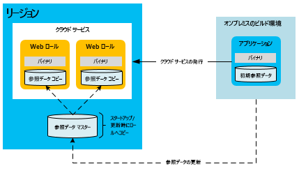
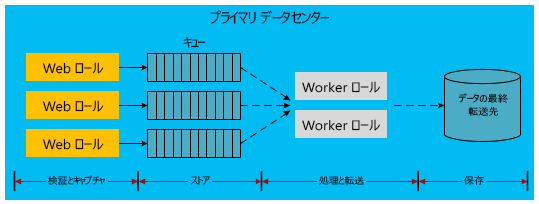

[!INCLUDE [header](../_includes/header.md)]

# Microsoft Azure 上に構築されたアプリケーションの高可用性High availability for applications built on Microsoft Azure
高可用性アプリケーションは、依存型のサービスとハードウェアの可用性の変動、負荷、一時的な障害を緩和します。A highly available application absorbs fluctuations in availability, load, and temporary failures in dependent services and hardware. アプリケーションは、ビジネス要件またはアプリケーションのサービス レベル アグリーメント (SLA) に定義されている許容レベルで実行を続けます。The application continues to perform acceptably, as defined by business requirements or application service-level agreements (SLAs).

## Azure の高可用性機能Azure high-availability features
Azure には、可用性の高いアプリケーションをサポートするさまざまなプラットフォーム機能が組み込まれています。Azure has many built-in platform features that support highly available applications. このセクションでは、それらの主要機能の一部について説明します。This section describes some of those key features.

### ファブリック コントローラーFabric controller
Azure ファブリック コントローラーは、Azure コンピューティング インスタンスをプロビジョニングし、その状態を監視します。The Azure fabric controller provisions and monitors the condition of Azure compute instances. このファブリック コントローラーは、ホスト コンピューター インスタンスとゲスト コンピューター インスタンスのハードウェアとソフトウェアの状態を監視します。The fabric controller monitors the status of the hardware and software of the host and guest machine instances. エラーが検出された場合、VM インスタンスを自動的に再配置し、SLA を維持します。When it detects a failure, it maintains SLAs by automatically relocating the VM instances. 障害ドメインとアップグレード ドメインのコンセプトがコンピューティング SLA をさらにサポートします。The concept of fault and upgrade domains further supports the compute SLA.

複数のクラウド サービスのロール インスタンスがデプロイされている場合、Azure はこれらのインスタンスを異なる障害ドメインにデプロイします。When multiple Cloud Service role instances are deployed, Azure deploys these instances to different fault domains. 障害ドメインの境界は、基本的に、同じリージョンの異なるハードウェア ラックになります。A fault domain boundary is essentially a different hardware rack in the same region. 障害ドメインは、ローカライズされたハードウェアがアプリケーションのサービスを遮断する可能性を減らします。Fault domains reduce the probability that a localized hardware failure interrupts the service of an application. worker または Web ロールの障害ドメインの数は管理できません。You cannot manage the number of fault domains of your worker roles or web roles. ファブリック コントローラーは、Azure でホストされるアプリケーションから分離している専用リソースを使用します。The fabric controller uses dedicated resources that are separate from Azure-hosted applications. Azure システムの中核としてサービスを提供するため、100% のアップタイムが必要です。It requires 100 percent uptime because it serves as the nucleus of the Azure system. 障害ドメイン全体でロール インスタンスを監視し、管理します。It monitors and manages role instances across fault domains.

次の図は、異なる障害ドメインにまたがってファブリック コントローラーによりデプロイされ、管理される Azure 共有リソースを示したものです。The following diagram shows Azure shared resources that the fabric controller deploys and manages across different fault domains.

障害ドメインは障害を軽減するための物理的な分離ですが、アップグレード ドメインは、サービスのインスタンスを特定の時刻にアップグレードするかを決定する、インスタンス分離の論理ユニットです。While fault domains are physical separations to mitigate failure, upgrade domains are logical units of instance separation that determine which instances of a service will be upgraded at a specific time. 既定では、ホストされるサービスのデプロイの場合、5 つのアップグレード ドメインが定義されます。By default, five upgrade domains are defined for your hosted service deployment. ただし、サービス定義ファイルでその値を変更できます。However, you can change that value in the service definition file. たとえば、Web ロールの 8 つのインスタンスがある場合は、3 つのアップグレード ドメインに 2 つのインスタンス、1 つのアップグレード ドメインに 2 つのインスタンスがあります。For example, if you have eight instances of your web role, there are two instances in three upgrade domains and two instances in one upgrade domain. Azure は、アップグレード ドメインの数に基づいて更新順序を定義します。Azure defines the update sequence based on the number of upgrade domains. 詳しくは、「[クラウド サービスの更新方法](/azure/cloud-services/cloud-services-update-azure-service/)」をご覧ください。For more information, see [Update a cloud service](/azure/cloud-services/cloud-services-update-azure-service/).

### その他のサービスの機能Features in other services
プラットフォーム機能でコンピューティング リソースの高可用性をサポートするだけでなく、Azure は高可用性機能を他のサービスに組み込みます。In addition to the platform features that support high availability of compute resources, Azure embeds high-availability features in its other services. たとえば、Azure Storage は、すべてのデータの少なくとも 3 つのレプリカを Azure ストレージ アカウントに維持します。For example, Azure Storage maintains at least three replicas of all data in your Azure storage account. また、geo レプリケーションでデータのコピーをセカンダリ リージョンに格納することもできます。It also enables geo-replication to store copies of your data in a secondary region. Azure Content Delivery Network は世界中の BLOB をキャッシュし、冗長性、拡張性、待ち時間の短縮を実現します。The Azure Content Delivery Network allows blobs to be cached around the world for redundancy, scalability, and lower latency. Azure SQL Database はまた、複数のレプリカを維持します。Azure SQL Database maintains multiple replicas as well.

Azure プラットフォームの可用性機能について詳しくは、「[Resiliency technical guidance](index.md)」(回復性技術ガイダンス) をご覧ください。For a deeper discussion of Azure platform availability features, see [Resiliency technical guidance](index.md). 「[Best practices for designing large-scale services on Windows Azure](https://azure.microsoft.com/blog/best-practices-for-designing-large-scale-services-on-windows-azure/)」(Microsoft Azure で大規模なサービスを設計するためのベスト プラクティス) もご覧ください。Also see [Best practices for designing large-scale services on Windows Azure](https://azure.microsoft.com/blog/best-practices-for-designing-large-scale-services-on-windows-azure/).

Azure には高可用性をサポートする複数の機能が用意されていますが、その制約を理解することが重要です。Although Azure provides multiple features that support high availability, it's important to understand their limitations:

* コンピューティングに関しては、あなたのロールが利用できて実行されていることを Azure は保証しますが、あなたのアプリケーションが実行されているのか、過負荷になっているのかは検出できません。For compute, Azure guarantees that your roles are available and running, but it cannot detect whether your application is running or overloaded.
* Azure SQL Database の場合、データはリージョン内で同期複製されます。For Azure SQL Database, data is replicated synchronously within the region. アクティブ geo レプリケーションを選択できます。アクティブ geo レプリケーションでは、同じリージョン (または異なるリージョン) にデータベース コピーを 4 つまで保持できます。You can choose active geo-replication, which allows up to four additional database copies in the same region (or different regions). これらのデータベース レプリカはポイントインタイム バックアップではありませんが、SQL Database はポイントインタイム バックアップ機能を提供します。While these database replicas are not point-in-time backups, SQL Database does provide point-in-time backup capabilities. 詳しくは、「[データベースの自動バックアップを使用した Azure SQL Database の復旧](/azure/sql-database/sql-database-recovery-using-backups#point-in-time-restore)」の「ポイントインタイム リストア」をご覧ください。For more information, see [Recover an Azure SQL Database using automated data backups: Point-in-time restore](/azure/sql-database/sql-database-recovery-using-backups#point-in-time-restore).
* Azure Storage の場合、テーブル データと BLOB データは既定で代替リージョンにレプリケートされます。For Azure Storage, table data and blob data are replicated by default to an alternate region. ただし、代替サイトへのフェールオーバーを Microsoft が選択するまで、レプリカにアクセスできません。However, you cannot access the replicas until Microsoft chooses to fail over to the alternate site. リージョン フェールオーバーは、リージョン全体のサービス中断が長引いた場合にのみ発生します。geo フェールオーバーの時間には SLA はありません。A region failover occurs only during a prolonged region-wide service disruption, and there is no SLA for geo-failover time. データの破損はすぐにレプリカに広まることにもご留意ください。It's also important to note that any data corruption quickly spreads to the replicas. これらの理由から、プラットフォームの可用性機能をアプリケーション固有の可用性機能 (BLOB データのポイントインタイム バックアップを作成する BLOB スナップショット機能など) で補完する必要があります。For these reasons, you must supplement platform availability features with application-specific availability features, including the blob snapshot feature to create point-in-time backups of blob data.

### Azure Virtual Machines の可用性セットAvailability sets for Azure Virtual Machines
このドキュメントでは、サービスとしてのプラットフォーム (PaaS) モデルを使用する、クラウド サービスについて重点的に説明します。This document primarily focuses on cloud services, which use a platform-as-a-service (PaaS) model. サービスとしてのインフラストラクチャ (IaaS) モデルを使用する、Azure Virtual Machines 固有の可用性機能もあります。There are also specific availability features for Azure Virtual Machines, which use an infrastructure-as-a-service (IaaS) model. Virtual Machines を使用して高可用性を実現するには、障害ドメインおよびアップグレード ドメインと同様の機能を提供する可用性セットを使用する必要があります。To achieve high availability with Virtual Machines, you must use availability sets, which serve a similar function to fault and upgrade domains. 可用性セット内では、ローカライズされたハードウェアの障害や保守管理行動に起因してグループ内の全コンピューターが停止する事態が回避されるように、Azure は仮想マシンを配置します。Within an availability set, Azure positions the virtual machines in a way that prevents localized hardware faults and maintenance activities from bringing down all the machines in that group. Virtual Machines の可用性に関する Azure SLA を達成するためには、可用性セットが必要です。Availability sets are required to achieve the Azure SLA for the availability of Virtual Machines.

次の図は、Web 仮想マシンと SQL Server 仮想マシンの 2 つの可用性セットを示しています。The following diagram shows two availability sets for web and SQL Server virtual machines, respectively.

> [!NOTE]
> 上の図では、SQL Server が仮想マシンにインストールされ、実行されています。In the preceding diagram, SQL Server is installed and running on virtual machines. これは、管理サービスとしてデータベースを提供する、Azure SQL Database とは異なります。This is different from Azure SQL Database, which provides a database as a managed service.
> 
> 

## 高可用性のアプリケーション戦略Application strategies for high availability
高可用性のアプリケーション戦略の大半は、アプリケーション コンポーネント間の冗長性または強固な依存性の解除に関するものです。Most application strategies for high availability involve either redundancy or the removal of hard dependencies between application components. アプリケーションを設計するとき、Azure またはサードパーティ サービスの散発的ダウンタイム時の耐障害性を組み込む必要があります。Application design should support fault tolerance during sporadic downtime of Azure or third-party services. 次のセクションでは、クラウド サービスの可用性を上げるアプリケーション パターンを紹介します。The following sections describe application patterns for improving the availability of your cloud services.

### 非同期の通信と永続的なキューAsynchronous communication and durable queues
Azure アプリケーションの可用性を高めるために、疎結合のサービス間に非同期の通信を取り入れることを検討してください。To increase availability in Azure applications, consider asynchronous communication between loosely coupled services. このパターンでは、ストレージ キューと Azure Service Bus キューのいずれかにメッセージが書き込まれ、後で処理されます。In this pattern, messages are written to either storage queues or Azure Service Bus queues for later processing. キューにメッセージが書き込まれると、直後に送信者にコントロールが返されます。When a message is written to the queue, control immediately returns to the sender. アプリケーションの別のサービス (通常、worker ロールとして実行されます) がメッセージを処理します。Another service of the application (typically implemented as a worker role) processes the message. 処理サービスが停止した場合、そのサービスが元の状態に戻るまで、メッセージはキューに累積されます。If the processing service stops working, the messages accumulate in the queue until the processing service is restored. フロントエンドの送信者とメッセージの処理者の間に直接的な依存関係はありません。There is no direct dependency between the front-end sender and the message processor. これにより、分散アプリケーションのボトルネックを引き起こす可能性のある同期サービス呼び出しが排除されます。This eliminates synchronous service calls that can cause bottlenecks in distributed applications.

このパターンのバリエーションとしては、故障したデータベースの呼び出しに関する情報を Azure Storage (BLOB、テーブル、キュー) または Service Bus のキューに格納する方法があります。A variation of this pattern stores information about failed database calls in Azure Storage (blobs, tables, or queues) or Service Bus queues. たとえば、あるアプリケーション内で別のサービス (Azure SQL Database など) を同期的に呼び出す行為は繰り返し失敗します。For example, a synchronous call within an application to another service (such as Azure SQL Database) fails repeatedly. 場合によっては、その要求をシリアル化し、永続的なストレージに保存できます。You might be able to serialize that request into durable storage. 後に、サービスまたはデータベースがオンラインに戻ったときに、アプリケーションはストレージから要求を再送信できます。At some later point when the service or database is back online, the application can resubmit the request from storage. このモデルの違いは、仲介となる場所が、アプリケーション ワークフローの通常の部分としてではなく、フェールオーバー時にのみ使用されるということです。The difference in this model is that the intermediate location is used only during failures, not as a regular part of the application workflow.

いずれのシナリオでも、非同期通信と中間ストレージの利用により、バックエンド サービスが停止しても、アプリケーション全体が停止する事態が回避されます。In both scenarios, asynchronous communication and intermediate storage prevent a downed back-end service from bringing down the entire application. キューは論理的な仲介者として機能します。Queues serve as a logical intermediary. キュー サービス間の選択について詳しくは、「[Azure キューと Service Bus キューの比較&mdash;](/azure/service-bus-messaging/service-bus-azure-and-service-bus-queues-compared-contrasted/)」をご覧ください。For more information on choosing between queuing services, see [Azure queues and Azure Service Bus queues &mdash; compared and contrasted](/azure/service-bus-messaging/service-bus-azure-and-service-bus-queues-compared-contrasted/).

### 障害検出と再試行ロジックFault detection and retry logic
高可用性アプリケーションの設計で重要なことは、コード内で再試行ロジックを使用し、一時的に使用不可になっているサービスをグレースフルに (劣化を最小限に抑えるように) 処理することです。A key aspect of the design of highly available applications is the use of retry logic within code to gracefully handle a service that is temporarily unavailable. Azure Storage と Azure Service Bus の最新バージョンの SDK は再試行をネイティブにサポートします。Recent versions of SDKs for both Azure Storage and Azure Service Bus natively support retries. アプリケーションのカスタムの再試行ロジックの提供について詳しくは、「[Retry pattern](../patterns/retry.md)」(再試行パターン) をご覧ください。For more information on providing custom retry logic for your application, see the [Retry pattern](../patterns/retry.md).

### 高可用性の参照データ パターンReference data pattern for high availability
参照データは、アプリケーションの読み取り専用データです。Reference data is the read-only data of an application. このデータはビジネス コンテキストを与えます。そのビジネス コンテキストの中で、アプリケーションは業務の際にトランザクション データを生成します。This data provides the business context within which the application generates transactional data during a business operation. トランザクション データの整合性は、トランザクションの完了時の参照データのスナップショットに依存します。The integrity of transactional data depends on a snapshot of the reference data at the time the transaction was completed.

アプリケーションの適切な操作には参照データが必要です。Reference data is necessary for the proper operation of the application. さまざまなアプリケーションが参照データを作成し、維持します。通常、マスター データ管理 (MDM) システムがこの機能を実行します。Various applications create and maintain reference data; master data management (MDM) systems often perform this function. そのようなシステムは、参照データのライフサイクルを担当します。These systems are responsible for the life cycle of the reference data. 参照データには、たとえば、製品カタログ、社員マスター、部品マスター、設備マスターがあります。Examples of reference data include product catalog, employee master, parts master, and equipment master. 参照データは組織の外部から発生することもあります。郵便番号や税率などです。Reference data can also originate from outside the organization, for example, postal codes or tax rates. 参照データの可用性を高めるための戦略は、一般的に、トランザクション データの場合よりも簡単です。Strategies for increasing the availability of reference data are typically less difficult than those for transactional data. 参照データには、ほとんど変化しないという利点があります。Reference data has the advantage of being mostly immutable.

アプリケーションと共に参照データをデプロイすることで、Azure Web ロールと worker ロールは実行時に自立的に参照データを利用できます。Azure web and worker roles that consume reference data can be made autonomous at runtime by deploying the reference data along with the application. この手法は、ローカル ストレージが十分に大きく、このようなデプロイが可能な場合に理想的です。This approach is ideal if the size of the local storage allows such a deployment. Azure コンピューティングのスケール ユニットの自立性には、ローカルにデプロイされている組み込み SQL データベース、NoSQL データベース、または XML ファイルが役立ちます。Embedded SQL databases, NoSQL databases, or XML files deployed locally help with the autonomy of Azure compute scale units. ただし、再デプロイしなくても各ロールのデータを更新するメカニズムを用意する必要があります。However, you should have a mechanism to update the data in each role without requiring redeployment. 具体的には、参照データが更新されたら、それをクラウド ストレージ エンドポイント (Azure BLOB ストレージや SQL Database など) に送信します。To do this, place any updates to the reference data at a cloud storage endpoint (for example, Azure Blob storage or SQL Database). ロールの起動時にコンピューティング ノードにデータ更新をダウンロードするコードを各ロールに追加します。Add code to each role that downloads the data updates into the compute nodes at role startup. あるいは、ロール インスタンスへの強制ダウンロードを管理者に許可するコードを追加します。Alternatively, add code that allows an administrator to perform a forced download into the role instances.

ストレージが停止したときに可用性を上げるために、一連の参照データをロールに追加する必要もあります。To increase availability, the roles should also contain a set of reference data in case storage is down. 更新のストレージ リソースが利用できるようになるまで、一連の基本参照データでロールを起動できます。Roles can start with a basic set of reference data until the storage resource becomes available for the updates.

このパターンでは、大量の参照データをデプロイまたはダウンロードする場合に、新しいデプロイまたはロール インスタンスの起動に時間がかかることがあります。With this pattern, new deployments or role instances may take longer to start if you are deploying or downloading large amounts of reference data. 時間が増えたとしても、外部のストレージ サービスに頼ることなく、各ロールで参照データをすぐに利用できるという自立性が与えられるなら許容範囲内となることもあります。This tradeoff might be acceptable for the autonomy of having the reference data immediately available on each role, rather than depending on external storage services.

### 高可用性のトランザクション データ パターンTransactional data pattern for high availability
トランザクション データは、ビジネス コンテキストにおいてアプリケーションによって生成されるデータです。Transactional data is the data that the application generates in a business context. トランザクション データは、アプリケーションに実装する一連のビジネス プロセスとそのようなプロセスをサポートする参照データを組み合わせたものです。Transactional data is a combination of the set of business processes that the application implements and the reference data that supports these processes. トランザクション データには、たとえば、注文、事前出荷明細、請求書、顧客関係管理 (CRM) 案件などがあります。Examples of transactional data can include orders, advanced shipping notices, invoices, and customer relationship management (CRM) opportunities. トランザクション データは記録を保存する外部システムに送信され、さらに処理されます。Transactional data is supplied to external systems for record keeping or for further processing.

参照データはそのデータを担当するシステム内で変動する場合があります。Reference data can change within the systems that are responsible for that data. そのような理由から、外部依存性を最小限に抑え、その意味論的な一貫性を維持するために、参照データの特定の時点のコンテキストをトランザクション データで保存する必要があります。Therefore, transactional data must save the point-in-time reference data context to minimize external dependencies for its semantic consistency. たとえば、注文の完了から数か月後に製品をカタログから削除するとします。For example, a product may be removed from the catalog several months after an order is fulfilled. トランザクションを使用してできるだけ多くの参照データ コンテキストを格納することをお勧めします。Storing as much reference data context as possible with the transaction is recommended. この手法では、トランザクションの記録後に参照データが変更された場合でも、トランザクションに関連付けられている意味が失われません。This approach preserves the semantics associated with the transaction, even if the reference data changes after the transaction is captured.

前述のように、疎結合と非同期通信を使用するアーキテクチャは高いレベルの可用性を提供します。As mentioned previously, architectures that use loose coupling and asynchronous communication can provide higher levels of availability. それはトランザクション データにも当てはまります。ただし、実装は一層複雑になります。This is true for transactional data as well, but the implementation is more complex. トランザクションの従来の概念は、通常、トランザクションを請け合うデータベースに依存します。Traditional transactional patterns usually rely on the database for guaranteeing the transaction. 中間層を導入するとき、アプリケーション コードでさまざまな層のデータを正しく処理し、十分な一貫性と耐久性を維持する必要があります。When you introduce intermediate layers, the application code must correctly handle the data at various layers to ensure sufficient consistency and durability.

次のシーケンスは、トランザクション データの記録とその処理を分離するワークフローを表しています。The following sequence describes a workflow that separates the capture of transactional data from its processing:

1. Web コンピューティング ノード: 参照データを提示します。Web compute node: Present reference data.
2. 外部ストレージ: 中間トランザクション データを保存します。External storage: Save intermediate transactional data.
3. Web コンピューティング ノード: エンド ユーザー トランザクションを完了します。Web compute node: Complete the end-user transaction.
4. Web コンピューティング ノード: 完了したトランザクション データを参照データ コンテキストと共に、応答が予測可能である仮の永続的なストレージに送信します。Web compute node: Send the completed transactional data with its reference data context to temporary durable storage that is guaranteed to give a predictable response.
5. Web コンピューティング ノード: トランザクションの完了をエンド ユーザーに知らせます。Web compute node: Signal the end-user completion of the transaction.
6. バックグラウンド コンピューティング ノード: トランザクション データを抽出し、必要に応じてさらに処理し、現在のシステムの最終保存場所に送信します。Background compute node: Extract the transactional data, process it further if necessary, and send it to its final storage location in the current system.

次の図は、Azure でホストされるクラウド サービスでこの設計を実装した 1 つの例です。The following diagram shows one possible implementation of this design in an Azure-hosted cloud service.

上の図の破線矢印は非同期処理を示しています。The dashed arrows in the preceding diagram indicate asynchronous processing. フロントエンドの web ロールはこの非同期処理を認識しません。The front-end web role is not aware of this asynchronous processing. 結果的に、現在のシステムを参照し、最終的な目的地にトランザクションを保存します。This leads to the storage of the transaction at its final destination with reference to the current system. この非同期モデルにより導入される待ち時間に起因し、トランザクション データにすぐに照会することはできません。Due to the latency that this asynchronous model introduces, the transactional data is not immediately available for query. そのため、単位ごとのトランザクション データをキャッシュまたはユーザー セッションに保存し、目下の UI ニーズを満たす必要があります。Therefore, each unit of the transactional data needs to be saved in a cache or a user session to meet the immediate UI needs.

web ロールはインフラストラクチャの残りの部分から自立します。The web role is autonomous from the rest of the infrastructure. その可用性は Web ロールと Azure キューの組み合わせであり、インフラストラクチャ全体ではありません。Its availability profile is a combination of the web role and the Azure queue and not the entire infrastructure. 高い可用性に加え、この手法では、バックエンド ストレージに関係なく、Web ロールを水平方向に拡張できます。In addition to high availability, this approach allows the web role to scale horizontally, independent of the back-end storage. この高可用性モデルは運用の経済性に影響を与える場合があります。This high-availability model can have an impact on the economics of operations. Azure キューや worker ロールなど、その他のコンポーネントは毎月の利用コストに影響を与える場合があります。Additional components like Azure queues and worker roles can affect monthly usage costs.

前の図はトランザクション データにこの疎結合手法を実装する一例に過ぎません。The previous diagram shows one implementation of this decoupled approach to transactional data. 他にもさまざまな方法で実装できます。There are many other possible implementations. 次は代替手法の一覧です。The following list provides some alternatives:

* worker ロールは、Web ロールとストレージ キューの間に置かれることがあります。A worker role might be placed between the web role and the storage queue.
* Service Bus キューを Azure Storage キューの代わりに使用できます。A Service Bus queue can be used instead of an Azure Storage queue.
* 最終的な宛先は Azure Storage か別のデータベース プロバイダーになります。The final destination might be Azure Storage or a different database provider.
* Azure キャッシュを Web 層で利用し、トランザクションの直後にキャッシュ要件を与えることができます。Azure Cache can be used at the web layer to provide the immediate caching requirements after the transaction.

### 拡張性パターンScalability patterns
クラウド サービスの拡張性が可用性に直接影響を与えることにご留意ください。It's important to note that the scalability of a cloud service directly affects availability. 負荷の増加が原因でサービスが応答を停止した場合、ユーザーはアプリケーションが停止したことを認識します。If increased load causes your service to be unresponsive, the user perception is that the application is down. アプリケーションに予想される負荷と将来の予想値に基づき、拡張性の実証済みのプラクティスを実行します。Follow proven practices for scalability based on your expected application load and future expectations. 規模が最大になると、さまざまな事項を考慮する必要があります。1 つまたは複数のストレージ アカウント、複数のデータベースによる共有、キャッシュ方針などです。Maximizing scale involves many considerations, such as single versus multiple storage accounts, sharing across multiple databases, and caching strategies. これらのパターンについて詳しくは、「[Best practices for designing large-scale services on Microsoft Azure](https://azure.microsoft.com/blog/best-practices-for-designing-large-scale-services-on-windows-azure/)」(Microsoft Azure で大規模なサービスを設計するためのベスト プラクティス) をご覧ください。For in-depth information about these patterns, see [Best practices for designing large-scale services on Microsoft Azure](https://azure.microsoft.com/blog/best-practices-for-designing-large-scale-services-on-windows-azure/).

## 次の手順Next steps
このシリーズのドキュメントの内容には、Microsoft Azure 上に構築されたアプリケーションのディザスター リカバリーと高可用性が含まれます。This series of documents covers disaster recovery and high availability for applications built on Microsoft Azure. このシリーズの次の記事は、「[Disaster recovery for applications built on Microsoft Azure](disaster-recovery-azure-applications.md)」(Microsoft Azure 上で構築されたアプリケーションのディザスター リカバリー)です。The next article in the series is [Disaster recovery for applications built on Microsoft Azure](disaster-recovery-azure-applications.md).

