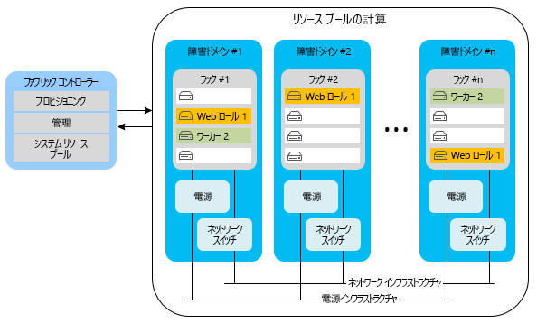
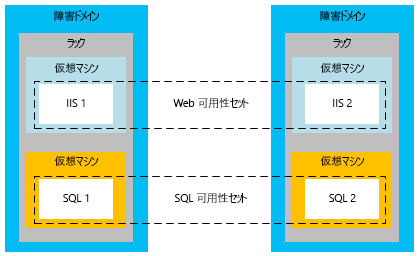
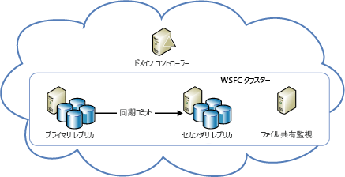
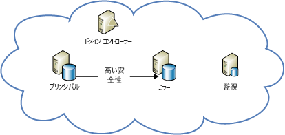

[!INCLUDE [header](../_includes/header.md)]

# Azure の回復性に関する技術ガイダンス - Azure でのローカル障害からの復旧Azure resiliency technical guidance: Recovery from local failures in Azure

アプリケーションの可用性にとって脅威となるのは、主に次の 2 つです。There are two primary threats to application availability:

* ドライブやサーバーなどのデバイスの障害The failure of devices, such as drives and servers
* ピーク時の負荷条件下でのコンピューティングなどの重大なリソースの枯渇The exhaustion of critical resources, such as compute under peak load conditions

Azure には、このような状況で高可用性を有効にする、リソース管理、柔軟性、負荷分散、およびパーティション分割の組み合わせが用意されています。Azure provides a combination of resource management, elasticity, load balancing, and partitioning to enable high availability under these circumstances. これらの機能の一部は、すべての Azure サービスに対して、自動的に実行されます。Some of these features are performed automatically for all Azure services. ただし、場合によっては、アプリケーション開発者が効果を上げるために追加の作業を行う必要があります。However, in some cases, the application developer must do some additional work to benefit from them.

## Cloud ServicesCloud Services
Azure Cloud Services は、1 つ以上の Web ロールまたは worker ロールの集合で構成されています。Azure Cloud Services consists of collections of one or more web or worker roles. ロールの 1 つ以上のインスタンスは同時に実行できます。One or more instances of a role can run concurrently. インスタンスの数は、構成によって決まります。The configuration determines the number of instances. ロール インスタンスは、ファブリック コントローラーと呼ばれるコンポーネントによって監視および管理されます。Role instances are monitored and managed through a component called the fabric controller. ファブリック コントローラーは、ソフトウェアとハードウェア両方の障害を自動的に検出し、対応します。The fabric controller detects and responds to both software and hardware failures automatically.

すべてのロール インスタンスは独自の仮想マシン (VM) で実行され、ゲスト エージェントを通じてそのファブリック コントローラーと通信します。Every role instance runs in its own virtual machine (VM) and communicates with its fabric controller through a guest agent. ゲスト エージェントは、リソースおよびノードのメトリックを収集します。これには、VM の使用状況、状態、ログ、リソースの使用状況、例外、および障害の状態が含まれます。The guest agent collects resource and node metrics, including VM usage, status, logs, resource usage, exceptions, and failure conditions. ファブリック コントローラーは、構成可能な間隔でゲスト エージェントを照会し、ゲスト エージェントが応答に失敗した場合に VM を再起動します。The fabric controller queries the guest agent at configurable intervals, and it restarts the VM if the guest agent fails to respond. ハードウェアで障害が発生した場合、関連付けられているファブリック コントローラーは影響を受けるすべてのロール インスタンスを新しいハードウェア ノードに移動し、そこでトラフィックをルーティングするようにネットワークを再構成します。In the event of hardware failure, the associated fabric controller moves all affected role instances to a new hardware node and reconfigures the network to route traffic there.

これらの機能の恩恵を受けるには、開発者はすべてのサービス ロールがロール インスタンスに状態を保存しないようにする必要があります。To benefit from these features, developers should ensure that all service roles avoid storing state on the role instances. 代わりに、すべての持続データには、Azure Storage や Azure SQL Database などの永続的なストレージからアクセスする必要があります。Instead, all persistent data should be accessed from durable storage, such as Azure Storage or Azure SQL Database. これにより、すべてのロールが要求を処理できます。This allows any roles to handle requests. これはまた、ロール インスタンスは一時的または永続的なサービス状態において一貫性を損なうことなくいつでも停止することができることを意味します。It also means that role instances can go down at any time without creating inconsistencies in the transient or persistent state of the service.

状態を外部のロールに保存する要件には、いくつかの意味合いがあります。The requirement to store state externally to the roles has several implications. たとえば、Azure Storage テーブルに関連するすべての変更は、可能であれば、単一のエンティティ グループ トランザクションで変更される必要があることを意味します。It implies, for example, that all related changes to an Azure Storage table should be changed in a single entity-group transaction, if possible. もちろん、すべての変更を単一のトランザクションで常に行うことができるわけではありません。Of course, it isn't always possible to make all changes in a single transaction. サービスの永続的な状態に対する 2 つ以上の更新にわたる長時間実行操作がロール インスタンスによって中断される場合、ロール インスタンス エラーによって問題が発生しないように特別な注意が必要です。You must take special care to ensure that role instance failures do not cause problems when they interrupt long-running operations that span two or more updates to the persistent state of the service. 別のロールがそのような操作を再試行しようとするときは、作業が部分的に完了している場合を予測して処理する必要があります。If another role attempts to retry such an operation, it should anticipate and handle the case where the work was partially completed.

たとえば、複数のストア間でデータをパーティション分割するサービスがあるとします。For example, consider a service that partitions data across multiple stores. シャードを再配置している間に worker ロールが停止すると、シャードの再配置が完了しない場合があります。If a worker role goes down while it's relocating a shard, the relocation of the shard might not finish. また、別の worker ロールによって再配置が最初から繰り返された結果、データが孤立したり破損したりする場合もあります。Or the relocation might be repeated from its inception by a different worker role, potentially causing orphaned data or data corruption. 問題を回避するには、長時間実行操作を次のようにする必要があります。To prevent problems, long-running operations must be one or both of the following:

* *べき等*: 副次的な影響が生じることなく繰り返しが可能であること。*Idempotent*: Repeatable without side effects. 長時間実行操作がべき等になるには、何度実行しても、たとえ実行の途中で中断されても、同じ結果が得られる必要があります。To be idempotent, a long-running operation should have the same effect no matter how many times it's executed, even when it's interrupted during execution.
* *増分再開可能*: 最新の障害の時点から継続できること。*Incrementally restartable*: Able to continue from the most recent point of failure. 増分再開可能にするために、長時間実行操作は一連のより小さなアトミック操作で構成される必要があります。To be incrementally restartable, a long-running operation should consist of a sequence of smaller atomic operations. また、後続の各呼び出しが先行呼び出しの停止位置を取得できるように、進行状況を永続的ストレージに記録する必要もあります。It should also record its progress in durable storage, so that each subsequent invocation picks up where its predecessor stopped.

最後に、すべての長時間実行操作は成功するまで繰り返し呼び出される必要があります。Finally, all long-running operations should be invoked repeatedly until they succeed. たとえば、プロビジョニング操作は Azure キューに配置されて、成功した場合にのみ worker ロールによってキューから削除されます。For example, a provisioning operation might be placed in an Azure queue, and then removed from the queue by a worker role only when it succeeds. 中断された操作によって作成されたデータをクリーンアップするために、ガベージ コレクションが必要となる場合があります。Garbage collection might be necessary to clean up data that interrupted operations create.

### 弾力性Elasticity
ロールごとに実行されるインスタンスの初期の個数は、各ロールの構成によって決まります。The initial number of instances running for each role is determined in each role’s configuration. 管理者は、予測される負荷に基づいて、複数のインスタンスで実行されるように各ロールを最初に構成する必要があります。Administrators should initially configure each role to run with two or more instances based on expected load. ただし、ロール インスタンスは使用パターンの変更に合わせて簡単にスケールアップまたはスケールダウンすることができます。But you can easily scale role instances up or down as usage patterns change. この操作は、Azure ポータルを使用して手動で行うことも、Windows PowerShell、Service Management API、またはサード パーティ製ツールを使用してプロセスを自動化することもできます。You can do this manually in the Azure portal, or you can automate the process by using Windows PowerShell, the Service Management API, or third-party tools. 詳細については、 [アプリケーションの自動スケールの方法](/azure/cloud-services/cloud-services-how-to-scale/)に関する記事を参照してください。For more information, see [How to autoscale an application](/azure/cloud-services/cloud-services-how-to-scale/).

### パーティション分割Partitioning
Azure ファブリック コントローラーは、次の 2 種類のパーティションを使用します。The Azure fabric controller uses two types of partitions:

* *更新ドメイン* は、グループ内でサービスのロール インスタンスをアップグレードするために使用されます。An *update domain* is used to upgrade a service’s role instances in groups. Azure はサービス インスタンスを複数の更新ドメインにデプロイします。Azure deploys service instances into multiple update domains. インプレース更新では、ファブリック コントローラーは 1 つの更新ドメインのすべてのインスタンスを停止して、それらをアップグレードし、再起動してから次の更新ドメインに移動します。For an in-place update, the fabric controller brings down all the instances in one update domain, updates them, and then restarts them before moving to the next update domain. この方法は、更新プロセス中にサービス全体が使用できなくなることを防ぎます。This approach prevents the entire service from being unavailable during the update process.
* *障害ドメイン* では、ハードウェア障害またはネットワーク障害が発生する可能性があるポイントを定義します。A *fault domain* defines potential points of hardware or network failure. 複数のインスタンスがある各ロールに対して、ファブリック コントローラーは局所的なハードウェア障害によってサービスが中断されることを防ぐために、インスタンスが複数の障害ドメインに分散されるようにします。For any role that has more than one instance, the fabric controller ensures that the instances are distributed across multiple fault domains, to prevent isolated hardware failures from disrupting service. 障害ドメインは、サーバーおよびクラスターの障害の影響を受けるすべてのものを管理します。Fault domains govern all exposure to server and cluster failures.

[Azure サービス レベル アグリーメント (SLA)](https://azure.microsoft.com/support/legal/sla/) は、複数の Web ロール インスタンスがそれぞれ異なる障害ドメインやアップグレード ドメインにデプロイされる場合、99.95% 以上の時間で外部接続されることを保証します。The [Azure service-level agreement (SLA)](https://azure.microsoft.com/support/legal/sla/) guarantees that when two or more web role instances are deployed to different fault and upgrade domains, they'll have external connectivity at least 99.95 percent of the time. 更新ドメインとは異なり、障害ドメインの数を制御する方法はありません。Unlike update domains, there's no way to control the number of fault domains. Azure が自動的に障害ドメインを割り当て、それらにロール インスタンスを分散します。Azure automatically allocates fault domains and distributes role instances across them. すべてのロールの少なくとも最初の 2 つのインスタンスは、それぞれ異なる障害ドメインおよびアップグレード ドメインに配置されます。これは少なくとも 2 つのインスタンスがあるすべてのロールが SLA を満たすようにするためです。At least the first two instances of every role are placed in different fault and upgrade domains to ensure that any role with at least two instances will satisfy the SLA. それを示したのが次の図です。This is represented in the following diagram.

### 負荷分散Load balancing
Web ロールへのすべてのインバウンド トラフィックはステートレスな Load Balancer を通過し、その Load Balancer はクライアント要求をロール インスタンス間に分散します。All inbound traffic to a web role passes through a stateless load balancer, which distributes client requests among the role instances. 個々のロール インスタンスにはパブリック IP アドレスがなく、インターネットから直接のアドレス指定することはできません。Individual role instances do not have public IP addresses, and they are not directly addressable from the Internet. Web ロールはステートレスであるため、任意のクライアント要求は任意のロール インスタンスにルーティングできます。Web roles are stateless so that any client request can be routed to any role instance. [StatusCheck](https://msdn.microsoft.com/library/microsoft.windowsazure.serviceruntime.roleenvironment.statuscheck.aspx) イベントは 15 秒ごとに発生します。A [StatusCheck](https://msdn.microsoft.com/library/microsoft.windowsazure.serviceruntime.roleenvironment.statuscheck.aspx) event is raised every 15 seconds. これを、ロールがトラフィックを受信する準備ができているかどうか、またはビジー状態であるためにロード バランサーのローテーションから外す必要があるかどうかを示すために使用できます。You can use this to indicate whether the role is ready to receive traffic, or whether it's busy and should be taken out of the load-balancer rotation.

## Virtual MachinesVirtual Machines
Azure Virtual Machines は、高可用性に関連するいくつかの点でサービスとしてのプラットフォーム (PaaS) のコンピューティング ロールとは異なります。Azure Virtual Machines differs from platform as a service (PaaS) compute roles in several respects in relation to high availability. 場合によっては、高可用性を確保するために追加作業を行う必要があります。In some instances, you must do additional work to ensure high availability.

### ディスクの持続性Disk durability
PaaS のロール インスタンスとは異なり、仮想マシンのドライブに保存されているデータは仮想マシンが再配置される場合でも永続的です。Unlike PaaS role instances, data stored on virtual machine drives is persistent even when the virtual machine is relocated. Azure 仮想マシンは、Azure Storage に BLOB として存在する VM ディスクを使用します。Azure virtual machines use VM disks that exist as blobs in Azure Storage. Azure Storage の可用性という特性のために、仮想マシンのドライブに保存されているデータも高い可用性を備えています。Because of the availability characteristics of Azure Storage, the data stored on a virtual machine’s drives is also highly available.

ただし、(Windows VM 内の) D ドライブはこの規則の例外です。Note that drive D (in Windows VMs) is the exception to this rule. D ドライブは VM をホストするラック サーバーの実際の物理記憶領域で、そのデータは VM がリサイクルされると失われます。Drive D is actually physical storage on the rack server that hosts the VM, and its data will be lost if the VM is recycled. D ドライブは一時的な格納を目的としています。Drive D is intended for temporary storage only. Linux では "通常" (常にというわけではありません)、ローカルの一時ディスクが /dev/sdb ブロック デバイスとして公開されます。In Linux, Azure “usually” (but not always) exposes the local temporary disk as /dev/sdb block device. Azure Linux エージェントで /mnt/resource または /mnt マウント ポイント (/etc/waagent.conf で構成可能) としてマウントされるのが一般的です。It is often mounted by the Azure Linux Agent as /mnt/resource or /mnt mount points (configurable via /etc/waagent.conf).

### パーティション分割Partitioning
Azure は PaaS アプリケーションの層 (Web ロールと worker ロール) をネイティブで認識するため、障害ドメインと更新ドメインにそれらを適切に分散できます。Azure natively understands the tiers in a PaaS application (web role and worker role) and thus can properly distribute them across fault and update domains. これに対し、サービスとしてのインフラストラクチャ (IaaS) アプリケーションの層は、可用性セットを使用して手動で定義する必要があります。In contrast, the tiers in an infrastructure as a service (IaaS) application must be manually defined through availability sets. 可用性セットは、IaaS の SLA で必要です。Availability sets are required for an SLA under IaaS.

上の図で、インターネット インフォメーション サービス (IIS) 層 (Web アプリ層として機能) および SQL の層 (データ層として機能) は異なる可用性セットに割り当てられています。In the preceding diagram, the Internet Information Services (IIS) tier (which works as a web app tier) and the SQL tier (which works as a data tier) are assigned to different availability sets. こうすることで、各層のすべてのインスタンスが仮想マシンを障害ドメインに分散することによってハードウェア冗長性を備え、更新中に層全体がダウンしないようになります。This ensures that all instances of each tier have hardware redundancy by distributing virtual machines across fault domains, and that entire tiers are not taken down during an update.

### 負荷分散Load balancing
VM のトラフィックが VM 全体で分散される必要がある場合は、アプリケーションの VM をグループ化し、特定の TCP または UDP エンドポイントで負荷分散する必要があります。If the VMs should have traffic distributed across them, you must group the VMs in an application and load balance across a specific TCP or UDP endpoint. 詳細については、 [仮想マシンの負荷分散](/azure/virtual-machines/virtual-machines-linux-load-balance/?toc=%2fazure%2fvirtual-machines%2flinux%2ftoc.json)に関するページを参照してください。For more information, see [Load balancing virtual machines](/azure/virtual-machines/virtual-machines-linux-load-balance/?toc=%2fazure%2fvirtual-machines%2flinux%2ftoc.json). VM が別のソースからの入力 (キュー メカニズムなど) を受信する場合、Load Balancer は必要ではありません。If the VMs receive input from another source (for example, a queuing mechanism), a load balancer is not required. Load Balancer は、トラフィックをノードに送信する必要があるかどうかを判断するために基本的な正常性チェックを使用します。The load balancer uses a basic health check to determine whether traffic should be sent to the node. また、VM がトラフィックを受信する必要があるかどうかを判断するために、アプリケーション固有の正常性メトリックを実装する独自のプローブを作成することもできます。It's also possible to create your own probes to implement application-specific health metrics that determine whether the VM should receive traffic.

## StorageStorage
Azure Storage は、Azure の基本の永続的データ サービスです。Azure Storage is the baseline durable data service for Azure. BLOB、テーブル、キュー、および VM ディスク ストレージを提供します。It provides blob, table, queue, and VM disk storage. このサービスは、レプリケーションとリソース管理の組み合わせを使用して、単一のデータセンター内で高可用性を提供します。It uses a combination of replication and resource management to provide high availability within a single datacenter. Azure Storage の可用性についての SLA では、99.9% 以上の時間で、The Azure Storage availability SLA guarantees that at least 99.9 percent of the time:

* データの追加、更新、読み取り、および削除に対する正しい形式の要求が正常に問題なく処理されることが保証されます。Correctly formatted requests to add, update, read, and delete data will be successfully and correctly processed.
* ストレージ アカウントは、インターネット ゲートウェイに接続できます。Storage accounts will have connectivity to the Internet gateway.

### レプリケーションReplication
Azure Storage のデータの持続性は、リージョン内の完全に独立した物理ストレージ サブシステムに分散している異なるドライブに、すべてのデータの複数のコピーを維持することによって促進されます。Azure Storage facilitates data durability by maintaining multiple copies of all data on different drives across fully independent physical storage subsystems within the region. データは同期的にレプリケートされ、すべてのコピーは書き込みが承認される前にコミットされます。Data is replicated synchronously, and all copies are committed before the write is acknowledged. Azure Storage には強い一貫性があります。これは読み取りが最新の書き込みを反映していることが保証されていることを意味します。Azure Storage is strongly consistent, meaning that reads are guaranteed to reflect the most recent writes. また、データのコピーは、ビット崩壊を検出して修復するために継続的にスキャンされます。ビット崩壊は、格納されているデータの整合性を脅かす脅威ですが、よく見過ごされます。In addition, copies of data are continually scanned to detect and repair bit rot, an often overlooked threat to the integrity of stored data.

サービスは Azure Storage を使用するだけで、レプリケーションから恩恵を受けられます。Services benefit from replication just by using Azure Storage. サービス開発者は、ローカル障害から復旧するために追加の作業を行う必要はありません。The service developer doesn't need to do additional work to recover from a local failure.

### リソース管理Resource management
2014 年 5 月より後に作成されたストレージ アカウントは 500 TB まで拡張できます (以前の最大値は 200 TB)。Storage accounts created after May 2014, can grow to up to 500 TB (the previous maximum was 200 TB). 追加領域が必要となった場合は、アプリケーションが複数のストレージ アカウントを使用できるように設計する必要があります。If additional space is required, applications must be designed to use multiple storage accounts.

### 仮想マシンのディスクVirtual machine disks
仮想マシンのディスクは、Azure Storage にページ BLOB として格納され、Blob Storage とまったく同じ持続性とスケーラビリティのプロパティを提供します。A virtual machine’s disk is stored as a page blob in Azure Storage, giving it all the same durability and scalability properties as Blob storage. この設計によって、VM を実行しているサーバーで障害が発生し、VM を別のサーバーで再起動しなければならない場合でも、仮想マシンのディスク上のデータは永続的なものになります。This design makes the data on a virtual machine’s disk persistent, even if the server running the VM fails and the VM must be restarted on another server.

## データベースDatabase
### SQL DatabaseSQL Database
Azure SQL Database は、データベースをサービスとして提供します。Azure SQL Database provides database as a service. これにより、リレーショナル データベースに対するプロビジョニング、データの挿入、およびクエリ実行をアプリケーションで迅速に行うことができます。It allows applications to quickly provision, insert data into, and query relational databases. 使い慣れた SQL Server の機能の多くが提供される一方で、ハードウェア、構成、修正、および回復力に関する負担は取り除かれます。It provides many of the familiar SQL Server features and functionality, while abstracting the burden of hardware, configuration, patching, and resiliency.

> [!NOTE]
> Azure SQL Database は、SQL Server と 1 対 1 で対応する機能を提供するものではありません。Azure SQL Database does not provide one-to-one feature parity with SQL Server. 各クラウド アプリケーションに固有のそれぞれ異なる要件セット (柔軟な拡張、メンテナンス コストを削減するサービスとしてのデータベースなど) を満たすことを目的としています。It's intended to fulfill a different set of requirements--one that's uniquely suited to cloud applications (elastic scale, database as a service to reduce maintenance costs, and so on). 詳細については、「 [クラウド SQL Server オプションの選択: Azure SQL (PaaS) Database または Azure VM (IaaS) の SQL Server](/azure/sql-database/sql-database-paas-vs-sql-server-iaas/)」を参照してください。For more information, see [Choose a cloud SQL Server option: Azure SQL (PaaS) Database or SQL Server on Azure VMs (IaaS)](/azure/sql-database/sql-database-paas-vs-sql-server-iaas/).
> 
> 

#### レプリケーションReplication
Azure SQL Database にはノード レベルのエラーに対する回復力が組み込まれています。Azure SQL Database provides built-in resiliency to node-level failure. データベースに対するすべての書き込みは、クォーラム コミットの手法を使用して複数のバックグラウンド ノードに自動的にレプリケートされます。All writes into a database are automatically replicated to two or more background nodes through a quorum commit technique. トランザクションが成功と見なされて終了するためには、プライマリと少なくとも 1 つのセカンダリでアクティビティがトランザクション ログに書き込まれたことが確認される必要があります。ノードで障害が発生した場合は、データベースがいずれかのセカンダリ レプリカに自動的にフェールオーバーします。(The primary and at least one secondary must confirm that the activity is written to the transaction log before the transaction is deemed successful and returns.) In the case of node failure, the database automatically fails over to one of the secondary replicas. これにより、クライアント アプリケーションに対する一時的な接続の中断が発生します。This causes a transient connection interruption for client applications. したがって、Azure SQL Database のすべてのクライアントがなんらかの形式の一時的な接続処理を実装する必要があります。For this reason, all Azure SQL Database clients must implement some form of transient connection handling. 詳細については、「 [再試行サービス固有のガイダンス](/azure/best-practices-retry-service-specific/)」を参照してください。For more information, see [Retry service specific guidance](/azure/best-practices-retry-service-specific/).

#### リソース管理Resource management
各データベースの作成時にサイズの上限を構成します。Each database, when created, is configured with an upper size limit. 現在利用できる最大サイズは 1 TB です。サイズの上限は、ご利用のサービス レベルによって異なります。[Azure SQL データベースのサービス プランとパフォーマンス レベル](/azure/sql-database/sql-database-resource-limits/#service-tiers-and-performance-levels)に関するページをご覧ください。The currently available maximum size is 1 TB (size limits vary based on your service tier, see [service tiers and performance levels of Azure SQL Databases](/azure/sql-database/sql-database-resource-limits/#service-tiers-and-performance-levels). データベースのサイズが上限に達すると、追加の INSERT コマンドや UPDATE コマンドが拒否されるようになります When a database hits its upper size limit, it rejects additional INSERT or UPDATE commands. (データのクエリと削除は引き続き実行できます)。(Querying and deleting data is still possible.)

データベース内では、Azure SQL Database はリソースの管理にファブリックを使用します。Within a database, Azure SQL Database uses a fabric to manage resources. ただし、障害の検出には、ファブリック コントローラーではなく、リング型トポロジを使用します。However, instead of a fabric controller, it uses a ring topology to detect failures. クラスター内の各レプリカには 2 つのネイバーがあり、レプリカはネイバーに障害が発生すると検出します。Every replica in a cluster has two neighbors and is responsible for detecting when they go down. レプリカに障害が発生した場合は、そのネイバーが Reconfiguration Agent をトリガーして、別のコンピューターでレプリカを再作成するようにします。When a replica goes down, its neighbors trigger a reconfiguration agent to re-create it on another machine. エンジン調整は、論理サーバーがコンピューター上の過大なリソースを使用しないようにするため、またはコンピューターの物理的制限を超えないようにするために用意されています。Engine throttling is provided to ensure that a logical server doesn't use too many resources on a machine or exceed the machine’s physical limits.

### 弾力性Elasticity
アプリケーションが 1 TB のデータベースの上限値を超える要求を行う場合は、スケールアウト アプローチを実装する必要があります。If the application requires more than the 1 TB database limit, it must implement a scale-out approach. Azure SQL Database でのスケールアウトは、複数の SQL データベース間でデータを手動でパーティション分割することで行います。この方法はシャーディングと呼ばれています。You scale out with Azure SQL Database by manually partitioning, also known as sharding, data across multiple SQL databases. このスケールアウト アプローチでは、スケールに対して線形に近い形で増加するコストを実現できます。This scale-out approach provides the opportunity to achieve nearly linear cost growth with scale. 柔軟な増加 (キャパシティ オン デマンド) により、容量とコストを必要に応じて増やすことができます。これは、データベースが使用可能な最大サイズではなく、1 日あたりに使用される実際の平均サイズに基づいて課金されるためです。Elastic growth or capacity on demand can grow with incremental costs as needed because databases are billed based on the average actual size used per day, not based on maximum possible size.

## Virtual Machines 上の SQL ServerSQL Server on Virtual Machines
Azure Virtual Machines に SQL Server (バージョン 2014 以降) をインストールすると、SQL Server の従来の可用性機能を利用することができます。By installing SQL Server (version 2014 or later) on Azure Virtual Machines, you can take advantage of the traditional availability features of SQL Server. たとえば、AlwaysOn 可用性グループ、データベース ミラーリングなどの機能です。These features include AlwaysOn Availability Groups and database mirroring. Azure VM、ストレージ、およびネットワークは、オンプレミスの非仮想化 IT インフラストラクチャとは異なる動作特性を持ちます。Note that Azure VMs, storage, and networking have different operational characteristics than an on-premises, non-virtualized IT infrastructure. Azure 内に高可用性/ディザスター リカバリー (HA/DR) SQL Server ソリューションを正常に実装するには、これらの違いを理解し、その違いを反映するようにソリューションを設計する必要があります。A successful implementation of a high availability/disaster recovery (HA/DR) SQL Server solution in Azure requires that you understand these differences and design your solution to accommodate them.

### 可用性セット内の高可用性ノードHigh-availability nodes in an availability set
Azure に高可用性ソリューションを実装した場合、Azure 内の可用性セットを使用して、高可用性ノードを別個の障害ドメインおよびアップグレード ドメインに配置できます。When you implement a high-availability solution in Azure, you can use the availability set in Azure to place the high-availability nodes into separate fault domains and upgrade domains. 簡単に言うと、可用性セットは Azure の 1 つの概念です。To be clear, the availability set is an Azure concept. これは、AlwaysOn 可用性グループ、データベース ミラーリングなどの方法を問わず、データベースが実際に高可用性を備えるために従う必要があるベスト プラクティスです。It's a best practice that you should follow to make sure that your databases are indeed highly available, whether you're using AlwaysOn Availability Groups, database mirroring, or something else. このベスト プラクティスに従っていない場合は、システムが高可用性を備えていると誤解する可能性があります。If you don't follow this best practice, you might be under the false assumption that your system is highly available. ところが、実際のところ、すべてのノードは Azure リージョンの同じ障害ドメインに配置されていれば、同時に停止する可能性があります。But in reality, your nodes can all fail simultaneously because they happen to be placed in the same fault domain in the Azure region.

この推奨事項は、ログ配布には適用されません。This recommendation is not as applicable with log shipping. ディザスター リカバリー機能として、すべてのサーバーが Azure の別々のリージョンで実行されるようにする必要があるためです。As a disaster recovery feature, you should ensure that the servers are running in separate Azure regions. 当然、これらのリージョンは別個の障害ドメインです。By definition, these regions are separate fault domains.

クラシック ポータルでデプロイされた Azure Cloud Services の一連の VM を同じ可用性セットに含めるためには、それらを同じクラウド サービスにデプロイする必要があります。For Azure Cloud Services VMs deployed through the classic portal to be in the same availability set, you must deploy them in the same Cloud Service. Azure Resource Manager (現在のポータル) を介してデプロイされた VM には、このような制限はありません。VMs deployed through Azure Resource Manager (the current portal) do not have this limitation. クラシック ポータルで Azure クラウド サービスにデプロイされた VM の場合、同じ可用性セットに参加できるのは、同じクラウド サービス内のノードだけです。For classic portal deployed VMs in Azure Cloud Service, only nodes in the same Cloud Service can participate in the same availability set. さらに、Cloud Services の一連の VM はサービス復旧後も IP を維持するために、同じ仮想ネットワーク内にある必要があります。In addition, the Cloud Services VMs should be in the same virtual network to ensure that they maintain their IPs even after service healing. これにより、DNS の更新の中断を回避できます。This avoids DNS update disruptions.

### Azure のみ: 高可用性ソリューションAzure-only: High-availability solutions
Azure 内の SQL Server データベースの高可用性ソリューションを実現するには、AlwaysOn 可用性グループまたはデータベース ミラーリングを使用します。You can have a high-availability solution for your SQL Server databases in Azure by using AlwaysOn Availability Groups or database mirroring.

次の図は、Azure Virtual Machines で実行している AlwaysOn 可用性グループのアーキテクチャを示しています。The following diagram demonstrates the architecture of AlwaysOn Availability Groups running on Azure Virtual Machines. この図は、このテーマについての詳細な解説記事「[Azure 仮想マシンにおける SQL Server の高可用性とディザスター リカバリー](/azure/virtual-machines/windows/sql/virtual-machines-windows-sql-high-availability-dr/)」から引用したものです。This diagram was taken from the in-depth article on this subject, [High availability and disaster recovery for SQL Server on Azure Virtual Machines](/azure/virtual-machines/windows/sql/virtual-machines-windows-sql-high-availability-dr/).

また、Azure ポータルの AlwaysOn テンプレートを使用して、Azure VM で AlwaysOn 可用性グループのデプロイをエンドツーエンドで自動的にプロビジョニングすることもできます。You can also automatically provision an AlwaysOn Availability Groups deployment end-to-end on Azure VMs by using the AlwaysOn template in the Azure portal. 詳細については、[Microsoft Azure Portal ギャラリーで提供されている SQL Server AlwaysOn テンプレート](https://blogs.technet.microsoft.com/dataplatforminsider/2014/08/25/sql-server-alwayson-offering-in-microsoft-azure-portal-gallery/)に関する記事を参照してください。For more information, see [SQL Server AlwaysOn Offering in Microsoft Azure Portal Gallery](https://blogs.technet.microsoft.com/dataplatforminsider/2014/08/25/sql-server-alwayson-offering-in-microsoft-azure-portal-gallery/).

次の図は、Azure Virtual Machines でのデータベース ミラーリングの使用方法を示しています。The following diagram demonstrates the use of database mirroring on Azure Virtual Machines. この図も、[Azure 仮想マシンにおける SQL Server の高可用性とディザスター リカバリー](/azure/virtual-machines/windows/sql/virtual-machines-windows-sql-high-availability-dr/)に関する詳細な解説記事から引用したものです。It was also taken from the in-depth topic [High availability and disaster recovery for SQL Server on Azure Virtual Machines](/azure/virtual-machines/windows/sql/virtual-machines-windows-sql-high-availability-dr/).

> [!NOTE]
> 両方のアーキテクチャにドメイン コントローラーが必要です。Both architectures require a domain controller. ただし、データベース ミラーリングでサーバー証明書を使用して、ドメイン コントローラーを不要にすることができます。However, with database mirroring, it's possible to use server certificates to eliminate the need for a domain controller.
> 
> 

## その他の Azure プラットフォーム サービスOther Azure platform services
Azure に構築されるアプリケーションは、ローカル障害から復旧するためのプラットフォーム機能を利用できます。Applications that are built on Azure benefit from platform capabilities to recover from local failures. 場合によっては、特定の処理を行って特定のシナリオでの可用性を高めることができます。In some cases, you can take specific actions to increase availability for your specific scenario.

### Service BusService Bus
Azure Service Bus の一時的な機能停止状態を緩和するには、永続的なクライアント側キューの作成を検討してください。To mitigate against a temporary outage of Azure Service Bus, consider creating a durable client-side queue. これにより、一時的に代替の、ローカル ストレージ メカニズムを使用して、Service Bus キューに追加できないメッセージを保存します。This temporarily uses an alternate, local storage mechanism to store messages that cannot be added to the Service Bus queue. アプリケーションでは、サービスを復元した後で、一時的に保存されたメッセージの処理方法を決定することができます。The application can decide how to handle the temporarily stored messages after the service is restored. 詳細については、「[Service Bus の仲介型メッセージングを使用したパフォーマンス向上のためのベスト プラクティス](/azure/service-bus-messaging/service-bus-performance-improvements/)」と [Service Bus (障害復旧)](recovery-loss-azure-region.md#other-azure-platform-services) に関するページをご覧ください。For more information, see [Best practices for performance improvements using Service Bus brokered messaging](/azure/service-bus-messaging/service-bus-performance-improvements/) and [Service Bus (disaster recovery)](recovery-loss-azure-region.md#other-azure-platform-services).

### HDInsightHDInsight
Azure HDInsight に関連付けられているデータは、既定では Azure Blob Storage に保存されます。The data that's associated with Azure HDInsight is stored by default in Azure Blob storage. Azure Storage は、Blob Storage に対して高可用性と持続性のプロパティを指定します。Azure Storage specifies high-availability and durability properties for Blob storage. Hadoop MapReduce ジョブに関連付けられたマルチノード処理は、HDInsight が必要とする場合にプロビジョニングされる一時的な Hadoop 分散ファイル システム (HDFS) 上で発生します。The multiple-node processing that's associated with Hadoop MapReduce jobs occurs on a transient Hadoop Distributed File System (HDFS) that is provisioned when HDInsight needs it. MapReduce ジョブの結果も、既定では Azure BLOB ストレージに保存されます。そのため、Hadoop クラスターがプロビジョニング解除された後も、処理されたデータには持続性があり、高可用性が保たれます。Results from a MapReduce job are also stored by default in Azure Blob storage, so that the processed data is durable and remains highly available after the Hadoop cluster is deprovisioned. 詳細については、[HDInsight (障害復旧)](recovery-loss-azure-region.md#other-azure-platform-services) に関するページをご覧ください。For more information, see [HDInsight (disaster recovery)](recovery-loss-azure-region.md#other-azure-platform-services).

## ローカル障害のチェックリストChecklists for local failures
### Cloud ServicesCloud Services
1. このドキュメントの「Cloud Services」セクションを確認する。Review the Cloud Services section of this document.
2. 各ロールに 2 つ以上のインスタンスを構成する。Configure at least two instances for each role.
3. ロール インスタンスではなく、持続性のあるストレージで状態を永続化する。Persist state in durable storage, not on role instances.
4. StatusCheck イベントを適切に処理する。Correctly handle the StatusCheck event.
5. 可能であれば、トランザクションの関連する変更をラップする。Wrap related changes in transactions when possible.
6. worker ロール タスクがべき等で再起動可能であることを確認する。Verify that worker role tasks are idempotent and restartable.
7. 成功するまで操作を呼び出し続ける。Continue to invoke operations until they succeed.
8. 自動スケールの方法を検討する。Consider autoscaling strategies.

### Virtual MachinesVirtual Machines
1. このドキュメントの「Virtual Machines」セクションを確認する。Review the Virtual Machines section of this document.
2. 永続的ストレージに D ドライブを使用しない。Do not use drive D for persistent storage.
3. サービス層のコンピューターを可用性セットにグループ化する。Group machines in a service tier into an availability set.
4. 負荷分散とオプションのプローブを構成する。Configure load balancing and optional probes.

### StorageStorage
1. このドキュメントの「Storage」セクションを確認する。Review the Storage section of this document.
2. データまたは帯域幅がクォータを超えている場合、複数のストレージ アカウントを使用する。Use multiple storage accounts when data or bandwidth exceeds quotas.

### SQL DatabaseSQL Database
1. このドキュメントの「SQL Database」セクションを確認する。Review the SQL Database section of this document.
2. 一時的なエラーを処理するために再試行ポリシーを実行する。Implement a retry policy to handle transient errors.
3. スケールアウトの方法として、パーティション分割/シャーディングを使用する。Use partitioning/sharding as a scale-out strategy.

### Virtual Machines 上の SQL ServerSQL Server on Virtual Machines
1. このドキュメントの「Virtual Machines 上の SQL Server」セクションを確認する。Review the SQL Server on Virtual Machines section of this document.
2. Virtual Machines についての前の推奨事項に従う。Follow the previous recommendations for Virtual Machines.
3. AlwaysOn など、SQL Server の高可用性機能を使用する。Use SQL Server high availability features, such as AlwaysOn.

### Service BusService Bus
1. このドキュメントの「Service Bus」セクションを確認する。Review the Service Bus section of this document.
2. バックアップとして永続的なクライアント側キューを作成することを検討する。Consider creating a durable client-side queue as a backup.

### HDInsightHDInsight
1. このドキュメントの「HDInsight」セクションを確認する。Review the HDInsight section of this document.
2. ローカル障害に必要な追加の可用性の手順がない。No additional availability steps are required for local failures.

