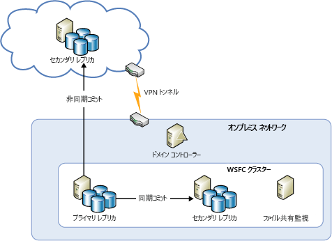
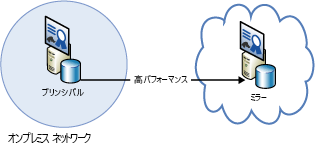
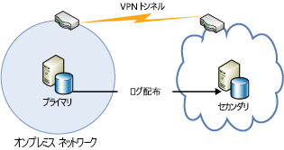
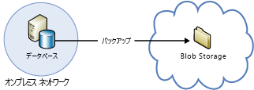

[!INCLUDE [header](../_includes/header.md)]
# Azure の回復性に関する技術ガイダンス - オンプレミスから Azure への復旧Azure resiliency technical guidance: Recovery from on-premises to Azure
Azure は、高可用性とディザスター リカバリーの目的で、オンプレミスのデータセンターから Azure への拡張を可能にする包括的なサービスのセットを提供します。Azure provides a comprehensive set of services for enabling the extension of an on-premises datacenter to Azure for high availability and disaster recovery purposes:

* **Network**: 仮想プライベート ネットワークによって、オンプレミスのネットワークをクラウドに安全に拡張できます。**Networking**: With a virtual private network, you securely extend your on-premises network to the cloud.
* **Compute**: Hyper-V をオンプレミスで使用しているお客様は、"リフトとシフト" によって既存の仮想マシン (VM) を Azure に移行できます。**Compute**: Customers using Hyper-V on-premises can “lift and shift” existing virtual machines (VMs) to Azure.
* **Storage**: StorSimple でファイル システムを Azure Storage に拡張します。**Storage**: StorSimple extends your file system to Azure Storage. Azure Backup サービスでは、ファイルや SQL データベースを Azure Storage にバックアップできます。The Azure Backup service provides backup for files and SQL databases to Azure Storage.
* 
            **データベースのレプリケーション**: SQL Server 2014 (またはそれ以降) の可用性グループでは、オンプレミスのデータに対して高可用性とディザスター リカバリーを実装できます。**Database replication**: With SQL Server 2014 (or later) Availability Groups, you can implement high availability and disaster recovery for your on-premises data.

## NetworkNetworking
Azure Virtual Network を使用すると、論理的に切り離されたセクションを Azure 内に作成し、IPsec 接続を使用してオンプレミス データセンターまたは単一のクライアント コンピューターに安全に接続できます。You can use Azure Virtual Network to create a logically isolated section in Azure and securely connect it to your on-premises datacenter or a single client machine by using an IPsec connection. Virtual Network を使用すると、Windows Server、メインフレーム、UNIX で実行中のシステムを含むオンプレミス システムにあるデータおよびアプリケーションへの接続性を保ちながら、Azure のスケーラブルなオンデマンドのインフラストラクチャを活用できます。With Virtual Network, you can take advantage of the scalable, on-demand infrastructure in Azure while providing connectivity to data and applications on-premises, including systems running on Windows Server, mainframes, and UNIX. 詳細については、 [Azure Network のドキュメント](/azure/virtual-network/virtual-networks-overview/) を参照してください。See [Azure networking documentation](/azure/virtual-network/virtual-networks-overview/) for more information.

## 計算Compute
Hyper-V をオンプレミスで使用している場合は、"リフトとシフト" によって既存の仮想マシンを Azure、および Windows Server 2012 (またはそれ以降) を実行するサービス プロバイダーに移行できます。VM に変更を加えたり、VM 形式を変換したりする必要はありません。If you're using Hyper-V on-premises, you can “lift and shift” existing virtual machines to Azure and service providers running Windows Server 2012 (or later), without making changes to the VM or converting VM formats. 詳細については、「[Azure 仮想マシン用のディスクと VHD について](/azure/virtual-machines/virtual-machines-linux-about-disks-vhds/?toc=%2fazure%2fvirtual-machines%2flinux%2ftoc.json)」を参照してください。For more information, see [About disks and VHDs for Azure virtual machines](/azure/virtual-machines/virtual-machines-linux-about-disks-vhds/?toc=%2fazure%2fvirtual-machines%2flinux%2ftoc.json).

## Azure Site RecoveryAzure Site Recovery
サービスとしてのディザスター リカバリー (DRaaS) を希望する場合は、[Azure Site Recovery](https://azure.microsoft.com/services/site-recovery/)を利用できます。If you want disaster recovery as a service (DRaaS), Azure provides [Azure Site Recovery](https://azure.microsoft.com/services/site-recovery/). Azure Site Recovery は、VMware、Hyper-V、および物理サーバーの包括的な保護を提供します。Azure Site Recovery offers comprehensive protection for VMware, Hyper-V, and physical servers. Azure Site Recovery では、別のオンプレミス サーバーまたは Azure を復旧サイトとして使用することができます。With Azure Site Recovery, you can use another on-premises server or Azure as your recovery site. Azure Site Recovery の詳細については、 [Azure Site Recovery のドキュメント](https://azure.microsoft.com/documentation/services/site-recovery/)を参照してください。For more information on Azure Site Recovery, see the [Azure Site Recovery documentation](https://azure.microsoft.com/documentation/services/site-recovery/).

## StorageStorage
オンプレミスのデータのバックアップ サイトとして Azure を使用する場合、いくつかのオプションがあります。There are several options for using Azure as a backup site for on-premises data.

### StorSimpleStorSimple
StorSimple は、オンプレミスのアプリケーション用のクラウド ストレージを安全かつ透過的に統合します。StorSimple securely and transparently integrates cloud storage for on-premises applications. また、パフォーマンスの高い階層型のローカルとクラウドのストレージ、ライブ アーカイブ、クラウドベースのデータ保護、障害復旧を実現する単一のアプライアンスを提供します。It also offers a single appliance that delivers high-performance tiered local and cloud storage, live archiving, cloud-based data protection, and disaster recovery. 詳細については、 [StorSimple 製品のページ](https://azure.microsoft.com/services/storsimple/)を参照してください。For more information, see the [StorSimple product page](https://azure.microsoft.com/services/storsimple/).

### Azure BackupAzure Backup
Azure Backup を使用すると、Windows Server 2012 (またはそれ以降)、Windows Server 2012 Essentials (またはそれ以降)、および System Center 2012 Data Protection Manager (またはそれ以降) で、使い慣れたバックアップ ツールによるクラウドでのバックアップを行うことができます。Azure Backup enables cloud backups by using the familiar backup tools in Windows Server 2012 (or later), Windows Server 2012 Essentials (or later), and System Center 2012 Data Protection Manager (or later). これらのツールにより、バックアップのストレージの場所がローカル ディスクか Azure Storage かに関係なく、バックアップ管理のためのワークフローを確立できます。These tools provide a workflow for backup management that is independent of the storage location of the backups, whether a local disk or Azure Storage. データがクラウドにバックアップされたのち、許可されているユーザーは簡単にバックアップをサーバーに回復できます。After data is backed up to the cloud, authorized users can easily recover backups to any server.

増分バックアップにより、ファイルの変更部分だけがクラウドに転送されます。With incremental backups, only changes to files are transferred to the cloud. そうすることで、ストレージの効率的な使用、帯域幅の消費の削減、および複数のバージョンのデータの特定の時点への復旧が可能になります。This helps to efficiently use storage space, reduce bandwidth consumption, and support point-in-time recovery of multiple versions of the data. データ保持ポリシー、データ圧縮、データ転送スロットルなどの追加機能を使用することもできます。You can also choose to use additional features, such as data retention policies, data compression, and data transfer throttling. Azure をバックアップの場所として使用すると、バックアップが自動的に "オフサイト" になるという明らかな利点があります。Using Azure as the backup location has the obvious advantage that the backups are automatically “offsite”. これにより、オンサイトのバックアップ メディアを保護するための追加の要件が不要になります。This eliminates the extra requirements to secure and protect on-site backup media.

詳細については、「[Azure Backup とは](/azure/backup/backup-introduction-to-azure-backup/)」と「[Azure Backup への DPM データの構成](https://technet.microsoft.com/library/jj728752.aspx)」を参照してください。For more information, see [What is Azure Backup?](/azure/backup/backup-introduction-to-azure-backup/) and [Configure Azure Backup for DPM data](https://technet.microsoft.com/library/jj728752.aspx).

## データベースDatabase
ハイブリッド IT 環境内の SQL Server データベースのディザスター リカバリー ソリューションを実現するには、AlwaysOn 可用性グループ、データベース ミラーリング、ログ配布、および Azure Blob Storage によるバックアップと復元を使用します。You can have a disaster recovery solution for your SQL Server databases in a hybrid-IT environment by using AlwaysOn Availability Groups, database mirroring, log shipping, and backup and restore with Azure Blob storage. これらすべてのソリューションは、Azure Virtual Machines で実行される SQL Server を使用します。All of these solutions use SQL Server running on Azure Virtual Machines.

AlwaysOn 可用性グループは、オンプレミスとクラウドの両方にデータベースのレプリカが存在するハイブリッド IT 環境で使用できます。AlwaysOn Availability Groups can be used in a hybrid-IT environment where database replicas exist both on-premises and in the cloud. これを次の図に示します。This is shown in the following diagram.

データベース ミラーリングは、証明書ベースのセットアップにおいて、オンプレミスのサーバーとクラウドにまたがって実行することもできます。Database mirroring can also span on-premises servers and the cloud in a certificate-based setup. 次の図にこの概念を示します。The following diagram illustrates this concept.

ログ配布を使用して、オンプレミスのデータベースを Azure 仮想マシン内の SQL Server データベースと同期することができます。Log shipping can be used to synchronize an on-premises database with a SQL Server database in an Azure virtual machine.

最後に、オンプレミスのデータベースを Azure Blob Storage に直接バックアップできます。Finally, you can back up an on-premises database directly to Azure Blob storage.

詳細については、「[Azure 仮想マシンにおける SQL Server の高可用性とディザスター リカバリー](/azure/virtual-machines/windows/sql/virtual-machines-windows-sql-high-availability-dr/)」と「[Azure Virtual Machines における SQL Server のバックアップと復元](/azure/virtual-machines/windows/sql/virtual-machines-windows-sql-backup-recovery/)」を参照してください。For more information, see [High availability and disaster recovery for SQL Server in Azure virtual machines](/azure/virtual-machines/windows/sql/virtual-machines-windows-sql-high-availability-dr/) and [Backup and restore for SQL Server in Azure virtual machines](/azure/virtual-machines/windows/sql/virtual-machines-windows-sql-backup-recovery/).

## Microsoft Azure でのオンプレミスの回復のためのチェックリストChecklists for on-premises recovery in Microsoft Azure
### NetworkNetworking
1. このドキュメントの「ネットワーク」セクションを確認する。Review the Networking section of this document.
2. Virtual Network を使用してオンプレミスをクラウドに安全に接続する。Use Virtual Network to securely connect on-premises to the cloud.

### ComputeCompute
1. このドキュメントの「計算」セクションを確認する。Review the Compute section of this document.
2. VM を Hyper-V と Azure 間に再配置する。Relocate VMs between Hyper-V and Azure.

### StorageStorage
1. このドキュメントの「Storage」セクションを確認する。Review the Storage section of this document.
2. クラウド ストレージを使用するために StorSimple サービスを利用する。Take advantage of StorSimple services for using cloud storage.
3. Azure Backup サービスを使用する。Use the Azure Backup service.

### データベースDatabase
1. このドキュメントの「データベース」セクションを確認する。Review the Database section of this document.
2. Azure VM でバックアップとしての SQL Server の使用を検討する。Consider using SQL Server on Azure VMs as the backup.
3. AlwaysOn 可用性グループを設定する。Set up AlwaysOn Availability Groups.
4. 証明書ベースのデータベース ミラーリングを構成する。Configure certificate-based database mirroring.
5. ログ配布を使用する。Use log shipping.
6. オンプレミスのデータベースを Azure Blob Storage にバックアップする。Back up on-premises databases to Azure Blob storage.

