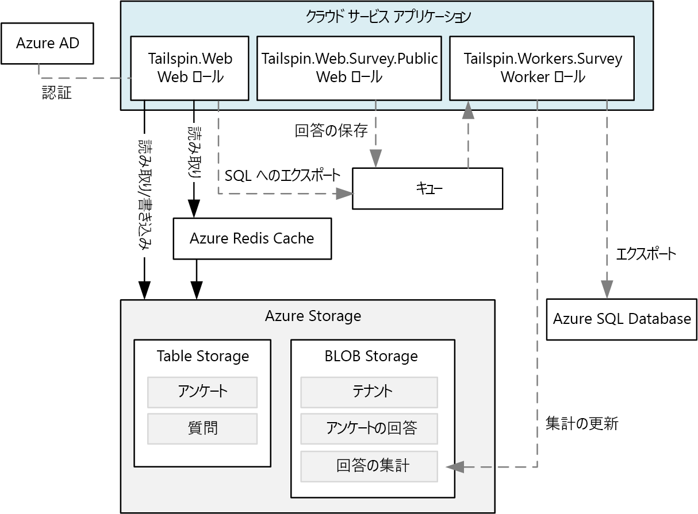
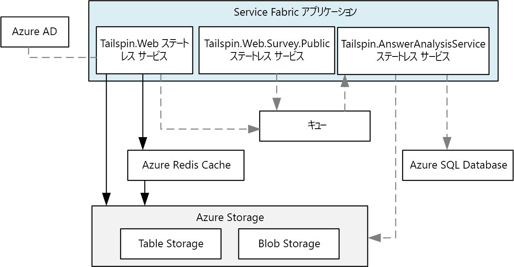
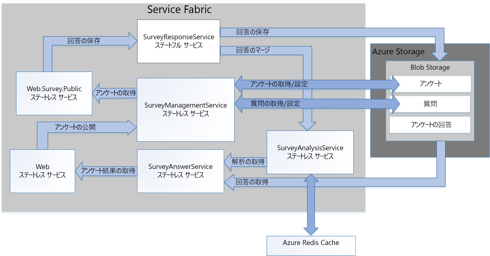

# <a name="refactor-an-azure-service-fabric-application-migrated-from-azure-cloud-services"></a>Azure Cloud Services から移行した Azure Service Fabric アプリケーションをリファクタリングする

[ サンプル コード][sample-code]

この記事では、既存の Azure Service Fabric アプリケーションをよりきめ細かなアーキテクチャへとリファクタリングする方法について説明します。 この記事で重点的に取り上げているのは、リファクタリング対象の Service Fabric アプリケーションの設計、パッケージ、パフォーマンス、およびデプロイに関する考慮事項です。

## <a name="scenario"></a>シナリオ

前の記事「[Azure Cloud Services アプリケーションを Azure Service Fabric に移行する][migrate-from-cloud-services]」で説明したように、2012 年、パターンとプラクティスを担当するチームは、Azure での Cloud Services アプリケーションの設計および実装プロセスに関する書籍を共同で執筆しました。 この書籍では、**Surveys** という名前の Cloud Services アプリケーションを作成したいと考えている、Tailspin という架空の企業のことを描写しています。 この Surveys アプリケーションを使用すると、一般の人が回答できるアンケートをユーザーが作成して公開できます。 次の図は、このバージョンの Surveys アプリケーションのアーキテクチャを示しています。



**Tailspin.Web** Web ロールは ASP.NET MVC サイトをホストします。Tailspin の顧客は、このサイトを使用して次を行います。
* Surveys アプリケーションにサインアップする。
* 1 つのアンケートを作成または削除する。
* 1 つのアンケートの結果を表示する。
* そのアンケート結果を SQL にエクスポートするよう要求する
* アンケート結果の集計と分析を表示する。

また、**Tailspin.Web.Survey.Public** Web ロールは、一般の人がアンケートに回答するためにアクセスする ASP.NET MVC サイトをホストしています。 こうした回答はキューに置かれ、保存されます。

**Tailspin.Workers.Survey** worker ロールは、複数のキューから要求を選択することでバックグラウンド処理を実行します。

その後、パターンおよびプラクティス チームは、このアプリケーションを Azure Service Fabric に移植する新しいプロジェクトを作成しました。 このプロジェクトの目標は、必要なコード変更を行うだけで、Azure Service Fabric クラスターでアプリケーションが実行されるようにすることでした。 そのため、元の Web および worker ロールは、よりきめ細かなアーキテクチャに分解されませんでした。 結果として、アーキテクチャは、このアプリケーションのクラウド サービス バージョンとよく似たものになります。



**Tailspin.Web** サービスは、元の *Tailspin.Web* Web ロールから移植されます。

**Tailspin.Web.Survey.Public** サービスは、元の *Tailspin.Web.Survey.Public* Web ロールから移植されます。

**Tailspin.AnswerAnalysisService** サービスは、元の *Tailspin.Workers.Survey* worker ロールから移植されます。

> [!NOTE] 
> 各 Web ロールと worker ロールに行われたコード変更は必要最小限のものでしたが、**Tailspin.Web** と **Tailspin.Web.Survey.Public** は、[Kestrel] Web サーバーをセルフホストするように変更されました。 前の Surveys アプリケーションは、インターネット インフォメーション サービス (IIS) を使用してホストされた ASP.Net アプリケーションですが、Service Fabric では IIS をサービスとして実行できません。 したがって、すべての Web サーバーが、[Kestrel] のように、セルフホストできなければなりません。 状況によっては、IIS を Service Fabric のコンテナーで実行することができます。 詳細については、[コンテナー使用のシナリオ][container-scenarios]に関するページをご覧ください。  

ここで、Tailspin は、Surveys アプリケーションを、よりきめ細かなアーキテクチャにリファクタリングします。 Tailspin がリファクタリングを行う動機は、Surveys アプリケーションの開発、ビルド、およびデプロイを行いやすくすることです。 Tailspin は、既存の Web および worker ロールをきめ細かなアーキテクチャに分解することで、こうしたロール間で密接に結合された既存の通信とデータの依存関係を削除したいと考えています。

Tailspin は、Surveys アプリケーションをきめ細かなアーキテクチャに移行することには他にも利点があると見ています。
* 各サービスを、小規模なチームで管理できるくらい小さな範囲をカバーする独立したプロジェクトにパッケージ化できます。
* サービスごとに個別にバージョン管理とデプロイを行うことができます。
* 最適なテクノロジを使用して各サービスを実装できます。 たとえば、異なるバージョンの .Net Framework、Java、またはその他の言語 (C、C++ など) を使用して構築されたサービスを、サービス ファブリック クラスターに含めることができます。
* 負荷の増減に合わせて各サービスを個別に拡大縮小できます。

> [!NOTE] 
> マルチテナントは、このアプリケーションのリファクタリングの対象外です。 Tailspin は、マルチテナント機能をサポートする複数のオプションを有しており、このような設計上の決定は、初期設計に影響を与えることなく後からでも行うことができます。 たとえば、Tailspin は、クラスター内でテナントごとにサービス インスタンスを個別に作成できます。また、テナントごとに個別のクラスターを作成することもできます。

## <a name="design-considerations"></a>設計上の考慮事項
 
次の図は、よりきめ細かなアーキテクチャにリファクタリングされた Surveys アプリケーションのアーキテクチャを示しています。



**Tailspin.Web** は、Tailspin の顧客がアンケートを作成し、アンケート結果を確認するためにアクセスする ASP.NET MVC アプリケーションをセルフホストするステートレス サービスです。 このサービスは、そのコードのほとんどを、移植された Service Fabric アプリケーションの *Tailspin.Web* サービスと共有します。 前に説明したように、このサービスでは ASP.NET Core を使用し、Web フロントエンドとしての Kestrel の使用から、WebListener の実装へと切り替えます。

**Tailspin.Web.Survey.Public** はステートレス サービスで、これも ASP.NET MVC サイトをセルフホストします。 ユーザーはこのサイトにアクセスして、一覧からアンケートを選択し、回答を入力します。このサービスは、そのコードのほとんどを、移植された Service Fabric アプリケーションの *Tailspin.Web.Survey.Public* サービスと共有します。 また、このサービスも ASP.NET Core を使用し、さらに Web フロントエンドとしての Kestrel の使用から、WebListener の実装への切り替えも行います。

**Tailspin.SurveyResponseService** は、アンケートの回答を Azure Blob Storage に格納するステートフル サービスです。 また、回答をアンケート分析データにマージします。 このサービスは、[ReliableConcurrentQueue][reliable-concurrent-queue] を使用してアンケートの回答の一括処理するため、ステートフル サービスとして実装されます。 この機能は、当初は移植された Service Fabric アプリケーションの *Tailspin.AnswerAnalysisService* サービスで実装されていました。

**Tailspin.SurveyManagementService** は、アンケートとアンケートの質問を格納および取得するステートレス サービスです。 このサービスでは Azure Blob Storage が使用されます。 この機能も、当初は移植された Service Fabric アプリケーションの *Tailspin.Web* および *Tailspin.Web.Survey.Public* サービスのデータ アクセス コンポーネントで実装されていました。 Tailspin は、元の機能をこのサービスにリファクタリングして、個別に拡大縮小できるようにしました。

**Tailspin.SurveyAnswerService** は、アンケートの回答と分析を取得するステートレス サービスです。 このサービスでも Azure Blob Storage が使用されます。 この機能も、当初は移植された Service Fabric アプリケーションの *Tailspin.Web* サービスのデータ アクセス コンポーネントで実装されていました。 Tailspin は、元の機能をこのサービスにリファクタリングしました。負荷が小さいことが予測されたため、使用するインスタンスを少なくして、リソースを節約したいと考えたためです。

**Tailspin.SurveyAnalysisService** は、アンケートの回答の概要データを迅速に取得できるように Redis Cache に保持するステートレス サービスです。 このサービスは、アンケートに回答が入力され、新しいアンケート回答データが概要データにマージされるたびに *Tailspin.SurveyResponseService* によって呼び出されます。 このサービスは、移植された Service Fabric アプリケーションからの *Tailspin.AnswerAnalysisService* サービスで当初は実装されていた機能を含みます。

## <a name="stateless-versus-stateful-services"></a>ステートレス サービスとステートフル サービス

Azure Service Fabric では、次のプログラミング モデルがサポートされています。
* ゲスト実行可能ファイル モデルにより、すべて実行可能ファイルをサービスとしてパッケージ化し、Service Fabric クラスターに展開できます。 Service Fabric では、ゲスト実行可能ファイルの実行が調整および管理されます。
* コンテナー モデルにより、コンテナー イメージのサービスのデプロイが可能です。 Service Fabric では、Linux カーネル コンテナーおよび Windows Server コンテナー上でのコンテナーの作成と管理がサポートされます。 
* 信頼できるサービス プログラミング モデルにより、すべての Service Fabric プラットフォーム機能と統合される、ステートレス サービスまたはステートフル サービスを作成できます。 ステートフル サービスでは、レプリケート状態を Service Fabric クラスターに格納できます。 ステートレス サービスではそれができません。
* 信頼できるアクター プログラミング モデルでは、仮想アクター パターンを実装するサービスの作成が可能です。

Surveys アプリケーションでは、*Tailspin.SurveyResponseService* サービスを除くすべてのサービスが、信頼できるステートレス サービスです。 このサービスは [ReliableConcurrentQueue][reliable-concurrent-queue] を実装して、アンケートの回答は届いたときに処理されます。 ReliableConcurrentQueue の応答は Azure Blob Storage に保存され、分析のために *Tailspin.SurveyAnalysisService* に渡されます。 応答には Azure Service Bus などのキューによって提供される厳密な先入れ先出し (FIFO) の順序付けは必要ないため、Tailspin は、ReliableConcurrentQueue を選択します。 さらに、ReliableConcurrentQueue は、キューおよびデキュー操作で高スループットと低待機時間を実現するように設計されています。

ReliableConcurrentQueue からデキューされる項目を保持する操作はできる限りべき等にすることをお勧めします。 キューからの項目を処理中に例外がスローされると、その項目は複数回処理される可能性があります。 Surveys アプリケーションでは、アンケートの回答を *Tailspin.SurveyAnalysisService* にマージする操作はべき等ではありません。これは、Tailspin が、分析データの現在のスナップショットはアンケート分析データのみで、一貫性を持たせる必要がないと判断したためです。 Azure Blob Storage に保存されたアンケートの回答の一貫性は最終的には確保されます。したがって、アンケートの最終分析は、このデータから常に正しく再計算されます。

## <a name="communication-framework"></a>通信フレームワーク

Surveys アプリケーションの各サービスが、RESTful Web API を使用して通信します。 RESTful API には次の利点があります。
* 使いやすい: 各サービスが ASP.Net Core MVC を使用して構築されています。これは Web API の作成をネイティブでサポートしています。
* セキュリティ: 各サービスに SSL は必要ありませんが、Tailspin は各サービスで SSL 接続を使用することを必須にすることもできます。 
* バージョン管理: 特定バージョンの Web API に対して、クライアントの書き込みおよびテストを行うことができます。

Surveys アプリケーションのサービスでは、Service Fabric によって実装される[リバース プロキシ][reverse-proxy]が使用されます。 リバース プロキシは、Service Fabric クラスターの各ノードで実行されるサービスで、エンドポイント解決、自動再試行を提供するほか、その他の種類の接続エラーを処理します。 リバース プロキシを使用するために、特定のサービスへの各 RESTful API 呼び出しが、定義済みのリバース プロキシ ポートを使用して行われます。  たとえば、リバース プロキシ ポートが **19081** に設定されている場合、*Tailspin.SurveyAnswerService* への呼び出しは次のように行われます。

```csharp
static SurveyAnswerService()
{
    httpClient = new HttpClient
    {
        BaseAddress = new Uri("http://localhost:19081/Tailspin/SurveyAnswerService/")
    };
}
```
リバース プロキシを有効にするには、Service Fabric クラスターの作成中にリバース プロキシ ポートを指定します。 詳細については、Azure Service Fabric の[リバース プロキシ][reverse-proxy]に関するページをご覧ください。

## <a name="performance-considerations"></a>パフォーマンスに関する考慮事項

Tailspin は、Visual Studio テンプレートを使用して、*Tailspin.Web* および *Tailspin.Web.Surveys.Public* の ASP.NET Core サービスを作成しました。 既定では、このようなテンプレートには、コンソールへのログ記録が含まれます。 コンソールへのログ記録は開発およびデバッグ中に行われる可能性がありますが、こうしたコンソールへのログ記録はすべて、アプリケーションを運用環境にデプロイするときに削除する必要があります。

> [!NOTE]
> 運用環境で実行されている Service Fabric アプリケーションの監視および診断を設定する方法の詳細については、Azure Service Fabric の[監視と診断][monitoring-diagnostics]に関するページをご覧ください。

たとえば、各 Web フロントエンド サービスの *startup.cs* の次の行は、コメント アウトする必要があります。

```csharp
// This method gets called by the runtime. Use this method to configure the HTTP request pipeline.
public void Configure(IApplicationBuilder app, IHostingEnvironment env, ILoggerFactory loggerFactory)
{
    //loggerFactory.AddConsole(Configuration.GetSection("Logging"));
    //loggerFactory.AddDebug();

    app.UseMvc();
}
```

> [!NOTE]
> こうした行は、公開時、Visual Studio が "リリース" に設定されているときは条件付きで除外できます。

最終的に、Tailspin は Tailspin アプリケーションを運用環境にデプロイするとき、Visual Studio を**リリース** モードに切り替えます。

## <a name="deployment-considerations"></a>デプロイに関する考慮事項

リファクタリングされた Surveys アプリケーションは 5 つのステートレス サービスと 1 つのステートフル サービスで構成されるため、クラスター計画では、適切な VM サイズとノード数を決定することしかできません。 クラスターについて記述する *applicationmanifest.xml* ファイルで、Tailspin は、各サービスの *StatelessService* タグの *InstanceCount* 属性を -1 に設定します。 -1 という値は、Service Fabric に対して、クラスターの各ノードに 1 つのサービス インスタンスを作成するよう指示します。

> [!NOTE]
> ステートフル サービスでは、そのデータ用に正しい数のパーティションとレプリカを計画する追加手順が必要です。

Tailspin では、Azure Portal を使用してクラスターをデプロイします。 Service Fabric クラスター リソースの種類により、VM スケール セット、ロード バランサーなど、必要なインフラストラクチャすべてがデプロイされます。 推奨される VM のサイズは、Service Fabric クラスターのプロビジョニング プロセス中に Azure Portal に表示されます。 VM は VM スケール セットにデプロイされるため、ユーザーの負荷が増えたときにスケールアップおよびスケールアウトの両方が可能であることに注意してください。

> [!NOTE]
> 前に説明したように、移行済みバージョンの Surveys アプリケーションでは、ASP.Net Core と Web サーバーとしての Kestrel を使用して 2 つの Web フロントエンドがセルフホストされました。 移行済みバージョンの Surveys アプリケーションではリバース プロキシを使用していませんが、IIS、Nginx、Apache などのリバース プロキシを使用することを強くお勧めします。 詳細については、[ASP.NET Core への Kestrel Web サーバーの実装の概要][kestrel-intro]に関するページをご覧ください。
> リファクタリングされた Surveys アプリケーションでは、2 つの Web フロントエンドが、ASP.Net Core と Web サーバーとしての [WebListener][weblistener] を使用してセルフホストされるため、リバース プロキシは必要ありません。

## <a name="next-steps"></a>次の手順

Surveys アプリケーション コードは [GitHub][sample-code] から入手できます。

[Azure Service Fabric][service-fabric] を使い始めたばかりの場合は、まず開発環境をセットアップし、最新の [Azure SDK][azure-sdk] と [Azure Service Fabric SDK][service-fabric-sdk] をダウンロードしてください。 SDK には OneBox クラスター マネージャーが含まれており、ローカルに Surveys アプリケーションを展開し、F5 完全デバッグを使用してテストできます。

<!-- links -->
[azure-sdk]: https://azure.microsoft.com/downloads/archive-net-downloads/
[container-scenarios]: /azure/service-fabric/service-fabric-containers-overview
[kestrel]: https://docs.microsoft.com/aspnet/core/fundamentals/servers/kestrel?tabs=aspnetcore2x
[kestrel-intro]: https://docs.microsoft.com/aspnet/core/fundamentals/servers/kestrel?tabs=aspnetcore1x
[migrate-from-cloud-services]: migrate-from-cloud-services.md
[monitoring-diagnostics]: /azure/service-fabric/service-fabric-diagnostics-overview
[reliable-concurrent-queue]: /azure/service-fabric/service-fabric-reliable-services-reliable-concurrent-queue
[reverse-proxy]: /azure/service-fabric/service-fabric-reverseproxy
[sample-code]: https://github.com/mspnp/cloud-services-to-service-fabric/tree/master/servicefabric-phase-2
[service-fabric]: /azure/service-fabric/service-fabric-get-started
[service-fabric-sdk]: /azure/service-fabric/service-fabric-get-started
[weblistener]: https://docs.microsoft.com/aspnet/core/fundamentals/servers/weblistener
