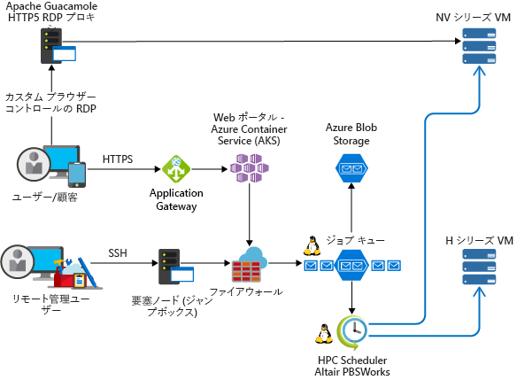

<!-- markdownlint-disable MD033 -->
<!-- markdownlint-disable MD026 -->

# Azure でのハイ パフォーマンス コンピューティング (HPC)High Performance Computing (HPC) on Azure

## HPC の概要Introduction to HPC

<!-- markdownlint-disable MD034 -->

> [!VIDEO https://www.youtube.com/embed/rKURT32faJk]

<!-- markdownlint-enable MD034 -->

"ビッグ コンピューティング" とも呼ばれるハイ パフォーマンス コンピューティング (HPC) では、CPU または GPU ベースのコンピューターを大量に使用して、複雑な数学的タスクを解決します。High Performance Computing (HPC), also called "Big Compute", uses a large number of CPU or GPU-based computers to solve complex mathematical tasks.

多くの業界では HPC を使用して、最も困難な問題の一部を解決しています。Many industries use HPC to solve some of their most difficult problems.  これらには、以下のようなワークロードがあります。These include workloads such as:

- GenomicsGenomics
- 石油およびガスのシミュレーションOil and gas simulations
- FinanceFinance
- 半導体の設計Semiconductor design
- EngineeringEngineering
- 天気のモデリングWeather modeling

### クラウドでの HPC の違いHow is HPC different on the cloud?

オンプレミスの HPC システムとクラウドのそれとの主な違いの 1 つは、必要に応じてリソースを動的に追加および削除できることです。One of the primary differences between an on-premise HPC system and one in the cloud is the ability for resources to dynamically be added and removed as they're needed.  動的スケーリングによって、コンピューター能力がボトルネットになることがなく、お客様はジョブの要件に応じてインフラストラクチャを適切にサイズ調整できます。Dynamic scaling removes compute capacity as a bottleneck and instead allow customers to right size their infrastructure for the requirements of their jobs.

次の記事では、この動的スケーリング機能について詳しく説明します。The following articles provide more detail about this dynamic scaling capability.

- [ビッグ コンピューティング アーキテクチャ スタイルBig Compute Architecture Style](/azure/architecture/guide/architecture-styles/big-compute?context=/azure/architecture/topics/high-performance-computing/context/hpc-context)
- [自動スケーリングのベスト プラクティスAutoscaling best practices](/azure/architecture/best-practices/auto-scaling?context=/azure/architecture/topics/high-performance-computing/context/hpc-context)

## 実装チェックリストImplementation checklist

独自の HPC ソリューションを Azure に実装しようとしている場合は、以下のトピックをご確認ください。As you're looking to implement your own HPC solution on Azure, ensure you're reviewed the following topics:

<!-- markdownlint-disable MD032 -->

> [!div class="checklist"]
> - 要件に基づいて適切な[アーキテクチャ](#infrastructure)を選択するChoose the appropriate [architecture](#infrastructure) based on your requirements
> - ワークロードに適した[コンピューティング](#compute) オプションを把握するKnow which [compute](#compute) options is right for your workload
> - ニーズを満たす適切な[ストレージ](#storage) ソリューションを特定するIdentify the right [storage](#storage) solution that meets your needs
> - すべてのリソースを[管理](#management)することになる方法を決定するDecide how you're going to [manage](#management) all your resources
> - クラウドに対して[アプリケーション](#hpc-applications)を最適化するOptimize your [application](#hpc-applications) for the cloud
> - インフラストラクチャを[セキュリティで保護](#security)する[Secure](#security) your Infrastructure

<!-- markdownlint-enable MD032 -->

## インフラストラクチャInfrastructure

HPC システムの構築には、多数のインフラストラクチャ コンポーネントが必要です。There are a number of infrastructure components necessary to build an HPC system.  どのような方法で HPC ワークロードを管理することにしても、基礎となるコンポーネントを提供するのは、コンピューティング、ストレージ、およびネットワークです。Compute, Storage, and Networking provide the underlying components, no matter how you choose to manage your HPC workloads.

### HPC アーキテクチャの例Example HPC architectures

HPC アーキテクチャを設計して Azure に実装するには、さまざまな方法があります。There are a number of different ways to design and implement your HPC architecture on Azure.  HPC アプリケーションは、数千のコンピューティング コアにスケーリングしたり、オンプレミスのクラスターに拡張したり、100% クラウド ネイティブのソリューションとして実行したりできます。HPC applications can scale to thousands of compute cores, extend on-premises clusters, or run as a 100% cloud native solution.

次のシナリオでは、HPC ソリューションを構築する一般的な方法をいくつか説明します。The following scenarios outline a few of the common ways HPC solutions are built.

<ul class="columns is-multiline has-margin-left-none has-margin-bottom-none has-padding-top-medium">
    <li class="column is-one-third has-padding-top-small-mobile has-padding-bottom-small">
        <a class="is-undecorated is-full-height is-block"
            href="/azure/architecture/example-scenario/apps/hpc-saas?context=/azure/architecture/topics/high-performance-computing/context/hpc-context">
            <article class="card has-outline-hover is-relative is-fullheight">
                    <figure class="image has-margin-right-none has-margin-left-none has-margin-top-none has-margin-bottom-none">
                        
                    </figure>
                

                    

                        <h3 class="is-size-4 has-margin-top-none has-margin-bottom-none has-text-primary">Azure でのコンピューター支援エンジニアリング サービスComputer-aided engineering services on Azure</h3>
                    

                    

                        
Azure で、コンピューター支援エンジニアリング (CAE) に、サービスとしてのソフトウェア (SaaS) プラットフォームを提供します。Provide a software-as-a-service (SaaS) platform for computer-aided engineering (CAE) on Azure.

                    

                

            </article>
        </a>
    </li>
    <li class="column is-one-third has-padding-top-small-mobile has-padding-bottom-small">
        <a class="is-undecorated is-full-height is-block"
            href="/azure/architecture/example-scenario/infrastructure/hpc-cfd?context=/azure/architecture/topics/high-performance-computing/context/hpc-context">
            <article class="card has-outline-hover is-relative is-fullheight">
                    <figure class="image has-margin-right-none has-margin-left-none has-margin-top-none has-margin-bottom-none">
                        
                    </figure>
                

                    

                        <h3 class="is-size-4 has-margin-top-none has-margin-bottom-none has-text-primary">Azure での計算流体力学 (CFD) シミュレーションComputational fluid dynamics (CFD) simulations on Azure</h3>
                    

                    

                        
Azure で計算流体力学 (CFD) シミュレーションを実行します。Execute computational fluid dynamics (CFD) simulations on Azure.

                    

                

            </article>
        </a>
    </li>
    <li class="column is-one-third has-padding-top-small-mobile has-padding-bottom-small">
        <a class="is-undecorated is-full-height is-block"
            href="/azure/architecture/example-scenario/infrastructure/video-rendering?context=/azure/architecture/topics/high-performance-computing/context/hpc-context">
            <article class="card has-outline-hover is-relative is-fullheight">
                    <figure class="image has-margin-right-none has-margin-left-none has-margin-top-none has-margin-bottom-none">
                        
                    </figure>
                

                    

                        <h3 class="is-size-4 has-margin-top-none has-margin-bottom-none has-text-primary">Azure での 3D ビデオのレンダリング3D video rendering on Azure</h3>
                    

                    

                        
Azure Batch サービスを使用して、Azure でネイティブ HPC ワークロードを実行します。Run native HPC workloads in Azure using the Azure Batch service

                    

                

            </article>
        </a>
    </li>
</ul>

### ComputeCompute

Azure では、CPU の負荷が高いワークロードと GPU の負荷が高いワークロードの両方に対して最適化された幅広いサイズが提供されています。Azure offers a range of sizes that are optimized for both CPU & GPU intensive workloads.

#### CPU ベースの仮想マシンCPU-based virtual machines

- [Linux VMLinux VMs](/azure/virtual-machines/linux/sizes-hpc?context=/azure/architecture/topics/high-performance-computing/context/hpc-context)
- [Windows VM](/azure/virtual-machines/windows/sizes-hpc?context=/azure/architecture/topics/high-performance-computing/context/hpc-context) の VM[Windows VM's](/azure/virtual-machines/windows/sizes-hpc?context=/azure/architecture/topics/high-performance-computing/context/hpc-context) VMs
  
#### GPU 対応仮想マシンGPU-enabled virtual machines

N シリーズ VM は、人工知能 (AI) の学習や視覚化などによりコンピューティングやグラフィック使用量が多いアプリケーションのために設計された NVIDIA GPU を採用しています。N-series VMs feature NVIDIA GPUs designed for compute-intensive or graphics-intensive applications including artificial intelligence (AI) learning and visualization.

- [Linux VMLinux VMs](/azure/virtual-machines/linux/sizes-gpu?context=/azure/architecture/topics/high-performance-computing/context/hpc-context)
- [Windows VMWindows VMs](/azure/virtual-machines/windows/sizes-gpu?context=/azure/architecture/topics/high-performance-computing/context/hpc-context)

### StorageStorage

バッチ ワークロードや HPC ワークロードが大規模の場合には、従来のクラウド ファイル システムの容量を上回るデータ ストレージが必要になったり、データ アクセスが発生したりします。Large-scale Batch and HPC workloads have demands for data storage and access that exceed the capabilities of traditional cloud file systems.  Azure 上の HPC アプリケーションの速度ニーズと容量ニーズ、両方に対応できるソリューションが多数ありますThere are a number of solutions to manage both the speed and capacity needs of HPC applications on Azure

- [Avere vFXT](https://azure.microsoft.com/services/storage/avere-vfxt/) (データ ストレージに対する処理速度とアクセス性を高め、エッジでハイパフォーマンス コンピューティングを実現)[Avere vFXT](https://azure.microsoft.com/services/storage/avere-vfxt/) for faster, more accessible data storage for high-performance computing at the edge
- [BeeGFSBeeGFS](https://azure.microsoft.com/resources/implement-glusterfs-on-azure/)
- [ストレージ最適化仮想マシンStorage Optimized Virtual Machines](/azure/virtual-machines/windows/sizes-storage?context=/azure/architecture/topics/high-performance-computing/context/hpc-context)
- [Blob、Table、Queue StorageBlob, table, and queue storage](/azure/storage/storage-introduction?context=/azure/architecture/topics/high-performance-computing/context/hpc-context)
- [Azure SMB ファイル ストレージAzure SMB File storage](/azure/storage/files/storage-files-introduction?context=/azure/architecture/topics/high-performance-computing/context/hpc-context)
- [Intel Cloud Edition LustreIntel Cloud Edition Lustre](https://azuremarketplace.microsoft.com/marketplace/apps/intel.intel-cloud-edition-gs)

Azure での Lustre、GlusterFS、BeeGFS の詳しい比較情報については、[Azure での並列ファイル システムに関する電子ブック](https://blogs.msdn.microsoft.com/azurecat/2018/06/11/azurecat-ebook-parallel-virtual-file-systems-on-microsoft-azure/)を参照してください。For more information comparing Lustre, GlusterFS, and BeeGFS on Azure, review the [Parallel Files Systems on Azure eBook](https://blogs.msdn.microsoft.com/azurecat/2018/06/11/azurecat-ebook-parallel-virtual-file-systems-on-microsoft-azure/)

### ネットワークNetworking

H16r、H16mr、A8、A9 の VM は、高スループットのバックエンド RDMA ネットワークに接続できます。H16r, H16mr, A8, and A9 VMs can connect to a high throughput back-end RDMA network. このネットワークでは、Microsoft MPI または Intel MPI の下で実行される緊密に結合した並列アプリケーションのパフォーマンスを高めることができます。This network can improve the performance of tightly coupled parallel applications running under Microsoft MPI or Intel MPI.

- [RDMA 対応のインスタンスRDMA Capable Instances](/azure/virtual-machines/windows/sizes-hpc?context=/azure/architecture/topics/high-performance-computing/context/hpc-context#rdma-capable-instances)
- [Virtual NetworkVirtual Network](/azure/virtual-network/virtual-networks-overview?context=/azure/architecture/topics/high-performance-computing/context/hpc-context)
- [ExpressRouteExpressRoute](/azure/expressroute/expressroute-introduction?context=/azure/architecture/topics/high-performance-computing/context/hpc-context)

## 管理Management

### 自作Do-it-yourself

Azure で一から HPC システムを構築すると、高度な柔軟性が得られるものの、多くの場合、メンテナンスの手間が非常に大きくなります。Building an HPC system from scratch on Azure offers a significant amount of flexibility, but is often very maintenance intensive.  

1. Azure 仮想マシンまたは[仮想マシンのスケール セット](/azure/virtual-machine-scale-sets/overview?context=/azure/architecture/topics/high-performance-computing/context/hpc-context)に独自のクラスター環境を設定します。Set up your own cluster environment in Azure virtual machines or [virtual machine scale sets](/azure/virtual-machine-scale-sets/overview?context=/azure/architecture/topics/high-performance-computing/context/hpc-context).
2. Azure Resource Manager テンプレートを使って、業界をリードする[ワークロード マネージャー](#workload-managers)、インフラストラクチャ、および[アプリケーション](#hpc-applications)をデプロイします。Use Azure Resource Manager templates to deploy leading [workload managers](#workload-managers), infrastructure, and [applications](#hpc-applications).
3. HPC および GPU の [VM サイズ](#compute)を選択します。これには、MPI ワークロードまたは GPU ワークロードのための特別なハードウェアとネットワーク接続が含まれます。Choose HPC and GPU [VM sizes](#compute) that include specialized hardware and network connections for MPI or GPU workloads.
4. I/O が集中するワークロードのための[高性能ストレージ](#storage)を追加します。Add [high performance storage](#storage) for I/O-intensive workloads.

### ハイブリッドとクラウド バースティングHybrid and cloud Bursting

Azure に接続したい既存のオンプレミス HPC システムがある場合、作業の開始に役立つリソースが多数あります。If you have an existing on-premise HPC system that you'd like to connect to Azure, there are a number of resources to help get you started.

最初に、ドキュメントの[オンプレミス ネットワークを Azure に接続するオプション](/azure/architecture/reference-architectures/hybrid-networking/?context=/azure/architecture/topics/high-performance-computing/context/hpc-context)に関する記事を確認してください。First, review the [Options for connecting an on-premises network to Azure](/azure/architecture/reference-architectures/hybrid-networking/?context=/azure/architecture/topics/high-performance-computing/context/hpc-context) article in the documentation.  そこで、以下の接続オプションに関する情報が必要になるでしょう。From there, you may want information on these connectivity options:

<ul class="columns is-multiline has-margin-left-none has-margin-bottom-none has-padding-top-medium">
    <li class="column is-one-third has-padding-top-small-mobile has-padding-bottom-small">
        <a class="is-undecorated is-full-height is-block"
            href="/azure/architecture/reference-architectures/hybrid-networking/vpn?context=/azure/architecture/topics/high-performance-computing/context/hpc-context">
            <article class="card has-outline-hover is-relative is-fullheight">
                    <figure class="image has-margin-right-none has-margin-left-none has-margin-top-none has-margin-bottom-none">
                        
                    </figure>
                

                    

                        <h3 class="is-size-4 has-margin-top-none has-margin-bottom-none has-text-primary">VPN ゲートウェイを使用した Azure へのオンプレミス ネットワークの接続Connect an on-premises network to Azure using a VPN gateway</h3>
                    

                    

                        
この参照アーキテクチャでは、サイト間の仮想プライベート ネットワーク (VPN) を使用して、オンプレミス ネットワークを Azure に拡張する方法を示します。This reference architecture shows how to extend an on-premises network to Azure, using a site-to-site virtual private network (VPN).

                    

                

            </article>
        </a>
    </li>
    <li class="column is-one-third has-padding-top-small-mobile has-padding-bottom-small">
        <a class="is-undecorated is-full-height is-block"
            href="/azure/architecture/reference-architectures/hybrid-networking/expressroute?context=/azure/architecture/topics/high-performance-computing/context/hpc-context">
            <article class="card has-outline-hover is-relative is-fullheight">
                    <figure class="image has-margin-right-none has-margin-left-none has-margin-top-none has-margin-bottom-none">
                        
                    </figure>
                

                    

                        <h3 class="is-size-4 has-margin-top-none has-margin-bottom-none has-text-primary">ExpressRoute を使用した Azure へのオンプレミス ネットワークの接続Connect an on-premises network to Azure using ExpressRoute</h3>
                    

                    

                        
ExpressRoute 接続は、サード パーティ製接続プロバイダーを経由する、プライベートの専用接続を使用します。ExpressRoute connections use a private, dedicated connection through a third-party connectivity provider. プライベート接続は、ご利用のオンプレミス ネットワークを Azure に拡張します。The private connection extends your on-premises network into Azure.

                    

                

            </article>
        </a>
    </li>
    <li class="column is-one-third has-padding-top-small-mobile has-padding-bottom-small">
        <a class="is-undecorated is-full-height is-block"
            href="/azure/architecture/reference-architectures/hybrid-networking/expressroute-vpn-failover?context=/azure/architecture/topics/high-performance-computing/context/hpc-context">
            <article class="card has-outline-hover is-relative is-fullheight">
                    <figure class="image has-margin-right-none has-margin-left-none has-margin-top-none has-margin-bottom-none">
                        
                    </figure>
                

                    

                        <h3 class="is-size-4 has-margin-top-none has-margin-bottom-none has-text-primary">VPN フェールオーバー付きの ExpressRoute を使用してオンプレミス ネットワークを Azure に接続するConnect an on-premises network to Azure using ExpressRoute with VPN failover</h3>
                    

                    

                        
Azure 仮想ネットワークと、 VPN ゲートウェイ フェールオーバー付きの ExpressRoute で接続されたオンプレミス ネットワークをカバーする、可用性が高くセキュアなサイト間ネットワーク アーキテクチャを実装します。Implement a highly available and secure site-to-site network architecture that spans an Azure virtual network and an on-premises network connected using ExpressRoute with VPN gateway failover.

                    

                

            </article>
        </a>
    </li>
</ul>

ネットワーク接続が安全に確立されたら、既存の[ワークロード マネージャー](#workload-managers)のバースティング機能と共に、オンデマンドでクラウド コンピューティング リソースの使用を開始できます。Once network connectivity is securely established, you can start using cloud compute resources on-demand with the bursting capabilities of your existing [workload manager](#workload-managers).

### Marketplace のソリューションMarketplace solutions

[Azure Marketplace](https://azuremarketplace.microsoft.com/marketplace/) では、多数のワークロード マネージャーが提供されています。There are a number of workload managers offered in the [Azure Marketplace](https://azuremarketplace.microsoft.com/marketplace/).

- [RogueWave CentOS-based HPCRogueWave CentOS-based HPC](https://azuremarketplace.microsoft.com/marketplace/apps/RogueWave.CentOSbased73HPC?tab=Overview)
- [SUSE Linux Enterprise Server for HPCSUSE Linux Enterprise Server for HPC](https://azure.microsoft.com/marketplace/partners/suse/suselinuxenterpriseserver12optimizedforhighperformancecompute/)
- [TIBCO Grid Server EngineTIBCO Grid Server Engine](https://azuremarketplace.microsoft.com/marketplace/apps/tibco-software.gridserverlinuxengine?tab=Overview)
- [Windows および Linux 用 Azure データ サイエンス VM Azure Data Science VM for Windows and Linux](/azure/machine-learning/data-science-virtual-machine/overview?context=/azure/architecture/topics/high-performance-computing/context/hpc-context)
- [D3ViewD3View](https://azuremarketplace.microsoft.com/marketplace/apps/xfinityinc.d3view-v5?tab=Overview)
- [UberCloudUberCloud](https://azure.microsoft.com/search/marketplace/?q=ubercloud)

### Azure BatchAzure Batch

[Azure Batch](/azure/batch/batch-technical-overview?context=/azure/architecture/topics/high-performance-computing/context/hpc-context) は、大規模な並列コンピューティングやハイ パフォーマンス コンピューティング (HPC) のアプリケーションをクラウドで効率的に実行するためのプラットフォーム サービスです。[Azure Batch](/azure/batch/batch-technical-overview?context=/azure/architecture/topics/high-performance-computing/context/hpc-context) is a platform service for running large-scale parallel and high-performance computing (HPC) applications efficiently in the cloud. 大量のコンピューティングを要する作業を仮想マシンの管理されたプールで実行するようにスケジュールを設定し、ジョブのニーズに合わせてコンピューティング リソースを自動的にスケールできます。Azure Batch schedules compute-intensive work to run on a managed pool of virtual machines, and can automatically scale compute resources to meet the needs of your jobs.

SaaS のプロバイダーやデベロッパーは、Batch の SDK とツールを使って、HPC アプリケーションやコンテナー ワークロードを Azure に統合し、Azure にデータをステージングして、ジョブ実行パイプラインを作成できます。SaaS providers or developers can use the Batch SDKs and tools to integrate HPC applications or container workloads with Azure, stage data to Azure, and build job execution pipelines.

### Azure CycleCloudAzure CycleCloud

[Azure CycleCloud](/azure/cyclecloud/?context=/azure/architecture/topics/high-performance-computing/context/hpc-context) は、Azure で任意のスケジューラ (Slurm、Grid Engine、HPC Pack、HTCondor、LSF、PBS Pro、Symphony など) を使用して HPC ワークロードを管理する最も簡単な方法を提供します[Azure CycleCloud](/azure/cyclecloud/?context=/azure/architecture/topics/high-performance-computing/context/hpc-context) Provides the simplest way to manage HPC workloads using any scheduler (like Slurm, Grid Engine, HPC Pack, HTCondor, LSF, PBS Pro, or Symphony), on Azure

CycleCloud では以下を行えます。CycleCloud allows you to:

- スケジューラ、コンピューティング VM、ストレージ、ネットワーク、キャッシュなど、すべてのクラスターとその他のリソースをデプロイするDeploy full clusters and other resources, including scheduler, compute VMs, storage, networking, and cache
- ジョブ、データ、クラウドのワークフローを調整するOrchestrate job, data, and cloud workflows
- ジョブを実行できるユーザー、その実行場所、その実行にかかるコストを管理者が完全に制御できるようにするGive admins full control over which users can run jobs, as well as where and at what cost
- コスト管理、Active Directory の統合、監視、レポートなど、高度なポリシーおよび管理機能を使用して、クラスターをカスタマイズおよび最適化するCustomize and optimize clusters through advanced policy and governance features, including cost controls, Active Directory integration, monitoring, and reporting
- 変更せずに現在のジョブ スケジューラとアプリケーションを使用するUse your current job scheduler and applications without modification
- さまざまな HPC ワークロードや業界に対して、組み込みの自動スケーリングと実績が証明されている参照アーキテクチャを活用するTake advantage of built-in autoscaling and battle-tested reference architectures for a wide range of HPC workloads and industries

### ワークロード マネージャーWorkload managers

Azure のインフラストラクチャで実行できるクラスターおよびワークロード マネージャーの例を次に示します。The following are examples of cluster and workload managers that can run in Azure infrastructure. Azure VM にスタンドアロンのクラスターを作成するか、オンプレミス クラスターから Azure VM にバーストします。Create stand-alone clusters in Azure VMs or burst to Azure VMs from an on-premises cluster.

- [Alces フライト コンピューティングAlces Flight Compute](https://azuremarketplace.microsoft.com/marketplace/apps/alces-flight-limited.alces-flight-compute-solo?tab=Overview)
- [TIBCO DataSynapse GridServerTIBCO DataSynapse GridServer](https://azure.microsoft.com/blog/tibco-datasynapse-comes-to-the-azure-marketplace/)
- [Bright Cluster ManagerBright Cluster Manager](http://www.brightcomputing.com/technology-partners/microsoft)
- [IBM Spectrum Symphony および Symphony LSFIBM Spectrum Symphony and Symphony LSF](https://azure.microsoft.com/blog/ibm-and-microsoft-azure-support-spectrum-symphony-and-spectrum-lsf/)
- [PBS ProPBS Pro](http://pbspro.org)
- [AltairAltair](http://www.altair.com/)
- [RescaleRescale](https://www.rescale.com/azure/)
- [Microsoft HPC PackMicrosoft HPC Pack](https://technet.microsoft.com/library/mt744885.aspx)
  - [Windows 用の HPC PackHPC Pack for Windows](/azure/virtual-machines/windows/hpcpack-cluster-options?context=/azure/architecture/topics/high-performance-computing/context/hpc-context)
  - [Linux 用の HPC PackHPC Pack for Linux](/azure/virtual-machines/linux/hpcpack-cluster-options?context=/azure/architecture/topics/high-performance-computing/context/hpc-context)

#### ContainersContainers

コンテナーは、一部の HPC ワークロードを管理するためにも使用できます。Containers can also be used to manage some HPC workloads.  Azure Kubernetes Service (AKS) などのサービスを使用すると、マネージド Kubernetes クラスターを Azure 内に簡単にデプロイできます。Services like the Azure Kubernetes Service (AKS) makes it simple to deploy a managed Kubernetes cluster in Azure.

- [Azure Kubernetes Service (AKS)Azure Kubernetes Service (AKS)](/azure/aks/intro-kubernetes?context=/azure/architecture/topics/high-performance-computing/context/hpc-context)
- [コンテナー レジストリContainer Registry](/azure/container-registry/container-registry-intro?context=/azure/architecture/topics/high-performance-computing/context/hpc-context)

## コスト管理Cost management

Azure での HPC コストの管理は、いくつかの異なる方法を通じて行えます。Managing your HPC cost on Azure can be done through a few different ways.  [Azure の購入オプション](https://azure.microsoft.com/pricing/purchase-options/)を確認して、ご自分の組織にとって最適な方法を見つけてください。Ensure you've reviewed the [Azure purchasing options](https://azure.microsoft.com/pricing/purchase-options/) to find the method that works best for your organization.

[低優先度 VM](/azure/virtual-machine-scale-sets/virtual-machine-scale-sets-use-low-priority?context=/azure/architecture/topics/high-performance-computing/context/hpc-context) を使うと、非常に低コストで未使用の容量を利用できます。[Low priority VMs](/azure/virtual-machine-scale-sets/virtual-machine-scale-sets-use-low-priority?context=/azure/architecture/topics/high-performance-computing/context/hpc-context) allow you to take advantage of our unutilized capacity at a significant cost savings.

## セキュリティSecurity

Azure におけるセキュリティのベスト プラクティスの概要については、[Azure のセキュリティに関するドキュメント](/azure/security/azure-security?context=/azure/architecture/topics/high-performance-computing/context/hpc-context)を参照してください。For an overview of security best practices on Azure, review the [Azure Security Documentation](/azure/security/azure-security?context=/azure/architecture/topics/high-performance-computing/context/hpc-context).  

[クラウド バースティング](#hybrid-and-cloud-bursting)に関するセクションにあるネットワーク構成のほかに、ハブ/スポーク構成を実装して、コンピューティング リソースを分離することができます。In addition to the network configurations available in the [Cloud Bursting](#hybrid-and-cloud-bursting) section, you may want to implement a hub/spoke configuration to isolate your compute resources:

<ul class="columns is-multiline has-margin-left-none has-margin-bottom-none has-padding-top-medium">
    <li class="column is-one-third has-padding-top-small-mobile has-padding-bottom-small">
        <a class="is-undecorated is-full-height is-block"
            href="/azure/architecture/reference-architectures/hybrid-networking/hub-spoke?context=/azure/architecture/topics/high-performance-computing/context/hpc-context">
            <article class="card has-outline-hover is-relative is-fullheight">
                    <figure class="image has-margin-right-none has-margin-left-none has-margin-top-none has-margin-bottom-none">
                        
                    </figure>
                

                    

                        <h3 class="is-size-4 has-margin-top-none has-margin-bottom-none has-text-primary">Azure にハブスポーク ネットワーク トポロジを実装するImplement a hub-spoke network topology in Azure</h3>
                    

                    

                        
ハブは、オンプレミス ネットワークへの主要な接続ポイントとして機能する Azure の仮想ネットワーク (VNet) です。The hub is a virtual network (VNet) in Azure that acts as a central point of connectivity to your on-premises network. スポークは、ハブに対して配置される VNet であり、ワークロードを分離するために使用されます。The spokes are VNets that peer with the hub, and can be used to isolate workloads.

                    

                

            </article>
        </a>
    </li>
    <li class="column is-one-third has-padding-top-small-mobile has-padding-bottom-small">
        <a class="is-undecorated is-full-height is-block"
            href="/azure/architecture/reference-architectures/hybrid-networking/shared-services?context=/azure/architecture/topics/high-performance-computing/context/hpc-context">
            <article class="card has-outline-hover is-relative is-fullheight">
                    <figure class="image has-margin-right-none has-margin-left-none has-margin-top-none has-margin-bottom-none">
                        
                    </figure>
                

                    

                        <h3 class="is-size-4 has-margin-top-none has-margin-bottom-none has-text-primary">Azure に共有サービスを含むハブスポーク ネットワーク トポロジを実装するImplement a hub-spoke network topology with shared services in Azure</h3>
                    

                    

                        
この参照アーキテクチャは、ハブスポーク参照アーキテクチャに基づいて作成されており、すべてのスポークで利用できる共有サービスがハブに含まれます。This reference architecture builds on the hub-spoke reference architecture to include shared services in the hub that can be consumed by all spokes.

                    

                

            </article>
        </a>
    </li>
</ul>

## HPC アプリケーションHPC applications

Azure ではカスタム HPC アプリケーションや商用 HPC アプリケーションを実行できます。Run custom or commercial HPC applications in Azure. このセクションのさまざまな例で、VM やコンピューティング コアを追加して効率的にスケールできることが確認されています。Several examples in this section are benchmarked to scale efficiently with additional VMs or compute cores. すぐにデプロイ可能なソリューションについては、[Azure Marketplace](https://azuremarketplace.microsoft.com/marketplace) を参照してください。Visit the [Azure Marketplace](https://azuremarketplace.microsoft.com/marketplace) for ready-to-deploy solutions.

> [!NOTE]
> クラウドで実行するためのライセンスまたはその他の制限事項については、商用アプリケーションのベンダーに確認してください。Check with the vendor of any commercial application for licensing or other restrictions for running in the cloud. すべてのベンダーが従量課金制ライセンスを提供しているとは限りません。Not all vendors offer pay-as-you-go licensing. ソリューション用にクラウド内にライセンス サーバーを用意したり、オンプレミスのライセンス サーバーに接続することが必要になる場合があります。You might need a licensing server in the cloud for your solution, or connect to an on-premises license server.

### エンジニアリング アプリケーションEngineering applications

- [Altair RADIOSSAltair RADIOSS](https://azure.microsoft.com/blog/availability-of-altair-radioss-rdma-on-microsoft-azure/)
- [ANSYS CFDANSYS CFD](https://azure.microsoft.com/blog/ansys-cfd-and-microsoft-azure-perform-the-best-hpc-scalability-in-the-cloud/)
- [MATLAB Distributed Computing ServerMATLAB Distributed Computing Server](/azure/virtual-machines/windows/matlab-mdcs-cluster?context=/azure/architecture/topics/high-performance-computing/context/hpc-context)
- [StarCCM+StarCCM+](https://blogs.msdn.microsoft.com/azurecat/2017/07/07/run-star-ccm-in-an-azure-hpc-cluster/)
- [OpenFOAMOpenFOAM](https://simulation.azure.com/casestudies/Team-182-ABB-UC-Final.pdf)

### グラフィックとレンダリングGraphics and rendering

- Azure Batch での [Autodesk Maya、3ds Max、Arnold](/azure/batch/batch-rendering-service?context=/azure/architecture/topics/high-performance-computing/context/hpc-context)[Autodesk Maya, 3ds Max, and Arnold](/azure/batch/batch-rendering-service?context=/azure/architecture/topics/high-performance-computing/context/hpc-context) on Azure Batch

### AI とディープ ラーニングAI and deep learning

- [Microsoft Cognitive ToolkitMicrosoft Cognitive Toolkit](/cognitive-toolkit/cntk-on-azure)
- [ディープ ラーニング VMDeep Learning VM](https://azuremarketplace.microsoft.com/marketplace/apps/microsoft-ads.dsvm-deep-learning)
- [ディープ ラーニング用の Batch Shipyard レシピBatch Shipyard recipes for deep learning](https://github.com/Azure/batch-shipyard/tree/master/recipes#deeplearning)

### MPI プロバイダーMPI Providers

- [Microsoft MPIMicrosoft MPI](/message-passing-interface/microsoft-mpi)

## リモート視覚化Remote visualization

<ul class="columns is-multiline has-margin-left-none has-margin-bottom-none has-padding-top-medium">
    <li class="column is-one-third has-padding-top-small-mobile has-padding-bottom-small">
        <a class="is-undecorated is-full-height is-block"
            href="/azure/architecture/example-scenario/infrastructure/linux-vdi-citrix?context=/azure/architecture/topics/high-performance-computing/context/hpc-context">
            <article class="card has-outline-hover is-relative is-fullheight">
                    <figure class="image has-margin-right-none has-margin-left-none has-margin-top-none has-margin-bottom-none">
                        
                    </figure>
                

                    

                        <h3 class="is-size-4 has-margin-top-none has-margin-bottom-none has-text-primary">Citrix を使用した Linux 仮想デスクトップLinux virtual desktops with Citrix</h3>
                    

                    

                        
Azure で Citrix を使用して Linux デスクトップ向けの VDI 環境を構築します。Build a VDI environment for Linux Desktops using Citrix on Azure.

                    

                

            </article>
        </a>
    </li>
</ul>

## パフォーマンス ベンチマークPerformance Benchmarks

- [コンピューティング ベンチマークCompute benchmarks](/azure/virtual-machines/windows/compute-benchmark-scores?context=/azure/architecture/topics/high-performance-computing/context/hpc-context)

## 顧客事例Customer stories

多くのお客様が、Azure を HPC ワークロードに使用して大きな成功を収めています。There are a number of customers who have seen great success by using Azure for their HPC workloads.  以下では、それらのお客様のケース スタディをいくつかご紹介します。You can find a few of these customer case studies below:

- [ANEOANEO](https://customers.microsoft.com/story/it-provider-finds-highly-scalable-cloud-based-hpc-redu)
- [AXA Global P&CAXA Global P&C](https://customers.microsoft.com/story/axa-global-p-and-c)
- [AxiomaAxioma](https://customers.microsoft.com/story/axioma-delivers-fintechs-first-born-in-the-cloud-multi-asset-class-enterprise-risk-solution)
- [d3Viewd3View](https://customers.microsoft.com/story/big-data-solution-provider-adopts-new-cloud-gains-thou)
- [EFSEFS](https://customers.microsoft.com/story/efs-professionalservices-azure)
- [Hymans RobertsonHymans Robertson](https://customers.microsoft.com/story/hymans-robertson)
- [MetLifeMetLife](https://enterprise.microsoft.com/customer-story/industries/insurance/metlife/)
- [Microsoft ResearchMicrosoft Research](https://customers.microsoft.com/doclink/fast-lmm-and-windows-azure-put-genetics-research-on-fa)
- [MillimanMilliman](https://customers.microsoft.com/story/actuarial-firm-works-to-transform-insurance-industry-w)
- [Mitsubishi UFJ Securities InternationalMitsubishi UFJ Securities International](https://customers.microsoft.com/story/powering-risk-compute-grids-in-the-cloud)
- [NeuroInitiativeNeuroInitiative](https://customers.microsoft.com/story/neuroinitiative-health-provider-azure)
- [SchlumbergerSchlumberger](https://azure.microsoft.com/blog/big-compute-for-large-engineering-simulations)
- [Towers WatsonTowers Watson](https://customers.microsoft.com/story/insurance-tech-provider-delivers-disruptive-solutions)

## その他の重要な情報Other important information

- 大規模なワークロードの実行を試行する前には、[vCPU クォータ](/azure/virtual-machines/linux/quotas?context=/azure/architecture/topics/high-performance-computing/context/hpc-context)を引き上げておくようにしてください。Ensure your [vCPU quota](/azure/virtual-machines/linux/quotas?context=/azure/architecture/topics/high-performance-computing/context/hpc-context) has been increased before attempting to run large-scale workloads.

## 次の手順Next steps

最新のお知らせについては、以下を参照してください。For the latest announcements, see:

- [Microsoft HPC と Batch のチーム ブログMicrosoft HPC and Batch team blog](http://blogs.technet.com/b/windowshpc/)
- [Azure のブログ](https://azure.microsoft.com/blog/tag/hpc/)にアクセスしてください。Visit the [Azure blog](https://azure.microsoft.com/blog/tag/hpc/).

### Microsoft Batch の例Microsoft Batch Examples

以下のチュートリアルでは、Microsoft Batch でのアプリケーションの実行について詳しく説明しますThese tutorials will provide you with details on running applications on Microsoft Batch

- [Batch を使った初めての開発Get started developing with Batch](/azure/batch/quick-run-dotnet?context=/azure/architecture/topics/high-performance-computing/context/hpc-context)
- [Azure Batch のコード サンプルを使用するUse Azure Batch code samples](https://github.com/Azure/azure-batch-samples)
- [Batch で優先順位の低い VM を使用するUse low-priority VMs with Batch](/azure/batch/batch-low-pri-vms?context=/azure/architecture/topics/high-performance-computing/context/hpc-context)
- [Batch Shipyard を使ってコンテナー化した HPC ワークロードを実行するRun containerized HPC workloads with Batch Shipyard](https://github.com/Azure/batch-shipyard)
- [Batch で並列 R ワークロードを実行するRun parallel R workloads on Batch](https://github.com/Azure/doAzureParallel)
- [Batch でオンデマンド Spark ジョブを実行するRun on-demand Spark jobs on Batch](https://github.com/Azure/aztk)
- [Batch プールでコンピューティング集中型 VM を使用するUse compute-intensive VMs in Batch pools](/azure/batch/batch-pool-compute-intensive-sizes?context=/azure/architecture/topics/high-performance-computing/context/hpc-context)